# Kafka Messaging

## Current State

Kafka is the primary asynchronous messaging backbone across the Connect platform. It is used for:

1. **Booking lifecycle events** (Denali) — Every stage of the booking funnel (checkout, reserve, confirm, cancel) emits events to Kafka topics. These events serve both analytics/observability and inter-service data flow purposes.
2. **Post-booking notifications** (Denali) — Supplier webhook notifications trigger events that flow from booking-notification-service → post-booking-service to update reservation statuses.
3. **Search telemetry** (Etna) — Search engine events flow through an in-process event bus, then get published to Kafka by background consumers for analytics/reporting.
4. **Supplier integration search events** (Etna SI) — Itinerary fetched events, quota exceeded events, sold-out events, etc. are published to Kafka for downstream consumers (availability writers, routes writers).
5. **Content management data pipeline** (Fuji) — Station, operator, POI, and seat class data from supplier integrations (e.g., 12go/OneTwoGo) are published to Kafka topics, consumed by Lambda functions for entity mapping, localization, exposure, and content management.
6. **Integration settings events** (supply-integration) — `IntegrationCreated` events are consumed by booking-notification-service to keep its integration mapping cache up to date.

### Topic Naming Convention

All services use the **fully-qualified .NET type name** as the Kafka topic name. For example:
- `Denali.Booking.Messages.CheckoutRequested`
- `Denali.Booking.Messages.supplier_integration.SupplierReservationChanged`
- `Etna.Messages.SearchRequested` → published as `Etna.Messages.SearchRequested`
- `Etna.Messages.supply.SupplierItineraryFetched`
- `Fuji.SupplierIntegration.Messages.StationReceived`

The pattern is: `producer.Produce(data.Value.GetType().FullName, data)` — the topic is derived from the message type's `FullName` property.

### Kafka Infrastructure

- **Client library**: Confluent.Kafka (C#)
- **Framework**: `Connect.Framework.Kafka` (internal library wrapping Confluent.Kafka with observability, serialization, context propagation)
- **Serialization**: JSON via `DefaultSerializer<T>` / `DefaultDeserializer<T>`
- **Message headers**: Include `MessageType` (fully-qualified type name), tracing context, and sometimes `FlowId`
- **Feature flag gating**: Most publishing in Denali is gated behind `FeatureFlags.KafkaPublishSwitch`

---

## Topics and Events

### Events Published

#### Denali booking-service (Publisher)

| Topic (Type FullName) | Event Type | When Published | Payload Shape |
|---|---|---|---|
| `Denali.Booking.Messages.CheckoutRequested` | CheckoutRequested | User requests itinerary (checkout start) | ItineraryId, SeatCount, ItineraryInstanceId |
| `Denali.Booking.Messages.CheckoutResponded` | CheckoutResponded | Itinerary successfully returned to user | ItineraryId, FromStation, ToStation, Departure, SeatCount, ElapsedTime, Prices (gross/net), BookingToken |
| `Denali.Booking.Messages.CheckoutFailed` | CheckoutFailed | Itinerary fetch failed | ItineraryId, ElapsedTime, FailureCode, FailureDescription, ItineraryInstanceId |
| `Denali.Booking.Messages.BookingSchemaRequested` | BookingSchemaRequested | Booking schema (form) requested | ItineraryId |
| `Denali.Booking.Messages.BookingSchemaResponded` | BookingSchemaResponded | Booking schema successfully returned | ItineraryId, OperatorId, Schema (JSON) |
| `Denali.Booking.Messages.BookingSchemaFailed` | BookingSchemaFailed | Booking schema fetch failed | ItineraryId, FailureCode, FailureDescription |
| `Denali.Booking.Messages.BookRequested` | BookRequested | Reservation (book) requested | BookingToken, ItineraryId, ContractCode, IntegrationId, ItineraryInstanceId |
| `Denali.Booking.Messages.BookSucceeded` | BookSucceeded | Reservation succeeded | BookingId, ContractCode, IntegrationId, IntegrationBookingId, BookingClientId, From/To, Departure, SeatCount, ItineraryId, Status, Prices (base/addons/total net/cost/estimated/gross) |
| `Denali.Booking.Messages.BookFailed` | BookFailed | Reservation failed | BookingToken, ItineraryId, FailureCode, FailureDescription, ItineraryInstanceId |
| `Denali.Booking.Messages.BookingEntityToPersist` | BookingEntityToPersist | After successful reserve (feature-flagged: `PublishReserveBookingEvents`) | Full booking entity with segments, vehicles, prices, cancellation policies, passenger data |
| `Denali.Booking.Messages.ReservationConfirmationRequested` | ReservationConfirmationRequested | Booking confirmation requested | BookingId, ContractCode, IntegrationId, IntegrationBookingId, BookingClientId, ItineraryInstanceId |
| `Denali.Booking.Messages.ReservationConfirmationSucceeded` | ReservationConfirmationSucceeded | Booking confirmed successfully | Full booking details: BookingId, InternalBookingId, ItineraryId, OperatorBookingId, Stations, Departure/Arrival, SeatCount, Status, Operators, ReserveDetails, CancellationPolicies, TransportationTypes, All Prices, Segments (via persistence) |
| `Denali.Booking.Messages.ReservationConfirmationFailed` | ReservationConfirmationFailed | Booking confirmation failed | BookingId, ItineraryId, FailureCode, FailureDescription, ItineraryInstanceId |
| `Etna.Messages.supply.SoldOutItinerariesIdentified` | SoldOutItinerariesIdentified | Itinerary found to be sold out during checkout | IntegrationId, ContractCode, SeatCount, ItineraryIds |

#### Denali post-booking-service (Publisher)

| Topic (Type FullName) | Event Type | When Published | Payload Shape |
|---|---|---|---|
| `Denali.Booking.Messages.ReservationChanged` | ReservationChanged | After cancel or status update from supplier notification | BookingId, IntegrationId, IntegrationBookingId, ContractCode, BookingClientId, From/To, Departure, SeatCount, Status, Prices |
| `Denali.Booking.Messages.CancelRequested` | CancelRequested | Cancel initiated | BookingId, ContractCode, IntegrationId, IntegrationBookingId, BookingClientId, ItineraryInstanceId |
| `Denali.Booking.Messages.CancelFailed` | CancelFailed | Cancel failed | BookingId, FailureCode, FailureDescription, ItineraryInstanceId |
| `Denali.Booking.Messages.ReservationConfirmationSucceeded` | ReservationConfirmationSucceeded | Pending confirmation resolved to success (background worker) | Full booking details (same shape as booking-service publish) |
| `Denali.Booking.Messages.ReservationConfirmationFailed` | ReservationConfirmationFailed | Pending confirmation timed out (background worker) | BookingId, FailureCode, FailureDescription |

#### Denali booking-notification-service (Publisher)

| Topic (Type FullName) | Event Type | When Published | Payload Shape |
|---|---|---|---|
| `Denali.Booking.Messages.supplier_integration.SupplierReservationChanged` | SupplierReservationChanged | Supplier sends webhook notification about a booking change | IntegrationBookingId, IntegrationId |

#### Etna Search Engine (Publisher via ApiReporting)

Events flow: Search Engine → InProcessEventBus → ApiReporting consumers → Kafka topics.

| Topic (Namespace.Name) | Event Type | When Published | Payload Shape |
|---|---|---|---|
| `Etna.Messages.SearchRequested` | SearchRequested | Search request received | Departures, Arrivals, POIs, DepartureDate, Pax |
| `Etna.Messages.SearchItineraryResponded` | SearchItineraryResponded | Each itinerary returned from search | ItineraryId, AvailableSeats, PriceList, CancellationPolicies, Cutoff, ModelId, Scores |
| `Etna.Messages.SearchItinerariesBlocked` | SearchItinerariesBlocked | Itineraries blocked by rules | (details per blocked itinerary) |
| `Etna.Messages.SearchItineraryBlocked` | SearchItineraryBlocked | Single itinerary blocked | (itinerary details) |
| `Etna.Messages.SearchOperatorHealthBlocked` | SearchOperatorHealthBlocked | Operator health check blocks results | (operator details) |
| `Etna.Messages.SearchOnlineScoringRequested` | SearchOnlineScoringRequested | Online scoring request | (scoring details) |
| `Etna.Messages.PotentialMissingRoute` | PotentialMissingRoute | Route not found in cache that might exist | (route details) |
| `Etna.Messages.IntegrationIncompleteResultsReturned` | IntegrationIncompleteResultsReturned | Integration returned partial results | (integration details) |

#### Etna Supplier Integration (Publisher via KafkaBackgroundPublisher)

| Topic (Type FullName) | Event Type | When Published | Payload Shape |
|---|---|---|---|
| `Etna.Messages.supply.SupplierItineraryFetched` | SupplierItineraryFetched | Itinerary fetched from supplier during direct search | ItineraryId (IntegrationId + ContractCode + IntegrationProductId), pricing, availability, etc. |
| `Etna.Messages.supply.ItinerariesRequestedFromIntegration` | ItinerariesRequestedFromIntegration | Request sent to integration | IntegrationId, ContractCode |
| `Etna.Messages.supply.NoResultsFoundWithSupplier` | NoResultsFoundWithSupplier | Supplier returned no results | IntegrationId, ContractCode |
| `Etna.Messages.supply.RequestFailed` | RequestFailed | Request to supplier failed | IntegrationId, ContractCode |
| `Etna.Messages.supply.SupplierQuotaExceeded` | SupplierQuotaExceeded | Supplier rate limit hit | IntegrationId, ContractCode |
| `Etna.Messages.supply.SoldOutItinerariesIdentified` | SoldOutItinerariesIdentified | Itineraries identified as sold out | ItineraryIds |
| `Etna.Messages.supply.RouteNotMappedToIntegration` | RouteNotMappedToIntegration | Route not mapped to supplier | IntegrationId, ContractCode |
| `Etna.Messages.supply.RouteNotMappedToTConnect` | RouteNotMappedToTConnect | Route not mapped to TConnect | IntegrationId, ContractCode |

#### Fuji Content Management Pipeline (Publisher)

| Topic | Event Type | When Published | Payload Shape |
|---|---|---|---|
| `Fuji.SupplierIntegration.Messages.StationReceived` (configured as `Fuji.SI.Station`) | StationReceived | Station data imported from supplier (e.g., 12go) | Station details |
| `Fuji.SupplierIntegration.Messages.OperatingCarrierReceived` (type FullName) | OperatingCarrierReceived | Operator data imported from supplier | Operator details |
| `Fuji.SupplierIntegration.Messages.POIReceived` (type FullName) | POIReceived | POI/Province data imported from supplier | POI details |
| `Fuji.SI.SeatClass` | SeatClass | Seat class data imported | Class details |
| `Fuji.Synchronizer.Messages.SynchronizeRequested` (type FullName) | SynchronizeRequested | Synchronization trigger | Type (Station/Operator/POI), Ids |

#### Fuji Localization Service (Publisher)

Fuji.LocalizationService publishes localized entity data to Kafka topics for downstream Lambdas, using the same `KafkaMsgProducer` pattern.

#### Supply Integration Settings (Publisher)

| Topic (Type FullName) | Event Type | When Published | Payload Shape |
|---|---|---|---|
| `Si.Integrations.Settings.Messages.IntegrationCreated` | IntegrationCreated | New integration created in SI settings API | Id, Timestamp |

### Events Consumed

#### Denali post-booking-service (Consumer)

| Topic (Type FullName) | Consumer Handler | What It Does |
|---|---|---|
| `Denali.Booking.Messages.supplier_integration.SupplierReservationChanged` | `SupplierReservationChangedHandler` (BackgroundService) | Looks up booking by IntegrationBookingId, fetches current status from supplier, updates DB, publishes `ReservationChanged` event |
| `Denali.Booking.Messages.ReservationConfirmationSucceeded` | `RestoreReservationConfirmationSucceededHandler` (BackgroundService) | Consumes confirmation events to restore/persist booking entities in PostgreSQL (feature-flagged: `RestoreBookings`) |
| `Denali.Booking.Messages.BookingEntityToPersist` | `BookingEntityForPersistHandler` (BackgroundService) | Persists full booking entity from reserve-time event into PostgreSQL (feature-flagged: `PersistReserveBookingEvents`) |

#### Denali booking-notification-service (Consumer)

| Topic (Type FullName) | Consumer Handler | What It Does |
|---|---|---|
| `Si.Integrations.Settings.Messages.IntegrationCreated` | `IntegrationCreatedMessageHandler` (BackgroundService) | Fetches integration details from SI Settings API and caches integration mapping for webhook routing |

#### Etna Supplier Integration Prefetch (Consumer)

| Topic | Consumer Handler | What It Does |
|---|---|---|
| `Koya.SearchModels.Prefetch.SearchSupplier` (configurable via `InputTopic`) | `KafkaConsumerService` (BackgroundService) | Consumes prefetch requests, triggers supplier search to warm cache, results published as `SupplierItineraryFetched` events |

#### Etna Data Writers (Consumers)

| Topic | Consumer | What It Does |
|---|---|---|
| `Etna.Messages.supply.SupplierItineraryFetched` | `etna.availability_data_writer.host` | Writes availability data to DynamoDB/data store |
| `Etna.Messages.supply.SupplierItineraryFetched` | `etna.calculated_availability_data_writer.host` | Writes calculated availability data |
| `Etna.Messages.supply.SupplierItineraryFetched` | `etna.itinerary_data_writer.host` | Writes itinerary data to data store |
| `Etna.Messages.supply.SupplierItineraryFetched` | `etna.routes_writer.job` | Imports routes from itinerary events |

#### Fuji Entity Mapping & Content Lambdas (Consumers)

| Topic | Consumer | What It Does |
|---|---|---|
| `Fuji.SI.Station` / `StationReceived` | `FujiDomain.SI.Station.Lambda` | Maps supplier stations to domain entities |
| `StationReceived` (changed) | `FujiDomain.SI.Station.Changed.Lambda` | Processes station change events |
| `POIReceived` | `FujiDomain.SI.POI.Lambda` | Maps supplier POIs to domain entities |
| `POIReceived` (changed) | `FujiDomain.SI.POI.Changed.Lambda` | Processes POI change events |
| `OperatingCarrierReceived` | `FujiDomain.SI.Operator.Lambda` | Maps supplier operators to domain entities |
| `OperatingCarrierReceived` (changed) | `FujiDomain.SI.Operator.Changed.Lambda` | Processes operator change events |
| Various localized entity topics | `Fuji.Localization.*.Lambda` | Localization processing for stations, POIs, operators |
| Various localized entity topics | `Fuji.Exposure.*.DataWriter.Lambda` | Writes exposure data for stations, POIs, operators |
| Various entity topics | `FujiContentManagement.*.Lambda` | Content management for stations, POIs |

---

## Per-Service Details

### Denali booking-service

**Role**: Primary booking funnel service — publishes events at every step of checkout → reserve → confirm.

**Kafka Producer Setup**:
- Configured via `Kafka:Clusters:OperationCluster:ClusterDefaults` section
- Uses `ConnectProducerBuilder<string, object>` with `DefaultSerializer<object>`
- Publishing gated by `FeatureFlags.KafkaPublishSwitch`
- Fire-and-forget pattern: `Task.Run(async () => ...)` wrapping `producer.Produce(topic, data)`

**Events Published** (13 event types):
1. `CheckoutRequested` — start of checkout
2. `CheckoutResponded` — checkout success with pricing
3. `CheckoutFailed` — checkout failure with failure codes
4. `BookingSchemaRequested` — passenger form requested
5. `BookingSchemaResponded` — passenger form returned
6. `BookingSchemaFailed` — passenger form failed
7. `BookRequested` — reserve initiated
8. `BookSucceeded` — reserve succeeded with full pricing breakdown
9. `BookFailed` — reserve failed
10. `BookingEntityToPersist` — full booking entity for DB persistence (feature-flagged)
11. `ReservationConfirmationRequested` — confirm initiated
12. `ReservationConfirmationSucceeded` — confirm succeeded with full booking details
13. `ReservationConfirmationFailed` — confirm failed
14. `SoldOutItinerariesIdentified` — sold-out detection during checkout (feature-flagged, published with FlowId header)

**Key Implementation**: `SiFacade.cs` — the `PublishMessage<TData>` method publishes to topic `data.GetType().FullName`.

### Denali post-booking-service

**Role**: Post-booking operations (cancel, ticket, status updates). Both a Kafka consumer and producer.

**Kafka Consumer Setup**:
- Configured via `Kafka:Clusters:Consumers` section
- Three `BackgroundService` hosted consumers:
  1. `SupplierReservationChangedHandler` — subscribes to `SupplierReservationChanged`
  2. `RestoreReservationConfirmationSucceededHandler` — subscribes to `ReservationConfirmationSucceeded`
  3. `BookingEntityForPersistHandler` — subscribes to `BookingEntityToPersist`

**Events Consumed**:
- `SupplierReservationChanged` → triggers `ReservationUpdaterService` → fetches supplier status → updates DB → publishes `ReservationChanged`
- `ReservationConfirmationSucceeded` → persists booking entity to PostgreSQL (restore path)
- `BookingEntityToPersist` → persists booking entity at reserve-time (early persistence)

**Events Published**:
- `ReservationChanged` — after cancel or supplier-initiated status change
- `CancelRequested` / `CancelFailed` — cancel flow events
- `ReservationConfirmationSucceeded` / `ReservationConfirmationFailed` — from `ConfirmationInProcessScheduledWorker` (pending confirmation resolution)

**Background Worker**: `ConfirmationInProcessScheduledWorker` polls for pending confirmations and publishes `ReservationConfirmationSucceeded` or `ReservationConfirmationFailed` when resolved.

### Denali booking-notification-service

**Role**: Receives supplier webhook notifications and publishes them as Kafka events. Also consumes integration settings events.

**Kafka Producer Setup**:
- Configured via `KafkaConfig` section (`KafkaConfiguration.SectionName`)
- Uses `ConnectProducerBuilder<string, object>` with `DefaultSerializer<object>`

**Events Published**:
- `SupplierReservationChanged` — when supplier sends webhook notification about booking change (via `WebhookController`)

**Events Consumed**:
- `IntegrationCreated` — from SI Settings API, to update integration mapping cache

**Flow**: Supplier webhook → `WebhookController` → integration-specific `IPostNotificationHandler` → if successful → publish `SupplierReservationChanged` to Kafka → consumed by post-booking-service.

### Etna Search

**Role**: Search engine with internal event bus that forwards events to Kafka for analytics and downstream processing.

**Architecture**: Two-tier event system:
1. **InProcessEventBus** (in-memory `Channel<T>`) — search pipeline behaviors write events here during request processing
2. **ApiReporting consumers** (BackgroundServices) — read from InProcessEventBus, publish to Kafka using `DependentProducerBuilder`

**Events Published** (via ApiReporting to Kafka):
- `SearchRequested`, `SearchItineraryResponded`, `SearchItinerariesBlocked`, `SearchItineraryBlocked`, `SearchOperatorHealthBlocked`, `SearchOnlineScoringRequested`, `PotentialMissingRoute`, `IntegrationIncompleteResultsReturned`

**Topic naming**: `$"{type.Namespace}.{type.Name}"` (e.g., `Etna.Messages.SearchRequested`)

**Etna Supplier Integration** publishes:
- `SupplierItineraryFetched`, `ItinerariesRequestedFromIntegration`, `NoResultsFoundWithSupplier`, `RequestFailed`, `SupplierQuotaExceeded`, `SoldOutItinerariesIdentified`, `RouteNotMappedToIntegration`, `RouteNotMappedToTConnect`

These use `KafkaBackgroundPublisher<T>` — a background service per event type that reads from `AsyncEventPublisher` channels and produces to Kafka with topic `typeof(T).FullName`.

**Events Consumed**:
- `SearchSupplier` (prefetch) — consumed by `KafkaConsumerService` to trigger pre-emptive supplier searches

### Fuji

**Role**: Content management pipeline — imports station, operator, POI data from suppliers and publishes to Kafka for processing by Lambda functions.

**Kafka Producer Setup**:
- `KafkaMessageProducer` / `KafkaMsgProducer` — uses `IProducer<string, T>` per message type
- Configured per message type: `StationReceived`, `OperatingCarrierReceived`, `POIReceived`
- Topics configured in `DomainServicesCfg.DomainStreamsNames`:
  - Station → `Fuji.SI.Station`
  - Operator → `Fuji.SupplierIntegration.Messages.OperatingCarrierReceived` (type FullName)
  - POI → `Fuji.SI.POI`
  - SeatClass → `Fuji.SI.SeatClass`

**Events Published**:
- `StationReceived` — imported station data
- `OperatingCarrierReceived` — imported operator data
- `POIReceived` — imported POI/province data
- `SynchronizeRequested` — synchronization trigger from Fuji.Synchronizer.Api

**Downstream Consumers** (AWS Lambda functions):
- Entity mapping: `FujiDomain.SI.Station.Lambda`, `FujiDomain.SI.POI.Lambda`, `FujiDomain.SI.Operator.Lambda` and their `.Changed` variants
- Localization: `Fuji.Localization.Station.Lambda`, `Fuji.Localization.POI.Lambda`, `Fuji.Localization.Operator.Lambda`
- Exposure writers: `Fuji.Exposure.Station.DataWriter.Lambda`, `Fuji.Exposure.POI.DataWriter.Lambda`, `Fuji.Exposure.Operator.DataWriter.Lambda`
- Content management: `FujiContentManagement.Station.Lambda`, `FujiContentManagement.POI.Lambda`

---

## Event Flow Diagram

```mermaid
flowchart TB
    subgraph Denali["Denali (Booking Platform)"]
        BS["booking-service"]
        PBS["post-booking-service"]
        BNS["booking-notification-service"]
    end

    subgraph Etna["Etna (Search Platform)"]
        SE["Search Engine"]
        AR["ApiReporting"]
        SI["Supplier Integration"]
        PF["SI Prefetch"]
        ADW["Availability Data Writers"]
        IDW["Itinerary Data Writer"]
        RW["Routes Writer"]
    end

    subgraph Fuji["Fuji (Content Management)"]
        FI["SI Integration (12go)"]
        FS["Synchronizer"]
        FL["Localization Service"]
        FEM["Entity Mapping Lambdas"]
        FEX["Exposure Writer Lambdas"]
        FCM["Content Mgmt Lambdas"]
    end

    subgraph External["External Systems"]
        SUP["Supplier Webhooks"]
        SIS["SI Settings API"]
        TG["12go (Internal Kafka)"]
    end

    subgraph KafkaTopics["Kafka Topics"]
        direction TB
        T_CO["CheckoutRequested/Responded/Failed"]
        T_BS_SCHEMA["BookingSchemaRequested/Responded/Failed"]
        T_BOOK["BookRequested/Succeeded/Failed"]
        T_BEP["BookingEntityToPersist"]
        T_CONF["ReservationConfirmation<br/>Requested/Succeeded/Failed"]
        T_SRC["SupplierReservationChanged"]
        T_RC["ReservationChanged"]
        T_CANCEL["CancelRequested/Failed"]
        T_SOLD["SoldOutItinerariesIdentified"]
        T_IC["IntegrationCreated"]
        T_SR["Etna.Messages.SearchRequested"]
        T_SIR["Etna.Messages.SearchItineraryResponded"]
        T_SIF["SupplierItineraryFetched"]
        T_MISC_ETNA["Etna SI Events<br/>(RequestFailed, NoResults, etc.)"]
        T_STATION["Fuji.SI.Station"]
        T_OPERATOR["OperatingCarrierReceived"]
        T_POI["Fuji.SI.POI"]
        T_SYNC["SynchronizeRequested"]
    end

    %% Denali booking-service publishes
    BS -->|publish| T_CO
    BS -->|publish| T_BS_SCHEMA
    BS -->|publish| T_BOOK
    BS -->|publish| T_BEP
    BS -->|publish| T_CONF
    BS -->|publish| T_SOLD

    %% Denali post-booking-service consumes & publishes
    T_SRC -->|consume| PBS
    T_CONF -->|consume| PBS
    T_BEP -->|consume| PBS
    PBS -->|publish| T_RC
    PBS -->|publish| T_CANCEL
    PBS -->|publish| T_CONF

    %% Denali booking-notification-service
    SUP -->|webhook| BNS
    BNS -->|publish| T_SRC
    T_IC -->|consume| BNS

    %% SI Settings
    SIS -->|publish| T_IC

    %% Etna Search
    SE -->|in-process bus| AR
    AR -->|publish| T_SR
    AR -->|publish| T_SIR

    %% Etna SI
    SI -->|publish| T_SIF
    SI -->|publish| T_MISC_ETNA
    SI -->|publish| T_SOLD

    %% Etna Consumers
    T_SIF -->|consume| ADW
    T_SIF -->|consume| IDW
    T_SIF -->|consume| RW
    PF -->|trigger search| SI

    %% Fuji
    FI -->|publish| T_STATION
    FI -->|publish| T_OPERATOR
    FI -->|publish| T_POI
    FS -->|publish| T_SYNC
    T_STATION -->|consume| FEM
    T_OPERATOR -->|consume| FEM
    T_POI -->|consume| FEM
    FEM -->|publish localized| FL
    FL -->|publish| FEX
    FEM -->|publish| FCM

    %% External consumers (the key question)
    T_RC -.->|"consumed by<br/>12go/external?"| TG
    T_CONF -.->|"consumed by<br/>12go/external?"| TG

    style T_RC fill:#ff9,stroke:#333
    style T_CONF fill:#ff9,stroke:#333
    style T_SRC fill:#ff9,stroke:#333
```

---

## 12go Messaging

### Known 12go Kafka Usage

12go uses Kafka internally for its own event streaming, primarily via a MySQL → Kafka CDC (Change Data Capture) pipeline. The details are:

- **MySQL binlog → Kafka**: 12go streams database changes to Kafka topics for internal event processing
- **Internal event bus**: Used for order processing, payment events, and operational workflows
- **Shared Kafka cluster**: Some topics may be on a shared Kafka cluster that both 12go and Connect services access
- **Business events only**: 12go uses Kafka for business events (e.g., order, payment, booking) — not for infrastructure or operational events

### Cross-boundary Topics (12go ↔ Connect)

The exact list of topics consumed by 12go from our services needs verification, but potential candidates include:

| Topic | Direction | Purpose | Verified? |
|---|---|---|---|
| `ReservationConfirmationSucceeded` | Connect → 12go | 12go may consume confirmed bookings for reconciliation | **Needs verification** |
| `ReservationChanged` | Connect → 12go | 12go may consume status changes for their booking management | **Needs verification** |
| `SupplierReservationChanged` | Connect ↔ 12go | 12go sends webhook → our notification service → this topic | **Yes** (12go is the source for OneTwoGo integration) |
| `SearchSupplier` (prefetch) | 12go → Connect | 12go may trigger prefetch searches via this topic | **Needs verification** |

### Key Concern

The primary question for transition: **Which of our Kafka topics are consumed by 12go systems (or other external teams)?** Any topic consumed externally must continue to be produced (or have a migration path) during the transition.

---

## Transition Considerations

### Management Clarification: Most Kafka Events Are Redundant

Per management confirmation, **most Kafka events are no longer needed** because:

- **No trip lake**: There is no trip lake anymore. Events such as `SupplierItineraryFetched` and trip lake indexing events (availability writers, itinerary data writer, routes writer) are **redundant**.
- **No data team**: There is no data team consuming events for analytics or reporting.
- **Only client notifications remain relevant**: From the Kafka events perspective, only **client notifications** are still required. The rest of the event pipeline can be retired or simplified.

### Client Notifications Require a Transformer Service

12go has its own notification capability, but the data shape differs from what our clients expect. A **notification transformer service** is needed that:

1. Subscribes to 12go's notifications (via webhook or Kafka)
2. Transforms them to our client-facing notification contract
3. Delivers to clients in the expected format

This service bridges the gap between 12go's notification format and our clients' expectations.

### Inter-service Events (Our Services Only)

These events flow exclusively between our own services and can be modified/eliminated as part of the transition:

1. **Booking funnel analytics events** (CheckoutRequested/Responded/Failed, BookingSchemaRequested/Responded/Failed, BookRequested/Succeeded/Failed, ReservationConfirmationRequested) — consumed primarily for observability/analytics
2. **BookingEntityToPersist** — booking-service → post-booking-service for early DB persistence (replaces DynamoDB cache)
3. **SupplierReservationChanged** → notification-service → post-booking-service (internal webhook flow)
4. **Etna search telemetry events** — SearchRequested, SearchItineraryResponded, etc. (internal analytics)
5. **Etna SI events** — SupplierItineraryFetched → data writers (internal data pipeline)
6. **Fuji content pipeline** — Station/Operator/POI events → Lambda processing (internal)
7. **IntegrationCreated** — SI Settings → notification-service (internal config sync)

### Potentially External Events

These events MAY be consumed by external systems and need careful handling:

1. **ReservationConfirmationSucceeded** — contains full booking details, may be consumed by 12go for reconciliation
2. **ReservationChanged** — booking status changes, may be consumed externally
3. **CancelRequested / CancelFailed** — cancel flow events

### DynamoDB Dependency

Several events exist primarily because of the DynamoDB cache architecture:

- **BookingEntityToPersist** — exists to persist booking data from DynamoDB cache to PostgreSQL. When DynamoDB is removed, this event's role changes (data comes directly from the booking flow, not cache).
- **RestoreReservationConfirmationSucceeded** — restore path for persisting confirmed bookings. With direct PostgreSQL persistence, this consumer may become redundant.
- **SoldOutItinerariesIdentified** — published during checkout when itinerary is not bookable; the pattern can remain but the sold-out detection mechanism may change.

### Event Schema Stability

All Denali booking events use the `data.Value.GetType().FullName` convention for topic naming. Renaming or moving message types will change topic names and break consumers. Any refactoring must preserve:
- Type full names (or set up topic aliasing)
- Message serialization format (JSON with camelCase)
- Header format (`MessageType` header with type full name)

### Kafka Cluster Configuration

Different services use different Kafka cluster configurations:
- Denali services: `Kafka:Clusters:OperationCluster:ClusterDefaults` (producer), `Kafka:Clusters:Consumers` (consumer)
- Fuji SI: `Clusters:Asia` (regional cluster configuration)
- Etna: `Kafka:Producer` / `Kafka:Consumer` sections

---

## Open Questions (Resolved)

1. **Which topics does 12go actually consume?** **Resolved**: Most Kafka events go away. Only the **client notification pipeline** remains relevant. No need to audit 12go's consumer configurations for the bulk of events.

2. **Is `ReservationChanged` consumed externally?** **Resolved**: With most events redundant, only client notifications matter. The notification transformer service (see above) will handle delivery to clients in the expected format.

3. **Can `BookingEntityToPersist` be eliminated?** **Resolved**: Yes. Most events are redundant; this event is part of the internal flow that can be retired.

4. **Can `RestoreReservationConfirmationSucceeded` be eliminated?** **Resolved**: Yes. Most events go away; only the client notification pipeline remains.

5. **What is the Kafka retention policy?** Understanding retention periods helps assess whether consumers can tolerate brief producer outages during migration.

6. **Are there any Kafka consumers outside these repos?** **Resolved**: No data team. Most consumers (trip lake, analytics) are redundant. Only client notification pipeline remains.

7. **Should the `SoldOutItinerariesIdentified` event be unified?** **Resolved**: With most events redundant, this becomes moot — these events go away.

8. **Feature flag dependencies**: Several events are gated behind feature flags (`KafkaPublishSwitch`, `PublishReserveBookingEvents`, `PersistReserveBookingEvents`, `RestoreBookings`, `SendSoldOutEvent`). What is the current state of these flags?

9. **Fuji pipeline migration**: The Fuji content pipeline (Station/Operator/POI) is tightly coupled to the 12go OneTwoGo API. How does this pipeline change as we transition away from the current architecture?

10. **Etna prefetch topic producer**: Who publishes `SearchSupplier` messages that the Etna prefetch consumer reads? **Resolved**: Trip lake and related indexing events (including `SupplierItineraryFetched` and prefetch) are **explicitly redundant** — no trip lake exists.
