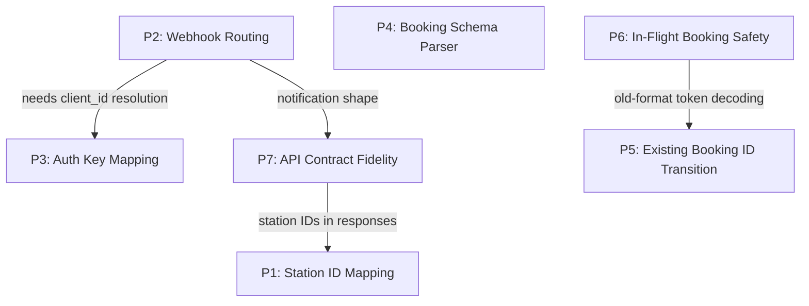

# Transition Complexity Concentrations

This document catalogs the major implementation and design challenges that arise from replacing the multi-service .NET architecture with a proxy layer over 12go. Each problem is classified by nature (implementation, decision, migration) and current resolution status.

Related documents:
- [decision-map](../../design/decision-map.md) — architectural decisions
- [migration-strategy](../../design/migration-strategy.md) — client cutover strategy
- [B-microservice design](../../design/alternatives/B-microservice/design.md) — proxy architecture

---

## Problem Index

| # | Problem | Nature | Status | Conditional? |
|---|---------|--------|--------|--------------|
| P1 | [Station ID Mapping](#p1-station-id-mapping) | Implementation + Migration | Open | No — required regardless of other decisions |
| P2 | [Webhook Routing and Client Resolution](#p2-webhook-routing-and-client-resolution) | Design + Implementation | Open | Conditional — only if we receive 12go webhooks |
| P3 | [Authentication Key Mapping](#p3-authentication-key-mapping) | Design + Implementation | Open | Conditional — depends on migration strategy (A vs B vs C) |
| P4 | [Booking Schema Parser + Reserve Request Assembler](#p4-booking-schema-parser--reserve-request-assembler) | Implementation | Open | No — required regardless |
| P5 | [Existing Booking ID Transition](#p5-existing-booking-id-transition) | Migration | Open | No — required regardless |
| P6 | [In-Flight Booking Safety During Cutover](#p6-in-flight-booking-safety-during-cutover) | Migration | Open | No — required regardless |
| P7 | [API Contract Fidelity](#p7-api-contract-fidelity) | Implementation | Open | No — required regardless |

### Resolved / Scoped Down

| # | Problem | Resolution |
|---|---------|------------|
| R1 | [Cancellation / Refund Source of Truth](#r1-cancellation--refund-source-of-truth) | **Resolved**: 12go is source of truth. All price/refund calculations done on 12go side; proxy reads amounts from 12go responses directly. |
| R2 | [Cart Expiration Risk](#r2-cart-expiration-risk) | **Scoped down**: This is a normal operational case (CreateBooking arriving too late after GetItinerary). The new service handles it as a standard error — client restarts the funnel. Not a transition-specific problem. |
| R3 | [Cancellation Policy Code Mapping](#r3-cancellation-policy-code-mapping) | **Scoped down**: Part of the broader API contract fidelity work (P7). Implementation bounded — can be extracted from existing .NET code. |
| R4 | [Pricing Translation (price_restriction → price_type)](#r4-pricing-translation) | **Scoped down**: Part of API contract fidelity (P7). Mapping is a small lookup table. |
| R5 | [Credit Line Management](#r5-credit-line-management) | **Scoped down**: Needs confirmation whether 12go enforces credit limits at API level. If yes, no work needed. If no, a thin check layer is added. |

---

## Open Problems

### P1: Station ID Mapping

**What**: Clients have Fuji station IDs (string format, e.g. `BKK1`) embedded in their systems. 12go uses different station IDs (integers) and province IDs (integers) for search. Every search request and every booking response that contains station IDs must be translated bidirectionally.

**Where it hits**:
- **Inbound**: Client sends `departures[]=BKK1` → service must translate to 12go province ID for the search URL
- **Outbound**: 12go returns `from_id: 12345` in booking details → service must translate to `BKK1` for the client
- **Stations endpoint**: `GET /v1/{client_id}/stations` returns a snapshot with Fuji IDs — the snapshot generation pipeline must continue producing Fuji-format data

**Why it's hard**:
- The mapping data currently lives in Fuji's DynamoDB tables (`Station`, `POI`, `Operator`)
- Fuji retirement means the mapping source must be migrated or replaced
- POI → province mapping adds a second layer (clients can search by POI code, which maps to a province ID via name matching)
- Station IDs change infrequently but they do change; the mapping must be refreshable

**Current design approach**: S3 artifact with periodic refresh (decision D5 in the decision map). Export the mapping table at cutover, load into memory at startup, refresh daily.

**Open questions**:
1. What is the upstream source for the mapping data after Fuji is retired?
2. Does 12go maintain a Fuji-to-12go mapping, or must we create and maintain it ourselves?
3. How many stations are in the mapping? (Determines feasibility of static config vs dynamic refresh.)

**References**: [stations.md](../endpoints/stations.md), [pois.md](../endpoints/pois.md), [decision-map D5](../../design/decision-map.md)

---

### Search Kind Support and 12go URL Format

**What**: 12go's search API natively supports all four search kinds: POI→POI, station→station, POI→station, and station→POI. The URL path uses a suffix to indicate the ID type:

| Suffix | Meaning | Example |
|--------|---------|---------|
| `p` | Province (POI) ID | `/search/1p/44p/2026-03-01` — province 1 to province 44 |
| `s` | Station ID | `/search/12345s/67890s/2026-03-01` — station to station |

Each endpoint (from/to) can independently use `p` or `s`, enabling mixed searches (e.g. `1p/67890s` for POI→station).

**Current implementation**: Our `OneTwoGoUriBuilder` always uses province IDs with the `p` suffix for both endpoints. Station-based searches are handled by mapping Fuji station IDs to their province IDs (via `AdditionalProperties["provinceId"]`) and sending province-province to 12go. This works because a province search returns all trips between any stations in those provinces.

**Why document this**:
- **Client usage investigation**: Which search kinds do clients actually use? If most traffic is station→station, we could consider using the `s` suffix for more precise results (fewer trips to filter). If POI→POI dominates, the current province-based approach is optimal.
- **Transition simplification**: Knowing that 12go supports all kinds natively reduces integration risk — we are not working around a 12go limitation.
- **Optimization opportunity**: Using `s` for station pairs could reduce response size when clients search between specific stations, though the current province-based approach benefits from one 12go call per province pair (cached in Etna SI Host).

**Open questions**:
1. What is the distribution of search kinds in production (POI→POI vs station→station vs mixed)?
2. Does 12go return different or more precise results for station→station (`s` suffix) vs province→province (`p` suffix) when both endpoints are in the same province?
3. Should the new proxy support mixed searches (POI→station, station→POI) explicitly, or is the current "always province" approach sufficient?

**References**: [search.md](../endpoints/search.md), [12go-api-surface.md](../integration/12go-api-surface.md), [pois.md](../endpoints/pois.md)

---

### P2: Webhook Routing and Client Resolution

**What**: When 12go sends a booking status webhook (`{ "bid": <long> }`), the new service must determine (a) which client owns that booking, and (b) where to forward the transformed notification.

**Why it's hard**:
- 12go sends only `bid` — no `client_id`, no `booking_id` in our format
- The service needs a `bid → client_id` association to know which client's webhook URL to call
- The service needs a `client_id → webhook_url` configuration to know where to deliver
- If the service is stateless, it has no local record of which `bid` belongs to which client

**Sub-problems**:

1. **bid → client_id resolution**: When a notification arrives, how does the service know which client to notify?
   - Option A: Call `GET /booking/{bid}` on 12go and extract client context from the response (e.g. from the `tracker` field or the API key used) — **unverified whether 12go's response contains client-identifying information**
   - Option B: Maintain a persistent `bid → client_id` lookup table, populated at reserve time — reintroduces statefulness
   - Option C: Encode the `client_id` in the webhook URL itself (e.g. `/v1/notifications/onetwogo/{client_id}`) — requires 12go to register per-client webhook URLs

2. **client_id → webhook_url mapping**: A configuration store mapping each client to their notification endpoint. This is straightforward (config file or secrets manager) but must be populated before go-live.

3. **Notification shape transformation**: 12go's notification format differs from our client-facing contract. The transformer must call 12go to get full booking details, then map to the expected shape.

**Conditional**: This problem only exists if we continue receiving 12go webhooks. If clients poll `GET /bookings/{id}` instead, or if 12go's internal event system (Kafka) can be consumed directly, the webhook receiver may not be needed.

**References**: [notifications.md](../endpoints/notifications.md), [B-microservice design — Notification Transformer](../../design/alternatives/B-microservice/design.md)

---

### P3: Authentication Key Mapping

**What**: Our clients authenticate with `client_id` (URL path) + `x-api-key` (header, validated at API Gateway). 12go's API requires `?k=<apiKey>` on every call. No mapping between these credential systems exists today.

**Why it's hard**:
- The mapping must be created from scratch — no existing table maps our client credentials to 12go API keys
- A wrong mapping is a **data leakage risk**: Client A's request executed with Client B's 12go key routes bookings to the wrong account
- The mapping must be populated and validated for **every** active client before any cutover

**Conditional**: The severity depends on the migration strategy:
- **Migration A (transparent switch)**: Mapping table is mandatory and must be 100% complete before cutover
- **Migration B (new endpoints)**: Clients could receive 12go API keys directly, potentially eliminating the mapping entirely
- **Migration C (hybrid)**: Mapping needed for search (transparent); booking could use either approach

**Current design approach**: Config file (YAML) loaded at startup, backed by AWS Secrets Manager in production (decision D4). Pre-cutover validation script tests every mapping against 12go staging.

**Open questions**:
1. Is there a separate 12go API key per client, or do multiple clients share a key?
2. If keys are shared, what is the client isolation mechanism within 12go?
3. Who creates the mapping — our team or 12go?

**References**: [authentication.md](../cross-cutting/authentication.md), [migration-strategy — Authentication Bridge](../../design/migration-strategy.md), [decision-map D3, D4](../../design/decision-map.md)

---

### P4: Booking Schema Parser + Reserve Request Assembler

**What**: The 12go `/checkout/{cartId}` endpoint returns a flat JSON object where keys are dynamic form field names. The service must parse these into a structured `PreBookingSchema` for the client, and later re-assemble a flat bracket-notation request body for `POST /reserve/{bookingId}`.

**Why it's hard**:

1. **Dynamic field parsing**: ~20 fields are matched by exact name (`contact[mobile]`, `passenger[0][first_name]`, etc.). The rest are matched by **wildcard patterns** with precedence rules:
   - `selected_seats_*` (not `_allow_auto`) → seat selection
   - `selected_seats_*_allow_auto` → auto-assignment toggle
   - `passenger[0][baggage_*` → baggage option
   - `points*[pickup]`, `points*[dropoff]`, `points*pickup*text`, `points*drop*off*point`, etc. → pickup/dropoff variations
   - `delivery*address`, `delivery*hotel*checkin` → delivery fields

   The existing .NET code (in `OneTwoGoBookingSchema`) uses `[JsonExtensionData]` and manual pattern matching. The patterns are not formally documented — they are encoded in code that reflects years of production edge cases.

2. **Field name preservation**: When assembling the reserve request, the **original** 12go field names (including variable segment identifiers in `selected_seats_{segment}`) must be used verbatim. The field names cannot be reconstructed from patterns — they must be carried from the schema parse step to the reserve step.

3. **Reserve request serialization**: The `ReserveDataRequest` uses a custom JSON converter (`FromRequestDataToReserveDataConverter`) that produces PHP bracket-notation:
   ```json
   {
     "contact[mobile]": "+66812345678",
     "passenger[0][first_name]": "John",
     "passenger[0][baggage_key]": "baggage_value",
     "selected_seats_segmentXYZ": "1A,1B"
   }
   ```
   The serialization logic handles conditional fields (only include `seattype_code` if present, `id_exp_date` if present, etc.), default values (`id_type` defaults to `"0"`), and nationality/country_id fallback logic.

**Estimated scope**: ~500 lines of parsing + assembly logic. Highest-risk component for subtle production bugs.

**Approach**: Port from existing .NET implementation rather than rewrite. The wildcard patterns and field precedence rules should be extracted as a tested specification. Unit tests against real production 12go checkout responses are the primary quality gate.

**References**: [12go-api-surface.md — GetBookingSchema](../integration/12go-api-surface.md), [get-itinerary.md](../endpoints/get-itinerary.md), [create-booking.md](../endpoints/create-booking.md)

---

### P5: Existing Booking ID Transition

**What**: The new service will use 12go's native booking ID (`bid`, a long integer) as the primary booking identifier. However, existing bookings — those created on the old system but not yet fully resolved (pending confirmation, pending cancellation, awaiting ticket) — carry our composite `BookingId` format (KLV-encoded: `contractCode + integrationId + integrationBookingId + clientId`, Caesar-cipher encrypted).

**Why it's hard**:

Clients have stored our old-format `booking_id` values. After cutover, those clients will call:
- `GET /{client_id}/bookings/{booking_id}` (GetBookingDetails)
- `GET /{client_id}/bookings/{booking_id}/ticket` (GetTicket)
- `POST /{client_id}/bookings/{booking_id}/cancel` (CancelBooking)
- `POST /{client_id}/bookings/{booking_id}/confirm` (ConfirmBooking)

...using the **old-format** ID. The new service must be able to handle these.

**The specific challenge**:
- New bookings: service issues 12go `bid` directly (or a thin wrapper around it) as `booking_id`
- Old bookings: `booking_id` is a Caesar-cipher-encrypted KLV-encoded composite string containing `integrationBookingId` (which is the 12go `bid`)

The new service must extract the 12go `bid` from old-format IDs to call 12go's API.

**Options**:

1. **Backward-compatible decoder**: The new service includes logic to detect old-format IDs (e.g. by length, prefix, or structure) and decode them — CaesarCypher.Decrypt → BookingToken/BookingId.Parse → extract `integrationBookingId`. This adds complexity but is a one-time migration bridge.

2. **Transition window with old system**: Keep the old post-booking service running during the transition period. Old-format booking IDs are routed to the old system; new bookings go through the new service. This is operationally heavier but avoids porting the decryption logic.

3. **Client-side migration**: Ask clients to re-fetch their active booking list after cutover (using a new endpoint or notification). Clients replace old IDs with new ones. This is the cleanest but requires client coordination.

**Recommendation**: Option 1 (backward-compatible decoder) is the most pragmatic. The CaesarCypher and KLV parsing logic is simple (~50 lines). The decoder can be removed after a grace period (e.g. 90 days, matching the DynamoDB TTL) when all old-format bookings have resolved.

**Note**: The reverse direction (new service issues a new-format ID, old system needs to understand it) does not apply — once a booking is created on the new system, all subsequent calls go to the new system.

**References**: [create-booking.md — BookingToken Structure](../endpoints/create-booking.md), [get-itinerary.md — Data Dependencies](../endpoints/get-itinerary.md)

---

### P6: In-Flight Booking Safety During Cutover

**What**: A booking funnel spans multiple HTTP calls: Search → GetItinerary → (SeatLock) → CreateBooking → Confirm. If the backend switches mid-funnel, the client may present a token from the old system to the new system (or vice versa), causing the request to fail.

**Why it's hard**:

The `BookingToken` issued by GetItinerary encodes a 12go `cartId` plus metadata (contractCode, integrationId, seatCount). The old system encrypts this with CaesarCypher. If the new system uses a different token format, the old token is unreadable.

Even if the token format is compatible, there's a subtler risk:
- Client searches on **old** system → gets `SearchItineraryId` in old format
- Backend switches to **new** system
- Client calls GetItinerary on **new** system with old-format ID → new system must decode the old ID format to extract the 12go `tripId` and `travelOptionId`

**Mitigations**:

1. **Per-client cutover**: Don't switch a client until their in-flight funnel sessions have completed. Since booking sessions typically complete within minutes (search to confirm), a brief pause during cutover per client is sufficient. Using a feature flag (decision map routing option 2), enable one client at a time during low-traffic hours.

2. **Backward-compatible token decoding**: Same approach as P5 — the new service includes a decoder for old-format tokens. Since the token contains the 12go `cartId` in the `IntegrationBookingToken` field, the new service can extract it and proceed normally. This makes the cutover seamless even for in-flight funnels.

3. **Accept transient failures**: For the transparent-switch approach (Migration A), accept that a small number of in-flight funnels will fail during the switch window. These are recoverable — the client retries the search and starts a new funnel. This is acceptable if the switch happens during low-traffic hours.

**Relationship to P5**: P5 covers post-booking IDs (already completed bookings). P6 covers mid-funnel tokens (bookings in progress). Both benefit from the same backward-compatible decoder approach.

**References**: [migration-strategy — In-Flight Booking Risk](../../design/migration-strategy.md), [B-microservice design — In-Flight Booking Safety](../../design/alternatives/B-microservice/design.md)

---

### P7: API Contract Fidelity

**What**: The proxy must reproduce the exact response shapes, header behaviors, and serialization conventions that clients depend on. These are individually small but collectively form a large surface area where discrepancies can break clients.

**Specific items that must be preserved or translated**:

| Convention | Current Behavior | Translation Needed |
|---|---|---|
| **Money format** | Amounts as strings (`"14.60"`), never JSON numbers | 12go returns decimals; must format to 2-decimal strings |
| **Pricing structure** | `net_price`, `gross_price` (with `price_type`), `taxes_and_fees` | Assemble from 12go's `netprice`, `price`, `agfee`, `sysfee`, `price_restriction` |
| **`price_type` mapping** | Client expects `Max`, `Min`, `Exact`, `Recommended` | 12go returns `price_restriction` as integer; need mapping table |
| **Cancellation policies** | Array of `{from: ISO8601 duration, penalty: {percentage, cost}}` | 12go returns integer `cancellation` code + `cancellation_message` + `full_refund_until`; must map to structured format |
| **`Travelier-Version` header** | `YYYY-MM-DD` format; version-specific response shaping | Must forward and apply version-conditional transformations |
| **Correlation headers** | `x-correlation-id`, `x-api-experiment`, `X-REQUEST-Id` propagated | Must forward to 12go (if supported), return in response, include in logs |
| **206 Partial Content** | Returned when 12go search has `recheck[]` entries | Must detect recheck and return 206 with polling mechanism |
| **Confirmation types** | `Instant` vs `Pending` | Map from 12go's `confirmation_time` (0 = Instant, >0 = Pending) |
| **Ticket types** | `Paper Ticket`, `Show On Screen`, `Pick Up` | Map from 12go's `ticket_type` string |
| **Booking status enum** | `reserved`, `pending`, `declined`, `approved`, `cancelled`, `failed` | Map from 12go's status strings via `OneTwoGoReservationStatusMapper` |
| **Station IDs in responses** | Fuji format in all response fields (`from_station`, `to_station`, segment stations) | Reverse-map 12go integer IDs to Fuji string IDs (ties to P1) |
| **Date/time formats** | Local times in ISO 8601; durations as ISO 8601 periods | 12go uses various formats; must normalize |
| **Error response format** | Must match existing error body shape | 12go error codes must be mapped to our error format |
| **`Deprecation` header** | Returned for outdated API versions | Must be implemented in the proxy |
| **`cut_off` and `lead_time`** | ISO 8601 duration fields on itineraries | Must derive from 12go response data |

**Approach**: Build a comprehensive contract test suite that records production responses from the old system and replays them through the new proxy, diffing outputs. Zero discrepancies required before cutover.

**References**: [api-contract-conventions.md](api-contract-conventions.md), [migration-strategy — Contract Validation Checklist](../../design/migration-strategy.md)

---

## Resolved / Scoped Down

### R1: Cancellation / Refund Source of Truth

**Decision**: 12go is the source of truth for all price and refund calculations. The new service reads amounts directly from 12go's responses (`refund_amount` from `/booking/{bid}/refund-options`, prices from `/booking/{bid}`). Denali's `RefundCalculator` and its local `CancellationPolicies`-based computation are not ported.

**Implication**: The client-facing refund amount in the cancel response will be 12go's `refund_amount` (the max option). Any historical discrepancy between Denali-calculated and 12go-calculated refunds will no longer occur.

### R2: Cart Expiration Risk

**Assessment**: Cart expiration between GetItinerary and CreateBooking is a normal operational failure mode, not a transition-specific problem. The current system masks it with DynamoDB caching (cached data survives cart expiration), but a client that takes too long between steps will fail regardless. The new service returns an appropriate error (404 or 422) and the client restarts the funnel.

### R3: Cancellation Policy Code Mapping

**Assessment**: Part of the broader API contract fidelity work (P7). 12go returns integer `cancellation` codes; clients expect structured time-windowed penalty rules. The mapping logic exists in the current .NET code and can be extracted. Bounded implementation scope.

### R4: Pricing Translation

**Assessment**: Part of P7. The `price_restriction` integer → `price_type` string mapping is a small lookup table. The `taxes_and_fees` assembly from `agfee` + `sysfee` is straightforward arithmetic. With 12go as the pricing source of truth (R1), there's no markup calculation to port — just response formatting.

### R5: Credit Line Management

**Assessment**: Needs one clarification: does 12go enforce credit limits at the API level (rejecting reserve calls when the client has insufficient credit)? If yes, no work needed in the proxy. If no, a thin credit-check layer is required — but this is a simple balance check, not the complex two-phase (reserve + confirm) credit flow that Denali currently implements.

**Action**: Confirm with 12go team whether `POST /reserve` rejects requests for clients with insufficient credit.

---

## Dependency Map

Some problems depend on or interact with others:



**P1 and P7** are tightly coupled: every response that contains station IDs must go through the station mapper. The station mapper is a prerequisite for P7 contract fidelity.

**P5 and P6** share the same solution: a backward-compatible decoder for old-format IDs and tokens. Implementing one largely solves the other.

**P2 and P3** both require a client configuration store (client_id → 12go key, client_id → webhook URL). They can share the same config infrastructure.

**P4** is largely independent — it's an internal implementation challenge with no cross-cutting dependencies.
