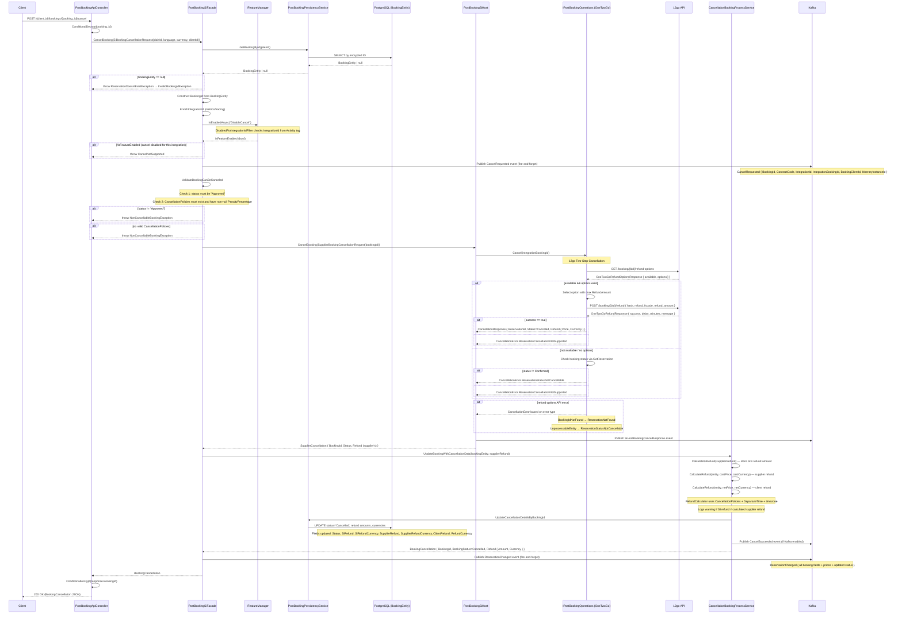

# CancelBooking

## HTTP Contract

**Endpoint:** `POST /v{version}/{client_id}/bookings/{booking_id}/cancel`

**Path Parameters:**

| Parameter   | Type   | Required | Description          |
|-------------|--------|----------|----------------------|
| `client_id` | string | yes      | Client identifier    |
| `booking_id`| string | yes      | Encrypted booking ID |

**Headers:**

| Header               | Type   | Required | Description                  |
|----------------------|--------|----------|------------------------------|
| `x-travelier-version`| date   | yes      | API version                  |
| `x-correlation-id`   | string | no       | Correlation ID for tracing   |

**Query Parameters:**

| Parameter  | Type   | Required | Description        |
|------------|--------|----------|--------------------|
| `locale`   | enum   | no       | Locale (Locales)   |
| `currency` | enum   | no       | Currency (Currencies) |

**Request Body:** None (no body required).

**Response `200 OK`:**

```json
{
  "booking_id": "string",           // plain (decrypted) booking ID
  "booking_status": "cancelled",    // enum: reserved | pending | declined | approved | cancelled | failed
  "refund": {
    "amount": "150.00",             // string, pattern ^[0-9]+.[0-9]{2}$  — client-facing refund
    "currency": "THB"               // enum (Currencies)
  }
}
```

**Error Responses:** `400`, `401`, `404`, `422` (non-cancellable), `500`

## Client Usage

The client calls this endpoint to cancel a confirmed booking and receive the refund amount. The `booking_id` in the URL is **encrypted**; the controller decrypts it. The response `booking_id` is **re-encrypted** before returning to the client.

Key client behaviors:
- Only confirmed bookings (`status == Approved`) can be cancelled
- Bookings without valid cancellation policies cannot be cancelled (returns `422`)
- The `refund.amount` is calculated by Denali based on local cancellation policies — NOT the supplier's refund amount
- The `DisableCancel` feature flag can disable cancellation for specific integrations

## Internal Flow (mermaid sequence diagram)



## 12go Equivalent

**12go (OneTwoGo) API — Two-step cancellation flow:**

### Step 1: Get Refund Options
```
GET /booking/{bookingId}/refund-options
```

**Request:** `OneTwoGoRefundOptionsRequest { BookingId: string }`

**Response:** `OneTwoGoRefundOptionsResponse`
```json
{
  "available": true,
  "options": [
    {
      "refund_amount": 150.00,       // decimal
      "refund_fxcode": "THB",        // string (currency code)
      "expires": true,               // bool
      "expires_after": "2026-02-20", // string
      "available": true,             // bool
      "available_since": "2026-02-15",// string
      "hash": "abc123..."           // string — required for refund call
    }
  ]
}
```

### Step 2: Execute Refund
```
POST /booking/{bookingId}/refund
```

**Request:** `OneTwoGoRefundRequest`
```json
{
  "hash": "abc123...",           // from refund options, validates the selected option
  "refund_fxcode": "THB",
  "refund_amount": 150.00
}
```

**Response:** `OneTwoGoRefundResponse`
```json
{
  "success": true,
  "delay_minutes": 0,
  "message": "Refund processed"
}
```

### SI Logic Summary (`OneTwoGoPostBookingOperations.Cancel`)

1. Call `GET /booking/{bid}/refund-options`
2. If `available == true` and `options` exist:
   - Select option with **maximum** `refund_amount` (`options.MaxBy(o => o.RefundAmount)`)
   - Call `POST /booking/{bid}/refund` with `{ hash, refund_fxcode, refund_amount }`
   - If `success == true`, return `CancelationResponse` with `Status=Canceled` and refund `{ Price=refund_amount, Currency=refund_fxcode }`
3. If not available or refund fails: check booking status → return appropriate error

### Denali vs 12go Refund Calculation

| Aspect | Denali | 12go |
|---|---|---|
| **Who calculates refund?** | Denali's `RefundCalculator` based on `CancellationPolicies`, `DepartureTime`, timezone | 12go provides `refund_amount` in refund options |
| **Which refund is returned to client?** | Denali-calculated `clientRefund` (based on `netPrice`) | N/A — Denali overrides |
| **Supplier refund** | Denali-calculated from `costPrice` using same policies | 12go's `refund_amount` (stored as `SiRefund` in DB) |
| **Refund mismatch logging** | Logs warning if SI refund ≠ calculated supplier refund | N/A |

## Data Dependencies

| Dependency | Type | Description |
|---|---|---|
| **PostgreSQL (BookingEntities table)** | Database | Lookup booking; update status + refund amounts after cancellation |
| **BookingEntity fields used** | Model | `PlainId`, `ContractCode`, `IntegrationId`, `IntegrationBookingId`, `ClientId`, `Status`, `CancellationPolicies`, `NetPrice`, `NetCurrency`, `CostPrice`, `CostCurrency`, `DepartureTime`, `DepartureTimeZone`, `FromStation`, `ToStation`, `PassengerCount`, `ItineraryInstanceId` |
| **CancellationPolicies** | JSONB column | List of `{ FromPeriod, PenaltyAmount, PenaltyCurrency, PenaltyPercentage }`. Must exist for cancellation to proceed. |
| **FeatureManager (DisableCancel)** | Feature flag | `DisabledForIntegrationIdFilter` checks if IntegrationId is in disallowed list. If flag evaluates false → cancel is blocked. |
| **PostBookingSiHost** | Service | Calls SI library to execute cancellation on supplier side |
| **OneTwoGoPostBookingOperations.Cancel** | SI impl | Two-step: refund-options → refund against 12go API |
| **CancellationBookingProcessService** | Service | Calculates refund amounts, updates DB, publishes events |
| **RefundCalculator** | Utility | Calculates refund based on cancellation policies, departure time, and timezone |
| **IStationIdMapper** | Service | Looks up timezone by station ID and integration (fallback if `DepartureTimeZone` is null) |
| **Kafka** | Message bus | Four events published: `CancelRequested`, `SiHostBookingCancelResponse`, `CancelSucceeded`, `ReservationChanged` |
| **ConditionalCypher** | Service | Encrypts/decrypts booking IDs |

### Kafka Events Published

| Event | When | Key Fields |
|---|---|---|
| `CancelRequested` | Before validation/execution | BookingId, ContractCode, IntegrationId, IntegrationBookingId, BookingClientId, ItineraryInstanceId |
| `SiHostBookingCancelResponse` | After SI returns success | BookingId, Refund (supplier), BookingStatus |
| `CancelSucceeded` | After DB update | BookingId, OperatorBookingId, NumberOfSeats, CancelledAt, SupplierRefund, ClientRefund, BookingStatus, ItineraryInstanceId |
| `CancelFailed` | On any exception | BookingId, FailureCode="0", FailureDescription=null, ItineraryInstanceId |
| `ReservationChanged` | After successful cancel | All booking fields + all price fields (net, cost, reserve, estimate) |

## What Can Go Away

| Component | Can it go away? | Rationale |
|---|---|---|
| **PostgreSQL booking lookup + update** | Potentially | 12go stores booking state. But Denali needs CancellationPolicies and pricing data for its own refund calculation. If we defer refund calculation to 12go, DB is not needed. |
| **CancellationPolicies storage + RefundCalculator** | Potentially | Denali calculates its own refund based on policies stored at booking time. 12go provides a `refund_amount` in the refund-options response. If we trust 12go's refund amount, Denali's calculation is redundant. |
| **DisableCancel feature flag** | Review | Used to block cancellation for specific integrations. May still be needed as a business rule even with direct 12go integration. |
| **Denali refund vs SI refund comparison** | Yes (for 12go direct) | Currently logs a warning when they differ. If using 12go's refund directly, there's no comparison needed. |
| **BookingId encryption** | Yes (for 12go direct) | Same as GetBookingDetails — not needed if using 12go's native ID. |
| **Kafka events (5 events)** | Review per event | Some events may be consumed by downstream systems (analytics, notifications). Need to identify consumers before removing. |
| **CancellationBookingProcessService** | Potentially | The refund calculation + DB update + event publishing service. If 12go handles the refund and we don't need local state, most of this goes away. |
| **PostBookingSiHost cancel flow** | Simplifies | Currently wraps SI call with error mapping. Direct 12go integration would call refund-options + refund directly. |

## Open Questions

1. **Can we use 12go's `refund_amount` as the client-facing refund?** Currently Denali overrides with its own calculation from CancellationPolicies. Is the business OK with using the supplier's refund amount directly?
2. **What consumes the Kafka events?** Need to identify all consumers of `CancelRequested`, `CancelSucceeded`, `CancelFailed`, `ReservationChanged`, `SiHostBookingCancelResponse` before removing them.
3. **Is the two-step refund flow (refund-options → refund) required?** Or can 12go cancel in a single call? The current flow always picks the max refund option — is that the correct business rule?
4. **What happens with partial refunds / time-based penalties?** Denali's `RefundCalculator` applies penalty percentages based on time-to-departure. Does 12go's refund-options already account for this, or is it a flat amount?
5. **Is the `DisableCancel` feature flag checked per-integration or globally?** The `DisabledForIntegrationIdFilter` suggests per-integration. How should this work in the new system?
6. **The `CancelRequested` event is published BEFORE validation.** This means events may be emitted for bookings that fail validation (wrong status, no policies). Is this intentional for audit purposes?
7. **Error handling: `CancelFailed` event always has `FailureCode=0` and `FailureDescription=null`.** Should these be more descriptive in the new system?
