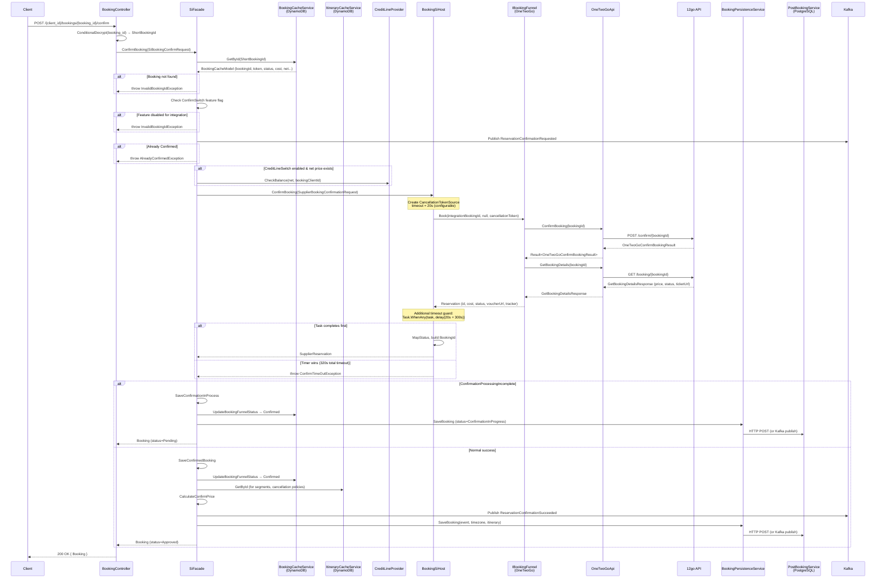

# ConfirmBooking

## HTTP Contract

| Field | Value |
|-------|-------|
| **Method** | `POST` |
| **Path** | `/v{version}/{client_id}/bookings/{booking_id}/confirm` |
| **Auth** | API Key (`x-api-key` header) |

### Path Parameters

| Name | Type | Description |
|------|------|-------------|
| `client_id` | `string` | Client identifier |
| `booking_id` | `string` | Encrypted booking ID (Caesar cipher). Decrypted server-side via `ConditionalCypher.ConditionalDecrypt()` |

### Headers

| Name | Required | Description |
|------|----------|-------------|
| `x-travelier-version` | Yes | API version (date format) |
| `x-correlation-id` | No | Flow correlation ID (pattern: `^[A-Za-z0-9\-=]{1,100}$`) |

### Query Parameters

| Name | Type | Required | Description |
|------|------|----------|-------------|
| `locale` | `Locales` enum | No | Response locale |
| `currency` | `Currencies` enum | No | Requested currency |

### Response `200 OK`

Returns a `Booking` object:

```yaml
type: object
properties:
  id:                    # string - reservation ID (encrypted BookingId)
  status:                # BookingStatus enum (Approved, Pending, etc.)
  from_station:          # string - TC station ID
  to_station:            # string - TC station ID
  departure_time:        # datetime - local departure of first segment
  passenger_count:       # integer - number of seats booked
  integration:           # string - supplier identifier
  integration_booking_id: # string - supplier's booking ID
  operator_booking_id:   # string - operator's booking ID
  voucher_url:           # string - ticket PDF URL
  created_at:            # datetime
  updated_at:            # datetime
  total_price:           # object { amount: string, currency: Currencies }
```

### Response `202 Accepted` (async flow)

When `EnableAsyncFlow` feature flag is enabled and the operation takes too long:
- Returns `202 Accepted`
- `Location` header points to `/incomplete_results/{id}` for polling

### Error Responses

| Code | Condition |
|------|-----------|
| `400` | Invalid request |
| `401` | Unauthorized |
| `404` | Booking not found |
| `409` | Already confirmed (`AlreadyConfirmedException`) |
| `422` | Unprocessable (cost mismatch, credit exceeded, etc.) |
| `500` | Internal server error |

## Client Usage

Clients call this endpoint **after** a successful `CreateBooking` (reserve) step. The `booking_id` in the URL is the encrypted ID returned from the reserve step.

**Preconditions:**
1. A booking must exist in DynamoDB with status `Reserved` (created via `POST /{client_id}/bookings`)
2. The `booking_id` must be a valid encrypted `BookingId`

**Typical flow:**
1. Client sends `POST /{client_id}/bookings/{booking_id}/confirm`
2. Server decrypts `booking_id` → gets `ShortBookingId`
3. Server confirms with supplier and returns updated `Booking` with status `Approved` or `Pending`

## Internal Flow



## 12go Equivalent

### Supplier API Call

| Step | 12go API | Method | Path |
|------|----------|--------|------|
| 1. Confirm | OneTwoGoApi.ConfirmBooking | `POST` | `/confirm/{bookingId}` |
| 2. Get details | OneTwoGoApi.GetBookingDetails | `GET` | `/booking/{bookingId}` |

### OneTwoGoBookingFunnel.Book() logic

1. Call `_oneTwoGoApi.ConfirmBooking(resId)` → `POST /confirm/{bookingId}`
2. Call `_oneTwoGoApi.GetBookingDetails(resId)` → `GET /booking/{bookingId}`
3. Extract `SellerPrice.NetPrice` and `SellerPrice.FxCode` (currency)
4. Map `details.Status` via `OneTwoGoReservationStatusMapper.MapReservationStatus()`
5. Return `Reservation(bookingId, cost, status, ticketUrl, operatorBookingId=tracker)`

### Response mapping

| 12go field | Maps to |
|------------|---------|
| `success.BId` | `Reservation.Id` → `BookingId.IntegrationBookingId` |
| `details.SellerPrice.NetPrice` | `Reservation.Cost.Amount` |
| `details.SellerPrice.FxCode` | `Reservation.Cost.Currency` |
| `details.Status` | `Reservation.Status` (mapped) |
| `details.TicketUrl` | `Reservation.VoucherUrl` |
| `details.Tracker` | `Reservation.OperatorBookingId` |

## Data Dependencies

### Read (inputs)

| Store | Key | Data | Purpose |
|-------|-----|------|---------|
| **BookingCacheService** (DynamoDB) | `ShortBookingId` | `BookingCacheModel` — bookingId, bookingToken, itineraryId, cost, net, estimatedNet, estimatedCost, passengerCount, bookingFunnelStatus, experimentId, departureTimeZone, fromStation, toStation, departureTime, bookingData, operatorBookingId, gross, grossPriceType | Primary booking state from reserve step |
| **ItineraryCacheService** (DynamoDB) | `itineraryId.ToString()` | `ItineraryCacheModel` — segments, itinerary (pricing, cancellationPolicies), vehicles, experimentId, departureTimeZone | Trip details, pricing, cancellation policies |
| **PreBookingCacheService** (DynamoDB) | `bookingToken.ToString()` | `PreBookingCacheModel` — bookingSchema, itineraryId, nextFlowId, lockedSeats | Schema for price recalculation |

### Write (outputs)

| Store | Operation | Data |
|-------|-----------|------|
| **BookingCacheService** (DynamoDB) | `UpdateBookingFunnelStatus` | Sets status to `Confirmed` |
| **PostBookingService** (PostgreSQL) | `SaveBooking` via `BookingPersistenceService` | Full `BookingEntity` — id, plainId, contractCode, integrationId, integrationBookingId, netPrice, costPrice, status, cancellationPolicies, reserveDetails, segments, vehicles, gross, points, etc. |
| **Kafka** | `ReservationConfirmationRequested` | Before confirmation attempt |
| **Kafka** | `ReservationConfirmationSucceeded` | After successful confirmation — contains full booking + pricing breakdown (baseNet, baseCost, addonsNet, addonsCost, totalNet, totalCost, reservationNet, reservationCost, estimatedNet, estimatedCost, gross) |
| **Kafka** | `ReservationConfirmationFailed` | On any exception |
| **Kafka** | `BookingEntity` (via `BookingEntityBuilder`) | When `PublishConfirmBookingEvents` flag is enabled (alternative to direct HTTP persistence) |

### External Services

| Service | Purpose |
|---------|---------|
| **CreditLineProvider** | Balance check before confirmation (when `CreditLineSwitch` enabled) |
| **PriceService** | `CalculateConfirmPrice` — recalculates net/cost/addons with confirm-time data |
| **FeatureManager** | Multiple flags: `ConfirmSwitch`, `CreditLineSwitch`, `UseOldFlowPerClient`, `EnableAsyncFlow`, `PublishConfirmBookingEvents`, `KafkaPublishSwitch` |

## What Can Go Away

1. **Dual DB writes** — Currently writes to both DynamoDB (`BookingCacheService.UpdateBookingFunnelStatus`) AND PostgreSQL (`PostBookingService`). In a simplified architecture, only one persistent store is needed. DynamoDB booking cache can be replaced by a single PostgreSQL write.

2. **Three-layer DynamoDB cache chain** — `ItineraryCacheService` + `PreBookingCacheService` + `BookingCacheService` are all DynamoDB tables carrying state between funnel steps. This could be consolidated into a single booking session store.

3. **Feature flag complexity** — `ConfirmSwitch`, `CreditLineSwitch`, `UseOldFlowPerClient`, `EnableAsyncFlow`, `PublishConfirmBookingEvents`, `KafkaPublishSwitch` — at least 6 flags control this flow. Many are per-integration toggles for migration. Once 12go is fully migrated, most can be removed.

4. **Old method branching** — `UseOldMethod()` + `UseOldFlowPerClient` flag creates two parallel paths through the entire flow. The old `supplierAdapterFactory` path can be removed once all integrations use the new `BookingSiHost` path.

5. **Caesar cipher encryption/decryption** — `booking_id` is encrypted in transit. With proper auth, this obfuscation layer could be simplified or removed.

6. **Async flow (202 Accepted + polling)** — The `EnableAsyncFlow` + `IncompleteResultsService` adds complexity. If timeouts are handled properly at the SI layer, the sync path may suffice.

7. **Post-confirm GetBookingDetails call** — 12go's `Book()` calls `ConfirmBooking` then immediately calls `GetBookingDetails` to get the price. If the confirm response itself returns the price, this extra call can be eliminated.

8. **ConfirmationProcessingIncomplete handling** — Special handling for suppliers that return incomplete confirmations. If 12go doesn't exhibit this behavior, this entire branch can be removed for the 12go-specific flow.

9. **Kafka event proliferation** — `ReservationConfirmationRequested`, `ReservationConfirmationSucceeded`, `ReservationConfirmationFailed`, `BookingEntity` — 4 different events. Can be consolidated.

10. **Price recalculation at confirm time** — `CalculateConfirmPrice` re-computes pricing from multiple cache sources. If reserve-time pricing is trusted, this step can be simplified.

## Open Questions

1. **Is the 320-second total timeout (20s + 300s) actually needed for 12go?** The `ConfirmTimeoutInSeconds` (20s) + `AdditionalTimeoutInSeconds` (300s) seem designed for slow suppliers. What is 12go's typical confirm latency?

2. **Can DynamoDB booking cache be fully replaced by PostgreSQL?** Currently both are written to. What reads depend on the DynamoDB `BookingCacheModel` after confirmation?

3. **What consumes the `ReservationConfirmationSucceeded` Kafka event?** Is it only for the post-booking persistence, or do other services depend on it?

4. **What happens when `PostBookingClient.Send()` fails?** The `BookingPersistenceService` catches the exception and logs it but does NOT rethrow — meaning the confirm returns success to the client even if persistence fails. Is this acceptable?

5. **Is the `ConfirmSwitch` feature flag still needed?** It gates the entire confirm flow per-integration. Is there a scenario where we'd want to disable confirms for 12go?

6. **What is the actual behavior of `ConfirmationProcessingIncompleteException` for 12go?** Does the 12go integration ever throw this? If not, the `SaveConfirmationInProcess` branch is dead code for this supplier.

7. **Credit line check happens twice** — once at reserve (`BookingReservation`) and again at confirm. Is the confirm-time check necessary, or is it a safety net for long gaps between reserve and confirm?

8. **ExperimentId flow** — `SetExperimentId` injects experiment context from cache. How is this used downstream, and does it need to survive the transition?
