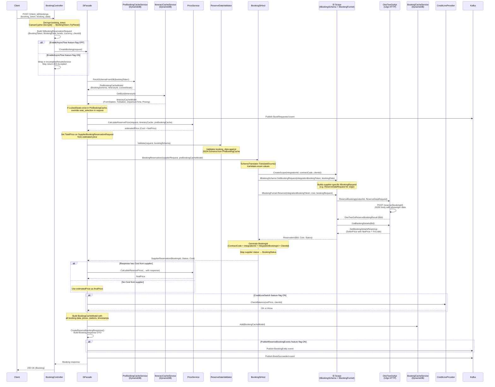

# CreateBooking (Reserve)

## HTTP Contract

### Endpoint

```
POST /v{version}/{client_id}/bookings
```

### Headers

| Header | Required | Description |
|---|---|---|
| `x-travelier-version` | Yes | API version (date format) |
| `x-correlation-id` | No | Correlation ID for flow tracing (pattern: `^[A-Za-z0-9\-=]{1,100}$`) |
| `x-api-key` | Yes | API key authentication |

### Query Parameters

| Parameter | Required | Description |
|---|---|---|
| `locale` | No | Locale of the data (enum `Locales`) |
| `currency` | No | Requested currency (enum `Currencies`) |

### Request Body (`BookingRequest`)

```json
{
  "booking_token": "string (required, encrypted)",
  "total_price": {
    "currency": "USD",
    "amount": "123.45"
  },
  "booking_data": {
    "email": "string",
    "mobile_phone": "string",
    "seat_selection": ["string"],
    "allow_automatic_seat_selection": true,
    "additional_fields": { "key": "value" },
    "upgrades": { "key": "value" },
    "passengers": [
      {
        "title": "string",
        "first_name": "string",
        "last_name": "string",
        "middle_name": "string",
        "id_number": "string",
        "seat_type_code": "string",
        "id_type": "string",
        "country_id": "string",
        "gender": "string",
        "is_child": false,
        "dob": "string",
        "id_expiry_date": "string",
        "id_issue_date": "string",
        "id_scan": "string",
        "baggage_option": "string",
        "nationality": "string",
        "residency": "string",
        "visa_type": "string",
        "visa_reason": "string"
      }
    ]
  }
}
```

**Required fields:** `booking_token`, `booking_data`

### Response (`Booking`) - `200 OK`

```json
{
  "id": "string (encrypted BookingId)",
  "status": "reserved | confirmed | cancelled | pending",
  "from_station": "string (TC station ID)",
  "to_station": "string (TC station ID)",
  "departure_time": "2023-10-05T08:30:00",
  "passenger_count": 2,
  "integration": "string (supplier name)",
  "integration_booking_id": "string",
  "operator_booking_id": "string",
  "voucher_url": "string (null for reserve)",
  "updated_at": "2023-10-02T10:15:00",
  "created_at": "2023-10-02T10:00:00",
  "total_price": {
    "currency": "USD",
    "amount": "123.45"
  }
}
```

### Response - `202 Accepted` (Async Flow)

When `EnableAsyncFlow` feature flag is on, the endpoint may return `202 Accepted` with a `Location` header pointing to `/incomplete_results/{id}` for polling.

### Error Responses

| Status | Description | When |
|---|---|---|
| `400` | Bad Request | Invalid request data, schema validation failure |
| `401` | Unauthorized | Invalid API key |
| `402` | Payment Required | Credit line exceeded |
| `404` | Not Found | PreBookingSchema or ItineraryCache not found in DynamoDB |
| `409` | Conflict | Booking already reserved for this product |
| `422` | Unprocessable | Schema mismatch, seat unavailable, cost mismatch, product not available |
| `500` | Internal Server Error | Unexpected failures |

---

## Client Usage

1. Client calls `GET /{client_id}/itineraries/{itinerary_id}` to get itinerary details + booking schema + encrypted `booking_token`
2. Client fills out booking form per the schema definition (passengers, contact info, seat selection)
3. Client sends `POST /{client_id}/bookings` with the encrypted `booking_token` and `booking_data`
4. On `200`: reservation is complete, client receives `Booking` with `status: reserved` and the `id` (encrypted `BookingId`)
5. On `202`: client polls `GET /{client_id}/incomplete_results/{id}` until result is ready
6. Client proceeds to `POST /{client_id}/bookings/{booking_id}/confirm` to confirm the reservation

### BookingToken Lifecycle

The `booking_token` is an opaque encrypted string that carries state between GetItinerary and CreateBooking:

- **Generated during** `GetItinerary` / `GetBookingSchema`
- **Encrypted** with `CaesarCypher.Encrypt()` before returning to client
- **Decrypted** with `CaesarCypher.Decrypt()` on CreateBooking entry
- **Parsed** into `BookingToken` record via `BookingToken.TryParse()` (KLV-encoded)

---

## Internal Flow



---

## BookingToken Structure

`BookingToken` is a KLV-encoded record (`Denali.BookingIdType.Types.BookingToken`) with the following fields:

| Field | Type | Encoding Order | Description |
|---|---|---|---|
| `ContractCode` | `string` | 2 | Contract code for the supplier agreement |
| `IntegrationId` | `string` | 3 | Supplier integration identifier |
| `IntegrationBookingToken` | `string` | 4 | Supplier-specific product/cart ID (e.g., 12go cartId) |
| `SeatCount` | `int` | 5 | Number of seats requested |
| `UniqueId` | `string` | 6 | Unique identifier for this booking token instance |

**Encryption flow:**
- On `GetItinerary` response: `CaesarCypher.Encrypt(bookingToken.ToString())` → opaque string returned to client
- On `CreateBooking` entry: `CaesarCypher.Decrypt(bookingToken)` → `BookingToken.TryParse()` → structured `BookingToken`

---

## Schema Validation

The `IReserveDataValidator.Validate()` method validates the submitted `booking_data` against the JSON Schema (`JSchema`) stored in the `PreBookingCacheModel.BookingSchema`.

This schema was built during `GetItinerary`/`GetBookingSchema` step and saved to DynamoDB. It defines:
- Which passenger fields are required (first_name, last_name, id_number, etc.)
- Field formats and regex patterns
- Available enum options (gender, id_type, title, nationality, etc.)
- Whether seat selection is required/allowed
- Contact field requirements (email, mobile_phone)

---

## DynamoDB Writes

### Tables Read

| Table | Key | Read During | Purpose |
|---|---|---|---|
| PreBookingCache | `BookingToken.ToString()` | Start of `BookingReservation` | Retrieve booking schema, ItineraryId, LockedSeats, field name mappings |
| ItineraryCache | `ItineraryId.ToString()` | Start of `BookingReservation` | Retrieve station info, departure time, pricing, segments |

### Tables Written

| Table | Key | Written During | Data |
|---|---|---|---|
| BookingCache | `BookingId.ToString()` | After successful reservation | Full `BookingCacheModel`: BookingId, BookingToken, ItineraryId, stations, departure, passenger count, Cost, Net, EstimatedCost, EstimatedNet, BookingData, BookingFunnelStatus=Reserved, CreditStatus=Reserved, ExperimentId, Gross, GrossPriceType, OperatorBookingId, ContractCode, IntegrationId, IntegrationBookingId, BookingClientId |

### BookingCacheModel Fields

| Field | Type | Source |
|---|---|---|
| `BookingId` | `BookingId` | Generated by `BookingId.Generate()` |
| `BookingToken` | `BookingToken` | From request |
| `ItineraryId` | `ItineraryId` | From PreBookingCache |
| `FromStation` | `string` | From ItineraryCache |
| `ToStation` | `string` | From ItineraryCache |
| `DepartureTime` | `DateTime` | From ItineraryCache |
| `PassengerCount` | `int` | From `BookingData.Passengers.Count` |
| `Cost` | `Price` | Final cost from PriceService |
| `Net` | `Price` | Final net price from PriceService |
| `EstimatedCost` | `Price` | Estimated cost (before supplier response) |
| `EstimatedNet` | `Price` | Estimated net (before supplier response) |
| `BookingData` | `BookingRequestBookingData` | From request |
| `BookingFunnelStatus` | `BookingFunnelStatus` | Set to `Reserved` |
| `CreditStatus` | `CreditStatus` | Set to `Reserved` |
| `Gross` | `Price?` | From supplier response (if provided) |
| `GrossPriceType` | `string?` | From supplier response |
| `OperatorBookingId` | `string?` | From supplier response |
| `ExpiredAt` | `int` (unix epoch) | UTC now + `ExpirationTimeInMinutes` (default 7200 min) |
| `ConfirmationDeadLine` | `int` (unix epoch) | UTC now + `ConfirmationDeadLineInMinutes` (default 1440 min) |

---

## Kafka Events Published

### 1. `BookRequested` (always published, even on failure)

Published at the start of the reservation flow. Contains BookingToken, ItineraryId, ContractCode, IntegrationId.

### 2. `BookSucceeded` (on success)

Published after successful reservation. Contains comprehensive pricing and booking data:

| Field | Source |
|---|---|
| `BookingId` | Generated `BookingId` |
| `ContractCode`, `IntegrationId`, `IntegrationBookingId`, `BookingClientId` | From `BookingId` components |
| `FromStationId`, `ToStationId` | From response |
| `Departure` | From `BookingCacheModel.DepartureTime` |
| `NumberOfSeats` | From `BookingCacheModel.PassengerCount` |
| `ItineraryId` | From `PreBookingCacheModel` |
| `ReservationStatus` | From response status |
| `BookingToken` | From request |
| `ClientCurrency`, `SupplierCurrency` | From price |
| `BaseNet`, `BaseCost` | From ItineraryCache pricing |
| `AddonsNet`, `AddonsCost`, `AddonsDetails` | From calculated price |
| `TotalNet`, `TotalCost` | Final prices |
| `EstimatedNet`, `EstimatedCost` | Pre-supplier prices |
| `TotalGross`, `ReservationGrossType` | From supplier response |
| `ItineraryInstanceId` | From ItineraryCache |

### 3. `BookingEntity` (conditional: `PublishReserveBookingEvents` flag)

Full booking entity event built from BookingCacheModel, ItineraryCacheModel, SupplierReservation, and PreBookingCacheModel.

### 4. `BookFailed` (on failure)

Published when reservation fails. Contains BookingToken, ItineraryId, failure code, and description.

---

## 12go Equivalent

### Reserve Call

| Aspect | Denali | 12go (OneTwoGo) |
|---|---|---|
| **HTTP** | `POST /{client_id}/bookings` | `POST /reserve/{bookingId}` |
| **Identifier** | Encrypted `BookingToken` | `bookingId` = `IntegrationBookingToken` from BookingToken (this is the 12go cartId) |
| **Request** | `BookingRequest` (generic schema) | `ReserveDataRequest` (12go-specific flat structure) |
| **Response** | `Booking` (normalized) | `OneTwoGoReserveBookingResult` → then `GetBookingDetails` for price |

### 12go `POST /reserve/{bookingId}` - Request Body (`ReserveDataRequest`)

The `ReserveDataRequest` is serialized with a custom `FromRequestDataToReserveDataConverter` into a flat key-value JSON structure:

```json
{
  "contact[mobile]": "+66812345678",
  "contact[email]": "user@example.com",
  "seats": 2,
  "selected_seats": "1A,1B",
  "allow_selected_seats": true,
  "passenger[0][id_no]": "AB123456",
  "passenger[0][id_type]": "0",
  "passenger[0][country_id]": "TH",
  "passenger[0][first_name]": "John",
  "passenger[0][last_name]": "Doe",
  "passenger[0][middle_name]": "",
  "passenger[0][title]": "Mr",
  "passenger[0][gender]": "M",
  "passenger[0][seattype_code]": "ST1",
  "passenger[0][dob]": "1990-01-01",
  "passenger[0][is_child]": false,
  "passenger[0][id_exp_date]": "2030-01-01",
  "passenger[0][id_issue_date]": "2020-01-01",
  "passenger[0][id_scan]": "base64...",
  "passenger[0][baggage_key]": "baggage_value"
}
```

### `ReserveDataRequest` Fields

| Field | Type | Maps From (Denali `BookingRequestBookingData`) |
|---|---|---|
| `Mobile` | `string?` | `mobile_phone` |
| `Email` | `string?` | `email` |
| `Seats` | `int?` | `passengers.Count` |
| `Passengers[].IdType` | `string?` | `passengers[].id_type` |
| `Passengers[].IdNo` | `string?` | `passengers[].id_number` |
| `Passengers[].CountryId` | `string?` | `passengers[].country_id` |
| `Passengers[].Nationality` | `string?` | `passengers[].nationality` |
| `Passengers[].FirstName` | `string?` | `passengers[].first_name` |
| `Passengers[].MiddleName` | `string?` | `passengers[].middle_name` |
| `Passengers[].LastName` | `string?` | `passengers[].last_name` |
| `Passengers[].Title` | `string?` | `passengers[].title` |
| `Passengers[].Gender` | `string?` | `passengers[].gender` |
| `Passengers[].SeatType` | `string?` | `passengers[].seat_type_code` |
| `Passengers[].IsChild` | `bool?` | `passengers[].is_child` |
| `Passengers[].DOB` | `string?` | `passengers[].dob` |
| `Passengers[].IdExpiryDate` | `string?` | `passengers[].id_expiry_date` |
| `Passengers[].IdIssueDate` | `string?` | `passengers[].id_issue_date` |
| `Passengers[].IdScan` | `string?` | `passengers[].id_scan` |
| `Passengers[].Baggage` | `Tuple<string,string>?` | `passengers[].baggage_option` (key from schema) |
| `SelectedSeats` | `Tuple<string,List<string>>?` | `seat_selection` |
| `AllowSelectedSeats` | `Tuple<string,bool>?` | `allow_automatic_seat_selection` |
| `AdditionalFields` | `Dict<string,string>?` | `additional_fields` |

### 12go Reserve Flow (inside `OneTwoGoBookingFunnel.Reserve`)

1. Cast `IBookingRequest` to `ReserveDataRequest`
2. Call `_oneTwoGoApi.ReserveBooking(productId, request)` → `POST /reserve/{bookingId}`
3. On success: get `OneTwoGoReserveBookingResult.BId`
4. Call `_oneTwoGoApi.GetBookingDetails(BId)` to get seller price (net price + currency)
5. Return `Reservation(BId, Cost(netPrice, currency), PendingClientConfirmation, null)`

---

## Data Dependencies

### Upstream (required before CreateBooking)

| Dependency | Source | Purpose |
|---|---|---|
| `BookingToken` | `GetItinerary` response (encrypted) | Identifies the product + contract + integration for this booking |
| `PreBookingCacheModel` | DynamoDB (written during `GetItinerary`/`GetBookingSchema`) | Contains JSON Schema for validation, ItineraryId, field name mappings, locked seats |
| `ItineraryCacheModel` | DynamoDB (written during `GetItinerary`) | Contains stations, departure time, segments, pricing baseline |
| `Booking Schema` | Dynamic per supplier, stored in PreBookingCache | Defines which passenger fields are required |

### External Services Called

| Service | Call | Purpose |
|---|---|---|
| **DynamoDB** (PreBookingCache) | `GetById(bookingToken)` | Retrieve schema + itinerary reference |
| **DynamoDB** (ItineraryCache) | `GetById(itineraryId)` | Retrieve trip details for booking response |
| **PriceService** | `CalculateReservePrice()` | Calculate estimated + final prices (markup, exchange rates) |
| **CreditLineProvider** | `CheckBalance(netPrice, clientId)` | Verify client has sufficient credit (feature-flagged) |
| **Supply Integration** | `IBookingFunnel.Reserve()` | Make the actual reservation with the supplier |
| **DynamoDB** (BookingCache) | `Add(bookingCacheModel)` | Persist booking state for confirmation step |
| **Kafka** | `PublishMessage()` | Emit `BookRequested`, `BookSucceeded`/`BookFailed`, `BookingEntity` events |

### Feature Flags

| Flag | Effect |
|---|---|
| `EnableAsyncFlow` | When ON: wraps call in `IncompleteResultsService`, may return 202 |
| `UseOldFlowPerClient` | When ON + provider in old method list: uses legacy `SupplierAdapter` instead of `BookingSiHost` |
| `CreditLineSwitch` | When ON: checks credit line balance before allowing reservation |
| `PublishReserveBookingEvents` | When ON: publishes `BookingEntity` Kafka event |
| `ShowIdsInReserve` | When ON: includes `integration_booking_id` and `operator_booking_id` in response |
| `GenerateShortBookingIdPerClient` | When ON: generates short BookingId format instead of KLV |

---

## What Can Go Away

### In New Architecture

1. **CaesarCypher encryption/decryption of BookingToken** - The BookingToken is encrypted/decrypted at the API boundary with a simple Caesar cipher. A new system could use proper signing or eliminate the need for an opaque token by passing structured IDs directly.

2. **DynamoDB PreBookingCache** - The entire pattern of saving booking schema to DynamoDB during GetItinerary and reading it back during CreateBooking exists because the schema must survive across HTTP calls. If the booking flow is simplified or the schema is carried in the token/request, this cache can be eliminated.

3. **DynamoDB ItineraryCache** - Station info, departure time, and pricing are cached from the GetItinerary step. If the new system can retrieve these at confirm time or include them in the request, this can go away.

4. **DynamoDB BookingCache** - Currently stores the full booking state for the confirm step. If the new architecture handles reserve+confirm differently (e.g., single-step or with the supplier holding state), this intermediary cache is unnecessary.

5. **Two-phase price calculation** - The current flow calculates an estimated price before calling the supplier, then recalculates with the supplier's actual cost. This double-calculation adds complexity. A simpler flow could trust the supplier's price directly.

6. **Legacy `SupplierAdapter` path** - The `UseOldFlowPerClient` flag and `SupplierAdapterFactory` represent a deprecated code path. Once migration is complete, this branch can be removed entirely.

7. **`SiObjectMapper` transformations** - Multiple DTO-to-DTO mappings between layers (`SiBookingReservationRequest` → `SupplierBookingReservationRequest` → SI `IBookingRequest`). Reducing the number of intermediary models would simplify the flow.

8. **`SchemaTranslator.TranslateEnums()`** - Enum translation between Denali's schema definitions and supplier-specific values. If the new system uses a consistent enum mapping or the supplier accepts standard values, this can be simplified.

9. **`IncompleteResultsService` async wrapper** - The 202 Accepted / polling pattern is a workaround for slow supplier APIs. If the new system uses proper async (WebSockets, webhooks, or faster APIs), this complexity can be removed.

10. **Kafka event proliferation** - `BookRequested`, `BookSucceeded`, `BookFailed`, `BookingEntity` are 3-4 separate events for a single operation. These could be consolidated into a single event with a status field.

---

## Open Questions

1. **Credit line check timing** - The credit line check happens _after_ the supplier reservation succeeds. What happens if the credit check fails? Is the supplier reservation orphaned? How is it cleaned up?

2. **Price mismatch handling** - What is the acceptable threshold between estimated price and supplier-returned price? The code calculates both but the tolerance logic isn't clear from the reservation flow alone.

3. **BookingToken security** - CaesarCypher is a trivial cipher. Is this intentional (obscuring, not securing), or should the new system use proper encryption/signing?

4. **Schema validation completeness** - The JSON Schema validation runs against `PreBookingCacheModel.BookingSchema`. How stale can this schema be? If the supplier updates schema between GetItinerary and CreateBooking, validation may pass but the supplier rejects.

5. **Locked seats override** - If `PreBookingCacheModel.LockedSeats` exists, the request's `seat_selection` is silently overridden. Is this documented behavior for clients?

6. **12go `GetBookingDetails` after reserve** - The OneTwoGo integration makes an additional API call to get the seller price after reserve. Is this an extra round-trip that could be avoided if the reserve response included pricing?

7. **ExperimentId tracking** - The experiment ID flows from ItineraryCache through to Kafka events. What downstream system consumes this, and does it need to survive the transition?

8. **DynamoDB TTL configuration** - `ExpirationTimeInMinutes` defaults to 7200 (5 days) and `ConfirmationDeadLineInMinutes` defaults to 1440 (1 day). Are these appropriate for the new architecture, or can they be tightened?

9. **`BookingEntity` event consumers** - Which downstream systems depend on the `BookingEntity` Kafka event (behind `PublishReserveBookingEvents` flag), and do they need it in the new architecture?

10. **Gross price handling** - Some suppliers return a gross price (with `GrossPriceType`). How is this used downstream, and does the new architecture need to support it?
