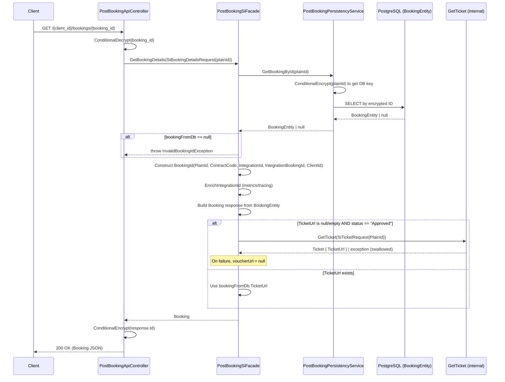

# GetBookingDetails

## HTTP Contract

**Endpoint:** `GET /v{version}/{client_id}/bookings/{booking_id}`

**Path Parameters:**

| Parameter   | Type   | Required | Description          |
|-------------|--------|----------|----------------------|
| `client_id` | string | yes      | Client identifier    |
| `booking_id`| string | yes      | Encrypted booking ID |

**Headers:**

| Header               | Type   | Required | Description                  |
|----------------------|--------|----------|------------------------------|
| `x-travelier-version`| date   | yes      | API version                  |
| `x-correlation-id`   | string | no       | Correlation ID for tracing   |

**Query Parameters:**

| Parameter  | Type   | Required | Description        |
|------------|--------|----------|--------------------|
| `locale`   | enum   | no       | Locale (Locales)   |
| `currency` | enum   | no       | Currency (Currencies) |

**Response `200 OK`:**

```json
{
  "id": "string",                    // encrypted booking ID (string)
  "status": "approved",              // enum: reserved | pending | declined | approved | cancelled | failed
  "from_station": "string",         // TC station ID
  "to_station": "string",           // TC station ID
  "departure_time": "datetime",     // local departure time (ISO 8601)
  "passenger_count": 2,             // integer
  "integration": "string",          // supplier integration ID (e.g. "onetwogo")
  "integration_booking_id": "string",// supplier's booking ID
  "operator_booking_id": "string",  // operator's booking ID (e.g. tracker)
  "voucher_url": "string|null",     // URL to ticket PDF (CloudFront signed)
  "created_at": "datetime",         // ISO 8601
  "updated_at": "datetime",         // ISO 8601
  "total_price": {
    "amount": "123.45",             // string, pattern ^[0-9]+.[0-9]{2}$
    "currency": "THB"               // enum (Currencies)
  }
}
```

**Error Responses:** `400`, `401`, `404`, `500`

## Client Usage

The downstream client (e.g. 12go frontend) calls this endpoint to display booking status and details to the end user. The `booking_id` in the URL is **encrypted**; the controller decrypts it before any processing using `ConditionalCypher.ConditionalDecrypt`. The response returns the `id` field **re-encrypted** via `ConditionalCypher.ConditionalEncrypt`.

Key client behaviors:
- Uses this endpoint to poll booking status after creation
- Uses `voucher_url` to show a "View Ticket" link — if null, ticket is not yet available
- Uses `status` to decide which UI state to display (pending, confirmed, cancelled, etc.)

## Internal Flow (mermaid sequence diagram)



## 12go Equivalent

**12go (OneTwoGo) API:** `GET /booking/{bookingId}`

The SI layer (`OneTwoGoPostBookingOperations.GetReservation`) calls:
```
GET /booking/{integrationBookingId}
```

**12go Response Fields → Denali Mapping:**

| 12go field (`GetBookingDetailsResponse`) | Denali `Booking` field      | Notes |
|------------------------------------------|-----------------------------|-------|
| `bid` (int)                              | Not directly exposed        | 12go's internal booking ID |
| `tracker` (string)                       | `operator_booking_id`       | |
| `status` (string)                        | `status`                    | Mapped via `OneTwoGoReservationStatusMapper` |
| `from_id` (long)                         | `from_station`              | Converted to string |
| `to_id` (long)                           | `to_station`                | Converted to string |
| `dep_date_time` (string)                 | `departure_time`            | Parsed from string to DateTime |
| `seats` (int)                            | `passenger_count`           | |
| `ticket_url` (string)                    | `voucher_url`               | In SI, VoucherUrl is always null; ticket is fetched separately |
| `created_on` (unix timestamp int)        | `created_at`                | Converted via `DateTimeOffset.FromUnixTimeSeconds` |
| `price` / `netprice` / `seller_price`    | `total_price`               | Denali uses its own stored net_price from DB |

**Key difference:** In the current Denali flow, `GetBookingDetails` mostly reads from the **local PostgreSQL** database (originally DynamoDB, now migrated). It does NOT call the 12go API for booking details at runtime. The SI `GetReservation` is only called in other flows (e.g. booking creation). The booking data was persisted at booking creation time.

## Data Dependencies

| Dependency | Type | Description |
|---|---|---|
| **PostgreSQL (BookingEntities table)** | Database | Primary data source. Stores all booking fields locally. |
| **BookingEntity** | Model | Fields: `Id`, `PlainId`, `SiHostBookingId`, `ClientId`, `Status`, `FromStation`, `ToStation`, `DepartureTime`, `PassengerCount`, `IntegrationId`, `ContractCode`, `IntegrationBookingId`, `NetPrice`, `NetCurrency`, `TicketUrl`, `OperatorBookingId`, `CreatedAt`, `UpdatedAt`, `CancellationPolicies` |
| **ConditionalCypher** | Service | Encrypts/decrypts booking IDs. `BookingId.ShouldSkipDecryption` / `ShouldSkipEncryption` flags control behavior. |
| **BookingId** | Value Object | Composite: `PlainId`, `ContractCode`, `IntegrationId`, `IntegrationBookingId`, `ClientId` |
| **GetTicket flow** | Internal call | Lazy-fetched when `TicketUrl` is missing and `Status == Approved`. See [get-ticket.md](./get-ticket.md). |
| **IntegrationIdEnricher** | Utility | Enriches `HttpContext`, metrics, and `Activity` tags with `IntegrationId` |

## What Can Go Away

| Component | Can it go away? | Rationale |
|---|---|---|
| **PostgreSQL BookingEntities storage** | Potentially | 12go already stores booking details. If we call 12go's `GET /booking/{bid}` at runtime, we wouldn't need a local copy. However, some Denali-specific fields (cancellation policies, net/cost prices, encrypted IDs) are not in 12go's response. |
| **BookingId encryption/decryption** | Yes (for 12go direct) | If calling 12go directly, we'd use their `bid` / `tracker` instead of Denali's encrypted composite ID. |
| **PostBookingSiHost.GetBookingDetails** | Already unused | This code path exists but `GetBookingDetails` in the facade only reads from DB — it does NOT call the SI host for booking details. |
| **Lazy ticket fetch in GetBookingDetails** | Maybe | The auto-fetch of ticket when `VoucherUrl` is null is a convenience. Could be replaced by the client calling GetTicket explicitly, or by using 12go's `ticket_url` directly from their booking details response. |
| **IntegrationIdEnricher** | If removing Denali layer | Only needed for Denali's observability pipeline. |

## Open Questions

1. **Can we use 12go's `ticket_url` from `GET /booking/{bid}` directly?** Their response includes `ticket_url` — could we skip Denali's separate ticket generation/S3 flow and just expose 12go's URL? Need to verify if 12go's URL is stable and long-lived.
2. **What Denali-specific fields are needed that 12go doesn't provide?** Specifically: `cancellation_policies`, `net_price`/`cost_price` split, `contract_code`, `itinerary_instance_id`, segments/vehicles data.
3. **Is the booking ID encryption still needed?** If the new system uses a different ID scheme, the ConditionalCypher layer is unnecessary.
4. **Who are the clients of this endpoint?** Is it only the 12go frontend, or are there other internal consumers that depend on the current response schema?
5. **How does status mapping work between 12go statuses and Denali's `BookingStatus` enum?** The mapper (`OneTwoGoReservationStatusMapper`) handles this — need to verify all edge cases.
