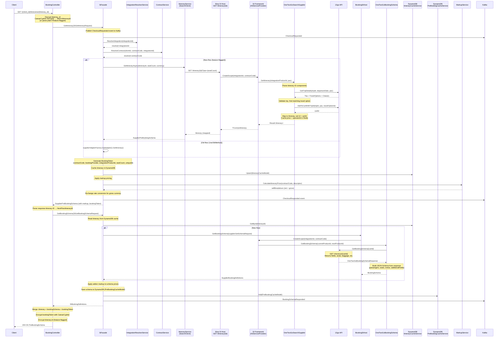

# GetItinerary (Checkout)

The GetItinerary endpoint is the **checkout initiation step**. When a user selects a trip from search results, the client calls this endpoint to get full itinerary details, pricing with markup, seat layout, booking schema (what fields to collect from the passenger), and an encrypted `BookingToken` needed for the next step (CreateBooking).

## HTTP Contract

```
GET /v{version}/{client_id}/itineraries/{itinerary_id}
```

**OpenAPI definition**: `shared-booking-service-open-api/api/definitions/book.yaml`

### Path Parameters

| Parameter      | Type   | Description                                              |
|----------------|--------|----------------------------------------------------------|
| `client_id`    | string | Client identifier (e.g. `12go`, `baolau`)                |
| `itinerary_id` | string | Caesar-cipher encrypted `SearchItineraryId` (or plain)   |

### Query Parameters

| Parameter  | Type   | Required | Description          |
|------------|--------|----------|----------------------|
| `locale`   | enum   | No       | Locale for i18n      |
| `currency` | enum   | No       | Requested gross currency |

### Headers

| Header               | Type   | Required | Description                    |
|----------------------|--------|----------|--------------------------------|
| `x-travelier-version`| date   | Yes      | API version                    |
| `x-correlation-id`   | string | No       | Correlation ID for tracing     |

### Response `200 OK`

Returns a `PreBookingSchema` object (defined in `model/pre-booking.yml`):

```yaml
type: object
required: [itineraries, segments, vehicles]
properties:
  itineraries:          # array of 1 Itinerary
  segments:             # array of 1-10 Segment
  vehicles:             # array of 1-10 Vehicle
```

**Itinerary object** (from `model/itinerary.yml`):

| Field                     | Type               | Notes                                              |
|---------------------------|--------------------|----------------------------------------------------|
| `id`                      | string             | Caesar-encrypted ItineraryId (or plain, feature-flagged) |
| `booking_token`           | string             | Caesar-encrypted BookingToken — needed for CreateBooking |
| `booking_schema`          | JSON Schema (JSchema) | Describes fields client must collect (passengers, seats, etc.) |
| `extras`                  | object             | Optional add-ons (baggage, upgrades)               |
| `to_segments`             | string[]           | A→B segment IDs                                    |
| `from_segments`           | string[]           | B→A segment IDs                                    |
| `confidence_score`        | number (0-1)       | Probability score of accuracy                      |
| `pricing.net_price`       | `{amount, currency}` | Net price (with markup applied)                  |
| `pricing.gross_price`     | object             | Gross price + `price_type` + `amount_in_net_currency` |
| `pricing.taxes_and_fees`  | `{amount, currency}` | Taxes and fees                                   |
| `number_available_seats`  | number             | Available seat count                               |
| `confirmation_type`       | string             | Instant vs request                                 |
| `cancellation_policies`   | array              | Array of `{from (duration), penalty {cost, percentage}}` |
| `cut_off`                 | string (duration)  | Booking cut-off time before departure              |

**Segment object** (from `model/segment.yml`):

| Field                   | Type     | Notes                          |
|-------------------------|----------|--------------------------------|
| `id`                    | string   |                                |
| `operator_designated_name` | string |                                |
| `from_station`          | string   | Station ID                     |
| `to_station`            | string   | Station ID                     |
| `departure_time`        | datetime |                                |
| `arrival_time`          | datetime |                                |
| `travel_duration`       | duration |                                |
| `operating_carrier_id`  | string   | Operator ID                    |
| `vehicle_id`            | string   | References Vehicle              |
| `seat_class_id`         | string   |                                |
| `transportation_types`  | string[] | `Bus`, `Ferry`, `Van`, `Train`, `Airplane` |

**Vehicle object** (from `model/vehicle.yml`):

| Field         | Type     | Notes                                     |
|---------------|----------|-------------------------------------------|
| `id`          | string   |                                           |
| `name`        | string   |                                           |
| `seat_classes` | array   | `{id, name, description, keywords, images}` |
| `images`      | string[] |                                           |
| `description` | string   |                                           |
| `keywords`    | string[] |                                           |
| `amenities`   | string[] |                                           |

### Error Responses

| Status | Description          |
|--------|----------------------|
| 400    | Invalid request      |
| 401    | Unauthorized         |
| 404    | Itinerary not found  |
| 422    | Unprocessable (sold out, not bookable) |
| 500    | Internal server error |

---

## Client Usage

1. Client receives `itinerary_id` from search results (already Caesar-encrypted `SearchItineraryId`)
2. Client calls `GET /{client_id}/itineraries/{itinerary_id}`
3. Client receives `PreBookingSchema` containing:
   - Trip details (segments, vehicles, pricing)
   - `booking_schema` — a JSON Schema describing what passenger fields are required (name, DOB, ID, seat selection, baggage, etc.)
   - `booking_token` — **encrypted opaque token** the client must pass to `CreateBooking`
   - Seat layout (if available, embedded in booking_schema or vehicle seat_classes)
   - Extras (add-ons like baggage options)
4. Client renders checkout form using the `booking_schema`
5. Optionally, client calls `POST /{client_id}/seats` (LockSeats) with `booking_token` + selected seats
6. Client calls `POST /{client_id}/bookings` (CreateBooking) with `booking_token` + filled passenger data

---

## Internal Flow



---

## 12go Equivalent

The GetItinerary flow maps to **three sequential 12go API calls**:

| Step | 12go API Call | Method | Purpose |
|------|--------------|--------|---------|
| 1 | `GetTripDetails` | `GET /trip-details?trip_id={}&date={}&pax={}` | Fetch full trip details, validate availability, get travel options & classes |
| 2 | `AddToCartWithTripId` | `POST /add-to-cart` | Reserve a cart slot for this trip. Returns `cartId` which becomes the new product ID for subsequent calls |
| 3 | `GetBookingSchema` | `GET /checkout/{cartId}` | Get the checkout form definition — which passenger fields are required, seat layout, baggage options, pickup/dropoff points |

### Detailed Mapping

**GetTripDetails** (`OneTwoGoApi.GetTripDetails`):
- Input: `tripId` (from itinerary ID), `departureDate`, `numberOfSeats`
- Returns: `GetTripDetailsResponse` with `Trips[]` (containing segments, travel options) and `Classes[]`
- Used to: validate the trip still exists, is bookable, has enough seats, and get the matching travel option

**AddToCartWithTripId** (`OneTwoGoApi.AddToCartWithTripId`):
- Input: `tripId`, `numberOfSeats`, `travelOptionId` (derived from itinerary ID)
- Returns: `cartId` (string)
- Used to: create a 12go cart entry. The `cartId` replaces the original `itineraryId` as the product identifier going forward
- **Side effect**: Price and operatorId are cached in Redis keyed by `cartId`

**GetBookingSchema** (`OneTwoGoApi.GetBookingSchema`):
- Input: `cartId` (from AddToCart step above)
- Returns: `OneTwoGoBookingSchemaResponse` with field definitions (passengers, seats, delivery, points, baggage, etc.)
- Used to: build the JSON Schema that tells the client which fields to collect
- **Side effect**: field name-to-supplier-name mapping is cached in Redis (needed for reserve step to translate field names back)

### Internal Itinerary Variant

For itinerary IDs starting with `SharedConstants.IdPrefix`, a different flow is used (`HandleInternalItinerary`):
1. `AddToCart` (POST with body) — different from `AddToCartWithTripId`
2. `GetCartDetails` — to get `tripId` and `goDate` from cart
3. `GetTripDetails` — same as above
4. Map itinerary

---

## Data Dependencies

### Input ID Structure: `SearchItineraryId`

The `itinerary_id` path parameter is a Caesar-cipher encrypted (or plain, feature-flagged) `SearchItineraryId` containing:

| Field               | Description                           |
|---------------------|---------------------------------------|
| `ContractCode`      | Contract code (e.g. `12go`)           |
| `IntegrationId`     | Integration identifier (e.g. `onetwogo`) |
| `IntegrationProductId` | Supplier-specific product ID        |
| `Seats`             | Number of seats requested             |
| `SearchTime`        | When the search was performed         |
| `ExperimentId`      | A/B experiment identifier (optional)  |
| `FlowId`            | Flow identifier (optional)            |
| `TraceId`           | Trace ID for observability            |

### Generated Token: `BookingToken`

Generated during GetItinerary and encrypted with Caesar cipher for the client. Structure:

| Field                    | Type   | Description                      |
|--------------------------|--------|----------------------------------|
| `ContractCode`           | string | Contract code                    |
| `IntegrationId`          | string | Resolved via `BookingProviderMapping` config |
| `IntegrationBookingToken`| string | The `integrationProductId` from SI response (cartId) |
| `SeatCount`              | int    | Number of seats                  |
| `UniqueId`               | string | Generated unique identifier      |

### DynamoDB Cache: `ItineraryCacheModel`

Stored after GetItinerary returns, keyed by `itineraryId.ToString()`:

| Field               | Type                   | Description                       |
|---------------------|------------------------|-----------------------------------|
| `Id`                | string                 | ItineraryId as string             |
| `Itinerary`         | TripDetailsWithSchemaDefinitions | Full itinerary details   |
| `Segments`          | `List<Segment>`        | Trip segments                     |
| `Vehicles`          | `List<Vehicle>`        | Vehicle info                      |
| `ExperimentId`      | string?                | Experiment ID                     |
| `ItineraryInstanceId` | string?              | Instance ID for tracing           |
| `CreatedAt`         | DateTime               | UTC creation time                 |
| `ExpiredAt`         | int (Unix epoch)       | TTL (default 7200 minutes = 5 days) |

### DynamoDB Cache: `PreBookingCacheModel`

Stored after GetBookingSchema returns, keyed by `bookingToken.ToString()`:

| Field                    | Type                              | Description                         |
|--------------------------|-----------------------------------|-------------------------------------|
| `Id`                     | BookingToken                      | The booking token                   |
| `BookingSchema`          | JSchema                           | JSON Schema for booking form        |
| `ItineraryId`            | ItineraryId                       | Original itinerary ID               |
| `NextFlowId`             | ItineraryId                       | ID with updated IntegrationProductId (cartId) |
| `NameToSupplierNameFields` | `Dict<string, string>`          | Field name mapping for reserve step |
| `BookingSchemaDictionary` | `Dict<string, Dict<string, string>>`? | Additional schema dictionary    |
| `LockedSeats`            | `List<string>`                    | Seats locked via LockSeats endpoint |
| `ExpiredAt`              | int (Unix epoch)                  | TTL                                 |

### Redis Cache (SI Level)

At the supply-integration level, `OneTwoGoCache` stores:
- **Trip data** keyed by `cartId`: `{price, operatorId}` — used later by GetBookingSchema to build pricing into the schema
- **NameToSupplierName** keyed by `cartId`: field name mappings — used during Reserve to translate client field names to 12go field names

### External Service Dependencies

| Service               | Purpose                                    |
|-----------------------|--------------------------------------------|
| Etna SI Host          | Hosts the SI Framework, calls supplier GetItinerary |
| SI Framework          | Resolves and calls supplier-specific code   |
| MarkupService         | Calculates net and gross pricing with margin |
| ExchangeRateService   | Converts gross price to requested currency  |
| ContractService       | Resolves contract code per client           |
| IntegrationResolverService | Resolves integration ID aliases        |
| Kafka                 | Publishes checkout events (CheckoutRequested, CheckoutResponded, CheckoutFailed, BookingSchemaRequested/Responded/Failed) |
| FeatureManager        | Controls flow routing (old vs new), encryption, etc. |

---

## What Can Go Away

In a direct integration (no SI framework abstraction), the following can be simplified or removed:

### Definitely Remove

1. **Etna SI Host HTTP hop** — Denali calls Etna SI Host over HTTP (`GET /itinerary/{id}`), which then calls the SI Framework. This entire HTTP boundary can be eliminated by calling 12go directly.

2. **SI Framework abstraction layer** — `ISiServiceProvider.CreateScope()`, `ISearchSupplier`, `IBookingSchema`, `IBookingFunnel` — all the DI scoping and service resolution. Replace with direct 12go API client calls.

3. **ItineraryService + SearchClient indirection** — The `ItineraryService` that calls a `SearchClient` which calls Etna. This entire layer exists only because Denali doesn't call SI directly.

4. **Double caching** — SI caches in Redis (price, operatorId, field name mappings) AND Denali caches in DynamoDB (itinerary, booking schema). With a direct integration, one cache layer suffices.

5. **SupplierAdapterFactory / old flow** — The `UseOldMethod()` toggle and the legacy adapter path can be removed entirely.

6. **Itinerary ID transformation dance** — The flow juggles multiple ID types: `SearchItineraryId` → `ItineraryId` → `integrationProductId` → `cartId` → `NextFlowItineraryId` → `BookingToken`. A simpler ID scheme is possible.

7. **SiObjectMapper transforms** — Multiple DTO-to-DTO mappings between Denali models and supplier models that exist only because of the abstraction layers.

### Potentially Simplify

1. **DynamoDB ItineraryCache** — Needed today to pass data between GetItinerary and subsequent steps (CreateBooking, ConfirmBooking). Could be replaced with a simpler in-memory or lighter-weight cache if the data is passed through the `BookingToken` or fetched on demand.

2. **DynamoDB PreBookingCache** — Stores the booking schema and field mappings. Could be simplified if we pass the cart context through the booking token or call 12go again at reserve time.

3. **Caesar cipher encryption/decryption** — The ID encryption adds complexity. Evaluate if it's still needed or if signed tokens would be simpler.

4. **Markup/Exchange rate calculation** — This business logic stays, but the integration points can be simpler without the multi-layer architecture.

5. **Kafka event publishing** — The checkout events (CheckoutRequested, CheckoutResponded, CheckoutFailed, BookingSchemaRequested/Responded) serve analytics. Keep but simplify.

### Must Keep

- **12go API calls**: GetTripDetails, AddToCart, GetBookingSchema — these are the actual supplier integration
- **Markup calculation and exchange rate conversion** — core business logic
- **BookingToken generation** — needed to carry state between checkout steps
- **Some form of caching** — itinerary details needed in subsequent booking steps
- **Kafka events** — for analytics pipeline

---

## Open Questions

1. **Can we eliminate DynamoDB cache entirely?** — If the BookingToken carries enough context (cartId, pricing), could we re-fetch from 12go instead of caching? Trade-off: extra API calls vs cache complexity.

2. **Is Caesar cipher encryption still required?** — Is there a security requirement for encrypting itinerary IDs and booking tokens, or is this legacy? The `PlainItineraryIdPerClient` feature flag suggests a move toward plain IDs.

3. **What analytics depend on the Kafka events?** — CheckoutRequested, CheckoutResponded, CheckoutFailed, BookingSchemaRequested/Responded/Failed — which downstream consumers depend on these? Can we simplify the event schema?

4. **ExperimentId / FlowId in SearchItineraryId** — Are A/B experiments still active? If not, these fields can be removed from the ID.

5. **How do we handle the "old flow" vs "new flow" during transition?** — The `UseOldMethod()` and `UseOldFlowPerClient` feature flags suggest not all integrations have migrated. What's the current state for OneTwoGo?

6. **Redis cache at SI level** — The OneTwoGoCache stores price and field name mappings. In a direct integration, where should this state live? In-memory? In the BookingToken? In the same DynamoDB cache?

7. **ItineraryCacheModel expiration (7200 minutes = 5 days)** — Is this TTL appropriate? What happens if a user returns to checkout after the cache expires?

8. **Contract and Integration resolution** — `IntegrationResolverService.ResolveIntegration()` and `ContractService.ResolveContract()` — what do these actually do? Are they simple config lookups or do they involve external calls?

9. **Field name translation (`NameToSupplierNameFields`)** — The 12go checkout API uses supplier-specific field names that get translated to standardized names. In a direct integration, is this translation still needed or can we use 12go names directly?

10. **Seat layout data** — Where does the seat layout come from? Is it part of the booking schema response from 12go, or is it a separate call? The `LegacySeatLayoutOperatorIds` config suggests some operators have different seat layout formats.
