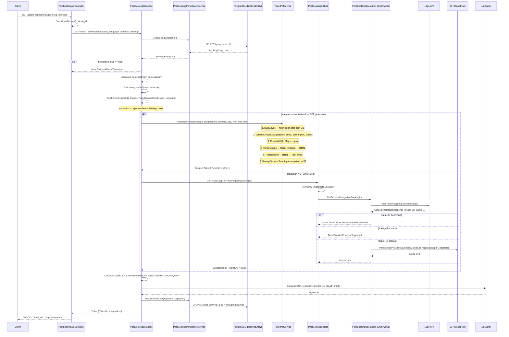

# GetTicket

## HTTP Contract

**Endpoint:** `GET /v{version}/{client_id}/bookings/{booking_id}/ticket`

**Path Parameters:**

| Parameter   | Type   | Required | Description          |
|-------------|--------|----------|----------------------|
| `client_id` | string | yes      | Client identifier    |
| `booking_id`| string | yes      | Encrypted booking ID |

**Headers:**

| Header               | Type   | Required | Description                  |
|----------------------|--------|----------|------------------------------|
| `x-travelier-version`| date   | yes      | API version                  |
| `x-correlation-id`   | string | no       | Correlation ID for tracing   |

**Query Parameters:**

| Parameter  | Type   | Required | Description        |
|------------|--------|----------|--------------------|
| `locale`   | enum   | no       | Locale (Locales)   |
| `currency` | enum   | no       | Currency (Currencies) |

**Response `200 OK`:**

```json
{
  "ticket_url": "https://cloudfront.example.com/2026/02/tracker_bookingId_20260217123456.pdf?Policy=...&Signature=...&Key-Pair-Id=..."
}
```

The `ticket_url` is a **CloudFront signed URL** with ~90-day expiration (calculated as `departureTime + 90 days - now`).

**Response `202 Accepted`:** Ticket generation in progress (no body).

**Error Responses:** `400`, `401`, `404`, `405` (not allowed), `500`

## Client Usage

The client calls this endpoint to obtain a downloadable/viewable ticket PDF for a confirmed booking. The returned `ticket_url` is a time-limited signed CloudFront URL pointing to an S3-hosted PDF.

Key client behaviors:
- Called after booking is confirmed (`status == Approved`)
- The URL is signed and expires — client should not cache it indefinitely
- If the booking is not yet confirmed, returns `405` or error
- The resulting PDF may be either Denali-generated (via `TicketPdfService`) or supplier-provided (via SI library), depending on integration whitelisting

## Internal Flow (mermaid sequence diagram)



## 12go Equivalent

**12go (OneTwoGo) API:** `GET /booking/{bookingId}` — returns `ticket_url` field.

In the SI layer (`OneTwoGoPostBookingOperations.GetTicketUrl`):

1. Calls `GET /booking/{integrationBookingId}` to get `GetBookingDetailsResponse`
2. Checks `status` — if not `Confirmed`, returns `TicketCreationError.ReservationNotConfirmed`
3. If `ticket_url` is present in the response, downloads the PDF and re-uploads it to S3 via `PersistenceProvider.Save`
4. Returns the S3 URI

**12go response fields used:**

| 12go field | Usage |
|---|---|
| `status` | Must map to `Confirmed` for ticket to be available |
| `ticket_url` | The supplier's own PDF URL — downloaded and re-hosted on Denali's S3 |
| `dep_date_time` | Used to set S3 object expiration |

**Key observation:** 12go already provides a `ticket_url` in their booking details response. The current Denali flow re-downloads this PDF and re-hosts it on S3 behind CloudFront with signed URLs. This is a significant indirection.

## Data Dependencies

| Dependency | Type | Description |
|---|---|---|
| **PostgreSQL (BookingEntities table)** | Database | Lookup booking by ID; update `ticket_url` after generation |
| **BookingEntity fields used** | Model | `PlainId`, `ContractCode`, `IntegrationId`, `IntegrationBookingId`, `ClientId`, `DepartureTime` |
| **TicketPdfService** | Service | Denali's own PDF generation pipeline (for whitelisted integrations) |
| **TicketPdfService pipeline** | Subsystem | `ITicketDataBuilder` → `ITemplateRenderer` (Razor) → `IPdfRenderer` → `IStorageService` (S3) |
| **TicketPdfOptions.WhitelistedIntegrations** | Config | List of integration IDs that use Denali PDF generation instead of supplier tickets |
| **PostBookingSiHost** | Service | Calls SI library for non-whitelisted integrations (with Polly retry: 3 attempts, 3s delay) |
| **OneTwoGoPostBookingOperations.GetTicketUrl** | SI impl | Calls 12go API, downloads PDF, re-uploads to S3 via PersistenceProvider |
| **S3 + CloudFront** | Infrastructure | Ticket PDFs stored in S3, served via CloudFront |
| **IUrlSigner** | Service | Signs CloudFront URLs with private key |
| **CloudFront config** | Config | `TicketUrl:CloudFrontTicketBaseUrl`, `TicketUrl:PrivateKey`, `TicketUrl:CloudFrontId` |
| **ConditionalCypher** | Service | Encrypts/decrypts booking IDs |
| **QR Code service, Map service, Logo service** | Services | Used by TicketPdfService for PDF enrichment |

## What Can Go Away

| Component | Can it go away? | Rationale |
|---|---|---|
| **TicketPdfService (Denali PDF generation)** | Depends on strategy | If 12go's own ticket PDF is acceptable, we don't need to generate our own. However, the Denali PDF adds QR codes, maps, logos, and branded styling that 12go's ticket may not have. |
| **S3 re-hosting of supplier tickets** | Potentially | For the non-whitelisted path, Denali downloads 12go's PDF and re-uploads to S3. If we trust 12go's `ticket_url` stability, we could serve it directly. |
| **CloudFront signed URL infrastructure** | Potentially | Only needed if we continue self-hosting PDFs. If using 12go's URL directly, the whole CloudFront signing pipeline goes away. |
| **PostgreSQL `ticket_url` column** | Yes | Currently stores the signed URL for caching. If tickets are fetched on-demand from 12go, this is unnecessary. |
| **Polly retry in PostBookingSiHost.GetTicket** | Yes (for 12go direct) | The 3-attempt retry with 3s delay is for reliability against the SI library. Direct 12go calls would have their own retry strategy. |
| **BookingEntity lookup for ticket** | Potentially | Currently needed to construct `BookingId` and determine which ticket path to use. If calling 12go directly, only need the 12go `bid`. |
| **PersistenceProvider in SI** | Yes (for 12go direct) | Currently re-uploads 12go's PDF to S3. Not needed if using 12go's URL directly. |

## Open Questions

1. **Is Denali's PDF generation (TicketPdfService) still needed for OneTwoGo?** Is OneTwoGo whitelisted for PDF generation, or does it go through the SI path? If whitelisted, we're generating our own PDFs with branded content.
2. **Can we serve 12go's `ticket_url` directly?** Need to verify: Is the URL stable? Does it expire? Is it publicly accessible or authenticated?
3. **What value does the Denali PDF add?** QR codes, maps, OTA/operator logos, branded CSS. Is this still a business requirement for OneTwoGo?
4. **Is the 90-day CloudFront URL expiration correct?** Currently `departureTime + 90 days - now`. For past departures, this could be negative (though practically tickets are fetched before travel).
5. **Why are tickets fetched on-demand instead of at booking creation?** The lazy-fetch pattern means first GetBookingDetails or GetTicket call triggers PDF generation. This adds latency. Could pre-generate at confirm time.
6. **What happens if PDF generation fails?** The TicketPdfService has strict validation (stations, times, passengers, status must be present). If data is incomplete, the ticket call fails. Is there a fallback to 12go's ticket?
