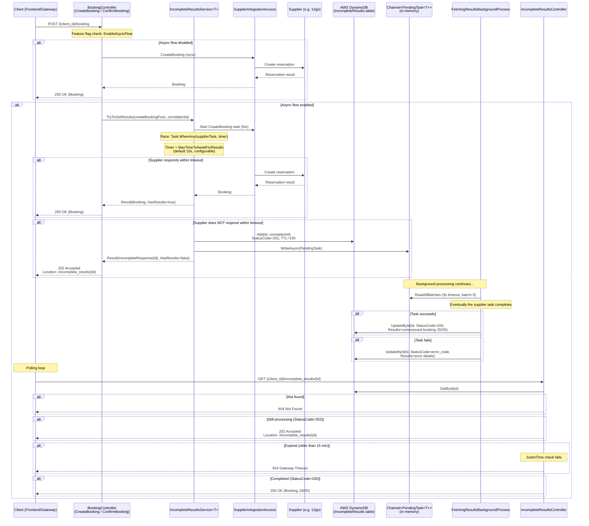

# Incomplete Results (Async Booking Flow)

## HTTP Contract

### Poll Endpoint

| Field | Value |
|---|---|
| **Method** | `GET` |
| **Path** | `/{client_id}/incomplete_results/{incomplete_results_id}` |
| **Path Parameters** | `client_id` — the client identifier. `incomplete_results_id` — UUID generated when the async flow was initiated. |
| **Headers** | `X-Travelier-Version` (required, DateTime) |
| **Response 200** | Result is ready. Body contains the completed booking response (JSON). |
| **Response 202** | Still processing. No body. `Location` header: `/incomplete_results/{incomplete_results_id}`. |
| **Response 404** | Unknown incomplete_results_id. |
| **Response 504** | Gateway Timeout — result expired (default: 15 min since creation/update). |

### How Incomplete Results Are Created (CreateBooking)

| Field | Value |
|---|---|
| **Method** | `POST` |
| **Path** | `/{client_id}/booking` (CreateBooking endpoint) |
| **Feature Flag** | `EnableAsyncFlow` — when **disabled**, CreateBooking is fully synchronous. |
| **Sync Response (200)** | Booking completed within timeout → returns booking directly. |
| **Async Response (202)** | Booking didn't complete within timeout → `202 Accepted` with `Location: /incomplete_results/{id}`. |

The same async pattern also applies to **ConfirmBooking** (`PUT /{client_id}/booking/{booking_id}/confirm`).

## Client Usage

The client (typically the frontend or API gateway) calls CreateBooking or ConfirmBooking. If those return:

1. **200 OK** → Done. Use the response directly.
2. **202 Accepted** → The booking is still being processed by the supplier. Extract the `Location` header value and **poll** `GET /{client_id}/incomplete_results/{id}` until:
   - **200 OK** → Result is ready (body contains the booking).
   - **504 Gateway Timeout** → Result expired; the booking may have failed or the supplier is unreachable. Client should show an error or retry the original booking.
   - **202 Accepted** → Still processing; keep polling.
   - **404 Not Found** → Invalid ID (should not happen in normal flow).

**Polling strategy:** The client typically polls at short intervals (e.g. every 1-2 seconds). There is no server-sent event or WebSocket push mechanism.

## Internal Flow (mermaid sequence diagram)

### Key Components

| Component | Location | Role |
|---|---|---|
| `BookingController` | `denali/booking-service/host/.../Controllers/BookingController.cs` | Entry point for CreateBooking & ConfirmBooking. Checks `EnableAsyncFlow` feature flag. Delegates to `IIncompleteResultsService`. |
| `IncompleteResultsService<T>` | `denali/booking-service/host/.../AsyncFlow/IncompleteResultsService.cs` | Core async logic. Fires the supplier call, races against a timer. If timeout, persists pending state to DynamoDB and enqueues the still-running task to an in-memory channel. |
| `FetchingResultsBackgroundProcess<T>` | `denali/booking-service/host/.../AsyncFlow/FetchingResultsBackgroundProcess.cs` | `BackgroundService` that reads completed tasks from the channel and writes results (success or error) back to DynamoDB. Batches reads (3 items, 3s timeout). |
| `IncompleteResultsController` | `denali/booking-service/host/.../Controllers/IncompleteResultsController.cs` | Polling endpoint. Reads from DynamoDB, applies expiration check, returns appropriate status code. |
| `GetIncompleteResults` | `denali/booking-service/host/.../AsyncFlow/GetIncompleteResults.cs` | Business logic for the poll endpoint. Retrieves from DynamoDB via repository, applies `JustInTime` expiration check (default 15 min). |
| `IncompleteResultsRepository` | `denali/booking-service/persistency/.../Repository/Implementation/IncompleteResultsRepository.cs` | DynamoDB write operations: `Add` (initial 202 record) and `UpdateById` (final result). Results stored as gzip-compressed JSON. |
| `IncompleteResultsGetByIdRepository` | `denali/booking-service/persistency/.../Repository/Implementation/IncompleteResultsGetByIdRepository.cs` | DynamoDB read: `GetById`. Decompresses results from binary. |

### Configuration

| Key | Default | Purpose |
|---|---|---|
| `AsyncProcess:MaxTimeToAwaitForResultsInSeconds` | `15` | How long to wait for the supplier before returning 202. |
| `AsyncProcess:IncompleteResultsExpirationInMinutes` | `15` | After this time, poll returns 504 instead of actual result. |
| `AsyncProcess:IncompleteResultsTTLInHours` | `15` | DynamoDB TTL — when the record is physically deleted. |
| Feature flag: `EnableAsyncFlow` | — | Toggle async flow on/off per client. When off, all requests are synchronous. |

### Data Model (DynamoDB)

Table: `IncompleteResults`

| Attribute | Type | Description |
|---|---|---|
| `Id` | String (PK) | UUID generated at creation |
| `StatusCode` | Number | `202` (pending), `200` (success), or error code (e.g. `500`) |
| `Results` | Binary | Gzip-compressed JSON of the booking result (null while pending) |
| `CreatedAt` | String (ISO 8601) | When the incomplete result was created |
| `UpdatedAt` | String (ISO 8601) | When the result was filled in (null while pending) |
| `CorrelationId` | String | Correlation ID from the original request (optional) |
| `ExpiredAt` | Number (epoch) | DynamoDB TTL attribute |

## 12go Equivalent

In the 12go system, the async booking pattern likely doesn't exist in the same form:

- 12go's own inventory bookings are fast (internal database operations), so the synchronous path is sufficient
- The async pattern was introduced because **external supplier** APIs (like 12go's own API when called from the Denali side) can be slow to confirm bookings
- **12go equivalent concept:** If 12go has long-running booking operations, it likely handles them with its own queuing/async mechanisms internally, not exposed as a polling API to the frontend
- The frontend polling pattern (`202` → poll → `200`) is a Denali-specific design to handle supplier latency through a REST API

## Data Dependencies

| Dependency | Type | Purpose |
|---|---|---|
| **AWS DynamoDB** | Database | Stores incomplete results records. Used for both write (initial + update) and read (polling). |
| **In-memory Channel** | Channel\<PendingTask\<T\>\> | Bridges the HTTP request thread to the background processor. PendingTask holds the still-running supplier Task, the result ID, and an Activity for tracing. |
| **Feature flag: `EnableAsyncFlow`** | Feature management | Controls whether async flow is active. When disabled, the controller waits indefinitely for the supplier response (fully synchronous). |
| **SupplierIntegrationAccess** | Internal service | The actual supplier call (CreateBooking / ConfirmBooking) that may be slow. This is the task being raced against the timer. |
| **AWS AppConfig** | Configuration | Provides async process timing configuration. |

## What Can Go Away

- **The entire async polling pattern** — If 12go's booking confirmation is fast enough (responds within the HTTP timeout), the `EnableAsyncFlow` flag can remain `false` and none of this infrastructure is needed. The controller simply awaits the supplier response synchronously.
- **DynamoDB IncompleteResults table** — Only exists to support the polling pattern. If async flow is not needed, this table is unnecessary.
- **FetchingResultsBackgroundProcess** — Background service that writes results back to DynamoDB after the supplier responds. Not needed without async flow.
- **IncompleteResultsController + GetIncompleteResults** — The polling endpoint itself. Not needed without async flow.
- **IncompleteResultsService + Channel infrastructure** — The race logic and channel plumbing. Not needed without async flow.
- **Feature flag `EnableAsyncFlow`** — If we decide the flow is always sync (or always async), the branching logic in BookingController can be simplified.

### If async flow IS still needed

If 12go bookings are sometimes slow and the async pattern must remain:
- The pattern itself is sound but could be simplified by using a more standard approach (e.g. server-sent events, WebSocket, or a simpler in-memory cache with TTL instead of DynamoDB)
- The DynamoDB usage creates a new AmazonDynamoDBClient per request (not using the injected one properly) — this is a known issue that should be fixed
- Gzip compression of results adds complexity — may not be necessary for typical booking JSON sizes
- The `JustInTime` expiration check is separate from DynamoDB TTL — the 15-minute expiration window means results are "forgotten" well before DynamoDB actually deletes them (15 hours TTL)

## Open Questions

- Is `EnableAsyncFlow` currently enabled for 12go / OneTwoGo bookings? If not, this entire subsystem is inactive.
- How often do CreateBooking / ConfirmBooking calls to 12go exceed the 15-second timeout? This determines whether the async flow adds value.
- Is DynamoDB the right choice for this use case in the transition? Could an in-memory cache (Redis) or even in-process storage suffice?
- The `IncompleteResultsRepository` creates a new `AmazonDynamoDBClient` per call instead of using the injected `IAmazonDynamoDB`. Is this intentional? It bypasses DI and connection pooling.
- What happens if the BookingService pod restarts while a PendingTask is in the in-memory channel? The task and its result are lost, and the DynamoDB record stays at StatusCode=202 forever (until TTL expires).
- Does the frontend currently implement polling for 202 responses, or does it only handle synchronous 200 responses?
- ConfirmBooking also uses this pattern — are there different timeout characteristics for confirm vs create?
