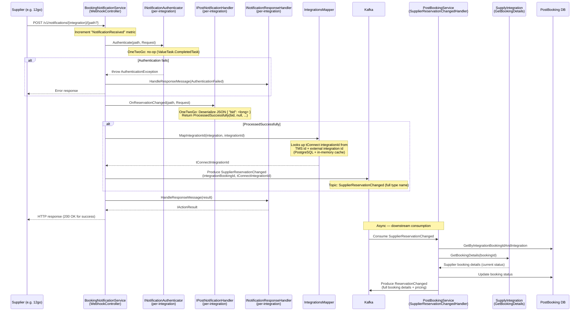

# Booking Notification Webhook

## HTTP Contract

| Field | Value |
|---|---|
| **Method** | `POST` |
| **Path** | `/denali_booking_notification_service/v1/notifications/{integration}` |
| **Path (with sub-path)** | `/denali_booking_notification_service/v1/notifications/{integration}/{*path}` |
| **Path Parameters** | `integration` — keyed integration identifier (e.g. `onetwogo`, `deonibus`, `distribusion`, `flixbus`, `bookaway`, `sisorg`, `tctour`, `seatos`). `path` — optional catch-all for integration-specific sub-routing. |
| **Request Body** | Raw HTTP request — body format is **integration-specific** (not standardised). For OneTwoGo it is JSON: `{ "bid": <long> }` |
| **Success Response** | Integration-specific (OneTwoGo returns `200 OK` with empty body) |
| **Failure Response** | `500 Internal Server Error` (default), or integration-specific error response |
| **Authentication** | Per-integration. OneTwoGo: **none** (authenticator is a no-op). Other integrations have their own `INotificationAuthenticator` implementations. |

### Route Registration

Routes are defined in `RouteTemplateConstants`:
- `v{version:apiVersion}/notifications/{integration}`
- `v{version:apiVersion}/notifications/{integration}/{*path}`

The service path base is configured via `BASE_URL` env var, defaulting to `/denali_booking_notification_service`.

## Client Usage

This endpoint is **not called by our own clients**. It is a **webhook receiver** — external suppliers (12go / OneTwoGo, DeOniBus, Distribusion, FlixBus, Bookaway, Sisorg, TcTour, SeatOS) call this endpoint to notify us about booking status changes on their side.

**Who calls it:** Supplier systems, configured with our webhook URL during integration setup.

**When:** After a booking's status changes on the supplier side (confirmation, cancellation, etc.).

## Internal Flow (mermaid sequence diagram)



### Key Components

| Component | Location | Role |
|---|---|---|
| `WebhookController` | `denali/booking-notification-service/host/.../Controllers/WebhookController.cs` | Entry point. Resolves per-integration keyed services. Orchestrates auth → handle → publish → respond. |
| `INotificationAuthenticator` | Abstractions in `supply-integration`. OneTwoGo impl: no-op. | Validates the webhook caller identity. |
| `IPostNotificationHandler` | Abstractions in `supply-integration`. OneTwoGo impl: parses `{ "bid": <long> }`. | Parses the notification body and extracts booking reference. |
| `INotificationResponseHandler` | Abstractions in `supply-integration`. OneTwoGo impl: returns 200/500. | Formats the HTTP response to send back to the supplier. |
| `IntegrationsMapper` | `denali/booking-notification-service/.../Implementations/IntegrationsMapper.cs` | Maps TMS-domain integration IDs to tConnect-domain IDs. Uses `IntegrationService` which fetches from si.integrations.settings API + PostgreSQL cache. |
| `KafkaMessagePublisher` | `denali/booking-notification-service/.../MessagePublishing/KafkaMessagePublisher.cs` | Publishes `SupplierReservationChanged` Kafka message. Topic name = full type name of the message class. |
| `IntegrationCreatedMessageHandler` | `denali/booking-notification-service/.../MessageConsuming/IntegrationCreatedMessageHandler.cs` | Background service consuming `IntegrationCreated` Kafka events to keep local integration mapping table in sync. |

### Kafka Events

| Event | Direction | Topic | Payload |
|---|---|---|---|
| `SupplierReservationChanged` | **Published** by BNS | `Denali.Booking.Messages.supplier_integration.SupplierReservationChanged` | `{ BookingId: string, IntegrationId: string }` |
| `IntegrationCreated` | **Consumed** by BNS | `Si.Integrations.Settings.Messages.IntegrationCreated` | `{ Id: string }` — triggers fetching integration details from settings API and caching locally. |
| `ReservationChanged` | **Published** by PostBookingService (downstream) | Full type name | Full booking details + pricing. Consumed by further downstream services. |

### OneTwoGo Notification Details

**Request format:**
```json
{ "bid": 123456789 }
```

- `bid` (long) — the 12go booking ID
- **No authentication** — the authenticator is a no-op (`ValueTask.CompletedTask`)
- **No integration ID mapping** — `IntegrationId` in `ProcessedSuccessfully` is `null`, so `IntegrationsMapper` is bypassed and the route `{integration}` value is used directly as the tConnect integration ID
- **Response:** `200 OK` on success, `500` on failure

**Registration:**
```csharp
services.AddKeyedTransient<INotificationAuthenticator, NotificationAuthenticator>("onetwogo");
services.AddKeyedTransient<IPostNotificationHandler, NotificationHandler>("onetwogo");
services.AddKeyedTransient<INotificationResponseHandler, NotificationResponseHandler>("onetwogo");
```

## 12go Equivalent

In the 12go monolith, booking status change notifications are handled differently:

- 12go **is** the supplier for its own inventory, so there is no webhook — status changes happen internally within the monolith's database
- For third-party suppliers that 12go aggregates, the monolith likely has its own webhook/polling mechanisms
- The concept maps to: **"When a booking status changes on the supplier side, update our records and notify downstream systems"**
- In the transition, if we're keeping only 12go as the supplier, this webhook pattern may be replaced by direct database events or internal service calls within the 12go ecosystem

## Data Dependencies

| Dependency | Type | Purpose |
|---|---|---|
| **PostgreSQL** (BookingNotificationService DB) | Database | Stores integration entity mappings (TMS ID → tConnect ID). Migrations applied on startup via EF Core. |
| **si.integrations.settings API** | HTTP API | Fetched when `IntegrationCreated` events arrive; provides integration details (name, TMS ID, external ID). |
| **Kafka** | Message broker | Produces `SupplierReservationChanged` events; consumes `IntegrationCreated` events. |
| **AWS AppConfig** | Configuration | Application configuration loaded on startup (profiles: `GeneralEndpoints`, `General`, `DenaliBookingNotificationService`, `SupplierIntegration/InboundAuth`). |
| **PostBookingService** | Downstream consumer | Consumes `SupplierReservationChanged` from Kafka, fetches latest booking details from SI, updates booking status, and publishes `ReservationChanged`. |
| **In-memory cache** | Local cache | Caches integration entity lookups (TMS ID + external ID → integration entity). |

## What Can Go Away

- **All non-OneTwoGo integration registrations** — DeOniBus, Distribusion, FlixBus, Bookaway, Sisorg, TcTour, SeatOS, Dummy can be removed since we're keeping only 12go
- **IntegrationsMapper + IntegrationService + IntegrationCreatedMessageHandler** — OneTwoGo doesn't use integration ID mapping (the `IntegrationId` field is null). The entire TMS-to-tConnect mapping layer is unused for 12go.
- **PostgreSQL database** (for integration mapping) — Only needed by the mapper which OneTwoGo doesn't use
- **si.integrations.settings API dependency** — Only needed by the mapper
- **IntegrationCreated Kafka consumer** — Only feeds the mapper
- **The entire service** — If 12go handles booking status changes internally (no external webhook needed), this service can be eliminated entirely. The `SupplierReservationChanged` Kafka event could be published directly by whatever system detects the status change.
- **Feature management (IntegrationIdFilter)** — Used for per-integration feature flags, unnecessary with a single integration
- **Multi-integration keyed service pattern** — With only OneTwoGo, the keyed DI lookup and null-check pattern in the controller is unnecessary overhead

### Simplification if webhook is still needed

If 12go still sends webhooks, the service could be reduced to:
1. A single POST endpoint that parses `{ "bid": <long> }`
2. Publishes `SupplierReservationChanged` to Kafka
3. Returns 200 OK
4. No auth, no mapping, no database, no feature flags

## Open Questions

- Does 12go actually send webhook notifications to this endpoint, or does it handle booking updates internally? If internal, this entire service is unnecessary.
- What is the webhook URL registered with 12go? Is it `onetwogo` or something else as the `{integration}` path parameter?
- Is the `SupplierReservationChanged` → `PostBookingService` → `ReservationChanged` chain the only way booking statuses propagate, or is there also polling (`PendingBookingsUpdaterScheduledWorker` exists in PostBookingService)?
- If the webhook remains, should we keep it as a separate microservice or fold it into another service (e.g. PostBookingService)?
- What happens to the downstream `ReservationChanged` Kafka event consumers? Those need to be mapped as well.
- The `IntegrationsMapper` has a `FetchIntegrationAsync` that queries PostgreSQL — does this data exist anywhere else, or is this the authoritative source for integration ID mapping?
