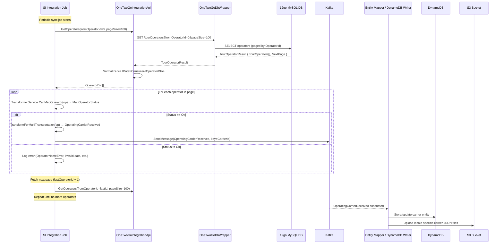
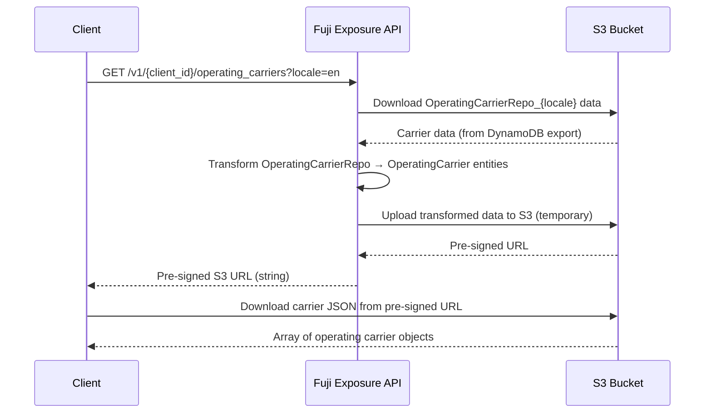

# Operating Carriers (Operators) Endpoint

## HTTP Contract

**Base URL:** `https://api.travelier.com/v1/{client_id}/operating_carriers`

**Authentication:** API Key via `X-API-KEY` header

### GET /v1/{client_id}/operating_carriers

Returns a pre-signed S3 URL pointing to a JSON file containing all operating carriers for the requested locale.

| Parameter   | In    | Type   | Required | Description                        |
|-------------|-------|--------|----------|------------------------------------|
| client_id   | path  | string | yes      | The calling client's identifier    |
| locale      | query | string | no       | Locale/culture code (e.g. `en`)    |

**Response:** `200 OK` — returns a **string** (pre-signed S3 URL).

The S3 file contains an array of operating carrier objects:

```json
[
  {
    "Id": "string (Fuji carrier ID)",
    "name": "string",
    "display_name": "string",
    "logo_url": "string (URI)",
    "email": "string (email)",
    "phone": "string",
    "transportation_type": "Bus | Ferry | Train | Shuttle"
  }
]
```

**Required fields (per OpenAPI spec):** `Id`, `name`, `transportation_type`, and at least one of `email` or `phone` (via `anyOf`).

### GET /v1/{client_id}/operating_carriers/GetList

Internal/alternative endpoint that returns operator data as a direct JSON array.

| Parameter | In    | Type    | Required | Description                  |
|-----------|-------|---------|----------|------------------------------|
| locale    | query | string  | yes      | Locale/culture code          |
| top10K    | query | boolean | no       | Limit results to first 10,000 |

**Response:** `200 OK` — `List<OperatingCarrierDto>` directly in the response body.

### Exposure API DTO (OperatingCarrierDto)

| Field               | Type         | Notes                                     |
|---------------------|--------------|-------------------------------------------|
| MainCarrierId       | string?      | Parent/main carrier reference              |
| Id                  | string?      | Fuji-assigned carrier ID                   |
| Name                | string?      | Carrier name                               |
| DisplayName         | string?      | Display name for UI                        |
| Address             | AddressDto?  | Carrier address                            |
| LogoURL             | string?      | Logo image URL                             |
| Email               | string?      | Contact email                              |
| PhoneNumber         | string?      | Contact phone number                       |
| Description         | string?      | Carrier description                        |
| TransportationTypes | string[]?    | Array of transport types (multi-transport)  |
| Vehicles            | VehicleDto[]?| Vehicle/class information                  |

### VehicleDto (nested)

| Field       | Type             | Notes                          |
|-------------|------------------|--------------------------------|
| Id          | string           | Vehicle class ID               |
| Name        | string           | Vehicle class name             |
| DisplayName | string           | Display name                   |
| Description | string           | Description                    |
| Amenities   | AmenityDto[]     | List of amenities              |
| Images      | string[]?        | Image URIs                     |
| Products    | ProductClassDto[]| Product class information      |
| Keywords    | string[]?        | Search keywords                |

## Client Usage

1. Client calls `GET /v1/{client_id}/operating_carriers?locale=en` periodically
2. Receives a **pre-signed S3 URL** (string)
3. Downloads the full operator list from S3
4. Uses operator information to display carrier details in search results and bookings
5. Operator IDs from this list appear in search/booking responses to identify which carrier operates a trip

**Key difference from stations:** Operator data is primarily used for display purposes (name, logo, contact info). Clients don't typically need to "map" operator IDs the same way they map station IDs, though they still reference Fuji operator IDs.

## Internal Flow (mermaid sequence diagram)

### Sync Pipeline (periodic job)



### Client Request Flow



## 12go Equivalent

### Where the data comes from

All operator data originates from the **12go MySQL database**. The pipeline is:

1. **OneTwoGoDbWrapper** (`GET /tourOperators?fromOperatorId={id}&pageSize={size}`) — REST wrapper over 12go MySQL, using `IOperatorRepo.GetPaged()`
2. **OneTwoGoIntegrationApi** — calls the wrapper, normalizes data via `IDataNormalizer<OperatorDto>`
3. **MultiTransportOperatorService** — validates, transforms to `OperatingCarrierReceived`, and publishes to Kafka

### 12go raw operator data (OperatorDto from SI layer)

The raw operator record from 12go MySQL:

| Key Fields         | Type     | Notes                                             |
|--------------------|----------|----------------------------------------------------|
| OperatorId         | int      | 12go's internal operator ID (integer)              |
| OperatorName       | string   | Operator name                                      |
| OperatorNameLocal  | string   | Localized operator name                            |
| CountryCode        | string   | Country code                                       |
| Url                | string   | Operator website                                   |
| Phone              | string   | Contact phone                                      |
| Email              | string   | Contact email                                      |
| Domain             | string   | Domain                                             |
| OperatorCode       | string   | Operator code                                      |
| OperatorAddress    | string   | Physical address                                   |
| CompanyName        | string   | Legal company name                                 |
| Lat, Lng           | double?  | Coordinates                                        |
| IntegrationType    | string   | How this operator is integrated                    |
| Bookable           | int?     | Whether bookings are supported                     |
| VehclassId         | string   | Default vehicle class                              |
| VehicleClasses     | VehicleClassDto[]? | Vehicle classes for this operator            |
| MapOperators       | MapOperatorDto[]?  | Mappings to integration suppliers            |
| Topup/MinTopup/MaxTopup | double? | Pricing adjustments                          |
| Fxcode             | string   | Currency code                                      |
| Handler            | string   | PHP handler class name                             |
| PhpClassName       | string   | Legacy PHP integration class                       |

### Multi-transport transformation

The `MultiTransportOperatorService` handles a key transformation: a single 12go operator can support **multiple transportation types** (Bus, Ferry, Train, Shuttle). The `TransformForMultiTransportation` method splits these into the `TransportationTypes` array in the Fuji model.

### Could clients call 12go directly?

Theoretically possible, but would require:
- Using **12go operator IDs** (integers) instead of Fuji carrier IDs (strings)
- Handling the multi-transport transformation logic
- The `CanMapOperator` validation (rejects operators with invalid names/data)
- Vehicle class enrichment (12go stores vehicle classes separately, linked by operator ID)

## Data Dependencies

| Dependency                   | Description                                                        |
|------------------------------|--------------------------------------------------------------------|
| 12go MySQL DB                | Source of truth for all operator data                              |
| OneTwoGoDbWrapper service    | REST wrapper providing paginated tour operator queries             |
| SI Integration Job           | Periodic sync — `MultiTransportOperatorService.HandleOperators()`  |
| Kafka                        | Message bus carrying `OperatingCarrierReceived` messages           |
| Entity Mapper / Data Writer  | Consumes Kafka messages, writes to DynamoDB                        |
| DynamoDB                     | Stores operating carrier entities                                  |
| S3                           | Stores locale-specific carrier JSON exports; serves pre-signed URLs|
| IDataNormalizer<OperatorDto> | Normalization logic during sync                                    |
| ITransformerService          | Validates + transforms OperatorDto → OperatingCarrierReceived      |
| Vehicle class data           | Enriched from separate vehicle class sync                          |
| DefaultCulture config        | Fallback locale if requested locale has no data                    |

## What Can Go Away

| Component                       | Can it go away? | Condition                                                     |
|---------------------------------|-----------------|---------------------------------------------------------------|
| OneTwoGoDbWrapper               | Yes             | If operators are fetched directly from 12go or a new source   |
| SI Integration Job (operators)  | Yes             | If there's no need to maintain a Fuji-side copy               |
| Kafka operator messages         | Yes             | If sync pipeline is replaced                                  |
| DynamoDB operator storage       | Yes             | If data is served from a different store                      |
| S3 pre-signed URL pattern       | Yes             | If API returns data directly instead of via S3                |
| Exposure API /operating_carriers| Possibly        | Only if all clients migrate to a new endpoint                 |
| Multi-transport transformation  | Depends         | 12go stores operators without multi-transport split; may need custom logic |
| CanMapOperator validation       | Depends         | Validation for operator name/data quality may still be needed |
| Vehicle class enrichment        | Depends         | Clients may need vehicle class data from another source       |

## Open Questions

1. **Operator ID mapping**: How deeply are Fuji carrier IDs embedded in client systems? Less critical than stations since operators are mainly display data, but IDs still appear in search results.
2. **Vehicle class data**: The `VehicleDto` embedded in the operator response includes amenities, images, and products. Where does this enrichment happen, and can it be replaced?
3. **MapOperatorDto**: The raw 12go data includes `MapOperators[]` (integration supplier mappings). Is this used downstream or only for internal routing?
4. **Multi-transport logic**: 12go operators can serve multiple transport types. The Fuji layer splits this. Is this transformation needed by clients, or could they handle the raw data?
5. **CanMapOperator validation**: Operators with invalid names or data are filtered out. How many operators are rejected, and is this still needed?
6. **Operator-Station relationship**: Raw 12go operator data includes a `StationId` field. What is this used for?
7. **Pricing fields (Topup, MinTopup, etc.)**: These are in the raw data but not in the exposed DTO. Are they used elsewhere?
8. **Sync frequency**: How often does the operator sync run? Is operator data more or less volatile than station data?
