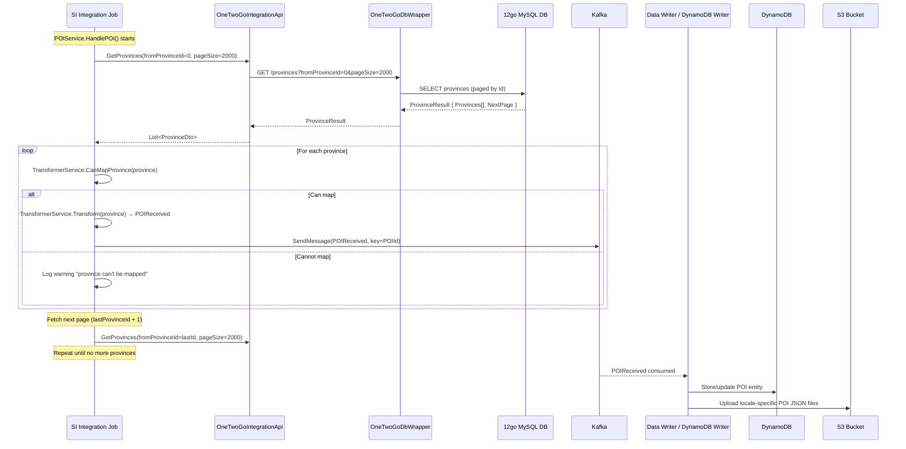
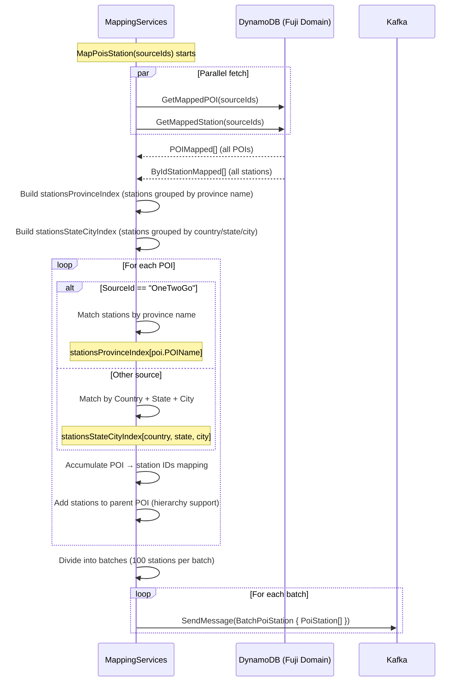
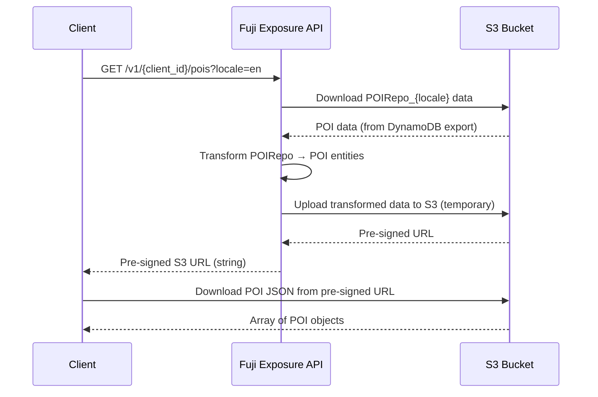

# POIs (Points of Interest) Endpoint

## HTTP Contract

**Base URL:** `https://api.travelier.com/v1/{client_id}/pois`

**Authentication:** API Key via `X-API-KEY` header

> **Note:** The OpenAPI spec (`master_data.yml`) does **not** include a `/pois` path. The endpoint exists only in code (via `RouteTemplateConstants.Route.POI`). This suggests it may have been added after the initial API specification.

### GET /v1/{client_id}/pois

Returns a pre-signed S3 URL pointing to a JSON file containing all POIs for the requested locale.

| Parameter   | In    | Type   | Required | Description                        |
|-------------|-------|--------|----------|------------------------------------|
| client_id   | path  | string | yes      | The calling client's identifier    |
| locale      | query | string | no       | Locale/culture code (e.g. `en`)    |

**Response:** `200 OK` — returns a **string** (pre-signed S3 URL).

The S3 file contains an array of POI objects (per OpenAPI model `point_of_intrest.json`):

```json
[
  {
    "Id": "string (Fuji POI ID)",
    "name": "string",
    "description": "string",
    "stations": ["string (station IDs)"],
    "coordinates": { "$ref": "geo/polygon" },
    "keywords": ["string"],
    "images": ["uri"]
  }
]
```

**Required fields (per OpenAPI model):** `Id`, `name`

### GET /v1/{client_id}/pois/GetList

Internal/alternative endpoint that returns POI data as a direct JSON array.

| Parameter | In    | Type    | Required | Description                  |
|-----------|-------|---------|----------|------------------------------|
| locale    | query | string  | yes      | Locale/culture code          |
| top10K    | query | boolean | no       | Limit results to first 10,000 |

**Response:** `200 OK` — `List<POIDto>` directly in the response body.

### Exposure API DTO (POIDto)

The exposed DTO is minimal:

| Field | Type   | Notes             |
|-------|--------|-------------------|
| Id    | string | Fuji POI ID       |
| Name  | string | POI name          |

> **Note:** The OpenAPI model defines `stations`, `coordinates`, `keywords`, `images` fields, but the actual `POIDto` in the Exposure API only has `Id` and `Name`. The station-to-POI mapping is handled separately via the `MappingServices` component.

## Client Usage

1. Client calls `GET /v1/{client_id}/pois?locale=en` to get all POIs
2. Receives a **pre-signed S3 URL** (string)
3. Downloads the full POI list from S3
4. **Search by POI**: Instead of specifying an exact station, clients can search using a POI ID, which represents a region/province containing multiple stations
5. The system expands a POI into its constituent station IDs during search

**What is a POI?**
- In the 12go context, a **POI is a province** (Thai administrative region)
- Each province contains multiple stations
- POIs allow clients to search broadly (e.g., "all stations in Chiang Mai province") without knowing specific station IDs
- POIs can be hierarchical — provinces can have parent provinces

## Internal Flow (mermaid sequence diagram)

### POI Sync Pipeline (periodic job)



### POI-to-Station Mapping Pipeline



### Client Request Flow



## 12go Equivalent

### Where the data comes from

POI data originates from the **12go MySQL provinces table**. The pipeline:

1. **OneTwoGoDbWrapper** (`GET /provinces?fromProvinceId={id}&pageSize={size}`) — REST wrapper using `IProvinceRepo.GetPaged()`
2. **OneTwoGoIntegrationApi.GetProvinces()** — fetches from wrapper
3. **POIService.HandlePOI()** — transforms provinces to `POIReceived` Kafka messages
4. **MappingServices.MapPoisStation()** — separately maps POIs to their stations

### 12go raw province data (ProvinceDto from SI layer)

| Field    | Type   | Notes                                       |
|----------|--------|---------------------------------------------|
| Id       | int    | 12go province ID (integer)                  |
| ParentId | int?   | Parent province ID (hierarchical)           |
| Name     | string | Province name (used to match stations)      |
| Country  | string | Country code                                |

### POI-to-Station mapping logic

This is the most complex part. The `MappingServices.FindPoiStations()` method matches POIs to stations:

**For 12go (OneTwoGo) POIs:**
- Match by **province name**: `station.SourceAddress.Province == poi.POIName`
- This is a string comparison — the station's province field must exactly match the POI name

**For other sources:**
- Match by **Country + State + City**: `(station.Country, station.State, station.CityName) == (poi.Country, poi.State, poi.POIName)`

**Hierarchy:**
- POIs can have parent POIs (via `MapperParentId`)
- Stations from child POIs bubble up to parent POIs
- Tree height assumption: 3 levels max (root → child → stations as leaves)

### Could clients call 12go directly?

More complex than stations/operators because:
- The **province-to-station mapping is computed by Fuji** — it doesn't exist in 12go's raw data
- 12go has provinces and stations as separate entities; the association is done by matching province name to station's province field
- Clients would need to:
  - Fetch provinces from 12go
  - Fetch stations from 12go
  - Implement the matching logic themselves (or we provide the mapping)
- The POI concept as "search by region" would need to be reimplemented

## Data Dependencies

| Dependency                    | Description                                                          |
|-------------------------------|----------------------------------------------------------------------|
| 12go MySQL DB                 | Source of truth for province data                                    |
| OneTwoGoDbWrapper service     | REST wrapper providing paginated province queries                    |
| SI Integration Job (POI)      | `POIService.HandlePOI()` — syncs provinces as POIs                   |
| Kafka                         | Carries `POIReceived` and `BatchPoiStation` messages                 |
| MappingServices               | Computes POI ↔ station mappings from DynamoDB data                   |
| DynamoDB (Fuji Domain)        | Stores POI entities and station entities (both needed for mapping)   |
| Station data                  | **POIs depend on station data** — mapping requires stations to exist |
| Province name matching        | String matching between POI name and station province field          |
| S3                            | Stores locale-specific POI JSON exports                              |
| ITransformerService           | Validates + transforms ProvinceDto → POIReceived                     |
| DefaultCulture config         | Fallback locale if requested locale has no data                      |

## What Can Go Away

| Component                     | Can it go away? | Condition                                                         |
|-------------------------------|-----------------|-------------------------------------------------------------------|
| OneTwoGoDbWrapper (provinces) | Yes             | If POIs/provinces are fetched directly from 12go                  |
| SI Integration Job (POI)      | Yes             | If province data is not needed as a Fuji-side copy                |
| Kafka POI messages            | Yes             | If sync pipeline is replaced                                      |
| DynamoDB POI storage          | Yes             | If data is served from a different store                          |
| MappingServices               | **Hard to remove** | The POI-station mapping logic is core value; must be replicated |
| Province name matching        | **Hard to remove** | This is how POIs are associated with stations                   |
| S3 pre-signed URL pattern     | Yes             | If API returns data directly                                      |
| Exposure API /pois            | Possibly        | Only if all clients migrate                                       |
| POI ID mapping                | Less critical   | POI IDs are used for search, but clients could potentially adopt new IDs more easily than station IDs |

## Open Questions

1. **Is the POI concept needed at all?** If clients can search by a list of station IDs, do they need the POI abstraction? Or is "search by province" a key UX feature?
2. **Province name matching reliability**: The mapping depends on exact string matching between `poi.POIName` and `station.SourceAddress.Province`. How reliable is this? Are there mismatches?
3. **How many POIs have no stations?** The code logs "Could not find stations for poi" — how common is this?
4. **POI hierarchy**: The code supports parent-child POI relationships. How many POIs are hierarchical? Is this used in practice?
5. **The `stations` field in the OpenAPI model**: The POI model defines a `stations` array, but the `POIDto` only has `Id` and `Name`. Where does the station list get attached? Is it in the S3 export but not the `GetList` endpoint?
6. **Mapping timing**: POI-station mapping (`MapPoisStation`) runs separately from POI/station sync. What's the ordering? If stations change, when does the POI mapping get updated?
7. **OpenAPI spec missing POIs**: The `master_data.yml` OpenAPI spec doesn't define a `/pois` path. Is this intentional, or was the spec never updated?
8. **Province data volume**: How many provinces exist? Is pagination (pageSize=2000) ever exercised, or does all data fit in one page?
9. **Multi-source POI matching**: The code has separate matching logic for "OneTwoGo" vs other sources (Country+State+City). Are there other POI sources besides 12go?
10. **BatchPoiStation message**: The POI-station mapping is sent to Kafka in batches. Who consumes this? How is it stored and used during search?
