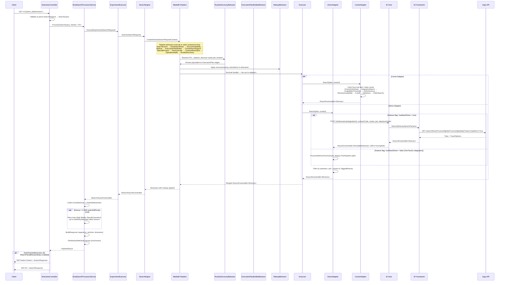

# Search Itineraries

## HTTP Contract

### Endpoint

```
GET /v1/{client_id}/itineraries
```

Route template: `v{version:apiVersion}/{client_id}/itineraries` (API version `1.0`)

### Request

**Route Parameters:**

| Parameter   | Type     | Required | Description          |
|-------------|----------|----------|----------------------|
| `client_id` | `string` | Yes      | Client identifier    |

**Header Parameters:**

| Header              | Type      | Required | Description              |
|---------------------|-----------|----------|--------------------------|
| `travelier-version` | `string?` | No       | Travelier client version |

**Query Parameters:**

| Parameter          | Type               | Required | Validation                                              | Description                                                      |
|--------------------|--------------------|----------|---------------------------------------------------------|------------------------------------------------------------------|
| `departure_date`   | `DateTimeOffset`   | Yes      | Must be >= today                                        | Departure date                                                   |
| `return_date`      | `DateTimeOffset?`  | No       |                                                         | Return date (round-trip)                                         |
| `pax`              | `int`              | Yes      | 1–100                                                   | Number of passengers                                             |
| `pax_ages`         | `int[]?`           | No       |                                                         | Ages of passengers                                               |
| `departures[]`     | `string[]?`        | Cond.    | Uppercase alphanumeric; same length as `arrivals[]`     | Departure station IDs (mutually exclusive with `departure_poi`)  |
| `arrivals[]`       | `string[]?`        | Cond.    | Uppercase alphanumeric; same length as `departures[]`   | Arrival station IDs (mutually exclusive with `arrival_poi`)      |
| `departure_poi`    | `string?`          | Cond.    | All uppercase letters                                   | Departure POI code (mutually exclusive with `departures[]`)      |
| `arrival_poi`      | `string?`          | Cond.    | All uppercase letters                                   | Arrival POI code (mutually exclusive with `arrivals[]`)          |
| `currency`         | `Currency?`        | No       |                                                         | Requested currency for prices                                    |
| `locale`           | `Locale?`          | No       |                                                         | Locale preference                                                |
| `confidence_score` | `decimal?`         | No       | 0.0–1.0                                                 | Minimum confidence score filter                                  |
| `cache_only`       | `bool`             | No       | Default: `false`                                        | If true, return only cached results                              |
| `timeout`          | `int?`             | No       | 0 to `MaxTimeout` (seconds)                             | Timeout for retry behavior on partial results                    |

**Location parameter rules:**
- Must provide either `departure_poi` OR `departures[]` (not both, not neither)
- Must provide either `arrival_poi` OR `arrivals[]` (not both, not neither)
- When using station pairs, `departures[]` and `arrivals[]` must be same length
- Station pairs at the same index cannot be identical

**Supported search kinds (derived from parameters):**

| departure_poi | departures[] | arrival_poi | arrivals[] | SearchKind             |
|:-------------:|:------------:|:-----------:|:----------:|------------------------|
| ✓             |              | ✓           |            | `ByPOI`                |
| ✓             |              |             | ✓          | `ByPOIAndStation`      |
|               | ✓            | ✓           |            | `ByStationAndPOI`      |
|               | ✓            |             | ✓          | `ByStation`            |

### Response

**Status Codes:**
- `200 OK` — Full results
- `206 Partial Content` — Results returned, but some routes had incomplete supplier data (feature-flagged: `ReturnPartialResultsStatus`)

**Response Body:** `SearchResponse`

```json
{
  "vehicles": [Vehicle],
  "segments": [Segment],
  "itineraries": [Itinerary]
}
```

**`Itinerary`**

| Field                        | JSON name                    | Type                    | Notes                              |
|------------------------------|------------------------------|-------------------------|------------------------------------|
| `Id`                         | `id`                         | `SearchItineraryId`     | URL-encoded composite ID           |
| `DepartureSegments`          | `departure_segments`         | `string[]`              | References into `segments[]`       |
| `ReturnSegments`             | `return_segments`            | `string[]?`             | References into `segments[]`       |
| `ConnectionGuaranteed`       | `connection_guaranteed`      | `bool`                  |                                    |
| `ConfidenceScore`            | `confidence_score`           | `decimal?`              |                                    |
| `NumberOfAvailableSeats`     | `number_of_available_seats`  | `int?`                  |                                    |
| `Pricing`                    | `pricing`                    | `TotalPrice?`           |                                    |
| `ConfirmationType`           | `confirmation_type`          | `string` (enum)         | `ConfirmationType` enum as string  |
| `TicketType`                 | `ticket_type`                | `string?`               |                                    |
| `CancellationPolicies`       | `cancellation_policies`      | `CancellationPolicy[]`  |                                    |
| `CutOff`                     | `cut_off`                    | `string?`               |                                    |

**`TotalPrice`**

| Field           | JSON name          | Type                    |
|-----------------|--------------------|-------------------------|
| `GrossPrice`    | `gross_price`      | `MoneyWithPriceType?`   |
| `NetPrice`      | `net_price`        | `Price`                 |
| `TaxesAndFees`  | `taxes_and_fees`   | `Price?`                |

**`Segment`**

| Field                    | JSON name                  | Type                   |
|--------------------------|----------------------------|------------------------|
| `Id`                     | `id`                       | `string`               |
| `FromStation`            | `from_station`             | `string`               |
| `ToStation`              | `to_station`               | `string`               |
| `DepartureTime`          | `departure_time`           | `DateTime`             |
| `ArrivalTime`            | `arrival_time`             | `DateTime`             |
| `TravelDuration`         | `travel_duration`          | `string`               |
| `VehicleId`              | `vehicle_id`               | `string`               |
| `OperatorDesignatedName` | `operator_designated_name` | `string?`              |
| `OperatingCarrierId`     | `operating_carrier_id`     | `string`               |
| `SeatClassId`            | `seat_class_id`            | `string`               |
| `TransportationTypes`    | `transportation_types`     | `TransportationType[]` |

*Note: `FullDepartureTime` and `FullArrivalTime` are `[JsonIgnore]`'d — internal only.*

**`TransportationType` enum:** `Bus`, `Ferry`, `Van`, `Train`, `Airplane`

**`Vehicle`**

| Field        | JSON name      | Type           |
|--------------|----------------|----------------|
| `Id`         | `id`           | `string`       |
| `Name`       | `name`         | `string`       |
| `SeatClasses`| `seat_classes` | `SeatClass[]`  |
| `Images`     | `images`       | `Image[]?`     |
| `Description`| `description`  | `string?`      |
| `Keywords`   | `keywords`     | `string[]?`    |
| `Amenities`  | `amenities`    | `string[]?`    |

**`SeatClass`**

| Field        | JSON name      | Type         |
|--------------|----------------|--------------|
| `Id`         | `id`           | `string`     |
| `Name`       | `name`         | `string?`    |
| `Description`| `description`  | `string?`    |
| `Keywords`   | `keywords`     | `string[]?`  |
| `Images`     | `images`       | `Image[]?`   |
| `Amenities`  | `amenities`    | `string[]?`  |

**`Image`**

| Field    | JSON name | Type         |
|----------|-----------|--------------|
| `Url`    | `url`     | `string`     |
| `Width`  | `width`   | `int?`       |
| `Height` | `height`  | `int?`       |
| `Type`   | `type`    | `string?`    |

**`ImageType` enum:** `TYPE_UNKNOWN`, `TYPE_CLASS_INSIDE`, `TYPE_CLASS_OUTSIDE`, `TYPE_OPERATOR_LOGO`, `TYPE_STATION`, `TYPE_ROUTE`

**`CancellationPolicy`**

| Field     | JSON name  | Type        |
|-----------|------------|-------------|
| `From`    | `from`     | `TimeSpan?` |
| `Penalty` | `penalty`  | `Penalty`   |

**`Penalty`**

| Field     | JSON name  | Type       |
|-----------|------------|------------|
| `Percent` | `percent`  | `decimal?` |
| `Amount`  | `amount`   | `Money?`   |

### Special Client Behavior

Certain clients (configured in `ClientConfigurationOptions.PlainItinerarySupportedClients`) get a custom JSON serialization that includes:
- `JsonStringEnumConverter` (enums as strings)
- `SearchItineraryIdUrlEncoderConverter` (URL-encoded itinerary IDs)

---

## Client Usage

Clients call this endpoint to search for available travel itineraries between two locations on a given date.

**Typical call:**
```
GET /v1/MY_CLIENT/itineraries?departure_date=2026-03-01&departures[]=BKK1&arrivals[]=CNX1&pax=2&currency=USD
```

**What clients receive:**
- A denormalized response with three top-level arrays: `vehicles`, `segments`, `itineraries`
- Itineraries reference segments by ID; segments reference vehicles by ID
- Pricing includes net price, optional gross price, and taxes/fees
- Cancellation policies attached to each itinerary
- `206` status indicates partial results — some routes may still be loading from suppliers

**What clients depend on:**
- The `SearchItineraryId` (composite ID in the `id` field) is used for the subsequent **get-itinerary** (booking-intent) call
- Segment IDs cross-reference vehicles for display
- `confidence_score` on itineraries may be used for filtering/sorting
- `number_of_available_seats` for availability display
- `cancellation_policies` for refund UX
- `confirmation_type` for booking flow decisions

---

## Internal Flow



### Pipeline Behavior Order (registered as decorated behaviors)

The MediatR streaming pipeline behaviors execute from outermost to innermost:

1. **SearchEventsBehavior** — Event tracking
2. **DistributionRulesBehavior** — Distribution rules filtering
3. **SourceAvailabilityBehavior** — Source availability checks
4. **MarkupBehavior** — Revenue/markup calculation (uses Ushba Revenue SDK + exchange rates)
5. **ExecutionPlanBuilderBehavior** — Builds the execution plan (which contracts to query)
6. **CacheDirectSupportBehaviour** — Determines cache vs direct per stage
7. **ManualProductBehavior** — Splits stages for manual/avia products
8. **PlanOverrideBehaviour** — Overrides plan based on config
9. **ContractResolutionBehavior** — Resolves contracts for the client
10. **OperatorHealthBehaviour** — Filters based on operator health
11. **RoutesDiscoveryBehavior** — Resolves POIs to stations, discovers routes from Routes service

The **Executor** (terminal MediatR handler) fans out to two `IInventorySourceAdapter` implementations in parallel:
- **DirectAdapter** — Calls SI Host or OneTwoGo integration for live supplier data
- **CacheAdapter** (FeatureFlagCachePipelineAdapter) — Fetches from trip lake / index cache with its own sub-pipeline

### Retry Mechanism

`EtnaSearchProcessorService` implements a retry loop for partial results:
- If the initial search returns `PotentialItineraries` and `timeout > 0`, it retries with `SearchKind.SpecificInventory` and `Fidelity.High`
- Retries up to `MaxRetryAttempts` within the `timeout` duration
- Each retry uses a new Flow ID linked to the original
- Delay between retries is configurable via `SearchTimeoutRetryOptions.RetryDelay`

---

## 12go Equivalent

### Search

| Etna Endpoint | 12go API Endpoint |
|---|---|
| `GET /v1/{client_id}/itineraries` | `GET /search/{fromProvinceId}p/{toProvinceId}p/{date}?seats={n}&direct=True` |

**Parameter mapping:**

| Etna Parameter | 12go Parameter | Notes |
|---|---|---|
| `departures[]` / `departure_poi` | `{fromProvinceId}p` | Resolved to province ID via `route.From.AdditionalProperties["provinceId"]` |
| `arrivals[]` / `arrival_poi` | `{toProvinceId}p` | Resolved to province ID via `route.To.AdditionalProperties["provinceId"]` |
| `departure_date` | `{date}` | Formatted as date string (`SharedConstants.DateFormat`) |
| `pax` | `seats` | Direct mapping |
| N/A | `direct=True` | Always set to `True` |

**Key differences:**
- Etna supports POI-based searches (expanding POIs to multiple station pairs); 12go uses province IDs
- Etna handles multiple departure/arrival pairs in one request; 12go is called per-route (`SingleRouteSearchSupplierBase`)
- Etna applies markup, enrichment (seat classes, images), and caching on top of 12go raw data
- 12go returns `Trips` with `TravelOptions`; Etna maps these to `Itinerary` → `Segment` → `Vehicle` structure

### Data Flow Through SI

1. **SI Host** receives `GetItinerariesRequest` with `integrationId`, `contractCode`, `routes[]`, `pax`, `departureDate`
2. **SI Framework** calls `OneTwoGoSearchSupplier.FetchIntegrationDataForRoute()` per route
3. **OneTwoGoSearchSupplier** calls `IOneTwoGoApi.Search(route, departureDate, numberOfSeats)`
4. **OneTwoGoUriBuilder** builds: `/search/{fromProvinceId}p/{toProvinceId}p/{date}?seats={n}&direct=True`
5. Response trips are validated, filtered by departure date and seat count
6. Each `(Trip, TravelOption)` pair is mapped to an `Itinerary`
7. If `Recheck[]` is non-empty, search is marked incomplete → triggers `206` upstream

---

## Data Dependencies

### External Services Called

| Service | Purpose | Can be removed? |
|---|---|---|
| **12go Search API** | Live trip/travel option data | No — primary data source |
| **Routes Service** (`IRoutesListingProvider`) | POI→station resolution, route discovery & filtering | **Needs evaluation** — could simplify if only 12go |
| **Ushba Revenue SDK** (`IRevenueResolver`) | Markup/sell price calculation | **Must stay** — pricing logic |
| **Fuji Exchange Rates** (`IExchangeRateService`) | Currency conversion for gross prices | **Must stay** — pricing logic |
| **Online Scoring gRPC** (`RealTimeModelClient`) | ML-based scoring for cache itineraries | **Can go away** — only used in cache pipeline |
| **Operator Health Service** | Filters operators by health status | **Can go away** — single supplier |
| **Experiment Context** | A/B testing framework | **Can go away** — unless experiments continue |

### Data Stores

| Store | Purpose | Can be removed? |
|---|---|---|
| **Trip Lake** (availability data, itinerary data) | Cached itinerary data for cache pipeline | **Can go away** |
| **Index Cache** | Fast lookup index for cached itineraries | **Can go away** |
| **Station Metadata** (`IStationMetaDataRepository`) | Station names and metadata enrichment | **Needs evaluation** |
| **Memory Cache** (size-limited) | In-process caching | **Can go away** |
| **OneTwoGo Cache** (`IOneTwoGoCache`) | Caches trip data after add-to-cart | Stays (used in get-itinerary) |

### Configuration Dependencies

| Configuration | Purpose |
|---|---|
| `ClientConfigurationOptions` | Plain itinerary client list |
| `SearchTimeoutRetryOptions` | Max timeout, retry delay, max attempts |
| `SearchEngineOptions` | Memory cache sizing, route logging threshold |
| `PlanOverrideOptions` | Execution plan overrides |
| `CacheDirectSupportOptions` | Cache vs direct per contract |
| Various feature flags | `UseNewSiHost`, `ReturnPartialResultsStatus`, `UseRevenueNewSdk`, `ReturnAvailableSeatsAsItComes`, etc. |

---

## What Can Go Away

Since we'll only have 12go as a supplier, significant parts of the pipeline become unnecessary:

### Can Be Removed

| Component | Reason |
|---|---|
| **Cache pipeline** (entire `CacheAdapter`, `CacheFetchDataBehavior`, `IntegrationEpochBehavior`, `CacheAvailabilityThresholdBehaviour`, `CacheOnlineScoringBehaviour`, `CacheResolveAvailabilityBehavior`, `CacheCutoffBehaviour`, `CacheStalenessBehaviour`, `IndexSearchBehaviour`) | No trip lake / index cache needed for single live supplier |
| **Online Scoring** (`OnlineScoringApiService`, gRPC client, `OnlineScoringCache`) | ML scoring only relevant for cached multi-supplier results |
| **OperatorHealthBehaviour** | Single supplier — no need to filter by operator health |
| **ExperimentExecutor + shadow executions** | A/B experiments across suppliers not needed |
| **SourceAvailabilityBehavior** | Multi-source availability check not needed |
| **DistributionRulesBehavior** | Distribution rules across suppliers not needed |
| **SearchEventsBehavior** | May be simplified — depends on analytics needs |
| **ManualProductBehavior** | Manual/avia product splitting not needed for 12go only |
| **PlanOverrideBehaviour** | Plan overrides for multi-supplier not needed |
| **CacheDirectSupportBehaviour** | No cache pipeline means no cache/direct split |
| **ContractResolutionBehavior** | Could be simplified — only one contract (12go) |
| **In-process EventBus** | Event bus for search events — likely removable |
| **Trip Lake / Itinerary readers** | No cached data stores |
| **Legacy OneTwoGo FlowPipeline path** (`ProcessWithOneTwoGoAsync`, `ISearchEngineOneTwoGoIntegration`) | The `UseNewSiHost` flag path via SI Host should be the only path |

### Must Stay

| Component | Reason |
|---|---|
| **MarkupBehavior** | Revenue/sell price calculation is business-critical |
| **RoutesDiscoveryBehavior** | POI→station resolution and route filtering still needed (or must be replaced) |
| **DirectAdapter** (SI Host path only) | The live search path through SI Host → SI Framework → 12go |
| **SI Host** (`ItineraryController.GetItineraries`) | Proxies search to SI Framework |
| **OneTwoGoSearchSupplier** | Core 12go search logic |
| **OneTwoGoUriBuilder** | Builds 12go API URLs |
| **EtnaSearchProcessorService** (simplified) | Response building and retry logic |
| **Executor** (simplified) | Can become a direct call instead of fan-out |
| **EnrichmentService** (`FillVehiclesWithSeatClasses`) | Vehicle/seat class enrichment for response |
| **Exchange Rate Service** | Currency conversion for pricing |

### Needs Evaluation

| Component | Question |
|---|---|
| **ExecutionPlanBuilderBehavior** | Could be drastically simplified — single contract means a trivial plan. But the concept of "stages" may still be useful. |
| **Routes Service** | Is route filtering still valuable with only 12go? Or can we just pass all station pairs through? |
| **Station Metadata** | Needed for enrichment? Or can we get this from 12go directly? |
| **Retry mechanism** (`ExecuteRetryWithTimeout`) | 12go's recheck mechanism triggers this. Is it worth keeping the complexity? |
| **`confidence_score`** | Is this still meaningful with a single supplier? |
| **`cache_only` parameter** | With no cache pipeline, this parameter becomes meaningless |

---

## Open Questions

1. **Route discovery simplification**: With only 12go, do we still need the Routes Service for route filtering, or can we directly map station pairs to 12go province IDs?

2. **POI resolution**: Where will POI→station mapping live? Currently it's in `RoutesDiscoveryBehavior` via `IMapperService`. Does this stay or move?

3. **Markup pipeline**: The `MarkupBehavior` uses Ushba Revenue SDK and Fuji exchange rates. Are these kept as-is, or does pricing logic change in the new system?

4. **Experiment framework**: Are there ongoing or planned experiments that require the experiment executor and shadow execution infrastructure?

5. **Retry behavior**: The `timeout` parameter triggers retry with `Fidelity.High` and `SpecificInventory`. 12go's `Recheck` mechanism is the trigger. Is this retry loop valuable enough to keep in the new system?

6. **Station metadata enrichment**: `IStationMetaDataHandler.FetchInMemory` is called during route discovery. What station metadata does the response depend on?

7. **`PlainItinerarySupportedClients` behavior**: Some clients get special JSON serialization (URL-encoded itinerary IDs). Does this client-specific behavior carry forward?

8. **`SearchItineraryId` format**: The itinerary ID is a composite type with a custom URL encoder converter. What is the exact format, and does it need to stay the same for backward compatibility?

9. **`confidence_score` and `cache_only` parameters**: With no cache and single supplier, should these parameters be deprecated or removed from the API contract?

10. **Feature flags**: Several feature flags gate behavior (`UseNewSiHost`, `UseRevenueNewSdk`, `ReturnPartialResultsStatus`, `ReturnAvailableSeatsAsItComes`). Which can be resolved (always-on or always-off) in the new system?

11. **`pax_ages` and `locale` parameters**: These are accepted in the request but not visibly used in the core search flow. Are they passed downstream or used in enrichment?

12. **`return_date` handling**: The request accepts `return_date` but 12go search is called with `departureDate` only (single route). How are round-trip searches handled, if at all?
