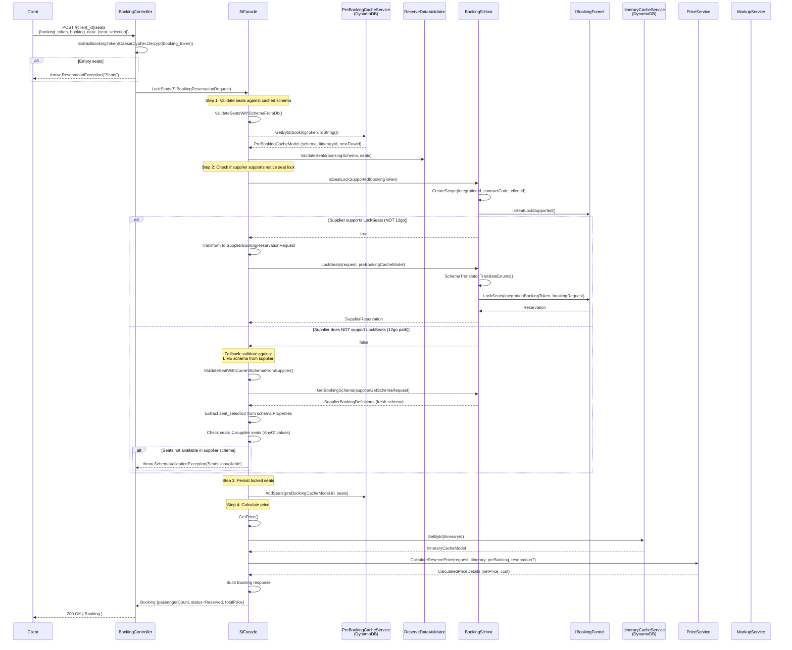

# LockSeats (Seat Lock)

## HTTP Contract

| Field | Value |
|-------|-------|
| **Method** | `POST` |
| **Path** | `/v{version}/{client_id}/seats` |
| **Auth** | API Key (`x-api-key` header) |

### Path Parameters

| Name | Type | Description |
|------|------|-------------|
| `client_id` | `string` | Client identifier |

### Headers

| Name | Required | Description |
|------|----------|-------------|
| `x-travelier-version` | Yes | API version (date format) |
| `x-correlation-id` | No | Flow correlation ID (pattern: `^[A-Za-z0-9\-=]{1,100}$`) |

### Request Body — `LockSeatsRequest`

```yaml
type: object
required:
  - booking_token
  - booking_data
properties:
  booking_token:
    type: string
    description: The booking token as provided in the itinerary (encrypted via Caesar cipher)
  booking_data:
    type: object
    description: The booking data
    properties:
      seat_selection:
        type: array
        description: The seat selection of the passenger
        items:
          type: string
```

**C# model in controller:**

```csharp
// From BookingController.LockSeats():
lockSeatsRequest.BookingToken   // string — encrypted BookingToken
lockSeatsRequest.BookingData.SeatSelection  // List<string> — seat IDs
```

### Response `200 OK`

Returns a `Booking` object (subset):

```json
{
  "passenger_count": 2,
  "status": "reserved",
  "total_price": {
    "amount": "150.00",
    "currency": "THB"
  }
}
```

**C# response construction** (from `SiFacade.LockSeats`):

| Field | Value | Source |
|-------|-------|--------|
| `PassengerCount` | `seats.Count` | Number of selected seats |
| `Status` | `BookingStatus.Reserved` | Hardcoded |
| `TotalPrice.Amount` | `price.NetPrice.DisplayAmount` | Calculated net price after markup |
| `TotalPrice.Currency` | Parsed from `price.NetPrice.Currency` | |

> **Note:** Unlike `ConfirmBooking` and `CreateBooking`, the LockSeats response does NOT include `id`, `from_station`, `to_station`, `departure_time`, `integration`, `voucher_url`, etc. It returns a minimal Booking object.

### Error Responses

| Code | Condition |
|------|-----------|
| `400` | Invalid request / empty seats |
| `401` | Unauthorized |
| `404` | Not found |
| `422` | Seats unavailable / schema validation failure |
| `500` | Internal server error |

## Client Usage

Clients call this endpoint **after** `GetItinerary` and **before** `CreateBooking` (reserve). It is an optional step in the booking funnel to pre-lock specific seats.

**Preconditions:**
1. Client must have a valid `BookingToken` from a prior `GetItinerary` call
2. Seats must be non-empty
3. The `BookingToken` is encrypted (Caesar cipher) — server decrypts it

**Typical flow:**
1. Client calls `GET /{client_id}/itineraries/{itinerary_id}` → receives `bookingToken` and seat schema
2. Client calls `POST /{client_id}/seats` with `{ booking_token, booking_data: { seat_selection: ["A1", "A2"] } }`
3. Server validates seats and stores them in cache
4. Client calls `POST /{client_id}/bookings` (reserve) — locked seats are automatically used from cache

**Key behavior:** The locked seats stored in `PreBookingCacheService` are later picked up during `BookingReservation` in `SiFacade`:
```csharp
// SiFacade.BookingReservation():
if (preBookingCacheModel.LockedSeats is { Count: > 0 })
    siBookingReservationRequest.BookingData.SeatSelection = preBookingCacheModel.LockedSeats;
```

## Internal Flow



## 12go Equivalent

### 12go is actively developing seat lock functionality

**12go is actively developing native seat lock functionality** — this was confirmed by management. Native seat lock is in development on 12go's side.

Today, the `OneTwoGoBookingFunnel` does **not** implement `LockSeats()` or `IsSeatLockSupported()`. There is no `LockSeats` or `IsSeatLockSupported` method in the `OneTwoGoBookingFunnel` class — searching the codebase confirms zero matches.

This means we **won't need to fake seat lock long-term**; once 12go ships native seat lock, we can pass through directly. The **client-facing contract still needs to be preserved regardless** — our LockSeats endpoint and request/response shapes remain the same whether we use the fallback path or native 12go seat lock.

### What actually happens for 12go (current state)

1. **No supplier call to lock seats** — no `POST` or `PUT` to the 12go API
2. Instead, Denali **re-fetches the booking schema** from 12go via `BookingSiHost.GetBookingSchema()` → which internally calls the 12go schema endpoint
3. Denali extracts the `seat_selection` field from the schema's `Properties`
4. Denali validates that all requested seats exist in the schema's `AnyOf` values (the set of available seats from the supplier)
5. If validation passes, seats are **stored in DynamoDB only** (`PreBookingCacheService.AddSeats()`)
6. These stored seats are later used during `CreateBooking` (reserve) to override the seat selection

### Validation logic (fallback path)

```csharp
// SiFacade.ValidateSeatWithCurrentSchemaFromSupplier():
response.BookingDefinitions.Schema.Properties
    .TryGetValue("seat_selection", out var schemaSeats);

if (schemaSeats?.Items?.First()?.AnyOf != null && schemaSeats.Items.First().AnyOf.Any())
{
    var seatsFromSupplier = schemaSeats.Items.First().AnyOf
        .Select(x => x.Const?.ToString())
        .Where(x => !string.IsNullOrEmpty(x)).ToList();
    
    if (!seats.All(x => seatsFromSupplier.Contains(x)))
        throw new SchemaValidationException(SeatsUnavailable, seats);
}
```

### Equivalent 12go API calls (indirect)

| Step | 12go API | Purpose |
|------|----------|---------|
| Schema refresh | `GET /checkout/{cartId}` (via `GetBookingSchema`) | Fetch current seat availability |

> **No direct seat lock API exists on 12go.** The "lock" is purely a Denali-side cache operation.

## Data Dependencies

### Read (inputs)

| Store | Key | Data | Purpose |
|-------|-----|------|---------|
| **PreBookingCacheService** (DynamoDB) | `bookingToken.ToString()` | `PreBookingCacheModel` — bookingSchema, itineraryId, nextFlowId, bookingSchemaDictionary, nameToSupplierNameFields | Validate seats against schema |
| **ItineraryCacheService** (DynamoDB) | `itineraryId.ToString()` | `ItineraryCacheModel` — itinerary (pricing), segments | Used for price calculation |
| **12go schema** (live API) | Via `BookingSiHost.GetBookingSchema()` | Current seat availability | Only in fallback path (12go); re-fetches to ensure seats are still available |

### Write (outputs)

| Store | Operation | Data |
|-------|-----------|------|
| **PreBookingCacheService** (DynamoDB) | `AddSeats(bookingToken, seats)` | Stores `List<string>` seat IDs in the pre-booking cache model's `LockedSeats` field |

### External Services

| Service | Purpose |
|---------|---------|
| **ReserveDataValidator** | `ValidateSeats(bookingSchema, seats)` — validates seats against the cached schema (first validation) |
| **PriceService** | `CalculateReservePrice()` — calculates net price for the selected seats |
| **FeatureManager** | `UseOldFlowPerClient` — controls old vs new schema fetch path |
| **BookingSiHost** | `IsSeatLockSupported()` — checks if supplier supports native locking |
| **BookingSiHost** | `GetBookingSchema()` — re-fetches schema (only in fallback path) |

### Downstream consumers

| Consumer | How | What |
|----------|-----|------|
| `SiFacade.BookingReservation()` | Reads `preBookingCacheModel.LockedSeats` | Overrides `SeatSelection` in the reserve request with the previously locked seats |

## What Can Go Away

1. **Dual validation path** — The "supported" vs "not supported" branching adds significant complexity. Since 12go always takes the fallback path, the `IsSeatLockSupported()` check and the entire native lock path are unnecessary for 12go. In a simplified architecture, a single validation approach would suffice.

2. **Schema re-fetch for validation** — In the fallback path, Denali calls `BookingSiHost.GetBookingSchema()` to get fresh seat availability. This is an extra round-trip to the supplier just to validate. If the cached schema is recent enough (it was just fetched in GetItinerary), this call could be eliminated.

3. **DynamoDB as intermediate seat store** — `PreBookingCacheService.AddSeats()` writes to DynamoDB purely to carry state to the next step (`CreateBooking`). If the booking funnel is redesigned with a single session store or passed through request state, this intermediate write can be removed.

4. **Price calculation at lock time** — `GetPrice()` calls `PriceService.CalculateReservePrice()` during seat lock just to return a `total_price` in the response. This price is recalculated again during `CreateBooking`. The lock-time price could be simplified or deferred.

5. **Old method branching** — `UseOldMethod()` + `UseOldFlowPerClient` creates two code paths for the schema fetch in the fallback validation. Once the old `supplierAdapterFactory` is removed, this simplifies.

6. **SiBookingReservationRequest reuse** — The `LockSeats` endpoint reuses `SiBookingReservationRequest` (designed for reserve), populating dummy passengers (`seats.Select(_ => new BookingRequestBookingDataPassengersInner()).ToList()`). A dedicated request model would be cleaner.

7. **Empty Booking response** — The response is a minimal `Booking` object with only `PassengerCount`, `Status`, and `TotalPrice`. The `Booking` type has many other fields (id, from_station, etc.) that are all null/default. A dedicated `LockSeatsResponse` type would be more appropriate.

8. **BookingSiHost.LockSeats() never called for 12go** — The entire `BookingSiHost.LockSeats()` method (lines 38-190) with its extensive exception handling is dead code for the 12go integration. Only relevant if other suppliers support native seat locking.

## Open Questions

1. **Is the seat lock step actually used by clients for 12go?** Since 12go doesn't support native locking, and the "lock" is just a cache write + validation, is this step mandatory in the client flow or optional?

2. **Race condition between lock and reserve** — Between `LockSeats` (validates + caches) and `CreateBooking` (uses cached seats), another user could book those seats. The fallback validation gives a point-in-time check, not a reservation. How often does this cause issues?

3. **Why validate against BOTH cached schema AND live schema?** `ValidateSeatsWithSchemaFromDb()` validates against the cached schema, then `ValidateSeatWithCurrentSchemaFromSupplier()` validates against a freshly-fetched schema. Is the first validation redundant?

4. **What is the TTL on PreBookingCacheModel?** The `_expirationTimeInMinutes` (default 7200 = 5 days) seems long. If a user locks seats but doesn't proceed to booking for days, the stale locked seats could cause issues.

5. **The price returned at lock time vs reserve time** — Are clients expected to show this price to users? If so, what happens when the price changes between lock and reserve?

6. **Can the lock step be eliminated entirely for 12go?** Since it doesn't actually lock anything on the supplier side, could the seat validation be done at reserve time instead, removing the separate endpoint call?

7. **What suppliers DO support native seat locking?** Understanding which integrations use the supported path helps determine if the branching complexity is justified.

8. **Metrics and events** — Unlike ConfirmBooking, LockSeats does NOT publish any Kafka events. Is observability sufficient for this step, or should lock events be added for monitoring?
