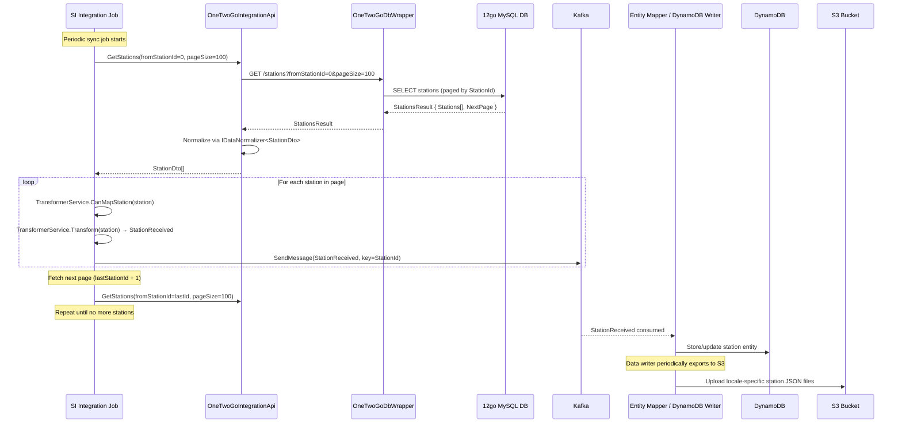
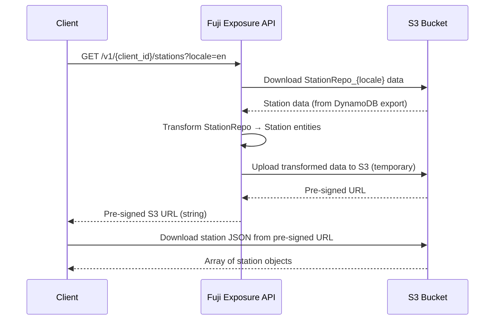

# Stations Endpoint

## HTTP Contract

**Base URL:** `https://api.travelier.com/v1/{client_id}/stations`

**Authentication:** API Key via `X-API-KEY` header

### GET /v1/{client_id}/stations

Returns a pre-signed S3 URL pointing to a JSON file containing all stations for the requested locale.

| Parameter   | In    | Type   | Required | Description                        |
|-------------|-------|--------|----------|------------------------------------|
| client_id   | path  | string | yes      | The calling client's identifier    |
| locale      | query | string | no       | Locale/culture code (e.g. `en`, `th`) |

**Response:** `200 OK` — returns a **string** (pre-signed S3 URL), not a JSON array directly.

The S3 file contains an array of station objects:

```json
[
  {
    "id": "string (Fuji station ID)",
    "name": "string",
    "name_alterations": ["string"],
    "transportation_type": "Bus | Ferry | Shuttle | Train",
    "address": {
      "country": "string",
      "state": "string",
      "city": { "id": "string", "name": "string" },
      "province": "string",
      "region": "string",
      "street_and_number": "string",
      "time_zone": "string",
      "coordinate": { "latitude": 0.0, "longitude": 0.0 }
    },
    "keywords": ["string"],
    "description": "string",
    "images": ["uri"]
  }
]
```

**Required fields (per OpenAPI spec):** `id`, `name`, `address`, `transportation_type`

### GET /v1/{client_id}/stations/GetList

Internal/alternative endpoint that returns station data as a direct JSON array (not a pre-signed URL).

| Parameter | In    | Type    | Required | Description                  |
|-----------|-------|---------|----------|------------------------------|
| locale    | query | string  | yes      | Locale/culture code          |
| top10K    | query | boolean | no       | Limit results to first 10,000 |

**Response:** `200 OK` — `List<StationDto>` directly in the response body.

### Exposure API DTO (StationDto)

| Field              | Type           | Notes                           |
|--------------------|----------------|---------------------------------|
| Id                 | string         | Fuji-assigned station ID        |
| Name               | string         | Localized station name          |
| NameAlterations    | string?        | Alternative names               |
| TransportationType | string         | Bus, Ferry, Shuttle, Train      |
| Address            | AddressDto     | Nested address object           |
| Description        | string         | Station description             |
| Coordinates        | CoordinatesDto | { Latitude, Longitude }         |
| Images             | string[]?      | Image URIs                      |

### AddressDto

| Field           | Type     |
|-----------------|----------|
| Country         | string   |
| State           | string?  |
| Region          | string?  |
| Province        | string?  |
| City            | CityDto? | `{ Id, Name }` |
| StreetAndNumber | string?  |
| TimeZone        | string   |
| ZipCode         | string?  |
| Description     | string?  |

## Client Usage

1. Client calls `GET /v1/{client_id}/stations?locale=en` on startup or periodically
2. Receives a **pre-signed S3 URL** (string)
3. Downloads the full station list from S3
4. Maps Fuji station IDs to their own internal station identifiers
5. When performing search requests, the client passes **Fuji station IDs** as origin/destination

**Critical dependency:** Clients store and use **Fuji station IDs** (not 12go station IDs). All subsequent search/booking operations reference these Fuji IDs. This creates a mapping dependency that must be maintained in any transition.

## Internal Flow (mermaid sequence diagram)

### Sync Pipeline (periodic job)



### Client Request Flow



## 12go Equivalent

### Where the data comes from

All station data originates from the **12go MySQL database**. The pipeline is:

1. **OneTwoGoDbWrapper** (`GET /stations?fromStationId={id}&pageSize={size}`) — thin REST wrapper over 12go MySQL, using `IStationRepo.GetPaged()`
2. **OneTwoGoIntegrationApi** — calls the wrapper, normalizes data via `IDataNormalizer<StationDto>`
3. **SI Integration Job** — transforms and publishes to Kafka

### 12go raw station data (StationDto from SI layer)

The raw station record from 12go MySQL is much richer than what's exposed:

| Key Fields       | Type     | Notes                                          |
|------------------|----------|-------------------------------------------------|
| StationId        | int      | 12go's internal station ID (integer)            |
| ProvinceId       | int?     | Links station to a province (used for POI mapping) |
| ProvinceName     | string   | Province name text                              |
| StationName      | string   | English name                                    |
| StationNameTh    | string   | Thai name                                       |
| StationNameRu/Cn/Zh/Jp/Ko/Vi/Ms/It/Nl/Sv/De/Fr/Es/In/Uk/Pt/Ar/Hr | string | Localized names for each locale |
| Lat, Lng         | double?  | Coordinates                                     |
| CountryCode      | string   | Country code                                    |
| StationCode      | string   | Station code                                    |
| StationAddress   | string   | Address text                                    |
| TimezoneName     | string   | Timezone                                        |
| MapStations      | MapStationDto[] | Mappings to integration suppliers          |
| TranslineId      | int?     | Transport line reference                        |
| Hub, Major       | int?     | Station importance flags                        |

### Could clients call 12go directly?

Theoretically possible, but would require:
- Clients to use **12go station IDs** (integers) instead of Fuji station IDs (strings)
- Re-implementing the normalization/transformation logic
- Handling pagination (cursor-based by `fromStationId`)
- The OneTwoGoDbWrapper service to be exposed (it's currently internal)

## Data Dependencies

| Dependency                | Description                                                     |
|---------------------------|-----------------------------------------------------------------|
| 12go MySQL DB             | Source of truth for all station data                            |
| OneTwoGoDbWrapper service | REST wrapper over MySQL providing paginated station queries     |
| SI Integration Job        | Periodic sync job that pulls, transforms, publishes to Kafka    |
| Kafka                     | Message bus carrying `StationReceived` messages                 |
| Entity Mapper / Data Writer | Consumes Kafka messages, writes to DynamoDB                  |
| DynamoDB                  | Stores station entities (keyed by Pk/Sk)                       |
| S3                        | Stores locale-specific station JSON exports; serves pre-signed URLs |
| IDataNormalizer<StationDto> | Normalization logic during sync                              |
| ITransformerService       | Transforms StationDto → StationReceived Kafka message          |
| IMapperTransformerService | Transforms DynamoDB repo entities → API response DTOs          |
| DefaultCulture config     | Fallback locale if requested locale has no data                |

## What Can Go Away

| Component                  | Can it go away? | Condition                                                     |
|----------------------------|-----------------|---------------------------------------------------------------|
| OneTwoGoDbWrapper          | Yes             | If clients fetch stations directly from 12go or a new source  |
| SI Integration Job (stations) | Yes          | If there's no need to maintain a Fuji-side copy               |
| Kafka station messages     | Yes             | If sync pipeline is replaced                                  |
| DynamoDB station storage   | Yes             | If data is served from a different store                      |
| S3 pre-signed URL pattern  | Yes             | If API returns data directly instead of via S3                |
| Exposure API /stations     | Possibly        | Only if all clients migrate to a new endpoint                 |
| Station ID mapping layer   | **No (critical)**| Clients have Fuji station IDs embedded; migration needed     |
| Locale transformation      | Depends         | 12go already has localized names; if used directly, this is simpler |

## Open Questions

1. **Station ID migration**: Clients have stored Fuji station IDs. How do we handle the transition? Do we provide a mapping table (Fuji ID → 12go ID) or maintain backwards-compatible IDs?
2. **How many active clients** are using this endpoint and how deeply are Fuji station IDs embedded in their systems?
3. **Sync frequency**: How often does the SI integration job run? What's the staleness tolerance?
4. **Stale station deletion**: `MappingServices.DeleteStaleStations()` deletes stations not updated within N days. Is this logic needed in the new system?
5. **Pre-signed URL pattern**: Why is data served via S3 pre-signed URLs instead of directly? Is this for payload size reasons (large station list)?
6. **GetList vs GetStations**: Two endpoints exist — `GetList` (direct JSON) and the default `GET` (pre-signed URL). Which do clients actually use? Can `GetList` be removed?
7. **top10K parameter**: Who uses the 10K limit? Is this for testing or a real use case?
8. **MapStations data**: The raw 12go station includes `MapStationDto[]` (integration supplier mappings). Is this data exposed anywhere or only used internally?
9. **Locale fallback**: If the requested locale has no data, it falls back to `DefaultCulture`. Is this behavior desired in the new system?
10. **12go DB direct access**: Is the 12go MySQL DB stable enough to be called directly by clients, or is the caching/sync layer load-protective?
