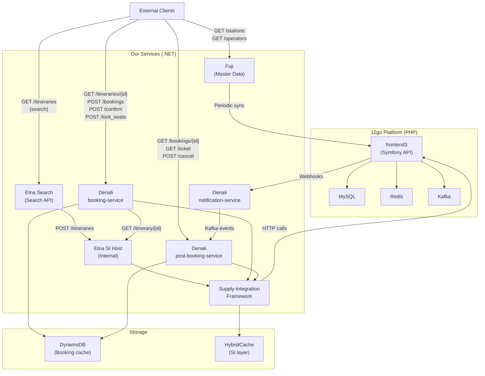
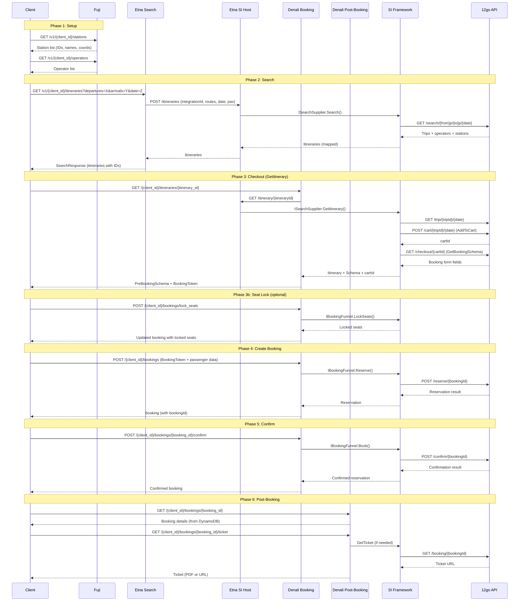
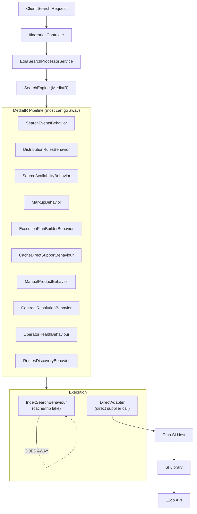
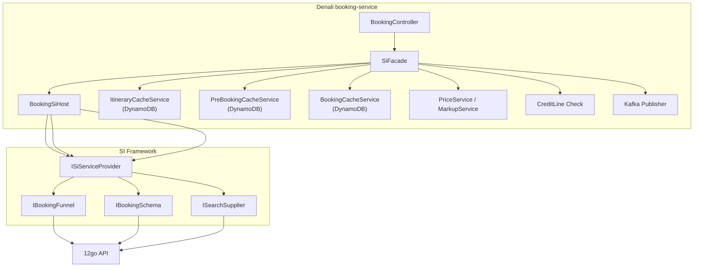

# Current System Architecture Overview

## Services Summary

| Service | Language | Purpose | Repository |
|---------|----------|---------|------------|
| **Etna Search** | .NET 8 | Itinerary search for clients | `etna` |
| **Etna SI Host** | .NET 8 | Internal: proxies search to SI framework | `etna` |
| **Denali booking-service** | .NET 8 | Booking funnel (GetItinerary, Reserve, Confirm, SeatLock) | `denali` |
| **Denali post-booking-service** | .NET 8 | Post-booking (GetBookingDetails, GetTicket, Cancel) | `denali` |
| **Denali booking-notification-service** | .NET 8 | Webhook receiver for supplier notifications | `denali` |
| **Fuji** | .NET 8 | Master data (stations, operators, POIs) | `fuji` |
| **Supply-Integration framework** | .NET 8 | Multi-supplier integration abstraction layer | `supply-integration` |
| **12go (frontend3)** | PHP 8.3 / Symfony 6.4 | Core travel platform (search, booking, ticketing) | `frontend3` |

## High-Level Architecture

## Client Journey (End-to-End Flow)

This is the complete flow a client follows from first contact to ticket retrieval:

## Search Flow Detail

Etna Search has a complex MediatR pipeline that will be mostly eliminated. Today:

**What survives**: Only the direct call path (DirectAdapter -> 12go). Everything else (trip lake, index cache, operator health, distribution rules, experiments, manual products) is framework overhead for multi-supplier support.

**What might need to stay**: MarkupBehavior (price markup for clients), RoutesDiscovery (station-to-route mapping).

## Booking Flow Detail

**Key orchestration in SiFacade**:
1. Resolves integrationId and contractCode
2. Manages DynamoDB caching at each step
3. Applies pricing/markup
4. Checks credit line balance
5. Publishes Kafka events
6. Handles encryption of IDs (Caesar cipher for itinerary IDs, booking tokens)

**What can go away**: DynamoDB caching (12go stores bookings), SI framework abstraction (only one integration). Credit line and markup may need to stay.

## Data Storage Map

| Store | Service | Purpose | Can It Go? |
|-------|---------|---------|------------|
| DynamoDB - ItineraryCache | Denali booking-service | Cache itinerary between search and booking | Yes - can re-fetch from 12go |
| DynamoDB - PreBookingCache | Denali booking-service | Cache booking schema + locked seats | Yes - can re-fetch from 12go |
| DynamoDB - BookingCache | Denali booking-service | Store active bookings | Yes - 12go stores bookings |
| DynamoDB - BookingEntity | Denali post-booking-service | Store confirmed bookings | Yes - proxy to 12go |
| HybridCache | Supply-Integration | Cache trip data (price, operator) between search and checkout | Likely yes - re-fetch from 12go |
| MemoryCache | Etna Search | Cache index search results, station mappings | Yes - no index search needed |
| MySQL | Fuji (via OneTwoGoDbWrapper) | Station/operator master data from 12go | Keep - still need station mapping |
| MySQL | 12go (frontend3) | Core data store | Keep - this is the source of truth |
| Redis | 12go (frontend3) | Caching layer | Keep - 12go internal |

## Communication Map

| From | To | Protocol | Purpose |
|------|----|----------|---------|
| Client | Etna Search | HTTP REST | Search itineraries |
| Client | Denali booking-service | HTTP REST | Booking funnel |
| Client | Denali post-booking-service | HTTP REST | Post-booking operations |
| Client | Fuji Exposure API | HTTP REST | Stations, operators |
| Etna Search | Etna SI Host | HTTP REST | Proxy search to SI |
| Denali | Etna SI Host | HTTP REST | Get itinerary details |
| Denali | SI Framework | In-process | Booking operations |
| SI Framework | 12go (frontend3) | HTTP REST | All supplier operations |
| Fuji | 12go (OneTwoGoDbWrapper) | HTTP REST + MySQL | Station sync |
| 12go | Denali notification-service | HTTP Webhook | Booking status changes |
| Denali services | Kafka | Async messaging | Internal events |
