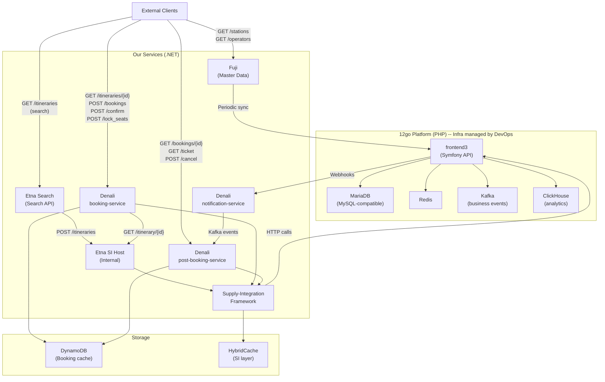

# Current System Architecture Overview

This is an index. Each section provides minimal context and links to the detailed documents. **Read the linked files for full analysis.**

## Scope

- **In scope**: All B2B client-facing endpoints (static data, search, booking funnel, post-booking)
- **Out of scope**: Distribution service, Ushba (pricing module -- being sunset separately), station mapping ID migration, client onboarding process

## Services

| Service | Language | Purpose | Repository |
|---------|----------|---------|------------|
| **Etna Search** | .NET 8 | Itinerary search for clients | `etna` |
| **Etna SI Host** | .NET 8 | Internal: proxies search to SI framework | `etna` |
| **Denali booking-service** | .NET 8 | Booking funnel (GetItinerary, Reserve, Confirm, SeatLock) | `denali` |
| **Denali post-booking-service** | .NET 8 | Post-booking (GetBookingDetails, GetTicket, Cancel) | `denali` |
| **Denali booking-notification-service** | .NET 8 | Webhook receiver for supplier notifications | `denali` |
| **Fuji** | .NET 8 | Master data (stations, operators, POIs) | `fuji` |
| **Supply-Integration framework** | .NET 8 | Multi-supplier integration abstraction layer | `supply-integration` |
| **12go (frontend3)** | PHP 8.3 / Symfony 6.4 | Core travel platform (search, booking, ticketing) | `frontend3` |

## High-Level Architecture

```mermaid
flowchart TD
    Client["External Clients"]

    subgraph OurServices ["Our Services (.NET)"]
        Fuji["Fuji\n(Master Data)"]
        EtnaSearch["Etna Search\n(Search API)"]
        EtnaSiHost["Etna SI Host\n(Internal)"]
        DenaliBooking["Denali\nbooking-service"]
        DenaliPostBooking["Denali\npost-booking-service"]
        DenaliNotifications["Denali\nnotification-service"]
        SIFramework["Supply-Integration\nFramework"]
    end

    subgraph Storage ["Storage"]
        DynamoDB["DynamoDB\n(Booking cache)"]
        HybridCache["HybridCache\n(SI layer)"]
    end

    subgraph TwelveGo ["12go Platform (PHP) -- Infra managed by DevOps"]
        Frontend3["frontend3\n(Symfony API)"]
        MariaDB["MariaDB\n(MySQL-compatible)"]
        Redis["Redis"]
        Kafka12go["Kafka\n(business events)"]
        ClickHouse["ClickHouse\n(analytics)"]
    end

    Client -->|"GET /stations\nGET /operators"| Fuji
    Client -->|"GET /itineraries\n(search)"| EtnaSearch
    Client -->|"GET /itineraries/{id}\nPOST /bookings\nPOST /confirm\nPOST /lock_seats"| DenaliBooking
    Client -->|"GET /bookings/{id}\nGET /ticket\nPOST /cancel"| DenaliPostBooking

    EtnaSearch -->|"POST /itineraries"| EtnaSiHost
    DenaliBooking -->|"GET /itinerary/{id}"| EtnaSiHost
    EtnaSiHost --> SIFramework
    DenaliBooking --> SIFramework
    DenaliPostBooking --> SIFramework
    DenaliNotifications -->|"Kafka events"| DenaliPostBooking

    SIFramework -->|"HTTP calls"| Frontend3
    Fuji -->|"Periodic sync"| Frontend3

    DenaliBooking --> DynamoDB
    DenaliPostBooking --> DynamoDB
    SIFramework --> HybridCache

    Frontend3 --> MariaDB
    Frontend3 --> Redis
    Frontend3 --> Kafka12go
    Frontend3 --> ClickHouse

    Frontend3 -->|"Webhooks"| DenaliNotifications
```

## Endpoints

Each endpoint is documented with HTTP contract, internal flow, 12go equivalent, and open questions. **Read individual files for full details.**

| Endpoint | File | 12go Call(s) |
|----------|------|--------------|
| Search | [search.md](endpoints/search.md) | `GET /search/{from}p/{to}p/{date}` |
| GetItinerary | [get-itinerary.md](endpoints/get-itinerary.md) | 3 calls: trip, cart, checkout |
| CreateBooking | [create-booking.md](endpoints/create-booking.md) | `POST /reserve` + status fetch |
| ConfirmBooking | [confirm-booking.md](endpoints/confirm-booking.md) | `POST /confirm` + status fetch |
| SeatLock | [seat-lock.md](endpoints/seat-lock.md) | None (local only; 12go developing native support) |
| GetBookingDetails | [get-booking-details.md](endpoints/get-booking-details.md) | Reads from local DB (lazy 12go fetch for tickets) |
| GetTicket | [get-ticket.md](endpoints/get-ticket.md) | `GET /booking/{id}` |
| CancelBooking | [cancel-booking.md](endpoints/cancel-booking.md) | Refund options + refund |
| Notifications | [notifications.md](endpoints/notifications.md) | Webhook from 12go |
| Stations | [stations.md](endpoints/stations.md) | MariaDB sync → S3 snapshot |
| Operators | [operators.md](endpoints/operators.md) | MariaDB sync |
| POIs | [pois.md](endpoints/pois.md) | — |
| Incomplete Results | [incomplete-results.md](endpoints/incomplete-results.md) | — |
| gRPC Search | [grpc-search-integration.md](endpoints/grpc-search-integration.md) | Google Metasearch integration |

## Cross-Cutting Concerns

| Concern | File |
|---------|------|
| Authentication | [authentication.md](cross-cutting/authentication.md) |
| Data Storage | [data-storage.md](cross-cutting/data-storage.md) |
| Messaging & Events | [messaging.md](cross-cutting/messaging.md) |
| Monitoring | [monitoring.md](cross-cutting/monitoring.md) |
| API Contract Conventions | [api-contract-conventions.md](cross-cutting/api-contract-conventions.md) |
| Transition Complexity | [transition-complexity.md](cross-cutting/transition-complexity.md) |

## Integration Layer

| Topic | File |
|-------|------|
| 12go API Surface | [12go-api-surface.md](integration/12go-api-surface.md) |
| 12go Service Layer | [12go-service-layer.md](integration/12go-service-layer.md) |
| SI Framework | [si-framework.md](integration/si-framework.md) |
| Caching Strategy | [caching-strategy.md](integration/caching-strategy.md) |

## Migration Issues

Specific transition challenges analyzed end-to-end. **Each file covers current behavior, 12go equivalent, gap analysis, and recommended approach.**

| Issue | File |
|-------|------|
| Station ID Mapping | [station-id-mapping.md](migration-issues/station-id-mapping.md) |
| Booking Schema Parser | [booking-schema-parser.md](migration-issues/booking-schema-parser.md) |
| Booking ID Transition | [booking-id-transition.md](migration-issues/booking-id-transition.md) |
| API Key Transition | [api-key-transition.md](migration-issues/api-key-transition.md) |
| Seat Lock | [seat-lock.md](migration-issues/seat-lock.md) |
| Webhook Routing | [webhook-routing.md](migration-issues/webhook-routing.md) |
| Recheck Mechanism | [recheck-mechanism.md](migration-issues/recheck-mechanism.md) |
| Data Team Events | [data-team-events.md](migration-issues/data-team-events.md) |
| Client Migration Process | [client-migration-process.md](migration-issues/client-migration-process.md) |
| Monitoring & Observability | [monitoring-observability.md](migration-issues/monitoring-observability.md) |

## Search POC Results

F3 search endpoint POC (ST-2432, branch `ST-2432-b2b-search-poc`). All 4 search types return HTTP 200 with correct B2B contract shape. **Read the setup issues doc for friction data.**

| Document | File |
|----------|------|
| Setup friction & local env issues | [local-env-setup-issues.md](search-poc-results/local-env-setup-issues.md) |
| Province → Province | [request](search-poc-results/province-to-province/request.sh) / [response](search-poc-results/province-to-province/response.json) |
| Station → Province | [request](search-poc-results/station-to-province/request.sh) / [response](search-poc-results/station-to-province/response.json) |
| Province → Station | [request](search-poc-results/province-to-station/request.sh) / [response](search-poc-results/province-to-station/response.json) |
| Station → Station | [request](search-poc-results/station-to-station/request.sh) / [response](search-poc-results/station-to-station/response.json) |

## 12go Platform

- **Stack**: PHP 8.3 / Symfony 6.4, MariaDB, Redis, Kafka, ClickHouse, Datadog
- **Infrastructure**: Fully managed by DevOps (scaling, deployment, config via release requests)
- **Environments**: Local (Docker) → Staging → PreProd (real external connections) → Prod
- **Dev URL**: `https://integration-dev.travelier.com/v1/{client_id}/`

## Team & Constraints

See [system-context.md](../prompts/context/system-context.md) — Team Composition and Key Constraints sections.
