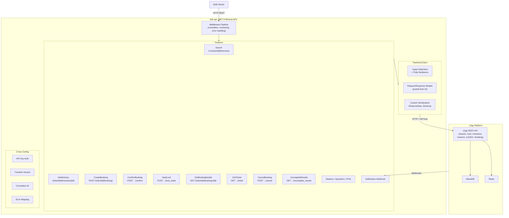
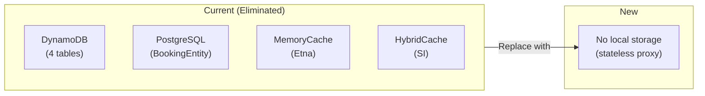
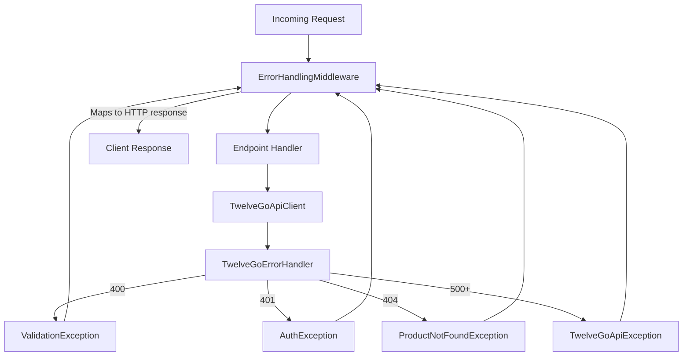
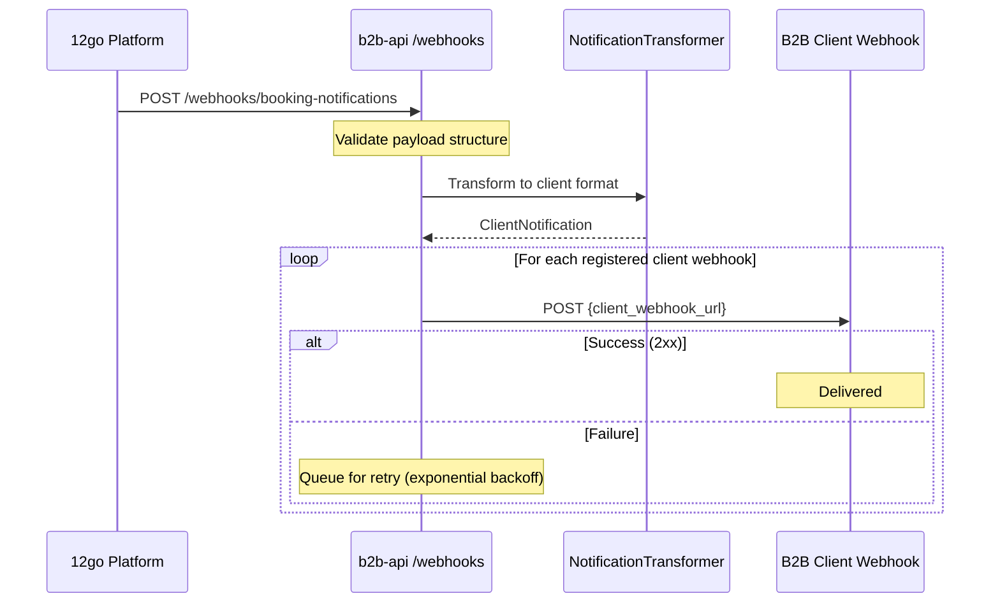
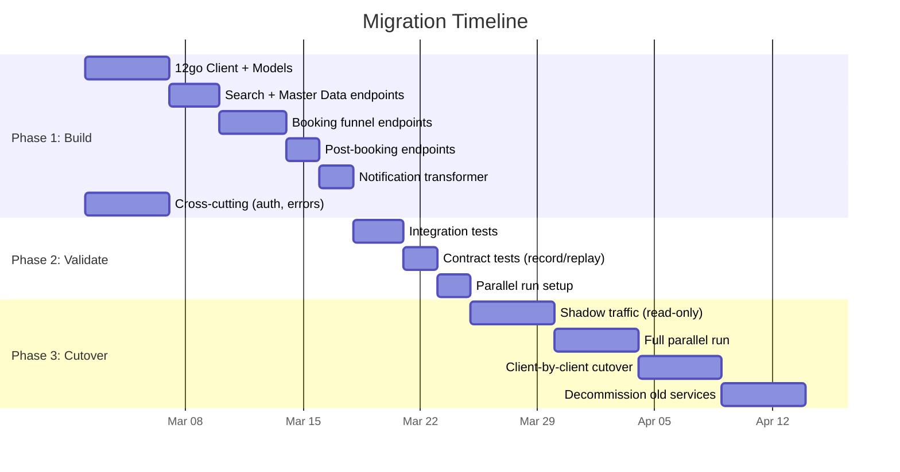

# Alternative 1: Trimmed .NET Service

## Executive Summary

Replace four .NET repositories (~340 projects, 200-400K LOC) with a **single .NET 8 minimal API service** containing approximately **5-8K lines of application code**. The service acts as a thin, stateless HTTP proxy between B2B clients and the 12go platform, preserving all 13 client-facing endpoints. The architecture uses vertical slice organization with typed `HttpClient` for the 12go API, zero local databases, and Datadog-native observability. With two senior .NET developers, the MVP is achievable in **3-4 weeks**, followed by 2-3 weeks of parallel-run validation before cutover.

## Architecture Overview



## Service Topology

### Recommendation: Single Service

**One service, one deployment unit, one repository.**

| Factor | Single Service | Two Services (search + booking) |
|--------|---------------|--------------------------------|
| Deployment complexity | 1 Docker image, 1 deploy pipeline | 2 images, 2 pipelines, version coordination |
| Scaling | Scale horizontally via replicas | Independent scaling per concern |
| Code sharing | Direct method calls | Shared NuGet package or duplication |
| Team coordination | Zero overhead | Need to coordinate deployments |
| Debugging | Single log stream | Correlation across services |
| DevOps burden | Minimal | Double the work |

**Why single service wins:**

1. **The service is a thin proxy.** There is no significant compute, no background processing, no state. Every endpoint makes 1-3 HTTP calls to 12go and transforms the response. There is nothing to scale independently.

2. **Search latency is dominated by 12go.** Our service adds <5ms of overhead (JSON deserialization + re-serialization). Splitting into two services doesn't improve search performance — the bottleneck is 12go's MariaDB.

3. **Team of 3-4 developers.** Two services means context-switching, split PRs, and coordination overhead for no architectural benefit.

4. **DevOps manages infrastructure.** Every additional service is a release request, a health check, a monitoring dashboard. Minimizing their surface area respects their capacity during transition.

If search traffic eventually requires independent scaling (unlikely given 12go is the bottleneck), the vertical slice structure makes extraction trivial later.

## Project Structure

```
b2b-api/
├── b2b-api.sln
├── src/
│   ├── B2bApi/                          # Main API project (~3-5K LOC)
│   │   ├── B2bApi.csproj
│   │   ├── Program.cs                   # Composition root, middleware, DI
│   │   ├── appsettings.json
│   │   ├── Dockerfile
│   │   │
│   │   ├── TwelveGoClient/              # 12go HTTP client (~1.5K LOC)
│   │   │   ├── TwelveGoApiClient.cs     # All 11 12go endpoints
│   │   │   ├── TwelveGoOptions.cs       # Base URL, API key, timeouts
│   │   │   ├── Models/
│   │   │   │   ├── SearchModels.cs      # Trip, TravelOptions, Station, etc.
│   │   │   │   ├── BookingModels.cs     # Cart, Schema, Reserve, Confirm
│   │   │   │   ├── RefundModels.cs      # RefundOptions, RefundRequest
│   │   │   │   └── SharedModels.cs      # Price, FormField, ErrorResponse
│   │   │   ├── Serialization/
│   │   │   │   ├── ReserveDataConverter.cs
│   │   │   │   └── BookingSchemaParser.cs
│   │   │   └── TwelveGoErrorHandler.cs  # HTTP status → domain error mapping
│   │   │
│   │   ├── Features/                    # Vertical slices (~2-3K LOC)
│   │   │   ├── Search/
│   │   │   │   ├── SearchEndpoint.cs    # Route + handler
│   │   │   │   └── SearchMapper.cs      # 12go → client response mapping
│   │   │   ├── Checkout/
│   │   │   │   ├── GetItineraryEndpoint.cs
│   │   │   │   └── CheckoutMapper.cs
│   │   │   ├── Booking/
│   │   │   │   ├── CreateBookingEndpoint.cs
│   │   │   │   ├── ConfirmBookingEndpoint.cs
│   │   │   │   ├── SeatLockEndpoint.cs
│   │   │   │   └── BookingMapper.cs
│   │   │   ├── PostBooking/
│   │   │   │   ├── GetBookingDetailsEndpoint.cs
│   │   │   │   ├── GetTicketEndpoint.cs
│   │   │   │   ├── CancelBookingEndpoint.cs
│   │   │   │   └── IncompleteResultsEndpoint.cs
│   │   │   ├── MasterData/
│   │   │   │   ├── StationsEndpoint.cs
│   │   │   │   ├── OperatorsEndpoint.cs
│   │   │   │   └── PoisEndpoint.cs
│   │   │   └── Notifications/
│   │   │       ├── WebhookEndpoint.cs
│   │   │       └── NotificationTransformer.cs
│   │   │
│   │   ├── Middleware/                   # Cross-cutting (~500 LOC)
│   │   │   ├── CorrelationIdMiddleware.cs
│   │   │   ├── ApiVersionMiddleware.cs
│   │   │   ├── ClientAuthMiddleware.cs
│   │   │   └── ErrorHandlingMiddleware.cs
│   │   │
│   │   ├── Configuration/
│   │   │   ├── ClientConfiguration.cs   # Per-client settings (API key, webhooks)
│   │   │   └── ServiceCollectionExtensions.cs
│   │   │
│   │   └── Contracts/                   # Client-facing DTOs (~500 LOC)
│   │       ├── SearchContracts.cs
│   │       ├── BookingContracts.cs
│   │       └── CommonContracts.cs
│   │
│   └── B2bApi.Tests/                    # Test project
│       ├── B2bApi.Tests.csproj
│       ├── TwelveGoClient/
│       │   ├── TwelveGoApiClientTests.cs
│       │   ├── ReserveDataConverterTests.cs
│       │   └── BookingSchemaParserTests.cs
│       ├── Features/
│       │   ├── SearchEndpointTests.cs
│       │   ├── BookingEndpointTests.cs
│       │   └── ...
│       ├── Middleware/
│       │   └── ErrorHandlingMiddlewareTests.cs
│       └── Fixtures/
│           ├── TwelveGoFakeServer.cs    # WireMock/fake for 12go
│           └── SampleResponses/         # Recorded 12go JSON responses
├── .github/
│   └── workflows/
│       └── ci.yml
└── README.md
```

**Total: 2 .csproj files** (1 API, 1 test). Down from 342.

### Why No Separate Library Project?

The 12go client could be extracted into a `B2bApi.TwelveGoClient` library project. However:
- There is exactly one consumer of this client.
- Extracting it adds NuGet versioning overhead with zero reuse benefit.
- If reuse is needed later, extraction is a 10-minute refactor.

### Why Vertical Slices Without a Mediator?

Each endpoint is a single `static` method (or thin class) that:
1. Receives the request from the route
2. Calls `TwelveGoApiClient` methods
3. Maps the response to the client contract
4. Returns the result

There is no cross-cutting orchestration between slices. Each slice is 50-150 lines. MediatR, Wolverine, or any mediator library adds indirection without providing value when there are no pipeline behaviors worth sharing. Simple `async` methods are the pipeline.

## Technology Choices

| Concern | Choice | Justification |
|---------|--------|---------------|
| **Framework** | .NET 8 Minimal API | Faster than MVC (~2.1M vs ~1.3M req/s), less ceremony, AOT-compatible, team knows .NET |
| **HTTP Client** | Typed `HttpClient` via `IHttpClientFactory` | 12go API has custom serialization (bracket-notation reserve, dynamic schema fields) that Refit cannot express cleanly. Manual client gives full control. |
| **Resilience** | `Microsoft.Extensions.Http.Resilience` (Polly v8) | Built-in with `IHttpClientFactory`. Exponential backoff for transient errors. No extra dependency. |
| **Serialization** | `System.Text.Json` | Native, fast, AOT-friendly. Custom converters for `ReserveDataRequest` and `BookingSchemaResponse`. |
| **Logging** | `Microsoft.Extensions.Logging` + Serilog (Datadog sink) | Structured JSON logging, direct Datadog integration. Source-generated `LoggerMessage` for hot paths. |
| **Tracing** | `dd-trace-dotnet` (Datadog native tracer) | Auto-instruments HttpClient, ASP.NET Core. Zero-code setup via Docker environment variables. Richer Datadog integration than OTel. |
| **Metrics** | `System.Diagnostics.Metrics` + Datadog DogStatsD | Native .NET metrics API, Datadog agent scrapes via StatsD. |
| **Health checks** | `AspNetCore.HealthChecks` | Built-in. Liveness = app running, Readiness = 12go reachable. |
| **Testing** | xUnit + `WebApplicationFactory` + WireMock.Net | Integration tests against fake 12go. No mocking frameworks for HTTP — test real pipeline. |
| **DI** | `Microsoft.Extensions.DependencyInjection` | Built-in. No Autofac. |
| **Configuration** | `appsettings.json` + environment variables | Standard .NET config. 12go uses `.env` — Docker Compose maps to env vars. Per-client config via JSON section or DB lookup. |

### Why Typed HttpClient Over Refit?

Refit excels at standard REST APIs with clean JSON request/response patterns. The 12go API has two complexity hotspots that make Refit awkward:

1. **`ReserveDataRequest` serialization**: Uses bracket notation (`passenger[0][first_name]`) in a flat key-value JSON body. This requires a custom `JsonConverter` that Refit's attribute-based model cannot express.

2. **`BookingSchemaResponse` parsing**: Returns a dynamic form with 20+ field patterns matched via `[JsonExtensionData]` and wildcard key matching. The deserialization logic is non-trivial parsing code, not a simple DTO.

A typed `HttpClient` wrapping `TwelveGoApiClient` gives full control over these hotspots while keeping the straightforward endpoints (search, confirm, refund) clean.

### Why Datadog Native Tracer Over OpenTelemetry?

12go's platform uses Datadog. The `dd-trace-dotnet` native tracer provides:
- **Automatic instrumentation** of `HttpClient`, ASP.NET Core, and `System.Data` with zero code changes
- **Full Datadog feature set** (profiling, error tracking, deployment tracking) — OTel has partial support
- **Setup via Docker env vars only** (`DD_ENV`, `DD_SERVICE`, `DD_VERSION`, `DD_AGENT_HOST`)
- **No collector infrastructure** — traces go directly to the Datadog agent sidecar

If vendor-lock-in becomes a concern later, the migration path to OTel is straightforward since `dd-trace-dotnet` supports OTel APIs as of v2.49+.

## Data Strategy

### Recommendation: Fully Stateless (No Local Database)



**Every piece of data we currently store locally exists authoritatively in 12go's MariaDB.** We were caching because multi-supplier abstraction made round-trips expensive and unreliable. With a direct 12go integration:

| Current Storage | Replacement | Rationale |
|----------------|-------------|-----------|
| DynamoDB ItineraryCache | Re-fetch from 12go | 12go already caches search results in Redis |
| DynamoDB PreBookingCache | Re-fetch from 12go | GetBookingSchema is idempotent |
| DynamoDB BookingCache | Proxy to 12go `/booking/{id}` | 12go is the source of truth |
| PostgreSQL BookingEntity | Proxy to 12go `/booking/{id}` | Eliminates storage, schema, migrations |
| HybridCache (SI) | Nothing | No multi-supplier caching needed |
| MemoryCache (Etna) | Nothing | No index search, no trip lake |

### GetBookingDetails: Proxy to 12go

Currently reads from local DynamoDB/PostgreSQL. The new service proxies directly to `GET /booking/{bookingId}` on 12go. This adds ~10-30ms of latency (one HTTP call vs local DB read) but:
- Eliminates an entire database, its schema, migrations, and operational overhead
- Ensures data is always fresh (no stale cache)
- Removes the booking sync problem (local DB getting out of sync with 12go)

### When Would We Add Storage?

Only if a concrete requirement emerges:
- **Audit trail**: If we need booking history that 12go doesn't provide → add a simple append-only log (PostgreSQL or ClickHouse)
- **Client-specific markup**: If per-client pricing is needed → small config table or JSON file
- **Webhook delivery tracking**: If we need guaranteed delivery with retry → small PostgreSQL table for outbox pattern

Until then, **zero databases = zero operational overhead**.

### Caching Consideration

If search latency proves problematic (unlikely — 12go caches in Redis):
- Add `IDistributedCache` with Redis (12go already has Redis infrastructure)
- Cache search responses for 30-60 seconds keyed by route+date+seats
- This is a one-line change in the search endpoint, not an architectural decision

## API Layer Design

### Route Registration (Program.cs)

```csharp
var app = builder.Build();

app.UseMiddleware<CorrelationIdMiddleware>();
app.UseMiddleware<ApiVersionMiddleware>();
app.UseMiddleware<ErrorHandlingMiddleware>();

var v1 = app.MapGroup("/v1/{clientId}")
    .AddEndpointFilter<ClientAuthFilter>();

// Search
v1.MapGet("/itineraries", SearchEndpoint.Handle);

// Checkout
v1.MapGet("/itineraries/{itineraryId}", GetItineraryEndpoint.Handle);

// Booking funnel
v1.MapPost("/bookings", CreateBookingEndpoint.Handle);
v1.MapPost("/bookings/{bookingId}/confirm", ConfirmBookingEndpoint.Handle);
v1.MapPost("/bookings/lock_seats", SeatLockEndpoint.Handle);

// Post-booking
v1.MapGet("/bookings/{bookingId}", GetBookingDetailsEndpoint.Handle);
v1.MapGet("/bookings/{bookingId}/ticket", GetTicketEndpoint.Handle);
v1.MapPost("/bookings/{bookingId}/cancel", CancelBookingEndpoint.Handle);
v1.MapGet("/incomplete_results/{requestId}", IncompleteResultsEndpoint.Handle);

// Master data
v1.MapGet("/stations", StationsEndpoint.Handle);
v1.MapGet("/operating_carriers", OperatorsEndpoint.Handle);
v1.MapGet("/pois", PoisEndpoint.Handle);

// Notifications (no client auth — 12go webhook)
app.MapPost("/webhooks/booking-notifications", WebhookEndpoint.Handle);
```

### Endpoint Pattern

Each endpoint is a static class with a single `Handle` method:

```csharp
public static class SearchEndpoint
{
    public static async Task<IResult> Handle(
        string clientId,
        [AsParameters] SearchQuery query,
        TwelveGoApiClient twelveGo,
        ILogger<SearchEndpoint> logger,
        CancellationToken ct)
    {
        var response = await twelveGo.SearchAsync(
            query.Departures, query.Arrivals, query.Date, query.Seats, ct);

        var result = SearchMapper.ToClientResponse(response, clientId);

        return result.HasIncompleteData
            ? Results.Json(result, statusCode: 206)
            : Results.Ok(result);
    }
}
```

### API Versioning

The `Travelier-Version` header (YYYY-MM-DD format) is handled via middleware:

```csharp
public class ApiVersionMiddleware(RequestDelegate next)
{
    public async Task InvokeAsync(HttpContext context)
    {
        var version = context.Request.Headers["Travelier-Version"].FirstOrDefault();
        context.Items["ApiVersion"] = version is not null
            ? DateOnly.ParseExact(version, "yyyy-MM-dd")
            : (DateOnly?)null;

        await next(context);
    }
}
```

Endpoints access the version from `HttpContext.Items` when behavior needs to vary. For the MVP, version-specific behavior is minimal — the contract is stable.

### Error Responses

Errors are returned in the existing contract format. The `ErrorHandlingMiddleware` catches domain exceptions and maps them:

| Exception | HTTP Status | Response Shape |
|-----------|-------------|---------------|
| `ClientAuthException` | 401 | `{ "error": "unauthorized" }` |
| `ProductNotFoundException` | 404 | `{ "error": "not_found", "message": "..." }` |
| `ValidationException` | 400 | `{ "errors": { "field": ["message"] } }` |
| `TwelveGoApiException` (transient) | 502 | `{ "error": "upstream_error" }` |
| `TwelveGoApiException` (4xx) | Pass-through | Mapped from 12go error response |
| Unhandled | 500 | `{ "error": "internal_error" }` (no details in prod) |

## 12go Client Design

### TwelveGoApiClient

A single typed `HttpClient` class encapsulating all 11 12go endpoints:

```csharp
public class TwelveGoApiClient(HttpClient httpClient, ILogger<TwelveGoApiClient> logger)
{
    public async Task<SearchResponse> SearchAsync(
        string fromProvinceId, string toProvinceId, DateOnly date, int seats,
        CancellationToken ct = default)
    {
        var url = $"/search/{fromProvinceId}p/{toProvinceId}p/{date:yyyy-MM-dd}?seats={seats}&direct=true";
        return await GetAsync<SearchResponse>(url, ct);
    }

    public async Task<TripDetailsResponse> GetTripDetailsAsync(
        string tripId, DateTime departure, int seats,
        CancellationToken ct = default) { /* ... */ }

    public async Task<string> AddToCartAsync(
        string tripId, DateTime departure, int seats,
        CancellationToken ct = default) { /* ... */ }

    public async Task<BookingSchemaResponse> GetBookingSchemaAsync(
        string cartId,
        CancellationToken ct = default) { /* ... */ }

    public async Task<ReserveResult> ReserveAsync(
        string bookingId, ReserveDataRequest request,
        CancellationToken ct = default) { /* ... */ }

    public async Task<ConfirmResult> ConfirmAsync(
        string bookingId,
        CancellationToken ct = default) { /* ... */ }

    public async Task<BookingDetails> GetBookingDetailsAsync(
        string bookingId,
        CancellationToken ct = default) { /* ... */ }

    public async Task<RefundOptionsResponse> GetRefundOptionsAsync(
        string bookingId,
        CancellationToken ct = default) { /* ... */ }

    public async Task<RefundResponse> RefundAsync(
        string bookingId, RefundRequest request,
        CancellationToken ct = default) { /* ... */ }

    private async Task<T> GetAsync<T>(string url, CancellationToken ct) { /* ... */ }
    private async Task<T> PostAsync<T>(string url, object? body, CancellationToken ct) { /* ... */ }
}
```

### Registration with Resilience

```csharp
builder.Services
    .AddHttpClient<TwelveGoApiClient>((sp, client) =>
    {
        var options = sp.GetRequiredService<IOptions<TwelveGoOptions>>().Value;
        client.BaseAddress = new Uri(options.BaseUrl);
        client.DefaultRequestHeaders.Add("Accept", "application/json");
    })
    .ConfigurePrimaryHttpMessageHandler(() => new SocketsHttpHandler
    {
        PooledConnectionLifetime = TimeSpan.FromMinutes(5)
    })
    .AddResilienceHandler("twelve-go", pipeline =>
    {
        pipeline.AddRetry(new HttpRetryStrategyOptions
        {
            MaxRetryAttempts = 2,
            BackoffType = DelayBackoffType.Exponential,
            Delay = TimeSpan.FromSeconds(1),
            ShouldHandle = args => ValueTask.FromResult(
                args.Outcome.Result?.StatusCode is >= (HttpStatusCode)500 ||
                args.Outcome.Exception is HttpRequestException or TaskCanceledException)
        });
        pipeline.AddTimeout(TimeSpan.FromSeconds(30));
    });
```

### Authentication

API key injection via a delegating handler:

```csharp
public class TwelveGoAuthHandler(IOptionsMonitor<TwelveGoOptions> options)
    : DelegatingHandler
{
    protected override Task<HttpResponseMessage> SendAsync(
        HttpRequestMessage request, CancellationToken ct)
    {
        var uriBuilder = new UriBuilder(request.RequestUri!);
        var query = HttpUtility.ParseQueryString(uriBuilder.Query);
        query["k"] = options.CurrentValue.ApiKey;
        uriBuilder.Query = query.ToString();
        request.RequestUri = uriBuilder.Uri;

        return base.SendAsync(request, ct);
    }
}
```

### Complexity Hotspots (Ported from SI)

These are the ~1000 lines of non-trivial code that must be carefully ported:

1. **`BookingSchemaParser`** (~300 lines): Parses the dynamic `[JsonExtensionData]` from `GetBookingSchema` response, matching 20+ wildcard key patterns (`selected_seats_*`, `points*[pickup]`, `delivery*address`, etc.) into typed properties.

2. **`ReserveDataConverter`** (~200 lines): Custom `JsonConverter` that serializes `ReserveDataRequest` into flat bracket-notation keys (`passenger[0][first_name]`, `contact[mobile]`).

3. **`SearchMapper`** (~300 lines): Transforms 12go search response (trips, segments, travel options) into the client-facing itinerary format with pricing normalization (net/gross/taxes structure, money-as-strings).

4. **`CheckoutMapper`** (~200 lines): Combines trip details + cart + booking schema into the `PreBookingSchema` response with booking token generation.

These are the highest-risk pieces and should have the most thorough test coverage, including tests ported from the existing SI test suite with recorded 12go JSON payloads.

## Cross-Cutting Concerns

### Error Handling



Exception hierarchy (flat, no deep inheritance):

```csharp
public abstract class B2bApiException(string message, Exception? inner = null)
    : Exception(message, inner)
{
    public abstract int StatusCode { get; }
}

public class ProductNotFoundException(string message)
    : B2bApiException(message) { public override int StatusCode => 404; }

public class ValidationException(string message, Dictionary<string, string[]>? errors = null)
    : B2bApiException(message) { public override int StatusCode => 400; }

public class TwelveGoApiException(int upstreamStatusCode, string message)
    : B2bApiException(message) { public override int StatusCode => 502; }
```

### Logging Strategy

- **Structured JSON** via Serilog with Datadog enricher
- **Source-generated `LoggerMessage`** for hot paths (search, booking)
- **Standard `ILogger<T>`** injection everywhere
- **Correlation ID** attached to every log entry via `Serilog.Context.LogContext`
- **Log levels**: `Information` for request/response summaries, `Warning` for 4xx from 12go, `Error` for 5xx and unhandled

```csharp
public static partial class TwelveGoClientLogs
{
    [LoggerMessage(Level = LogLevel.Information,
        Message = "12go Search completed in {ElapsedMs}ms: {TripCount} trips for {From}->{To} on {Date}")]
    public static partial void SearchCompleted(
        this ILogger logger, long elapsedMs, int tripCount, string from, string to, string date);

    [LoggerMessage(Level = LogLevel.Warning,
        Message = "12go returned {StatusCode} for {Operation}: {ErrorMessage}")]
    public static partial void UpstreamError(
        this ILogger logger, int statusCode, string operation, string errorMessage);
}
```

### Tracing (Datadog APM)

**Zero-code setup** via `dd-trace-dotnet` auto-instrumentation:

```dockerfile
# Dockerfile
FROM mcr.microsoft.com/dotnet/aspnet:8.0 AS runtime

# Install Datadog .NET tracer
RUN apt-get update && apt-get install -y curl && \
    curl -LO https://github.com/DataDog/dd-trace-dotnet/releases/latest/download/datadog-dotnet-apm_amd64.deb && \
    dpkg -i datadog-dotnet-apm_amd64.deb && \
    rm datadog-dotnet-apm_amd64.deb

ENV CORECLR_ENABLE_PROFILING=1
ENV CORECLR_PROFILER={846F5F1C-F9AE-4B07-969E-05C26BC060D8}
ENV CORECLR_PROFILER_PATH=/opt/datadog/Datadog.Trace.ClrProfiler.Native.so
ENV DD_DOTNET_TRACER_HOME=/opt/datadog
ENV DD_INTEGRATIONS=/opt/datadog/integrations.json
```

This automatically traces:
- All ASP.NET Core incoming requests (with route, status code, latency)
- All `HttpClient` outgoing calls to 12go (with URL, status code, latency)
- Custom spans added via `Datadog.Trace.Tracer.Instance.StartActive("operation")` where needed

### Metrics

Custom business metrics via `System.Diagnostics.Metrics`:

```csharp
public class B2bApiMetrics
{
    private readonly Counter<long> _searchRequests;
    private readonly Histogram<double> _searchLatency;
    private readonly Counter<long> _bookingRequests;
    private readonly Counter<long> _twelveGoErrors;

    public B2bApiMetrics(IMeterFactory meterFactory)
    {
        var meter = meterFactory.Create("B2bApi");
        _searchRequests = meter.CreateCounter<long>("b2b.search.requests");
        _searchLatency = meter.CreateHistogram<double>("b2b.search.latency_ms");
        _bookingRequests = meter.CreateCounter<long>("b2b.booking.requests");
        _twelveGoErrors = meter.CreateCounter<long>("b2b.twelvego.errors");
    }
}
```

Exported to Datadog via DogStatsD (the Datadog agent already runs as a sidecar).

### Health Checks

```csharp
builder.Services.AddHealthChecks()
    .AddUrlGroup(
        new Uri($"{twelveGoBaseUrl}/search/1p/2p/2099-01-01?seats=1&direct=true"),
        name: "twelve-go-api",
        failureStatus: HealthStatus.Degraded,
        timeout: TimeSpan.FromSeconds(5));
```

- `/health/live` → Always 200 (process is running)
- `/health/ready` → 200 if 12go is reachable, 503 if degraded

### Correlation ID Propagation

```csharp
public class CorrelationIdMiddleware(RequestDelegate next)
{
    public async Task InvokeAsync(HttpContext context)
    {
        var correlationId = context.Request.Headers["x-correlation-id"].FirstOrDefault()
            ?? Guid.NewGuid().ToString("N");

        context.Items["CorrelationId"] = correlationId;
        context.Response.Headers["x-correlation-id"] = correlationId;

        using (LogContext.PushProperty("CorrelationId", correlationId))
        {
            await next(context);
        }
    }
}
```

The correlation ID is also forwarded to 12go API calls via a delegating handler on the `HttpClient`.

## Notification Transformer

### Architecture



### Design

The notification transformer lives inside the same service (no separate deployment). It:

1. **Receives** 12go webhook at `POST /webhooks/booking-notifications`
2. **Validates** the payload (12go currently sends no auth — we validate by payload structure and known booking IDs)
3. **Transforms** from 12go notification shape to the client-expected shape
4. **Dispatches** to each registered client webhook URL

### Client Webhook Configuration

Per-client webhook URLs are stored in the application configuration:

```json
{
  "Clients": {
    "client-abc": {
      "ApiKey": "...",
      "WebhookUrl": "https://client-abc.example.com/notifications",
      "WebhookSecret": "hmac-secret-for-signing"
    }
  }
}
```

### Delivery Guarantees

For the MVP, use **at-least-once delivery with in-memory retry**:

- Attempt delivery immediately upon receiving the 12go webhook
- On failure, retry with exponential backoff (3 attempts: 5s, 30s, 5min)
- Log failures to Datadog for alerting
- If all retries fail, the notification is lost (acceptable for MVP — 12go booking state is always queryable via `GetBookingDetails`)

**Future enhancement** (if delivery guarantees become critical):
- Add a small PostgreSQL table as an outbox
- Background `IHostedService` processes the outbox with retry
- This is ~200 lines of additional code, not an architectural change

### Webhook Security

Since 12go currently sends no authentication on webhooks:
- Accept webhooks only from known 12go IP ranges (configured via options)
- When dispatching to clients, sign the payload with HMAC-SHA256 using the client's webhook secret
- Clients verify the `X-Webhook-Signature` header

## Deployment Strategy

### Docker Image

```dockerfile
FROM mcr.microsoft.com/dotnet/sdk:8.0 AS build
WORKDIR /src
COPY src/B2bApi/B2bApi.csproj .
RUN dotnet restore
COPY src/B2bApi/ .
RUN dotnet publish -c Release -o /app

FROM mcr.microsoft.com/dotnet/aspnet:8.0 AS runtime
# Datadog tracer installation (see Tracing section)
WORKDIR /app
COPY --from=build /app .
EXPOSE 8080
ENTRYPOINT ["dotnet", "B2bApi.dll"]
```

### Environment Configuration

```yaml
# docker-compose.yml (local dev)
services:
  b2b-api:
    build: .
    ports:
      - "8080:8080"
    environment:
      - ASPNETCORE_ENVIRONMENT=Development
      - TwelveGo__BaseUrl=https://api.12go.asia
      - TwelveGo__ApiKey=${TWELVE_GO_API_KEY}
      - DD_ENV=local
      - DD_SERVICE=b2b-api
      - DD_VERSION=1.0.0
      - DD_AGENT_HOST=datadog-agent
```

### CI/CD Pipeline

```yaml
# .github/workflows/ci.yml
name: CI/CD
on:
  push:
    branches: [main]
  pull_request:

jobs:
  build-and-test:
    runs-on: ubuntu-latest
    steps:
      - uses: actions/checkout@v4
      - uses: actions/setup-dotnet@v4
        with:
          dotnet-version: '8.0.x'
      - run: dotnet restore
      - run: dotnet build --no-restore
      - run: dotnet test --no-build --verbosity normal

  deploy:
    needs: build-and-test
    if: github.ref == 'refs/heads/main'
    runs-on: ubuntu-latest
    steps:
      - uses: actions/checkout@v4
      - name: Build Docker image
        run: docker build -t b2b-api:${{ github.sha }} .
      - name: Push to registry
        run: |
          docker tag b2b-api:${{ github.sha }} ${{ secrets.REGISTRY }}/b2b-api:${{ github.sha }}
          docker push ${{ secrets.REGISTRY }}/b2b-api:${{ github.sha }}
      # Deployment to EC2 via DevOps release request
```

### Environments

| Environment | 12go API Target | Configuration Source |
|-------------|----------------|---------------------|
| Local | Staging API or WireMock | `appsettings.Development.json` |
| Staging | 12go Staging | Environment variables (DevOps) |
| PreProd | 12go PreProd (canary) | Environment variables (DevOps) |
| Production | 12go Production | Environment variables (DevOps) |

## Migration Path

### Phase 1: Build (Weeks 1-3)



### Phase 1: Build (Weeks 1-3)

**Week 1**: Scaffold project, port `TwelveGoApiClient` and all request/response models from SI. Implement cross-cutting middleware (correlation, versioning, auth, errors). Implement Search endpoint end-to-end.

**Week 2**: Implement GetItinerary (most complex — 3 calls + schema parsing), CreateBooking, ConfirmBooking, SeatLock. Port the `ReserveDataConverter` and `BookingSchemaParser` with their existing tests.

**Week 3**: Implement post-booking endpoints, notification transformer, master data endpoints. Comprehensive integration tests against recorded 12go responses.

### Phase 2: Validate (Weeks 4-5)

- **Contract tests**: Record real 12go API responses from production traffic. Replay them through both old and new services, diff the client-facing output.
- **Parallel run**: Route shadow traffic to the new service (read-only — search and get operations). Compare responses.
- **Load test**: Verify search latency is within acceptable bounds under production-like load.

### Phase 3: Cutover (Weeks 6-8)

1. **Shadow traffic**: New service receives copies of all read requests, responses are compared but not served to clients
2. **Client-by-client migration**: Route specific clients to the new service via load balancer rules
3. **Full cutover**: All traffic routed to new service, old services remain running as fallback
4. **Decommission**: Remove old services after 2-week bake period

### Rollback Plan

At every phase, rollback is a DNS/load-balancer change. The old services remain running until the new service has been stable for 2+ weeks in production.

## Risks and Mitigations

| # | Risk | Likelihood | Impact | Mitigation |
|---|------|-----------|--------|------------|
| 1 | **Booking schema parsing differences** — the 20+ wildcard patterns may have edge cases not covered by existing tests | Medium | High | Port all existing SI tests. Record production 12go responses and replay through new parser. Diff outputs. |
| 2 | **ReserveData serialization regression** — bracket-notation serialization is fragile | Medium | High | Byte-for-byte comparison tests against recorded SI outputs. Run parallel during validation. |
| 3 | **Undocumented API contract behavior** — clients may depend on response quirks not captured in docs | Medium | Medium | Parallel run with response diffing catches this. Client-by-client cutover limits blast radius. |
| 4 | **GetBookingDetails latency increase** — proxying to 12go instead of local DB adds ~10-30ms | Low | Low | 12go MariaDB is fast for single-row lookups. If latency is unacceptable, add Redis cache with 30s TTL. |
| 5 | **12go API instability during migration** — increased call volume from parallel run | Low | Medium | Coordinate with 12go team. Shadow traffic is read-only (search/get). |
| 6 | **Per-client configuration mapping** — current system uses clientId + apiKey; 12go only has apiKey | Medium | Medium | Build a simple client config mapping in `appsettings.json`. Resolve with 12go team before go-live. |
| 7 | **Team turnover during migration** — 6-month retention uncertainty | Medium | High | Extreme simplicity of the new codebase makes onboarding fast. Any .NET developer can understand the system in a day. |
| 8 | **Notification webhook reliability** — in-memory retry loses notifications on restart | Low | Medium | Acceptable for MVP. Add PostgreSQL outbox if delivery guarantees become a requirement. |
| 9 | **Station/operator ID mapping** — Fuji uses different IDs than 12go | High | Medium | Out of scope for this design but must be addressed. Likely a config mapping or thin lookup service. |

## Effort Estimate

### By Work Area

| Component | Estimated LOC | Effort (person-days) | Who |
|-----------|-------------|---------------------|-----|
| Project scaffold + middleware | 500 | 2 | Senior dev |
| TwelveGoApiClient (port from SI) | 1,500 | 4 | Senior dev |
| Search + master data endpoints | 600 | 2 | Senior dev |
| Booking funnel endpoints | 800 | 3 | Senior dev |
| Post-booking endpoints | 400 | 2 | Mid dev |
| Notification transformer | 300 | 2 | Mid dev |
| Client-facing contracts (DTOs) | 500 | 2 | Mid dev |
| Integration tests | 1,000 | 4 | Both |
| CI/CD + Docker + Datadog setup | — | 2 | DevOps + senior |
| Contract test framework | 500 | 3 | Senior dev |
| **Total** | **~6,100** | **~26 person-days** | |

### Timeline

With 2 senior + 1 mid developer working in parallel:

| Phase | Duration | Milestone |
|-------|----------|-----------|
| Build | 3 weeks | All 13 endpoints working against 12go staging |
| Validate | 2 weeks | Contract tests passing, parallel run stable |
| Cutover | 2-3 weeks | All clients migrated, old services decommissioned |
| **Total** | **7-8 weeks** | Full production migration |

### Comparison

| Metric | Current System | New System |
|--------|---------------|------------|
| Repositories | 4 | 1 |
| .csproj files | ~342 | 2 |
| Lines of code | 200-400K | ~6K |
| NuGet packages | 200+ | ~15 |
| Databases | DynamoDB (4 tables) + PostgreSQL | 0 |
| Services to deploy | 6+ | 1 |
| Build time | 5-10 minutes | <30 seconds |
| Startup time | 5-15 seconds per service | <2 seconds |

## Self-Assessment

### Scoring Against Evaluation Criteria

#### High Weight (x3)

| # | Criterion | Score | Rationale |
|---|-----------|-------|-----------|
| 1 | **Implementation Effort** | **4** | MVP in 3 weeks with 3 devs. Not a 5 because the booking schema parsing and reserve serialization are genuinely complex to port and validate. |
| 2 | **Team Competency Match** | **5** | Pure .NET 8, standard patterns, no new frameworks. Team is immediately productive. The code patterns (typed HttpClient, middleware, static endpoint classes) are the most well-known in the .NET ecosystem. |
| 3 | **Search Performance** | **4** | Adds <5ms overhead to 12go search latency. Not a 5 because we're bounded by 12go's MariaDB performance and have no caching layer by default (though adding Redis is trivial). |
| 4 | **Infrastructure Fit** | **5** | Single Docker container. Datadog native tracer. Standard .NET 8 base image. Drops directly onto 12go's EC2 infrastructure. DevOps adds one service instead of managing 6+. |

**High weight subtotal: (4 + 5 + 4 + 5) × 3 = 54 / 60**

#### Medium Weight (x2)

| # | Criterion | Score | Rationale |
|---|-----------|-------|-----------|
| 5 | **Maintainability** | **5** | Vertical slices, one file per endpoint, no abstraction layers. A new developer reads one file to understand one endpoint. No framework-specific knowledge needed. |
| 6 | **Development Velocity** | **5** | Adding a new endpoint is: create file, register route, write handler. No pipeline behaviors, no interface implementations, no abstractions. |
| 7 | **Simplicity** | **5** | Single service, ~6K LOC, zero databases, 2 .csproj files. The entire system fits in a developer's head. |
| 8 | **AI-Friendliness** | **5** | Standard .NET patterns, no custom frameworks, simple file-per-feature structure. Cursor/Claude generates correct minimal API endpoint handlers on first try. |
| 9 | **Operational Complexity** | **5** | One deployment, one health check, one log stream, Datadog auto-instrumentation. DevOps manages one container instead of 6+. |
| 10 | **Migration Risk** | **4** | Parallel run + client-by-client cutover + instant rollback. Not a 5 because the booking schema parser is a genuine regression risk that needs thorough validation. |

**Medium weight subtotal: (5 + 5 + 5 + 5 + 5 + 4) × 2 = 58 / 60**

#### Low Weight (x1)

| # | Criterion | Score | Rationale |
|---|-----------|-------|-----------|
| 11 | **Future Extensibility** | **3** | .NET is not where 12go is heading (possibly Go). However, the codebase is so small (~6K LOC) that rewriting in Go/PHP later is feasible. The vertical slice structure translates cleanly to any language. |
| 12 | **Elegance** | **4** | Clean, consistent patterns. Not a 5 because "static methods calling a typed HTTP client" is pragmatic rather than architecturally elegant. But elegance is not the goal — simplicity is. |
| 13 | **Testing Ease** | **4** | `WebApplicationFactory` + WireMock gives full integration tests. Not a 5 because testing the booking schema parser requires complex fixture data. |
| 14 | **Monitoring/Observability** | **5** | Datadog native tracer auto-instruments everything. Structured logging with correlation IDs. Custom business metrics via DogStatsD. Full alignment with 12go's monitoring stack. |

**Low weight subtotal: (3 + 4 + 4 + 5) × 1 = 16 / 20**

### Total Score

```
Score = 54 + 58 + 16 = 128 / 140
```

### Honest Weaknesses

1. **This is not future-proof for 12go's stack evolution.** If 12go moves to Go, this .NET service becomes an orphan. However, at ~6K LOC it's cheap to rewrite.

2. **No local storage means no audit trail.** If regulatory or business requirements demand booking history, we'll need to add a database. The design accommodates this as an additive change.

3. **The booking schema parser is genuinely complex.** Those 20+ wildcard patterns and the bracket-notation serializer are the hardest pieces to validate. Rushing this risks production issues.

4. **Stateless design assumes 12go's API is reliable.** If 12go has outages, we have no cached fallback. This is a deliberate trade-off: simplicity over resilience for a system that's entirely dependent on 12go anyway.
