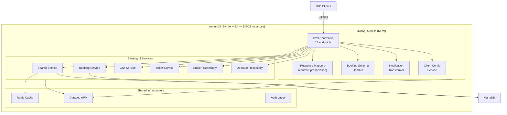
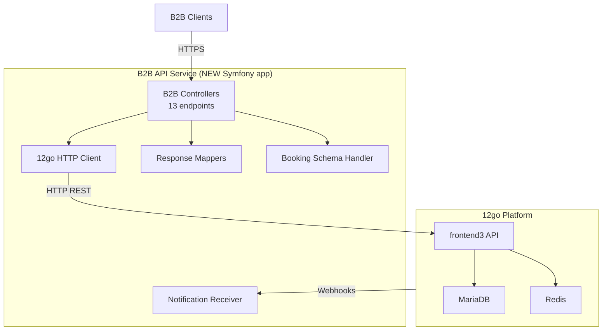
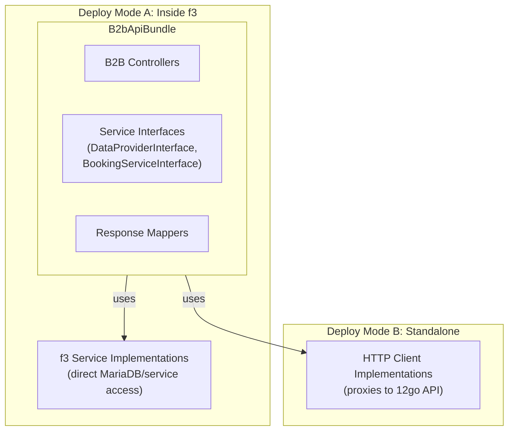
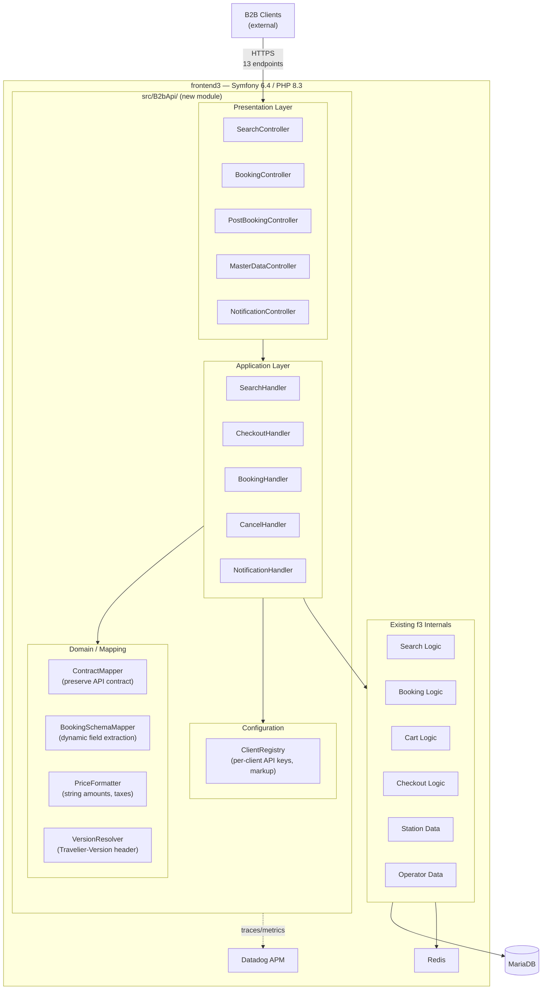
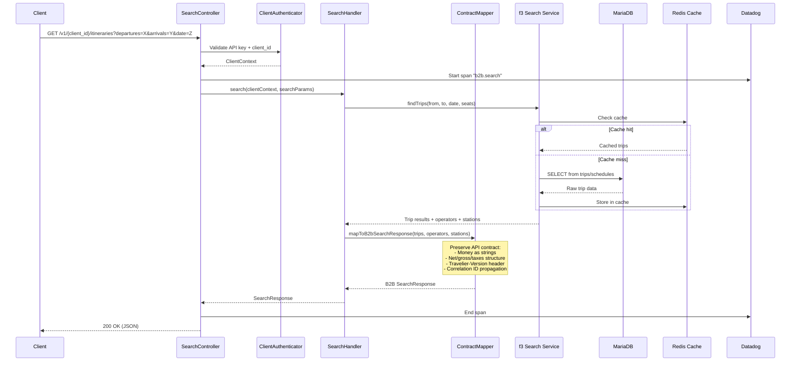
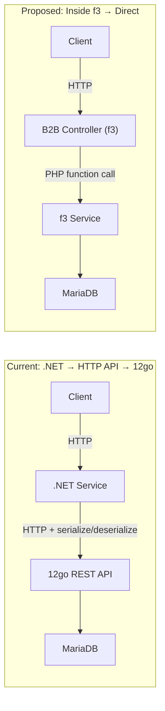
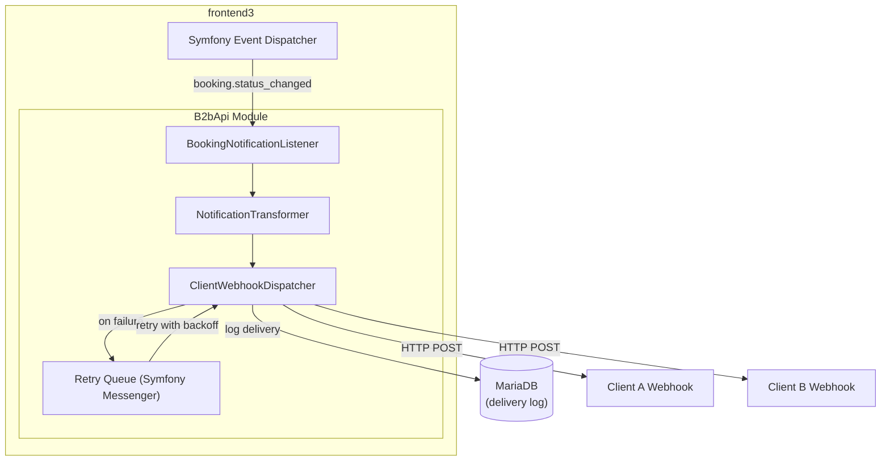
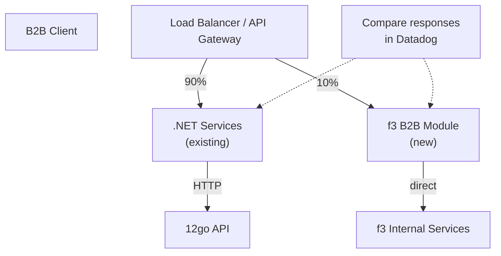
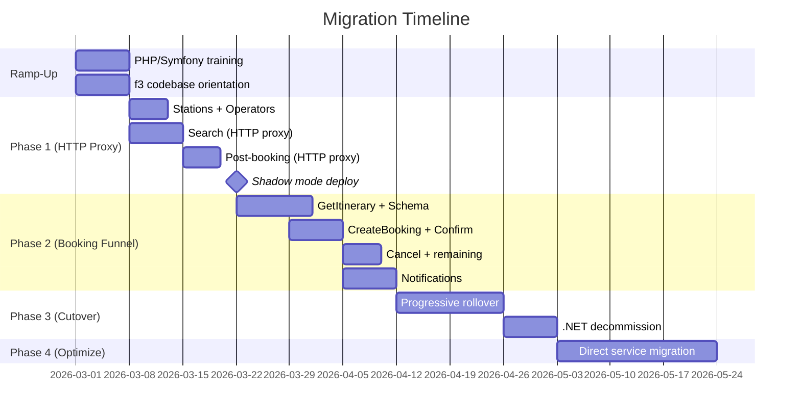

# Alternative 2: PHP Integration

## Executive Summary

This design proposes replacing the .NET B2B API layer (~342 projects, 200-400K LOC) with a PHP solution that integrates into 12go's existing Symfony 6.4 platform. Three sub-options are evaluated: embedding controllers inside the existing f3 monolith (Option A), building a standalone PHP microservice (Option B), and creating a deployable Symfony bundle (Option C).

**Recommendation: Option A — Controllers inside f3**, organized as a clearly bounded `B2bApi` module within the existing Symfony monolith.

The core rationale: if the team accepts the cost of PHP adoption, the *only* justification is deep integration with 12go's platform — direct access to MariaDB, Redis, internal services, and existing DevOps infrastructure. A separate PHP microservice (Option B) offers no advantage over the current .NET approach since it still proxies HTTP calls. Option C adds abstraction complexity for 13 endpoints that don't warrant it.

**Critical caveat**: The team's .NET expertise and the transition to PHP is a key consideration. This design scores poorly on Team Competency Match (2/5). The viability depends entirely on whether AI-assisted development and 12go veteran support can bridge the skills gap within acceptable timelines.

**Estimated effort**: 6-10 weeks for MVP with 3-4 developers + 12go veteran support.

---

## Sub-Options Comparison

### Option A: Controllers Inside f3 (Monolith Integration)

Add a `B2bApi` module to the existing frontend3 Symfony application. New controllers live under `src/B2bApi/` with clear namespace boundaries. The module accesses 12go's services and MariaDB directly through existing Symfony services.

**Architecture:**



| Aspect | Assessment |
|--------|-----------|
| **Search latency** | Best. Direct MariaDB / internal service access eliminates HTTP round-trip. Sub-100ms possible for cached searches. |
| **Infrastructure** | Zero new infrastructure. Deploys on existing 8 EC2 instances. |
| **Operational overhead** | Minimal. Inherits f3's deployment pipeline, Datadog, Redis, logging. |
| **Coupling risk** | High. B2B module is coupled to f3's codebase, release cycle, and internal APIs. |
| **Skills alignment** | Significant learning curve. Must understand f3's existing codebase, not just PHP/Symfony. |
| **12go collaboration** | Requires close coordination. Code reviews, merge conflicts, shared deployment. |

### Option B: Separate PHP Microservice

New standalone Symfony application in its own repository. Communicates with 12go exclusively via the HTTP REST API (same as current .NET services).

**Architecture:**



| Aspect | Assessment |
|--------|-----------|
| **Search latency** | Same as .NET. Still proxying HTTP calls to 12go. ~100-300ms per call. |
| **Infrastructure** | Needs new EC2 instances or containers. Separate deployment pipeline. |
| **Operational overhead** | Moderate. Own deployment, own monitoring setup, own Redis instance (optional). |
| **Coupling risk** | Low. Clean API boundary. Can evolve independently. |
| **Team impact** | Must learn PHP/Symfony but NOT the f3 codebase. Smaller learning surface. |
| **Fundamental problem** | **No advantage over .NET**. If you're proxying HTTP calls anyway, use the language the team knows. |

### Option C: Symfony Bundle (Independently Deployable)

A Symfony bundle (`B2bApiBundle`) that can run inside f3 or as a standalone application. Abstracts all dependencies behind interfaces.

**Architecture:**



| Aspect | Assessment |
|--------|-----------|
| **Search latency** | Depends on deployment mode. Inside f3 = fast. Standalone = same as Option B. |
| **Infrastructure** | Flexible but more complex. Two deployment configurations to test and maintain. |
| **Operational overhead** | Highest. Must validate both deployment modes. Interface abstractions add indirection. |
| **Coupling risk** | Low in theory. But the interface boundaries add complexity for 13 simple endpoints. |
| **Team impact** | Highest complexity. Bundle development patterns, interface contracts, two deployment modes. |
| **Fundamental problem** | **Over-engineered for the scope**. 13 endpoints that mostly proxy calls don't need a pluggable bundle architecture. The flexibility is theoretical — you'll pick one deployment mode and stay there. |

### Comparison Matrix

| Criterion | Option A (Inside f3) | Option B (Separate) | Option C (Bundle) |
|-----------|---------------------|--------------------|--------------------|
| Search Performance | ★★★★★ | ★★★ | ★★★★ (if inside f3) |
| Infrastructure Fit | ★★★★★ | ★★ | ★★★★ |
| Implementation Effort | ★★★ | ★★★★ | ★★ |
| Coupling Risk | ★★ | ★★★★★ | ★★★★ |
| Operational Simplicity | ★★★★★ | ★★★ | ★★ |
| Justifies PHP Adoption | ★★★★★ | ★ | ★★★ |
| Team Learning Surface | ★★ | ★★★ | ★★ |

### Recommendation: Option A

**The decisive factor**: PHP's only strategic advantage over .NET for this use case is direct integration with 12go's platform. Option B (separate service) achieves nothing that .NET can't do better with a team that already knows it. If management decides to accept the PHP learning cost, Option A maximizes the return on that investment.

Option A provides:
1. **Eliminated HTTP round-trips** — search hits MariaDB directly instead of going through 12go's REST API
2. **Shared infrastructure** — Redis, Datadog, deployment pipeline, all free
3. **Path to deeper integration** — over time, more business logic can move from "proxy" to "native"
4. **12go ownership readiness** — when/if our team transitions, 12go engineers already understand the codebase

---

## Recommended Architecture

### High-Level Design



### Request Flow (Search Example)



### Module Boundary

The `B2bApi` module communicates with f3 internals through existing Symfony services. No new database tables are created; all state is managed by f3's existing MariaDB tables.

```
src/
├── B2bApi/                          # NEW — our module
│   ├── Controller/
│   │   ├── SearchController.php
│   │   ├── BookingController.php
│   │   ├── PostBookingController.php
│   │   ├── MasterDataController.php
│   │   └── NotificationController.php
│   ├── Handler/
│   │   ├── SearchHandler.php
│   │   ├── CheckoutHandler.php
│   │   ├── BookingHandler.php
│   │   ├── CancelHandler.php
│   │   └── NotificationHandler.php
│   ├── Mapper/
│   │   ├── ContractMapper.php        # Core API contract transformation
│   │   ├── SearchResponseMapper.php
│   │   ├── BookingResponseMapper.php
│   │   ├── BookingSchemaMapper.php   # Complex dynamic field extraction
│   │   └── PriceMapper.php           # Money-as-strings, taxes
│   ├── Model/
│   │   ├── Request/                  # Incoming B2B request DTOs
│   │   └── Response/                 # Outgoing B2B response DTOs
│   ├── Security/
│   │   ├── ClientAuthenticator.php
│   │   └── ClientContext.php
│   ├── Config/
│   │   ├── ClientRegistry.php        # Per-client configuration
│   │   └── VersionResolver.php       # Travelier-Version handling
│   ├── Middleware/
│   │   ├── CorrelationIdMiddleware.php
│   │   └── VersionMiddleware.php
│   └── EventListener/
│       └── B2bExceptionListener.php  # Error formatting
├── ... (existing f3 code)
```

---

## Data Access Strategy

The data access approach varies by endpoint, selecting the fastest viable option for each:

### Strategy Per Endpoint

| Endpoint | Strategy | Rationale |
|----------|----------|-----------|
| **Search** | Direct f3 service (MariaDB/Redis) | Most latency-sensitive. Eliminating HTTP round-trip is the primary value proposition. |
| **GetItinerary** | Direct f3 service | Needs trip details + cart creation + checkout schema — 3 internal operations, massive latency savings. |
| **CreateBooking** | Direct f3 service | Reserve + get booking details — 2 internal operations. |
| **ConfirmBooking** | Direct f3 service | Confirm + get booking details — 2 internal operations. |
| **SeatLock** | Direct f3 service | Local validation now; direct service call when 12go implements native support. |
| **GetBookingDetails** | Direct MariaDB read | Single DB query. Current .NET system reads from local DynamoDB; this reads from the source of truth. |
| **GetTicket** | Direct f3 service | Single call to get ticket URL from booking record. |
| **CancelBooking** | Direct f3 service | Refund options + refund execution — 2 internal operations. |
| **IncompleteResults** | Direct f3 service or eliminate | If operations become synchronous inside f3, this endpoint may return empty. |
| **Stations** | Direct MariaDB read | `station_v` view. Eliminates periodic sync + S3 URLs currently used by Fuji. |
| **Operators** | Direct MariaDB read | `operator_v` view. Same simplification as stations. |
| **POIs** | Direct MariaDB read | Province-based query against existing tables. |
| **Notifications** | Webhook receiver + f3 event system | Receive 12go internal events directly via Symfony event dispatcher. |

### Why Direct Access (Not HTTP API)



For **Search** (the latency-critical path):
- **Current**: Client → .NET → HTTP serialize → 12go → deserialize → MariaDB → serialize → .NET → deserialize → Client. ~150-400ms.
- **Proposed**: Client → PHP controller → internal service → MariaDB → Client. ~30-100ms.

The HTTP serialization/deserialization overhead alone is ~20-50ms per call. GetItinerary makes 3 calls, so savings compound.

### Fallback: HTTP Client for Gradual Migration

During initial development, endpoints can be implemented using Symfony HttpClient against 12go's REST API (identical to current .NET approach) and then progressively migrated to direct service calls:

```php
// Phase 1: HTTP proxy (quick to implement, familiar pattern)
$response = $this->httpClient->request('GET', "/search/{$from}p/{$to}p/{$date}", [
    'query' => ['seats' => $seats, 'direct' => 'true', 'k' => $apiKey],
]);

// Phase 2: Direct service call (after understanding f3 internals)
$results = $this->searchService->findTrips($from, $to, $date, $seats);
```

This allows the team to ship a working MVP quickly (Phase 1) and then optimize iteratively (Phase 2).

---

## Framework and Library Choices

### Framework: Symfony 6.4 (Match f3)

| Choice | Rationale |
|--------|-----------|
| **Symfony 6.4** (not 7.x) | Must match f3's version exactly. Running mixed Symfony versions in one app is not possible. |
| **No API Platform** | API Platform excels at CRUD-over-entities. Our B2B API has custom transformation logic, specific contract formats, and dynamic schemas that don't map to API Platform's conventions. Plain controllers are simpler and more explicit. |
| **No Laravel/Slim** | We're inside f3. There is no framework choice — it's Symfony 6.4. |

### Key Libraries

| Library | Purpose | Notes |
|---------|---------|-------|
| `symfony/serializer` | Request/response JSON serialization | Use custom normalizers for money-as-strings, date formats |
| `symfony/validator` | Input validation | Attribute-based validation on request DTOs |
| `symfony/http-client` | HTTP calls (Phase 1 fallback) | Native async support, superior to Guzzle for concurrent requests |
| `symfony/security-bundle` | Client authentication | Custom authenticator for API key + client_id |
| `dd-trace-php` | Datadog APM integration | Already installed in f3. Custom spans for B2B endpoints. |
| `symfony/cache` | Redis integration | Already configured in f3 |
| `monolog/monolog` | Structured logging | Already configured in f3, feeds Datadog |

### PHP 8.3 Features Used

| Feature | Application |
|---------|------------|
| Readonly classes | Request/response DTOs (`readonly class SearchRequest`) |
| Enums | Booking status, confirmation type, ticket type |
| Named arguments | Cleaner service construction |
| Fibers (via HttpClient) | Concurrent HTTP requests during Phase 1 fallback |
| Match expressions | Status code mapping, error classification |
| Constructor promotion | Compact service constructors |
| Attributes | Route definitions, validation rules, serializer groups |

---

## Project Structure

```
frontend3/
├── src/
│   ├── B2bApi/
│   │   ├── Controller/
│   │   │   ├── V1/                              # Versioned controllers
│   │   │   │   ├── SearchController.php          # GET /v1/{client_id}/itineraries
│   │   │   │   ├── BookingController.php         # POST /bookings, POST /confirm, POST /lock_seats
│   │   │   │   ├── PostBookingController.php     # GET /bookings/{id}, GET /ticket, POST /cancel
│   │   │   │   ├── MasterDataController.php      # GET /stations, /operators, /pois
│   │   │   │   └── NotificationController.php    # Webhook receiver
│   │   │   └── HealthController.php              # Health check
│   │   │
│   │   ├── Handler/                              # Application/orchestration layer
│   │   │   ├── SearchHandler.php
│   │   │   ├── GetItineraryHandler.php           # 3-step: trip details + cart + schema
│   │   │   ├── CreateBookingHandler.php          # reserve + get details
│   │   │   ├── ConfirmBookingHandler.php         # confirm + get details
│   │   │   ├── SeatLockHandler.php
│   │   │   ├── GetBookingDetailsHandler.php
│   │   │   ├── GetTicketHandler.php
│   │   │   ├── CancelBookingHandler.php          # refund options + refund
│   │   │   └── NotificationHandler.php
│   │   │
│   │   ├── Mapper/                               # Response transformation
│   │   │   ├── SearchResponseMapper.php          # trips → itineraries
│   │   │   ├── BookingSchemaMapper.php           # Dynamic field extraction (20+ patterns)
│   │   │   ├── BookingResponseMapper.php
│   │   │   ├── CancellationMapper.php
│   │   │   ├── StationMapper.php
│   │   │   ├── OperatorMapper.php
│   │   │   └── PriceMapper.php                   # Money-as-strings, net/gross/taxes
│   │   │
│   │   ├── Dto/
│   │   │   ├── Request/
│   │   │   │   ├── SearchRequest.php
│   │   │   │   ├── CreateBookingRequest.php
│   │   │   │   ├── ConfirmBookingRequest.php
│   │   │   │   ├── SeatLockRequest.php
│   │   │   │   └── CancelBookingRequest.php
│   │   │   └── Response/
│   │   │       ├── SearchResponse.php
│   │   │       ├── ItineraryResponse.php
│   │   │       ├── PreBookingSchemaResponse.php
│   │   │       ├── BookingResponse.php
│   │   │       ├── TicketResponse.php
│   │   │       ├── CancellationResponse.php
│   │   │       ├── StationListResponse.php
│   │   │       ├── OperatorListResponse.php
│   │   │       └── ErrorResponse.php
│   │   │
│   │   ├── Security/
│   │   │   ├── B2bApiAuthenticator.php           # API key + client_id validation
│   │   │   └── ClientContext.php                  # Per-request client context
│   │   │
│   │   ├── Config/
│   │   │   ├── ClientConfigProvider.php           # Per-client settings (markup, features)
│   │   │   └── B2bApiConfig.php                   # Module-level configuration
│   │   │
│   │   ├── EventListener/
│   │   │   ├── B2bExceptionListener.php           # Error response formatting
│   │   │   ├── CorrelationIdListener.php          # x-correlation-id propagation
│   │   │   └── ApiVersionListener.php             # Travelier-Version handling
│   │   │
│   │   └── Service/
│   │       ├── TwelveGoHttpClient.php             # Phase 1: HTTP proxy client
│   │       └── ReserveRequestSerializer.php       # Custom bracket-notation serializer
│   │
│   ├── ... (existing f3 source code)
│
├── config/
│   ├── routes/
│   │   └── b2b_api.yaml                          # B2B route definitions
│   ├── packages/
│   │   └── b2b_api.yaml                          # B2B-specific config
│   └── ... (existing f3 config)
│
├── tests/
│   └── B2bApi/
│       ├── Unit/
│       │   ├── Mapper/
│       │   │   ├── SearchResponseMapperTest.php
│       │   │   ├── BookingSchemaMapperTest.php    # Critical: 20+ field patterns
│       │   │   └── PriceMapperTest.php
│       │   └── Handler/
│       │       └── ...
│       └── Functional/
│           ├── Controller/
│           │   ├── SearchControllerTest.php
│           │   ├── BookingControllerTest.php
│           │   └── ...
│           └── EndToEnd/
│               └── BookingFunnelTest.php
```

**Estimated LOC**: ~3,000-4,000 lines of PHP (controllers + handlers + mappers + DTOs + tests).

---

## API Layer Design

### Routing

All B2B endpoints are prefixed and isolated from f3's existing routes:

```yaml
# config/routes/b2b_api.yaml
b2b_api:
    resource: '../src/B2bApi/Controller/'
    type: attribute
    prefix: /b2b
```

### Controller Design

Controllers are thin — they validate input, delegate to handlers, and format output:

```php
#[Route('/v1/{clientId}')]
final class SearchController extends AbstractController
{
    public function __construct(
        private readonly SearchHandler $searchHandler,
        private readonly SearchResponseMapper $mapper,
    ) {}

    #[Route('/itineraries', methods: ['GET'])]
    public function search(
        string $clientId,
        #[MapQueryString] SearchRequest $request,
        ClientContext $clientContext,
    ): JsonResponse {
        $trips = $this->searchHandler->search(
            clientContext: $clientContext,
            departures: $request->departures,
            arrivals: $request->arrivals,
            date: $request->date,
            passengers: $request->passengers,
        );

        return $this->json(
            $this->mapper->toSearchResponse($trips, $clientContext),
        );
    }
}
```

### API Contract Preservation

Every convention from the existing B2B API is preserved through dedicated components:

| Convention | Implementation |
|-----------|---------------|
| `Travelier-Version` header (YYYY-MM-DD) | `ApiVersionListener` reads header, stores in request attributes. Handlers can branch on version. |
| `x-correlation-id` header | `CorrelationIdListener` extracts or generates UUID, propagates via Monolog context and Datadog span tags. |
| `x-api-experiment` header | Forwarded to internal services if needed. |
| Money as strings (`"14.60"`) | `PriceMapper::formatMoney()` converts all `float`/`int` amounts to string representation. |
| Net/gross/taxes pricing | `PriceMapper` constructs the full pricing structure from f3's internal price model. |
| 206 Partial Content | Handler returns a flag when supplier data is incomplete; controller sets 206 status. |
| Error response format | `B2bExceptionListener` catches exceptions and formats to `{"error": {"code": ..., "message": ...}}`. |

### Authentication

```php
final class B2bApiAuthenticator extends AbstractAuthenticator
{
    public function supports(Request $request): bool
    {
        return str_starts_with($request->getPathInfo(), '/b2b/');
    }

    public function authenticate(Request $request): Passport
    {
        $clientId = $request->attributes->get('clientId');
        $apiKey = $request->headers->get('X-Api-Key')
            ?? $request->query->get('api_key');

        $client = $this->clientRegistry->findByCredentials($clientId, $apiKey);
        
        if (!$client) {
            throw new AuthenticationException('Invalid client credentials');
        }

        return new SelfValidatingPassport(
            new UserBadge($clientId, fn() => $client)
        );
    }
}
```

---

## Booking Schema Handling

The booking schema is the most complex transformation in the system. 12go's checkout endpoint returns a flat map of dynamic form fields with 20+ wildcard patterns. This must be preserved exactly.

### Approach

Port the existing C# `BookingSchemaMapper` logic to PHP. The patterns are well-documented in the current codebase and translate directly:

```php
final class BookingSchemaMapper
{
    public function mapSchema(array $rawSchema): PreBookingSchemaResponse
    {
        $schema = new PreBookingSchemaResponse();
        
        // Fixed fields — direct mapping
        $schema->contactMobile = $this->mapFormField($rawSchema['contact[mobile]'] ?? null);
        $schema->contactEmail = $this->mapFormField($rawSchema['contact[email]'] ?? null);
        $schema->passengerFirstName = $this->mapFormField($rawSchema['passenger[0][first_name]'] ?? null);
        $schema->passengerLastName = $this->mapFormField($rawSchema['passenger[0][last_name]'] ?? null);
        // ... remaining fixed fields
        
        // Dynamic fields — pattern matching on keys
        foreach ($rawSchema as $key => $value) {
            match (true) {
                str_contains($key, 'selected_seats_') && !str_contains($key, '_allow_auto')
                    => $schema->selectedSeats = $this->mapFormField($value),
                str_contains($key, 'selected_seats_') && str_contains($key, '_allow_auto')
                    => $schema->allowSelectedSeats = $this->mapFormField($value),
                str_starts_with($key, 'passenger[0][baggage_')
                    => $schema->baggage = $this->mapFormField($value),
                $this->matchesPattern($key, 'points*[pickup]')
                    => $schema->pointsPickup = $this->mapFormField($value),
                $this->matchesPattern($key, 'points*[dropoff]')
                    => $schema->pointsDropoff = $this->mapFormField($value),
                // ... remaining 15+ patterns (ported from C# ExtensionData extraction)
                default => null,
            };
        }
        
        return $schema;
    }
    
    private function matchesPattern(string $key, string $pattern): bool
    {
        $regex = '/^' . str_replace('*', '.*', preg_quote($pattern, '/')) . '$/';
        return (bool) preg_match($regex, $key);
    }
}
```

### Reserve Request Serializer

The custom bracket-notation serializer for `POST /reserve/{bookingId}` is ported from the C# `FromRequestDataToReserveDataConverter`:

```php
final class ReserveRequestSerializer
{
    public function serialize(CreateBookingRequest $request): array
    {
        $data = [
            'contact[mobile]' => $request->contactMobile,
            'contact[email]' => $request->contactEmail,
            'seats' => count($request->passengers),
        ];

        foreach ($request->passengers as $i => $passenger) {
            $data["passenger[{$i}][first_name]"] = $passenger->firstName;
            $data["passenger[{$i}][last_name]"] = $passenger->lastName;
            $data["passenger[{$i}][id_no]"] = $passenger->idNo;
            $data["passenger[{$i}][id_type]"] = $passenger->idType ?? '0';
            $data["passenger[{$i}][country_id]"] = $passenger->nationality ?? $passenger->countryId;
            // ... remaining passenger fields (conditionally included)
            
            if ($passenger->baggage !== null) {
                $data[$passenger->baggage->fieldName] = $passenger->baggage->value;
            }
        }

        if ($request->selectedSeats !== null) {
            $data[$request->selectedSeats->fieldName] = implode(',', $request->selectedSeats->seatIds);
        }
        if ($request->allowSelectedSeats !== null) {
            $data[$request->allowSelectedSeats->fieldName] = $request->allowSelectedSeats->value;
        }

        foreach ($request->additionalFields as $key => $value) {
            $data[$key] = $value;
        }

        return $data;
    }
}
```

### Seat Map Handling

Seat map data from the booking schema (layouts, availability, pricing) is passed through with structure preserved. The B2B API contract defines the seat map shape; the mapper ensures field names match expectations.

---

## Cross-Cutting Concerns

### Observability (Datadog)

f3 already has `dd-trace-php` installed. B2B endpoints get automatic tracing. Add custom spans for business operations:

```php
use DDTrace\GlobalTracer;

final class SearchHandler
{
    public function search(ClientContext $client, ...): SearchResult
    {
        $tracer = GlobalTracer::get();
        $span = $tracer->startSpan('b2b.search', [
            'tags' => [
                'b2b.client_id' => $client->clientId,
                'b2b.correlation_id' => $client->correlationId,
            ],
        ]);

        try {
            $result = $this->doSearch(...);
            $span->setTag('b2b.result_count', count($result->itineraries));
            return $result;
        } catch (\Throwable $e) {
            $span->setError($e);
            throw $e;
        } finally {
            $span->finish();
        }
    }
}
```

**Dashboards**: Create a dedicated "B2B API" Datadog dashboard with:
- Request rate per endpoint
- P50/P95/P99 latency per endpoint
- Error rate by type (4xx vs 5xx)
- Per-client request volume
- Booking funnel conversion rate (search → getItinerary → reserve → confirm)

### Logging

Use Monolog (already configured in f3) with structured context:

```php
$this->logger->info('B2B search completed', [
    'client_id' => $clientContext->clientId,
    'correlation_id' => $clientContext->correlationId,
    'departures' => $searchParams->departures,
    'arrivals' => $searchParams->arrivals,
    'result_count' => count($results),
    'duration_ms' => $elapsed,
]);
```

### Error Handling

Map internal exceptions to B2B API error format:

| Internal Exception | HTTP Status | B2B Error Code |
|-------------------|-------------|----------------|
| `AuthenticationException` | 401 | `unauthorized` |
| `ClientNotFoundException` | 401 | `invalid_client` |
| `ValidationException` | 400 | `validation_error` |
| `ProductNotFoundException` | 404 | `not_found` |
| `TripUnavailableException` | 410 | `product_unavailable` |
| `BookingFailedException` | 502 | `upstream_error` |
| `\Throwable` (unexpected) | 500 | `internal_error` |

### Caching

Leverage f3's existing Redis:

| What | Strategy | TTL |
|------|----------|-----|
| Search results | f3's internal cache (Redis) | Already managed by f3 |
| Station/operator lists | Redis with long TTL | 1 hour (with cache-busting on update) |
| Client configuration | In-memory (APCu) per worker | 5 minutes |
| Booking schema | Not cached (dynamic per trip) | — |

### Rate Limiting

Use Symfony's `RateLimiter` component, configured per-client:

```yaml
# config/packages/b2b_api.yaml
framework:
    rate_limiter:
        b2b_search:
            policy: sliding_window
            limit: 100
            interval: '1 minute'
        b2b_booking:
            policy: sliding_window
            limit: 20
            interval: '1 minute'
```

---

## Notification Transformer

### Current State

12go sends booking status webhooks to Denali's notification service. The notification shape differs from what B2B clients expect. The transformer must:
1. Receive 12go's internal notification format
2. Map fields to B2B client notification format
3. Forward to each client's configured webhook URL
4. Track delivery status and retry on failure

### Design Inside f3



**Key advantage of Option A**: Instead of receiving webhooks over HTTP (which currently lacks authentication on 12go's side), the B2B module subscribes to internal Symfony events. This eliminates the webhook authentication gap entirely.

```php
#[AsEventListener(event: BookingStatusChangedEvent::class)]
final class BookingNotificationListener
{
    public function __invoke(BookingStatusChangedEvent $event): void
    {
        $clients = $this->clientRegistry->findClientsForBooking($event->bookingId);
        
        foreach ($clients as $client) {
            $notification = $this->transformer->transform($event, $client);
            $this->dispatcher->dispatch($notification, $client->webhookUrl);
        }
    }
}
```

Retry logic uses Symfony Messenger with exponential backoff:

```php
#[AsMessageHandler]
final class WebhookDeliveryHandler
{
    public function __invoke(WebhookDeliveryMessage $message): void
    {
        try {
            $this->httpClient->request('POST', $message->url, [
                'json' => $message->payload,
                'timeout' => 10,
            ]);
        } catch (TransportExceptionInterface $e) {
            throw new RecoverableMessageHandlingException(
                'Webhook delivery failed, will retry',
                previous: $e,
            );
        }
    }
}
```

---

## Deployment Strategy

### Phase 1: Shadow Mode (Week 1-2 after MVP)

Deploy B2B endpoints alongside the existing .NET services. Route a small percentage of traffic (5-10%) to the PHP endpoints for comparison:



### Phase 2: Progressive Rollover (Week 3-4)

Increase traffic percentage as confidence grows: 10% → 25% → 50% → 100%.

### Phase 3: Decommission .NET (Week 5+)

Once 100% traffic is on PHP with stable metrics, decommission .NET services.

### Infrastructure Changes

| Component | Change Required |
|-----------|----------------|
| EC2 instances | None — f3 already runs on 8 instances |
| Load balancer | Add routing rules for `/b2b/*` prefix |
| Datadog | Add B2B dashboard (no agent changes) |
| Redis | None — uses f3's existing Redis |
| Database | None — uses f3's existing MariaDB |
| CI/CD | B2B code ships with f3's existing pipeline |
| Docker (local) | None — f3's Docker setup includes PHP |

---

## Team Ramp-Up Plan

### Reality Check

The team is 3-4 .NET developers who do not want to write PHP. This is the single biggest risk to this design. The ramp-up plan must be honest about this.

### Week 0-1: Foundation

| Activity | Who | Goal |
|----------|-----|------|
| PHP 8.3 syntax crash course | All devs | Understand classes, types, attributes, enums, match |
| Symfony 6.4 routing/DI/controllers | All devs | Can create a controller that returns JSON |
| f3 local Docker setup | All devs + DevOps | Can run f3 locally and hit endpoints |
| f3 codebase orientation | 1 12go veteran + team | Identify services to call, understand data model |

**AI assistance**: Cursor/Claude can generate PHP code from natural-language descriptions and from the existing C# code. The team works in a "specify in English, generate in PHP, review and test" workflow.

### Week 2-3: First Endpoints

| Activity | Who | Goal |
|----------|-----|------|
| Implement Search endpoint (HTTP proxy first) | 2 devs + 12go advisor | Working search with contract preservation |
| Implement Stations/Operators (direct DB) | 1 dev | Working master data endpoints |
| Set up Datadog custom spans | 1 dev | Observability from day one |
| 12go code review partnership | 12go veteran | Every PR reviewed by someone who knows f3 |

### Week 4-6: Booking Funnel

| Activity | Who | Goal |
|----------|-----|------|
| GetItinerary + booking schema mapper | 2 devs | Most complex endpoint working |
| CreateBooking + ConfirmBooking | 2 devs | Full booking funnel |
| Post-booking endpoints | 1 dev | GetBookingDetails, GetTicket, Cancel |
| Notification transformer | 1 dev | Webhook forwarding working |

### Week 7-8: Hardening

| Activity | Who | Goal |
|----------|-----|------|
| Contract compliance testing | All devs | Compare PHP responses to .NET responses for all endpoints |
| Performance benchmarking | 1 dev + DevOps | Search latency meets targets |
| Shadow mode deployment | DevOps + 1 dev | 5-10% traffic flowing through PHP |
| Edge case testing | All devs | Error scenarios, timeouts, malformed input |

### Key Enablers

1. **12go veteran embedded in team** — at least part-time for the first 4 weeks. Not optional.
2. **AI-assisted development** — Cursor with Claude generates PHP from C# examples. Team reviews rather than writes from scratch.
3. **Pair programming** — .NET dev + 12go veteran on complex endpoints (booking schema, reserve serialization).
4. **Existing test fixtures** — Port existing .NET test cases (request/response JSON) to PHP tests. The test data is language-agnostic.

### Honest Assessment of AI-Assisted PHP Development

| Aspect | Effectiveness |
|--------|--------------|
| Generating PHP controllers/DTOs from C# models | High — direct translation |
| Writing Symfony routing/DI config | High — well-documented patterns |
| Porting complex mapping logic (booking schema) | Medium — needs human review of edge cases |
| Understanding f3's existing service layer | Low — AI doesn't know f3's codebase without context |
| Debugging PHP-specific issues (memory, opcache) | Low — team has no PHP debugging intuition |
| Writing PHPUnit tests | High — similar patterns to xUnit |

---

## Migration Path

### Endpoint Migration Order

Priority based on complexity and risk:

| Order | Endpoint | Complexity | Risk | Rationale |
|-------|----------|-----------|------|-----------|
| 1 | Stations | Low | Low | Read-only, simple DB query, good first endpoint |
| 2 | Operators | Low | Low | Same pattern as stations |
| 3 | Search | Medium | Medium | Latency-critical but single call, easy to compare |
| 4 | GetBookingDetails | Low | Low | Single DB read |
| 5 | GetTicket | Low | Low | Single field from booking record |
| 6 | GetItinerary | High | High | 3 internal calls + booking schema mapping |
| 7 | CreateBooking | High | High | Reserve + custom serialization |
| 8 | ConfirmBooking | Medium | High | Financial operation — must be correct |
| 9 | SeatLock | Low | Low | Local validation only |
| 10 | CancelBooking | Medium | High | Two-step refund flow |
| 11 | POIs | Low | Low | Simple query |
| 12 | IncompleteResults | Low | Low | May be eliminated |
| 13 | Notifications | Medium | Medium | Async delivery, retry logic |

### Parallel Running Strategy



### Rollback Plan

Since .NET services remain running during shadow mode:
- **Instant rollback**: Switch load balancer back to 100% .NET
- **Per-endpoint rollback**: Route specific endpoints back to .NET while keeping working PHP endpoints
- **No data migration needed**: PHP module uses f3's existing MariaDB — no data to migrate

---

## Risks and Mitigations

### Critical Risks

| # | Risk | Likelihood | Impact | Mitigation |
|---|------|-----------|--------|------------|
| 1 | **Skills alignment challenges** — potential for decreased productivity or team turnover during the transition | High | Critical | Honest communication. If alignment is low, this option should not be pursued. Development under significant stack friction is less efficient. |
| 2 | **f3 breaking changes** — a f3 release breaks B2B module because internal APIs changed | Medium | High | Automated contract tests that run on f3's CI pipeline. Dedicated B2B test suite in f3. 12go team awareness of B2B module. |
| 3 | **Underestimated f3 complexity** — understanding f3's internals takes longer than expected, blocking direct service integration | High | Medium | Phase 1 uses HTTP proxy (no f3 knowledge needed). Direct integration is Phase 4 optimization, not MVP blocker. |
| 4 | **Booking schema mapping bugs** — complex dynamic field extraction has subtle edge cases that only appear with specific operators | Medium | High | Port existing C# test fixtures (JSON request/response pairs) to PHP tests. Run parallel comparison of .NET vs PHP responses for every booking schema encountered in production. |
| 5 | **12go veteran unavailability** — the 12go PHP expert needed for onboarding is pulled to other priorities | Medium | High | Negotiate dedicated allocation before starting. Document everything during pairing sessions. Build a B2B-specific f3 knowledge base. |

### Moderate Risks

| # | Risk | Likelihood | Impact | Mitigation |
|---|------|-----------|--------|------------|
| 6 | **Datadog tracing gaps** — `dd-trace-php` has known issues with Symfony HTTP tracing | Medium | Medium | Implement custom spans from day one (don't rely on auto-instrumentation alone). Test tracing in staging. |
| 7 | **Deployment coordination** — B2B releases are now tied to f3's release cycle | Medium | Medium | B2B module has its own feature flags. Changes can be deployed dark and activated independently. |
| 8 | **Performance regression** — B2B endpoints add load to f3's existing EC2 instances | Low | Medium | B2B traffic is relatively small compared to f3's consumer traffic. Monitor CPU/memory headroom. Scale EC2 if needed. |
| 9 | **Merge conflicts** — B2B team and 12go team editing the same repository | Low | Low | B2B code is isolated in `src/B2bApi/`. Minimal overlap with f3 code outside of service injection. |

### Risk Assessment Summary

The **significant risk is skills alignment, not technical**. The technical solution is sound — PHP 8.3/Symfony 6.4 is a mature, well-tooled platform. The question is whether a team of .NET developers, with AI assistance and 12go support, can be productive and maintain engagement developing in PHP. If alignment is low, this design should be carefully evaluated.

---

## Effort Estimate

### MVP (All 13 Endpoints Working via HTTP Proxy)

| Component | Effort | Developers |
|-----------|--------|-----------|
| PHP/Symfony ramp-up + f3 orientation | 1 week | 3-4 devs |
| Search endpoint | 3-4 days | 2 devs |
| Master data (stations, operators, POIs) | 2-3 days | 1 dev |
| GetItinerary + booking schema mapper | 5-7 days | 2 devs |
| CreateBooking + ConfirmBooking | 4-5 days | 2 devs |
| Post-booking (details, ticket, cancel) | 3-4 days | 1-2 devs |
| SeatLock + IncompleteResults | 2 days | 1 dev |
| Notification transformer | 3-4 days | 1 dev |
| Authentication + cross-cutting | 3-4 days | 1 dev |
| Contract compliance testing | 3-5 days | 2-3 devs |
| Shadow mode deployment + monitoring | 2-3 days | 1 dev + DevOps |

**Total MVP**: ~6-8 weeks with 3-4 developers and 12go support.

### Phase 2: Direct Service Integration

| Component | Effort |
|-----------|--------|
| Search → direct f3 service | 1-2 weeks |
| GetItinerary → direct service | 1-2 weeks |
| Booking funnel → direct service | 1-2 weeks |
| Post-booking → direct service | 1 week |

**Total Phase 2**: ~4-8 weeks additional (can overlap with production running).

### Total Estimated Timeline

| Phase | Duration | Outcome |
|-------|----------|---------|
| MVP (HTTP proxy) | 6-8 weeks | All 13 endpoints working, shadow mode |
| Cutover | 2-3 weeks | Progressive rollover to 100% |
| Optimization (direct service) | 4-8 weeks | Full performance benefits realized |
| .NET decommission | 1-2 weeks | Old services shut down |
| **Total** | **13-21 weeks** | **Fully optimized, .NET removed** |

---

## Self-Assessment

### Scoring Against Evaluation Criteria

| # | Criterion | Weight | Score | Justification |
|---|-----------|--------|-------|---------------|
| 1 | Implementation Effort | x3 | **3** | 6-8 weeks for MVP is reasonable but includes significant ramp-up overhead. The HTTP proxy approach for Phase 1 reduces risk but adds total timeline. |
| 2 | Team Competency Match | x3 | **2** | The team are .NET experts. PHP is a new stack. AI helps but cannot fully compensate for zero PHP experience, especially for debugging and f3 codebase understanding. Team satisfaction and retention are key considerations. |
| 3 | Search Performance | x3 | **5** | Best possible. Direct MariaDB access via f3 services eliminates all HTTP round-trip overhead. Sub-100ms p95 achievable for cached searches. |
| 4 | Infrastructure Fit | x3 | **5** | Perfect fit. Deploys on existing EC2 instances, uses existing Redis, Datadog, MariaDB. Zero new infrastructure. |
| 5 | Maintainability | x2 | **3** | PHP/Symfony is well-structured and readable, but the team won't maintain it as naturally as .NET code. Long-term maintainability depends on whether future team knows PHP. If 12go eventually owns it: 5/5. If current .NET team owns it: 2/5. |
| 6 | Development Velocity | x2 | **2** | Initial velocity will be slow due to PHP learning curve and f3 codebase unfamiliarity. Improves over time but never matches .NET velocity for this team. AI assists but doesn't eliminate the gap. |
| 7 | Simplicity | x2 | **4** | The B2B module itself is simple: ~3-4K LOC, 13 controllers, clear structure. The complexity is inherited from f3's codebase, which is a large monolith. |
| 8 | AI-Friendliness | x2 | **4** | PHP/Symfony is very well represented in AI training data. Cursor generates correct PHP controllers, DTOs, and tests reliably. Complex f3-specific integrations are harder for AI. |
| 9 | Operational Complexity | x2 | **5** | Minimal. No new services, no new deployments, no new monitoring. Everything is inherited from f3. |
| 10 | Migration Risk | x2 | **4** | Shadow mode enables parallel running. Per-endpoint rollback is possible. No data migration. Risk is medium due to PHP team inexperience — bugs may slip through that experienced PHP developers would catch. |
| 11 | Future Extensibility | x1 | **4** | Aligns with 12go's current platform. If 12go moves to Go in the future, the B2B module would need rewriting — but that's true of any solution. Being inside f3 means easier integration with whatever 12go builds next. |
| 12 | Elegance | x1 | **3** | A bounded module inside a monolith is architecturally clean. But "controllers in someone else's monolith" is inherently messier than a standalone service. |
| 13 | Testing Ease | x1 | **4** | PHPUnit is mature. Mappers are pure functions — easy to test. Controller tests use Symfony's test client. The challenge is testing interactions with f3's internal services (need good mocks or integration test setup). |
| 14 | Monitoring/Observability | x1 | **4** | Datadog is already integrated. Custom spans are straightforward. `dd-trace-php` has some known Symfony quirks but workarounds exist. |

### Score Calculation

```
High Weight (x3):  (3 + 2 + 5 + 5) × 3 = 15 × 3 = 45
Medium Weight (x2): (3 + 2 + 4 + 4 + 5 + 4) × 2 = 22 × 2 = 44
Low Weight (x1):   (4 + 3 + 4 + 4) × 1 = 15 × 1 = 15
                                                      ────
Total:                                                 104 / 140
```

**Score: 104 / 140 (74%)**

### Score Commentary

The score is dragged down primarily by **Team Competency Match (2)** and **Development Velocity (2)**. These reflect the fundamental tension of this design: the technical solution is strong (performance, infrastructure fit, operational simplicity), but the team is adapting to a new tech stack.

**If the team were PHP developers**, this design would score ~120-125/140 — the best possible option. The gap between 104 and 125 is the "PHP tax" on a .NET team.

### When to Choose This Option

Choose PHP Integration (Option A) if:
- 12go leadership wants B2B logic inside f3 for long-term ownership
- Team accepts PHP development with AI assistance (not under protest)
- A 12go PHP veteran is available for the first 4-6 weeks
- Search performance is the dominant concern
- Minimizing infrastructure is a priority

**Consider alternatives if**:
- Team alignment with the PHP stack is low
- 12go veteran support is unavailable
- The team expects to own this codebase for 2+ years in .NET
- There's a concrete plan to move to Go in the near term (would mean two rewrites)

---

## Appendix: Option B and C Details

### Why Not Option B (Separate PHP Microservice)

A separate PHP service that calls 12go via HTTP provides **no advantage over the current .NET architecture**:

| Factor | Option B (Separate PHP) | Current .NET |
|--------|------------------------|-------------|
| HTTP latency to 12go | Same | Same |
| New infrastructure needed | Yes (new EC2/Docker) | Already exists |
| Team language expertise | None (PHP) | Strong (.NET) |
| Operational overhead | New service to manage | Already managed |
| Datadog integration | Must set up from scratch | Already configured |

The only argument for Option B is "PHP is trendy" or "alignment with 12go" — but if you're not accessing f3 internals, you're not aligned with 12go in any meaningful way. You're just writing a proxy in a language the team doesn't know.

### Why Not Option C (Symfony Bundle)

Option C adds a layer of abstraction (interfaces, two deployment modes, bundle configuration) for 13 endpoints that don't need it:

- **YAGNI**: You'll deploy inside f3 or standalone. Not both. The bundle abstraction is speculative flexibility.
- **Increased testing surface**: Must validate both deployment configurations work identically.
- **Higher PHP expertise required**: Bundle development is an advanced Symfony pattern — harder for PHP beginners.
- **No clear extraction trigger**: What event would cause you to extract the bundle from f3? If that event happens, you can extract at that point. Building the abstraction upfront wastes effort.

If Option A proves too coupled to f3 over time, extracting the `src/B2bApi/` folder into a standalone service is a 1-2 week effort. You don't need the bundle abstraction to enable that future.
