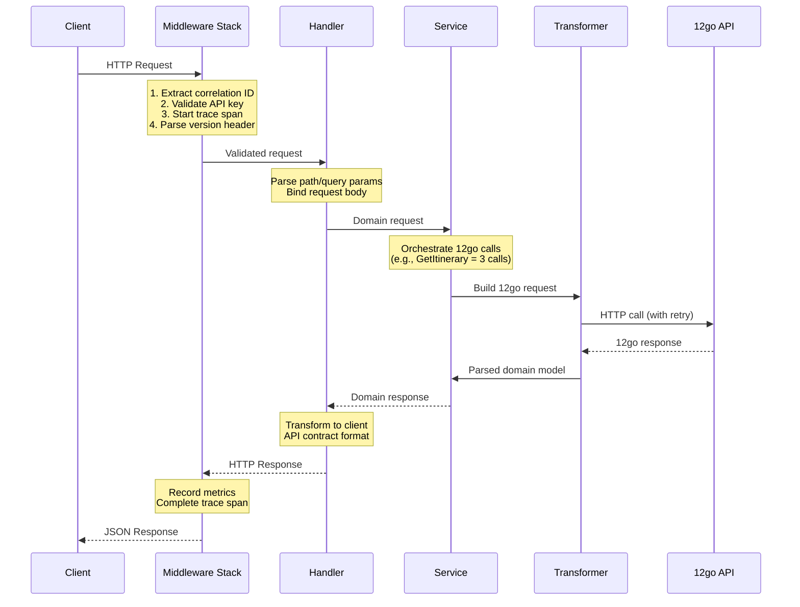
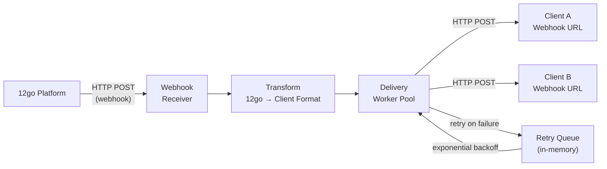
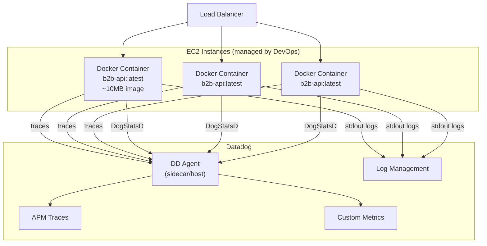
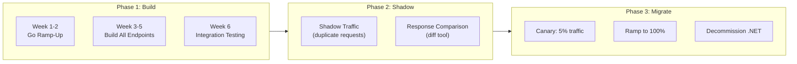

# Alternative 3: Go Service

---
status: draft
last_updated: 2026-02-19
---

## Executive Summary

Replace the entire B2B API layer (4 .NET repos, ~342 projects, 200-400K LOC) with a single Go service of approximately 3,000-5,000 lines. Go's strengths — single static binary, goroutine-based concurrency, sub-millisecond GC pauses, and minimal resource footprint — make it arguably the best runtime for what is fundamentally an HTTP proxy/translation layer. The service receives client requests, transforms them, calls 12go's REST API, transforms the responses, and returns them. No ORM, no DI container, no message bus, no complex pipeline — just HTTP in, HTTP out.

The primary risk is the team's zero Go experience. This is a real cost — estimated 2-4 weeks of ramp-up before productive contribution, partially offset by AI-assisted development (Cursor/Claude generate idiomatic Go effectively). The primary upside is strategic alignment: if 12go adopts Go as their future language, this service becomes a shared-stack asset rather than a foreign body.

**Estimated MVP timeline**: 4-6 weeks with 3 developers (including ramp-up)
**Estimated production LOC**: 3,000-5,000 (vs. 200,000-400,000 today)
**Self-assessment score**: 112/140

---

## Architecture Overview

The architecture is deliberately flat: a single Go binary that listens for HTTP requests and proxies them to 12go. No microservices, no message queues, no separate databases. The only external dependency beyond 12go's API is optionally Redis (for in-flight booking state during the checkout funnel).

```mermaid
flowchart TD
    Client["External B2B Clients"]

    subgraph GoService ["Go Service (single binary)"]
        Router["Chi Router\n+ Middleware Stack"]
        
        subgraph Handlers ["HTTP Handlers"]
            SearchH["SearchHandler"]
            BookingH["BookingHandler"]
            PostBookingH["PostBookingHandler"]
            MasterDataH["MasterDataHandler"]
            NotificationH["NotificationHandler"]
        end

        subgraph Services ["Business Logic"]
            SearchSvc["SearchService"]
            BookingSvc["BookingService"]
            PostBookingSvc["PostBookingService"]
            MasterDataSvc["MasterDataService"]
            NotificationSvc["NotificationService"]
        end

        subgraph Client12go ["12go HTTP Client"]
            TwelveGoClient["TwelveGoClient\n(all 11 endpoints)"]
            Retry["Retry + Circuit Breaker"]
            Transform["Request/Response\nTransformers"]
        end

        subgraph Middleware ["Cross-Cutting"]
            Auth["API Key Auth"]
            Correlation["Correlation ID"]
            Versioning["API Versioning"]
            Observability["Tracing + Metrics\n(dd-trace-go v2)"]
            Logging["Structured Logging\n(slog)"]
        end
    end

    subgraph TwelveGo ["12go Platform"]
        TwelveGoAPI["12go REST API\n(11 endpoints)"]
    end

    Client -->|"13 B2B endpoints"| Router
    Router --> Middleware
    Middleware --> Handlers
    Handlers --> Services
    Services --> Client12go
    Client12go -->|"HTTP"| TwelveGoAPI
```



### Request Flow

Every request follows the same linear path — no branching pipelines, no conditional middleware chains:



---

## Why Go (and Why Not)

### Why Go

| Advantage | Details |
|-----------|---------|
| **Perfect fit for proxy workload** | Go was designed for network services. Goroutines handle thousands of concurrent 12go calls with minimal memory. An HTTP proxy is Go's ideal use case — this isn't writing a CRUD app with an ORM. |
| **Single binary deployment** | `go build` produces a single statically-linked binary. No runtime, no framework dependencies, no GAC, no NuGet restore on deploy. Docker image size: ~10-15MB (distroless) vs. ~200MB+ (.NET). |
| **Sub-millisecond GC** | Go's concurrent garbage collector consistently delivers <1ms pauses. No GC-induced latency spikes on the search path. |
| **Strategic alignment with 12go** | 12go is considering Go as their future language. Building in Go creates alignment — shared tooling, shared knowledge, potential code sharing. If they adopt Go, this isn't a foreign service anymore. |
| **AI development effectiveness** | Go's simple, explicit patterns (no inheritance hierarchies, no complex generics, no implicit DI) make it highly AI-friendly. Claude and Cursor generate correct, idiomatic Go code with high reliability. |
| **Operational simplicity** | Single process, simple health check, environment-variable config, native Datadog integration via dd-trace-go v2. No sidecar, no agent, no runtime configuration files. |
| **Fast compilation** | Full rebuild of the entire service in <5 seconds. No waiting for NuGet restore, MSBuild, or project dependency resolution. |

### Why Not Go

| Risk | Details | Mitigation |
|------|---------|------------|
| **Team has zero Go experience** | All 3-4 developers are .NET experts with 12+ years of C# experience. Go requires unlearning: no exceptions, no LINQ, no DI container, no async/await. | AI-assisted development covers 60-70% of code generation. Go's simplicity means there's less to learn. Structured ramp-up plan (see below). |
| **Error handling verbosity** | Go's `if err != nil` pattern is jarring for developers used to try/catch. Every function call requires explicit error checking. | This is actually a feature for a proxy service — every 12go failure is handled explicitly, no swallowed exceptions. AI handles the boilerplate. |
| **No mature ORM equivalent** | If local storage is needed, Go lacks an Entity Framework equivalent. GORM exists but is less polished. | We shouldn't need an ORM. This is a stateless proxy. If we need minimal state, raw SQL with `sqlx` or Redis is sufficient. |
| **Smaller ecosystem for enterprise patterns** | No MediatR, no Autofac, no Polly equivalent that's as mature. | We're explicitly discarding those patterns. The current system has 342 projects worth of enterprise patterns — that's the problem, not the solution. |
| **Team morale risk** | Forcing a language change during an uncertain transition period could impact retention. | Frame as skill investment. Go expertise is increasingly valuable (Kubernetes, Docker, cloud-native). Give the team agency in the decision. |
| **Debugging unfamiliarity** | Delve debugger is less integrated than Visual Studio's .NET debugger. | VS Code / GoLand provide good debugging UX. Most debugging in a proxy service is log-based anyway (tracing request/response payloads). |

---

## Framework and Library Choices

### HTTP Router: Chi v5

**Recommendation: `go-chi/chi` v5** over Gin, Echo, Fiber, or raw stdlib.

| Factor | Chi | Gin | Echo | stdlib (Go 1.22+) |
|--------|-----|-----|------|--------------------|
| **stdlib compatibility** | 100% `net/http` | Custom context | Custom context | Native |
| **External deps** | Zero | Multiple | Multiple | None |
| **Middleware model** | `net/http` standard | Custom | Custom | Standard |
| **Datadog integration** | Native `dd-trace-go` | Native `dd-trace-go` | Native `dd-trace-go` | Manual |
| **Router performance** | Excellent | Excellent | Excellent | Good (Go 1.22+) |
| **Learning curve** | Low (stdlib-like) | Low (Express-like) | Low | Lowest |
| **Production adoption** | Cloudflare, Heroku | Very widespread | Growing | Growing |

**Why Chi over alternatives:**

- **100% `net/http` compatible** — all middleware from the Go ecosystem works unchanged. No framework lock-in. If Chi is ever abandoned, swapping to stdlib is trivial.
- **Zero external dependencies** — ~1,000 lines of code. The router itself is auditable in an afternoon.
- **Composable routing** — route groups with per-group middleware match our need for versioned endpoints with different auth strategies.
- **Native Datadog support** — `dd-trace-go` v2 has a Chi integration out of the box (`chitrace.Middleware()`).
- **Not raw stdlib** because: Go 1.22's `ServeMux` improvements are good but Chi's middleware composition, route grouping, and sub-router patterns significantly reduce boilerplate for 13 endpoints.

### Full Dependency List

```
# Core
go-chi/chi/v5            # HTTP router (zero deps)
go-chi/cors              # CORS middleware

# 12go HTTP Client  
hashicorp/go-retryablehttp  # HTTP retry with exponential backoff
sony/gobreaker              # Circuit breaker

# Observability
DataDog/dd-trace-go/v2      # Datadog APM tracing (GA since June 2025)
DataDog/datadog-go/v5       # DogStatsD metrics client

# Configuration
caarlos0/env               # Environment variable parsing into structs
joho/godotenv              # .env file loading (dev only)

# Testing
stretchr/testify           # Assertions and mocking
```

**Total: 8 direct dependencies** (vs. hundreds of NuGet packages across 342 .csproj files today).

---

## Project Structure

```
b2b-api/
├── cmd/
│   └── server/
│       └── main.go                  # Entry point: wire deps, start server
├── internal/
│   ├── config/
│   │   └── config.go                # Env var config struct + loading
│   ├── middleware/
│   │   ├── auth.go                  # API key validation
│   │   ├── correlation.go           # x-correlation-id propagation
│   │   ├── versioning.go            # Travelier-Version header parsing
│   │   └── recovery.go              # Panic recovery with structured logging
│   ├── handler/
│   │   ├── search.go                # GET /v1/{client_id}/itineraries
│   │   ├── booking.go               # GET itinerary, POST create, POST confirm, POST seat-lock
│   │   ├── postbooking.go           # GET details, GET ticket, POST cancel, GET incomplete
│   │   ├── masterdata.go            # GET stations, GET operators, GET POIs
│   │   ├── notification.go          # Webhook receiver + transformer
│   │   └── health.go                # Health/readiness probes
│   ├── service/
│   │   ├── search.go                # Search orchestration
│   │   ├── booking.go               # Booking funnel orchestration (reserve, confirm)
│   │   ├── postbooking.go           # Post-booking orchestration (details, ticket, cancel)
│   │   ├── masterdata.go            # Station/operator data serving
│   │   └── notification.go          # Notification transformation + delivery
│   ├── twelvegoapi/
│   │   ├── client.go                # HTTP client for all 11 12go endpoints
│   │   ├── search.go                # Search request/response types
│   │   ├── booking.go               # Booking request/response types (cart, schema, reserve, confirm)
│   │   ├── postbooking.go           # Post-booking types (details, refund)
│   │   ├── models.go                # Shared types (Price, Station, Operator, Trip, etc.)
│   │   └── errors.go                # 12go error response parsing + classification
│   ├── transform/
│   │   ├── search.go                # 12go search response → client itineraries
│   │   ├── bookingschema.go         # 12go checkout schema → client PreBookingSchema
│   │   ├── reserverequest.go        # Client booking request → 12go ReserveDataRequest
│   │   ├── booking.go               # 12go booking details → client booking format
│   │   ├── refund.go                # 12go refund options/result → client cancellation format
│   │   └── notification.go          # 12go webhook payload → client notification format
│   └── model/
│       ├── client.go                # Client-facing API request/response types
│       ├── booking.go               # Booking domain types
│       └── errors.go                # Client-facing error types
├── go.mod
├── go.sum
├── Dockerfile
├── .env.example
└── README.md
```

**~25 Go files.** Compare to ~342 .csproj files and thousands of .cs files today.

### Design Principles

- **`internal/`** — everything is private to this module. No `pkg/` directory because nothing is intended for external import.
- **`handler/`** — thin HTTP layer. Parse request, call service, format response. No business logic.
- **`service/`** — orchestration layer. A booking `CreateBooking` call orchestrates: reserve → get booking details → transform → return. This is where the "3 calls to 12go" logic lives.
- **`twelvegoapi/`** — pure HTTP client. One method per 12go endpoint. Handles auth, retry, circuit breaking, error classification. No business logic.
- **`transform/`** — the complex part. Maps between 12go's data shapes and our client API contract. The booking schema transformer (~200-300 lines) handles the 20+ dynamic field patterns. This is where the real domain complexity lives.
- **`model/`** — shared types. Kept minimal — Go structs with JSON tags.

---

## HTTP API Layer

### Router Setup

```go
func NewRouter(cfg *config.Config, deps *Dependencies) *chi.Mux {
    r := chi.NewRouter()

    // Global middleware
    r.Use(chitrace.Middleware(chitrace.WithServiceName("b2b-api")))
    r.Use(middleware.CorrelationID)
    r.Use(middleware.RequestLogger(deps.Logger))
    r.Use(chimiddleware.Recoverer)
    r.Use(chimiddleware.Timeout(30 * time.Second))
    r.Use(cors.Handler(cors.Options{AllowedOrigins: cfg.AllowedOrigins}))

    // Health endpoints (no auth)
    r.Get("/health", deps.HealthHandler.Liveness)
    r.Get("/ready", deps.HealthHandler.Readiness)

    // API v1 routes (with auth)
    r.Route("/v1/{clientID}", func(r chi.Router) {
        r.Use(middleware.APIKeyAuth(deps.AuthService))
        r.Use(middleware.VersionHeader)

        // Search
        r.Get("/itineraries", deps.SearchHandler.Search)

        // Booking funnel
        r.Get("/itineraries/{itineraryID}", deps.BookingHandler.GetItinerary)
        r.Post("/bookings", deps.BookingHandler.CreateBooking)
        r.Post("/bookings/lock_seats", deps.BookingHandler.SeatLock)
        r.Post("/bookings/{bookingID}/confirm", deps.BookingHandler.ConfirmBooking)

        // Post-booking
        r.Get("/bookings/{bookingID}", deps.PostBookingHandler.GetBookingDetails)
        r.Get("/bookings/{bookingID}/ticket", deps.PostBookingHandler.GetTicket)
        r.Post("/bookings/{bookingID}/cancel", deps.PostBookingHandler.CancelBooking)
        r.Get("/incomplete_results/{resultID}", deps.PostBookingHandler.IncompleteResults)

        // Master data
        r.Get("/stations", deps.MasterDataHandler.Stations)
        r.Get("/operating_carriers", deps.MasterDataHandler.Operators)
        r.Get("/pois", deps.MasterDataHandler.POIs)
    })

    // Notification webhook (separate auth — currently none from 12go)
    r.Post("/webhooks/booking-notification", deps.NotificationHandler.ReceiveNotification)

    return r
}
```

### Handler Pattern

Every handler follows the same shape:

```go
func (h *SearchHandler) Search(w http.ResponseWriter, r *http.Request) {
    ctx := r.Context()
    clientID := chi.URLParam(r, "clientID")

    req, err := parseSearchRequest(r)
    if err != nil {
        respondError(w, http.StatusBadRequest, err)
        return
    }

    result, err := h.searchService.Search(ctx, clientID, req)
    if err != nil {
        respondServiceError(w, err)
        return
    }

    respondJSON(w, http.StatusOK, result)
}
```

### API Contract Preservation

All existing client conventions are preserved in the handler/middleware layer:

| Convention | Implementation |
|-----------|---------------|
| `Travelier-Version` header | `middleware.VersionHeader` extracts and adds to context |
| `x-correlation-id` | `middleware.CorrelationID` extracts or generates, propagates to 12go calls |
| `x-api-experiment` | Passed through as context value |
| Money as strings (`"14.60"`) | `model.Money` type with custom JSON marshaling |
| 206 Partial Content | Handler checks for incomplete results, sets status accordingly |
| Error response format | `respondError` / `respondServiceError` produce the existing JSON shape |

---

## 12go Client Design

The `twelvegoapi` package encapsulates all HTTP communication with 12go.

### Client Structure

```go
type Client struct {
    httpClient *retryablehttp.Client
    baseURL    string
    apiKey     string
    breaker    *gobreaker.CircuitBreaker
}

func NewClient(cfg config.TwelveGoConfig) *Client {
    retryClient := retryablehttp.NewClient()
    retryClient.RetryMax = 3
    retryClient.RetryWaitMin = 1 * time.Second
    retryClient.RetryWaitMax = 8 * time.Second
    retryClient.CheckRetry = retryPolicy // Only retry 5xx and connection errors

    cb := gobreaker.NewCircuitBreaker(gobreaker.Settings{
        Name:        "twelvego",
        MaxRequests: 5,
        Interval:    30 * time.Second,
        Timeout:     10 * time.Second,
        ReadyToTrip: func(counts gobreaker.Counts) bool {
            return counts.ConsecutiveFailures > 10
        },
    })

    return &Client{
        httpClient: retryClient,
        baseURL:    cfg.BaseURL,
        apiKey:     cfg.APIKey,
        breaker:    cb,
    }
}
```

### Endpoint Methods

Each of the 11 12go endpoints gets one method:

```go
func (c *Client) Search(ctx context.Context, req SearchRequest) (*SearchResponse, error)
func (c *Client) GetTripDetails(ctx context.Context, req TripDetailsRequest) (*TripDetailsResponse, error)
func (c *Client) AddToCartWithTripID(ctx context.Context, req AddToCartRequest) (string, error)
func (c *Client) AddToCart(ctx context.Context, seats uint, req AddToCartBodyRequest) (string, error)
func (c *Client) GetCartDetails(ctx context.Context, cartID string) (*CartDetailsResponse, error)
func (c *Client) GetBookingSchema(ctx context.Context, cartID string) (*BookingSchemaResponse, error)
func (c *Client) Reserve(ctx context.Context, bookingID string, req ReserveRequest) (*ReserveResult, error)
func (c *Client) Confirm(ctx context.Context, bookingID string) (*ConfirmResult, error)
func (c *Client) GetBookingDetails(ctx context.Context, bookingID string) (*BookingDetailsResponse, error)
func (c *Client) GetRefundOptions(ctx context.Context, bookingID string) (*RefundOptionsResponse, error)
func (c *Client) Refund(ctx context.Context, bookingID string, req RefundRequest) (*RefundResponse, error)
```

### Error Classification

Matching the existing .NET error handling patterns:

```go
type TwelveGoError struct {
    StatusCode int
    Category   ErrorCategory
    Fields     map[string]string
    Messages   []string
    Reasons    []ErrorReason
}

type ErrorCategory int

const (
    ErrBadRequest       ErrorCategory = iota // 400
    ErrUnauthorized                          // 401
    ErrNotFound                              // 404
    ErrUnprocessable                         // 405-499
    ErrServerError                           // 500+
)
```

### Context Propagation

Every 12go call receives the request context, enabling:
- **Timeout propagation**: If the client's request times out, in-flight 12go calls are cancelled via `context.WithTimeout`.
- **Trace propagation**: `dd-trace-go` automatically propagates trace context to outgoing HTTP calls.
- **Correlation ID**: Injected as a header on every outgoing 12go request.

### Concurrency for Multi-Call Endpoints

`GetItinerary` requires 3 sequential-then-parallel 12go calls. Go's goroutines handle this naturally:

```go
func (s *BookingService) GetItinerary(ctx context.Context, clientID string, req GetItineraryRequest) (*PreBookingResponse, error) {
    // Step 1: Get trip details
    trip, err := s.client.GetTripDetails(ctx, TripDetailsRequest{
        TripID:        req.TripID,
        DepartureDate: req.DepartureDate,
        Seats:         req.Seats,
    })
    if err != nil {
        return nil, fmt.Errorf("get trip details: %w", err)
    }

    // Step 2: Add to cart
    cartID, err := s.client.AddToCartWithTripID(ctx, AddToCartRequest{
        TripID:        req.TripID,
        DepartureDate: req.DepartureDate,
        Seats:         req.Seats,
    })
    if err != nil {
        return nil, fmt.Errorf("add to cart: %w", err)
    }

    // Step 3: Get booking schema
    schema, err := s.client.GetBookingSchema(ctx, cartID)
    if err != nil {
        return nil, fmt.Errorf("get booking schema: %w", err)
    }

    return transform.ToPreBookingResponse(trip, cartID, schema)
}
```

---

## Data Strategy

### Recommendation: Stateless Proxy (Option A)

**Do not introduce a database.** The current system's DynamoDB tables, PostgreSQL booking store, and HybridCache exist because the multi-supplier abstraction required local state coordination. With a single-supplier proxy to 12go, the authoritative data lives in 12go's MariaDB.

| Current Storage | Replacement |
|----------------|-------------|
| DynamoDB ItineraryCache | Re-fetch from 12go (trip details are fast) |
| DynamoDB PreBookingCache | Cart ID is the state — pass through to 12go |
| DynamoDB BookingCache | 12go MariaDB is authoritative |
| PostgreSQL BookingEntity | Proxy `GetBookingDetails` to 12go |
| HybridCache (SI layer) | Eliminated entirely |
| MemoryCache (Etna) | Eliminated entirely |

### The One Exception: GetBookingDetails

The current system reads `GetBookingDetails` from a local database. Changing to proxy from 12go adds one HTTP round-trip of latency. Two options:

1. **Proxy directly to 12go** (recommended) — simpler, no local storage, 12go is authoritative. Accept the ~50-100ms latency addition.
2. **Optional Redis cache** — if clients poll `GetBookingDetails` frequently, cache the response in Redis with a TTL. This adds one dependency but is straightforward with `go-redis`.

### In-Memory Caching (If Needed)

For station/operator master data that rarely changes, a simple in-memory cache with periodic refresh:

```go
type MasterDataCache struct {
    mu        sync.RWMutex
    stations  []Station
    operators []Operator
    loadedAt  time.Time
    ttl       time.Duration
}
```

No Redis, no DynamoDB, no external cache layer. Go's `sync.RWMutex` handles concurrent reads efficiently.

---

## Cross-Cutting Concerns

### Structured Logging: `log/slog`

Using Go's standard library `slog` (available since Go 1.21). No third-party logging framework.

```go
logger := slog.New(slog.NewJSONHandler(os.Stdout, &slog.HandlerOptions{
    Level: slog.LevelInfo,
}))

// In handlers/services:
slog.InfoContext(ctx, "search completed",
    "client_id", clientID,
    "departures", req.Departures,
    "arrivals", req.Arrivals,
    "result_count", len(results),
    "duration_ms", elapsed.Milliseconds(),
)
```

`slog` produces JSON output that Datadog ingests directly. The `dd-trace-go` library injects trace/span IDs into log records automatically for log-trace correlation.

### Tracing: dd-trace-go v2

Using Datadog's native Go tracer (v2, GA since June 2025) rather than OpenTelemetry. Reasons:
- **Native Chi integration** — `chitrace.Middleware()` instruments all routes automatically
- **Native HTTP client integration** — `httptrace.WrapClient()` instruments outgoing 12go calls
- **Log correlation** — automatic trace ID injection into `slog` records
- **No collector needed** — traces go directly to the Datadog Agent
- **OpenTelemetry metrics are not supported in Go** by Datadog — DogStatsD is the recommended path for metrics

```go
func main() {
    tracer.Start(
        tracer.WithService("b2b-api"),
        tracer.WithEnv(cfg.Environment),
        tracer.WithServiceVersion(cfg.Version),
    )
    defer tracer.Stop()

    // Router with tracing middleware
    r := chi.NewRouter()
    r.Use(chitrace.Middleware(chitrace.WithServiceName("b2b-api")))

    // HTTP client with tracing
    tracedClient := httptrace.WrapClient(httpClient)
}
```

### Metrics: DogStatsD

Custom business metrics via DogStatsD client:

```go
statsd, _ := datadog.NewClient("127.0.0.1:8125", &datadog.Options{
    Namespace: "b2b_api.",
    Tags:      []string{"env:" + cfg.Environment},
})

// In service layer:
statsd.Incr("search.request", []string{"client:" + clientID}, 1)
statsd.Timing("search.duration", elapsed, []string{"client:" + clientID}, 1)
statsd.Incr("twelvego.call", []string{"endpoint:search", "status:success"}, 1)
```

### Correlation ID Middleware

```go
func CorrelationID(next http.Handler) http.Handler {
    return http.HandlerFunc(func(w http.ResponseWriter, r *http.Request) {
        correlationID := r.Header.Get("x-correlation-id")
        if correlationID == "" {
            correlationID = uuid.NewString()
        }
        ctx := context.WithValue(r.Context(), correlationIDKey, correlationID)
        w.Header().Set("x-correlation-id", correlationID)
        next.ServeHTTP(w, r.WithContext(ctx))
    })
}
```

### API Versioning Middleware

```go
func VersionHeader(next http.Handler) http.Handler {
    return http.HandlerFunc(func(w http.ResponseWriter, r *http.Request) {
        version := r.Header.Get("Travelier-Version")
        if version != "" {
            ctx := context.WithValue(r.Context(), versionKey, version)
            r = r.WithContext(ctx)
        }
        next.ServeHTTP(w, r)
    })
}
```

### Graceful Shutdown

```go
srv := &http.Server{
    Addr:         ":" + cfg.Port,
    Handler:      router,
    ReadTimeout:  15 * time.Second,
    WriteTimeout: 30 * time.Second,
    IdleTimeout:  60 * time.Second,
}

go func() {
    if err := srv.ListenAndServe(); err != http.ErrServerClosed {
        slog.Error("server error", "error", err)
    }
}()

quit := make(chan os.Signal, 1)
signal.Notify(quit, syscall.SIGINT, syscall.SIGTERM)
<-quit

ctx, cancel := context.WithTimeout(context.Background(), 30*time.Second)
defer cancel()
srv.Shutdown(ctx)
```

---

## Notification Transformer

The notification service receives webhooks from 12go (booking status changes) and transforms them to the format clients expect.



### Implementation

```go
type NotificationService struct {
    transformer *NotificationTransformer
    deliverer   *WebhookDeliverer
    clients     map[string]ClientWebhookConfig // clientID → webhook URL
}

type WebhookDeliverer struct {
    httpClient *http.Client
    workers    int
    jobs       chan DeliveryJob
    retryMax   int
}
```

- **Worker pool**: Configurable number of goroutines (default: 10) consuming from a buffered channel.
- **Retry**: Exponential backoff (1s, 2s, 4s, 8s) up to 4 retries per delivery attempt.
- **No message queue**: For the current scale, an in-memory channel with goroutine workers is sufficient. If delivery guarantees become critical, Redis Streams or a simple outbox table can be added later.
- **Transformation**: Maps 12go's booking status change payload to the client-expected notification format. This is the same transformation the current `booking-notification-service` performs.

---

## Testing Strategy

### Approach

Go's built-in testing tools are excellent and need minimal augmentation.

| Layer | Testing Approach | Tools |
|-------|-----------------|-------|
| **Handlers** | HTTP integration tests | `net/http/httptest` + `testify` |
| **Services** | Unit tests with mocked 12go client | Interface mocks (hand-written or `mockgen`) |
| **12go Client** | Integration tests with recorded responses | `net/http/httptest` server |
| **Transformers** | Pure function unit tests | `testify` assertions, table-driven tests |
| **Middleware** | HTTP handler chain tests | `httptest.ResponseRecorder` |

### Table-Driven Tests (Go Idiom)

The transformer layer benefits heavily from table-driven tests — a Go pattern that maps well to the booking schema's 20+ dynamic field patterns:

```go
func TestTransformBookingSchema(t *testing.T) {
    tests := []struct {
        name     string
        input    *twelvegoapi.BookingSchemaResponse
        expected *model.PreBookingSchema
    }{
        {
            name: "basic schema with required fields only",
            input: &twelvegoapi.BookingSchemaResponse{
                ContactMobile: &FormField{Required: true, Type: "tel"},
                ContactEmail:  &FormField{Required: true, Type: "email"},
            },
            expected: &model.PreBookingSchema{
                Fields: []model.FormField{
                    {Name: "contact_mobile", Required: true, Type: "tel"},
                    {Name: "contact_email", Required: true, Type: "email"},
                },
            },
        },
        {
            name: "schema with seat selection",
            // ...
        },
        {
            name: "schema with pickup/dropoff points",
            // ...
        },
    }

    for _, tt := range tests {
        t.Run(tt.name, func(t *testing.T) {
            result := TransformBookingSchema(tt.input)
            assert.Equal(t, tt.expected, result)
        })
    }
}
```

### Integration Test with Recorded Responses

```go
func TestSearchEndToEnd(t *testing.T) {
    // Start a mock 12go server
    twelvegoMock := httptest.NewServer(http.HandlerFunc(func(w http.ResponseWriter, r *http.Request) {
        if strings.HasPrefix(r.URL.Path, "/search/") {
            w.Header().Set("Content-Type", "application/json")
            json.NewEncoder(w).Encode(loadFixture("search_response.json"))
            return
        }
        w.WriteHeader(http.StatusNotFound)
    }))
    defer twelvegoMock.Close()

    // Wire up the real service with mock 12go URL
    cfg := config.Config{TwelveGo: config.TwelveGoConfig{BaseURL: twelvegoMock.URL}}
    router := NewRouter(&cfg, buildDeps(&cfg))

    // Make a real HTTP request
    req := httptest.NewRequest("GET", "/v1/test-client/itineraries?departures=100&arrivals=200&date=2026-03-01", nil)
    req.Header.Set("x-api-key", "test-key")
    rec := httptest.NewRecorder()

    router.ServeHTTP(rec, req)

    assert.Equal(t, http.StatusOK, rec.Code)
    // Assert response shape matches client API contract
}
```

### Test Coverage Targets

- **Transformers**: 90%+ — these are pure functions, easy to test exhaustively
- **Handlers**: 80%+ — request parsing, error responses, status codes
- **12go Client**: 70%+ — focused on error classification and retry behavior
- **Services**: 70%+ — orchestration logic with mocked dependencies

---

## Deployment Strategy

### Docker Image

```dockerfile
# Build stage
FROM golang:1.23-alpine AS builder
WORKDIR /app
COPY go.mod go.sum ./
RUN go mod download
COPY . .
RUN CGO_ENABLED=0 GOOS=linux GOARCH=amd64 go build -ldflags="-s -w" -o /b2b-api ./cmd/server

# Runtime stage
FROM gcr.io/distroless/static-debian12:nonroot
COPY --from=builder /b2b-api /b2b-api
EXPOSE 8080
ENTRYPOINT ["/b2b-api"]
```

**Image size: ~10-15MB** (vs. ~200MB+ for .NET runtime images).

### Configuration

All configuration via environment variables (matching 12go's `.env` convention):

```bash
# Server
PORT=8080
ENVIRONMENT=production
LOG_LEVEL=info

# 12go API
TWELVEGO_BASE_URL=https://api.12go.asia
TWELVEGO_API_KEY=<secret>
TWELVEGO_TIMEOUT=30s
TWELVEGO_RETRY_MAX=3

# Datadog
DD_SERVICE=b2b-api
DD_ENV=production
DD_VERSION=1.0.0

# Optional: Redis (if caching is enabled)
REDIS_URL=redis://localhost:6379
REDIS_TTL=5m
```

### Health Endpoints

```
GET /health     → 200 {"status": "ok"}                (liveness)
GET /ready      → 200 {"status": "ready"}             (readiness — checks 12go connectivity)
                → 503 {"status": "not_ready", "reason": "12go unreachable"}
```

### Deployment Model



- **Rolling deployments**: New container starts, health check passes, old container drains.
- **No warm-up needed**: Go binary starts in <100ms (no JIT, no assembly loading).
- **Memory footprint**: ~20-30MB RSS for a proxy service (vs. ~150-300MB for .NET).

---

## Team Ramp-Up Plan (Go Learning Path for .NET Devs)

### Week 1: Foundations (All Developers)

| Day | Topic | Approach |
|-----|-------|----------|
| Mon-Tue | Go syntax, types, functions, error handling | [Tour of Go](https://go.dev/tour/), pair programming with AI |
| Wed | Structs, interfaces, composition (replacing C# classes/inheritance) | Port a simple .NET model class to Go |
| Thu | Goroutines, channels, context (replacing async/await) | Build a concurrent HTTP caller |
| Fri | Go tooling: `go build`, `go test`, `go fmt`, `go vet` | Set up local dev environment, run existing tests |

### Week 2: Applied Go (Build the First Endpoint)

| Day | Topic | Approach |
|-----|-------|----------|
| Mon | Chi router, middleware, `net/http` patterns | Build the health endpoint and search handler shell |
| Tue | HTTP client, JSON marshaling/unmarshaling | Port the `OneTwoGoApi.Search` method to Go |
| Wed | Table-driven testing, `httptest` | Write tests for the search transformer |
| Thu | Error handling patterns, custom error types | Port the 12go error classification logic |
| Fri | Structured logging with `slog`, Datadog integration | Instrument search endpoint end-to-end |

### Week 3-4: Full Service Build

Team splits work across the 13 endpoints. By now, each developer should be able to:
- Write a handler → service → 12go client call chain
- Write tests for transformers
- Use AI (Cursor/Claude) effectively for Go code generation
- Debug with `slog` output and Delve

### Key Mindset Shifts for .NET Developers

| .NET Concept | Go Equivalent | Mental Shift |
|-------------|--------------|--------------|
| `try/catch/finally` | `if err != nil { return err }` | Errors are values, not control flow |
| Dependency Injection (Autofac) | Constructor functions, pass interfaces | No container, no magic, wire explicitly in `main.go` |
| `async/await` | Goroutines + `context.Context` | No colored functions, every function can be concurrent |
| LINQ | `for` loops | Explicit iteration is idiomatic Go |
| Inheritance + interfaces | Composition + implicit interfaces | No `class`, no `extends`, small interfaces |
| NuGet packages (hundreds) | Few dependencies + stdlib | Go stdlib covers 80% of needs |
| `.csproj` + `sln` files | `go.mod` | One dependency file for the entire project |
| `string?` (nullable) | `*string` or zero values | No null reference exceptions — zero values are meaningful |

### AI Assistance Strategy

AI (Cursor/Claude) significantly accelerates Go adoption:

- **Code generation**: AI generates correct, idiomatic Go for HTTP handlers, JSON parsing, and test scaffolding
- **Translation**: "Port this C# method to Go" works reliably for the transformer/client code
- **Error handling boilerplate**: AI handles the `if err != nil` patterns that are tedious to write manually
- **Test generation**: Table-driven test generation from example inputs is a strong AI use case

**Estimated AI coverage**: 60-70% of the codebase can be AI-generated with human review. The remaining 30-40% requires human judgment on architecture, error handling strategy, and performance tuning.

---

## Migration Path

### Phase 1: Build and Validate (Weeks 1-6)



### Phase 2: Shadow Mode (Weeks 7-8)

Deploy the Go service alongside the existing .NET services. Route duplicate traffic to both:

1. **Real traffic** → .NET services (authoritative response to client)
2. **Copied traffic** → Go service (response discarded, compared offline)

Compare response bodies for each endpoint. The 12go responses should be identical; transformation differences indicate bugs in the Go transformers.

### Phase 3: Cutover (Weeks 9-10)

1. **Canary**: Route 5% of traffic to Go service. Monitor latencies, error rates, response correctness.
2. **Gradual ramp**: 5% → 25% → 50% → 100% over 1-2 weeks.
3. **Rollback**: Keep .NET services running for 2 weeks after 100% cutover. Instant rollback via load balancer routing.

### Risk: Booking State During Cutover

Bookings in progress (between `CreateBooking` and `ConfirmBooking`) span multiple requests. During cutover:
- Route all requests for a given `bookingID` to the same backend (Go or .NET)
- Use the `bookingID` prefix or a header to ensure sticky routing
- Or: accept that in-flight bookings during cutover may need manual intervention (low volume)

---

## Risks and Mitigations

| # | Risk | Likelihood | Impact | Mitigation |
|---|------|-----------|--------|------------|
| 1 | **Team struggles with Go, velocity drops** | Medium | High | Structured ramp-up plan. AI handles 60-70% of code generation. Go's simplicity means there's genuinely less to learn than .NET. Pair programming during weeks 1-2. |
| 2 | **Booking schema transformer has subtle bugs** | Medium | High | Port existing C# transformation tests as Go table-driven tests. Run shadow traffic comparison for weeks before cutover. The 20+ dynamic field patterns are the #1 testing priority. |
| 3 | **Team morale impact from forced language change** | Medium | Medium | Frame as skill investment, not abandonment of .NET skills. Give team input on the decision. Go skills are increasingly valuable in the job market (Kubernetes, Docker, cloud-native). |
| 4 | **12go doesn't adopt Go, service becomes orphaned** | Medium | Low | Go service is still simpler and cheaper to operate than .NET. Even without 12go alignment, the technical benefits stand on their own. The service is small enough to rewrite if needed. |
| 5 | **Reserve request serialization (bracket notation) is fragile** | Low | High | Dedicated test suite with recorded 12go responses. This is ~100 lines of code — tractable to verify exhaustively. |
| 6 | **Performance regression under load** | Low | Medium | Go's performance ceiling is much higher than .NET for this workload. Profile with `pprof` before launch. The bottleneck is 12go's response time, not our proxy layer. |
| 7 | **Developer retention — team leaves before Go proficiency** | Medium | High | Document everything. Go's simplicity means new developers (Go-experienced) can onboard faster than with the current 342-project .NET codebase. |
| 8 | **Notification delivery loss (in-memory queue)** | Low | Medium | Start with in-memory worker pool. If delivery guarantees matter, add Redis Streams as a persistent queue — straightforward addition. |

---

## Effort Estimate

### Development Timeline

| Phase | Duration | Developers | Deliverable |
|-------|----------|-----------|-------------|
| **Go ramp-up** | 2 weeks | 3 | Team can write Go handlers, tests, and 12go client calls |
| **Core infrastructure** | 1 week | 3 | Router, middleware, config, 12go client shell, Docker, CI |
| **Search endpoint** | 1 week | 1 | Search handler + transformer + tests |
| **Booking funnel** | 1.5 weeks | 2 | GetItinerary, CreateBooking, ConfirmBooking, SeatLock |
| **Post-booking** | 1 week | 1 | GetBookingDetails, GetTicket, CancelBooking, IncompleteResults |
| **Master data** | 0.5 weeks | 1 | Stations, Operators, POIs |
| **Notifications** | 1 week | 1 | Webhook receiver, transformer, delivery |
| **Integration testing** | 1 week | 3 | Shadow traffic, response comparison, bug fixing |
| **Hardening** | 1 week | 3 | Load testing, monitoring, documentation, edge cases |

**Total: ~6 weeks** (including 2-week ramp-up) with 3 developers working in parallel after ramp-up.

### Effort Comparison

| Metric | Current .NET | Proposed Go |
|--------|-------------|-------------|
| Repositories | 4 | 1 |
| Projects/files | ~342 .csproj | ~25 .go files |
| Lines of code | 200,000-400,000 | 3,000-5,000 |
| Dependencies (direct) | Hundreds of NuGet packages | ~8 Go modules |
| Docker image size | ~200MB+ | ~10-15MB |
| Startup time | 5-15 seconds | <100ms |
| Memory footprint | 150-300MB per service | 20-30MB |
| Services to deploy | 6+ | 1 |

---

## Self-Assessment

### Scores Against Evaluation Criteria

#### High Weight (×3)

| # | Criterion | Score | Justification |
|---|-----------|-------|---------------|
| 1 | **Implementation Effort** | 3 | MVP in 4-6 weeks is achievable but includes 2 weeks of Go ramp-up. The proxy code itself is straightforward — the cost is in learning, not complexity. A .NET team could build the same logic in .NET in 2-3 weeks. |
| 2 | **Team Competency Match** | 2 | The team has zero Go experience. This is the single biggest weakness of this alternative. AI assistance and Go's simplicity help, but nothing replaces familiarity with a language's idioms, debugging tools, and ecosystem. Honest score. |
| 3 | **Search Performance** | 5 | Go is arguably the best choice for a latency-sensitive HTTP proxy. Goroutines, minimal GC pauses (<1ms), efficient memory allocation, zero-overhead JSON streaming. The bottleneck will always be 12go's response time, not our proxy layer. |
| 4 | **Infrastructure Fit** | 5 | Single static binary in a 10MB Docker image. Runs on any EC2 instance. Aligns with 12go's Docker-based infrastructure. If 12go adopts Go, shared tooling, shared deployment patterns. Starts in <100ms — no warm-up, no JIT. |

**High weight subtotal**: (3 + 2 + 5 + 5) × 3 = **45**

#### Medium Weight (×2)

| # | Criterion | Score | Justification |
|---|-----------|-------|---------------|
| 5 | **Maintainability** | 4 | Go enforces simplicity via language design — no inheritance, no generics abuse, `gofmt` ensures one coding style. Any Go developer can read the code. However, if the team doesn't internalize Go idioms, they may write "C# in Go" which hurts maintainability. |
| 6 | **Development Velocity** | 3 | Slower initially due to learning curve. Go is more verbose than C# for some patterns (error handling, no LINQ). After ramp-up, velocity should equal or exceed .NET for this type of service because there's less ceremony. But the first 2-4 weeks will feel slow. |
| 7 | **Simplicity** | 5 | This is Go's strongest selling point for this use case. Single binary, ~25 files, explicit flow, no DI container magic, no MediatR pipeline, no multi-project solutions. A new developer can read the entire codebase in an afternoon. |
| 8 | **AI-Friendliness** | 4 | Go is well-represented in AI training data. Its explicit, simple patterns are easy for AI to generate correctly. Slightly below a 5 because Go's error handling patterns and interface conventions have subtleties that AI sometimes gets wrong. |
| 9 | **Operational Complexity** | 5 | One binary, one Docker image, one deployment. Native Datadog integration via dd-trace-go v2. No sidecar processes, no runtime dependencies, no framework-specific health check libraries. Starts in milliseconds, restarts are invisible. |
| 10 | **Migration Risk** | 4 | Shadow traffic comparison validates correctness before cutover. Parallel run is straightforward. Slight deduction because the team is learning a new language during migration — bugs may be more subtle than in a language they know deeply. |

**Medium weight subtotal**: (4 + 3 + 5 + 4 + 5 + 4) × 2 = **50**

#### Low Weight (×1)

| # | Criterion | Score | Justification |
|---|-----------|-------|---------------|
| 11 | **Future Extensibility** | 5 | If 12go adopts Go, this service is already in their target stack. Shared code, shared libraries, shared tooling. Even if they don't, Go is a growing ecosystem with strong cloud-native support. |
| 12 | **Elegance** | 4 | Go's philosophy of simplicity produces clean, readable code. The flat project structure matches the flat problem domain (proxy layer). Minor deduction: Go's error handling verbosity can feel inelegant to developers from more expressive languages. |
| 13 | **Testing Ease** | 4 | Built-in `testing` package, `httptest` for HTTP handlers, table-driven tests for transformers. No test framework configuration, no test runner setup. Slight deduction: no equivalent to .NET's `AutoFixture` for test data generation (though `testify` + custom helpers cover most needs). |
| 14 | **Monitoring/Observability** | 4 | dd-trace-go v2 provides native Datadog APM tracing with Chi integration. `slog` JSON output integrates with Datadog logs. DogStatsD for custom metrics. Minor deduction: OpenTelemetry metrics are not natively supported in Go by Datadog — must use DogStatsD. |

**Low weight subtotal**: (5 + 4 + 4 + 4) × 1 = **17**

### Total Score

```
High weight:   (3 + 2 + 5 + 5) × 3 = 45
Medium weight: (4 + 3 + 5 + 4 + 5 + 4) × 2 = 50
Low weight:    (5 + 4 + 4 + 4) × 1 = 17
────────────────────────────────────
Total: 112 / 140
```

### Score Context

The Go alternative's score is held back primarily by **Team Competency Match (2)** and its downstream effect on **Implementation Effort (3)** and **Development Velocity (3)**. These are real costs that should not be hand-waved away.

The counterargument is that these costs are front-loaded and temporary. After 4-6 weeks, the team has a new skill, a dramatically simpler codebase, and strategic alignment with 12go's possible direction. The question is whether the team and business can absorb that upfront investment given the uncertain retention horizon (~6 months).

**This alternative is strongest when**:
- 12go commits to Go as their future language
- The team is genuinely interested in learning Go (morale boost, not morale hit)
- Long-term simplicity and operational efficiency matter more than short-term velocity

**This alternative is weakest when**:
- Time-to-MVP is the overriding priority
- Team retention is very uncertain (investing in Go skills that may leave with the developers)
- 12go decides against Go (the strategic alignment argument collapses)
