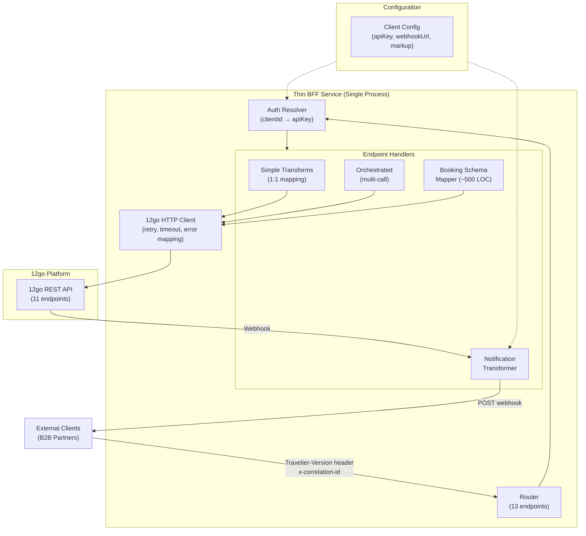
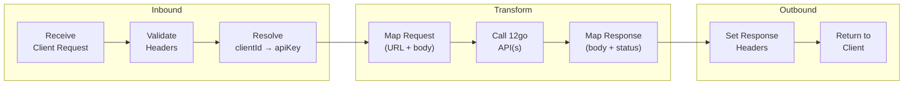
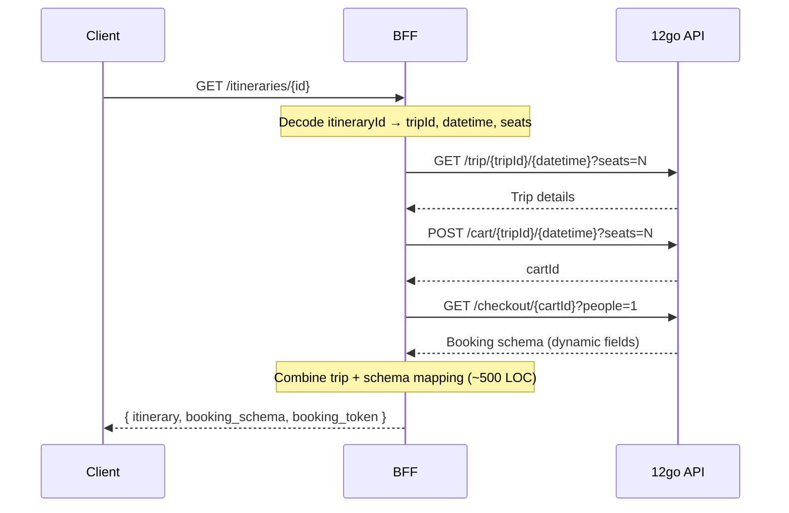
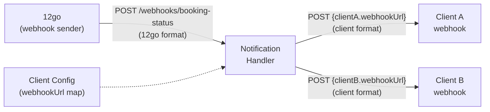
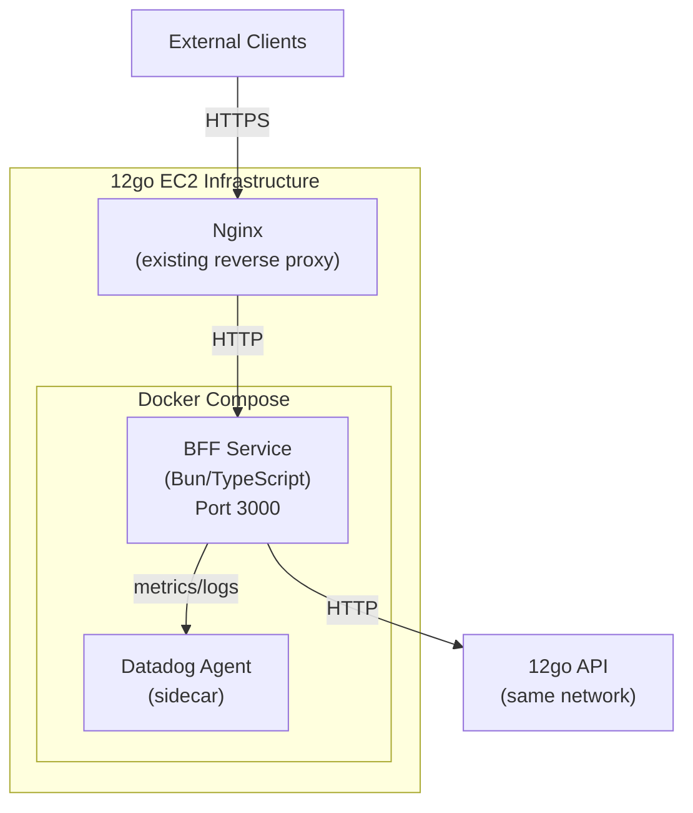
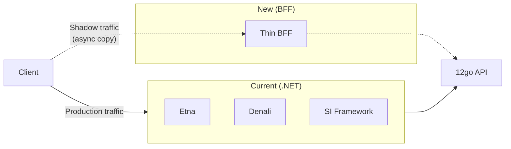

# Alternative 4: Hybrid BFF / Thin Proxy

## Executive Summary

This design starts from a radical premise: the current system is ~340 .NET projects that fundamentally proxy HTTP calls to 12go. What if we stripped it to *just the proxy*?

The answer is a thin API translation layer — a single service whose only job is to receive requests in the client-facing format, transform them to 12go's API format, call 12go, transform the response back, and return it. No local database. No booking state. No multi-supplier abstraction. Just a protocol translator.

**The honest finding**: a pure "thin proxy" works for roughly 7 of 13 endpoints. The remaining 6 require multi-call orchestration, complex schema mapping, or state — pushing us from "API gateway with plugins" into "lightweight application service" territory. The recommended implementation is an **ultra-thin TypeScript/Bun service** (~3-5K LOC) that embraces being a small application rather than pretending to be a configurable gateway.

**Estimated effort**: 3-5 weeks with 2-3 developers.
**Weighted score**: 99/140.

---

## The "Thin Proxy" Philosophy

### Starting Principle

> "What is the absolute minimum code needed to translate between two known HTTP APIs?"

Both sides of the equation are fixed and known:
- **Left side**: 13 client-facing endpoints with a documented contract
- **Right side**: 11 12go API endpoints with documented request/response shapes

The current system has ~200-400K lines of C# doing this translation. The question is: how close to zero can we get?

### The Minimum Viable Translation

For each endpoint, the minimum work is:

1. **Route mapping** — map client URL to 12go URL(s)
2. **Auth mapping** — resolve `clientId + apiKey` to 12go `k=<api-key>`
3. **Request transform** — reshape client request body/params to 12go format
4. **Response transform** — reshape 12go response to client format
5. **Error mapping** — map 12go HTTP errors to client error format

If every endpoint were a 1:1 call with simple JSON reshaping, this would be ~500 lines of configuration. Let's find out where reality departs from that.

---

## Architecture Overview



### What's In the Box

| Component | Purpose | Approx Size |
|-----------|---------|-------------|
| Router + middleware | URL routing, correlation IDs, versioning header, logging | ~200 LOC |
| Auth resolver | clientId+apiKey → 12go apiKey lookup | ~50 LOC |
| 12go HTTP client | HTTP calls with retry, timeout, error mapping | ~300 LOC |
| Simple transforms (7 endpoints) | 1:1 or light request/response mapping | ~800 LOC |
| Orchestrated handlers (4 endpoints) | Multi-call coordination | ~600 LOC |
| Booking schema mapper | Dynamic field extraction + reserve serialization | ~500 LOC |
| Notification transformer | Webhook receive → transform → forward | ~300 LOC |
| Client configuration | Per-client settings (apiKey, webhookUrl) | ~100 LOC |
| **Total** | | **~2,850 LOC** |

### What's NOT in the Box

- No database (no DynamoDB, no PostgreSQL, no Redis)
- No message queue (no Kafka producer/consumer)
- No caching layer (12go's Redis handles caching)
- No multi-supplier abstraction (only 12go)
- No MediatR pipeline
- No DI container (just functions)

---

## Gateway/Runtime Choice

### Option Comparison

| Criterion | API Gateway (Kong/Traefik) | Go Service | Node/Bun Service | Nginx+Lua (OpenResty) |
|-----------|--------------------------|------------|-------------------|----------------------|
| **Can handle 1:1 transforms** | Yes (plugins) | Yes | Yes | Yes |
| **Can handle multi-call orchestration** | Barely (custom Lua/JS) | Yes | Yes | Painful |
| **Can handle 500-line schema mapping** | No — needs external service | Yes | Yes | Theoretically (Lua) |
| **Can handle notification webhook** | No — needs separate service | Yes | Yes | Awkward |
| **Team can maintain it** | Config-heavy, Lua/plugin expertise needed | New language for team | Learnable with AI, familiar paradigm | Niche Lua expertise |
| **Deployment complexity** | Gateway + sidecar services | Single binary | Single process | Single binary + Lua scripts |
| **Performance (search proxy)** | Excellent (native) | Excellent (~100K rps) | Very good (Bun: ~200K rps) | Excellent (native) |
| **AI-friendliness** | Low (declarative config + plugins) | High (simple, well-known) | Highest (JS/TS, massive training data) | Low (niche Lua patterns) |
| **Lines of code** | ~500 config + external services | ~2,500 Go | ~2,850 TS | ~2,000 Lua + config |

### Detailed Evaluation

#### Option A: API Gateway (Kong/Traefik) — Eliminated

Kong and Traefik excel at routing, rate limiting, and auth — but they are fundamentally **not designed for complex request/response body transformation**:

- Kong's Response Transformer plugin handles header/field add/remove/rename, but cannot perform the structural JSON reshaping we need (nested object construction, array mapping, conditional field extraction).
- Traefik has **no native body transformation** at all. Community plugins offer regex-based rewriting, which is inadequate for our schema mapping.
- Both would require an external service for: booking schema mapping, multi-call orchestration, notification handling. At that point you have a gateway + a service, which is more complex than just the service.

**Verdict**: A gateway buys us routing we can write in 20 lines of code, while forcing us to build the hard parts separately anyway.

#### Option B: Ultra-Thin Go Service — Strong Contender

Go's `net/http/httputil.ReverseProxy` lets you build a reverse proxy in ~5 lines and add `ModifyResponse` hooks for transformation. Benefits:

- Single static binary, ~10MB
- Excellent HTTP performance
- Strong typing catches transformation bugs at compile time
- Aligns with 12go's "considering Go" future direction

Drawbacks:
- Team has zero Go experience
- JSON manipulation in Go is verbose (no dynamic typing, `map[string]interface{}` everywhere)
- The booking schema's 20+ dynamic field patterns would be painful in Go's type system
- Learning curve during uncertain retention period is risky

#### Option C: Ultra-Thin TypeScript/Bun Service — Recommended

Bun provides Node.js-compatible runtime with significantly better performance:

- 2.7-3.6x faster HTTP throughput than Node.js (~200K rps)
- 15-30ms cold start (vs 60-120ms Node.js)
- 40% less memory than Node.js
- Native TypeScript support (no transpilation step)
- npm-compatible (full ecosystem access)

For this workload specifically:
- JSON is the native data format — transformation is trivial compared to Go/Lua
- Dynamic field extraction (booking schema) maps naturally to JS object manipulation
- TypeScript provides enough type safety for the transformation layer
- Highest AI-friendliness — Claude/Cursor generate correct TS/JS on first attempt
- Team paradigm is familiar (HTTP services, middleware chains, async/await)

The team doesn't know TypeScript, but the learning curve from C# is minimal (same-family language, similar type system concepts, similar async patterns). AI assistance makes this even smoother.

#### Option D: Nginx+Lua (OpenResty) — Eliminated

OpenResty is powerful but:
- Lua is a niche language with limited AI training data
- Complex JSON transformation in Lua requires manual table manipulation
- Multi-call orchestration in Lua's coroutine model is error-prone
- Debugging is painful (print-based, limited tooling)
- Nobody on the team knows Lua

Good for: high-performance auth/routing gateways. Bad for: application-level JSON schema transformation.

### Final Choice: TypeScript on Bun

The strongest match for this specific workload: a JSON-in/JSON-out translation service where the hardest part is dynamic field extraction and structural remapping.

---

## Endpoint-by-Endpoint Analysis

### Classification

Each endpoint is classified as:
- **Pure Transform** — 1:1 call, only needs request/response reshaping
- **Light Orchestration** — 2-3 sequential calls, simple coordination
- **Complex Logic** — significant application logic beyond transformation
- **Stateful** — requires persistent state

| # | Endpoint | 12go Calls | Classification | Complexity | Notes |
|---|----------|-----------|---------------|------------|-------|
| 1 | **Search** | 1 | Pure Transform | Low | Map params, reshape response |
| 2 | **GetItinerary** | 3 | Light Orchestration | Medium-High | Sequential: trip details → add to cart → get schema. Schema mapping is the hard part |
| 3 | **CreateBooking** | 2 | Light Orchestration + Complex Logic | High | Reserve serialization (bracket notation), then get booking details |
| 4 | **ConfirmBooking** | 2 | Light Orchestration | Low | Confirm + get details |
| 5 | **SeatLock** | 0 | Stub/Complex Logic | Unknown | No 12go call yet; local validation only; pending 12go development |
| 6 | **GetBookingDetails** | 1 | Pure Transform | Low | Currently reads local DB; switching to proxy 12go `/booking/{id}` |
| 7 | **GetTicket** | 1 | Pure Transform | Low | Get booking details, extract ticket URL |
| 8 | **CancelBooking** | 2 | Light Orchestration | Medium | Get refund options → execute refund (hash-based) |
| 9 | **IncompleteResults** | 0 | Stateful | Medium | Polling for async ops; may be eliminated if all flows become synchronous |
| 10 | **Stations** | 0* | Pure Transform | Low | Pre-signed S3 URLs; question: who generates these now? |
| 11 | **Operators** | 0* | Pure Transform | Low | Same as Stations |
| 12 | **POIs** | 0* | Pure Transform | Low | Province-based search |
| 13 | **Notifications** | 0 (inbound) | Stateful + Transform | Medium-High | Receive webhook → transform → forward to client webhook URL |

*\*Stations/Operators/POIs: currently served from Fuji (out of scope for this design). The thin proxy would need to either pass-through to whatever replaces Fuji, or these endpoints move to 12go directly.*

### Breakdown Summary

| Category | Count | Endpoints |
|----------|-------|-----------|
| Pure Transform | 5 | Search, GetBookingDetails, GetTicket, Stations*, Operators*, POIs* |
| Light Orchestration | 4 | GetItinerary, CreateBooking, ConfirmBooking, CancelBooking |
| Complex Logic | 2 | GetItinerary (schema), CreateBooking (serialize) |
| Stateful | 2 | IncompleteResults, Notifications |

**7 of 13 endpoints are genuinely thin.** 4 require multi-call orchestration (still manageable). 2 involve complex logic that cannot be configuration-driven. 2 require some form of state.

---

## Request/Response Transformation Design

### Transformation Pipeline

Every request flows through a uniform pipeline:



### Example: Search (Pure Transform)

```
Client:  GET /v1/{clientId}/itineraries?departures=X&arrivals=Y&date=Z&passengers=N
                    ↓ transform
12go:    GET /search/{X}p/{Y}p/{Z}?seats={N}&direct=true&k={apiKey}
                    ↓ response
Client:  { itineraries: [...], operators: {...}, stations: {...} }
```

The search transform is ~100 lines:
- Extract `departures`/`arrivals` from query params, append `p` suffix (province ID format)
- Map `passengers` → `seats`
- Reshape trips array into itineraries format (pricing normalization, segment construction)
- Inline operator/station lookups into itinerary objects
- Format money as strings per client contract

### Example: GetItinerary (Orchestrated)

```
Client:  GET /{clientId}/itineraries/{itineraryId}
                    ↓ decode itinerary ID → tripId + datetime + seats
12go:    GET /trip/{tripId}/{datetime}?seats={n}&k={apiKey}
         POST /cart/{tripId}/{datetime}?seats={n}&k={apiKey}   → cartId
         GET /checkout/{cartId}?people=1&k={apiKey}            → schema
                    ↓ combine + transform
Client:  { itinerary: {...}, booking_schema: {...}, booking_token: "{cartId}" }
```

Three sequential calls. The schema mapping is where the complexity lives.

### Error Mapping

| 12go Status | 12go Meaning | Client Status | Client Error |
|-------------|-------------|---------------|-------------|
| 400 | Validation error | 400 | Map `fields`/`messages` to client error format |
| 401 | Bad API key | 500 | Internal error (client shouldn't see auth issues) |
| 404 | Product not found | 404 | `{ error: "itinerary_not_found" }` |
| 422 | Unprocessable | 400 | Map to validation error format |
| 500+ | Server error | 502 | Bad Gateway — upstream failure |

---

## The Booking Schema Problem

This is where "thin" breaks down hardest. The 12go `/checkout/{cartId}` endpoint returns a dynamic form with 20+ field patterns that must be extracted, categorized, and restructured for the client.

### Why It's Complex

The response uses `[JsonExtensionData]`-style dynamic fields with patterns like:

```
selected_seats_BKK123           → seat selection
selected_seats_BKK123_allow_auto → auto-assign toggle
passenger[0][baggage_cabin]     → baggage option
points_trip_12345[pickup]       → pickup point
points_trip_12345[dropoff]      → dropoff point
delivery_express_address        → delivery address
```

These keys contain trip-specific IDs, making them impossible to map with static configuration. The mapping logic must:

1. Iterate over all response keys
2. Pattern-match against ~20 wildcard rules
3. Extract the dynamic portions (trip IDs, field types)
4. Categorize into structured objects (seats, baggage, points, delivery)
5. Build a typed client response from the categorized fields

### How to Handle It "Thinly"

Even in a thin service, this is ~300-500 lines of code. The approach:

```typescript
function mapBookingSchema(raw: Record<string, FormField>): ClientBookingSchema {
  const result: ClientBookingSchema = {
    contact: { mobile: raw['contact[mobile]'], email: raw['contact[email]'] },
    passengers: [extractPassengerFields(raw, 0)],
    seats: {},
    points: {},
    delivery: {},
  };

  for (const [key, field] of Object.entries(raw)) {
    if (key.match(/^selected_seats_(.+)_allow_auto$/))
      result.seats.allowAuto = { fieldName: key, ...field };
    else if (key.match(/^selected_seats_(.+)$/))
      result.seats.selection = { fieldName: key, ...field };
    else if (key.match(/^passenger\[0\]\[baggage_/))
      result.passengers[0].baggage = { fieldName: key, ...field };
    else if (key.match(/^points.*\[pickup\]$/))
      result.points.pickup = { fieldName: key, ...field };
    else if (key.match(/^points.*\[dropoff\]$/))
      result.points.dropoff = { fieldName: key, ...field };
    // ... ~15 more patterns
  }

  return result;
}
```

**This is actually simpler in TypeScript than in C#.** The existing C# code uses `[JsonExtensionData]` + manual property population from a dictionary with wildcard string matching. In TypeScript, it's just iterating over an object's keys — the language was designed for this.

### The Reserve Serialization (Reverse Direction)

The reserve request must serialize passenger data into 12go's flat bracket-notation format:

```
{ contact: { mobile: "..." }, passengers: [{ firstName: "John", ... }] }
    ↓ serialize
{ "contact[mobile]": "...", "passenger[0][first_name]": "John", ... }
```

This is another ~100-150 lines, but it's mechanical — a well-defined flattening operation.

---

## Multi-Step Orchestration

Four endpoints require calling 12go multiple times:

### GetItinerary (3 calls, sequential)



These calls are strictly sequential (each depends on the previous), so there's no parallelization opportunity. Total latency ≈ sum of three 12go calls. This is inherent to the flow, not a design limitation.

### CreateBooking (2 calls)

```
POST /reserve/{bookingId}   → reservation result
GET /booking/{bookingId}     → price/status details
```

Reserve must serialize the complex bracket-notation body. The second call enriches the response with pricing details.

### ConfirmBooking (2 calls)

```
POST /confirm/{bookingId}    → confirmation result
GET /booking/{bookingId}     → final status + ticket info
```

Straightforward — confirm, then fetch updated details.

### CancelBooking (2 calls)

```
GET /booking/{bookingId}/refund-options  → options with hashes
POST /booking/{bookingId}/refund         → execute selected option
```

The client sends the selected refund option; we validate it against available options and execute.

### Orchestration Pattern

All multi-step endpoints follow the same pattern:

```typescript
async function orchestrate<T>(
  steps: Array<() => Promise<unknown>>,
  combine: (...results: unknown[]) => T
): Promise<T> {
  const results = [];
  for (const step of steps) {
    results.push(await step());
  }
  return combine(...results);
}
```

No saga pattern. No compensation. No distributed state. Just sequential HTTP calls within a single request lifecycle.

---

## Notification Transformer

### The Problem

The notification transformer is the one component that **cannot** be stateless. 12go sends booking status webhooks to our service, but:

1. The webhook payload is in 12go's format (needs transformation to client format)
2. Different clients have different webhook URLs (needs per-client routing)
3. Delivery must be reliable (needs retry on client failure)
4. 12go currently has **no authentication** on webhooks we receive

### Minimal Design



### State Requirements

The notification handler needs:

| Need | Minimal Solution | Notes |
|------|-----------------|-------|
| Client webhook URLs | Config file or env vars | Loaded at startup, hot-reloadable |
| Booking → client mapping | Derive from booking ID | If 12go includes client context in webhook. Otherwise: in-memory map populated during booking creation |
| Retry on failure | In-process retry with exponential backoff | Fire-and-forget after max retries; log failures |
| Delivery tracking | Structured logging to Datadog | No persistent delivery log |

### The Booking-to-Client Mapping Problem

When 12go sends a webhook for booking `12345`, how do we know which client to notify?

**Option A: 12go includes client identifier in webhook payload.** This is the cleanest solution. If the booking was made with client A's API key, 12go could include that context. *Requires 12go cooperation.*

**Option B: In-memory map populated during booking creation.** When CreateBooking is called with `clientId`, store `bookingId → clientId` in an in-memory map. The notification handler looks up the client.

Drawback: lost on restart. Bookings created before a restart won't route correctly until the client calls GetBookingDetails (which doesn't help for push notifications).

**Option C: Minimal persistent store.** A single Redis key-value store: `bookingId → clientId`. This is the smallest possible "state" — one key per active booking. Can be co-located with 12go's Redis.

**Recommendation**: Start with Option B (in-memory map), document the restart limitation, push for Option A with 12go as a medium-term fix. Fall back to Option C (Redis) if restarts prove problematic in practice.

### Webhook Security

12go currently has no webhook authentication. The BFF should:
- Accept webhooks only from known 12go IP ranges (network-level)
- Add a shared secret to the webhook URL path (`/webhooks/{secret}/booking-status`)
- Validate webhook payload structure before processing

---

## Where Thin Breaks Down

An honest assessment of where the "thin proxy" aspiration meets reality:

### Genuinely Thin (No Application Logic)

| Endpoint | Why It Stays Thin |
|----------|------------------|
| Search | 1 call, response reshaping only |
| GetBookingDetails | 1 call, response reshaping only |
| GetTicket | 1 call, extract ticket URL |
| ConfirmBooking | 2 calls, trivial orchestration |
| Stations/Operators/POIs | Pass-through (depends on Fuji replacement) |

### Thin Breaks Down (Application Logic Required)

| Area | Why | Complexity |
|------|-----|-----------|
| **Booking schema mapping** | 20+ dynamic field patterns with trip-specific keys. Not configurable — requires code that iterates, pattern-matches, and categorizes. | ~500 LOC |
| **Reserve request serialization** | Custom flat bracket-notation format (`passenger[0][first_name]`). Mechanical but non-trivial. | ~150 LOC |
| **Itinerary ID encoding/decoding** | Current system uses Caesar cipher to encode tripId + datetime + seats into an opaque itinerary ID. Must preserve this for backward compatibility. | ~50 LOC |
| **Notification transformer** | Inherently stateful. Needs booking→client mapping, retry logic, payload transformation. | ~300 LOC |
| **SeatLock** | Currently faked locally. 12go is developing native support. Interim solution needs local validation logic. | Unknown |
| **IncompleteResults** | Polling mechanism for async operations. If all operations become synchronous via 12go, this can be eliminated. Otherwise needs in-memory state. | ~100 LOC |
| **Per-client markup** | If clients need different pricing markups, the transform layer needs pricing logic. | ~100 LOC (if needed) |
| **Credit line check** | If credit line checking survives, it needs external state (balance tracking). | Unknown (may be eliminated) |

### The Honest Verdict

This is not a "thin proxy" — it's a **thin application service**. The distinction matters:

- A proxy routes and maybe transforms headers
- A translation service reshapes request/response bodies
- An application service orchestrates multiple calls and applies business logic

This design lives at the border between "translation service" and "application service." That's okay. The point is it's **~3K LOC instead of ~300K LOC**. The 99% reduction in code is the win, not the label we put on it.

---

## Deployment Strategy

### Target Architecture



### Deployment Details

| Aspect | Choice |
|--------|--------|
| Runtime | Bun 1.2+ |
| Container | Single Dockerfile (~50MB image) |
| Orchestration | Docker Compose (same as 12go services) |
| Reverse proxy | Nginx (existing 12go infrastructure) |
| Configuration | Environment variables + JSON config file |
| Monitoring | Datadog APM via `dd-trace` npm package |
| Logging | Structured JSON to stdout → Datadog |
| Health check | `GET /health` returning upstream 12go status |

### Resource Requirements

- **CPU**: Minimal — JSON transformation is not CPU-intensive
- **Memory**: ~50-100MB (Bun baseline + request buffers)
- **Disk**: None (no local storage)
- **Network**: Same VPC/network as 12go (sub-millisecond latency to 12go API)

---

## Migration Path

### Phase 1: Shadow Mode (Week 1-2 of deployment)



Run both systems in parallel. Compare responses for correctness. No client impact.

### Phase 2: Canary (Week 3-4)

Route a single non-critical client to the BFF. Monitor for:
- Response correctness (diff against .NET system)
- Latency (should be equal or better — fewer network hops)
- Error rates
- Booking success rate

### Phase 3: Gradual Rollover (Week 5+)

Move clients one by one. Keep .NET system running as fallback. Instant rollback by re-pointing Nginx.

### Rollback Strategy

Nginx configuration change. Switch `upstream` from BFF back to .NET services. Takes effect in seconds.

---

## Risks and Mitigations

| Risk | Likelihood | Impact | Mitigation |
|------|-----------|--------|------------|
| **Booking schema mapping has undocumented edge cases** | High | Medium | Port existing C# pattern-matching logic directly. Run shadow mode to catch mismatches. |
| **Team unfamiliar with TypeScript/Bun** | Medium | Medium | TypeScript is close to C# in concepts. AI assistance accelerates learning. Bun is Node.js-compatible — vast documentation. |
| **Bun runtime stability in production** | Low-Medium | High | Bun 1.2 is production-stable. Fallback: switch to Node.js 22 with zero code changes (Bun is Node-compatible). |
| **Notification delivery reliability without persistent state** | Medium | Medium | Start with in-memory + logging. Add Redis if needed. Push for 12go to include client context in webhooks. |
| **Per-client features (markup, credit line) not fully understood** | Medium | Medium | Start without markup/credit line. Add if requirements emerge. Thin service is easy to extend. |
| **Itinerary ID backward compatibility** | Low | High | Port Caesar cipher encoding exactly from existing C# code. Verify in shadow mode. |
| **SeatLock timeline uncertainty** | High | Low | Stub endpoint. Implement when 12go's native seat lock ships. |
| **Static data endpoints (Stations/Operators/POIs)** | Medium | Medium | These depend on the Fuji replacement strategy (out of scope). BFF can proxy to whatever replaces Fuji. |

---

## Effort Estimate

### Phase Breakdown

| Phase | Scope | Duration | Team |
|-------|-------|----------|------|
| **1. Core scaffold** | Project setup, router, 12go HTTP client, auth resolver, error mapping, health check, Datadog integration | 3-4 days | 1 dev |
| **2. Simple endpoints** | Search, GetBookingDetails, GetTicket, ConfirmBooking transforms | 3-4 days | 1-2 devs |
| **3. Schema mapping** | Booking schema extraction, reserve serialization, itinerary ID encoding | 4-5 days | 1 dev (focused) |
| **4. Orchestrated endpoints** | GetItinerary (3-call), CreateBooking, CancelBooking | 3-4 days | 1-2 devs |
| **5. Notification transformer** | Webhook receiver, client routing, retry, payload transform | 3-4 days | 1 dev |
| **6. Static data passthrough** | Stations, Operators, POIs (depends on Fuji replacement) | 2-3 days | 1 dev |
| **7. Integration testing** | Shadow mode, response comparison, edge cases | 5-7 days | 2 devs |
| **8. Canary + rollout** | Single client, monitoring, gradual migration | 5-7 days | 1 dev + ops |

### Total Estimate

| Scenario | Duration | Notes |
|----------|----------|-------|
| Optimistic | 3 weeks | Everything maps cleanly, no surprises |
| Realistic | 4-5 weeks | Schema edge cases, notification complexity |
| Pessimistic | 6-7 weeks | Undocumented behaviors, credit line/markup requirements emerge |

### Team Allocation

- 2 senior .NET devs ramp up on TypeScript/Bun (1-2 days with AI assistance)
- Dev A: Core scaffold + schema mapping (hardest part, needs focus)
- Dev B: Simple transforms + orchestrated endpoints
- Dev C (if available): Notification transformer + testing

---

## Self-Assessment

### Scoring Against Evaluation Criteria

#### High Weight (×3)

| # | Criterion | Score | Justification |
|---|-----------|-------|---------------|
| 1 | **Implementation Effort** | 4 | ~3-5K LOC, 4-5 weeks realistic. Not quite "2-3 weeks" for a 5, but significantly less effort than alternatives that involve framework choices, ORMs, or multi-service deployments. |
| 2 | **Team Competency Match** | 3 | Team knows .NET, not TypeScript. However, TS is the closest non-.NET language to C# (typed, async/await, class-based). AI assistance closes the gap quickly. Not a 2 because the paradigm is familiar; not a 4 because it's still a new language. |
| 3 | **Search Performance** | 5 | Search is a single HTTP call passthrough. Bun adds <1ms of transformation overhead to 12go's response time. This is essentially limited only by 12go's search performance + network latency. |
| 4 | **Infrastructure Fit** | 4 | Docker container on EC2, same as 12go services. Bun isn't in 12go's current stack but it's a single container. DevOps deploys it like any other service. Not a 5 because it introduces a new runtime to the infrastructure. |

**High Weight Subtotal**: (4 + 3 + 5 + 4) × 3 = **48/60**

#### Medium Weight (×2)

| # | Criterion | Score | Justification |
|---|-----------|-------|---------------|
| 5 | **Maintainability** | 4 | ~3K LOC, no framework magic, every endpoint is a visible function. Easy to onboard. Not a 5 because TypeScript ecosystem moves fast and the team may struggle without JS experience. |
| 6 | **Development Velocity** | 5 | Adding/modifying an endpoint: write a transform function, add a route. No interfaces, no DI registration, no pipeline configuration. AI generates correct code immediately. |
| 7 | **Simplicity** | 5 | Single service, ~3K LOC, no database, no message queue, no cache layer. The entire system fits in one developer's head. |
| 8 | **AI-Friendliness** | 5 | TypeScript is the most AI-friendly language (largest training corpus, best Cursor/Claude support). JSON transformation is trivially expressible. |
| 9 | **Operational Complexity** | 4 | Single deployment, structured logging to Datadog, health check endpoint. Not a 5 because notification transformer adds operational concern (monitoring delivery, retry behavior). |
| 10 | **Migration Risk** | 4 | Shadow mode + canary + Nginx rollback. Low risk. Not a 5 because the language change means the team can't easily debug production issues in the first weeks. |

**Medium Weight Subtotal**: (4 + 5 + 5 + 5 + 4 + 4) × 2 = **54/60**

#### Low Weight (×1)

| # | Criterion | Score | Justification |
|---|-----------|-------|---------------|
| 11 | **Future Extensibility** | 3 | TypeScript isn't 12go's future direction (they're considering Go). But the code is so thin that rewriting in Go later is trivial. Not locked in. |
| 12 | **Elegance** | 3 | It's pragmatic, not elegant. A bag of transform functions with some orchestration. No clean architecture, no domain model, no patterns. That's the point — but it won't win architecture awards. |
| 13 | **Testing Ease** | 4 | Pure functions (input JSON → output JSON) are trivially testable. Orchestrated endpoints need HTTP mocking but that's standard. Not a 5 because integration testing against 12go is the real validation. |
| 14 | **Monitoring/Observability** | 4 | `dd-trace` for Datadog APM, structured JSON logging, correlation ID propagation. Not a 5 because Bun's Datadog integration is less mature than .NET's. |

**Low Weight Subtotal**: (3 + 3 + 4 + 4) × 1 = **14/20**

### Final Score

```
Score = 48 + 54 + 14 = 99 / 140
```

### Score Interpretation

The thin BFF scores highest on simplicity, development velocity, AI-friendliness, and search performance — the criteria that matter most for this specific problem. It takes a moderate hit on team competency match (new language) and future extensibility (TypeScript isn't Go). The core trade-off is: **maximum simplicity at the cost of requiring the team to learn TypeScript**, offset by the fact that TypeScript is the easiest language to learn with AI assistance.

### Where This Design Wins

- Least code by a wide margin (~3K LOC vs 20-50K for other alternatives)
- Fastest time to MVP
- Easiest to understand, debug, and modify
- No infrastructure beyond a single container
- AI can generate/modify most of the code with high accuracy

### Where This Design Is Weakest

- Team has no TypeScript experience (mitigated by AI + language similarity)
- Not aligned with 12go's potential Go future (mitigated by small rewrite cost)
- Notification transformer needs state that breaks the "stateless" aspiration
- Bun is newer than Node.js (mitigated by Node.js fallback compatibility)
- "Thin" is somewhat misleading — it's really a "small application service"
