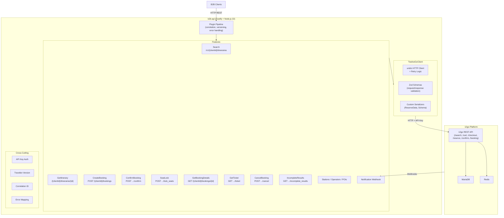
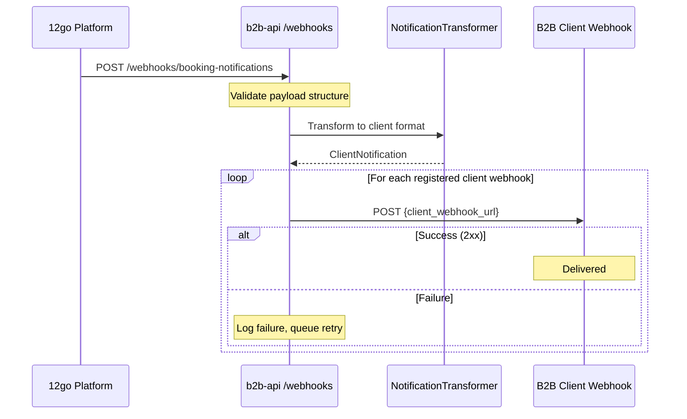
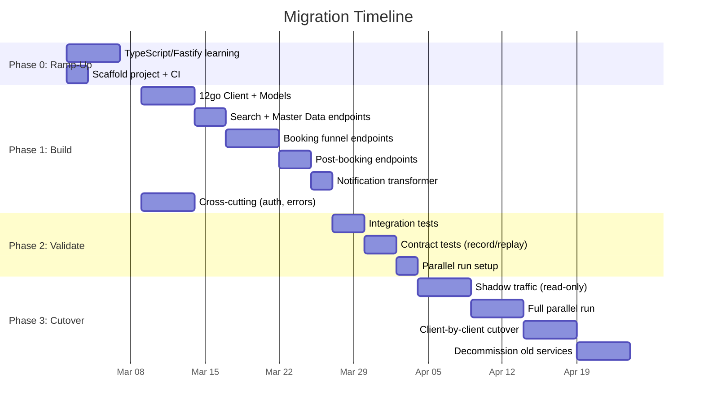

# Alternative 5: TypeScript/Node.js Service

## Executive Summary

Replace four .NET repositories (~340 projects, 200-400K LOC) with a **single TypeScript service** built on **Fastify + Node.js 22 LTS**, containing approximately **5-8K lines of TypeScript**. The service acts as a thin, stateless HTTP proxy between B2B clients and the 12go platform, preserving all 13 client-facing endpoints. TypeScript offers the **best AI-assisted development story in any language**, a type system that C# developers will find immediately familiar, native JSON handling, and an async I/O model purpose-built for proxy workloads. The team will need **1-2 weeks of ramp-up** before becoming productive, but the language similarity to C# and AI tooling support compress this significantly. MVP is achievable in **4-5 weeks** (including ramp-up), followed by 2-3 weeks of parallel-run validation.

## Why TypeScript (and Why Not)

### Arguments For

1. **Best AI tooling support of any language.** TypeScript has the largest training corpus for AI code generation. Cursor and Copilot generate correct TypeScript on first try at ~92% accuracy. The team already uses Cursor heavily — switching to the language it's best at amplifies their existing workflow. With an uncertain 6-month team retention horizon and potential future maintainers of varying skill levels, AI-friendliness is a force multiplier.

2. **Type system is C# with different syntax.** Both languages were designed by Anders Hejlsberg. Interfaces, generics, async/await, enums, union types, arrow functions, nullable types — the concepts map 1:1. A senior C# developer reads TypeScript fluently within days. `Promise<T>` is `Task<T>`. `interface` is `interface`. `Record<string, T>` is `Dictionary<string, T>`.

3. **JSON is the native data format.** The entire service transforms JSON (from 12go) to JSON (to clients). In C#, this requires `System.Text.Json` serializers, custom converters, `[JsonPropertyName]` attributes. In TypeScript, JSON is a language primitive. Parsing, transforming, and serializing JSON objects is zero-ceremony code.

4. **Purpose-built for I/O-bound proxy workloads.** Node.js's event loop excels at exactly what this service does: receive an HTTP request, make 1-3 HTTP calls to 12go, transform the response, return it. There is zero CPU-bound computation. The single-threaded model is a strength here, not a weakness — no thread pool tuning, no `ConfigureAwait(false)`, no synchronization contexts.

5. **Ecosystem velocity.** The npm ecosystem moves faster than NuGet for HTTP/API tooling. Libraries like `zod` (runtime validation), `pino` (structured logging), and `undici` (HTTP client) are best-in-class, actively maintained, and AI tools know them intimately.

### Arguments Against

1. **The team doesn't know TypeScript.** This is the primary risk. Two senior .NET developers with 12 years of experience each will need to learn a new language and ecosystem. The learning curve is genuinely small (1-2 weeks to productivity, 4-6 weeks to proficiency), but it's non-zero, and there's psychological cost to leaving a comfort zone during an already stressful transition.

2. **Not aligned with 12go's direction.** 12go is considering Go (though nothing is decided). TypeScript is a third language in the mix — neither the team's native .NET nor 12go's potential future. If 12go commits to Go, this TypeScript service becomes an outlier.

3. **Node.js ecosystem quality varies.** npm has 2 million packages, and quality ranges from excellent to abandoned. Dependency management requires discipline — `package-lock.json`, careful `node_modules` hygiene, awareness of supply chain risks. The .NET/NuGet ecosystem is more curated.

4. **Runtime immaturity for enterprise patterns.** Node.js has no built-in DI container, no equivalent to `IHttpClientFactory` connection pooling, no `IHostedService` lifecycle. These are solvable (Fastify plugins, `undici` pool, custom lifecycle hooks), but require explicit setup that .NET provides out of the box.

5. **Single-threaded model requires understanding.** While perfect for I/O-bound work, a developer who accidentally writes a synchronous loop over a large dataset will block the entire event loop. The team needs to internalize this constraint.

## Architecture Overview



### Service Topology: Single Service

The same reasoning from the .NET alternative applies: the service is a thin proxy with no significant compute, no background processing, and no state. Every endpoint makes 1-3 HTTP calls to 12go and transforms the response. There is nothing to scale independently. A single service, single deployment unit, single repository.

## Framework and Runtime Choice

### Runtime: Node.js 22 LTS

| Runtime | Throughput | Cold Start | Ecosystem Maturity | Production Risk |
|---------|-----------|------------|-------------------|----------------|
| **Node.js 22 LTS** | ~68K req/s | 60-120ms | Excellent (15 years) | Very Low |
| Bun 1.2 | ~200K req/s | 15-30ms | Maturing (2 years) | Medium |
| Deno 2 | ~50K req/s | 40-60ms | Good (4 years) | Low-Medium |

**Decision: Node.js 22 LTS.**

Bun's 3x throughput advantage is irrelevant for this workload. The service makes 1-3 HTTP calls to 12go per request — latency is dominated by 12go's response time (~50-500ms), not our framework overhead (~1-5ms). The difference between 68K and 200K req/s doesn't matter when the bottleneck is a remote MariaDB query.

Node.js 22 LTS is the safer choice:
- **Battle-tested in production** at companies far larger than us — Netflix, PayPal, LinkedIn, Walmart
- **LTS support** through April 2027, with security updates through April 2028
- **Complete library compatibility** — every npm package works. Bun still has compatibility gaps
- **Datadog `dd-trace` has first-class Node.js support** — Bun support is experimental
- **DevOps familiarity** — Node.js Docker images are well-understood; Bun requires separate base images and debugging knowledge
- **Hiring pool** — any JavaScript/TypeScript developer knows Node.js

If Bun matures and becomes production-standard (likely by 2027), migration is a one-line `Dockerfile` change — the application code is identical.

### Framework: Fastify

| Framework | Style | Performance (Node.js) | DI | Validation | Learning Curve |
|-----------|-------|----------------------|----|-----------|---------------|
| **Fastify** | Plugin-based, schema-first | ~9,164 req/s | Plugin-based | JSON Schema (native) | Moderate |
| NestJS | Decorator-based, Angular-inspired | ~5,395 req/s (Express) | Built-in IoC | class-validator/Pipes | High (Angular patterns) |
| NestJS + Fastify | Decorator-based | ~8,800 req/s | Built-in IoC | class-validator/Pipes | High |
| Hono | Minimal, edge-first | Competitive | None | Manual | Low |
| Express | Middleware-based | ~4,500 req/s | None | Manual | Low |

**Decision: Fastify.**

Why not NestJS (the "closest to .NET" option):
- NestJS's decorator/DI pattern looks familiar to C# developers on the surface, but it's actually Angular-in-Node.js — a different mental model than ASP.NET. The class decorators (`@Controller`, `@Injectable`, `@Module`) resemble .NET attributes but work differently.
- NestJS adds abstraction layers (modules, providers, guards, interceptors, pipes) that are overkill for a 13-endpoint proxy service. We'd be fighting the framework's complexity rather than leveraging it.
- With Express adapter: ~40% slower than Fastify. With Fastify adapter: nearly the same speed, but with NestJS's abstraction overhead and larger bundle.

Why not Hono:
- Ultra-lightweight, but lacks built-in validation, serialization, and plugin ecosystem. We'd rebuild what Fastify provides.
- Optimized for edge/serverless runtimes — we're deploying to EC2 Docker containers.

Why Fastify:
- **Schema-first validation** via JSON Schema is native — request/response validation with zero extra libraries, and it generates serialization code for performance.
- **Plugin architecture** maps cleanly to cross-cutting concerns (auth, correlation ID, error handling) without decorator magic.
- **2x faster than Express** with 37% less memory — meaningful for container resource allocation even if 12go is the bottleneck.
- **TypeScript support is first-class** with typed route handlers, typed plugins, and typed decorators.
- **Pragmatic abstraction level** — more structure than raw `http.createServer`, less ceremony than NestJS. Perfect for a 13-endpoint proxy.
- **AI tools generate excellent Fastify code** — it's well-represented in training data.

## Project Structure

```
b2b-api/
├── package.json
├── tsconfig.json
├── Dockerfile
├── .env.example
├── docker-compose.yml                  # Local dev with Datadog agent
│
├── src/
│   ├── index.ts                        # Entry point: build app, start server
│   ├── app.ts                          # Fastify app factory (composition root)
│   │
│   ├── twelve-go/                      # 12go HTTP client (~1.5K LOC)
│   │   ├── client.ts                   # TwelveGoClient class — all 11 endpoints
│   │   ├── types.ts                    # TypeScript types for 12go API models
│   │   ├── schemas.ts                  # Zod schemas for runtime validation
│   │   ├── errors.ts                   # 12go error response parsing
│   │   ├── reserve-serializer.ts       # Bracket-notation ReserveData serializer
│   │   └── booking-schema-parser.ts    # Dynamic field extraction (20+ patterns)
│   │
│   ├── features/                       # Vertical slices (~2-3K LOC)
│   │   ├── search/
│   │   │   ├── routes.ts               # GET /v1/{clientId}/itineraries
│   │   │   └── mapper.ts              # 12go → client response mapping
│   │   ├── checkout/
│   │   │   ├── routes.ts               # GET /{clientId}/itineraries/{id}
│   │   │   └── mapper.ts
│   │   ├── booking/
│   │   │   ├── routes.ts               # POST bookings, confirm, seat-lock
│   │   │   └── mapper.ts
│   │   ├── post-booking/
│   │   │   ├── routes.ts               # GET booking details, ticket, cancel
│   │   │   └── mapper.ts
│   │   ├── master-data/
│   │   │   └── routes.ts               # Stations, operators, POIs
│   │   └── notifications/
│   │       ├── routes.ts               # POST webhook receiver
│   │       └── transformer.ts          # 12go → client notification mapping
│   │
│   ├── plugins/                        # Fastify plugins (cross-cutting ~500 LOC)
│   │   ├── correlation-id.ts
│   │   ├── api-version.ts
│   │   ├── client-auth.ts
│   │   ├── error-handler.ts
│   │   └── observability.ts            # Logging + tracing setup
│   │
│   ├── contracts/                      # Client-facing types (~500 LOC)
│   │   ├── search.ts
│   │   ├── booking.ts
│   │   └── common.ts
│   │
│   └── config/
│       ├── env.ts                      # Environment config with validation
│       └── clients.ts                  # Per-client configuration
│
├── test/
│   ├── twelve-go/
│   │   ├── client.test.ts
│   │   ├── reserve-serializer.test.ts
│   │   └── booking-schema-parser.test.ts
│   ├── features/
│   │   ├── search.test.ts
│   │   ├── booking.test.ts
│   │   └── ...
│   ├── plugins/
│   │   └── error-handler.test.ts
│   └── fixtures/
│       └── twelve-go-responses/        # Recorded 12go JSON responses
│           ├── search-response.json
│           ├── booking-schema.json
│           └── ...
│
└── README.md
```

**Total: 1 `package.json`, ~15 source files.** Down from 342 `.csproj` files.

### Why This Structure?

- **Feature-based vertical slices** — each feature folder contains its routes and mappers. A developer working on search touches `features/search/` and `twelve-go/client.ts`. Nothing else.
- **`twelve-go/` is a self-contained HTTP client** — could be extracted to a separate package if reuse ever arises, but there's exactly one consumer today.
- **Plugins map to ASP.NET middleware** — the mental model C# developers already have. A plugin wraps a request lifecycle hook, exactly like `IMiddleware`.
- **No `src/utils/`, no `src/helpers/`** — these become dumping grounds. If code is shared, it belongs in `twelve-go/` (12go-specific) or `contracts/` (client-specific) or `plugins/` (cross-cutting).

## Type System Design

### TypeScript Types for 12go Models

TypeScript interfaces map directly from the existing C# models. The key advantage: no attributes, no converters — the types describe the JSON shape directly.

```typescript
// twelve-go/types.ts

export interface TwelveGoSearchResponse {
  trips: Trip[];
  operators: Record<string, Operator>;
  stations: Record<string, Station>;
  classes: Record<string, TripClass>;
  recheck: string[];
}

export interface Trip {
  id: string;
  chunk_key: string;
  route_name: string;
  params: TripParams;
  segments: SegmentItem[];
  travel_options: TravelOption[];
}

export interface TripParams {
  vehclasses: string[];
  bookable: number;
  operators: number[];
  duration: number;
  arr_time: string;
  dep_time: string;
  min_price: Price;
  from: number;
  to: number;
  stops: number;
  min_rating: number | null;
  rating_count: number;
  hide: boolean | null;
  date: string;
}

export interface TravelOption {
  id: string;
  bookable: number;
  price: Price;
  netprice: Price;
  agfee: Price;
  sysfee: Price;
  class: number;
  amenities: string[];
  ticket_type: string;
  confirmation_time: number;
  confirmation_message: string;
  cancellation: number;
  cancellation_message: string;
  baggage: Baggage;
  rating: number | null;
  is_bookable: number;
  reason: string;
  booking_uri: string;
  full_refund_until: string | null;
  dep_datetime: string | null;
  arr_datetime: string | null;
}

export interface Price {
  value: number | null;
  fxcode: string;
}

export interface Station {
  station_id: number;
  province_id: number;
  station_name: string;
  station_name_full: string;
  station_code: string;
  station_slug: string;
  station_lat: number;
  station_lng: number;
  weight: number;
}

export interface BookingSchemaResponse {
  [key: string]: FormField;
}

export interface FormField {
  type: string;
  name: string;
  title: string;
  description: string;
  disabled?: boolean;
  is_visible?: boolean;
  items?: unknown[];
  data?: FieldData;
  analytics_name?: string;
  regexp?: string[];
  value?: unknown;
  options?: FormFieldOption[];
  required?: boolean;
}

export interface RefundOption {
  refund_amount: number;
  refund_fxcode: string;
  expires: boolean;
  expires_after: string;
  available: boolean;
  available_since: string;
  hash: string;
}
```

**Key observation**: The TypeScript types are ~40% less code than the equivalent C# models. No `[JsonPropertyName]` attributes, no nullable reference type annotations (TypeScript uses `| null` or `?` inline), no `class` boilerplate. The type _is_ the JSON shape.

### Runtime Validation with Zod

TypeScript types are compile-time only — they're erased at runtime. For incoming requests and 12go responses, we use Zod for runtime validation:

```typescript
// twelve-go/schemas.ts
import { z } from 'zod';

export const priceSchema = z.object({
  value: z.number().nullable(),
  fxcode: z.string(),
});

export const searchResponseSchema = z.object({
  trips: z.array(z.object({
    id: z.string(),
    chunk_key: z.string(),
    route_name: z.string(),
    params: z.object({
      bookable: z.number(),
      duration: z.number(),
      dep_time: z.string(),
      arr_time: z.string(),
      min_price: priceSchema,
      from: z.number(),
      to: z.number(),
    }),
    segments: z.array(z.object({
      type: z.string(),
      trip_id: z.string(),
      from: z.number(),
      to: z.number(),
      duration: z.number(),
      dep_time: z.string(),
      arr_time: z.string(),
      class: z.number(),
      operator: z.number(),
    })),
    travel_options: z.array(z.object({
      id: z.string(),
      bookable: z.number(),
      price: priceSchema,
      netprice: priceSchema,
      ticket_type: z.string(),
      confirmation_time: z.number(),
    })),
  })),
  operators: z.record(z.string(), z.object({
    id: z.number(),
    name: z.string(),
    slug: z.string(),
  })),
  stations: z.record(z.string(), z.object({
    station_id: z.number(),
    province_id: z.number(),
    station_name: z.string(),
  })),
  recheck: z.array(z.string()).default([]),
});

export type SearchResponse = z.infer<typeof searchResponseSchema>;
```

**Why Zod over alternatives (io-ts, typebox, ajv)?**
- Zod infers TypeScript types from schemas — single source of truth, no type/schema drift
- API is intuitive for C# developers (`.object()` → class, `.string()` → `string`, `.nullable()` → `?`)
- AI tools generate correct Zod schemas reliably
- Fastify integration via `fastify-type-provider-zod` for request validation

### Fastify + Zod Integration

Fastify's schema-first validation integrates with Zod for type-safe route handlers:

```typescript
import { FastifyInstance } from 'fastify';
import { z } from 'zod';

const searchQuerySchema = z.object({
  departures: z.string(),
  arrivals: z.string(),
  date: z.string().regex(/^\d{4}-\d{2}-\d{2}$/),
  seats: z.coerce.number().int().min(1).max(10).default(1),
});

const searchParamsSchema = z.object({
  clientId: z.string(),
});

export async function searchRoutes(app: FastifyInstance) {
  app.get(
    '/v1/:clientId/itineraries',
    {
      schema: {
        params: searchParamsSchema,
        querystring: searchQuerySchema,
      },
    },
    async (request, reply) => {
      const { clientId } = request.params;
      const { departures, arrivals, date, seats } = request.query;

      const twelveGoResponse = await app.twelveGo.search(
        departures, arrivals, date, seats,
      );

      const result = mapSearchResponse(twelveGoResponse, clientId);

      if (result.hasIncompleteData) {
        return reply.code(206).send(result);
      }
      return reply.send(result);
    },
  );
}
```

## HTTP API Layer

### Route Registration

```typescript
// app.ts
import Fastify from 'fastify';
import { correlationIdPlugin } from './plugins/correlation-id';
import { apiVersionPlugin } from './plugins/api-version';
import { clientAuthPlugin } from './plugins/client-auth';
import { errorHandlerPlugin } from './plugins/error-handler';
import { observabilityPlugin } from './plugins/observability';
import { searchRoutes } from './features/search/routes';
import { checkoutRoutes } from './features/checkout/routes';
import { bookingRoutes } from './features/booking/routes';
import { postBookingRoutes } from './features/post-booking/routes';
import { masterDataRoutes } from './features/master-data/routes';
import { notificationRoutes } from './features/notifications/routes';

export async function buildApp() {
  const app = Fastify({
    logger: {
      transport: {
        target: 'pino-datadog-transport',
      },
      level: process.env.LOG_LEVEL ?? 'info',
      serializers: {
        req: (req) => ({
          method: req.method,
          url: req.url,
          correlationId: req.headers['x-correlation-id'],
        }),
      },
    },
  });

  // Cross-cutting plugins
  await app.register(correlationIdPlugin);
  await app.register(apiVersionPlugin);
  await app.register(errorHandlerPlugin);
  await app.register(observabilityPlugin);

  // Authenticated routes
  await app.register(async (authenticated) => {
    await authenticated.register(clientAuthPlugin);

    await authenticated.register(searchRoutes);
    await authenticated.register(checkoutRoutes);
    await authenticated.register(bookingRoutes);
    await authenticated.register(postBookingRoutes);
    await authenticated.register(masterDataRoutes);
  });

  // Unauthenticated routes (12go webhooks)
  await app.register(notificationRoutes, { prefix: '/webhooks' });

  // Health checks
  app.get('/health/live', async () => ({ status: 'ok' }));
  app.get('/health/ready', async () => {
    const healthy = await app.twelveGo.healthCheck();
    return healthy
      ? { status: 'ok' }
      : reply.code(503).send({ status: 'degraded' });
  });

  return app;
}
```

### API Versioning

```typescript
// plugins/api-version.ts
import fp from 'fastify-plugin';

export const apiVersionPlugin = fp(async (app) => {
  app.decorateRequest('apiVersion', null);

  app.addHook('onRequest', async (request) => {
    const version = request.headers['travelier-version'];
    if (typeof version === 'string' && /^\d{4}-\d{2}-\d{2}$/.test(version)) {
      request.apiVersion = version;
    }
  });
});

declare module 'fastify' {
  interface FastifyRequest {
    apiVersion: string | null;
  }
}
```

### Error Handling

```typescript
// plugins/error-handler.ts
import fp from 'fastify-plugin';

export class AppError extends Error {
  constructor(
    public readonly statusCode: number,
    message: string,
    public readonly details?: Record<string, string[]>,
  ) {
    super(message);
  }
}

export class ProductNotFoundError extends AppError {
  constructor(message: string) { super(404, message); }
}

export class ValidationError extends AppError {
  constructor(message: string, fields?: Record<string, string[]>) {
    super(400, message, fields);
  }
}

export class TwelveGoApiError extends AppError {
  constructor(
    public readonly upstreamStatus: number,
    message: string,
  ) {
    super(502, message);
  }
}

export const errorHandlerPlugin = fp(async (app) => {
  app.setErrorHandler(async (error, request, reply) => {
    const correlationId = request.headers['x-correlation-id'];

    if (error instanceof AppError) {
      request.log.warn(
        { statusCode: error.statusCode, correlationId },
        error.message,
      );
      return reply.code(error.statusCode).send({
        error: error.message,
        ...(error.details && { errors: error.details }),
      });
    }

    request.log.error({ err: error, correlationId }, 'Unhandled error');
    return reply.code(500).send({ error: 'internal_error' });
  });
});
```

### Correlation ID Propagation

```typescript
// plugins/correlation-id.ts
import fp from 'fastify-plugin';
import { randomUUID } from 'node:crypto';

export const correlationIdPlugin = fp(async (app) => {
  app.addHook('onRequest', async (request, reply) => {
    const correlationId =
      (request.headers['x-correlation-id'] as string) ?? randomUUID();
    request.correlationId = correlationId;
    reply.header('x-correlation-id', correlationId);
  });
});

declare module 'fastify' {
  interface FastifyRequest {
    correlationId: string;
  }
}
```

## 12go Client Design

### TwelveGoClient

A single class encapsulating all 11 12go endpoints, using `undici` for HTTP with connection pooling:

```typescript
// twelve-go/client.ts
import { Pool, request } from 'undici';
import { TwelveGoSearchResponse, BookingDetails, RefundOptionsResponse } from './types';
import { parseBookingSchema, BookingSchema } from './booking-schema-parser';
import { serializeReserveData, ReserveData } from './reserve-serializer';
import { TwelveGoApiError } from '../plugins/error-handler';

export interface TwelveGoClientOptions {
  baseUrl: string;
  apiKey: string;
  timeoutMs: number;
  retryAttempts: number;
}

export class TwelveGoClient {
  private readonly pool: Pool;

  constructor(private readonly options: TwelveGoClientOptions) {
    this.pool = new Pool(options.baseUrl, {
      connections: 20,
      pipelining: 1,
      keepAliveTimeout: 30_000,
    });
  }

  async search(
    fromProvinceId: string,
    toProvinceId: string,
    date: string,
    seats: number,
  ): Promise<TwelveGoSearchResponse> {
    const path = `/search/${fromProvinceId}p/${toProvinceId}p/${date}`;
    return this.get(path, { seats: String(seats), direct: 'true' });
  }

  async getTripDetails(
    tripId: string,
    departure: string,
    seats: number,
  ): Promise<TwelveGoSearchResponse> {
    const path = `/trip/${tripId}/${departure}`;
    return this.get(path, { seats: String(seats) });
  }

  async addToCart(
    tripId: string,
    departure: string,
    seats: number,
  ): Promise<string> {
    const path = `/cart/${tripId}/${departure}`;
    const result = await this.post<{ id: string }>(
      path, null, { seats: String(seats) },
    );
    return result.id;
  }

  async getBookingSchema(cartId: string): Promise<BookingSchema> {
    const path = `/checkout/${cartId}`;
    const raw = await this.get<Record<string, unknown>>(
      path, { people: '1' },
    );
    return parseBookingSchema(raw);
  }

  async reserve(
    bookingId: string,
    data: ReserveData,
  ): Promise<{ bid: string }> {
    const path = `/reserve/${bookingId}`;
    const body = serializeReserveData(data);
    return this.post(path, body);
  }

  async confirm(bookingId: string): Promise<{ bid: number }> {
    return this.post(`/confirm/${bookingId}`, null);
  }

  async getBookingDetails(bookingId: string): Promise<BookingDetails> {
    return this.get(`/booking/${bookingId}`);
  }

  async getRefundOptions(bookingId: string): Promise<RefundOptionsResponse> {
    return this.get(`/booking/${bookingId}/refund-options`);
  }

  async refund(
    bookingId: string,
    hash: string,
    amount: number,
    currency: string,
  ): Promise<{ success: boolean; message: string }> {
    return this.post(`/booking/${bookingId}/refund`, {
      hash, refund_fxcode: currency, refund_amount: amount,
    });
  }

  async healthCheck(): Promise<boolean> {
    try {
      await this.get('/search/1p/2p/2099-01-01', { seats: '1', direct: 'true' });
      return true;
    } catch {
      return false;
    }
  }

  private async get<T = unknown>(
    path: string,
    query?: Record<string, string>,
  ): Promise<T> {
    return this.request('GET', path, null, query);
  }

  private async post<T = unknown>(
    path: string,
    body: unknown,
    query?: Record<string, string>,
  ): Promise<T> {
    return this.request('POST', path, body, query);
  }

  private async request<T>(
    method: string,
    path: string,
    body: unknown,
    query?: Record<string, string>,
  ): Promise<T> {
    const url = new URL(path, this.options.baseUrl);
    url.searchParams.set('k', this.options.apiKey);
    if (query) {
      for (const [key, value] of Object.entries(query)) {
        url.searchParams.set(key, value);
      }
    }

    const response = await this.pool.request({
      method: method as 'GET' | 'POST',
      path: url.pathname + url.search,
      body: body ? JSON.stringify(body) : undefined,
      headers: {
        'content-type': 'application/json',
        accept: 'application/json',
      },
      signal: AbortSignal.timeout(this.options.timeoutMs),
    });

    const responseBody = await response.body.json() as unknown;

    if (response.statusCode >= 200 && response.statusCode < 300) {
      return responseBody as T;
    }

    this.handleError(response.statusCode, responseBody);
  }

  private handleError(statusCode: number, body: unknown): never {
    const errorBody = body as {
      fields?: Record<string, string>;
      messages?: string[];
    } | undefined;

    const message = errorBody?.messages?.[0] ?? `12go API error: ${statusCode}`;

    switch (true) {
      case statusCode === 400:
        throw new ValidationError(message, errorBody?.fields);
      case statusCode === 401:
        throw new AppError(401, 'Unauthorized');
      case statusCode === 404:
        throw new ProductNotFoundError(message);
      case statusCode >= 500:
        throw new TwelveGoApiError(statusCode, message);
      default:
        throw new TwelveGoApiError(statusCode, message);
    }
  }
}
```

### Retry Logic

Retry is implemented as a wrapper function rather than a framework-level concern, keeping it explicit and testable:

```typescript
// twelve-go/retry.ts
export async function withRetry<T>(
  fn: () => Promise<T>,
  options: { attempts: number; baseDelayMs: number },
): Promise<T> {
  let lastError: Error | undefined;

  for (let attempt = 0; attempt < options.attempts; attempt++) {
    try {
      return await fn();
    } catch (error) {
      lastError = error as Error;
      if (!isTransient(error) || attempt === options.attempts - 1) throw error;
      await sleep(options.baseDelayMs * Math.pow(2, attempt));
    }
  }

  throw lastError;
}

function isTransient(error: unknown): boolean {
  if (error instanceof TwelveGoApiError) return error.upstreamStatus >= 500;
  if (error instanceof Error && error.name === 'AbortError') return true;
  return false;
}

function sleep(ms: number): Promise<void> {
  return new Promise((resolve) => setTimeout(resolve, ms));
}
```

### Booking Schema Parser

This is the most complex piece — porting the 20+ wildcard pattern matching from C#'s `[JsonExtensionData]` approach. In TypeScript, the dynamic nature of JSON objects makes this more natural:

```typescript
// twelve-go/booking-schema-parser.ts
import { FormField } from './types';

export interface BookingSchema {
  contactMobile?: FormField;
  contactEmail?: FormField;
  passengerFirstName?: FormField;
  passengerLastName?: FormField;
  passengerIdNo?: FormField;
  passengerSeatTypeCode?: FormField;
  passengerTitle?: FormField;
  passengerDob?: FormField;
  passengerGender?: FormField;
  passengerCountryId?: FormField;
  passengerIsChild?: FormField;
  selectedSeats?: FormField;
  allowSelectedSeats?: FormField;
  baggage?: FormField;
  pointsPickup?: FormField;
  pointsDropoff?: FormField;
  pointsPickupText?: FormField;
  pointsDropoffText?: FormField;
  deliveryAddress?: FormField;
  // ... additional dynamic fields
  raw: Record<string, FormField>;
}

const FIELD_MATCHERS: Array<{
  key: keyof BookingSchema;
  test: (fieldName: string) => boolean;
}> = [
  { key: 'contactMobile', test: (n) => n === 'contact[mobile]' },
  { key: 'contactEmail', test: (n) => n === 'contact[email]' },
  { key: 'passengerFirstName', test: (n) => n === 'passenger[0][first_name]' },
  { key: 'passengerLastName', test: (n) => n === 'passenger[0][last_name]' },
  { key: 'passengerIdNo', test: (n) => n === 'passenger[0][id_no]' },
  { key: 'passengerSeatTypeCode', test: (n) => n === 'passenger[0][seattype_code]' },
  { key: 'passengerTitle', test: (n) => n === 'passenger[0][title]' },
  { key: 'passengerDob', test: (n) => n === 'passenger[0][dob]' },
  { key: 'passengerGender', test: (n) => n === 'passenger[0][gender]' },
  { key: 'passengerCountryId', test: (n) => n === 'passenger[0][country_id]' },
  { key: 'passengerIsChild', test: (n) => n === 'passenger[0][is_child]' },
  {
    key: 'selectedSeats',
    test: (n) => n.startsWith('selected_seats_') && !n.endsWith('_allow_auto'),
  },
  {
    key: 'allowSelectedSeats',
    test: (n) => n.startsWith('selected_seats_') && n.endsWith('_allow_auto'),
  },
  { key: 'baggage', test: (n) => /^passenger\[0\]\[baggage_/.test(n) },
  { key: 'pointsPickup', test: (n) => /^points.*\[pickup\]$/.test(n) },
  { key: 'pointsDropoff', test: (n) => /^points.*\[dropoff\]$/.test(n) },
  { key: 'pointsPickupText', test: (n) => /^points.*pickup.*text$/.test(n) },
  { key: 'pointsDropoffText', test: (n) => /^points.*dropoff.*text$/.test(n) },
  { key: 'deliveryAddress', test: (n) => /^delivery.*address$/.test(n) },
];

export function parseBookingSchema(
  raw: Record<string, unknown>,
): BookingSchema {
  const schema: BookingSchema = { raw: {} as Record<string, FormField> };

  for (const [key, value] of Object.entries(raw)) {
    const field = value as FormField;
    schema.raw[key] = field;

    for (const matcher of FIELD_MATCHERS) {
      if (matcher.test(key)) {
        (schema as Record<string, unknown>)[matcher.key] = field;
        break;
      }
    }
  }

  return schema;
}
```

**Key advantage over C#**: The 12go booking schema response _is_ a JSON object with arbitrary string keys. In C#, this requires `[JsonExtensionData]` with `Dictionary<string, JsonElement>` and manual post-processing. In TypeScript, it's just `Record<string, FormField>` — iterating over object keys and matching patterns is native JavaScript.

### Reserve Data Serializer

The bracket-notation serialization for the reserve request:

```typescript
// twelve-go/reserve-serializer.ts
export interface ReserveData {
  mobile?: string;
  email?: string;
  passengers: PassengerData[];
  selectedSeats?: { fieldName: string; seatIds: string[] };
  allowSelectedSeats?: { fieldName: string; value: boolean };
  additionalFields?: Record<string, string>;
}

export interface PassengerData {
  firstName?: string;
  lastName?: string;
  middleName?: string;
  title?: string;
  gender?: string;
  idNo?: string;
  idType?: string;
  countryId?: string;
  nationality?: string;
  dob?: string;
  isChild?: boolean;
  seatType?: string;
  idExpiryDate?: string;
  idIssueDate?: string;
  idScan?: string;
  baggage?: { fieldName: string; value: string };
}

export function serializeReserveData(data: ReserveData): Record<string, unknown> {
  const result: Record<string, unknown> = {};

  if (data.mobile) result['contact[mobile]'] = data.mobile;
  if (data.email) result['contact[email]'] = data.email;
  result['seats'] = data.passengers.length;

  if (data.allowSelectedSeats) {
    result[data.allowSelectedSeats.fieldName] = data.allowSelectedSeats.value;
  }
  if (data.selectedSeats) {
    result[data.selectedSeats.fieldName] = data.selectedSeats.seatIds.join(',');
  }

  if (data.additionalFields) {
    Object.assign(result, data.additionalFields);
  }

  for (let i = 0; i < data.passengers.length; i++) {
    const p = data.passengers[i];
    const prefix = `passenger[${i}]`;

    if (p.firstName) result[`${prefix}[first_name]`] = p.firstName;
    if (p.lastName) result[`${prefix}[last_name]`] = p.lastName;
    if (p.middleName) result[`${prefix}[middle_name]`] = p.middleName;
    if (p.title) result[`${prefix}[title]`] = p.title;
    if (p.gender) result[`${prefix}[gender]`] = p.gender;
    if (p.idNo) result[`${prefix}[id_no]`] = p.idNo;
    result[`${prefix}[id_type]`] = p.idType ?? '0';
    if (p.nationality ?? p.countryId) {
      result[`${prefix}[country_id]`] = p.nationality ?? p.countryId;
    }
    if (p.dob) result[`${prefix}[dob]`] = p.dob;
    result[`${prefix}[is_child]`] = p.isChild ?? false;
    if (p.seatType) result[`${prefix}[seattype_code]`] = p.seatType;
    if (p.idExpiryDate) result[`${prefix}[id_exp_date]`] = p.idExpiryDate;
    if (p.idIssueDate) result[`${prefix}[id_issue_date]`] = p.idIssueDate;
    if (p.idScan) result[`${prefix}[id_scan]`] = p.idScan;
    if (p.baggage) result[p.baggage.fieldName] = p.baggage.value;
  }

  return result;
}
```

**Key advantage over C#**: No custom `JsonConverter`. The serialization is a plain function that builds a `Record<string, unknown>` — which `JSON.stringify` handles natively. In C#, the `FromRequestDataToReserveDataConverter` is a 200-line `JsonConverter<T>` with `Utf8JsonWriter` calls. In TypeScript, it's ~60 lines of object building.

## Data Strategy

### Recommendation: Fully Stateless (No Local Database)

The same rationale as the .NET alternative applies. Every piece of data we currently store locally exists authoritatively in 12go's MariaDB:

| Current Storage | Replacement | Rationale |
|----------------|-------------|-----------|
| DynamoDB ItineraryCache | Re-fetch from 12go | 12go caches in Redis |
| DynamoDB PreBookingCache | Re-fetch from 12go | GetBookingSchema is idempotent |
| DynamoDB BookingCache | Proxy to 12go `/booking/{id}` | 12go is source of truth |
| PostgreSQL BookingEntity | Proxy to 12go `/booking/{id}` | Eliminates storage, migrations |
| HybridCache (SI) | Nothing | No multi-supplier caching |
| MemoryCache (Etna) | Nothing | No index search |

### If Caching Is Needed Later

```typescript
import { createClient } from 'redis';

const redis = createClient({ url: process.env.REDIS_URL });

async function cachedSearch(key: string, fetcher: () => Promise<unknown>) {
  const cached = await redis.get(key);
  if (cached) return JSON.parse(cached);

  const result = await fetcher();
  await redis.setEx(key, 60, JSON.stringify(result));
  return result;
}
```

Redis caching in Node.js is trivially simple because the data is already JSON — no serialization framework needed. In C#, `IDistributedCache` serializes to `byte[]`; in TypeScript, `JSON.stringify`/`JSON.parse` is a one-liner.

## Cross-Cutting Concerns

### Structured Logging with Pino

Pino is the fastest Node.js logger — 5x faster than winston, with native JSON output perfect for Datadog:

```typescript
// Fastify uses pino natively — no setup beyond app config
// Every request.log call includes request context automatically:
request.log.info(
  { tripCount: response.trips.length, from: departures, to: arrivals },
  '12go search completed',
);

request.log.warn(
  { statusCode: 502, operation: 'reserve' },
  '12go upstream error',
);
```

Pino's JSON output goes directly to Datadog's log intake — no log parsing pipelines needed.

### Observability: Datadog dd-trace

```typescript
// plugins/observability.ts — loaded before everything else
import tracer from 'dd-trace';

tracer.init({
  service: 'b2b-api',
  env: process.env.DD_ENV ?? 'local',
  version: process.env.DD_VERSION ?? '0.0.0',
  logInjection: true,       // correlates logs with traces
  runtimeMetrics: true,     // event loop lag, GC, heap metrics
  profiling: true,          // continuous CPU/memory profiling
});

export { tracer };
```

**dd-trace for Node.js auto-instruments:**
- All incoming HTTP requests (Fastify routes)
- All outgoing HTTP requests (undici/fetch calls to 12go)
- DNS lookups
- JSON parsing (via custom spans)

The Datadog agent runs as a sidecar container (already part of 12go's infrastructure). Traces, metrics, and logs are unified in Datadog with correlation IDs.

**Why dd-trace over pure OpenTelemetry:**
- 12go uses Datadog — native integration is richer (profiling, error tracking, deployment tracking)
- Zero-code auto-instrumentation for undici, Fastify, and Node.js internals
- If vendor-lock-in becomes a concern, dd-trace supports OTLP export as of v5+

### Custom Business Metrics

```typescript
import { tracer } from './observability';
import { metrics } from 'dd-trace';

const searchCounter = metrics.createCounter('b2b.search.requests');
const searchLatency = metrics.createHistogram('b2b.search.latency_ms');
const bookingCounter = metrics.createCounter('b2b.booking.requests');
const twelveGoErrors = metrics.createCounter('b2b.twelvego.errors');

// Usage in endpoints:
const start = performance.now();
const result = await app.twelveGo.search(...);
searchLatency.record(performance.now() - start, { route: 'search' });
searchCounter.add(1, { clientId });
```

### Health Checks

```
GET /health/live   → Always 200 (process running)
GET /health/ready  → 200 if 12go reachable, 503 if degraded
```

These are native Fastify routes — no health check library needed.

## Notification Transformer

### Architecture



### Implementation

```typescript
// features/notifications/routes.ts
export async function notificationRoutes(app: FastifyInstance) {
  app.post('/booking-notifications', async (request, reply) => {
    const notification = request.body as TwelveGoNotification;

    const clientNotification = transformNotification(notification);

    const clients = app.config.getClientsForBooking(notification.bookingId);
    const results = await Promise.allSettled(
      clients.map((client) =>
        deliverWebhook(client.webhookUrl, clientNotification, client.webhookSecret),
      ),
    );

    const failures = results.filter((r) => r.status === 'rejected');
    if (failures.length > 0) {
      request.log.warn(
        { failureCount: failures.length, bookingId: notification.bookingId },
        'Webhook delivery failures — queuing retries',
      );
      // In-memory retry queue for MVP
      for (const failed of failures) {
        retryQueue.add({ ...clientNotification, attempt: 1 });
      }
    }

    return reply.code(200).send({ received: true });
  });
}

// features/notifications/transformer.ts
function transformNotification(source: TwelveGoNotification): ClientNotification {
  return {
    event: mapEventType(source.type),
    bookingId: source.bookingId,
    status: mapBookingStatus(source.status),
    timestamp: new Date().toISOString(),
    details: {
      ...(source.ticketUrl && { ticketUrl: source.ticketUrl }),
      ...(source.refundAmount && {
        refundAmount: String(source.refundAmount),
        refundCurrency: source.refundCurrency,
      }),
    },
  };
}
```

### Delivery Guarantees

Same as the .NET alternative: at-least-once with in-memory retry for MVP. If guaranteed delivery is needed, add a small PostgreSQL outbox table (~100 lines of code).

## Testing Strategy

### Stack

| Concern | Tool | Equivalent in .NET |
|---------|------|--------------------|
| Test runner | Vitest | xUnit |
| HTTP testing | `app.inject()` (Fastify built-in) | `WebApplicationFactory` |
| Mocking | Vitest built-in mocks | Moq |
| 12go fake | `nock` or `msw` | WireMock.Net |
| Assertions | Vitest `expect` | FluentAssertions |

### Test Architecture

```typescript
// test/features/search.test.ts
import { describe, it, expect, beforeAll, afterAll } from 'vitest';
import { buildApp } from '../../src/app';
import { setupTwelveGoMock } from '../fixtures/twelve-go-mock';
import searchResponse from '../fixtures/twelve-go-responses/search-response.json';

describe('Search endpoint', () => {
  let app: ReturnType<typeof buildApp>;

  beforeAll(async () => {
    app = await buildApp();
  });

  afterAll(async () => {
    await app.close();
  });

  it('returns itineraries for valid search', async () => {
    setupTwelveGoMock('GET', '/search/100p/200p/2026-03-15', searchResponse);

    const response = await app.inject({
      method: 'GET',
      url: '/v1/test-client/itineraries',
      query: { departures: '100', arrivals: '200', date: '2026-03-15', seats: '1' },
      headers: { 'x-api-key': 'test-key' },
    });

    expect(response.statusCode).toBe(200);
    const body = response.json();
    expect(body.itineraries).toHaveLength(searchResponse.trips.length);
  });

  it('returns 206 for incomplete results', async () => {
    setupTwelveGoMock('GET', '/search/100p/200p/2026-03-15', {
      ...searchResponse,
      recheck: ['trip-123'],
    });

    const response = await app.inject({
      method: 'GET',
      url: '/v1/test-client/itineraries',
      query: { departures: '100', arrivals: '200', date: '2026-03-15' },
      headers: { 'x-api-key': 'test-key' },
    });

    expect(response.statusCode).toBe(206);
  });
});
```

### Complexity Hotspot Testing

The booking schema parser and reserve serializer get the most thorough test coverage using recorded production responses:

```typescript
// test/twelve-go/booking-schema-parser.test.ts
import { describe, it, expect } from 'vitest';
import { parseBookingSchema } from '../../src/twelve-go/booking-schema-parser';
import rawSchema from '../fixtures/twelve-go-responses/booking-schema.json';

describe('BookingSchemaParser', () => {
  it('extracts fixed fields', () => {
    const schema = parseBookingSchema(rawSchema);
    expect(schema.contactMobile).toBeDefined();
    expect(schema.contactMobile?.name).toBe('contact[mobile]');
    expect(schema.passengerFirstName?.required).toBe(true);
  });

  it('extracts selected_seats dynamic field', () => {
    const schema = parseBookingSchema({
      ...rawSchema,
      'selected_seats_bus123': { type: 'seatmap', name: 'selected_seats_bus123' },
      'selected_seats_bus123_allow_auto': { type: 'checkbox', name: 'auto' },
    });
    expect(schema.selectedSeats).toBeDefined();
    expect(schema.allowSelectedSeats).toBeDefined();
  });

  it('extracts all 20+ wildcard patterns from production response', () => {
    // Use a recorded production response with all field types present
    const schema = parseBookingSchema(fullProductionSchema);
    expect(schema.pointsPickup).toBeDefined();
    expect(schema.pointsDropoff).toBeDefined();
    expect(schema.deliveryAddress).toBeDefined();
    // ... assert each pattern
  });
});
```

### Contract Tests

Record real 12go API responses and replay through both old (C#) and new (TypeScript) services. Diff the client-facing JSON output byte-by-byte.

```typescript
// test/contract/replay.test.ts
import { describe, it, expect } from 'vitest';
import { readdir, readFile } from 'node:fs/promises';
import { join } from 'node:path';

describe('Contract compatibility', () => {
  const fixturesDir = join(__dirname, '../fixtures/recorded-sessions');

  it.each(await getRecordedSessions())('session %s produces identical output', async (session) => {
    const { twelveGoResponses, expectedClientResponse } = await loadSession(session);

    setupTwelveGoMock(twelveGoResponses);
    const actual = await app.inject(session.clientRequest);

    expect(actual.json()).toEqual(expectedClientResponse);
  });
});
```

## Deployment Strategy

### Dockerfile

```dockerfile
FROM node:22-alpine AS build
WORKDIR /app
COPY package.json package-lock.json ./
RUN npm ci
COPY tsconfig.json ./
COPY src/ src/
RUN npm run build

FROM node:22-alpine AS production
WORKDIR /app
RUN addgroup -g 1001 -S appgroup && adduser -S appuser -u 1001 -G appgroup

COPY --from=build /app/package.json /app/package-lock.json ./
RUN npm ci --omit=dev
COPY --from=build /app/dist/ dist/

USER appuser
EXPOSE 8080
ENV NODE_ENV=production
CMD ["node", "--enable-source-maps", "dist/index.js"]
```

**Image size**: ~150MB (node:22-alpine + production deps). Comparable to .NET 8 slim images (~200MB).

### Docker Compose (Local Dev)

```yaml
services:
  b2b-api:
    build: .
    ports:
      - "8080:8080"
    environment:
      - NODE_ENV=development
      - TWELVE_GO_BASE_URL=https://api.12go.asia
      - TWELVE_GO_API_KEY=${TWELVE_GO_API_KEY}
      - DD_ENV=local
      - DD_SERVICE=b2b-api
      - DD_VERSION=0.1.0
      - DD_AGENT_HOST=datadog-agent
      - LOG_LEVEL=debug
    depends_on:
      - datadog-agent

  datadog-agent:
    image: datadog/agent:latest
    environment:
      - DD_API_KEY=${DD_API_KEY}
      - DD_APM_ENABLED=true
    ports:
      - "8126:8126"
```

### Process Management

For production on EC2, Node.js runs as a single process inside Docker. No PM2 needed — Docker's restart policy handles process recovery, and the Fastify graceful shutdown hook handles SIGTERM:

```typescript
// index.ts
const app = await buildApp();

const shutdown = async () => {
  app.log.info('Shutting down gracefully...');
  await app.close();
  process.exit(0);
};

process.on('SIGTERM', shutdown);
process.on('SIGINT', shutdown);

await app.listen({ port: 8080, host: '0.0.0.0' });
```

If CPU-bound work becomes necessary (unlikely for this proxy), Node.js 22 supports `node --experimental-strip-types` and worker threads. But this service has zero CPU-bound operations.

### Environments

| Environment | 12go API Target | Configuration Source |
|-------------|----------------|---------------------|
| Local | Staging API or nock mocks | `.env` file |
| Staging | 12go Staging | Environment variables (DevOps) |
| PreProd | 12go PreProd (canary) | Environment variables (DevOps) |
| Production | 12go Production | Environment variables (DevOps) |

## Team Ramp-Up Plan (TypeScript for .NET Developers)

### Week 0-1: Foundations (Before Coding Starts)

The two senior .NET developers spend 3-5 days on structured learning. This is not "learn everything about JavaScript" — it's targeted at the patterns they'll use daily.

| Day | Topic | C# Equivalent | Resources |
|-----|-------|---------------|-----------|
| 1 | TypeScript type system: interfaces, generics, union types, type guards | Already known — different syntax | [TypeScript is Like C#](https://typescript-is-like-csharp.chrlschn.dev/) |
| 2 | async/await, Promises, error handling | Identical to C# Task/await | MDN docs |
| 3 | Node.js event loop, npm, project setup, tsconfig | .NET CLI / MSBuild | Node.js docs |
| 4 | Fastify: routes, plugins, hooks, typed request handlers | ASP.NET Minimal API + middleware | Fastify docs |
| 5 | Zod validation, pino logging, vitest testing | FluentValidation, Serilog, xUnit | Library docs |

**Key insight**: The biggest adjustment is _not_ the language — it's the ecosystem. C# developers understand TypeScript syntax immediately. What takes time is learning: "Where is the equivalent of `IHttpClientFactory`?" (undici Pool), "Where is `IOptions<T>`?" (env config + zod), "Where is DI?" (Fastify plugins/decorators).

### Week 1-2: Guided Implementation

One senior developer implements the first feature (Search endpoint) with AI assistance while the other observes/reviews. The AI pair-programming workflow:

1. **Describe intent** to Cursor: "Implement the search endpoint that calls 12go's search API and maps the response to our client contract"
2. **AI generates** the route handler, mapper, and types — TypeScript is where AI generation is most accurate
3. **Developer reviews** for correctness against the C# implementation, understanding patterns
4. **Tests are AI-generated** from the recorded 12go JSON fixtures

After the first feature, both developers work independently on remaining features. By the end of week 2, the team is productive.

### Week 3-6: Proficiency

Through daily coding, code reviews, and AI assistance, the team reaches proficiency. TypeScript-specific patterns become natural:
- Object destructuring replaces `var x = obj.X`
- `??` and `?.` work identically to C#'s null-coalescing
- `map`/`filter`/`reduce` replace LINQ's `Select`/`Where`/`Aggregate`
- Template literals replace `$"string interpolation"`

### Honest Assessment

- **Days 1-3**: Frustration with npm, `node_modules`, tsconfig options, different error messages
- **Days 4-7**: "Oh, this is just C# with different syntax" — productivity ramps quickly
- **Week 2**: Productive, generating correct code with AI assistance
- **Week 4**: Proficient, writing idiomatic TypeScript without thinking about it
- **Never**: Deep JavaScript ecosystem knowledge (prototype chain, `this` binding, CommonJS vs ESM history). This doesn't matter for the project — modern TypeScript abstracts all of this away.

## Migration Path

### Timeline



### Phase 0: Ramp-Up (Week 1)

Team learns TypeScript fundamentals while the project scaffold is created (by the most TypeScript-curious developer, with AI assistance):
- Initialize Fastify project with TypeScript, Vitest, ESLint, Prettier
- Set up CI pipeline (GitHub Actions: lint, type-check, test)
- Set up Dockerfile, docker-compose with Datadog agent
- Implement correlation ID and error handling plugins as learning exercises

### Phase 1: Build (Weeks 2-4)

**Week 2**: Port `TwelveGoClient` and all request/response types from the C# SI code. Implement Search endpoint. The client is the foundational piece — every feature depends on it.

**Week 3**: Implement GetItinerary (most complex — 3 calls + schema parsing), CreateBooking, ConfirmBooking, SeatLock. Port the booking schema parser and reserve serializer with tests against recorded 12go JSON.

**Week 4**: Implement post-booking endpoints, notification transformer, master data endpoints. Comprehensive integration test suite.

### Phase 2: Validate (Weeks 5-6)

- Contract tests: replay recorded 12go traffic through both old and new services, diff outputs
- Parallel run: shadow traffic on read-only endpoints
- Load test: verify search latency under production-like load

### Phase 3: Cutover (Weeks 7-9)

Same as the .NET alternative: shadow traffic → client-by-client migration → full cutover → 2-week bake → decommission.

### Rollback Plan

At every phase, rollback is a DNS/load-balancer change. The old .NET services remain running until the new TypeScript service has been stable for 2+ weeks in production.

## Risks and Mitigations

| # | Risk | Likelihood | Impact | Mitigation |
|---|------|-----------|--------|------------|
| 1 | **Team resistance to new language** — .NET developers may resist learning TypeScript during an already stressful transition | Medium | High | Frame as career growth. TypeScript is the most in-demand language for full-stack roles. AI assistance compresses the learning curve. Let the team try it for 1 week before committing. |
| 2 | **npm ecosystem pitfalls** — dependency bloat, supply chain risks, breaking changes in minor versions | Medium | Medium | Pin exact versions in `package-lock.json`. Use only well-established libraries (Fastify, Zod, Pino, undici — all have millions of weekly downloads). Run `npm audit` in CI. |
| 3 | **Event loop blocking** — a developer writes synchronous code that blocks Node.js | Low | Medium | Code review + ESLint rules (`no-sync`). The booking schema parser (largest data transformation) operates on objects of ~100 fields — microseconds, not milliseconds. |
| 4 | **Booking schema parsing differences** — wildcard patterns may have edge cases | Medium | High | Identical mitigation as .NET: port all existing tests, record production responses, diff outputs. TypeScript's native JSON handling actually reduces this risk compared to C# `JsonExtensionData`. |
| 5 | **ReserveData serialization regression** | Medium | High | Byte-for-byte comparison tests against recorded SI outputs. |
| 6 | **Datadog dd-trace Node.js quirks** — auto-instrumentation may behave differently than .NET tracer | Low | Low | dd-trace for Node.js is mature (used by thousands of companies). Test in staging first. |
| 7 | **Node.js memory management** — potential memory leaks from closures or undrained streams | Low | Medium | Monitor heap usage in Datadog. Node.js 22 has improved GC. Use `--max-old-space-size` as a safety net. |
| 8 | **TypeScript compilation overhead** — adds a build step vs. runtime TypeScript (Bun) | Low | Low | TypeScript compilation is ~5 seconds for a project this size. Negligible in CI. |
| 9 | **Not aligned with 12go's Go direction** — TypeScript becomes the odd one out | Medium | Medium | At ~6K LOC, the service is small enough to rewrite in Go in 2-3 weeks if 12go commits to Go. The vertical slice structure and 12go client design translate directly. |
| 10 | **Team retention + TypeScript** — if developers leave, replacements must know TypeScript | Medium | Medium | TypeScript has the largest developer pool of any typed language. Finding TypeScript developers is easier than finding .NET developers in most markets. |

## Effort Estimate

### By Work Area

| Component | Estimated LOC | Effort (person-days) | Who |
|-----------|-------------|---------------------|-----|
| TypeScript ramp-up | — | 5 (per dev) | Both seniors |
| Project scaffold + plugins | 500 | 3 | Senior dev |
| TwelveGoClient (port from SI) | 1,200 | 5 | Senior dev |
| Search + master data endpoints | 500 | 2 | Senior dev |
| Booking funnel endpoints | 700 | 4 | Senior dev |
| Post-booking endpoints | 400 | 2 | Mid dev |
| Notification transformer | 250 | 2 | Mid dev |
| Client-facing contracts | 400 | 1 | Mid dev |
| Integration tests | 800 | 4 | Both |
| CI/CD + Docker + Datadog setup | — | 2 | DevOps + senior |
| Contract test framework | 400 | 3 | Senior dev |
| **Total** | **~5,150** | **~38 person-days** | |

### Timeline

With 2 senior + 1 mid developer:

| Phase | Duration | Milestone |
|-------|----------|-----------|
| Ramp-up | 1 week | Team comfortable with TypeScript + Fastify |
| Build | 3 weeks | All 13 endpoints working against 12go staging |
| Validate | 2 weeks | Contract tests passing, parallel run stable |
| Cutover | 2-3 weeks | All clients migrated, old services decommissioned |
| **Total** | **8-9 weeks** | Full production migration |

### Comparison to .NET Alternative

| Metric | .NET Alternative | TypeScript Alternative | Delta |
|--------|-----------------|----------------------|-------|
| Timeline | 7-8 weeks | 8-9 weeks | +1 week (ramp-up) |
| LOC | ~6K | ~5K | -1K (less boilerplate) |
| Person-days | ~26 | ~38 | +12 (includes ramp-up) |
| Files | 2 .csproj | 1 package.json | Same simplicity |
| AI generation accuracy | Good | Best | TypeScript advantage |
| Future maintainer pool | .NET developers | Any web developer | TypeScript advantage |

The TypeScript alternative costs approximately 1 extra week of calendar time and 12 extra person-days, almost entirely attributable to the TypeScript ramp-up. After ramp-up, development velocity is comparable or faster due to less boilerplate and better AI assistance.

## Self-Assessment

### Scoring Against Evaluation Criteria

#### High Weight (x3)

| # | Criterion | Score | Rationale |
|---|-----------|-------|-----------|
| 1 | **Implementation Effort** | **3** | MVP in 4-5 weeks (including 1 week ramp-up). The booking schema parser and reserve serializer are the same complexity as in .NET. The ramp-up week is the differentiator — it's not 2-3 weeks, but it's not 3+ months either. Docking one point vs .NET for the language learning overhead. |
| 2 | **Team Competency Match** | **3** | This is the honest score. The team doesn't know TypeScript. The language similarity to C# compresses the learning curve to 1-2 weeks, and AI assistance helps, but there's a real productivity dip during ramp-up. Not a 2 because the conceptual mapping is direct (async/await, interfaces, generics). Not a 4 because npm/Node.js ecosystem is genuinely new territory. |
| 3 | **Search Performance** | **5** | Node.js is purpose-built for this workload — async I/O proxy with zero CPU computation. Fastify handles ~9K req/s on a single core. Search latency is dominated by 12go's MariaDB, not our framework. The event loop model is optimal for "receive request, make HTTP call, return response." |
| 4 | **Infrastructure Fit** | **4** | Docker container deploys on EC2 just like .NET. Datadog dd-trace has first-class Node.js support. Not a 5 because Node.js is a new runtime for DevOps to manage — different base images, different memory characteristics, different debugging tools. Small overhead but non-zero. |

**High weight subtotal: (3 + 3 + 5 + 4) × 3 = 45 / 60**

#### Medium Weight (x2)

| # | Criterion | Score | Rationale |
|---|-----------|-------|-----------|
| 5 | **Maintainability** | **4** | TypeScript's type system prevents entire classes of bugs. Vertical slice structure is clean and navigable. JSON-native data handling reduces transformation code. Not a 5 because the team is new to the ecosystem — subtle Node.js patterns (stream handling, event loop blocking) may trip up future maintainers. |
| 6 | **Development Velocity** | **5** | After ramp-up, TypeScript + AI is the fastest development environment available. Adding an endpoint: create route file, write handler, Zod validates input. Less boilerplate than .NET. AI generates correct Fastify/Zod code reliably. |
| 7 | **Simplicity** | **5** | Single service, ~5K LOC, zero databases, 1 package.json. JSON is native — no serialization framework configuration. The entire system fits in a developer's head. |
| 8 | **AI-Friendliness** | **5** | This is TypeScript's killer advantage. Largest training corpus of any typed language. Cursor/Copilot generate correct TypeScript ~92% of the time. Fastify, Zod, and Pino are all well-represented in AI training data. The AI-augmented workflow the team already uses becomes maximally effective. |
| 9 | **Operational Complexity** | **4** | One deployment, one health check, one log stream, Datadog auto-instrumentation. Not a 5 because Node.js introduces new operational considerations for the DevOps team — different memory profiling tools, different crash dump analysis, unfamiliar process model. |
| 10 | **Migration Risk** | **4** | Same parallel run + client-by-client cutover as .NET. Not a 5 because the language change adds an extra risk dimension — bugs could be TypeScript-specific (type coercion edge cases, JSON parsing differences) rather than just logic errors. |

**Medium weight subtotal: (4 + 5 + 5 + 5 + 4 + 4) × 2 = 54 / 60**

#### Low Weight (x1)

| # | Criterion | Score | Rationale |
|---|-----------|-------|-----------|
| 11 | **Future Extensibility** | **3** | TypeScript is not where 12go is heading (possibly Go). However, the codebase is ~5K LOC — rewriting in Go takes 2-3 weeks. TypeScript is the most portable language (runs everywhere, massive developer pool). Not aligned with Go direction, but not a dead end either. |
| 12 | **Elegance** | **4** | TypeScript's native JSON handling makes the proxy pattern cleaner than C#. Functional composition (pure mappers, side effects at edges) is idiomatic. Zod schemas as single source of truth for types + validation is elegant. Not a 5 because the Fastify plugin/decorator pattern has some ceremony. |
| 13 | **Testing Ease** | **5** | Vitest is fast (ESM-native, parallel execution). Fastify's `inject()` is simpler than `WebApplicationFactory`. JSON fixtures are first-class — no deserialization needed. Mocking HTTP calls with nock/msw is trivial. |
| 14 | **Monitoring/Observability** | **4** | dd-trace auto-instruments Fastify and undici. Pino JSON logs go directly to Datadog. Not a 5 because Node.js observability is slightly less mature than .NET's — no equivalent to .NET's built-in `System.Diagnostics.Metrics` integration with Datadog (requires dd-trace specific API). |

**Low weight subtotal: (3 + 4 + 5 + 4) × 1 = 16 / 20**

### Total Score

```
Score = 45 + 54 + 16 = 115 / 140
```

### Honest Weaknesses

1. **The team doesn't know TypeScript — this is the fundamental trade-off.** Every other argument (AI tooling, JSON handling, ecosystem velocity) is secondary to the fact that three .NET developers with 12+ years of experience will be writing in a language they've never used professionally. The learning curve is genuinely small, but the psychological and morale cost is real.

2. **Node.js is a new operational surface.** DevOps manages infrastructure. Introducing a Node.js runtime means new Docker base images, new memory characteristics (V8 heap vs .NET GC), new debugging tools, and new failure modes. This is manageable but non-zero effort.

3. **Not aligned with 12go's future direction.** If 12go commits to Go, the TypeScript service is a stepping stone, not a destination. This is acceptable if the team views it as such — but it means potentially rewriting again in 1-2 years.

4. **npm ecosystem risks are real.** Dependency supply chain attacks, breaking changes in transitive dependencies, and "leftpad" scenarios are not theoretical. Requires discipline with `package-lock.json`, `npm audit`, and conservative dependency choices.

5. **The 1-week ramp-up estimate is optimistic for production confidence.** Developers will be _productive_ in a week, but _confident_ takes longer. The first 2-3 weeks of production code will need more thorough review than if written in the team's native .NET.

### Comparative Advantage

Where TypeScript beats every other alternative:
- **AI-assisted development**: No other language comes close for Cursor/Copilot code generation quality
- **JSON handling**: Native — zero serialization configuration for a JSON-to-JSON proxy
- **Future maintainer pool**: TypeScript developers are more abundant than .NET, Go, or PHP developers globally
- **Developer velocity after ramp-up**: Less boilerplate, faster feedback loops, instant type checking

Where TypeScript loses:
- **Team competency match**: .NET alternative scores 5; TypeScript scores 3. This is a 6-point gap at 3x weight = 18 points of difference in the final score.
- **Implementation effort**: 1 extra week and 12 extra person-days vs .NET
