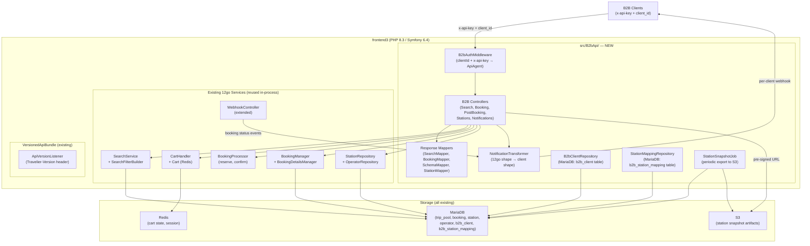
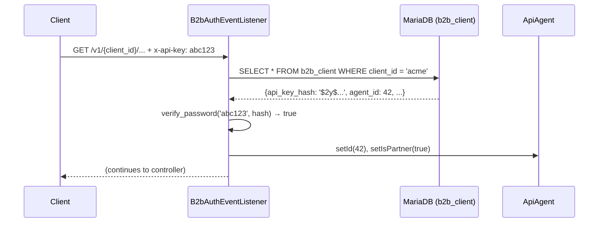
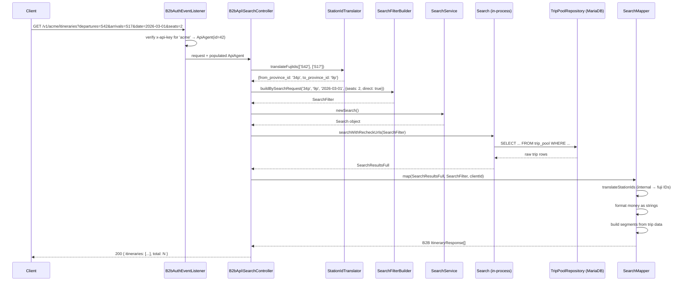

# Design A: Monolith Integration

## Executive Summary

Design A adds a new B2B API layer directly inside the 12go PHP/Symfony monolith (`frontend3`) as a self-contained `B2bApi` feature module. The 13 client-facing endpoints are implemented as new Symfony controllers that call existing 12go service classes in-process — no HTTP round-trips to 12go's internal API. The .NET services (Etna, Denali, Fuji, Supply-Integration) are decommissioned entirely once the B2B module is live. Client-facing API contracts are preserved without change: same URL paths, same headers, same money format, same response shapes. The team writes PHP/Symfony code once and it runs on the same infrastructure 12go already manages.

---

## Architecture Overview



---

## Frontend3 Internals Discovery

A full analysis is in [`current-state/integration/12go-service-layer.md`](../../../current-state/integration/12go-service-layer.md). The key finding: **every operation we currently perform via 12go HTTP API has a direct Symfony service equivalent we can call in-process.** There is no need to make self-HTTP calls except for the refund flow (which currently uses an internal secure API endpoint — see open questions).

### What We Can Reuse

| What | Class | Backs Our Endpoint |
|---|---|---|
| Trip search | `SearchService::newSearch()` + `Search::searchWithRecheckUrls()` | Search |
| Search filter building | `SearchFilterBuilder::buildBySearchRequest()` | Search |
| Add to cart | `CartHandler::handleAddTrip()` | GetItinerary |
| Cart state | `Cart::fromHash()` / `Cart::getHash()` | GetItinerary, CreateBooking |
| Checkout schema | `BookingFormManager` | GetItinerary |
| Create booking records | `BookingProcessor::createBookingsAndSetIds()` | CreateBooking |
| Reserve | `BookingProcessor::reserveBookings()` | CreateBooking |
| Confirm | `BookingProcessor::confirmBookings()` | ConfirmBooking |
| Get booking | `BookingManager::getById()` | GetBookingDetails, GetTicket |
| Booking details | `BookingDetailsManager::getBookingDetails()` | GetBookingDetails |
| Station/operator data | `StationRepository`, `OperatorRepository` | Stations, Operators |
| API partner identity | `ApiAgent` | Authentication bridge |
| Header-based versioning | `VersionedApiBundle` | Travelier-Version |

### Critical Gap: Refund

`RefundController` makes HTTP self-calls to an internal `/api/v1/secure/refund-options/{bid}` endpoint. This suggests the cancellation/refund logic lives in a separate internal layer. Until the underlying service classes are identified, CancelBooking should replicate this self-HTTP call pattern (Guzzle to `localhost`) rather than risk bypassing business logic. This is a pre-launch risk that needs 12go team input (see Open Questions).

### Critical Gap: Webhook Transformer

`WebhookController` currently accepts 12go booking change notifications and does nothing with them. The B2B design must add processing logic here (or in an event listener triggered by this controller) to transform and forward notifications to B2B client webhook URLs.

---

## Data Access Strategy

### Per Endpoint Group

| Endpoint Group | Access Method | Justification |
|---|---|---|
| **Search** | In-process via `SearchService` → `TripPoolRepository` (MariaDB) | Search is already backed by MariaDB (trip_pool table). In-process call eliminates the current double-hop: client → Etna → SI framework → 12go HTTP → MariaDB. |
| **GetItinerary** | In-process via `CartHandler` + `BookingFormManager` (MariaDB + Redis) | AddToCart creates a Redis-backed cart. GetBookingSchema reads from MariaDB. All in-process. Eliminates 3 HTTP hops. |
| **CreateBooking / ConfirmBooking** | In-process via `BookingProcessor` (MariaDB + Redis + supplier integration) | BookingProcessor already calls the supplier reservation/confirmation API. We inject it directly. |
| **SeatLock** | Local in-process, no external call | 12go's native seat lock is under development. Until available, validate seats locally via `TripManager::getDetails()` and store locked seats in Redis (keyed by cart hash). |
| **GetBookingDetails** | In-process via `BookingManager` + `BookingDetailsManager` (MariaDB) | Direct MariaDB read. Eliminates both the local PostgreSQL store and the redundant 12go HTTP call. |
| **GetTicket** | In-process via `BookingManager::getById()` (MariaDB) | `ticket_url` is a column on the booking table. One SQL query. |
| **CancelBooking** | HTTP self-call to `/api/v1/secure/refund-options/{bid}` + refund (risk — see Open Questions) | RefundController already uses this pattern. Replicate until internal refund services are identified. |
| **IncompleteResults** | In-process via `BookingManager` status polling | No DynamoDB async store needed. MariaDB booking status is the source of truth. 202 logic can be simplified or eliminated. |
| **Stations / Operators** | Hybrid: periodic in-process snapshot job + S3 artifact response | Preserve current client contract: stations endpoint returns a pre-signed S3 URL. A scheduled job reads station/operator repositories and writes locale-specific JSON snapshots to S3; request path only signs and returns latest object key. |
| **POIs** | In-process via appropriate MariaDB repository (POI table — to confirm with 12go team) | POI data likely in MariaDB. Confirm table name with 12go team. |
| **Notifications** | Event-driven: extend `WebhookController` to fire a Symfony event; `NotificationTransformer` subscribes and forwards | Cleanest approach for this monolith — no polling, no new infrastructure. |

### Coupling Level vs. Alternatives

| Endpoint | Coupling | Performance vs. HTTP | Maintenance |
|---|---|---|---|
| Search (in-process) | High — tied to 12go `SearchService` internals | ~5ms vs ~150ms | Must update when SearchService changes (but we're inside the codebase) |
| Booking (in-process) | High — tied to `BookingProcessor` internals | ~10ms vs ~200ms per step | BookingProcessor is heavily tested; changes are visible |
| Cancel (self-HTTP) | Loose — via localhost HTTP | ~50ms vs ~150ms | Isolated; refund API changes don't break B2B directly |
| Stations (snapshot pipeline) | Medium — tied to MariaDB schema + artifact contract | Request path is cheap (URL signing); generation path runs on schedule | Snapshot schema/version changes require coordinated update to generator + consumers |

---

## Directory Structure

```
frontend3/src/B2bApi/
├── Controller/
│   ├── B2bBaseController.php              # Abstract base: correlation IDs, error format, auth check
│   ├── SearchController.php               # GET /v1/{client_id}/itineraries
│   ├── ItineraryController.php            # GET /{client_id}/itineraries/{id}
│   ├── BookingController.php              # POST /bookings, POST /bookings/{id}/confirm
│   ├── SeatLockController.php             # POST /bookings/lock_seats
│   ├── PostBookingController.php          # GET /bookings/{id}, GET /ticket, POST /cancel
│   ├── IncompleteResultsController.php    # GET /incomplete_results/{id}
│   ├── MasterDataController.php           # GET /stations (S3 URL), /operating_carriers, /pois
│   └── NotificationController.php         # POST /notifications (receives 12go webhooks, not client-facing)
│
├── EventListener/
│   ├── B2bAuthEventListener.php           # kernel.request: resolves clientId + x-api-key → ApiAgent
│   ├── CorrelationIdEventListener.php     # kernel.request/response: x-correlation-id propagation
│   └── TravelierVersionEventListener.php  # kernel.controller: Travelier-Version → version resolution
│
├── Service/
│   ├── B2bAuthService.php                 # Validates clientId + x-api-key against b2b_client table
│   ├── SearchMapper.php                   # OneTwoGo search results → B2B itinerary format
│   ├── BookingSchemaMapper.php            # 12go checkout form → B2B booking schema
│   ├── BookingMapper.php                  # 12go booking → B2B booking response
│   ├── CancellationMapper.php             # 12go refund options → B2B cancel schema
│   ├── StationMapper.php                  # MariaDB stations → B2B station format
│   ├── OperatorMapper.php                 # MariaDB operators → B2B operator format
│   ├── StationSnapshotBuilder.php         # Builds locale-specific station JSON artifacts
│   ├── NotificationTransformer.php        # 12go webhook → per-client webhook format
│   ├── ClientNotificationDispatcher.php   # Sends transformed notifications to client webhook URLs
│   ├── StationIdTranslator.php            # Fuji station ID ↔ 12go internal station ID
│   ├── SeatLockService.php                # Validates and stores seat locks (Redis-backed)
│   └── MoneyFormatter.php                 # Enforces string money format ("14.60" not 14.6)
│
├── DTO/
│   ├── Request/
│   │   ├── SearchRequest.php
│   │   ├── CreateBookingRequest.php
│   │   └── CancelBookingRequest.php
│   └── Response/
│       ├── ItineraryResponse.php
│       ├── BookingResponse.php
│       ├── StationResponse.php
│       ├── OperatorResponse.php
│       └── TicketResponse.php
│
├── Repository/
│   ├── B2bClientRepository.php            # b2b_client table (clientId, apiKeyHash, webhookUrl, etc.)
│   ├── StationMappingRepository.php       # b2b_station_mapping table (fujiId ↔ internalId)
│   ├── StationSnapshotRepository.php      # Metadata for latest S3 snapshot per locale
│   └── SeatLockRepository.php             # Redis-backed seat lock store
│
└── Exception/
    ├── B2bUnauthorizedException.php
    ├── B2bClientNotFoundException.php
    └── B2bValidationException.php
```

### New MariaDB Tables

```sql
CREATE TABLE b2b_client (
    id            INT AUTO_INCREMENT PRIMARY KEY,
    client_id     VARCHAR(100) NOT NULL UNIQUE,
    api_key_hash  VARCHAR(256) NOT NULL,         -- bcrypt/SHA256 hash of x-api-key
    webhook_url   VARCHAR(512) NULL,             -- where to send booking notifications
    currency      VARCHAR(3) NOT NULL DEFAULT 'USD',
    markup_pct    DECIMAL(5,2) NOT NULL DEFAULT 0.00,
    is_active     TINYINT(1) NOT NULL DEFAULT 1,
    created_at    DATETIME NOT NULL,
    updated_at    DATETIME NOT NULL
);

CREATE TABLE b2b_station_mapping (
    id              INT AUTO_INCREMENT PRIMARY KEY,
    fuji_station_id VARCHAR(100) NOT NULL,        -- the ID clients have embedded in their systems
    internal_station_id INT NOT NULL,             -- 12go MariaDB station.id
    province_id     INT NOT NULL,                 -- 12go MariaDB province.id (for search)
    created_at      DATETIME NOT NULL,
    UNIQUE KEY uk_fuji_id (fuji_station_id),
    KEY idx_internal_id (internal_station_id)
);
```

---

## API Layer Design

### Route Configuration

B2B routes are registered in a new `config/routes/b2b.yaml`:

```yaml
b2b_api:
  resource: '../src/B2bApi/Controller/'
  type: attribute
  prefix: ''
```

The URL structure preserves existing paths exactly:

| B2B Endpoint | Route |
|---|---|
| Search | `GET /v1/{client_id}/itineraries` |
| GetItinerary | `GET /v1/{client_id}/itineraries/{id}` |
| CreateBooking | `POST /v1/{client_id}/bookings` |
| ConfirmBooking | `POST /v1/{client_id}/bookings/{id}/confirm` |
| SeatLock | `POST /v1/{client_id}/bookings/lock_seats` |
| GetBookingDetails | `GET /v1/{client_id}/bookings/{id}` |
| GetTicket | `GET /v1/{client_id}/bookings/{id}/ticket` |
| CancelBooking | `POST /v1/{client_id}/bookings/{id}/cancel` |
| IncompleteResults | `GET /v1/{client_id}/incomplete_results/{id}` |
| Stations | `GET /v1/{client_id}/stations` |
| Operators | `GET /v1/{client_id}/operating_carriers` |
| POIs | `GET /v1/{client_id}/pois` |
| 12go webhook receiver | `POST /v1/notifications/booking` (internal use, not client-facing) |

### Middleware Stack

Three event listeners run on every B2B request:

1. **`B2bAuthEventListener`** (`kernel.request`, priority 20): Reads `{client_id}` from route + `x-api-key` header. Calls `B2bAuthService::authenticate()` → verifies hash against `b2b_client` table → populates `ApiAgent` service with client data. Returns 401 if missing or invalid.

2. **`CorrelationIdEventListener`** (`kernel.request` / `kernel.response`): Reads `x-correlation-id` from request; generates one if absent. Stores in request attributes. Writes `x-correlation-id` back to response. Sets up Monolog context for all downstream log entries.

3. **`TravelierVersionEventListener`** (`kernel.controller`, priority 8): Reads `Travelier-Version` header (YYYY-MM-DD format). Translates to nearest matching controller method version. Falls back to default if header absent. Integrates with existing `VersionedApiBundle` infrastructure.

### Per-Client Configuration

Each B2B client record in `b2b_client` stores:
- `client_id` — URL path parameter
- `api_key_hash` — BCrypt hash of `x-api-key` header value
- `webhook_url` — URL to call when booking status changes
- `currency` — client's billing currency
- `markup_pct` — price markup percentage (may be replaced by 12go pricing rules)
- `is_active` — feature flag for individual client enable/disable (supports gradual rollout)

The `is_active` flag powers the per-client feature flag rollout described in [`design/migration-strategy.md`](../../migration-strategy.md) (Gateway Routing Option 2). The B2B module can be deployed and remain dark for all clients until this flag is set.

---

## Booking Schema Handling

### The Problem

The 12go checkout schema (equivalent to our `GetBookingSchema` call) returns a dynamic form with 20+ field name patterns (seat selections, baggage, pickup/dropoff points, delivery fields). The existing .NET code has `OneTwoGoBookingSchemaResponse` with `[JsonExtensionData]` to capture these patterns. In PHP/frontend3, `BookingFormManager` handles this natively.

### Solution: Use `BookingFormManager` Directly

`BookingFormManager` (in `src/Booking/Manager/`) already manages the form definition logic. B2B GetItinerary calls it to build the checkout schema, then `BookingSchemaMapper` translates the internal `FormField` objects into the B2B `PreBookingSchema` format our clients expect.

```
B2B GetItinerary Request
  → CartHandler::handleAddTrip($tripKey, $datetime, ...)  → cart hash
  → TripManager::getDetails(...)                          → trip details
  → BookingFormManager::getBookingForm($cartHash)         → form fields
  → BookingSchemaMapper::map($formFields)                 → B2B PreBookingSchema
  → return {booking_token: cartHash, schema: PreBookingSchema}
```

The `booking_token` returned to clients is the 12go cart hash (8-char Redis key). When the client submits `CreateBooking`, the token is decoded to retrieve the cart and form context.

### Passenger Data Mapping

On CreateBooking, the client sends passenger data in B2B format (first_name, last_name, id_no, etc.). `BookingSchemaMapper` reverse-maps this into the flat key-value format `BookingFormManager` expects:

```
client passenger data
  → BookingSchemaMapper::buildFormData($passengers, $schema)
  → {
      "contact[mobile]": "+66812345678",
      "contact[email]": "traveler@example.com",
      "passenger[0][first_name]": "John",
      "passenger[0][last_name]": "Doe",
      ...
    }
  → BookingFormManager::handleForm($formData, $cartHash)
  → BookingFormHandlingResult  (used by BookingProcessor)
```

This mapper is the most complex piece of the B2B layer and represents the highest testing priority (parallel to the .NET `ReserveDataRequest` converter tests).

---

## Authentication Bridge

### The Mapping Problem

Our clients authenticate with `{client_id}` in the URL path + `x-api-key` header. 12go internally uses `ApiAgent` (database-backed agent record). There is no existing mapping.

### Solution: New `b2b_client` Table + `ApiAgent` Reuse

1. **`b2b_client` table** stores the mapping: `client_id` → hashed API key + per-client config.
2. **`B2bAuthService`** validates the incoming request against this table.
3. **`ApiAgent` service** (already used for API partners in frontend3) is populated with the B2B client's agent ID. This means booking operations automatically associate with the correct partner account.



### Populating the Table

For Migration Option A (Transparent Switch): a one-time migration script reads existing client credentials from AWS AppConfig (`DenaliSecrets`, gateway keys) and inserts into `b2b_client`. Every active `clientId` must have a row before cutover.

For Migration Option B (New Endpoints): clients receive new credentials (or continue using existing ones). New `b2b_client` rows are inserted per client as they onboard.

### Key Management

API keys are stored as BCrypt hashes. The raw key is never stored. Key rotation is handled by updating the `api_key_hash` column. A migration script must hash the existing keys during initial population.

---

## Station ID Mapping Approach

### The Problem

Clients have Fuji station IDs embedded in their systems (from `GET /v1/{client_id}/stations`). 12go search uses province IDs (`{id}p` format) or internal station IDs. These are different namespaces with no automatic correspondence.

This is identified in AGENTS.md as "the hardest problem" and is out of scope for the transition itself — but the monolith design must accommodate it.

### Solution: `b2b_station_mapping` Table + `StationIdTranslator` Service

A mapping table bridges the two ID spaces:

| Column | Description |
|---|---|
| `fuji_station_id` | The ID clients currently use (from their system, sourced from Fuji) |
| `internal_station_id` | 12go MariaDB `station.id` |
| `province_id` | 12go `province.id` — used for search queries |

**`StationIdTranslator`** translates:
- Inbound: `fuji_station_id` → `province_id` (for Search), `internal_station_id` (for other endpoints)
- Outbound: `internal_station_id` → `fuji_station_id` (for station responses, so clients get their familiar IDs back)

**Populating the table**: The Fuji entity-mapping DynamoDB tables (Station table with `CMSId` mapping) contain the correspondence between Fuji IDs and 12go CMS IDs. A one-time migration script reads these and inserts into `b2b_station_mapping`. This must be completed before any B2B endpoint goes live.

**In Stations response**: The `MasterDataController` does not stream stations inline. It returns a pre-signed S3 URL to the latest locale snapshot artifact. Snapshot generation runs in a periodic background job (`StationSnapshotJob`) that reads MariaDB via `StationRepository`, maps internal IDs to Fuji IDs via `StationIdTranslator`, and writes structured JSON to S3.

**In Operators response**: can remain inline or move to the same snapshot pattern. To preserve parity with current behavior and reduce payload cost, the same snapshot-to-S3 artifact pattern is recommended.

**Impact per endpoint**:

| Endpoint | Translation Needed |
|---|---|
| Search | Inbound: `departures[]` + `arrivals[]` → `province_id` for `SearchFilterBuilder` |
| GetItinerary | Inbound: itinerary ID contains `tripKey` + datetime; no station translation needed |
| CreateBooking | Passenger data has no station IDs; no translation needed |
| GetBookingDetails | Outbound: `from_station` + `to_station` → fuji station IDs |
| Stations snapshot generation | Outbound: `station.id` → fuji station ID before writing JSON artifact to S3 |

---

## Notification Transformer

### Current State

12go sends booking status change webhooks to `POST /webhook` in frontend3. The current handler validates the payload shape and returns 200 with no further processing. The B2B notification transformer is completely absent.

### Design

**Step 1: Extend `WebhookController`**

The existing `WebhookController::webhookAction()` is extended to dispatch a Symfony event:

```php
// Extend (or decorate) WebhookController
public function webhookAction(Request $request): Response
{
    // existing validation...
    $this->eventDispatcher->dispatch(new BookingStatusChangedEvent(
        $parametersAsArray['bid'],
        $parametersAsArray['type'],
        $parametersAsArray['previous_data'],
        $parametersAsArray['new_data'],
    ));
    return $this->response; // 200 OK
}
```

**Step 2: `NotificationTransformer` Event Subscriber**

`NotificationTransformer` subscribes to `BookingStatusChangedEvent`. It:
1. Looks up the booking in `BookingManager` to get the `client_id`
2. Looks up the client's webhook URL in `B2bClientRepository`
3. Translates the 12go webhook payload into the client-expected shape (status mapping, ID format, money format)
4. Calls `ClientNotificationDispatcher::dispatch()` which makes an async HTTP POST to the client's URL

**Step 3: Payload Transformation**

12go webhook shape:
```json
{
  "bid": 12345,
  "stamp": 1708700000,
  "type": "booking_confirmed",
  "previous_data": { "status": "reserved" },
  "new_data": { "status": "confirmed", "tracker": "ABC123" }
}
```

Client-expected shape (preserved from current Denali format):
```json
{
  "booking_id": "enc_12345",
  "status": "confirmed",
  "ticket_url": "https://...",
  "updated_at": "2026-02-23T10:00:00Z"
}
```

`NotificationTransformer` handles: status name mapping, booking ID encoding, ticket URL resolution, timestamp formatting, money string format.

**Step 4: Delivery Reliability**

An outgoing webhook delivery failure (client webhook URL returns 4xx/5xx) is logged to Datadog and retried up to 3 times with exponential backoff using a Symfony Messenger async message. The `b2b_notification_log` table records each delivery attempt.

**Per-Client Webhook URL Management**

Each client's webhook URL is stored in `b2b_client.webhook_url`. URLs are updated via a 12go admin interface or directly in the database. If a client has no webhook URL, notifications are silently dropped (logged).

---

## Cross-Cutting Concerns

### Versioning Headers (`Travelier-Version`)

**Problem**: Clients send `Travelier-Version: YYYY-MM-DD` (date-based). The existing `VersionedApiBundle` uses `X-Api-Version: semver`.

**Solution**: `TravelierVersionEventListener` pre-processes the request before `ApiVersionListener`:

1. Reads `Travelier-Version: 2024-01-15` from request
2. Translates to a semver equivalent (e.g., `2024-01-15` → `2024.1.15`) or uses a lookup table mapping dates to API behavior versions
3. Sets `X-Api-Version` header on the request object
4. `VersionedApiBundle` processes it normally

Controller methods are annotated to deliver version-specific behavior:

```php
#[DefaultApiVersion('2023.1.1')]
class SearchController extends B2bBaseController
{
    #[ApiVersion('2023.1.1')]
    public function searchAction(...): Response { /* legacy format */ }

    #[ApiVersion('2024.1.15')]
    public function searchAction_v20240115(...): Response { /* new format */ }
}
```

### Money Format (Strings)

All monetary amounts are output as strings via `MoneyFormatter::format(float $amount, string $currency): string`. This enforces `"14.60"` not `14.6`. The formatter is injected into all response mappers and called on every price field.

```php
// MoneyFormatter
public function format(float $amount, string $currency): string
{
    return number_format($amount, 2, '.', '');
}
```

The `taxes_and_fees` field (client-expected: sum of `sysfee` + `agfee`) is calculated in `BookingMapper` from 12go's `netprice`, `sysfee`, `agfee` fields.

### Correlation IDs

`CorrelationIdEventListener` propagates `x-correlation-id` through the entire request:
- Inbound: reads from request header (or generates a UUID4 if absent)
- Stored in request attributes and Monolog context (`['correlation_id' => '...']`)
- Outbound: written to response headers
- Downstream: passed via Monolog to all Datadog log entries for this request

This enables end-to-end request tracing across B2B client logs and frontend3 Datadog dashboards.

### Error Handling

B2B controllers return errors in the same format our .NET services currently return:

```json
{
  "code": "trip_unavailable",
  "message": "The selected trip is no longer available.",
  "correlation_id": "abc-123"
}
```

HTTP status code mapping:
- 400 Bad Request: validation errors
- 401 Unauthorized: missing or invalid API key
- 404 Not Found: booking/itinerary not found
- 409 Conflict: booking already confirmed, duplicate booking
- 422 Unprocessable Entity: business logic failure (no seats, trip unavailable)
- 500 Internal Server Error: unexpected exception

`B2bBaseController` wraps all actions in a try/catch that converts `BookingException` subclasses and `B2bException` subclasses to the appropriate HTTP response.

### Datadog Integration

Frontend3 already uses Datadog via `DataDogStatsD` (custom metrics) and Monolog Datadog handler. The B2B module:
- Adds `b2b.{endpoint}.response_time` metric (histogram) per endpoint
- Adds `b2b.{endpoint}.error` counter with `error_type` tag
- Tags all logs with `client_id` from request context
- Uses existing `ApmLogger` for APM tracing

---

## Request Flow Diagrams

### Search Flow



### Booking Funnel Flow

```mermaid
sequenceDiagram
    participant Client
    participant IC as B2bApi\ItineraryController
    participant BC as B2bApi\BookingController
    participant CH as CartHandler
    participant Cart as Cart (Redis)
    participant BFM as BookingFormManager
    participant BSM as BookingSchemaMapper
    participant BP as BookingProcessor
    participant BM as BookingManager (MariaDB)

    Note over Client,BM: GetItinerary
    Client->>IC: GET /v1/acme/itineraries/TRIP_KEY_20260301
    IC->>CH: handleAddTrip(tripKey, datetime, seatCode)
    CH->>Cart: add CartItemTrip → store in Redis
    Cart-->>CH: cartHash='a1b2c3d4'
    IC->>BFM: getBookingForm(cartHash)
    BFM-->>IC: FormField[] (checkout schema)
    IC->>BSM: mapSchemaToB2b(FormField[])
    BSM-->>IC: PreBookingSchema
    IC-->>Client: { booking_token: 'a1b2c3d4', schema: PreBookingSchema }

    Note over Client,BM: CreateBooking
    Client->>BC: POST /v1/acme/bookings { booking_token: 'a1b2c3d4', passengers: [...] }
    BC->>BSM: buildFormData(passengers, booking_token)
    BSM-->>BC: BookingFormHandlingResult[]
    BC->>BP: createBookingsAndSetIds(results, systemUser)
    BP->>BM: createAndSetId(booking) → bid=98765
    BM-->>BP: BookingCreated[bid=98765]
    BC->>BP: reserveBookings([bid=98765])
    BP->>BP: BookingReservationManager::reserve(98765)
    Note right of BP: calls supplier API via existing ReservationHandler
    BP-->>BC: ReservationResult {result: true}
    BC->>BM: getById(98765)
    BM-->>BC: Booking{bid, status, price, tracker}
    BC-->>Client: 201 { booking_id: 'enc_98765', status: 'reserved', ... }

    Note over Client,BM: ConfirmBooking
    Client->>BC: POST /v1/acme/bookings/enc_98765/confirm
    BC->>BP: confirmBooking(booking)
    BP->>BP: BookingConfirmationManager::performConfirmation(booking)
    Note right of BP: calls supplier confirm API; acquires Redis lock
    BP-->>BC: ConfirmationStatus{success: true}
    BC->>BM: getById(98765)
    BM-->>BC: Booking{status: confirmed, ticket_url, tracker}
    BC-->>Client: 200 { booking_id: 'enc_98765', status: 'confirmed', ticket_url: '...', ... }
```

---

## Migration Path

This design supports all three migration options from [`design/migration-strategy.md`](../../migration-strategy.md). **It makes Option A (Transparent Switch) the easiest**, because:
- Same URL paths — no client changes needed
- Per-client `is_active` flag in `b2b_client` enables the feature-flag proxy pattern (Option 2 in Gateway Routing)
- Once a client's flag is set, requests to the existing gateway URL automatically go to the new B2B module

### Recommended Phased Rollout

**Phase 0: Infrastructure Setup** (2–3 weeks)
- Create `b2b_client` and `b2b_station_mapping` tables in 12go MariaDB
- Implement `B2bAuthService` and `B2bAuthEventListener`
- Implement `StationIdTranslator` with initial station mapping data (migrated from Fuji DynamoDB)
- Set up Datadog B2B metrics and dashboard

**Phase 1: Read-Only Endpoints** (2–3 weeks)
- Implement Stations/Operators snapshot pipeline (periodic artifact generation + S3 pre-signed URL response)
- Implement POIs endpoint
- Implement Search endpoint with full response mapping
- Deploy with all clients `is_active = false` — no traffic yet

**Phase 2: Shadow Traffic Validation** (2–3 weeks)
- Route search shadow traffic from Etna to the new B2B Search endpoint (async, fire-and-forget)
- Diff responses nightly. Target: 100% contract match before proceeding.
- This works per [`migration-strategy.md` shadow traffic notes](../../migration-strategy.md#shadow-traffic-search-only)

**Phase 3: Booking Funnel** (3–4 weeks)
- Implement GetItinerary, CreateBooking, ConfirmBooking, SeatLock, GetBookingDetails, GetTicket
- Implement CancelBooking (depends on refund service resolution — see Open Questions)
- Full booking funnel integration test against 12go staging environment

**Phase 4: Notification Transformer** (2 weeks)
- Implement `NotificationTransformer` and `ClientNotificationDispatcher`
- Extend `WebhookController` to dispatch events
- End-to-end test: trigger a booking status change in staging, verify client receives correct notification

**Phase 5: Canary Cutover** (1–4 weeks)
- Set `is_active = true` for the lowest-traffic B2B client
- Monitor for 3–5 days on search, then enable booking funnel
- Roll out to remaining clients one by one

**Phase 6: Decommission .NET** (2–3 weeks)
- Once all clients active on new system, decommission Etna, Denali, Fuji, Supply-Integration
- Remove old AWS infrastructure, cancel licenses/capacity

### Total Estimated Duration

12–18 weeks end-to-end (conservative; includes buffer for Symfony learning curve and refund flow resolution).

---

## Pros and Cons

### Pros

1. **Zero client impact** — URL paths, headers, request/response formats identical. Clients notice nothing.
2. **No new infrastructure** — runs on 12go's existing EC2 fleet, MariaDB, Redis, Datadog. No new services to deploy or monitor.
3. **In-process calls** — eliminates all HTTP hops between our .NET services and 12go. Search latency drops from ~500ms to ~50ms. Booking steps drop from ~2s total (5 HTTP calls) to ~200ms.
4. **Single codebase** — one place to debug, one deployment pipeline, one monitoring dashboard.
5. **No DynamoDB/PostgreSQL** — all state lives in 12go's MariaDB. No cache invalidation, no cache coherence bugs, no cross-service consistency issues.
6. **AI-augmented PHP is viable** — team doesn't need to become PHP experts; Claude/Cursor can generate correct Symfony code and tests.
7. **Versioning infrastructure already exists** — `VersionedApiBundle` handles `Travelier-Version` with minor configuration.
8. **Booking reliability improves** — `BookingProcessor`'s duplicate detection, lock-based confirmation, and seller fallback are already production-proven.

### Cons

1. **PHP codebase** — team preference is .NET; ramp-up time and unfamiliar patterns (Symfony DI, attribute routing, repository pattern without Doctrine ORM).
2. **Deep coupling to 12go internals** — `BookingProcessor` has ~25 dependencies; `SearchService` has ~20. Changes to these classes break the B2B layer. Requires ongoing coordination with the 12go PHP team.
3. **Booking without payment flow** — `BookingProcessController` tightly couples reservation to payment. B2B clients don't pay per-booking (credit line). Must verify that `ApiAgent::isPartner()` correctly bypasses payment, or implement an explicit bypass path.
4. **Refund flow risk** — `RefundController` uses HTTP self-calls to a "secure" internal API. The underlying service classes are not yet identified. If that secure API has complex business logic, replicating it is risky.
5. **Cart hash as BookingToken** — the 8-char Redis cart hash is the `booking_token` we return to clients. If Redis evicts the cart before the client calls CreateBooking, the token is invalid. Cart TTL must be extended to match our previous DynamoDB PreBookingCache TTL (5 days).
6. **`WebhookController` currently does nothing** — the gap between "webhook received" and "client notified" is entirely new code. It's a new data pathway with no existing tests or runbook.
7. **Station ID mapping migration** — must complete before any endpoint goes live. Requires reading Fuji DynamoDB tables and populating `b2b_station_mapping`. Data quality risk.
8. **MonolSource of truth conflict** — 12go's MariaDB becomes the authoritative store for B2B bookings. Any future need to query B2B bookings independently (for analytics, client support) requires a MariaDB query against a shared table — with appropriate access controls.

---

## Open Questions

### Blocking (Must Resolve Before Implementation)

1. **Refund/Cancellation internal service**: What does `/api/v1/secure/refund-options/{bid}` do? Can we access the underlying PHP service class directly, or must we continue using the HTTP self-call pattern? If the latter, what are the performance implications for the cancel flow? *Owner: 12go PHP team.*

2. **B2B booking without payment**: Does `ApiAgent::isPartner() = true` bypass the payment step in `BookingProcessController`? If not, what is the correct way to create a booking that goes directly to reservation without Paygate? *Owner: 12go PHP team.*

3. **Cart TTL in Redis**: What is the current TTL for cart entries? Our PreBookingCache TTL was 5 days (7200 minutes). Is Redis configured to support this, or will cart hashes expire sooner? *Owner: 12go DevOps/PHP team.*

4. **Station mapping completeness**: Are all Fuji station IDs from the entity-mapping DynamoDB tables mappable to `station.id` in 12go MariaDB? What is the overlap percentage? *Owner: Fuji/Denali team + 12go DB team.*

5. **`WebhookController` downstream processing**: Is the existing `POST /webhook` endpoint truly a no-op, or does a downstream Kafka consumer, cron job, or database trigger process the payload? *Owner: 12go PHP team.*

### Important (Design Decisions)

6. **`Travelier-Version` header mapping**: What date ranges correspond to which API behavior changes? A mapping from `Travelier-Version` dates to semver versions for `VersionedApiBundle` must be defined before implementing the versioning event listener. *Owner: Our team.*

7. **Money/markup source of truth**: Markup percentages (our gross vs. net price) are currently computed in Denali's `MarkupService`. In the monolith design, should markup live in `b2b_client.markup_pct` (simple percentage), in 12go's pricing rules, or be removed entirely (clients use 12go net prices)? *Owner: Business/management.*

8. **Client notification authentication**: Our B2B webhooks to clients are currently unauthenticated (same gap as 12go's inbound webhooks). Should we add HMAC signing per the `Distribusion`/`Bookaway` pattern when forwarding to clients? *Owner: Our team + Customer Success.*

9. **Booking ID encoding**: Our current booking IDs use Caesar cipher encoding. Should B2B booking IDs use the same encoding (for backward compatibility with existing client integrations), or switch to plain 12go `bid` integers? *Owner: Our team.*

10. **POI data availability**: Does 12go MariaDB have a POI table equivalent to what Fuji exposes? What is its schema? If not, this endpoint needs a different strategy. *Owner: 12go DB team.*

11. **`IncompleteResults` endpoint**: The async polling endpoint was used when confirmation took > 30 seconds. In the monolith design, `BookingProcessor::confirmBooking()` acquires a lock and waits synchronously. Is a 206 Partial Content / polling response still needed, or can ConfirmBooking always return synchronously? *Owner: Our team + QA.*

### Lower Priority

12. **Deploy process for MariaDB migrations**: How are schema changes deployed to 12go's MariaDB? What is the review/approval process for adding `b2b_client` and `b2b_station_mapping` tables? *Owner: DevOps.*

13. **Shared MariaDB access controls**: B2B code will query `booking`, `station`, `operator` tables. Are there row-level security constraints or access control requirements when adding new query patterns? *Owner: 12go DB team.*
