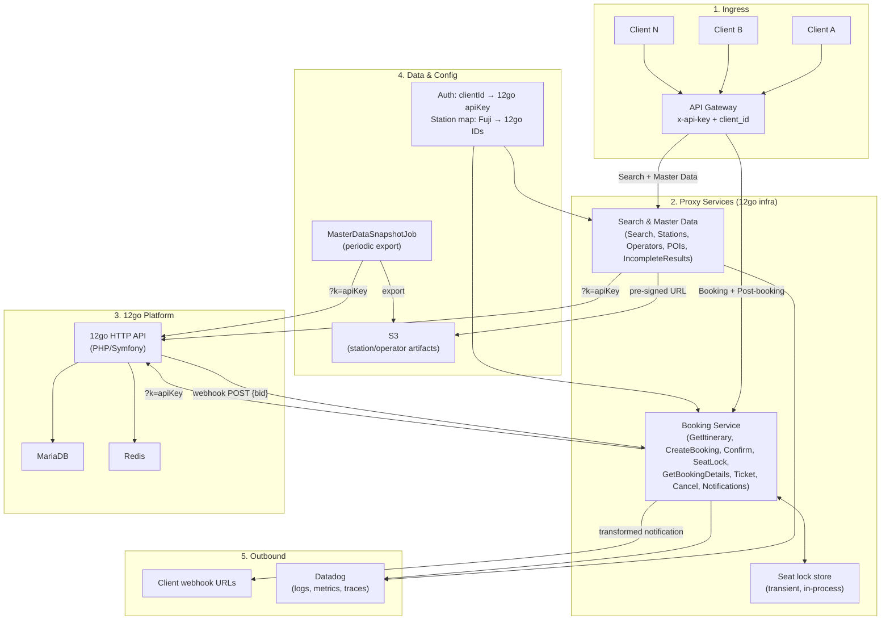
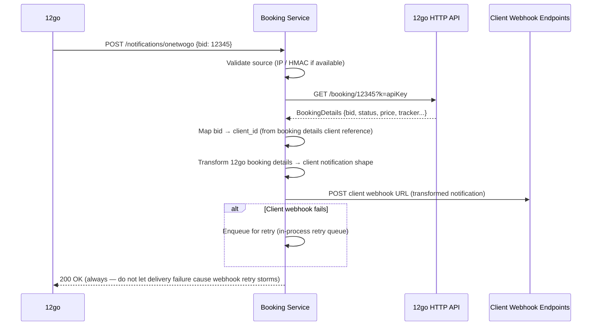
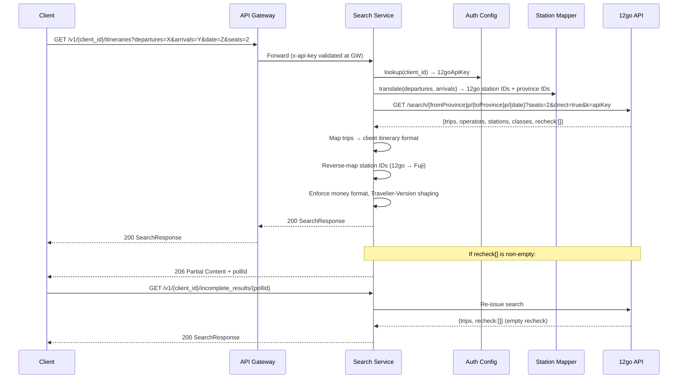

# Design B: Separate Microservice(s)

## Executive Summary

Design B replaces the four .NET repositories with one or two independent services deployed alongside 12go's infrastructure. These services preserve all 13 B2B client-facing API contracts by acting as a stateless HTTP proxy layer between clients and 12go's API — receiving client requests, translating them into 12go calls, and transforming the responses back to the expected contract shape. The recommended topology is **two services**: a stateless Search & Master Data service and a Booking service that holds only the minimal transient state required for seat lock. All DynamoDB caches, the PostgreSQL booking store, the SI framework abstraction, and all Kafka events except client-facing notifications are eliminated. The design is language-agnostic; a separate implementation wave will choose a concrete language for each service.

---

## Architecture Overview

The diagram below shows the main components and data flows. See the [Endpoint Distribution](#endpoint-distribution) table for the full list of endpoints per service.



---

## Assumption Risks (Post-Meeting 2026-02-25)

The following assumptions were challenged or corrected during the architecture decision meeting. Design B depends on them; mitigation notes are included.

| Assumption | Status | Mitigation |
|------------|--------|------------|
| **12go HTTP API stability** | **Uncertain** | Previously assumed stable. F3 restructuring may change the API surface. Mitigant: 12go has existing B2B API versioning (`VersionedApiBundle`); internal consumers (BFF) also depend on these APIs, so changes would likely be versioned. |
| **S3 station artifacts** | **Low risk** | May change with F3 restructuring. Artifact format is our own; we control the snapshot job. |
| **No F3 code ownership needed** | **Challenged** | Even with a microservice, the team will eventually need to work in F3 (e.g., when 12go changes require coordination). The microservice reduces but does not eliminate F3 familiarity requirements. |
| **12go API and S3 as solid building blocks** | **Uncertain** | Meeting revealed the "one system" vision — no permanent separation between 12go core and B2B. The whole system is being rethought. Design B's value proposition (loose coupling via HTTP) holds only if the HTTP API remains a stable boundary. |

---

## Service Topology Decision

### Comparison of Options

#### Option 1: Single Service

All 13 endpoints in one deployable unit.

**Pros:**
- Single deployment, single CI/CD pipeline, single set of runbooks
- Seat lock state and booking state are in the same process — no cross-service calls
- Simplest observability: one Datadog service, one health check URL
- Smallest operational surface for a team of 3–4 developers

**Cons:**
- Search (high-volume, read-only, latency-sensitive) shares resources with booking (lower-volume, transactional, stateful)
- A deployment-breaking bug in booking code blocks search deployments and vice versa
- Search and booking have fundamentally different failure modes (search failures are recoverable; booking failures have financial consequences)
- Horizontal scaling must accommodate both workloads simultaneously

#### Option 2: Two Services (Recommended)

Search & Master Data service + Booking service (booking funnel + post-booking + notifications).

**Pros:**
- Search can be deployed, scaled, and rolled back independently of booking
- Booking failures don't affect search availability (different failure domain)
- Seat lock state is entirely within the booking service — no cross-service dependency
- Notification webhook lives in the same service as booking data, simplifying delivery logic
- Search is inherently stateless; booking has controlled transient state — clean separation
- Still only two services: manageable for a small team

**Cons:**
- Two CI/CD pipelines, two sets of health checks, two deployments to coordinate
- The `/incomplete_results/{id}` endpoint straddles the line — classified with Search (returns async search results) but initiated by booking flow; allocating it to Search requires no shared state

#### Option 3: Three or More Services

Search + Booking + Post-Booking + Notifications + Master Data as independent services.

**Pros:**
- Maximum independent scaling per workload

**Cons:**
- 5 services for a team of 3–4 developers is disproportionate overhead
- Master data and notifications are tiny services; making them independent creates operational noise without scaling benefit
- Cross-service communication (e.g., notification service needs booking context) adds latency and failure modes
- Each service needs its own auth mapping config, health checks, Datadog configuration, and runbooks

### Recommendation: Two Services

**Search & Master Data Service** handles all read-only, stateless endpoints:
- Search, Stations, Operators, POIs, IncompleteResults

**Booking Service** handles all transactional endpoints plus the notification webhook:
- GetItinerary, CreateBooking, ConfirmBooking, SeatLock, GetBookingDetails, GetTicket, CancelBooking, BookingNotifications

**Rationale for this split:**
1. Search generates the vast majority of traffic. Being able to scale and deploy it independently without risking the booking funnel is the primary driver.
2. Master data (Stations, Operators, POIs) is logically co-located with search — clients call these before searching. They share the same auth configuration and snapshot-generation concerns.
3. All notification handling belongs in the booking service because it needs to resolve which client to notify and what booking context to include in the transformed payload — data that is co-located with booking state.
4. Two services is the smallest split that achieves independent deployment of the high-volume read path. A single service would force coordinated deployments of search and booking changes.

---

## Endpoint Distribution

| Endpoint | Method | Path | Service | Notes |
|---|---|---|---|---|
| **Search** | GET | `/v1/{client_id}/itineraries` | Search & Master Data | Single 12go call |
| **Stations** | GET | `/v1/{client_id}/stations` | Search & Master Data | Returns pre-signed S3 URL to latest snapshot JSON artifact |
| **Operators** | GET | `/v1/{client_id}/operating_carriers` | Search & Master Data | Prefer same snapshot artifact pattern for contract parity and payload efficiency |
| **POIs** | GET | `/v1/{client_id}/pois` | Search & Master Data | Proxies 12go MariaDB via HTTP |
| **IncompleteResults** | GET | `/v1/{client_id}/incomplete_results/{id}` | Search & Master Data | Returns 206 for pending |
| **GetItinerary** | GET | `/{client_id}/itineraries/{id}` | Booking | 3 sequential 12go calls |
| **CreateBooking** | POST | `/{client_id}/bookings` | Booking | Reserve + GetBookingDetails |
| **ConfirmBooking** | POST | `/{client_id}/bookings/{id}/confirm` | Booking | Confirm + GetBookingDetails |
| **SeatLock** | POST | `/{client_id}/bookings/lock_seats` | Booking | Transient in-process state |
| **GetBookingDetails** | GET | `/{client_id}/bookings/{id}` | Booking | Proxies 12go `/booking/{id}` |
| **GetTicket** | GET | `/{client_id}/bookings/{id}/ticket` | Booking | Extracts ticket_url from 12go |
| **CancelBooking** | POST | `/{client_id}/bookings/{id}/cancel` | Booking | RefundOptions + Refund |
| **BookingNotifications** | POST | `/v1/notifications/onetwogo/...` | Booking | Webhook from 12go |

---

## Stateless Proxy Pattern

### Fundamental Flow

Every endpoint follows the same pattern:

```
Client request
  → Authenticate (resolve 12go apiKey for clientId)
  → Translate station IDs (Fuji → 12go) in request parameters
  → Call 12go API (one or more sequential calls)
  → Map 12go response to client contract
  → Enforce contract conventions (money as strings, Travelier-Version, correlation IDs)
  → Return response to client
```

No local database is written to or read from during this flow. 12go is the system of record for all booking and search data.

The exception is master-data artifacts: stations/operators are materialized periodically into S3 snapshots so the endpoint can preserve the existing contract (returning a pre-signed URL instead of inline payload).

### State Decisions

#### Eliminated State

| Former Store | Replacement |
|---|---|
| DynamoDB ItineraryCache | Re-fetch trip details from 12go on each GetItinerary call |
| DynamoDB PreBookingCache | Re-fetch booking schema from 12go at CreateBooking time |
| DynamoDB BookingCache | 12go MySQL is authoritative; use `/booking/{id}` to fetch status |
| PostgreSQL BookingEntities | Proxy to 12go `/booking/{id}` for GetBookingDetails |
| DynamoDB IncompleteResults | See IncompleteResults design below |
| HybridCache / MemoryCache | No caching layer needed; 12go has Redis internally |

**Justification for full elimination:**
- All data in these stores was originally sourced from 12go and synchronized back on each operation
- 12go's MySQL is the authoritative record; there is no divergence to reconcile
- The 5-day DynamoDB TTL means the caches were not the source of truth — 12go was
- Eliminating caches removes GZip compression/decompression, cache invalidation bugs, and cross-service DynamoDB coupling

#### Retained State: Seat Lock (Transient, In-Process)

Seat lock is the only state that cannot be eliminated at this time because 12go has not yet implemented native seat lock. The booking service maintains an in-process store (a concurrent dictionary or equivalent) keyed by booking token, holding locked seat IDs with a TTL.

**Characteristics:**
- Scope: single booking service instance
- Lifetime: from `POST /lock_seats` to `POST /bookings` (or expiry after ~30 minutes)
- Loss on restart: acceptable — a pod restart during a user's booking session is a rare edge case; the client can re-enter seat selection
- No persistence required: if the deployment dies, the in-flight booking session is lost; this is the same behavior as the current system under a pod restart
- When 12go ships native seat lock: replace the in-process store with a 12go API call; the client contract does not change

**Multi-instance consideration:** If the booking service is scaled horizontally, seat lock state is not shared across instances. Two options:
1. Sticky sessions at the load balancer level (routes a given client's requests to the same instance during a funnel session)
2. Accept that seat locks are not cross-instance — a second instance will not know about seats locked on another instance, but 12go's own availability check at reserve time provides a safety net

The simpler option (sticky sessions or single instance) is recommended initially. When 12go ships native seat lock, this concern disappears.

#### IncompleteResults Pattern

The current `IncompleteResults` store supports async booking operations (confirm/cancel that take longer than the HTTP timeout). In the new design:

- For **Search**: IncompleteResults is used for the 206 Partial Content pattern when 12go returns partial search results. The booking service stores the pending search result ID in-process (same as seat lock: transient, per-instance). If the search service returns partial results, it stores a reference keyed by a generated ID and returns 206. The client polls `GET /incomplete_results/{id}`. This is in-process only with a short TTL (15 minutes).
- For **Booking confirm/cancel**: If 12go responds synchronously (which it does for confirm and refund), there is no async flow. If 12go introduces async responses in the future, this can be revisited.

---

## 12go HTTP Client Design

### Structure

Each service contains a single 12go HTTP client component responsible for all outbound calls to 12go. This component is not a framework — it is a thin, direct HTTP client with explicit retry, timeout, and error mapping logic.

### API Key Injection

The 12go apiKey is resolved from the auth mapping store (see Authentication Bridge) and appended as a query parameter `?k=<apiKey>` to every outbound request. This injection happens in the HTTP client at the point of request construction, not in individual endpoint handlers.

### Retry Strategy

Retries apply only to idempotent, side-effect-free requests:

| Request Type | Retry? | Strategy |
|---|---|---|
| GET (search, trip details, booking details, refund options) | Yes | Exponential backoff: 1s, 2s, 4s. Max 3 attempts. |
| POST /cart (add to cart) | Yes | Idempotent in practice — creates a new cart each time, no cumulative side effect |
| POST /reserve | **No** | Non-idempotent — retry could create duplicate reservations |
| POST /confirm | **No** | Non-idempotent — retry could double-confirm |
| POST /refund | **No** | Non-idempotent — retry could double-refund |

**Jitter:** Add random jitter (±20% of backoff interval) to prevent thundering herd on 12go during outages.

**Circuit breaker:** After 5 consecutive failures on any endpoint within a 60-second window, open the circuit for 30 seconds. Return 503 to the client immediately while the circuit is open rather than queueing requests that will time out.

### Timeout Handling

| Endpoint | Timeout |
|---|---|
| Search | 10 seconds (12go search is DB-backed; rechecks can take up to 60s — use async/polling pattern for long searches) |
| GetTripDetails | 8 seconds |
| AddToCart | 8 seconds |
| GetBookingSchema | 8 seconds |
| Reserve | 15 seconds |
| Confirm | 15 seconds |
| GetBookingDetails | 8 seconds |
| GetRefundOptions | 8 seconds |
| Refund | 15 seconds |

All timeouts are configurable via environment variables. The default values above are starting points to be adjusted based on observed p99 latencies in production.

### Error Mapping

Map 12go HTTP errors to client-facing errors following the documented `OneTwoGoApi` error handling logic:

| 12go Status | Error Condition | Client Response |
|---|---|---|
| 200–299 | Success | Map response to client contract |
| 400 | `ErrorResponse.fields` present | 422 Unprocessable Entity with field-level errors |
| 400 with "Trip is no longer available" in messages | Product gone | 404 Not Found |
| 401 | Auth failure | 503 Service Unavailable (do not expose auth details to client) + alert |
| 404 | Product/booking not found | 404 Not Found |
| 405–499 | Client error | 422 Unprocessable Entity |
| 500+ | Server error | 502 Bad Gateway |
| Timeout | Request exceeded timeout | 504 Gateway Timeout |
| Circuit open | Too many failures | 503 Service Unavailable |

**Reason code mapping:** When 12go returns a `reason_code` (e.g., `bad_trip_details`), map it to the appropriate client error code documented in our API contracts. Do not expose 12go's internal reason codes directly to clients.

### Structured Error Logging

Every 12go error response must be logged with:
- `client_id`
- `x-correlation-id` from the incoming request
- 12go endpoint path
- 12go HTTP status code
- 12go error body (scrubbed of sensitive data)
- Elapsed time

This enables post-incident debugging without needing to reproduce the request.

---

## API Contract Preservation

### Travelier-Version Header

The `Travelier-Version` header (format: `YYYY-MM-DD`) controls response shape versioning. The services must:
1. Read the header from the incoming client request
2. Apply version-specific response transformations (date cutoffs for which fields are included or shaped differently)
3. Default to the oldest supported version if the header is absent

The version handling logic lives in the response mapper layer, not in the HTTP client. Each mapper function accepts the version date and applies conditional transformations.

### Correlation IDs

| Header | Handling |
|---|---|
| `x-correlation-id` | Read from incoming request; propagate as a header in all outbound 12go calls; include in all log lines; return in response |
| `x-api-experiment` | Read from incoming request; propagate outbound; return in response |
| `X-REQUEST-Id` | Read from incoming request; propagate outbound; return in response |

If `x-correlation-id` is absent, generate a new UUID and use it for the lifetime of the request. Never generate a new one if one is provided.

### Money Format

All monetary amounts must be serialized as strings in responses, never as JSON numbers.

- 12go returns prices as `decimal` values in JSON
- The response mapper must convert these to formatted strings with 2 decimal places (e.g., `14.6` → `"14.60"`)
- Currency codes (`fxcode`) pass through unchanged

**Pricing structure preservation:**

| Client Contract Field | Source in 12go Response |
|---|---|
| `net_price` | `netprice.value` + `netprice.fxcode` |
| `gross_price` + `price_type` | `price.value` + `price.fxcode` + `price_restriction` mapping |
| `taxes_and_fees` | `agfee` + `sysfee` combined |

The `price_type` field (`Max`, `Min`, `Exact`, `Recommended`) is derived from the `price_restriction` integer in 12go's travel options.

### 206 Partial Content

When 12go's search response includes entries in the `recheck` array, the search result is incomplete. The service must:
1. Return the available results immediately with HTTP 206
2. Generate a polling ID and store the request context in-process with a short TTL
3. Return a `Location` header or body field pointing to `GET /v1/{client_id}/incomplete_results/{pollId}`
4. On subsequent polls, re-issue the 12go search call and return 200 when no rechecks remain, or 206 again if still pending

### Confirmation Types

Map 12go's `confirmation_time` field to the client-expected confirmation type:
- `confirmation_time == 0` → `Instant`
- `confirmation_time > 0` → `Pending` with `pending_confirmation_timeout` set to the confirmation time in minutes

### Ticket Types

Map 12go's `ticket_type` string to the client contract enum:
- `"eticket"` / `"show_on_screen"` → `Show On Screen`
- `"pickup"` → `Pick Up`
- `"paper"` / `"printed"` → `Paper Ticket`

### Cancellation Policies

12go returns `cancellation` (integer policy code) and `cancellation_message` (human-readable). The client contract expects structured time-windowed penalty rules with ISO 8601 durations. The service must maintain a mapping table of 12go cancellation policy codes to the structured client format, populated from the existing .NET mapping logic.

---

## Booking Schema Handling

### The Problem

12go's `/checkout/{cartId}` endpoint returns a flat JSON object where every key is a form field name. Approximately 20 keys are known fixed names (`contact[mobile]`, `passenger[0][first_name]`, etc.); the rest are dynamic and matched by wildcard patterns (`selected_seats_*`, `points*[pickup]`, `delivery*address`, etc.).

The service must parse this flat object and extract typed field references that can be:
1. Returned to the client as the `PreBookingSchema` (so the client knows which passenger fields are required)
2. Used to validate and assemble the `ReserveDataRequest` when the client calls `CreateBooking`

### Language-Agnostic Pattern

**Step 1: Parse the flat key-value schema**

Iterate over all keys in the 12go checkout response. For each key:
1. Check against the fixed-name list first (exact match)
2. If no exact match, evaluate against each wildcard pattern in priority order (most specific first)
3. Assign the key to a named field slot (e.g., `SelectedSeats`, `PointsPickup`, `Baggage`)
4. Store the original key alongside the assigned slot — the original key is needed verbatim when serializing the reserve request

**Step 2: Transform to client schema**

Map each recognized field slot to the client's `PreBookingSchema` field type. Fields that do not match any known pattern are logged as warnings (for observability) but not exposed to the client.

**Step 3: Validate incoming CreateBooking request**

When the client submits `POST /bookings`, the service must:
1. Re-fetch the booking schema from 12go using the cartId from the booking token (eliminates the PreBookingCache dependency)
2. Validate the client's passenger fields against the schema's required/optional field list
3. Assemble the flat reserve request body using the original 12go field names

**Step 4: Assemble ReserveDataRequest**

The reserve request body uses PHP bracket-notation key-value format:
- `contact[mobile]`, `contact[email]` from the booking request
- `passenger[0][first_name]`, `passenger[0][last_name]`, etc. for each passenger indexed from 0
- `seats` = passenger count
- `selected_seats_{segment}_allow_auto` and `selected_seats_{segment}` if seat selection was made
- `{baggage_field_name}` for any selected baggage option

The exact field names (including the variable segment identifiers in `selected_seats_*`) must be the original keys from the booking schema — not reconstructed patterns.

### Where This Logic Lives

The booking schema parser and reserve request assembler are contained in a dedicated `BookingSchemaMapper` component within the booking service. This component is the direct successor to the existing `IBookingSchema` / `FromRequestDataToReserveDataConverter` logic in the .NET codebase. It should be ported from the existing implementation rather than rewritten from scratch, as the wildcard patterns and field precedence rules encode years of production learning.

---

## Authentication Bridge

### The Mapping Problem

Our clients authenticate with:
- `{client_id}` in the URL path
- `x-api-key` in the request header (validated at the API Gateway level)

12go's API requires:
- `?k=<apiKey>` query parameter on every call

No existing mapping between client credentials and 12go API keys exists. This mapping must be created before any cutover.

### Runtime Resolution

At request time, the service resolves the 12go apiKey for the incoming `client_id` using a config store lookup:

```
incoming client_id
  → lookup in auth mapping store
  → resolved 12go apiKey
  → appended as ?k=<apiKey> on all outbound calls
```

If no mapping exists for the `client_id`, return **503 Service Unavailable** immediately (never pass an empty or incorrect key to 12go — incorrect keys risk routing bookings to the wrong 12go account).

### Config Store Options

| Option | Pros | Cons | Recommendation |
|---|---|---|---|
| **Environment variables** | Zero infrastructure, fast reads, trivial to configure | Max ~100 vars before management burden; redeploy required for changes | Suitable if client count is small (<50) |
| **Config file (YAML/JSON)** | Human-readable, can be version-controlled, no infrastructure | File changes require redeploy (unless mounted as a config map) | Good starting point; use with a config map in container deployments |
| **Secrets manager (AWS Secrets Manager / Parameter Store)** | Secure, supports rotation, no redeploy for updates | Adds latency on cold reads; requires AWS SDK | Recommended for production — API keys are credentials |
| **Database table** | Supports dynamic changes; queryable | Infrastructure overhead; adds a database dependency to an otherwise stateless service | Overkill unless mapping needs to be changed frequently by non-engineers |

**Recommendation:** Start with a config file (YAML) injected as a container config map. Migrate to AWS Secrets Manager or Parameter Store before production, since the 12go API keys are credentials and should be treated as secrets.

**Cache the mapping in memory** at startup. Refresh periodically (every 5 minutes) or on explicit signal. A stale mapping causes a 503; a missing mapping causes a 503. Both are observable and recoverable.

### Pre-Cutover Validation

Before any traffic is routed to the new service, run a validation script that:
1. Loads every `client_id` → `12goApiKey` mapping
2. Calls `GET /booking/test` or a non-side-effect 12go endpoint with each key
3. Verifies the response is 200 (not 401)
4. Fails loudly for any missing or invalid mapping

Do not proceed with cutover until this script passes 100% of active clients.

### Per-Client 12go API Key Isolation

If the same 12go API key is shared across multiple client IDs (i.e., all clients use the same 12go account), there is no isolation between clients' bookings at the 12go level. This is a **data leakage risk** — a misconfigured mapping could route Client A's booking request using Client B's 12go key. The validation script above mitigates this, but the fundamental risk exists until per-client 12go API keys are established.

---

## Station ID Mapping Approach

### The Problem

Our B2B clients use Fuji station IDs (our internal master data IDs) embedded in their systems. 12go uses its own station IDs (province IDs for search, station IDs for trip details). The current system translates Fuji IDs → 12go IDs via the Fuji DynamoDB entity mapping tables.

Station ID mapping is explicitly **out of scope** for this transition per project constraints. However, the proxy service must accommodate the translation layer.

### Design Approach

The station ID mapper is a read-only component within both services that translates IDs at the boundary:

**Inbound (client request → 12go call):**
- Client sends departure station ID (Fuji format)
- Service looks up the corresponding 12go station ID (and province ID for search)
- 12go call is made with 12go IDs

**Outbound (12go response → client response):**
- 12go returns station IDs in search results and booking details
- Service reverse-maps 12go station IDs to Fuji station IDs in responses
- Client receives station IDs it recognizes

### Mapping Data Source

Two implementation options:

| Option | Description | Tradeoff |
|---|---|---|
| **Static config file** | Export the Fuji DynamoDB Station mapping table at cutover to a JSON/CSV file; load into the service at startup | Simple, zero latency; requires process to keep in sync if stations change |
| **HTTP call to a Fuji compatibility endpoint** | Expose a lightweight read endpoint on the Fuji service (or a replacement) that returns the mapping table | Adds a runtime dependency; Fuji service must remain available |

**Recommendation:** Export the mapping table to a config file at cutover and load it into memory at service startup. Refresh from the source (Fuji API or a periodic export) on a schedule (e.g., daily). Station mappings change infrequently; a daily refresh is sufficient.

### Stations Contract Preservation (Snapshot + S3)

Current client behavior expects `GET /v1/{client_id}/stations` to return a pre-signed S3 URL. To preserve this exactly, the Search & Master Data service includes a periodic snapshot job:

1. Scheduled job (daily by default) reads station/operator source data
2. Applies Fuji-to-12go translation and locale shaping
3. Writes locale-specific JSON artifacts to S3
4. Endpoint resolves latest artifact key and returns a pre-signed URL

This avoids expensive full-table scans at request time and keeps response semantics unchanged for clients.

**Out-of-scope note:** The full migration of station IDs (retiring Fuji IDs in favour of 12go IDs in client systems) is a separate project. This design merely ensures the translation continues to work during and after the service transition.

---

## Notification Transformer

### Architecture

The notification transformer is a component **within the Booking Service**, not a separate deployment. The booking service already handles all booking context; adding notification handling avoids a cross-service dependency.

### Webhook Receiver

12go sends an unauthenticated `POST` to a registered webhook URL with payload `{ "bid": <long> }` when a booking status changes.

The booking service exposes:
```
POST /v1/notifications/onetwogo/{path}
```

This preserves the existing URL pattern registered with 12go, requiring no change on 12go's side.

**Security improvement:** Add HMAC-SHA256 signature validation on the incoming webhook. Request 12go to include a signing secret in a header (e.g., `X-12go-Signature`). Until 12go supports this, validate the source IP range as a minimum. Log all unauthenticated webhook calls with the source IP.

### Transformation Flow



### Per-Client Webhook Delivery Configuration

Each client has a registered webhook URL and optional authentication (API key or HMAC secret for delivery). This configuration lives in the same auth/config store as the client ID → 12go API key mapping:

```yaml
clients:
  - client_id: "client-a"
    twelveGoApiKey: "key-for-client-a"
    webhookUrl: "https://client-a.example.com/webhooks/booking"
    webhookAuthHeader: "X-Webhook-Secret"
    webhookAuthValue: "secret-for-client-a"
  - client_id: "client-b"
    twelveGoApiKey: "key-for-client-b"
    webhookUrl: "https://client-b.example.com/notifications"
    webhookAuthHeader: null
    webhookAuthValue: null
```

### Delivery Guarantee

The notification path has a fundamental challenge: 12go sends `{ "bid" }` without the client ID. The booking service must look up which client owns booking `bid`. This requires:
- Either a local lookup table (bid → client_id, built from all confirmed bookings passing through the service)
- Or a call to 12go `/booking/{bid}` and extracting the client reference from the booking details

The stateless approach calls 12go `/booking/{bid}` on every notification. This is the recommended approach — it avoids maintaining a local booking-to-client lookup table and keeps the service stateless.

**Retry on delivery failure:**
1. On first delivery failure, wait 30 seconds, retry.
2. On second failure, wait 5 minutes, retry.
3. On third failure, wait 30 minutes, retry.
4. After 3 failed retries, log the notification as undelivered and alert.

The retry queue is in-process (an in-memory queue with scheduled jobs). For a production hardening step, this can be migrated to a persistent queue (e.g., SQS), but in-process retry is sufficient for the initial deployment.

**Always return 200 to 12go** regardless of client delivery success. 12go should not retry based on our delivery failures — this would create cascading duplicate notifications. Delivery failures are our internal concern.

### Bidirectional ID Resolution

When receiving `{ "bid": 12345 }`, the `bid` is 12go's booking ID (long integer). Our booking service assigns its own booking ID at reserve time (the `booking_id` in the client-facing API). The service must maintain a mapping of `12goBookingId → ourBookingId` to include the correct ID in the transformed notification.

This mapping is built during the booking flow: at `POST /reserve`, 12go returns `{ "bid": "12345" }` and the service stores `12go_bid → our_booking_id` in its in-process state (same transient store as seat lock). For long-lived notifications (days after booking), this mapping must survive restarts. **This is the one piece of state that cannot be fully stateless:** a restart loses bid mappings for bookings made before the restart.

**Solution options:**
1. **Re-fetch from 12go**: On notification receipt, call `GET /booking/{bid}` — 12go's response includes the `tracker` field which may carry our booking reference
2. **Short-lived Redis cache**: Store `12go_bid → our_bid` in a Redis instance (12go's Redis may be accessible; or deploy a dedicated Redis) with a 90-day TTL
3. **Build from 12go response**: Include our booking ID in the booking's 12go metadata at reserve time (if 12go supports an external reference field)

**Recommendation:** Option 1 (re-fetch from 12go) is the cleanest. If 12go's `tracker` or operator reference field carries our booking ID, no additional storage is needed. Confirm with the 12go team whether this field is preserved.

---

## Cross-Cutting Concerns

### Error Handling

All unhandled exceptions at the endpoint level must be caught by a global error handler that:
1. Logs the full exception with `client_id`, `x-correlation-id`, request path, and elapsed time
2. Returns a generic error response (no stack traces or internal details in the body)
3. Returns the appropriate HTTP status code (see error mapping table above)

The error body format must match the existing client contract format for errors to avoid breaking client error-handling code.

### Logging

All log lines must include structured fields:
- `service`: `search-service` or `booking-service`
- `client_id`: from request path
- `correlation_id`: from `x-correlation-id` header
- `endpoint`: HTTP method + path pattern (not the full URL with parameters)
- `duration_ms`: total request duration
- `twelve_go_duration_ms`: time spent waiting on 12go (for latency attribution)
- `http_status`: response status code

Log level guidance:
- INFO: every request/response summary (method, path, status, duration)
- WARN: 12go errors that are handled gracefully (404, 400), near-timeout conditions, retries
- ERROR: unhandled exceptions, 12go 5xx errors, circuit breaker trips, auth mapping failures
- DEBUG: full request/response bodies (disable in production unless troubleshooting)

### Datadog Integration

Both services must emit to Datadog:

**Metrics:**
- `proxy.request.duration` (histogram): tagged with `service`, `endpoint`, `status_code`, `client_id`
- `proxy.twelvego.request.duration` (histogram): tagged with `endpoint`, `status_code`
- `proxy.twelvego.retry.count` (counter): tagged with `endpoint`
- `proxy.circuit_breaker.state` (gauge): 0=closed, 1=open, tagged with `endpoint`
- `proxy.seatlock.active` (gauge): count of active seat lock entries
- `proxy.notification.delivered` (counter): tagged with `client_id`, `success=true/false`

**Traces:**
- Distributed tracing with `x-correlation-id` propagated as trace ID
- Spans for: incoming request, each 12go API call, response mapping, notification delivery

**Dashboards (required before go-live):**
- Per-client request rate and error rate
- 12go API latency p50/p95/p99 per endpoint
- Circuit breaker state
- Notification delivery success rate

### Health Checks

Each service exposes:
- `GET /health/live`: returns 200 if the process is running (liveness)
- `GET /health/ready`: returns 200 if the auth mapping is loaded and 12go is reachable; 503 otherwise (readiness)

The readiness check prevents the service from receiving traffic if auth configuration has not loaded or if 12go is unreachable.

### Graceful Shutdown

On SIGTERM, the service must:
1. Stop accepting new requests immediately (remove from load balancer)
2. Allow in-flight requests up to 30 seconds to complete
3. Flush the in-process retry queue (attempt one final delivery pass for queued notifications)
4. Exit

---

## Request Flow Diagrams

### Search Flow



### Booking Funnel Flow

```mermaid
sequenceDiagram
    participant Client
    participant BS as Booking Service
    participant TG as 12go API

    Note over Client,TG: Step 1: GetItinerary (3 sequential 12go calls)
    Client->>BS: GET /{client_id}/itineraries/{itinerary_id}
    BS->>TG: GET /trip/{tripId}/{datetime}?seats=n&k=apiKey
    TG-->>BS: TripDetails
    BS->>TG: POST /cart/{tripId}/{datetime}?seats=n&k=apiKey
    TG-->>BS: cartId
    BS->>TG: GET /checkout/{cartId}?people=1&k=apiKey
    TG-->>BS: BookingSchema (dynamic form fields)
    BS->>BS: Parse schema → PreBookingSchema + encode BookingToken (cartId + schema hash)
    BS-->>Client: PreBookingSchema + BookingToken

    Note over Client,TG: Step 2 (optional): SeatLock
    Client->>BS: POST /{client_id}/bookings/lock_seats {bookingToken, seats:[...]}
    BS->>BS: Store lockedSeats[bookingToken] = seats (in-process, TTL 30min)
    BS-->>Client: 200 {locked_seats: [...]}

    Note over Client,TG: Step 3: CreateBooking
    Client->>BS: POST /{client_id}/bookings {bookingToken, passengers:[...]}
    BS->>BS: Decode bookingToken → cartId
    BS->>TG: GET /checkout/{cartId}?people=1&k=apiKey (re-fetch schema — no cache needed)
    TG-->>BS: BookingSchema
    BS->>BS: Validate passengers against schema; assemble flat ReserveDataRequest
    BS->>TG: POST /reserve/{cartId}?k=apiKey (flat bracket-notation body)
    TG-->>BS: {bid: "12345"}
    BS->>TG: GET /booking/12345?k=apiKey
    TG-->>BS: BookingDetails
    BS->>BS: Map to client booking format; store 12gobid→ourBookingId
    BS-->>Client: Booking {booking_id, status, price...}

    Note over Client,TG: Step 4: ConfirmBooking
    Client->>BS: POST /{client_id}/bookings/{booking_id}/confirm
    BS->>BS: Resolve 12goBid from ourBookingId
    BS->>TG: POST /confirm/{12goBid}?k=apiKey
    TG-->>BS: {bid: 12345}
    BS->>TG: GET /booking/12345?k=apiKey
    TG-->>BS: BookingDetails (confirmed status, ticket_url)
    BS-->>Client: Confirmed Booking {status: confirmed, ticket_url...}
```

### Notification Flow

```mermaid
sequenceDiagram
    participant TG as 12go
    participant BS as Booking Service
    participant TGApi as 12go HTTP API
    participant CW as Client Webhook

    TG->>BS: POST /v1/notifications/onetwogo {bid: 12345}
    BS->>BS: Validate source IP (HMAC if available)
    BS-->>TG: 200 OK (immediately — decouple delivery from acknowledgement)

    BS->>TGApi: GET /booking/12345?k=masterApiKey
    TGApi-->>BS: BookingDetails {bid, status, tracker, price...}
    BS->>BS: Resolve client_id from tracker/booking reference
    BS->>BS: Resolve clientWebhookUrl + auth from config
    BS->>BS: Transform 12go booking details → client notification shape

    BS->>CW: POST clientWebhookUrl (transformed notification + client auth header)

    alt Delivery success
        BS->>BS: Log success metric
    else Delivery failure
        BS->>BS: Enqueue for retry (30s → 5min → 30min)
        loop Retry attempts (max 3)
            BS->>CW: POST clientWebhookUrl
            alt Success
                BS->>BS: Log success metric; dequeue
            else Still failing
                BS->>BS: Log failure + alert
            end
        end
    end
```

---

## Migration Path

### Fit with Migration Strategy Options

Referring to [`design/migration-strategy.md`](../../migration-strategy.md):

**This design most naturally enables Option C (Hybrid):**
- The Search & Master Data service is stateless and read-only → ideal for a **transparent switch** (Migration A) with shadow traffic validation
- The Booking service is transactional → safer with **explicit client migration** (Migration B) or a per-client feature flag

**Concrete recommended sequence:**

#### Phase 1: Deploy and Validate Search (Weeks 1–4)

1. Deploy the Search & Master Data service to 12go's infrastructure
2. Run shadow traffic from the existing Etna Search service: for each search request, Etna asynchronously sends a copy to the new service and logs any response differences
3. Run contract shape tests: record production 12go API responses and replay through both services, diffing output
4. Monitor Datadog dashboards for error rates, latency, and response shape differences
5. Fix all discrepancies before switching live traffic

**Routing (no gateway change yet):** Etna Search fires shadow copies; no client traffic goes to the new service.

#### Phase 2: Switch Search Traffic (Week 5)

1. Pre-cutover validation: run the auth mapping validation script against all active clients
2. Change the API Gateway integration target for search endpoints from Etna to the new Search service
3. Keep Etna warm as fallback for 48 hours
4. Monitor: if any error rate spike > 0.1% above baseline, roll back by reverting the gateway integration target

**Rollback:** Revert the API Gateway integration target to Etna (< 5 minutes, gateway config change).

#### Phase 3: Deploy and Validate Booking (Weeks 5–8)

1. Deploy the Booking service alongside the live Search service
2. Run full integration tests against 12go staging: search → GetItinerary → CreateBooking → Confirm → GetBookingDetails → Cancel
3. Manual QA for the seat lock flow, refund flow, and notification delivery
4. Contract shape tests for all booking endpoints
5. Validate the booking schema parser against production 12go checkout responses (all operators, all routes)

**No live traffic to the Booking service yet.**

#### Phase 4: Per-Client Booking Migration (Weeks 8–16)

Option A (feature flag proxy): Route all booking traffic to the new Booking service. The service checks a per-client feature flag: if the client is not yet enabled, proxy the request to the old Denali booking-service. Enable clients one by one.

Option B (new endpoints): Issue new base URLs to clients and ask them to switch. Longer timeline but zero risk to existing traffic.

**Recommended:** Option A (feature flag proxy) — avoids client communication burden and lets the team control the pace. Per the migration strategy analysis, the cross-VPC latency for proxied requests (~50–150ms) is acceptable during the transition window.

#### Phase 5: Decommission .NET Services (After 100% Migration)

After all clients are verified on the new services and no traffic is flowing to the old .NET services:
1. Remove feature flag proxy code from the Booking service
2. Stop the 4 .NET services (Etna, Denali booking-service, Denali post-booking-service, Denali notification-service, Fuji)
3. Delete DynamoDB tables (ItineraryCache, PreBookingCache, BookingCache, IncompleteResults)
4. Decommission PostgreSQL (BookingEntities)
5. Archive the 4 .NET repositories (keep them readable but mark as archived)
6. Close out the Supply-Integration framework — no longer needed

**Notification transition:** Per the migration strategy analysis, Option 2 (both services receive webhooks during transition) is needed during Phase 4 while some clients are still on the old system. Change the 12go webhook URL to the new Booking service only after all clients have migrated. Alternatively, use two webhook URLs if 12go supports it.

### In-Flight Booking Safety

The biggest cutover risk is a client who searches on the old system and then tries to book on the new system (or vice versa). The booking token encodes the 12go cart ID — both old and new systems can use it as long as the cart ID is still valid on 12go. This means the transition is safer than it appears: the shared source of truth (12go's cart) means cross-system booking attempts will work as long as the token decoding logic is compatible.

**Verify:** Ensure that the new service's BookingToken format is compatible with the old service's format, or that clients in the middle of a funnel complete it on the same system (enforce this via feature flag — don't enable a client for booking until after their current in-flight sessions have completed).

---

## Open Questions

1. **12go apiKey per client:** Is there a separate 12go API key for each B2B client, or do all clients share the same key? If shared, what is the client isolation mechanism within 12go? This affects the auth mapping design and the data leakage risk assessment.

2. **Station ID in 12go booking responses:** Does the 12go `/booking/{id}` response return station IDs that need reverse-mapping to Fuji IDs? If clients store booking details with station IDs, the response mapping must handle this.

3. **`tracker` field in 12go booking:** Does the 12go `tracker` field in booking responses carry our booking reference (or client ID)? This determines whether the notification transformer needs a separate bid→client_id lookup table.

4. **12go webhook signing:** Does 12go support webhook request signing (HMAC or similar)? Adding authentication to the notification endpoint is a security requirement that should be addressed before production.

5. **Cart lifetime:** How long is a 12go cart ID valid? This determines the maximum time between a client calling GetItinerary and calling CreateBooking. If the cart expires, the new service must handle the error gracefully and guide the client to restart the funnel.

6. **Second webhook URL:** Can 12go register two webhook URLs simultaneously (one for the old system, one for the new)? This is needed for Option 2 of the notification transition strategy.

7. **12go `people=1` hardcoding:** The checkout endpoint always uses `?people=1`. Is this correct for multi-passenger bookings? Does 12go derive passenger count from the `seats` parameter in the reserve request instead?

8. **Master data endpoint source:** The stations contract must remain S3 artifact based. Which upstream source should feed the periodic snapshot job after Fuji retirement: 12go API, direct DB export pipeline owned by 12go, or a new thin export endpoint?

9. **Credit line management:** The current Denali SiFacade checks a client credit line before booking. Is this handled at the 12go API level (i.e., 12go rejects the reserve call if the client has no credit), or does it need to be preserved in the new service? If preserved, where does the credit balance live?

10. **Markup / Ushba pricing:** The Ushba pricing module is being sunset and the project constraint says to use 12go prices directly. However, if any clients have contracted pricing with markup on top of 12go's net price, is that logic being absorbed into 12go's API response, or does it need to be handled in the proxy layer?

11. **Horizontal scaling and seat lock:** If the Booking service is scaled beyond one instance, seat lock state becomes per-instance. Is sticky session routing acceptable, or must seat lock be made durable before horizontal scaling is permitted?

12. **Deployment target:** DevOps manages the 12go EC2 fleet. What is the process for adding a new Docker container to that fleet? Is Kubernetes/ECS available, or is it bare EC2 with Docker Compose? This affects how the two new services are deployed and how config maps / secrets are injected.
