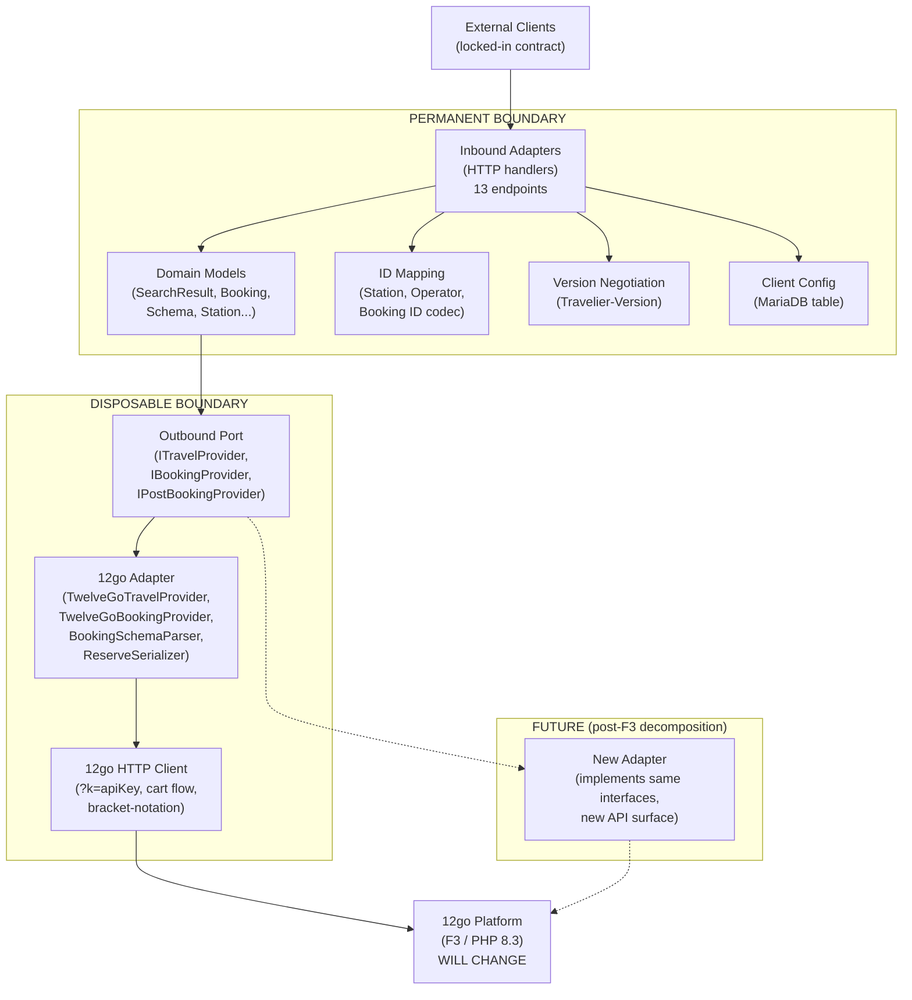

# Disposable Architecture Design

## The Temporary Constraint

F3 (frontend3) will be decomposed. Planning starts Q2 2026, but there is no plan yet -- no timeline, no target language, no milestones. Team Lead estimated "a couple of quarters, not one." When it happens, the API surface we call today will change.

This is not a worst-case scenario. It is the stated organizational direction. The "one system" vision means whatever we build today sits between two moving targets: a client contract that must never change, and a backend API that will change.

Three facts shape this design:

1. **The client contract is permanent.** 13 endpoints, `Travelier-Version` header versioning, money as strings, net/gross pricing, Fuji station IDs. Clients are locked in. This is the most expensive thing to get wrong.

2. **The 12go API integration is temporary.** The current `/search`, `/cart`, `/checkout`, `/reserve`, `/confirm`, `/booking` HTTP endpoints will change when F3 is broken apart. The cart/checkout flow may disappear entirely. New microservices may emerge with different APIs.

3. **The transition design will live for a significant time.** Team Lead confirmed this is not throwaway. Old clients migrate gradually. New clients onboard on the new system. The design must be reasonably solid, but it must also be designed so that when the backend changes, the replacement is surgical rather than catastrophic.

The design problem: **maximize the value of what survives F3 decomposition, and minimize the cost of replacing what does not.**

## Boundary Analysis

### Boundary 1: Client Contract (permanent)

The client-facing contract is the single most valuable artifact. It must be formalized, tested, and treated as immutable.

**Exact contract surface:**

| # | Endpoint | Method | Path | Key Headers |
|---|----------|--------|------|-------------|
| 1 | Search | GET | `/v1/{client_id}/itineraries` | `Travelier-Version`, `x-correlation-id` |
| 2 | GetItinerary | GET | `/{client_id}/itineraries/{id}` | `Travelier-Version`, `x-correlation-id` |
| 3 | CreateBooking | POST | `/{client_id}/bookings` | `Travelier-Version`, `x-correlation-id` |
| 4 | ConfirmBooking | POST | `/{client_id}/bookings/{id}/confirm` | `Travelier-Version`, `x-correlation-id` |
| 5 | SeatLock | POST | `/{client_id}/bookings/lock_seats` | `Travelier-Version`, `x-correlation-id` |
| 6 | GetBookingDetails | GET | `/{client_id}/bookings/{id}` | `Travelier-Version`, `x-correlation-id` |
| 7 | GetTicket | GET | `/{client_id}/bookings/{id}/ticket` | `Travelier-Version`, `x-correlation-id` |
| 8 | CancelBooking | POST | `/{client_id}/bookings/{id}/cancel` | `Travelier-Version`, `x-correlation-id` |
| 9 | IncompleteResults | GET | `/{client_id}/incomplete_results/{id}` | `Travelier-Version`, `x-correlation-id` |
| 10 | Stations | GET | `/v1/{client_id}/stations` | `Travelier-Version` |
| 11 | Operators | GET | `/v1/{client_id}/operating_carriers` | `Travelier-Version` |
| 12 | POIs | GET | `/v1/{client_id}/pois` | `Travelier-Version` |
| 13 | Booking Notifications | POST | (webhook receiver) | None (this is a problem -- see Security) |

**Contract conventions that must be preserved:**

- `Travelier-Version` header: YYYY-MM-DD format, controls response shape versioning
- Money format: amounts as strings (`"14.60"`), never floats
- Pricing structure: `net_price`, `gross_price`, `taxes_and_fees`, `price_type`
- `206 Partial Content` for incomplete supplier data (recheck in progress)
- Correlation headers: `x-correlation-id`, `x-api-experiment`
- Confirmation types: Instant vs Pending
- Ticket types: Paper Ticket, Show On Screen, Pick Up
- Station IDs: Fuji CMS 8-character format (`ILTLVTLV`)
- Booking IDs: KLV-encoded (legacy) or short 10-char Base62 (newer clients)

**Version negotiation:** The `Travelier-Version` header is the sole mechanism for response shape evolution. It belongs at the inbound adapter boundary -- the version determines which response mapper to use, not which business logic to execute. This separation is critical: when F3 is decomposed, version negotiation logic survives unchanged.

### Boundary 2: 12go API Contract (temporary)

The current 12go API surface consists of 11 HTTP endpoints following a cart-based booking flow:

```
Search -> GetTripDetails -> AddToCart -> GetCartDetails -> GetBookingSchema -> Reserve -> Confirm
```

Plus post-booking: `GetBookingDetails`, `GetRefundOptions`, `Refund`.

**What is likely to change when F3 is decomposed:**

- The cart/checkout flow may be replaced. The current `AddToCart -> GetCartDetails -> GetBookingSchema` sequence is a UI-oriented flow that exists because F3 is a monolith serving both web UI and API consumers. When F3 is broken apart, the booking API may become a direct `Reserve` call with schema provided upfront.
- Search may be split into its own service with a different API shape.
- The `?k=<apiKey>` authentication may change to a proper OAuth2 or API key header mechanism.
- The `/search/{from}p/{to}p/{date}` URL structure with province/station suffixes may be formalized differently.
- The dynamic checkout schema (bracket-notation form fields with embedded cart IDs) may be simplified or versioned.

**What is unlikely to change:**

- The core data: trips have segments, prices, operators, stations. The shape may change, but the concepts persist.
- Booking lifecycle: Reserve -> Confirm -> GetDetails/Cancel. The state machine is fundamental.
- Refund flow: two-step (get options with hash, then execute with selected option).

**How the outbound adapter hides 12go details:**

The outbound adapter encapsulates everything 12go-specific:
- URL construction (`/search/{from}p/{to}p/{date}`)
- Authentication (`?k=<apiKey>`)
- Cart-based booking flow orchestration (AddToCart + GetCartDetails + GetBookingSchema for a single client `GetItinerary` call)
- Dynamic checkout schema parsing (bracket-notation keys, `ExtensionData` scanning)
- Reserve request serialization (custom flat key-value format)
- Error response parsing (`ErrorResponse` with fields/messages/reasons)

The rest of the service works with domain types: `SearchResult`, `Itinerary`, `BookingSchema`, `Reservation`, `CancellationOptions`. These domain types are defined by the client contract, not by 12go.

## Anti-Corruption Layer Design

### Translation Model

The ACL translates between two worlds:

**Inbound translations (client world -> domain):**

| Client Concept | Domain Concept | Notes |
|---|---|---|
| Fuji station ID (`ILTLVTLV`) | Internal station reference | Mapped via static lookup table |
| Encrypted KLV booking ID | 12go `bid` (integer) | Decoded from KLV structure or looked up in static mapping |
| Short Base62 booking ID | 12go `bid` (integer) | Looked up in static mapping table |
| `booking_token` (encrypted) | Cart ID + schema reference | Decrypted and parsed |
| Money as strings | Decimal values | Parsed at boundary |
| `Travelier-Version` header | Version discriminator | Controls response mapper selection |

**Outbound translations (12go response -> client response):**

| 12go Concept | Client Concept | Notes |
|---|---|---|
| 12go integer station ID | Fuji CMS ID | Reverse lookup in mapping table |
| 12go `bid` | Encrypted/encoded booking ID | Encoded per client format (KLV or short) |
| `Price { value, fxcode }` | `{ amount: "14.60", currency: "USD" }` | String formatting at boundary |
| Cart-based checkout schema | `BookingSchema` with named fields | Dynamic field extraction, name normalization |
| 12go error with `fields`/`messages` | Client error format | Field name reverse-translation |

### Implementation

The ACL lives in a dedicated module/namespace within the service, structured as:

```
src/
  ports/
    inbound/          -- Client-facing HTTP handlers (permanent)
      SearchHandler
      BookingHandler
      PostBookingHandler
      MasterDataHandler
      NotificationHandler
    outbound/          -- Backend provider interface (permanent interface, swappable impl)
      ITravelProvider      -- Search, GetItinerary
      IBookingProvider     -- Reserve, Confirm, GetSchema
      IPostBookingProvider -- GetDetails, Cancel, GetTicket
      INotificationSink    -- Forward to client
  adapters/
    twelvego/          -- Current 12go implementation (temporary)
      TwelveGoTravelProvider
      TwelveGoBookingProvider
      TwelveGoPostBookingProvider
      TwelveGoHttpClient       -- Raw HTTP calls
      TwelveGoResponseMapper   -- 12go JSON -> domain types
      TwelveGoRequestMapper    -- Domain types -> 12go request format
      BookingSchemaParser      -- Dynamic checkout schema extraction
      ReserveRequestSerializer -- Bracket-notation serialization
  domain/
    models/            -- Domain types defined by client contract (permanent)
      SearchResult, Itinerary, Segment, Trip, Price
      BookingSchema, BookingRequest, Reservation
      CancellationOptions, RefundOption
      Station, Operator, POI
    mapping/           -- ID translation (permanent, data-driven)
      StationIdMapper    -- Fuji CMS <-> 12go integer
      BookingIdCodec     -- Encode/decode booking IDs
      OperatorIdMapper
  config/
    ClientRegistry     -- client_id -> 12go apiKey mapping
    FeatureFlags       -- Per-client routing flags
```

The key structural decision: **the `outbound/` interfaces are defined in terms of domain types, not 12go types.** `ITravelProvider.Search()` returns a `SearchResult`, not an `OneTwoGoSearchResponse`. The mapping from 12go's response to the domain type happens inside the adapter. When F3 is decomposed, a new adapter implements the same interface with different mapping logic.

### Testing Strategy

**ACL unit tests (survive F3 decomposition):**
- Inbound request parsing: verify that client requests are correctly parsed into domain types
- Outbound response formatting: verify that domain types are correctly formatted into client responses
- ID mapping: verify bidirectional station/operator/booking ID translation
- Version negotiation: verify that `Travelier-Version` selects the correct response mapper

**Adapter unit tests (replaced when F3 is decomposed):**
- `TwelveGoResponseMapper`: given a recorded 12go JSON response, verify correct domain type construction
- `BookingSchemaParser`: given the 3 real checkout fixtures from the current codebase, verify correct schema extraction
- `ReserveRequestSerializer`: given domain booking request, verify correct bracket-notation output
- Error mapping: given 12go error responses, verify correct domain error types

**Testing isolation:** The adapter tests use recorded HTTP fixtures (JSON files from real 12go responses). The ACL tests use domain types only. Neither depends on a running 12go instance. When 12go's API changes, only the adapter tests break, and the fixture files show the developer exactly what changed.

## Feature Flag Architecture

### Per-Client Routing

Migration happens client by client. The feature flag structure supports:

1. **Which backend handles this client?** During transition, some clients hit the old .NET stack, some hit the new service.
2. **Which booking ID format does this client use?** KLV (legacy) or short Base62 (newer).
3. **Which API key does this client map to?** The client_id -> 12go apiKey lookup.

### Storage

Feature flags are stored in a **database table** (MariaDB, since that is 12go's existing database and the new service will run on 12go's infrastructure):

```sql
CREATE TABLE b2b_client_config (
    client_id VARCHAR(50) PRIMARY KEY,
    enabled BOOLEAN DEFAULT FALSE,
    twelvego_api_key VARCHAR(255) NOT NULL,
    booking_id_format ENUM('klv', 'short', 'native') DEFAULT 'native',
    webhook_url VARCHAR(500),
    created_at TIMESTAMP DEFAULT CURRENT_TIMESTAMP,
    updated_at TIMESTAMP DEFAULT CURRENT_TIMESTAMP ON UPDATE CURRENT_TIMESTAMP
);
```

This table is:
- Loaded into memory at startup and refreshed periodically (like David's client identity middleware pattern)
- Queryable via a simple admin endpoint or direct DB access
- Changeable without a deployment -- update a row, wait for cache refresh
- Survivable across restarts and deployments

### Who Can Change Flags

- **Soso** via direct DB access or admin endpoint during development
- **Team Lead / Customer Success** via admin endpoint during client migration
- **No external dependency** (no LaunchDarkly, no Flagsmith) -- a single DB table and an in-memory cache

### Flag Evaluation Flow

```
Request arrives -> Extract client_id from URL
  -> Look up client_config from in-memory cache
  -> If not found or not enabled: return 404 or forward to legacy system
  -> If enabled: proceed with twelvego_api_key from config
```

This is deliberately simple. A solo developer maintaining a third-party feature flag service is overhead that provides no value for ~20-30 clients with binary on/off states.

## Contract Testing Strategy

### Inbound Contract Tests

**Tool:** Language-agnostic HTTP contract tests written as a collection of request/response pairs.

**Format:** A set of test fixtures, each containing:
- An HTTP request (method, path, headers, body)
- Expected response properties (status code, required headers, response body shape with JSON path assertions)

**Concrete approach:** Use a test harness that sends real HTTP requests to the running service and validates responses against expected shapes. The test fixtures are stored as JSON or YAML files. The fixtures survive a complete reimplementation of the service -- they test the HTTP contract, not the code.

**Example fixture (Search):**

```yaml
name: "Search returns 200 with correct shape"
request:
  method: GET
  path: "/v1/testclient/itineraries"
  query:
    departures[]: "ILTLVTLV"
    arrivals[]: "ILHFAHFA"
    departure_date: "2026-04-15"
    passengers: 1
  headers:
    Travelier-Version: "2024-01-01"
    x-correlation-id: "test-123"
response:
  status: 200
  headers:
    Content-Type: "application/json"
  body:
    jsonpath:
      "$.itineraries": { type: array }
      "$.itineraries[0].segments": { type: array }
      "$.itineraries[0].segments[0].from_station": { type: string, pattern: "^[A-Z]{8}$" }
      "$.itineraries[0].price.amount": { type: string, pattern: "^\\d+\\.\\d{2}$" }
```

**How they are run:** As part of CI, against a running service instance backed by recorded 12go fixtures (not a live 12go instance). For integration testing, the same fixtures run against a service connected to 12go's staging environment.

**Survival property:** These test fixtures are the most durable artifact of the project. They are language-agnostic, framework-agnostic, and backend-agnostic. When F3 is decomposed and the outbound adapter is replaced, these same fixtures validate that the new implementation still serves the correct client contract.

### Outbound Contract Tests

**Approach:** Recorded fixture testing (not consumer-driven contracts).

**Rationale:** Consumer-driven contracts (Pact) require cooperation from the provider (12go) and ongoing maintenance of the provider verification step. For a temporary integration with a provider whose API will change, the maintenance cost exceeds the value. Recorded fixtures are cheaper and provide sufficient confidence.

**How it works:**

1. **Record phase:** During development and initial integration testing, capture real 12go API responses as JSON fixture files. Store them alongside the adapter tests.
2. **Test phase:** Adapter unit tests deserialize the fixture files through the response mapper and verify the domain types are correctly constructed.
3. **Verification phase:** Periodically (weekly or on-demand), run a smoke test against 12go's staging environment that compares live responses against the expected shape. If the shape has changed, the smoke test fails and the developer knows to update the adapter.

**When 12go's API changes, which tests fail?**

- The **outbound smoke test** fails first (live response shape does not match expected shape).
- The **adapter unit tests** then fail when the fixture files are updated to reflect the new shape (the mapper does not handle the new fields).
- The **inbound contract tests** do NOT fail -- they validate the client-facing contract, which does not change.

This cascade gives the developer a clear signal: the 12go API changed, the adapter needs updating, and the client contract is unaffected.

## Survivability Analysis

| Artifact | Survives F3 decomposition? | Cost to replace | Notes |
|---|---|---|---|
| **Inbound HTTP handlers** | Yes | -- | Client contract is permanent; handlers do not reference 12go |
| **Inbound contract test fixtures** | Yes | -- | Language-agnostic, backend-agnostic |
| **Domain model types** | Yes | -- | Defined by client contract, not by 12go |
| **Station ID mapping data** | Yes | Low | Static data table; extraction is one-time work |
| **Operator ID mapping data** | Yes | Low | Same pattern as station mapping |
| **Booking ID codec** | Yes | Low | KLV decoder + short ID logic; client-facing concern |
| **Client config table** | Yes | Low | Schema may grow but core fields persist |
| **Outbound provider interfaces** | Yes | -- | Interfaces are stable; implementations change |
| **`Travelier-Version` negotiation** | Yes | -- | Client-facing concern, independent of backend |
| **Money/price formatting** | Yes | -- | String formatting at response boundary |
| **12go HTTP client** | No | Medium | New API surface requires new client |
| **12go response mapper** | No | Medium | New response shapes require new mapping |
| **Booking schema parser** | Probably not | High | Cart/checkout flow may change entirely |
| **Reserve request serializer** | Probably not | Medium | Bracket-notation format is 12go-specific |
| **Recheck URL caller** | No | Low | Fire-and-forget HTTP calls; trivial to rewrite |
| **Error response parser** | No | Low | New error format, new parser |
| **Authentication bridge** | Partial | Low | `?k=<apiKey>` mechanism may change; mapping data persists |

**Survival rate by line count (estimated):**

- Permanent artifacts: ~40% of total codebase (inbound handlers, domain types, mapping, tests)
- Disposable artifacts: ~60% of total codebase (12go adapter, schema parser, serializers)

This ratio is acceptable. The permanent 40% is the expensive part (getting the client contract right). The disposable 60% is the cheap part (calling an HTTP API with some transformations).

## Language and Framework

Evaluated on boundary expressiveness and testability, not team preference.

### PHP 8.3 / Symfony (Monolith in F3)

**Boundary expressiveness:** PHP 8.3 has interfaces, enums, readonly properties, union types. Symfony's service container supports interface-to-implementation binding. The adapter pattern is expressible but PHP's type system does not enforce it at compile time -- a developer can bypass the interface and call 12go directly without the compiler catching it.

**Test isolation:** PHPUnit supports mocking interfaces. Symfony's test framework supports functional testing with kernel boot. The adapter can be mocked at the interface level.

**Adapter replaceability:** Change the service binding in the DI container. Symfony's autowiring makes this a single-line config change.

**F3 co-location advantage:** If built inside F3, the adapter has direct access to F3's internal services. When F3 is decomposed, the B2B code must be extracted -- but it is co-located with everything it depends on, making the extraction easier to reason about.

**F3 co-location disadvantage:** The boundary between B2B code and F3 internals is enforced by convention, not by compilation. A solo developer under deadline pressure may shortcut the adapter boundary and call F3 services directly, creating coupling that makes future extraction harder.

**Solo developer fit:** Soso has 12 years of .NET, not PHP. Learning curve is real but mitigated by AI assistance and 12go veteran support. The Q2 deadline is tight for learning a new language simultaneously.

### .NET 8 (Microservice)

**Boundary expressiveness:** C# has interfaces, strong typing, compile-time enforcement. The adapter pattern is idiomatic and enforced by the type system. A developer cannot accidentally bypass the interface without the compiler flagging it.

**Test isolation:** xUnit/NUnit with Moq/NSubstitute. Interface mocking is first-class. The adapter can be tested in complete isolation.

**Adapter replaceability:** Change the DI registration. .NET's `IServiceCollection` supports keyed services for runtime adapter selection.

**Standalone advantage:** The service has a hard boundary with 12go. It communicates over HTTP. When F3 is decomposed, the service stays where it is and only the outbound HTTP calls change.

**Standalone disadvantage:** F3 feature development (cancellation policies, etc.) requires changes in F3 AND in the microservice. Two codebases, two deployments, two failure modes. For a solo developer, this is a multiplication of cognitive load.

**Solo developer fit:** Soso is immediately productive. 12 years of deep expertise. Production debugging at 3am is feasible.

### Go (Future-aligned)

**Boundary expressiveness:** Go interfaces are implicit (structural typing). The adapter pattern works naturally -- implement the interface, swap the implementation. No compile-time enforcement of "which implementation am I using" but the simplicity of Go's type system reduces accidental coupling.

**Test isolation:** Go's testing package with interface mocking (gomock, testify). Table-driven tests are idiomatic and AI-friendly.

**Solo developer fit:** Soso has no Go experience. 12go is considering Go but nothing is decided. Learning Go while building under Q2 deadline is high risk.

### Recommendation for Disposability

From a pure disposability perspective, the ranking is:

1. **.NET microservice** -- hardest boundary, best type enforcement, cleanest adapter isolation. The service is a self-contained unit with an HTTP boundary that survives F3 decomposition unchanged.
2. **PHP in F3** -- softer boundary (convention-enforced), but co-location makes F3 decomposition extraction easier. Risk: boundary erosion under deadline pressure.
3. **Go** -- good boundary properties but learning cost is too high for Q2.

The tension is between boundary hardness (.NET wins) and co-location advantage for F3 decomposition (PHP wins). This design does not resolve that tension -- it acknowledges it and provides the adapter boundary pattern that works in either language.

## Architecture Diagram



The dashed lines show the replacement path. When F3 is decomposed, a new adapter implements the same `outbound port` interfaces. Everything above the outbound port interface survives unchanged.

## Migration Strategy

### Client Transition Approach

**Transparent switch** -- clients do not know their traffic is being routed to a new backend. The new service preserves the exact same HTTP contract (paths, headers, response shapes, error codes). The switch happens at the infrastructure level (API Gateway routing or DNS), not at the client level.

This is the most disposable migration mechanism: there is no client-side migration artifact to manage. The client sends the same request to the same URL and gets the same response. The only change is which service processes the request.

**Exception:** If Approach B for API keys is chosen (clients switch to 12go API keys directly), then clients do need to make a one-time credential change. This is a configuration change, not a code change, and it is independent of the architecture.

### Authentication Bridge

The authentication bridge maps `(client_id, x-api-key)` to a 12go `apiKey`. It is implemented as the `b2b_client_config` table described in the Feature Flag section.

**Lookup flow:**
1. API Gateway validates `x-api-key` (existing behavior, unchanged)
2. Request reaches the service with `client_id` in the URL path
3. Service looks up `client_id` in `b2b_client_config` (in-memory cache)
4. Retrieves `twelvego_api_key` from the config row
5. All outbound 12go calls use this key as `?k=<apiKey>`

**Survival property:** The mapping data (which client maps to which 12go key) survives F3 decomposition. The lookup mechanism is trivial to reimplement. If 12go changes its authentication mechanism, only the outbound adapter's authentication logic changes -- the client-facing auth (API Gateway + `x-api-key`) is unaffected.

### Per-Client Rollout Mechanism

**Feature flag in the new service**, not a Lambda authorizer and not all-at-once.

Rollout sequence:
1. Deploy the new service alongside the existing .NET stack
2. Configure API Gateway with a routing rule that sends specific `client_id` values to the new service (this requires DevOps investigation -- API Gateway does not natively support per-path-parameter routing, so a Lambda authorizer or a lightweight routing Lambda may be needed)
3. Enable clients one at a time in `b2b_client_config`
4. Monitor for 24-48 hours per client before enabling the next
5. If issues are detected, disable the client in the config table (instant rollback)

**Interaction with adapter boundaries:** The rollout mechanism is entirely separate from the adapter boundary. It controls whether a client's traffic reaches the new service at all. The adapter boundary controls how the service processes that traffic. These are orthogonal concerns, which means the rollout mechanism also survives F3 decomposition -- it is infrastructure-level, not business-logic-level.

### In-Flight Booking Safety

Active booking funnels span multiple HTTP requests over time:
1. `GET /itineraries/{id}` (GetItinerary) -- returns a `booking_token`
2. `POST /bookings/lock_seats` (SeatLock, optional) -- uses `booking_token`
3. `POST /bookings` (CreateBooking) -- uses `booking_token`
4. `POST /bookings/{id}/confirm` (ConfirmBooking) -- uses booking ID

**Cutover risk:** If a client starts a booking funnel on the old system and the cutover happens mid-funnel, the new system receives a `booking_token` it did not generate.

**Mitigation:** The `booking_token` encodes a cart ID that is valid on 12go's side regardless of which TC service created it. The new service can decode the booking token and use the embedded cart ID to continue the flow. However, the `PreBookingCache` (DynamoDB in the old system) stores the name-to-supplier-name mapping needed for the reserve request. This mapping would not be available in the new system.

**Practical approach:** Cutover a client only when no booking funnels are in flight. For a B2B client with API-driven bookings, this window can be coordinated. For clients with low volume, a brief maintenance window (minutes) is sufficient. For high-volume clients, cutover during a low-traffic period (early morning) and accept that a small number of in-flight funnels may fail -- the client retries and the second attempt succeeds on the new system.

**Booking ID encoding:** Old bookings use KLV-encoded or short Base62 booking IDs. The `BookingIdCodec` in the domain layer handles both formats. For KLV IDs, the 12go `bid` is extracted from the encoded string. For short IDs, the static mapping table (one-time extraction from the Denali PostgreSQL database before decommissioning) provides the lookup.

### Webhook/Notification Transition

**Current state:** 12go sends webhooks to `POST /v1/notifications/OneTwoGo` with `{ "bid": <long> }` payload. The notification service resolves `bid -> client_id` via PostgreSQL lookup, fetches fresh booking details from 12go, and publishes a Kafka event.

**Transition approach:**
1. Configure 12go's webhook subscriber table with per-client notification URLs: `https://new-service/v1/notifications/{client_id}`
2. The new service receives the webhook, embeds `client_id` from the URL path, and performs the notification transformation
3. Transformation: 12go format (`bid`, `type`, `new_data`) -> client format (`booking_id`, status change payload)
4. For old bookings: use the static booking ID mapping table to translate `bid` back to the client's booking ID format
5. Forward the transformed notification to the client's registered webhook URL (from `b2b_client_config`)

**Adaptation for F3 decomposition:** When F3 is decomposed, the webhook source may change (new service instead of F3, different payload format). The notification handler's inbound adapter for 12go webhooks is in the disposable boundary. The transformation logic (domain notification -> client format) and the client delivery logic (forward to client webhook URL) are in the permanent boundary.

### Validation Plan

**Shadow traffic for search:**
1. Before cutover, mirror search requests to the new service without returning the response to the client
2. Compare the new service's response shape against the old service's response shape
3. Flag discrepancies in station IDs, pricing format, segment structure
4. This validates the ACL without risking client traffic

**Contract tests for booking:**
1. Run the inbound contract test fixtures against the new service with recorded 12go fixtures
2. Run a manual end-to-end booking flow against 12go staging for each client being migrated
3. Verify booking ID encoding, notification delivery, and cancellation flow

**Canary rollout sequence:**
1. Internal test client (TC automation) -- full funnel test
2. Low-volume external client with cooperative relationship
3. Medium-volume clients, one per day
4. High-volume clients last

**Which validation artifacts survive replacement:**
- Shadow traffic comparison logic: Yes (language-agnostic HTTP comparison)
- Inbound contract test fixtures: Yes (backend-agnostic)
- End-to-end booking flow scripts: Partially (the 12go-specific steps change, but the client-facing assertions survive)

## Security

### Webhook Authentication (Key Finding #10)

The current webhook authentication is a no-op:

```csharp
public ValueTask Authenticate(string? relativePath, HttpRequest notification)
    => ValueTask.CompletedTask;
```

Any caller that can reach the notification endpoint can trigger a full booking status refresh cycle for any `bid`. This is a known vulnerability.

### Boundary Design for Webhook Security

Webhook signature verification is an **inbound adapter concern**, not business logic. It sits at the boundary between the outside world and the service, exactly where authentication belongs.

**Current state (no auth):**

```
Internet -> NotificationHandler -> (no check) -> Process webhook
```

**Designed state (pluggable verification):**

```
Internet -> WebhookAuthMiddleware -> NotificationHandler -> Process webhook
              |
              v
        IWebhookVerifier (interface)
              |
              +-- NullVerifier (current: accepts everything -- TEMPORARY)
              +-- IpAllowlistVerifier (immediate mitigation)
              +-- HmacSignatureVerifier (when 12go adds signed webhooks)
```

**Implementation:**

1. Define `IWebhookVerifier` interface with a single method: `Verify(HttpRequest request) -> bool`
2. Register `NullVerifier` initially (matches current behavior -- accepting all requests)
3. Implement `IpAllowlistVerifier` as the first real security measure: only accept webhooks from 12go's known IP ranges. This requires no 12go-side changes.
4. When 12go adds webhook signatures (likely as part of F3 decomposition), implement `HmacSignatureVerifier` that validates the signature header against a shared secret.

**Why this design survives F3 decomposition:**

The `IWebhookVerifier` interface is defined in the permanent boundary. The implementation (`NullVerifier`, `IpAllowlistVerifier`, `HmacSignatureVerifier`) is in the adapter layer. When F3 is decomposed and the webhook format changes, a new verifier implementation is created. The inbound adapter that calls `IWebhookVerifier.Verify()` does not change.

**Immediate action for the current vulnerability:**

Deploy `IpAllowlistVerifier` with 12go's production IP ranges. This is a partial mitigation -- it prevents random internet callers from triggering webhook processing but does not prevent spoofing from within 12go's network. It is the best available mitigation without 12go-side changes.

### Security Contract at the Boundary

| Boundary | Today | After F3 Decomposition |
|---|---|---|
| Client -> Service (inbound) | API Gateway validates `x-api-key` | Same -- API Gateway is permanent |
| 12go -> Service (webhook) | No authentication | IP allowlist now, HMAC signatures later |
| Service -> 12go (outbound) | `?k=<apiKey>` query parameter | May change to header-based auth or OAuth2 |
| Service -> Client (webhook forward) | Per-client webhook URL, no signing | Consider adding HMAC signatures to outbound webhooks |

## What Gets Built First

Prioritized build order optimized for disposable-friendly implementation:

### Phase 1: Foundation (Week 1-2)

1. **Domain model types** -- Define `SearchResult`, `Itinerary`, `Segment`, `Price`, `BookingSchema`, `Reservation`, `CancellationOptions` in the domain layer. These are permanent and define the contract.
2. **Outbound port interfaces** -- `ITravelProvider`, `IBookingProvider`, `IPostBookingProvider`. These are the seam where the adapter plugs in.
3. **Client config table** -- `b2b_client_config` in MariaDB with client_id, api_key, and enabled flag.
4. **Station ID mapping data** -- Extract Fuji CMS <-> 12go integer mapping from Fuji DynamoDB. Store as a static lookup (JSON file or DB table).

**Why first:** These are all permanent artifacts. Building them first means the most valuable code exists before any disposable code is written.

### Phase 2: Search (Week 2-3)

5. **12go Search adapter** -- Implement `TwelveGoTravelProvider.Search()` calling `GET /search/{from}p/{to}p/{date}`.
6. **Search response mapper** -- Map 12go's `OneTwoGoSearchResponse` to domain `SearchResult`.
7. **Search inbound handler** -- Wire up `GET /v1/{client_id}/itineraries` to the domain and adapter.
8. **Recheck URL caller** -- Fire-and-forget HTTP calls to recheck URLs, mark response as 206 if rechecks present.
9. **Inbound contract tests for Search** -- First test fixtures validating response shape.

**Why second:** Search is the highest-traffic, most latency-sensitive endpoint. It validates the entire adapter pattern end-to-end with the simplest possible flow (1 12go call).

### Phase 3: Booking Funnel (Week 3-5)

10. **GetItinerary adapter** -- 3 12go calls (trip details + add to cart + checkout schema).
11. **Booking schema parser** -- Port the dynamic field extraction from existing C# code. This is the most complex piece.
12. **CreateBooking adapter** -- Reserve request serialization + 12go reserve call.
13. **ConfirmBooking adapter** -- Confirm call + booking details fetch.
14. **SeatLock handler** -- Fake implementation initially (validate against schema, store in memory or DB). Switch to 12go native endpoint when available.

### Phase 4: Post-Booking (Week 5-6)

15. **GetBookingDetails adapter** -- Direct proxy to 12go.
16. **GetTicket adapter** -- Fetch ticket URL from 12go booking details.
17. **CancelBooking adapter** -- Two-step refund flow (get options + execute).
18. **Booking ID mapping table** -- One-time extraction from Denali PostgreSQL for legacy booking ID lookup.

### Phase 5: Notifications + Master Data (Week 6-7)

19. **Webhook receiver** -- With `IpAllowlistVerifier`.
20. **Notification transformer** -- 12go format -> client format.
21. **Stations/Operators/POIs endpoints** -- Pre-signed S3 URLs or static data serving.

### Phase 6: Validation + Rollout (Week 7-8)

22. **Shadow traffic comparison** for search.
23. **End-to-end booking flow test** against staging.
24. **First client cutover** (internal test client).
25. **Per-client rollout** begins.

## Unconventional Idea

**Considered: Code generation from the existing .NET codebase.**

The existing C# code in `supply-integration` contains the exact mapping logic (response models, field patterns, serialization) that must be replicated. Rather than manually porting this logic, use an AI agent to:

1. Read the C# source files (`OneTwoGoApi.cs`, `OneTwoGoBookingSchemaResponse.cs`, `ReserveDataRequest.cs`, `FromRequestDataToReserveDataConverter.cs`)
2. Generate equivalent code in the target language
3. Run the existing test fixtures against the generated code

This is not classical code generation (no schema, no template). It is AI-assisted translation from one language's idioms to another's, guided by the existing test suite.

**Why this is worth considering:** The booking schema parser alone is ~1,180 lines of complex pattern-matching logic with 20+ field patterns. Manually rewriting it is error-prone and time-consuming. AI translation from the existing well-tested C# code could compress weeks of work into days.

**Why it might not work:** The C# code has two parallel implementations (denali and supply-integration) with subtle differences. The AI must reconcile these differences. The generated code must be reviewed carefully, not trusted blindly.

**Verdict:** Pursued as a productivity technique, not as an architectural choice. The adapter boundary design is the architecture. AI translation of the adapter internals is a build technique.

## What This Design Optimizes For (and what it sacrifices)

**Optimizes for:**

- **Replacement cost.** When F3 is decomposed, only the outbound adapter (the disposable 60%) needs to change. The permanent 40% (client contract, domain types, mapping data, contract tests) survives unchanged. The replacement is a bounded task: implement new adapter against new API, run existing contract tests, done.

- **Boundary clarity.** The outbound port interface is the hard seam. Everything above it is permanent. Everything below it is disposable. A developer looking at the codebase can immediately tell which code survives and which does not.

- **Contract test durability.** The inbound contract test fixtures are the most durable artifact. They are language-agnostic and backend-agnostic. They define correctness regardless of implementation.

- **Solo developer safety.** The adapter boundary prevents accidental coupling. Even under deadline pressure, the type system (in .NET) or the module structure (in PHP) makes it hard to accidentally wire client-facing code directly to 12go-specific types.

**Sacrifices:**

- **Initial build speed.** Defining domain types and outbound interfaces before writing any 12go integration code adds upfront work. A "just proxy everything" approach would be faster initially but would produce a codebase where everything is 12go-specific and nothing survives replacement.

- **Simplicity of the first implementation.** The adapter pattern adds one layer of indirection that a pure proxy does not need. For a service that is "just" transforming JSON, this indirection may feel like over-engineering -- until F3 is decomposed and the team discovers that the indirection was the entire point.

- **Perfect alignment with "one system" vision.** A standalone microservice with clean adapter boundaries is architecturally independent. The organizational direction is "one system." These are in tension. The design mitigates this by making the adapter pattern applicable both inside F3 (as a Symfony bundle with DI-enforced boundaries) and outside F3 (as a standalone service). The pattern is portable; the deployment model is a separate decision.

- **Monolith co-location benefits.** If built as a standalone service, the B2B code does not have direct access to F3's internal services (trip pool, user tables, integration configurations). Every interaction goes through HTTP. This is a feature for disposability (hard boundary) but a cost for new F3 feature development (cancellation policies require F3 changes AND service changes).
