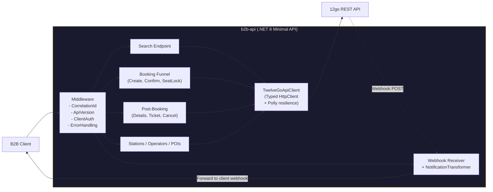
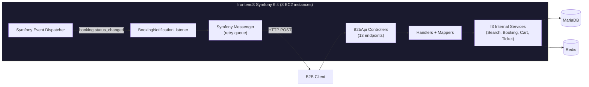
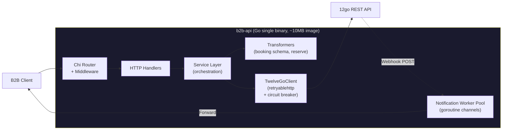
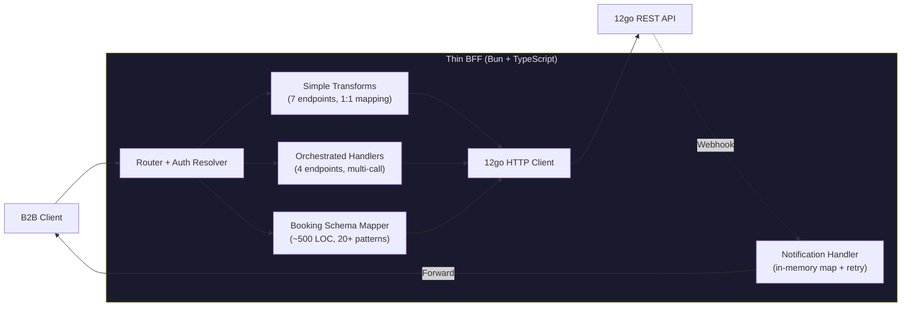
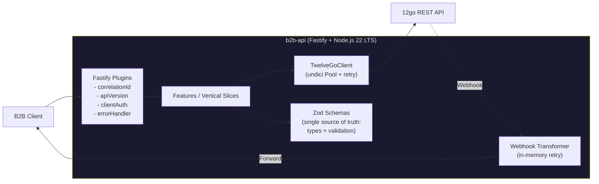
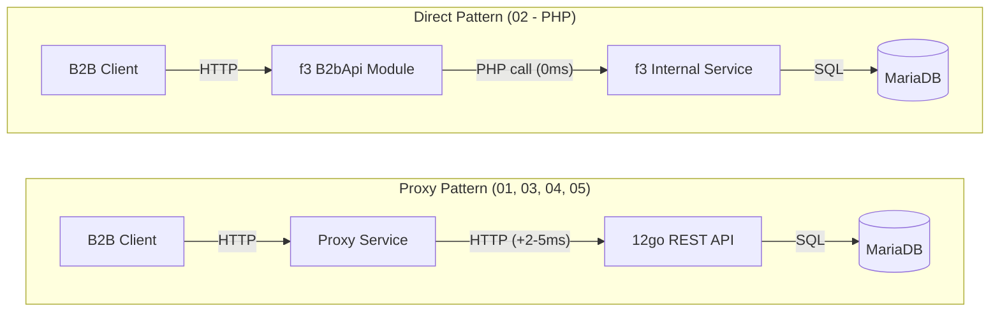
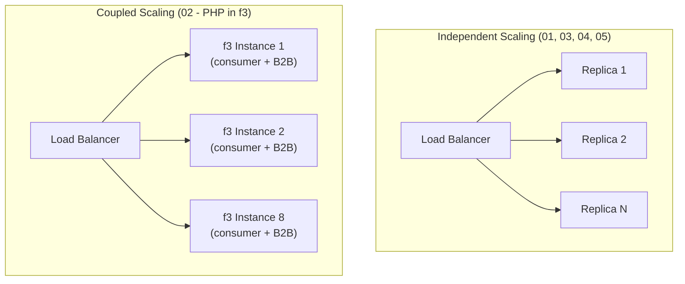

# Architectural Comparison of 5 B2B API Approaches

This document provides a visual, side-by-side architectural comparison of the five proposed alternatives for replacing the B2B API layer. It focuses on where key components live, what data stores and services each approach calls, and whether scaling is independent.

---

## High-Level Topology

All five approaches replace 4 .NET repositories (~342 projects, 200-400K LOC) with a single, dramatically smaller codebase. Four of them are standalone services that proxy to the 12go REST API over HTTP. One (PHP) embeds directly into 12go's existing monolith.

```mermaid
flowchart TD
    Client["B2B Clients\n(13 endpoints)"]

    subgraph standalone ["Standalone Services"]
        direction TB
        subgraph alt01 ["01: .NET 8 Minimal API"]
            n_mw["Middleware Pipeline"]
            n_features["Features / Vertical Slices"]
            n_client["TwelveGoApiClient\n(Typed HttpClient + Polly)"]
            n_notif["Webhook Transformer\n(in-memory retry)"]
        end

        subgraph alt03 ["03: Go / Chi Router"]
            g_mw["Middleware Stack"]
            g_handlers["Handlers / Services"]
            g_client["TwelveGoClient\n(retryablehttp + gobreaker)"]
            g_notif["Notification Worker Pool\n(goroutine channels)"]
        end

        subgraph alt04 ["04: TypeScript / Bun"]
            b_router["Router + Auth"]
            b_transforms["Transform Functions"]
            b_client["12go HTTP Client"]
            b_notif["Notification Handler\n(in-memory retry)"]
        end

        subgraph alt05 ["05: TypeScript / Node.js 22 + Fastify"]
            ts_plugins["Fastify Plugins\n(correlation, auth, errors)"]
            ts_features["Features / Vertical Slices"]
            ts_client["TwelveGoClient\n(undici Pool + retry)"]
            ts_notif["Webhook Transformer\n(in-memory retry)"]
        end
    end

    subgraph embedded ["Monolith Integration"]
        direction TB
        subgraph alt02 ["02: PHP / Symfony 6.4 inside f3"]
            p_ctrl["B2bApi Controllers"]
            p_handlers["Handlers + Mappers"]
            p_f3["f3 Internal Services\n(Search, Booking, Cart, Ticket)"]
            p_notif["Event Listener\n(Symfony Messenger retry)"]
        end
    end

    TGoAPI["12go REST API"]
    TGoDB[("12go MariaDB")]
    TGoRedis[("12go Redis")]

    Client --> alt01 & alt03 & alt04 & alt05
    Client --> alt02

    n_client -->|"HTTP"| TGoAPI
    g_client -->|"HTTP"| TGoAPI
    b_client -->|"HTTP"| TGoAPI
    ts_client -->|"HTTP"| TGoAPI

    p_f3 -->|"Direct PHP call"| TGoDB
    p_f3 -->|"Direct PHP call"| TGoRedis

    TGoAPI --> TGoDB
    TGoAPI --> TGoRedis
```

---

## Per-Approach Architecture Diagrams

### 01: Trimmed .NET Service

| Aspect | Detail |
|--------|--------|
| **Runtime** | .NET 8, single Docker container (~250MB image) |
| **Databases** | None (fully stateless) |
| **External calls** | 12go REST API via HTTP |
| **Webhook** | Receives HTTP webhook from 12go, transforms, forwards to clients |
| **Scaling** | Independent horizontal scaling via Docker replicas |
| **Observability** | dd-trace-dotnet auto-instrumentation, Serilog JSON, DogStatsD |
| **LOC** | ~6K |
| **MVP Timeline** | 3 weeks (no ramp-up) |

---

### 02: PHP Integration (Inside f3 Monolith)

| Aspect | Detail |
|--------|--------|
| **Runtime** | PHP 8.3 / Symfony 6.4, runs on existing f3 EC2 fleet |
| **Databases** | f3's existing MariaDB (direct queries) + Redis (shared cache) |
| **External calls** | Internal PHP function calls to f3 services (no HTTP round-trip) |
| **Webhook** | Listens to internal Symfony events, not external HTTP webhooks |
| **Scaling** | Tied to f3 monolith scaling (cannot scale B2B independently) |
| **Observability** | dd-trace-php (already in f3), Monolog, shared Datadog dashboards |
| **LOC** | ~3-4K |
| **MVP Timeline** | 6-8 weeks (includes PHP ramp-up + f3 orientation) |

---

### 03: Go Service

| Aspect | Detail |
|--------|--------|
| **Runtime** | Go 1.23, distroless container (~10-15MB image) |
| **Databases** | None (fully stateless) |
| **External calls** | 12go REST API via HTTP |
| **Webhook** | Goroutine worker pool with in-memory retry channels |
| **Scaling** | Independent, near-instant startup (<100ms), ~20MB RAM |
| **Observability** | dd-trace-go v2, slog JSON, DogStatsD |
| **LOC** | ~3-5K |
| **MVP Timeline** | 4-6 weeks (includes 2-week Go ramp-up) |

---

### 04: Hybrid BFF (TypeScript / Bun)

| Aspect | Detail |
|--------|--------|
| **Runtime** | Bun 1.2+ (Node.js-compatible), single container (~50MB image) |
| **Databases** | None (fully stateless; in-memory booking-to-client map for webhooks) |
| **External calls** | 12go REST API via HTTP |
| **Webhook** | In-memory booking-to-client map (lost on restart), in-process retry |
| **Scaling** | Independent horizontal scaling |
| **Observability** | dd-trace (experimental Bun support), JSON stdout logging |
| **LOC** | ~2.8K (smallest of all) |
| **MVP Timeline** | 4-5 weeks |
| **Reviewer concern** | All 6 reviewers recommended switching to Node.js 22 LTS over Bun |

---

### 05: TypeScript / Node.js 22 + Fastify

| Aspect | Detail |
|--------|--------|
| **Runtime** | Node.js 22 LTS, Docker container (~150MB image) |
| **Databases** | None (fully stateless) |
| **External calls** | 12go REST API via HTTP |
| **Webhook** | Same-process webhook receiver with in-memory retry (outbox upgrade path) |
| **Scaling** | Independent horizontal scaling |
| **Observability** | dd-trace (first-class Node.js support), Pino JSON logging, DogStatsD |
| **LOC** | ~5K |
| **MVP Timeline** | 4-5 weeks (includes 1-week TS ramp-up) |

---

## Side-by-Side Comparison Matrix

| Dimension | .NET (01) | PHP (02) | Go (03) | BFF/Bun (04) | Node/TS (05) |
|-----------|-----------|----------|---------|--------------|--------------|
| **Service topology** | Standalone | Inside f3 monolith | Standalone | Standalone | Standalone |
| **Search lives in** | Proxy service | f3 module | Proxy service | Proxy service | Proxy service |
| **Booking funnel lives in** | Proxy service | f3 module | Proxy service | Proxy service | Proxy service |
| **Webhook transformer** | Same service (HTTP receiver) | Event listener (internal events) | Same service (goroutine pool) | Same service (in-memory) | Same service (HTTP receiver) |
| **Database dependencies** | None | MariaDB + Redis (f3's) | None | None | None |
| **How it reaches 12go** | HTTP proxy | Direct PHP service calls | HTTP proxy | HTTP proxy | HTTP proxy |
| **Search latency overhead** | +2-5ms (HTTP hop) | ~0ms (direct DB) | +2-5ms (HTTP hop) | +1-3ms (HTTP hop) | +2-5ms (HTTP hop) |
| **Scales independently** | Yes | No (coupled to f3) | Yes | Yes | Yes |
| **Docker image size** | ~250MB | N/A (f3 infra) | ~10-15MB | ~50MB | ~150MB |
| **Memory footprint** | ~150-200MB | Shared with f3 | ~20-30MB | ~50-100MB | ~100-150MB |
| **Startup time** | <2s | N/A (f3 process) | <100ms | ~15-30ms | ~60-120ms |
| **LOC estimate** | ~6K | ~3-4K | ~3-5K | ~2.8K | ~5K |
| **Team ramp-up** | 0 weeks | 1-2 weeks (PHP) + 3-4 weeks (f3) | 2-4 weeks | 1-2 weeks | 1 week |
| **MVP timeline** | 3 weeks | 6-8 weeks | 4-6 weeks | 4-5 weeks | 4-5 weeks |
| **Total migration** | 7-8 weeks | 13-21 weeks | 10-12 weeks | 8-10 weeks | 8-9 weeks |
| **Weighted score** | **123/140 (#1)** | **93/140 (#5)** | **108/140 (#3)** | **107/140 (#4)** | **113/140 (#2)** |

---

## Data Flow Comparison

The fundamental architectural split is between "proxy via HTTP" (01, 03, 04, 05) and "direct integration" (02):

---

## Webhook / Notification Flow Comparison

```mermaid
flowchart TD
    subgraph proxyWebhook ["Standalone Services (01, 03, 04, 05)"]
        direction LR
        TG1["12go Platform"]
        WH1["Service Webhook Endpoint\n(POST /webhooks/booking-notifications)"]
        TX1["Notification Transformer"]
        CL1["B2B Client Webhook"]
        TG1 -->|"HTTP POST\n(no auth)"| WH1 --> TX1 -->|"HTTP POST\n(HMAC signed)"| CL1
    end

    subgraph phpWebhook ["PHP Inside f3 (02)"]
        direction LR
        ED["Symfony EventDispatcher"]
        LI["BookingNotificationListener"]
        TX2["NotificationTransformer"]
        MS["Symfony Messenger\n(retry queue)"]
        CL2["B2B Client Webhook"]
        ED -->|"Internal event\n(no HTTP)"| LI --> TX2 --> MS -->|"HTTP POST"| CL2
    end
```

Key difference: The PHP approach (02) avoids the unauthenticated webhook problem entirely by subscribing to internal Symfony events rather than receiving external HTTP calls.

---

## Scaling Characteristics

For the standalone approaches, B2B traffic can be scaled independently of consumer traffic. For the PHP approach, adding B2B capacity means adding f3 instances, which also increases consumer capacity (potentially wasted resources).

---

## Reviewer Consensus Summary

### All 6 reviewers agreed on:
- **.NET is the lowest-risk, fastest-to-deliver option.** No reviewer disputed the team competency advantage.
- **PHP's dominant risk is human, not technical.** Every reviewer flagged team satisfaction and stack alignment.
- **Go's strategic alignment is speculative.** "Considering Go" is not a commitment.
- **BFF should use Node.js 22 LTS, not Bun.** Bun's experimental Datadog support is a production risk.
- **The booking schema parser is the highest-risk component regardless of language.**
- **All alternatives correctly identify the system as a stateless proxy.** Zero local databases is the right default.

### Risk Heat Map

| Risk Category | .NET (01) | PHP (02) | Go (03) | BFF (04) | TS (05) |
|---------------|-----------|----------|---------|----------|---------|
| Migration Timeline | LOW | HIGH | MEDIUM | MEDIUM | LOW-MEDIUM |
| Team Retention | LOW | HIGH | MEDIUM-HIGH | MEDIUM | MEDIUM |
| Client Disruption | LOW | MEDIUM | LOW | LOW | LOW |
| Knowledge Transfer | MEDIUM | LOW | MEDIUM | MEDIUM | LOW-MEDIUM |
| Operational | LOW | MEDIUM | LOW | MEDIUM-HIGH | LOW-MEDIUM |

### DX Advocate Highlights

- **01 (.NET)**: "The team wakes up, opens Rider, and writes code in the language they are experts in. During a transition where many factors are changing, the codebase itself being familiar is a profound stabilizing force."
- **02 (PHP)**: "A team writing code under significant stack friction produces brittle, poorly-tested software. Do not choose this option unless the team genuinely consents."
- **03 (Go)**: "The resulting codebase would be beautiful: 25 files, single binary, sub-millisecond GC. But getting there requires the team to unlearn 12 years of C# idioms while shipping production code under a deadline."
- **04 (BFF/Bun)**: "Choosing Bun over Node.js is optimizing the wrong variable at the cost of ecosystem maturity."
- **05 (Node/TS)**: "The booking schema parser -- the hardest piece of code in the entire system -- is more natural in TypeScript than in any other option. The AI story amplifies the joy."
