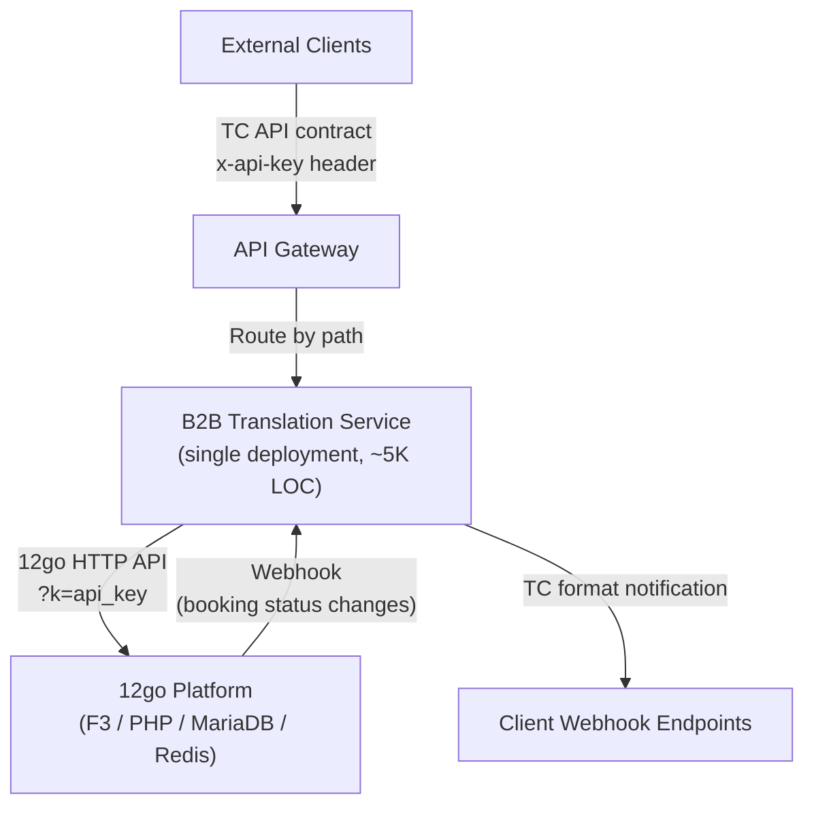

# Pragmatic Minimalist Design

## The Actual Problem (not the stated one)

The stated problem is "the system is over-engineered and needs to be replaced." That framing is dangerous because it invites a rewrite, and rewrites fail. Let me restate the problem in terms of what actually hurts:

1. **One developer must maintain a system built for a team of eight.** Four .NET repositories, ~342 projects, 200-400K lines of C#. The abstractions (multi-supplier framework, MediatR pipeline with 10+ behaviors, DynamoDB caches, PostgreSQL audit stores, Kafka event chains, gRPC inter-service communication) were built for 11 suppliers. Only one supplier remains: 12go. The abstraction layers are now pure liability -- they do not solve any current problem, but they must be understood to fix any bug.

2. **Infrastructure is being consolidated onto 12go's cloud.** The current services run on AWS with DynamoDB, PostgreSQL, S3, Kafka, API Gateway. These must either migrate to 12go's infrastructure or be eliminated. Migrating all of this infrastructure to host what is fundamentally an HTTP proxy layer is not justified.

3. **New clients must onboard in Q2 2026.** This is a hard deadline. The current system cannot onboard new clients without the full .NET deployment stack, which is moving.

4. **The "one system" vision is an organizational constraint.** Management has stated there is no permanent separation between 12go core and B2B. Long-term, this must converge. Any design that creates new separation works against this direction.

The client-facing problem is: nothing is broken today. The operational problem is: a single developer cannot maintain, deploy, or extend four .NET services with ~342 projects of infrastructure overhead, on an infrastructure stack that is being decommissioned, against a Q2 deadline.

## Should We Rewrite At All? (honest assessment)

I must earn the rewrite. Let me be honest about why simplification-in-place fails -- and why it almost works.

### The case FOR simplifying in-place

The valuable code is tiny. The `OneTwoGoApi` HTTP client (~500 lines), the request/response models (~2000 lines), the booking schema parser (~500 lines), and the reserve request serializer are the entire business logic. If we could delete everything else and keep these running, we would be done.

### Why simplification-in-place fails concretely

After gutting all the unnecessary code, here is what remains:

- **Four separate .NET services still need deployment.** Etna Search, Denali booking-service, Denali post-booking-service, and Denali booking-notification-service each need their own Dockerfile, health checks, configuration, monitoring, and deployment pipeline. This is four deployments for what is now ~3000 lines of business logic.

- **The inter-service dependencies are load-bearing.** Etna Search calls Etna SI Host via gRPC. Denali booking-service and post-booking-service share a DynamoDB table (BookingCache). Notification service uses Kafka to communicate with post-booking-service. Deleting these coupling mechanisms means redesigning how the services interact -- which is a rewrite of the integration layer even if the business logic stays.

- **The Supply-Integration framework wraps the valuable code in mandatory infrastructure.** The `OneTwoGoApi` class cannot be called without Autofac, `ISiServiceProvider`, `ISiServiceScope`, `ConnectorFactory`, and `IntegrationHttpMiddleware`. Removing the framework means rewriting the calling code anyway.

- **The .NET services cannot run on 12go's infrastructure without dedicated support.** 12go's DevOps manages PHP on EC2. Adding .NET runtimes to their infrastructure is a new operational concern that persists as long as these services run.

- **Nobody on the 12go team can maintain .NET.** After the transition, if Soso is unavailable, these services are orphaned.

### Verdict

The extractable business logic (~3000 lines) is small enough to port. The infrastructure hosting it (~340 projects) cannot be simplified into something that a solo developer can deploy and maintain on 12go's infrastructure. A rewrite is justified -- but only if it is a thin rewrite that produces less code than we are deleting.

The goal is clear: produce a single service with fewer than 5000 lines of application code, replacing ~200-400K lines. If the new service starts growing beyond that, something is wrong.

## Option A: Simplify In-Place

### What Gets Removed

- All 11 non-12go integrations from supply-integration (~100K+ LOC)
- MediatR pipeline in Etna (10+ behaviors: SearchEvents, DistributionRules, SourceAvailability, Markup, ExecutionPlanBuilder, CacheDirectSupport, ManualProduct, ContractResolution, OperatorHealth, RoutesDiscovery)
- DynamoDB tables: ItineraryCache, PreBookingCache, BookingCache, IncompleteResults
- PostgreSQL: BookingEntities, BookingEntityHistory, ConfirmationInProcess
- Kafka producers and consumers
- HybridCache triple-caching layer
- Etna SI Host as a separate service
- Multi-supplier abstractions: ISiServiceProvider, ConnectorFactory, IntegrationHttpMiddleware
- gRPC inter-service communication
- OpenAPI code generation for inter-service comms
- Ushba pricing module

### What Gets Changed

- Etna Search calls 12go HTTP API directly (no SI Host, no SI framework)
- Denali booking-service calls 12go directly
- Denali post-booking-service calls 12go directly instead of reading from local DB
- Notification service reduced to single webhook endpoint with format transformation

### What Stays Exactly As-Is

- `OneTwoGoApi` HTTP client (the 11 endpoint method calls)
- Request/response model classes
- Booking schema parser and dynamic field extraction
- Reserve request serializer (bracket notation)
- Error handling/mapping logic
- Client-facing API contracts (all 13 endpoints)

### Resulting Architecture

After gutting, you still have 3-4 separate .NET deployments on infrastructure that is being decommissioned. Each service is a thin wrapper around a few HTTP calls, deployed as a full ASP.NET 8 web application with its own pipeline. The deployment complexity is disproportionate to the business logic. The .NET runtime needs dedicated infrastructure on 12go's cloud. Nobody on the 12go team can maintain it.

**Why this option is worse than Option B:** The gutting work touches every project file, every DI registration, every infrastructure reference. The result still requires multi-service deployment on infrastructure that needs special .NET support. The effort is comparable to writing a single thin service, but the outcome is worse: more moving parts, more deployment complexity, and a technology the target team cannot maintain.

## Option B: Strangler Fig with a Single New Service

This is the recommended approach.

### New Service Role

One service. One deployment. It does exactly what the current four services do after you strip away all unnecessary layers:

1. Receive client HTTP requests in the TC API contract format
2. Translate them to 12go API calls (11 endpoints)
3. Translate 12go responses back to TC API contract format
4. Receive webhook notifications from 12go, transform them, forward to clients

No local database. No message queue. No caching layer (12go already caches in Redis). No supplier abstraction. No plugin architecture.

Each of the 13 endpoints is a function: parse request, call 12go, map response, return. The most complex are GetItinerary (3 12go calls chained) and the booking schema parser (~500 lines of mapping logic). The entire service should be under 5000 lines of application code.



### Coexistence Strategy

Per-endpoint cutover using API Gateway route changes.

AWS API Gateway routes by path and method. During transition:

1. New service is deployed alongside existing services
2. Gateway routes are updated one endpoint at a time to point to new service
3. Old services continue running for non-migrated endpoints
4. Once all endpoints are migrated, old services are decommissioned

This is per-endpoint migration, not per-client. AWS API Gateway does not natively support routing to different backends based on path parameter values (`{client_id}` is a path parameter). Per-endpoint migration is simpler and safer because each endpoint is independent once DynamoDB is eliminated.

If per-client routing is needed for the booking funnel (the highest-risk endpoints), implement it as a 10-line check inside the new service: check `client_id` against a "migrated clients" list, and if not listed, proxy the request to the old service. This is a feature flag, not an architectural component.

### Traffic Migration Sequence

```
Phase 1: Deploy new service, route zero traffic
Phase 2: Stations, Operators, POIs (stateless reads, lowest risk)
Phase 3: Search (highest traffic, good validation signal)
Phase 4: GetItinerary (most complex mapping -- booking schema parser)
Phase 5: Booking funnel (CreateBooking, ConfirmBooking, SeatLock)
Phase 6: Post-booking (GetBookingDetails, GetTicket, CancelBooking)
Phase 7: IncompleteResults
Phase 8: Notifications (different topology, can be last or offloaded)
Phase 9: Decommission old services
```

Each phase follows this pattern:

1. Implement endpoint in new service
2. Test against 12go staging/preprod
3. Compare responses against old service output (automated diff)
4. Update API Gateway route to point to new service
5. Monitor for 24-48 hours
6. If problems: revert gateway route (instant rollback, seconds)
7. If stable: move to next endpoint

The old services are not modified. They do not know about the new service. The gateway is the only thing that changes.

### Rollback Plan

| Phase | Rollback Action | Time to Rollback | Data Loss Risk |
|-------|----------------|------------------|----------------|
| Any endpoint migration | Revert API Gateway route to old service | Seconds to minutes | None -- no local state in new service |
| Notification migration | Revert webhook URL in 12go config | Minutes | Notifications during switchover may be delayed; 12go retry covers transient gaps |
| Full decommission | Redeploy old services from existing container images | Minutes to hours | None if within DynamoDB TTL window (5 days) |

**Point of no return:** When old AWS infrastructure (DynamoDB, PostgreSQL, EC2 instances running .NET) is decommissioned. Until that point, any endpoint can be rolled back by reverting a gateway route. Recommend keeping old infrastructure alive for 30 days after the last endpoint migrates.

## Language and Framework Recommendation

### Start from the job, not the language

The job is: receive HTTP, translate JSON, call HTTP, translate JSON, return HTTP. Total ported logic: ~3000 lines. Complexity hotspots:

- Booking schema parser (dynamic field extraction with 20+ wildcard patterns)
- Reserve request serializer (flat key-value bracket notation for passenger data)
- Search response mapping (trips to itineraries with segment construction, pricing normalization)
- Refund flow (two-step with hash/expiry)

### Language assessment

| Language | Build speed | Maintainability after Soso | Infrastructure fit | F3 alignment |
|----------|------------|---------------------------|-------------------|--------------|
| **PHP (inside F3)** | Moderate -- Soso has limited PHP; learning curve for first 2-3 endpoints. AI assistance effective for PHP translation. | Best -- 12go team already maintains F3 | Best -- no new runtime, uses existing deployment/monitoring | Full alignment with "one system" vision |
| **PHP (standalone Symfony)** | Same as above | Good -- same language as 12go team | Good -- same runtime, separate deployment | Partial -- same language, but separate service |
| **.NET** | Fastest -- Soso's 12-year expertise; can copy-paste existing models directly | Worst -- nobody on 12go team maintains .NET | Poor -- requires .NET runtime on 12go infra | No alignment |
| **Go** | Slow -- nobody knows Go; 12go has not committed to Go | Unknown -- 12go is only "considering" it | Moderate -- compiles to binary, easy to deploy | Speculative |

### Recommendation: PHP inside F3

The reasoning, in order of importance:

1. **Solo developer on a deadline.** One deployment target, one configuration system, one monitoring stack (Datadog), one local dev environment. A separate service means building and maintaining a second deployment pipeline alone.

2. **F3 already has the infrastructure.** `VersionedApiBundle` for API versioning, `ApiAgent` for partner identity, Datadog APM tracing, the B2B route structure. The Search POC (ST-2432) proved this works -- all 4 search types returned correct B2B contract shapes.

3. **Long-term maintainability.** If Soso builds in .NET and leaves, 12go inherits a service they cannot maintain. If Soso builds in F3, the 12go team already knows how to deploy, monitor, and modify it.

4. **"One system" organizational constraint.** Management stated there is no permanent separation. Building inside F3 aligns with this. Building outside creates a second migration when F3 is refactored.

5. **F3 refactoring risk is manageable.** The B2B translation layer is ~5000 lines of leaf-node logic with no internal dependencies. When F3 is refactored, this code moves as a bundle. Moving 5000 lines during a refactor is trivial compared to migrating a separate service's deployment infrastructure.

### Caveat: F3 local dev friction

The Search POC documented real setup problems with F3 locally. This is the strongest argument against the monolith. Mitigation: invest the first 2-3 days of the transition in getting F3 local dev stable. Document the setup. Automate it. This is a one-time cost that pays for itself across the entire transition.

### Fallback: standalone PHP Symfony

If F3 local dev proves unworkable after the initial investment, fall back to a standalone PHP Symfony service. Same language (12go team can maintain it), same ecosystem, deployable on 12go infrastructure, but outside the monolith. This preserves maintainability while avoiding F3 friction.

### If PHP is vetoed entirely: .NET

Soso builds fastest in .NET. The models can be directly ported. The cost is long-term maintenance by a team that does not use .NET, and a .NET runtime that needs dedicated infrastructure support. This is acceptable if the timeline is tight enough that PHP ramp-up genuinely threatens Q2.

## Data Strategy

### DynamoDB Tables -- All Eliminated

| Table | Verdict | Rationale |
|-------|---------|-----------|
| **ItineraryCache** | Eliminate | Cache of search results. New service calls 12go directly. 12go caches in Redis already. |
| **PreBookingCache** | Eliminate | Cache of booking schema. New service calls `GET /checkout/{cartId}` on demand. |
| **BookingCache** | Eliminate | In-progress booking state. 12go tracks this in MariaDB. `reserve` returns a `bid`; `confirm` uses that `bid`. No local state needed between these calls. The funnel state machine (credit reservation, async confirmation) is eliminated -- 12go handles booking state. |
| **IncompleteResults** | Eliminate | Async polling store. If 12go reserve/confirm are synchronous (they appear to be), this is unnecessary. If async flows exist, handle with a simple in-memory map or Redis key with TTL. |

### PostgreSQL -- Eliminated

| Table | Verdict | Rationale |
|-------|---------|-----------|
| **BookingEntities** | Eliminate | 12go MariaDB is authoritative. `GetBookingDetails` proxies to `GET /booking/{bookingId}`. Confirmed in Mar 12 meeting: no-persistence design. |
| **BookingEntityHistory** | Eliminate | Audit trail. 12go has its own booking history. If audit is required, it is 12go's responsibility as source of truth. |
| **ConfirmationInProcess** | Eliminate | Async confirmation tracking. Eliminated with synchronous flow. |

### Known data gaps

1. **Cancellation policy on GetBookingDetails.** 12go's `GET /booking/{bookingId}` does not return cancellation policy. Current system stores it locally. Solution: Team Lead confirmed (Mar 17) that cancellation policy exposure is being added to F3. If inside F3, this is a single-codebase change. If standalone, it requires an additional 12go API call.

2. **Legacy booking ID mapping.** A one-time static mapping table (old TC booking ID to 12go `bid`) is needed for post-booking operations on bookings created before migration. This is a flat lookup -- a JSON file, a Redis hash, or a single DB table. Shauly confirmed (Mar 12) that legacy bookings expire naturally. This is a shrinking problem.

### New storage required

| What | Technology | Purpose | Lifetime |
|------|-----------|---------|----------|
| API key mapping | Config file or DB table in F3 | Maps TC `client_id` + `api_key` to 12go `api_key` | Until clients switch to 12go keys directly |
| Legacy booking ID map | Static lookup (file or DB table) | Maps old TC booking IDs to 12go `bid` for post-booking | Shrinking -- expires as legacy bookings age out |

**No new databases. No new caching layers. No new message queues.**

If search latency through the new service is measurably worse than the old service (because we removed triple-caching), add a simple Redis TTL cache for search results only. But measure first. Do not add caching speculatively.

## Security

### Key Finding #10: Webhook Authentication Gap

**Current state:** 12go webhook notifications to `POST /v1/notifications/OneTwoGo` have zero authentication. The `NotificationAuthenticator` returns `ValueTask.CompletedTask`. Any HTTP client that discovers the endpoint URL can send fake booking notifications.

**What this design does about it -- three layers:**

1. **IP allowlisting at the network level.** Since the new service runs on 12go's infrastructure (same VPC or same network), configure the webhook endpoint to accept connections only from 12go's known internal IP ranges. This is a security group / firewall rule -- DevOps configuration, not application code. It is the simplest and most effective control.

2. **Shared secret header verification.** The webhook endpoint requires a secret token in a custom header: `X-Webhook-Secret: <shared-secret>`. The same secret is configured in 12go's webhook subscriber table (which already has an API key field per subscriber). The receiving endpoint validates with a single comparison. Reject with 401 if missing or mismatched. Implementation: approximately 5 lines of code.

3. **Booking ownership validation.** On receiving a webhook, call `GET /booking/{bid}` on 12go to confirm the booking exists and belongs to the expected client before processing. This prevents an attacker from triggering actions for non-existent or unrelated bookings. This call is the same one the current notification flow already makes.

### API Key Handling: Client to Proxy

**Current:** Clients send `x-api-key` header. API Gateway validates. Service-level auth handlers always succeed (passthrough).

**New design:** Keep API Gateway enforcement during transition. Inside the new service, implement actual API key validation:
- Load TC `client_id` to 12go `api_key` mapping at startup (from config or F3 database)
- On each request: validate `x-api-key` against the mapping for the `{client_id}` in the URL
- Use the mapped 12go `api_key` for outbound calls (`?k=<12go_key>`)
- If validation fails, return 401 before any 12go call is made

This provides defense-in-depth: the service has real authentication even if the gateway is bypassed.

### API Key Handling: Proxy to 12go

12go requires the API key as query parameter `?k=<api_key>`. This is their contract. Ensure the key is not logged -- exclude query parameters from access logs or redact `k=` values in log middleware.

### New Attack Surface from Transition

During coexistence, both old and new services can accept requests (depending on gateway routing). If an attacker knows both service URLs, they could bypass the gateway. Mitigation: ensure both old and new services are only reachable through the API Gateway (security group rules, not publicly routable). Standard VPC configuration.

### Webhook Receiver Endpoint Exposure

The webhook URL must be reachable by 12go. In the new design:
- Use a non-guessable URL path (include a random token: `/webhooks/{random-token}/notifications`)
- Validate the shared secret header
- Rate-limit the endpoint (100 requests/minute -- webhooks should not arrive faster)
- If inside F3: leverage existing F3 rate limiting and firewall rules

## Migration Safety Analysis

### Per-Phase Risk Assessment

| Phase | Risk | What Could Go Wrong | Mitigation |
|-------|------|---------------------|------------|
| Deploy new service | Low | Deployment issues | No traffic routed; old services unaffected |
| Static data (Stations, Operators, POIs) | Low | Response format mismatch | Automated diff against old service responses |
| Search | Medium | Performance regression, response format differences | Run both old and new in parallel, compare responses, serve new only after validation |
| GetItinerary | Medium-High | Booking schema parser has 20+ dynamic field patterns; subtle differences break client booking flows | Field-by-field comparison against old service output; test with production-like 12go data |
| Booking funnel | High | Reserve/Confirm failures cause real booking failures | Test on staging with real 12go bookings; instant gateway rollback ready |
| Post-booking | Medium | Legacy booking ID mapping misses edge cases | Build mapping table early; test with known legacy IDs; old service as fallback |
| Notifications | Medium | Missed notifications during switchover | 12go retry policy covers transient failures; test with test webhooks first |
| Decommission | Low (if above pass) | Hidden dependency discovered | Keep old service images for 30 days |

### Point of No Return

There is no true point of no return until old AWS infrastructure (DynamoDB, PostgreSQL, EC2 instances) is decommissioned. Until then, any endpoint can be rolled back by reverting a gateway route.

**Practical point of no return:** When the team stops paying for old AWS infrastructure. Recommend keeping it alive 30 days after the last endpoint migrates.

### Per-Client vs. Per-Endpoint Migration

**Recommendation: per-endpoint.** AWS API Gateway cannot natively route to different backends based on `{client_id}` path parameter values. Per-endpoint migration is simpler: each endpoint is independent once local storage is eliminated. The blast radius of a bad migration is limited to one endpoint, and rollback is a gateway route revert.

If per-client routing is absolutely needed for the booking funnel, implement it as a check inside the new service: if `client_id` is not in the "migrated" list, proxy to the old service. This is a feature flag, not an architectural component.

## Unconventional Idea (optional)

### "Ghost Proxy" -- Route Through F3's Existing HTTP Client

12go's F3 already has HTTP client code that calls its own internal APIs. Instead of building a new translation service that calls 12go's HTTP API from outside, what if the B2B translation layer (inside F3) calls F3's internal service layer directly -- skipping the HTTP roundtrip entirely?

For example: instead of the B2B search handler making an HTTP `GET /search/{from}p/{to}p/{date}` call to localhost, it calls the PHP function that processes that search request internally. Same data, zero network overhead, zero serialization/deserialization overhead.

**Why this is worth considering:** It eliminates an entire category of problems (HTTP timeouts, serialization bugs, API versioning between the B2B layer and F3). It makes the B2B layer a true "view" on top of F3's business logic.

**Why this was partially rejected:** The B2B translation layer was designed to be a format-translating HTTP proxy. Calling internal PHP functions couples the B2B layer to F3's internal implementation, not just its API surface. When F3 is refactored, these internal function calls must be updated. The HTTP API provides a stable contract.

**Compromise adopted in this design:** Use the HTTP API for now (same as the existing .NET services do), but since both the caller and the called code are in the same process (F3 monolith), the "HTTP call" could be replaced with an internal service call later as an optimization. The translation code does not need to change -- only the transport. This is a decision that can be deferred without cost.

## What This Design Gets Wrong (honest self-critique)

1. **PHP ramp-up cost may break the Q2 timeline.** Soso has 12 years of .NET and limited PHP. Even with AI assistance, the first 2-3 endpoints in PHP will take 2-3x longer than in C#. The booking schema parser (~500 lines of complex dynamic field matching) is particularly risky in an unfamiliar language. If the first endpoint in PHP takes more than a week, pivot to the .NET fallback immediately -- do not sunk-cost into PHP.

2. **F3 local dev friction is a real velocity risk.** The Search POC documented real setup problems (migration issues, Docker problems). If every debugging session requires fighting F3's environment, the "conveyor belt" pace (one endpoint every ~2 days) is unrealistic. This is the strongest argument against the monolith and the primary threat to the recommendation.

3. **The "no caching" stance may degrade search performance.** The current system caches aggressively (triple-cache in SI, DynamoDB caches in Denali). Removing all caching could increase search latency noticeably if 12go's Redis cache does not cover all the same scenarios. Measure before committing. If latency is a problem, add a single Redis TTL cache for search -- but only search, and only if measured.

4. **Notification service complexity is underspecified.** The webhook flow has an open question: how are transformed notifications delivered to client endpoints? The current system's per-client webhook URL storage and outbound HTTP delivery mechanism have not been fully traced. The new design says "transform and forward" but the "forward to where and how" needs more investigation. Shauly's Mar 12 input helps (client_id in webhook URL, 12go handles routing), but the outbound delivery mechanism to clients is still unclear.

5. **This design bets on 12go API stability.** F3 restructuring is planned for Q2+ but has no plan. If the internal HTTP API changes, every mapping in the B2B translation layer breaks. Inside F3, this is less risky (same codebase, changes are visible). But "less risky" is not "risk-free" -- internal restructuring could still change the API surface, especially if the restructuring moves to a different language.

6. **Solo developer is a single point of failure that no design can fix.** This design minimizes the code and decisions that need human judgment, but if Soso is unavailable, the migration stalls regardless. The PHP-inside-F3 recommendation at least ensures that the 12go team can do emergency maintenance on the B2B layer, which they cannot do with .NET.

7. **The architecture decision (monolith vs. microservice) is being made under time pressure.** Team Lead needs a Q2 commitment. This design recommends the monolith path, but the recommendation is partly driven by the solo-developer constraint. With 4 developers, the calculus would be different -- a standalone service in the team's best language (.NET) with proper deployment support could be preferable. The recommendation is correct for the current situation, but it is situation-dependent, not architecturally superior.
