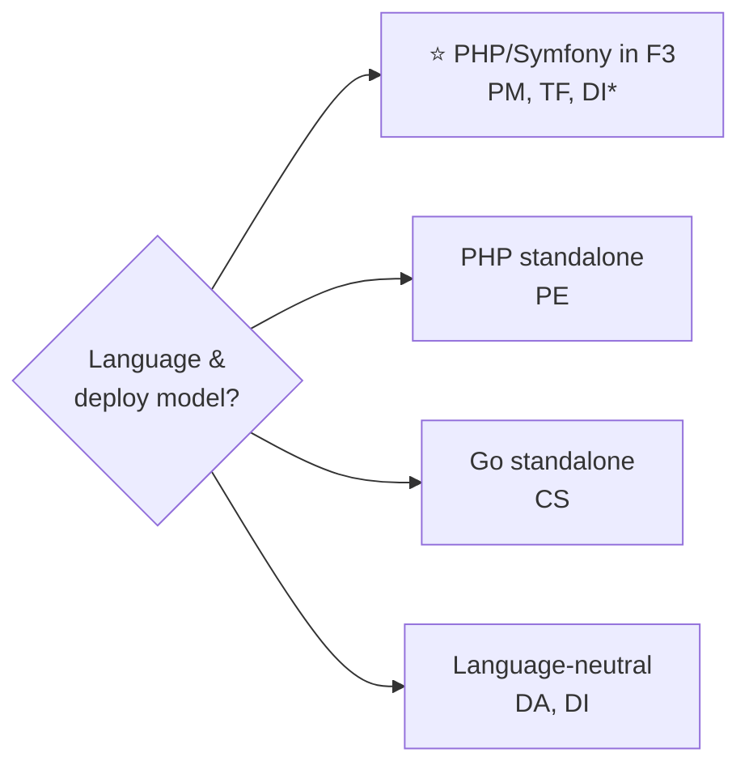
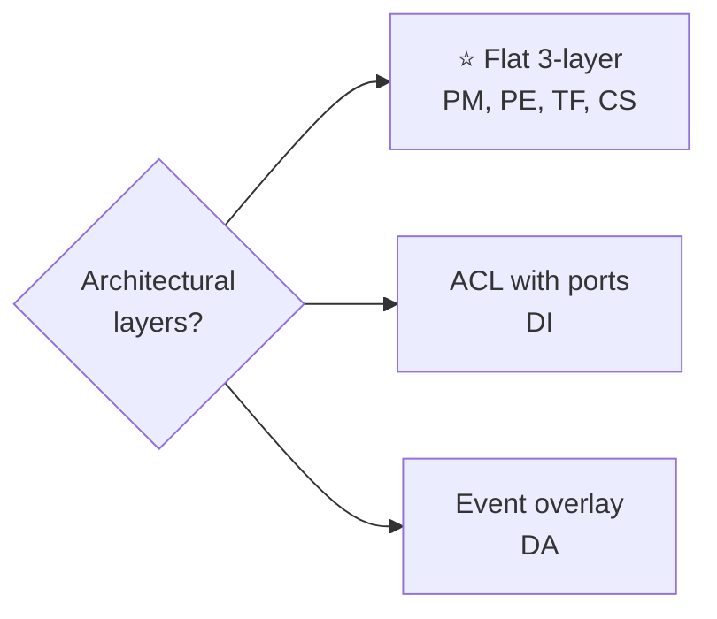
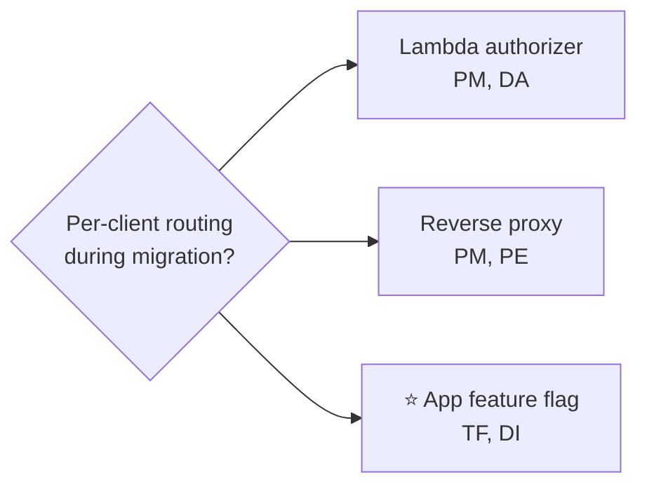
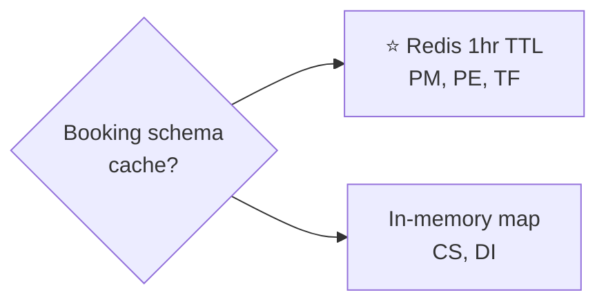
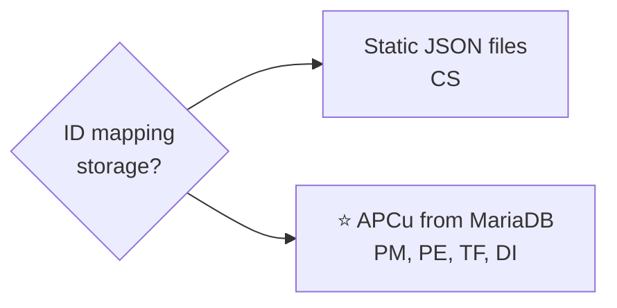
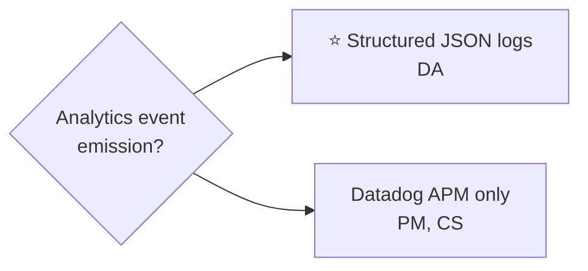
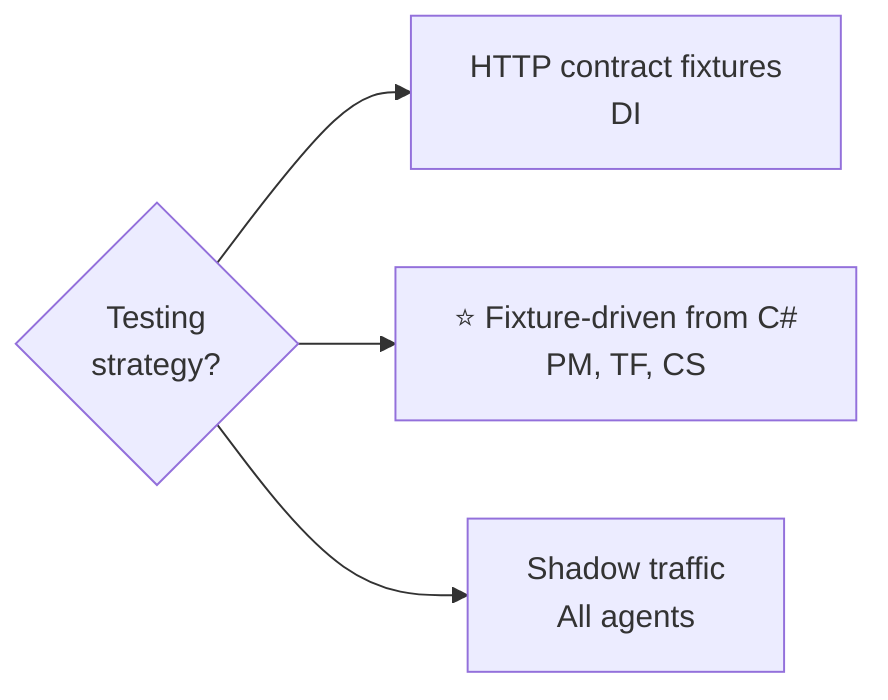
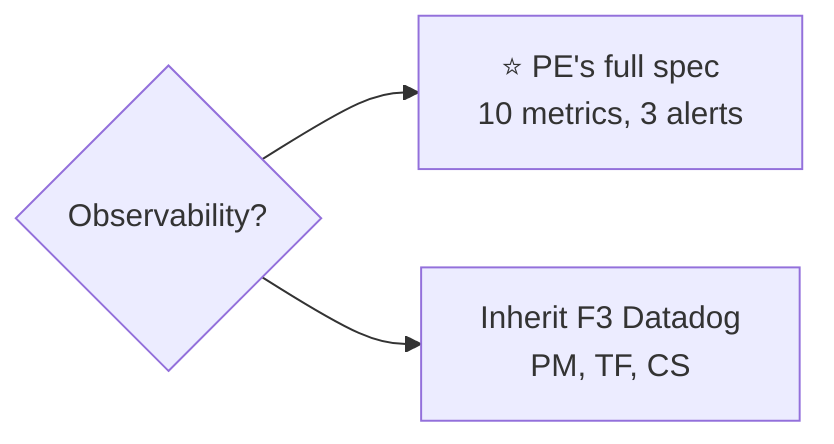

# Decision Map

## 1. Executive Summary

Six design agents analyzed the B2B API transition. All six converge on the core nature of the system: a stateless HTTP translation layer preserving the 13-endpoint client contract while proxying to 12go's API, with no local persistence.

**Phase 3 evaluation scored Clean Slate Designer (Go) highest at 90/130**, driven by best-in-class search performance (C4=5), simplicity (C5=5), and elegance (C10=5). However, the Red Team flagged **conditional fatal flaws**: zero Go expertise in the organization, direct conflict with the "one system" directive, and unconfirmed DevOps willingness to operate Go in production.

**The recommendation is Team-First Developer (PHP/Symfony inside F3) at 84.5/130**, enhanced with overlays from Platform Engineer (observability), Data Flow Architect (event schemas), and Disposable Architecture (lightweight adapter boundary). This design scores highest among organizationally viable options, with the best testing strategy (fixture-driven AI translation from C# tests), the best AI tooling story (AGENTS.md), and alignment with Team Lead's co-location preference.

**Runner-up: Platform Engineer (PHP standalone) at 86.5/130** -- scores higher on observability (C11=5) but recommends a standalone service that Team Lead argued against on Mar 17. Its observability specification is adopted as an overlay.

**Biggest Red Team risks across all designs**: (1) booking schema parser port is the make-or-break deliverable, (2) PHP-FPM per-request memory model vs. in-memory mapping tables is under-addressed, (3) gateway routing for per-client migration is unverified, (4) solo developer is a single point of failure no architecture can solve.

## 2. How to Read This Map

| Symbol | Meaning |
|:---:|:---|
| ✅ | All 6 design agents converged on this (consensus) |
| ⭐ | Recommended by Phase 3 evaluation |
| PM | Pragmatic Minimalist |
| PE | Platform Engineer |
| DA | Data Flow Architect |
| TF | Team-First Developer |
| DI | Disposable Architecture |
| CS | Clean Slate Designer |

**Score references**: See [comparison-matrix.md](comparison-matrix.md) for per-criterion scores and [recommendation.md](recommendation.md) for the full justification.

## 3. Convergences

| # | Decision | Consensus | Agreement |
|---|----------|-----------|-----------|
| 1 | Eliminate local database (DynamoDB, PostgreSQL) | Yes -- rely on 12go as sole source of truth | 6/6 ✅ |
| 2 | Build a thin HTTP translation layer (not a full domain service) | Yes -- stateless proxy with data transformation | 6/6 ✅ |
| 3 | Per-client rollout (not big-bang) | Yes -- migrate clients one at a time with per-client routing | 6/6 ✅ |
| 4 | Transparent client switch (clients change nothing initially) | Yes -- same URLs, same headers, same API keys | 6/6 ✅ |
| 5 | Booking ID mapping table for legacy bookings | Yes -- static one-time export from PostgreSQL BookingEntities | 6/6 ✅ |
| 6 | Booking schema field-name mapping must persist between GetItinerary and CreateBooking | Yes -- short-lived cache (Redis or in-memory) keyed by cart ID | 6/6 ✅ |
| 7 | Webhook authentication must be added (current system has zero auth) | Yes -- IP allowlist as minimum, HMAC as ideal | 6/6 ✅ |
| 8 | Client API key to 12go API key mapping table needed | Yes -- ~20-30 entries, config or database | 6/6 ✅ |
| 9 | Station ID mapping required at the translation layer | Yes -- bidirectional Fuji CMS <-> 12go integer lookup | 6/6 ✅ |
| 10 | Single service (not split into search + booking) | Yes -- 13 endpoints do not justify two deployment units | 6/6 ✅ |
| 11 | Shadow traffic comparison for search validation | Yes -- run parallel requests, compare responses before cutover | 6/6 ✅ |
| 12 | Canary rollout: internal test client first, then low-traffic, then remaining | Yes -- same sequence proposed by all agents | 6/6 ✅ |
| 13 | Booking ID format for new bookings: use 12go bid directly | Yes -- no re-encoding or encryption for new bookings | 6/6 ✅ |
| 14 | In-flight booking safety: cutover per-client, decode KLV or lookup mapping for legacy IDs | Yes -- detect ID format, resolve to 12go bid | 6/6 ✅ |

## 4. Decision Tree

### Architecture & Language

- ⭐ **PHP/Symfony inside F3** (TF=84.5, PM=81) -- one codebase, one deploy, org alignment, Team Lead preference
- **PHP standalone** (PE=86.5) -- independent scaling, but Team Lead prefers co-location
- **Go standalone** (CS=90, highest score) -- best perf/simplicity, but C2=1 Solo Fit, C8=2 Infra Fit, Red Team conditional fatal flaw
- **Language-neutral** (DA=68, DI=76.5) -- not standalone designs, adopt as overlays

*DI evaluates PHP (F3) and .NET (standalone) but does not resolve the choice. DA is language-neutral.

### Architectural Layering

- ⭐ **Flat 3-layer** (handler / mapper / 12go client) + one lightweight outbound interface from DI as pragmatic compromise
- **ACL**: full ACL too expensive for solo dev (C1=2), Red Team warns boundary shortcuts under deadline pressure. Adopt interface pattern only.
- **Event overlay**: adopt DA's structured log events as overlay on recommended design. 5 MVP events, expand post-launch.

### Migration & Routing

**Per-client routing during migration:**

- ⭐ **Recommended: app-level feature flag** -- no DevOps dependency, simplest for solo developer, fallback if gateway routing investigation fails.

**Authentication bridge** -- all 6 agents agree: config/DB mapping table (`client_id` → 12go API key, ~20-30 entries). ✅ Consensus.

**Webhook routing during transition** -- all 6 agents agree: per-client webhook URL in 12go subscriber table with `?client_id=X`. ✅ Consensus.

### Data & Storage

**Booking schema field-name mapping cache:**

- ⭐ **Recommended: Redis** -- PHP-FPM per-request model requires external cache for cross-request state.

**ID mapping table storage:**

- ⭐ **Recommended: APCu per-worker cache** -- persists within FPM worker, avoids per-request Redis lookups on search hot path.

**Booking ID format for new bookings** -- all 6 agents agree: use 12go `bid` directly. ✅ Consensus.

### Notifications & Events

- ⭐ **Recommended: Structured JSON logs** -- adopt DA's event schemas. 5 MVP events (search.completed, booking.created, booking.confirmed, booking.cancelled, notification.received). Datadog Agent collects and forwards to ClickHouse. Kafka upgrade path if data team needs it.

**Webhook authentication** -- all 6 agents agree: IP allowlist first, then HMAC when 12go cooperates. ✅ Consensus.

### Testing & Quality

- ⭐ **Recommended: TF's fixture-driven approach** -- port C# test fixtures first, then AI-generate PHP implementations. Highest-leverage AI workflow.

- ⭐ **Recommended: Adopt PE's observability spec as overlay** -- Datadog auto-instrumentation for 80% value at launch, custom DogStatsD metrics post-MVP.

**CI/CD pipeline** -- clone existing F3 pipeline for PHP approaches (PM, PE, TF). Only CS requires a new Go pipeline. ⭐ **Resolved: F3 pipeline** (follows from D1/D2 PHP-in-F3 decision).

## 5. Decision Summary Table

| ID | Decision | Options | Agents | ⭐ Recommendation | Status |
|---|---|---|---|---|---|
| D1 | Language choice | PHP (PM, PE, TF, DI*), Go (CS), Neutral (DA) | 4→PHP, 1→Go, 1→neutral | ⭐ **PHP** -- organizational alignment, post-departure maintainability, infra fit (C8=5) | **Resolved** |
| D2 | Deployment model | Inside F3 (PM, TF), Standalone PHP (PE), Standalone Go (CS), Either (DI, DA) | Split | ⭐ **Inside F3 monolith** -- Team Lead co-location preference, one codebase, no new infra | **Resolved** |
| D3 | Architectural layering | Flat 3-layer (PM, PE, TF, CS) vs ACL with ports (DI) vs event overlay (DA) | 4 vs 1 vs 1 | ⭐ **Flat 3-layer + one lightweight outbound interface** -- pragmatic 20% of DI's value at 20% of cost | **Resolved** |
| D4 | Eliminate local persistence | Yes — 12go is source of truth | All 6 ✅ | ✅ Consensus | **Resolved** |
| D5 | Per-client rollout mechanism | Lambda authorizer (PM, DA), Reverse proxy (PM, PE), App-level feature flag (TF, DI) | Split | ⭐ **App-level feature flag** -- no DevOps dependency, simplest for solo dev. Investigate gateway routing as potential upgrade. | **Open** -- gateway routing investigation needed |
| D6 | Booking schema caching | Redis (PM, PE, TF) vs In-memory (CS, DI) | 3 vs 2 | ⭐ **Redis with 1hr TTL** -- PHP-FPM per-request model requires external cache | **Resolved** |
| D7 | ID mapping table storage | Static JSON files (CS) vs DB/cached table (PM, PE, TF, DI) | 1 vs 4 | ⭐ **APCu per-worker cache sourced from MariaDB** -- avoids per-request Redis on search hot path | **Resolved** |
| D8 | Event emission strategy | Structured logs (DA) vs Datadog APM/metrics only (PM, PE, TF, CS) | 1 detailed vs 4 minimal | ⭐ **Structured logs (DA approach)** -- 5 MVP events, Kafka upgrade path if data team needs it | **Resolved** (pending data team confirmation) |
| D9 | Webhook authentication | IP allowlist + HMAC (all agree) | All 6 ✅ | ✅ Consensus: IP allowlist immediately, HMAC when 12go cooperates | **Resolved** |
| D10 | Client auth bridge | Config/DB mapping table client_id → 12go key | All 6 ✅ | ✅ Consensus | **Resolved** |
| D11 | Booking ID format (new bookings) | Use 12go bid directly | All 6 ✅ | ✅ Consensus | **Resolved** |
| D12 | Client transition approach | Transparent switch (clients change nothing) | All 6 ✅ | ✅ Consensus | **Resolved** |
| D13 | In-flight booking safety | Cutover per-client, KLV decode + mapping table for legacy IDs | All 6 ✅ | ✅ Consensus | **Resolved** |
| D14 | Encryption of booking IDs | Not addressed by most agents | None resolved | No encryption for new bookings (use 12go bid directly). Open for legacy format. | **Open** -- needs product decision |
| D15 | Observability specification | PE's full spec (10 metrics, 3 alerts) vs minimal (inherit F3 Datadog) | PE detailed, others minimal | ⭐ **Adopt PE's spec as overlay** -- auto-instrumentation for launch, custom metrics post-MVP | **Resolved** |
| D16 | Testing strategy | Contract fixtures (DI), Fixture-driven mapper tests (TF), Shadow traffic (all) | Split | ⭐ **TF's fixture-driven approach** -- port C# fixtures first, AI-generate implementations | **Resolved** |
| D17 | Adapter boundary for disposability | Full ACL (DI) vs no boundary (PM, PE) vs namespace separation (TF) | Split | ⭐ **Lightweight: TF's namespace separation + one outbound interface** | **Resolved** |

## 6. Open Questions

| # | Question | Who answers? | Blocks decision | Default if no answer |
|---|----------|-------------|-----------------|---------------------|
| 1 | Can AWS API Gateway support per-client routing (Lambda authorizer or alternative)? | DevOps | D5 (rollout mechanism) | Use app-level feature flag (TF's approach); no DevOps dependency |
| 2 | What events does the data team require from the new system? | Data team (call pending) | D8 (event emission scope) | Emit 5 MVP structured log events per DA design; expand after call |
| 3 | Does 12go consume any TC Kafka topics (ReservationConfirmationSucceeded, ReservationChanged)? | 12go engineering / DA investigation | D8 (event emission during transition) | Assume no; verify before decommissioning Kafka producers |
| 4 | Should booking ID, itinerary ID, and booking token be encrypted? | Product / Team Lead | D14 | No encryption (use 12go bid directly for new bookings) |
| 5 | Will 12go add HMAC signing to webhook payloads? | 12go engineering | D9 (webhook auth completeness) | Deploy IP allowlist only; add HMAC when available |
| 6 | How does 12go handle per-client pricing/markup? | 12go engineering | Pricing transformation logic | Assume transparent (12go handles markup internally) |
| 7 | What is the recheck mechanism in 12go? | 12go engineering | IncompleteResults endpoint design | Implement 206 Partial Content based on recheck[] field presence |
| 8 | What monitoring/metrics does 12go actively use? | 12go DevOps | Observability design completeness | Align with PE's Datadog design; supplement as gaps are found |
| 9 | Will F3 refactoring target a specific language? | Management / Architecture team | Long-term language alignment argument | Proceed with PHP inside F3; accept potential second migration |
| 10 | Is a named 12go developer assigned as post-departure B2B maintainer? | Team Lead | Post-departure handoff | Document heavily (AGENTS.md), but risk of orphaned code remains |

## 7. Red Team Warnings

Phase 3 Red Team analysis identified the following cross-cutting risks that apply regardless of which design is chosen. Full analysis: [red-team.md](analysis/red-team.md).

### Project-Level Blockers

**1. Station ID mapping data must be extracted from Fuji DynamoDB before implementation begins.**
Every design requires station/operator/POI/seat-class ID mapping on every request. This data lives in Fuji's DynamoDB tables. Fuji is being decommissioned. If the data is not exported into a portable format before Fuji is turned off, the new service cannot translate station IDs and is useless. No design owns this work explicitly. *(Red Team: blocks all designs)*

**2. Gateway routing for per-client migration is unverified.**
Every design depends on per-client routing during migration. AWS API Gateway cannot natively route by path parameter value. Six designs proposed, zero verified routing mechanisms. The app-level feature flag (D5 recommendation) is the mitigation, but it must be validated. *(Red Team: blocks migration strategy)*

### Technical Risks

**3. Booking schema parser is the make-or-break deliverable.**
~1,200 lines of C# with 20+ wildcard field patterns, bracket-notation serialization, and cross-request state. Every design identifies this as the hardest code. None provides a detailed porting plan. Estimates range from "2-3 weeks" (optimistic) to "4-6 weeks" (realistic for a PHP novice). **Recommendation: port it FIRST (weeks 1-2) using C# test fixtures as specification.** *(Red Team: High severity, Medium likelihood)*

**4. PHP-FPM per-request memory model vs. in-memory mapping tables.**
Four designs recommend PHP. None adequately addresses that PHP-FPM creates fresh process state per request. Station ID mapping (~thousands of entries) must be loaded per-request or cached. **Recommendation: use APCu (per-worker persistent cache) for mapping tables. Test search latency impact in week 3.** *(Red Team: Medium severity, High likelihood)*

**5. F3 local development friction is the universal first blocker.**
The Search POC documented setup difficulties. A solo developer losing 30-60 minutes/day to environment issues over 12 weeks is 1-2 lost work weeks. **Recommendation: invest 2 days resolving setup issues before writing business logic. If unresolvable, fall back to PE's standalone PHP service.** *(Red Team: High severity, High likelihood)*

### Organizational Risks

**6. Solo developer is a single point of failure.**
No architecture eliminates this. If Soso is sick for 2 weeks, the project stops. If burnout occurs under the pressure of learning PHP while building 13 endpoints solo under a Q2 deadline, the project fails regardless of design. **Mitigation: reduce scope (7 core endpoints for Q2), add QA resource, schedule daily PHP pairing sessions for weeks 1-2.** *(Red Team: High severity, High likelihood)*

**7. Event/data pipeline goes dark with no replacement plan.**
When .NET services stop, 14 HIGH/CRITICAL Kafka events stop being emitted. Performance dashboards go dark. Client-level metrics cease. Only DA addresses this comprehensively. **Recommendation: adopt DA's structured log event approach. Have the data team call BEFORE implementation starts.** *(Red Team: High severity, High likelihood)*

**8. Post-departure maintainability depends on organizational commitment.**
Soso plans to leave after the transition. PHP code in F3 is maintainable by 12go's team in theory, but only if a named developer is assigned as the B2B module maintainer. Code in the right language with no assigned maintainer is still orphaned. **Recommendation: get explicit commitment from Team Lead that a named 12go developer will own the B2B module post-departure.** *(Red Team: Medium severity, Medium likelihood)*

### Early Warning Signals

| Signal | Threshold | Action |
|---|---|---|
| F3 environment issues | > 1 hour in first 3 days | Fall back to PE's standalone PHP service |
| First complete endpoint (Search) | > 5 working days | Reassess PHP learning curve; consider scope reduction |
| Booking schema parser | Not code-complete by week 3 | Reassess timeline; aggressive scope cut |
| Gateway routing | DevOps has not confirmed approach by end of week 1 | Commit to app-level feature flag (no DevOps dependency) |
| Data team call | Has not happened by implementation start | Emit DA's 5 MVP events by default; adapt later |
