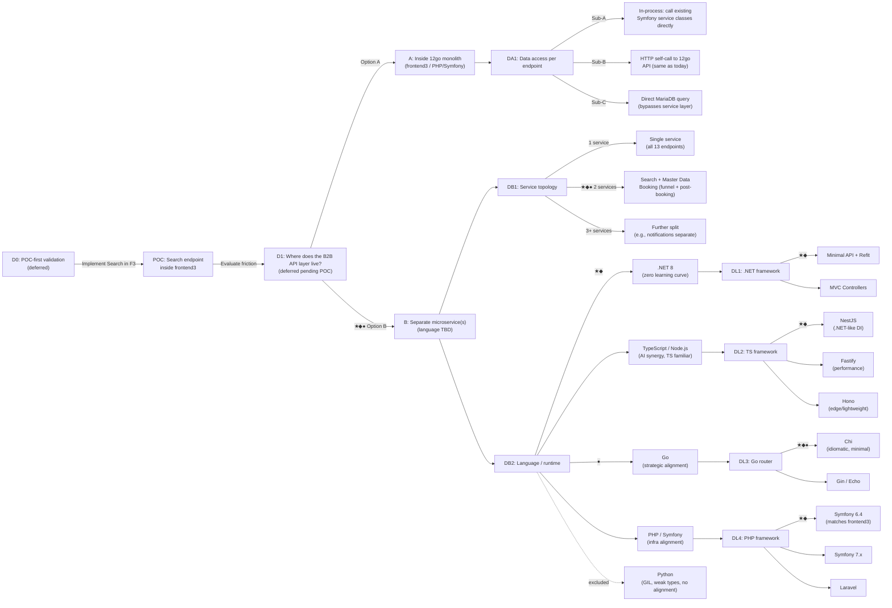
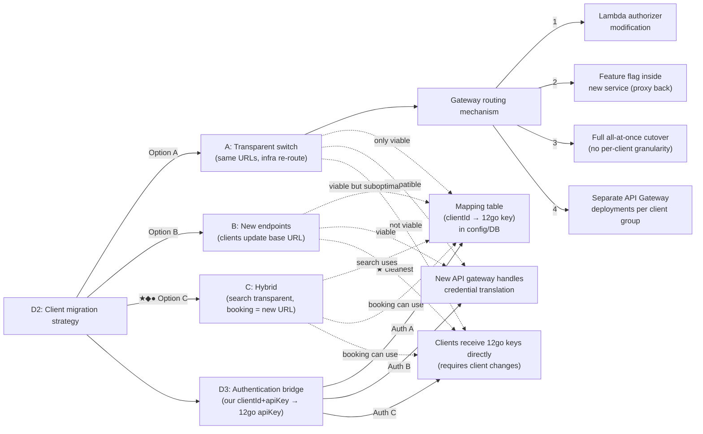
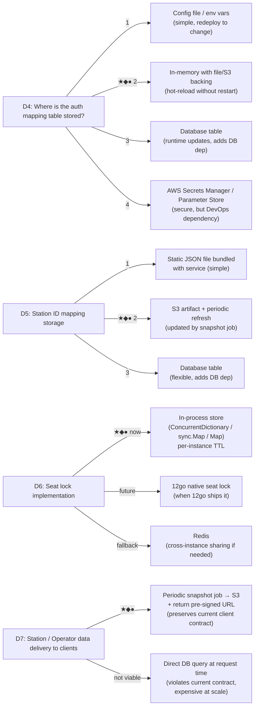
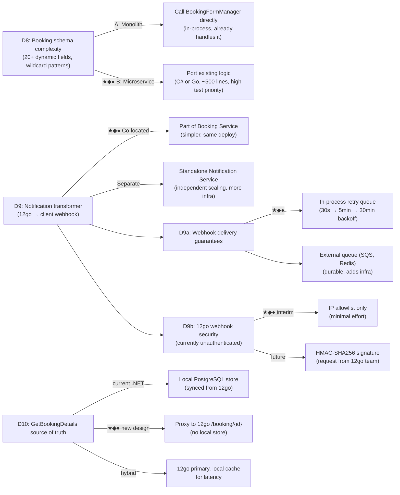

# Decision Map: 12go Transition

This document captures every major fork encountered during the design process, the options considered at each fork, and where applicable the current recommendation. It is meant as a navigational aid — all detail lives in the linked documents.

---

## Meeting Outcome (2026-02-25)

**D1 is deferred** pending a POC. The group agreed to implement the **Search** endpoint inside F3 first to evaluate friction, then revisit the architecture decision. Post-meeting: RnD confirmed the .NET microservice option is still viable; F3 redesign is not this quarter. See [presentation/meeting-record.md](../presentation/meeting-record.md).

---

## How to Read This Map

Each node is a **decision** (a question that must be answered). Each branch is an **option**. Nested sub-decisions only apply if the parent option is chosen.

| Symbol | Version | Reference |
| :---: | :--- | :--- |
| ★ | v1 | [v1/recommendation.md](v1/recommendation.md) |
| ◆ | v2 | [v2/recommendation.md](v2/recommendation.md) |
| ● | v3 | [v3/recommendation.md](v3/recommendation.md) |

When multiple symbols appear on an option, that option is preferred by each corresponding analysis. When versions disagree, each shows its preferred branch.

---

---

---

---

---

## Decision Summary Table

| # | Decision | Options | v1 ★ | v2 ◆ | v3 ● | Reference |
|---|---|---|---|---|---|---|
| D0 | POC-first validation | Search in F3 → revisit D1 | **deferred** | — | — | [poc-plan](poc-plan.md), [meeting-record](../presentation/meeting-record.md) |
| D1 | Where does B2B API layer live? | A: Monolith / B: Microservice | ★ B | ◆ B | ● B | [A-monolith](alternatives/A-monolith/design.md), [B-microservice](alternatives/B-microservice/design.md) |
| DA1 | Monolith data access | In-process / HTTP self-call / Direct DB | (if A) | (if A) | (if A) | [A-monolith](alternatives/A-monolith/design.md) |
| DB1 | Service topology | 1 / **2** / 3+ | ★ 2 | ◆ 2 | ● 2 | [B-microservice](alternatives/B-microservice/design.md) |
| DB2 | Language | .NET / TS / Go / PHP | ★ .NET | ◆ .NET | ● **Go** | [v1](v1/comparison-matrix.md), [v2](v2/comparison-matrix.md), [v3](v3/comparison-matrix.md) |
| DL1 | .NET framework | Minimal API / MVC | ★ Minimal | ◆ Minimal | — | [dotnet](alternatives/B-microservice/languages/dotnet.md) |
| DL2 | TS framework | NestJS / Fastify / Hono | ★ NestJS | ◆ NestJS | — | [typescript](alternatives/B-microservice/languages/typescript.md) |
| DL3 | Go router | Chi / Gin / Echo | ★ Chi | ◆ Chi | ● Chi | [golang](alternatives/B-microservice/languages/golang.md) |
| DL4 | PHP framework | Symfony 6.4 / 7.x / Laravel | ★ Symfony | ◆ Symfony | — | [php-symfony](alternatives/B-microservice/languages/php-symfony.md) |
| D2 | Client migration strategy | A / B / C: Hybrid | ★ C | ◆ C | ● C | [migration-strategy](migration-strategy.md) |
| D3 | Authentication bridge | A: Mapping / B: Gateway / C: Direct keys | ★ A/C | ◆ A/C | ● A/C | [migration-strategy](migration-strategy.md) |
| D4 | Auth mapping storage | Config / **In-memory+S3** / DB / Secrets | ★ 2 | ◆ 2 | ● 2 | [B-microservice](alternatives/B-microservice/design.md) |
| D5 | Station ID mapping storage | Static / **S3 artifact** / DB | ★ 2 | ◆ 2 | ● 2 | [B-microservice](alternatives/B-microservice/design.md) |
| D6 | Seat lock | **In-process** / 12go native / Redis | ★ 1 | ◆ 1 | ● 1 | [B-microservice](alternatives/B-microservice/design.md) |
| D7 | Station data delivery | **Snapshot+S3** / Direct DB | ★ 1 | ◆ 1 | ● 1 | [stations](../current-state/endpoints/stations.md) |
| D8 | Booking schema handling | In-process / **Port mapper** | ★ B | ◆ B | ● B | [dotnet](alternatives/B-microservice/languages/dotnet.md) |
| D9 | Notification transformer | **Co-located** / Separate | ★ 1 | ◆ 1 | ● 1 | [B-microservice](alternatives/B-microservice/design.md) |
| D9a | Webhook delivery | **In-process retry** / External queue | ★ 1 | ◆ 1 | ● 1 | [B-microservice](alternatives/B-microservice/design.md) |
| D9b | 12go webhook security | **IP allowlist** / HMAC future | ★ 1 | ◆ 1 | ● 1 | [B-microservice](alternatives/B-microservice/design.md) |
| D10 | GetBookingDetails source | Local DB / **Proxy 12go** / Cache | ★ 2 | ◆ 2 | ● 2 | [B-microservice](alternatives/B-microservice/design.md) |

---

## Open / Unresolved Decisions

These decisions cannot be made without external input:

| # | Question | Blocking | Who answers |
|---|---|---|---|
| G1 | Can AWS API Gateway route by `client_id` path parameter? | D2-A, per-client gradual rollout | DevOps |
| G2 | Does a Lambda authorizer already exist? Can it be modified? | D2-A routing option 1 | DevOps |
| G3 | What is 12go's preferred language for new services? (Go confirmed?) | DB2 strategic alignment | 12go leadership |
| G4 | Will 12go DevOps support a .NET 8 Docker container on their infra? | DB2 final choice | 12go DevOps |
| G5 | Does a `clientId → 12go apiKey` mapping already exist anywhere? | D3, D4 | 12go / Management |
| G6 | Can 12go add HMAC signing to their webhooks? | D9b | 12go engineering |
| G7 | Will 12go ship a native seat lock API? ETA? | D6 | 12go engineering |
| G8 | Source for the periodic station snapshot job upstream feed (post-Fuji retirement)? | D7 | 12go / Management |
