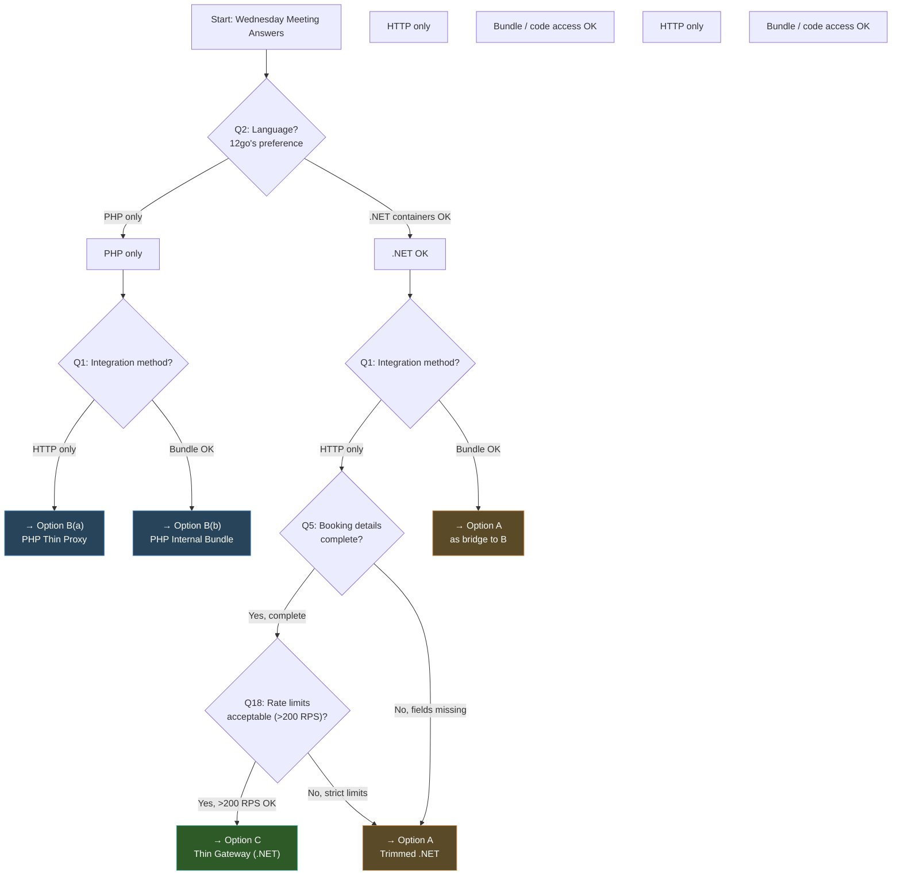

# Evaluation Matrix: Migration Architecture Options

## 1. Executive Summary

Three architecture options have been designed for migrating a 7-service .NET booking platform to 12go's PHP infrastructure, and four specialist reviewers have stress-tested each design from different angles. **The headline: there is no single winner — the best option depends entirely on answers to Q1-Q3 that remain unknown until the Wednesday meeting.** Option A (Trimmed .NET) is the fastest and safest to ship but creates a permanent polyglot tax that every reviewer flags as dangerous. Option B (PHP Native Bundle) is the best long-term architecture from DevOps and maintenance perspectives but carries the highest short-term execution risk due to language ramp-up and dependency on 12go team cooperation. Option C (Thin Gateway) is the most architecturally elegant and AI-friendly but is fragile under real-world scope pressure — the architecture doc itself admits it will likely grow into Option A within 18 months.

What surprised us: the FP and AI-first reviewers both scored Option B dead last (19/40 and 20/40 respectively), while the DevOps reviewer scored it highest (35/40). This reveals a fundamental tension between **developer experience** (where simplicity and type safety win) and **operational sustainability** (where single-stack and zero new infrastructure wins). The business risk reviewer broke the tie by recommending Option A as a short-term bridge to Option B — a hybrid path that is pragmatic but doubles the total migration effort. All four reviewers agree on one thing: **do not start building before Q1-Q3 are answered**, as any single answer could kill an entire option overnight.

---

## 2. Evaluation Criteria Definitions

| # | Criterion | Definition | Scale |
|---|-----------|-----------|-------|
| 1 | **Maintainability** | How easy is the system to maintain long-term by the team that will own it (likely 12go). Includes code readability, debugging ease, and knowledge transfer effort. | 1 = nightmare, 5 = trivial |
| 2 | **Development Speed** | How fast can new features be built after migration is complete. Measures day-to-day velocity, not initial build time. | 1 = very slow, 5 = very fast |
| 3 | **Infrastructure Fit** | How well the option fits 12go's existing infrastructure (PHP-FPM, K8s, MySQL, Redis, Kafka). Penalizes new infrastructure requirements. | 1 = poor fit, 5 = native fit |
| 4 | **Implementation Effort** | Total effort to reach production, including hidden costs. Higher score = less effort. Based on realistic estimates from business risk review. | 1 = massive, 5 = minimal |
| 5 | **Elegance** | Architectural cleanliness, coherence, and principle adherence. How well does the design hold together conceptually? | 1 = ad-hoc, 5 = pristine |
| 6 | **Simplicity** | How easy to understand and onboard new engineers. Measures cognitive load, not code volume. | 1 = complex, 5 = obvious |
| 7 | **Scalability** | How well it handles 12go's traffic scale (SE Asia, LATAM markets, ~500+ RPS search). | 1 = bottleneck, 5 = elastic |
| 8 | **Observability** | How easy to debug and monitor in production. Includes filtering by clientId, bookingId, operator. | 1 = opaque, 5 = transparent |
| 9 | **Risk** | Migration and operational risk combined. Includes execution risk, pricing regression risk, rollback safety. Higher = safer. | 1 = dangerous, 5 = safe |
| 10 | **AI-Friendliness** | How well it works with AI development tools (Cursor, Claude Code, Copilot). Measures navigability, type safety, convention consistency. | 1 = hostile, 5 = optimal |

---

## 3. The Evaluation Matrix

### Scores with Justifications

| Criterion | Option A: Trimmed .NET | Option B: PHP Native Bundle | Option C: Thin Gateway |
|---|---|---|---|
| **Maintainability** | **3** — Proven code, but polyglot tax means 12go can't own it without .NET skills. Dependency drift risk on internal NuGet packages. | **4** — Single PHP stack, 12go team can maintain. Coupling to frontend3 internals creates ongoing breakage risk (~every 3-4 months). | **3** — Simple today, but scope creep degrades maintainability. New pricing code lacks production history of Ushba SDK. |
| **Development Speed** | **3** — Standard 3-layer .NET pattern; ~4-6 files per new endpoint. Internal SDK dependencies slow AI-assisted development. | **4** — In-process frontend3 calls mean features that exist in frontend3 are trivial to expose. But must understand 968-file codebase for new work. | **5** — One pattern for all endpoints. ~3-4 files per new endpoint. Fastest AI-assisted development (5-10 min per feature). |
| **Infrastructure Fit** | **2** — Requires .NET containers on PHP infrastructure. Two image supply chains, two CI/CD pipelines, new Redis instance. | **5** — Same Docker image as frontend3. Zero new databases, caches, or CI pipelines. Uses existing MySQL/Redis/Memcached. | **3** — Requires .NET containers + new Redis. No Kafka initially (may need to add). Same polyglot infra issue as Option A. |
| **Implementation Effort** | **4** — Realistic: 31-43 person-weeks (16-22 calendar weeks, 2 engineers). Least new code; mostly extraction and deletion. | **2** — Realistic: 35-47 person-weeks (18-24 calendar weeks). PHP ramp-up (6-8 weeks realistic), 12go coordination overhead dominates. | **3** — Realistic: 35-47 person-weeks (18-24 calendar weeks). More new code than A, scope creep adds unplanned work. |
| **Elegance** | **3** — Competent consolidation. Anti-corruption layer is correct. But no architectural innovation — just fewer services doing the same thing. | **3** — Clean adapter pattern in theory. In practice, thin FP veneer over deeply imperative frontend3 internals. Coupling undermines the design. | **4** — Closest to pure function pipeline. Self-contained tokens, minimal state, explicit limitations. Loses a point for "pricing makes it impure." |
| **Simplicity** | **3** — Standard .NET layered architecture. 4 projects for ~100 files adds unnecessary navigation. Kafka adds conceptual weight. | **2** — The bundle itself is simple (30 files), but understanding it requires grasping 968 PHP files of frontend3 internals, binary data formats, and Symfony event system. | **5** — One service, one Redis, one pattern per endpoint. Any engineer can trace a request end-to-end in minutes. |
| **Scalability** | **4** — .NET is ~15x faster than PHP for HTTP handling. Stateless design scales horizontally. 2-15 pods with HPA. | **3** — PHP-FPM is less efficient per-request. Shared MySQL/Redis with frontend3 creates contention risk. Separate pod group mitigates blast radius. | **4** — Nearly stateless. Self-contained tokens eliminate Redis as scaling bottleneck. 2-10 pods. Connection pooling to 12go is the limit. |
| **Observability** | **4** — Existing Grafana dashboards and Coralogix queries carry over. Mature .NET OTel SDK. Kafka events provide audit trail. | **3** — Must rebuild all dashboards from scratch (~1-2 weeks). PHP OTel is mature but less than .NET. In-process traces are simpler but opaque into frontend3. | **4** — Single-service traces are the simplest to debug. But no Kafka means no audit trail — must add booking events (reviewers unanimous). |
| **Risk** | **4** — Lowest execution risk. Proven code, proven team skills. Clean rollback at every phase. Kill risk: 12go refuses .NET containers. | **2** — Highest execution risk. New language, tight coupling to undocumented APIs, pricing port risk, heavy 12go dependency. Kill risk: 12go rejects bundle. | **3** — Moderate risk. BookingToken fragility, scope creep probability "very high" (business risk reviewer). Kill risk: Q5 reveals incomplete booking data. |
| **AI-Friendliness** | **4** — Strong types, clean structure, existing AGENTS.md culture. Internal SDK opacity is the weakness. 34/40 from AI reviewer. | **2** — 968-file codebase, binary data, unversioned APIs, weak PHP types. 20/40 from AI reviewer. The worst option for AI tools. | **5** — 39/40 from AI reviewer. Convention consistency is perfect. Every endpoint follows one pattern. AI can add features in 5-10 minutes. |

### Weighted Totals

Given the transition context (migrating a revenue-critical system with unanswered questions), **implementation effort and risk are weighted highest** (×2), followed by infrastructure fit and maintainability (×1.5). All others are ×1.

| Criterion | Weight | Option A | Option B | Option C |
|---|:---:|:---:|:---:|:---:|
| Maintainability | ×1.5 | 4.5 | 6.0 | 4.5 |
| Development Speed | ×1 | 3 | 4 | 5 |
| Infrastructure Fit | ×1.5 | 3.0 | 7.5 | 4.5 |
| Implementation Effort | ×2 | 8 | 4 | 6 |
| Elegance | ×1 | 3 | 3 | 4 |
| Simplicity | ×1 | 3 | 2 | 5 |
| Scalability | ×1 | 4 | 3 | 4 |
| Observability | ×1 | 4 | 3 | 4 |
| Risk | ×2 | 8 | 4 | 6 |
| AI-Friendliness | ×1 | 4 | 2 | 5 |
| **Weighted Total** | | **44.5** | **38.5** | **48.0** |
| **Rank** | | **2nd** | **3rd** | **1st** |

**Option C wins on weighted score**, driven by simplicity, development speed, and AI-friendliness. **Option A is second**, winning on implementation effort and risk. **Option B is third**, despite winning on infrastructure fit and maintainability — its poor implementation effort and risk scores drag it down in a transition context.

> **Critical caveat**: These weights assume .NET containers are acceptable. If 12go mandates PHP-only, Option B's infrastructure fit score jumps to the only viable path.

---

## 4. Reviewer Consensus and Disagreements

### Where All Four Reviewers Agree

1. **Do not start before Q1-Q3 are answered.** Every reviewer states this explicitly. The business risk reviewer calls it the "final warning."
2. **Pricing regression is the scariest risk.** All options port or reuse the markup logic, and all reviewers flag golden file tests with 1,000+ calculations as mandatory.
3. **Option B(c) — direct database access — should never be attempted.** Universally rejected.
4. **Kafka should be reduced from 30+ to ~5 topics**, and most analytics events should move to OpenTelemetry. (Even the FP reviewer agrees, though they insist `booking.lifecycle` events must survive.)
5. **Rollback safety is comparable across all options** (5-15 minute ingress switch). The booking data is always in 12go.

### Key Disagreements and Tension Points

#### FP Architect loves Option C, DevOps loves Option B — why?

The FP architect evaluates **code quality and compositional purity**. Option C's linear pipeline (`Validate → Transform → Call → Transform → Price → Return`) is the closest to a functional ideal: data flows through typed transformations, state is carried in self-contained tokens, and side effects are minimized. Option B embeds our code inside frontend3's deeply imperative, mutable-state architecture — the FP architect calls it "a thin FP veneer over a deeply imperative core" and scores it 19/40.

The DevOps engineer evaluates **what breaks at 3 AM**. Option B uses the same Docker image as frontend3, shares existing MySQL/Redis/Memcached, has zero new CI pipelines, and eliminates the polyglot tax (saving 8-12 weeks/year in operational overhead). The DevOps engineer doesn't care about function composition — they care about having one language stack, one deployment pipeline, and one team that can debug everything. They score Option B 35/40.

**Resolution**: These are genuinely different priorities. If the team will own the system for years, DevOps is right — operational sustainability trumps architectural purity. If the team will hand off the system within 6-12 months and wants to build it quickly, FP/AI-first perspectives matter more.

#### Business Risk Assessor suggests Option A as a bridge — does it make sense?

The business risk reviewer recommends Option A for months 0-6, then incrementally porting to PHP (Option B) for months 8-18. The logic: Option A is fastest to production (least new code, existing team skills), and once running, it becomes a living specification for the PHP port.

**Strengths of the hybrid path**: Lowest initial risk, preserves optionality, the running .NET service validates all edge cases before rewriting.

**Weaknesses**: The business risk reviewer themselves warns that "in 10 years of production ops, I have never seen a 'temporary' bridge get decommissioned on schedule." The DevOps reviewer quantifies the polyglot tax at 8-12 weeks/year. If the PHP rewrite takes 15-20 person-weeks and the tax is 10 weeks/year, the break-even is Year 1-2. Going directly to PHP (Option B) is cheaper by Year 2 — **if you can survive the execution risk.**

#### AI-first reviewer strongly prefers Option C — is it aligned with business needs?

The AI reviewer scores Option C 39/40 and Option A 34/40. The gap comes from convention consistency (5 vs 4), simplicity (5 vs 3), and modification speed (5 vs 4). Option C is unquestionably the best for AI-assisted development — adding a new endpoint takes 5-10 minutes vs 10-15 for Option A and 30-45 for Option B.

**But**: The business risk reviewer warns that Option C's scope will creep ("Week 24: Congratulations, you've built Option A"). If the gateway grows to 250+ files, the AI-friendliness advantage erodes. The AI reviewer's score assumes the gateway stays thin, which the business risk reviewer rates as "very high" probability of failure.

**Alignment with business needs**: If the team uses AI tools heavily (as indicated by the supply-integration repo's AGENTS.md culture), Option C's AI-friendliness is a genuine productivity multiplier. But the business needs also include long-term maintenance by 12go's PHP team, which conflicts with a .NET gateway.

---

## 5. Sensitivity Analysis

How would scores change based on Q1-Q20 answers?

| Question | If Answer Is... | Winner Shifts From → To | Impact |
|---|---|---|---|
| **Q1**: Integration method | "Keep HTTP only" | No shift. A and C remain viable via HTTP. B works via B(a) thin proxy sub-variant. | Low — all options support HTTP |
| **Q1**: Integration method | "Direct code access OK (Symfony bundle)" | C → **B**. Option B's internal bundle becomes strongly preferred — eliminates network hop, maximizes code reuse. C is redundant. | **Critical** — B becomes dominant |
| **Q2**: Language | "PHP only, no .NET" | A is **dead**. C survives only if rewritten in PHP (losing code reuse advantage). **B is the only viable path.** | **Critical** — eliminates 2 options |
| **Q2**: Language | ".NET containers OK" | No shift. All options viable. Choose on merit. | Low — happy path |
| **Q3**: Infrastructure | "No K8s, bare metal PHP-FPM" | A and C become significantly harder (no container orchestration). **B wins** (runs natively in PHP-FPM). | **High** — A and C need major rework |
| **Q3**: Infrastructure | "AWS EKS (Kubernetes)" | No shift. All options work as designed. | None — assumed baseline |
| **Q3**: Infrastructure | "AWS ECS/Fargate" | Minor rework for all options. B may need sidecar patterns. +1-2 weeks. | Low |
| **Q5**: Booking storage | "GET /booking/{id} returns everything" | No shift. C's "no DB" premise holds. | None — good for all |
| **Q5**: Booking storage | "Some fields missing" | C's core premise breaks — needs a DB, converging toward A. **C → A or B**. | **High** — C loses its advantage |
| **Q7**: Seat locking | "12go adds seat lock API" | All options simplify slightly. C benefits most (can remove only Redis use case). | Low |
| **Q14**: Monitoring | "No OTel, proprietary system" | All options lose cross-boundary tracing equally. Log correlation only. | Medium — affects all equally |
| **Q17**: Credit line | "12go handles credit" | All options drop CreditLineProvider. C becomes thinner. | Low-Medium |
| **Q18**: Rate limits | "Strict limits (<100 RPS)" | C must add heavy caching → no longer thin. **C → A**. | **High** — C's model breaks |
| **Q18**: Rate limits | ">500 RPS, no limit" | No shift. All options work. C benefits most (stateless pass-through). | None |
| **Q19**: Cart TTL | "Very short (<5 min)" | C's self-contained token approach more fragile. A's Redis tokens more resilient. | Medium |

### Critical Combinations

| Combination | Outcome |
|---|---|
| Q2="PHP only" + Q1="bundle OK" | **Option B is the only path.** No debate needed. |
| Q2="PHP only" + Q1="HTTP only" | Option B(a) PHP Thin Proxy. Painful: PHP ramp-up without frontend3 code reuse. |
| Q5="fields missing" + Q18="strict limits" | **Option C is dead.** Needs DB + cache = heavier than A with less proven code. |
| Q1="HTTP" + Q2=".NET OK" + Q3="K8s" | **Happy path.** All options viable. Choose on merit (see weighted matrix above). |
| Q1="bundle OK" + Q2=".NET OK" + Q3="K8s" | **Maximum optionality.** Hybrid path becomes viable. B is attractive for long-term, A for short-term. |

---

## 6. Effort Comparison

### Design Estimates vs Realistic Estimates

| | Option A | Option B | Option C |
|---|:---:|:---:|:---:|
| **Architecture doc estimate** | 16 pw | 17 pw (incl. ramp-up) | 20 pw |
| **Business risk "likely" estimate** | 26-30 pw | 30-36 pw | 32-38 pw |
| **Hidden costs** (coordination, knowledge transfer, monitoring, bug fixing) | +15-27 pw | +18-30 pw | +15-27 pw |
| **Realistic total** | **31-43 pw** | **35-47 pw** | **35-47 pw** |
| **Calendar time (2 engineers)** | **16-22 weeks** | **18-24 weeks** | **18-24 weeks** |

### Breakdown by Phase

| Phase | Option A | Option B | Option C |
|---|---|---|---|
| **Foundation** (setup, extraction) | 6 pw — extract from 4 repos, wire DI | 4 pw — bundle scaffolding, routing, auth + **4 pw PHP ramp-up** | 5 pw — extract 12go client, pricing engine, Redis |
| **Core features** (search + booking) | 5 pw — strip MediatR, collapse SI, Redis swap | 6 pw — adapters wrapping frontend3 services | 7 pw — implement all endpoint translations |
| **Post-booking + cross-cutting** | 3 pw — post-booking, Kafka, observability | 4 pw — post-booking, pricing port, Kafka, OTel | 4 pw — post-booking, webhook, optional Kafka |
| **Validation + cutover** | 6 pw — contract tests, shadow traffic, canary | 5 pw — contract tests, shadow, canary | 5 pw — shadow traffic, canary |
| **Hidden costs** (all options) | 15-27 pw | 18-30 pw | 15-27 pw |

### Hidden Costs Identified by Reviewers

| Hidden Cost | Person-Weeks | Source |
|---|:---:|---|
| Coordination with 12go (meetings, access, reviews, waiting) | 4-8 | Business Risk |
| Knowledge transfer & documentation | 3-5 | Business Risk |
| Client communication & testing support | 1.5-3.5 | Business Risk |
| Monitoring/alerting setup + dashboard rebuild | 2.5 | Business Risk, DevOps |
| Performance tuning (connection pools, cold start, latency) | 2-3.5 | DevOps |
| Bug fixing during parallel run | 2-4 | Business Risk ("single most underestimated cost") |
| **Total hidden costs** | **15-27.5** | |

---

## 7. The Hybrid Path

The business risk reviewer proposes: **Phase 1: Option A (quick .NET trim), Phase 2: port to PHP (Option B approach).**

### Is a Two-Phase Migration Wise or Wasteful?

**Arguments for the hybrid path:**

1. **Risk sequencing**: Phase 1 validates all edge cases, pricing accuracy, and 12go API behavior. Phase 2 benefits from this knowledge — the running .NET service becomes a living specification.
2. **Time to production**: Option A reaches production 4-8 weeks before B or C. For a revenue-critical system, shorter migration windows reduce risk.
3. **Preserves optionality**: If Q1-Q5 answers shift the landscape, a running .NET service is a valid starting point for any direction.
4. **Team continuity**: Engineers work in their strongest language first, learn PHP incrementally for Phase 2.

**Arguments against:**

1. **Double the effort**: Phase 1 (31-43 pw) + Phase 2 (~15-20 pw port) = 46-63 pw total. Going directly to Option B costs 35-47 pw — saving 11-16 person-weeks.
2. **"Temporary" bridges become permanent**: The business risk reviewer's own data: "in 10 years, I have never seen a temporary bridge decommissioned on schedule." The DevOps reviewer calls this the "#1 operational risk."
3. **Polyglot tax accumulates**: At 8-12 weeks/year, the tax during the bridge period (6-18 months) costs 4-12 additional person-weeks.
4. **Organizational fatigue**: Two consecutive migrations drain the team. By the time Phase 2 starts, priorities may have shifted.

### Hybrid Path Total Effort

| Phase | Effort | Calendar |
|---|:---:|:---:|
| Phase 1: Build & deploy Option A | 31-43 pw | 16-22 weeks |
| Stabilization gap | 4-8 pw | 4-8 weeks |
| Phase 2: Port to PHP (Option B) | 15-20 pw | 8-12 weeks |
| Phase 2 validation + cutover | 8-12 pw | 6-8 weeks |
| **Total hybrid** | **58-83 pw** | **34-50 weeks** |
| **Direct Option B** | **35-47 pw** | **18-24 weeks** |
| **Overhead of hybrid vs direct** | **+23-36 pw** | **+16-26 weeks** |

### Risk Profile

| | Direct to B | Hybrid (A→B) |
|---|---|---|
| Execution risk (Phase 1) | High (new language + coupling) | Low (existing skills + proven code) |
| Execution risk (Phase 2) | N/A | Medium (PHP port with living spec) |
| Polyglot tax | None | 8-12 weeks/year during bridge |
| Total effort | 35-47 pw | 58-83 pw |
| Time to first production deploy | 18-24 weeks | 16-22 weeks |
| Probability of reaching final state | ~75% (single shot) | ~50% (Phase 2 often gets cancelled) |

**Verdict**: The hybrid path is wise only if the team has low confidence in executing Option B directly AND has organizational commitment to Phase 2 (e.g., contractual sunset date). Without a binding sunset clause, the hybrid path is an expensive way to build Option A permanently.

---

## 8. Preliminary Recommendation

### If 12go accepts .NET containers (Q2=".NET OK", Q3="K8s")

**Recommend: Option C (Thin Gateway)** with the following conditions:

- Add `booking.lifecycle` Kafka events (all reviewers agree on this)
- Commit to the ~150-file / 3-Redis-data-type guardrail as a CI check
- Create AGENTS.md and .cursorrules from day one
- If the gateway exceeds guardrails within 6 months, consciously evolve to a richer Option A architecture

**Rationale**: Option C wins the weighted matrix (48.0 vs 44.5 for A). Its AI-friendliness advantage is real for a team that already has AI-first development culture. The scope creep risk is mitigable with discipline. The implementation effort is comparable to Option A once hidden costs are included.

**Second choice**: Option A if the team prefers proven code reuse over architectural innovation, or if the scope is likely to grow beyond a thin gateway.

### If 12go requires PHP only (Q2="PHP only")

**Recommend: Option B** — but prefer the **(a) PHP Thin Proxy** sub-variant over (b) internal bundle, unless 12go explicitly invites code contributions to frontend3.

- B(a) scores ~28-30/40 on AI-friendliness (vs B(b)'s 20/40)
- B(a) has clear boundaries, its own codebase, and isolated testing
- B(b) is preferable only with strong 12go partnership and explicit bundle invitation

**Rationale**: PHP-only eliminates Options A and C. Among the B sub-variants, B(a) preserves developer productivity while staying in PHP. Budget 6-8 weeks of PHP ramp-up before starting.

### If integration method is HTTP only (Q1="HTTP")

**Recommend: Option C** if .NET is acceptable, **Option B(a)** if PHP is required.

Both are HTTP translation layers. Option C is architecturally cleaner, better typed, and more AI-friendly. Option B(a) avoids the polyglot tax but at the cost of developer experience.

### If integration method includes code access (Q1="bundle OK")

**Recommend: Option B(b) — internal bundle** as the long-term target.

Direct code access eliminates the HTTP hop and maximizes reuse of frontend3's business logic. This is the scenario where Option B's strengths (90% code reuse, in-process calls, zero new infrastructure) fully materialize. The FP and AI-first concerns about coupling become acceptable trade-offs.

**Consider the hybrid path (A→B) only if**: the team has zero PHP experience and the timeline is aggressive. Use Option A to buy time while the team ramps up on PHP.

### Caveats That Could Change These Recommendations

1. **Q5 reveals incomplete booking data** → Option C becomes impractical (needs DB)
2. **Q18 reveals strict rate limits** → Option C needs heavy caching (loses "thin" advantage)
3. **12go's internal APIs are highly unstable** → Option B becomes a maintenance nightmare
4. **Team members strongly resist PHP** → Option A with sunset clause is the only viable path
5. **Multiple suppliers return** → All three options are inadequate; re-evaluate SI Framework

---

## 9. Decision Tree

---

## 10. Next Steps

### Priority 1: Wednesday 12go Meeting (Feb 18)

Ask these questions **in this order** — each subsequent answer depends on the previous:

1. **Q2 — Language**: "Are you willing to run .NET containers on your infrastructure, or do you require PHP for all new services?" → This single answer eliminates 0-2 options immediately.
2. **Q1 — Integration method**: "Would you prefer we call your HTTP API, or would you accept a Symfony bundle contributed directly to frontend3?" → Determines architecture style.
3. **Q3 — Infrastructure**: "What orchestration do you use? K8s, ECS, bare metal?" → Determines deployment model.
4. **Q5 — Booking completeness**: "Does `GET /booking/{id}` return net price, cancellation policies, passenger details, and segments?" → Determines if we need local storage.
5. **Q18 — Rate limits**: "What rate limits apply to your search endpoint? Can we do 500+ RPS directly?" → Determines if caching is mandatory.

**Secondary questions** (if time permits): Q4 (multi-client), Q14 (monitoring), Q7 (seat lock), Q8 (webhooks).

### Priority 2: Prototype Regardless of Option

**Start immediately, before the meeting:**

1. **Record Pact contracts** from current production .NET system (all endpoint responses). This is needed by every option and takes ~1 week.
2. **Extract golden file pricing test data** — 1,000+ real price calculations from production logs. Needed by every option.
3. **Deploy a "hello world" pod** on 12go staging (if access exists). Test .NET container viability.

### Priority 3: Decisions We Can Make Now

| Decision | Answer | Rationale |
|---|---|---|
| Eliminate SI Framework abstraction | Yes | Only one supplier. All reviewers agree. |
| Eliminate DynamoDB | Yes | 12go is source of truth. All options agree. |
| Reduce Kafka topics from 30+ to ~5 | Yes | Audit consumers first, but the consolidation is unanimous. |
| Keep Fuji separate | Yes (initially) | Different lifecycle, different scaling. Can absorb into PHP later. |
| Preserve client API contracts byte-for-byte | Yes | Zero client-side changes is a hard requirement. |
| Use OTel for observability | Yes | All options converge on OTel + Coralogix/Grafana. |
| Add `booking.lifecycle` events to Kafka | Yes | Even Option C should have this (FP reviewer, DevOps reviewer agree). |

### Priority 4: Decisions That Must Wait

| Decision | Waiting For | Expected Date |
|---|---|---|
| Which option to build | Q1, Q2, Q3 answers | Wednesday meeting |
| Whether to add local booking storage | Q5 answer | Wednesday meeting |
| Whether to add search caching | Q18 answer | Wednesday meeting |
| .NET vs PHP for implementation | Q2 answer | Wednesday meeting |
| Internal bundle vs HTTP proxy | Q1 answer | Wednesday meeting |
| Hybrid path (A→B) vs direct B | Team capability assessment + Q1/Q2 | 1 week after meeting |

---

*This evaluation matrix synthesizes 3 architecture designs and 4 specialist reviews (event-driven/FP, AI-first, business risk, DevOps/platform). It is designed to be the definitive document for choosing the migration path forward. The recommendation is conditional on Wednesday's Q1-Q3 answers — revisit this matrix after the meeting with actual data.*
