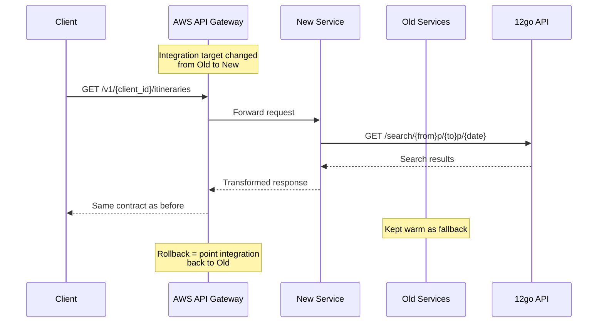
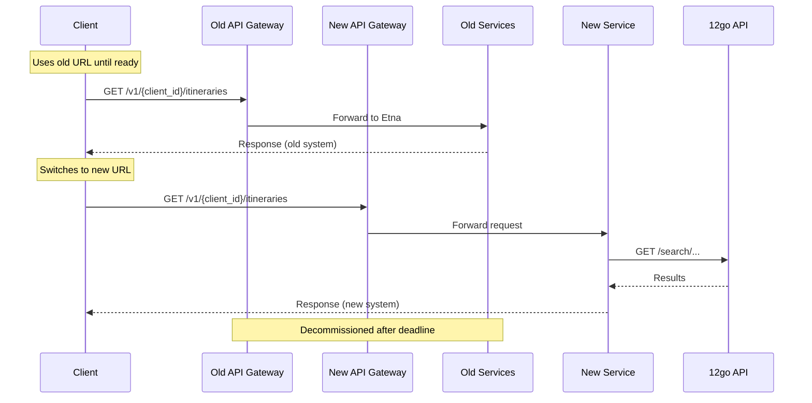
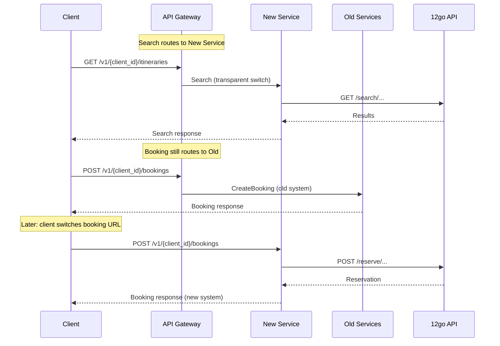
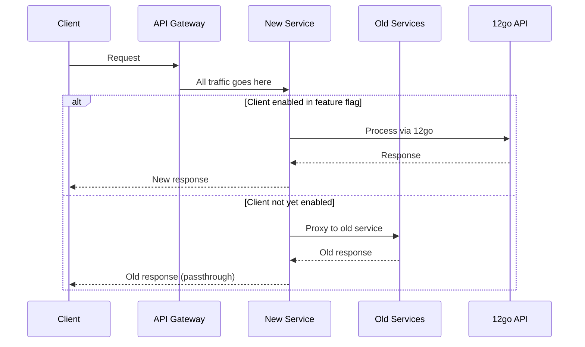

# Migration Strategy

## Problem Statement

The [recommendation](recommendation.md) and [architectural comparison](architectural-comparison.md) documents answer **what** to build: a single stateless proxy service replacing 342 projects across 4 repositories. They assume a transparent infrastructure-level switch — route all clients to the new service at the gateway level, keep old services as fallback.

This document challenges that assumption and asks: **how do we actually transition clients from the current multi-service system to the new one?**

The answer is not obvious because:

1. **AWS API Gateway routes by path+method, not by client.** Per-client gradual rollout may not be possible without custom routing logic. The exact gateway configuration is [unverified](../current-state/cross-cutting/authentication.md) — DevOps input is needed.
2. **Authentication models don't match.** Our API uses `clientId` (URL path) + `x-api-key` (header); 12go uses a single `apiKey` query parameter. There is [no existing mapping](../prompts/context/system-context.md) between these credential systems.
3. **Booking is stateful across requests.** A search → GetItinerary → CreateBooking → Confirm flow spans multiple HTTP calls. Switching backends mid-funnel would break in-flight bookings.
4. **Notifications flow in the reverse direction.** During transition, 12go webhooks must reach the correct system — old or new — without duplicating or dropping events.

This is a cross-cutting concern that applies regardless of which technology is chosen for the new service. The document remains technology-agnostic.

## Migration Options

### Option A: Transparent Switch

Clients keep their existing URLs, headers, and API keys. We change where requests are routed at the infrastructure level. Clients are unaware of the transition.

**What must be preserved** (per [api-contract-conventions](../current-state/cross-cutting/api-contract-conventions.md)):
- `Travelier-Version` header forwarding and version-specific response shaping
- `x-correlation-id`, `x-api-experiment`, `X-REQUEST-Id` header propagation
- Money format (amounts as strings), pricing structure (net/gross/taxes_and_fees)
- 206 Partial Content for incomplete results
- Confirmation types (Instant/Pending), ticket types, cancellation policy format
- `{client_id}` in the URL path

**How routing works:**

**Per-client gradual rollout feasibility:** AWS API Gateway does not natively route to different backends based on path parameter values (all `/v1/{client_id}/itineraries` requests go to the same integration). Per-client routing requires one of the mechanisms described in [Gateway Routing](#gateway-routing) below. **This is unverified and needs DevOps investigation.**

**Auth mapping required:** The new service must resolve which 12go `apiKey` to use for each incoming `client_id`. This requires a credential mapping table (see [Authentication Bridge](#authentication-bridge)).

**Pros:**
- Zero client disruption — no communication, no client-side changes
- Fastest time-to-production once the service is ready
- Rollback is an infrastructure change (seconds to minutes)

**Cons:**
- Auth mapping table must exist before cutover — adds a dependency
- Per-client gradual rollout may not be feasible without custom gateway logic
- All response format discrepancies must be caught before cutover — no client can validate for us
- If something breaks, the client's first signal is a production failure

### Option B: New Endpoints

Clients get a new base URL (e.g., `https://b2b-api.travelier.com/v1/{client_id}/`). They migrate at their own pace within a communicated deadline. Both systems run in parallel.

**What clients need to change:**
- Base URL only. Path structure, headers, request/response formats remain identical.
- Optionally: auth credentials, if we simplify to 12go's native `apiKey` model (see [Authentication Bridge](#authentication-bridge)).

**Whether auth can be simplified:** If clients are already making code changes to update the base URL, this is the window to also change auth credentials. Clients could receive a 12go `apiKey` directly, eliminating the mapping layer entirely. This is the only migration option where auth simplification is practical.

**How long both systems run in parallel:** Depends on client count and responsiveness. Expect 4-12 weeks of dual operation. Each client can validate independently in staging before switching production traffic.

**Pros:**
- Clients can validate before switching — they test their own integration
- Auth can be simplified (potentially eliminating the mapping table entirely)
- Per-client rollout is trivial — each client switches independently
- Old system is unmodified — zero risk to existing production traffic

**Cons:**
- Requires client communication and coordination (Customer Success effort)
- Dual system operation for weeks/months — double the infrastructure and monitoring
- Clients may delay switching — need a hard deadline with consequences
- More operational burden during parallel period

### Option C: Hybrid

Search gets a transparent switch (Option A). Booking funnel and post-booking get explicit client migration (Option B).

**Why search is safe for transparent switching:**
- Search is a single stateless GET request — no multi-request flow to break
- Search has no side effects — a wrong response is inconvenient, not damaging
- Search is the highest-volume endpoint — shadow traffic validation is most effective here
- Response format differences are immediately detectable through automated diffing

**Why booking benefits from explicit migration:**
- Booking is a multi-step stateful flow (GetItinerary → CreateBooking → Confirm)
- Booking has financial side effects — a broken confirmation costs real money
- Booking has fewer calls — shadow traffic provides less statistical coverage
- Clients can validate their booking integration independently in staging

**Whether the split adds or reduces complexity:** It adds routing complexity (search and booking must route to different backends at the gateway level) but reduces risk. The split aligns with the natural risk profile of the endpoints. It does require that search and booking use independent 12go sessions — they already do, since each booking flow starts fresh from a search result ID.

**Pros:**
- Matches risk profile: low-risk endpoints get fast migration, high-risk get careful migration
- Search shadow traffic validates the new service before any booking migration
- Clients only need to change booking URLs — search "just works"

**Cons:**
- Gateway must route search vs. booking paths to different backends simultaneously
- Two migration mechanisms to implement and monitor
- Adds conceptual complexity — team must reason about which endpoints go where

### Comparison Matrix

| Criterion | A: Transparent | B: New Endpoints | C: Hybrid |
|-----------|---------------|-----------------|-----------|
| **Client disruption** | None | URL change required | Search: none; Booking: URL change |
| **Auth complexity** | Mapping table required | Can simplify to 12go keys | Mapping table for search; option to simplify for booking |
| **Rollback safety** | Infrastructure rollback (fast) | Client reverts URL (slow) | Mixed |
| **Validation feasibility** | Shadow traffic + contract tests only | Clients validate themselves | Shadow for search; client validation for booking |
| **Per-client rollout** | Requires custom gateway logic (unverified) | Built-in | Search: all-at-once; Booking: per-client |
| **Operational burden** | Low once switched | High during parallel period | Medium |
| **Customer Success effort** | None | Significant | Moderate |
| **Time to full migration** | Days (once validated) | Weeks to months | Weeks |

## Authentication Bridge

### The Mapping Problem

Our clients authenticate with `client_id` (in URL path) + `x-api-key` (header, validated at the [API Gateway level](../current-state/cross-cutting/authentication.md)). When the new service calls 12go, it must provide a 12go `apiKey` as query parameter `?k=<api-key>`. No mapping between these credential systems exists today.

Three auth options were identified by management (from [authentication analysis](../current-state/cross-cutting/authentication.md)):

- **Auth A:** Map existing gateway keys to 12go keys (config table)
- **Auth B:** New gateway that handles the translation
- **Auth C:** Clients use 12go keys directly (requires client changes)

### Interaction Matrix

Not all migration × auth combinations make sense:

| | Auth A: Mapping Table | Auth B: New Gateway | Auth C: 12go Keys Directly |
|---|---|---|---|
| **Migration A: Transparent** | **Viable.** New service looks up 12go key by clientId. Requires populating the table before cutover. | **Viable but redundant.** If building a new gateway anyway, it could also handle routing — overlap with migration logic. | **Not viable.** Transparent switch means clients make no changes, but Auth C requires client changes. |
| **Migration B: New Endpoints** | **Viable but suboptimal.** If clients are already changing URLs, why not also simplify auth? | **Viable.** New gateway + new URLs is a clean break. | **Viable and simplest.** Clients update URL + API key in one change. Eliminates the mapping layer entirely. |
| **Migration C: Hybrid** | **Viable.** Search uses mapping table (transparent). Booking could use either mapping or direct keys. | **Viable.** Gateway handles search routing + auth translation. | **Partially viable.** Search can't use direct keys (transparent), but booking migration can. |

### Viable Paths

**Path 1: Transparent Switch + Mapping Table (Migration A + Auth A)**
The fastest path if the mapping table can be populated. New service has a config store (env vars, DB table, or config file) mapping `clientId → 12goApiKey`. Gateway routing changes, clients notice nothing. Requires knowing every client's corresponding 12go API key before cutover.

**Path 2: New Endpoints + Direct 12go Keys (Migration B + Auth C)**
The cleanest long-term architecture. Clients get a new URL and a 12go API key. No mapping layer, no translation. The new service passes the client's key directly to 12go. Requires client communication and a migration window, but eliminates a permanent operational dependency.

**Path 3: Hybrid + Mapping Table for Search, Direct Keys for Booking (Migration C + Auth A/C)**
Search switches transparently using a mapping table. Booking migration asks clients to update their URL and optionally their API key. Pragmatic but more complex to explain and operate.

## Gateway Routing

### AWS API Gateway Constraints

Per the [system context](../prompts/context/system-context.md), the current AWS API Gateway routes by path + HTTP method. All requests to `/v1/{client_id}/itineraries` go to the same backend integration regardless of which `client_id` is in the URL. **The exact gateway configuration (Lambda authorizers, integration targets, stage setup) has not been investigated.** Everything below is based on known AWS API Gateway capabilities, not verified configuration.

### Routing Options

**1. Lambda Authorizer Modification**

A Lambda authorizer already executes on each request for API key validation (assumed — needs verification). This Lambda could be modified to inspect the `client_id` path parameter and return a routing decision in the authorizer context. The API Gateway integration could then use this context to route to old or new backend.

- **Feasibility:** Technically possible if a Lambda authorizer exists. API Gateway supports context variables from authorizers in integration URIs.
- **Effort:** Moderate — requires Lambda code change + API Gateway configuration change.
- **DevOps dependency:** High — the authorizer is likely managed by DevOps.
- **Rollback:** Change the routing decision in the Lambda (fast, but requires deployment).

**2. Feature Flag Inside New Service**

Route all traffic to the new service. The new service checks a per-client feature flag and either processes the request or proxies it back to the old service.

- **Feasibility:** High — no gateway changes needed. Fully within our control.
- **Effort:** Low-moderate — add a reverse proxy path in the new service + a config store for enabled clients.
- **DevOps dependency:** Low — only the initial routing change to point gateway at new service.
- **Rollback:** Disable the feature flag (instant, no deployment needed if flag is in external config).

**3. Full Integration Target Switch (All Clients at Once)**

Change the API Gateway integration target from old services to new service for all endpoints simultaneously. All clients switch at once.

- **Feasibility:** High — standard API Gateway operation.
- **Effort:** Low — single configuration change.
- **DevOps dependency:** Medium — DevOps executes the switch.
- **Rollback:** Revert the integration target (fast, minutes).

**4. Separate API Gateway Stages**

Create a new API Gateway stage pointing to the new service. Migrate clients by changing their stage assignment or DNS routing.

- **Feasibility:** Possible but heavy — each stage is a full API deployment.
- **Effort:** High — duplicates the entire API Gateway configuration.
- **DevOps dependency:** High.
- **Rollback:** Route client back to old stage.

### Assessment

**Option 2 (feature flag inside new service) is the most pragmatic for per-client rollout** because it requires no gateway changes and is fully within the development team's control. It adds a small amount of code to the new service but provides instant per-client toggling without DevOps involvement for each client switch.

**Option 3 (full switch) is simplest if per-client rollout is deemed unnecessary** — i.e., if shadow traffic validation provides enough confidence to switch all clients at once.

**DevOps input is required** before committing to any gateway-level routing approach (Options 1 and 4). The exact current gateway configuration, whether a Lambda authorizer exists, and what integration types are used are all unverified assumptions.

## Validation Strategy

### Automated Testing

- **Unit tests:** Port all existing SI tests for the booking schema parser (20+ wildcard patterns) and reserve serializer (bracket-notation format). These are the highest-risk components.
- **Contract shape tests:** Record production 12go API responses for all 13 endpoints. Replay through both old and new services. Diff the client-facing output byte-by-byte. Zero discrepancies required before any cutover.
- **Integration tests against staging:** Run the full booking funnel (search → GetItinerary → CreateBooking → Confirm → GetBookingDetails → Cancel) against 12go staging. Validate response shapes and status codes.

### Shadow Traffic (Search Only)

Shadow traffic is the strongest validation tool available, but it is only practical for read-only endpoints.

**How it works concretely:** The current Etna search service, after processing a search request normally, sends an asynchronous copy of the same request to the new service. Both responses are logged. An automated comparison job diffs the two responses nightly. The client always receives the old service's response — zero risk.

**No gateway changes needed.** Shadow traffic is implemented as an async HTTP call inside Etna, not as a routing change. This can be feature-flagged and deployed incrementally.

**Not applicable to booking.** Booking endpoints (CreateBooking, Confirm, Cancel) have side effects — creating real reservations, spending real money. Shadow traffic would create duplicate bookings. Booking validation must use contract tests and staging environments.

### QA / Manual Testing

The booking funnel, cancellation flow, and webhook notifications require human QA validation because:

- Booking creates real reservations in 12go's staging environment
- Cancellation/refund involves two-step flows with time-sensitive hashes
- Webhook delivery must be verified end-to-end (12go sends notification → new service transforms → client receives)
- Seat lock behavior (currently faked locally) needs manual verification against 12go's developing implementation

**Requires:** Access to 12go staging environment, test client credentials, and QA time allocation.

### Canary Rollout

A canary rollout means routing a single low-risk client's production traffic to the new service while all other clients remain on the old system.

**If per-client routing works** (via feature flag in new service or Lambda authorizer): Route the lowest-traffic client first. Monitor for 3-5 days. If clean, add the next client. Repeat until all clients are migrated.

**If per-client routing is not feasible:** The alternative is a time-based canary — deploy the new service, route all traffic to it, but keep the old services warm. Monitor intensely for 24-48 hours. Rollback if any issues. This is riskier because all clients are affected simultaneously, but it is simpler operationally.

## Notification/Webhook Transition

12go sends [unauthenticated webhook notifications](../current-state/endpoints/notifications.md) to our booking-notification-service when booking statuses change. During the transition, both old and new systems may need to handle these notifications.

Per [management input](../questions/questions%20to%20shauly.md), a notification transformer service is needed regardless — 12go's notification shape differs from what clients expect. Most [Kafka events are redundant](../current-state/cross-cutting/messaging.md) (no trip lake, no data team). Only client-facing notifications survive.

**Option 1: 12go sends webhooks to the new service only.**
Change the webhook URL registered with 12go from the old notification service to the new service. Simple, but creates a hard cutover for notifications — if the new service has a bug, notifications are lost.

**Option 2: Both services receive webhooks during transition.**
12go sends to the old service (which continues working). The new service independently subscribes to 12go notifications (via a second webhook URL or Kafka). Only the service currently responsible for a given client forwards notifications to that client. Safer but requires coordination to avoid duplicate notifications.

**Interaction with migration options:**
- **Migration A (transparent):** Option 1 is sufficient — all clients switch at once, so notification routing switches at once too.
- **Migration B (new endpoints):** Option 2 is needed during the parallel period — some clients are on old system, some on new.
- **Migration C (hybrid):** Option 2 is needed — booking (which triggers notifications) may be on either system depending on the client.

## Reviewer Findings

The following sections incorporate feedback from [infrastructure](migration-strategy/reviews/infra-reviewer.md) and [client impact](migration-strategy/reviews/client-impact-reviewer.md) reviews.

### Cross-VPC Networking

The feature flag proxy pattern (routing option 2) requires the new service on 12go's AWS to call back to our old services on our AWS. **Our old services must be reachable from 12go's VPC** — via public URL or AWS PrivateLink. This adds ~50-150ms latency to proxied requests. This latency penalty applies during the transition period only and should be confirmed as acceptable for search (the highest-volume endpoint).

### API Gateway Version

AWS REST API (v1) and HTTP API (v2) have different routing and authorizer capabilities. If the gateway is HTTP API, Lambda-based routing via VTL mapping templates may not apply. This distinction must be clarified with DevOps before committing to any gateway-level routing approach.

### In-Flight Booking Risk

A critical scenario not fully addressed: a client searches on the old system, gets an itinerary ID, then the backend switches. The client calls CreateBooking with that ID — the new system may not recognize it (different ID encoding, no shared cache). Result: booking failure, revenue loss.

**Mitigation:** No switchover should occur during active booking sessions. For Option A (transparent switch): switch during low-traffic hours and accept that in-flight funnels may fail (small window). For Option C (hybrid): search and booking switch at different times, so a client's search on the new system produces IDs that work with the new booking system. For Option B: client controls when they switch, so they can drain in-flight bookings first.

### Auth Failure Modes

If the clientId → 12goApiKey mapping is wrong or missing:
- **Missing key**: new service should return 503 (service unavailable) with a clear error, not pass an empty key to 12go
- **Wrong key**: could silently route Client A's bookings to Client B's 12go account — **data leakage risk**
- **Mitigation**: pre-cutover validation script that tests every active clientId mapping against 12go staging. No cutover until 100% of mappings are verified.

### Contract Validation Checklist

The validation strategy should explicitly cover every convention from [api-contract-conventions](../current-state/cross-cutting/api-contract-conventions.md):
- [ ] `Travelier-Version` header forwarded and version-specific behavior preserved
- [ ] `x-correlation-id`, `x-api-experiment`, `X-REQUEST-Id` propagated
- [ ] Money amounts as strings (not numbers)
- [ ] Net/gross/taxes_and_fees pricing structure preserved
- [ ] Gross price `price_type` variants (Max, Min, Exact, Recommended)
- [ ] 206 Partial Content for incomplete results
- [ ] Confirmation types: Instant vs Pending
- [ ] Ticket types: Paper Ticket, Show On Screen, Pick Up
- [ ] Cancellation policies: time-windowed penalty rules, ISO 8601 durations
- [ ] Cut-off and lead time fields

### Option B Timeline Realism

With 35+ active clients and 1 Customer Success person, a 4-12 week migration window for Option B is optimistic. Each client requires outreach, documentation, staging validation, and production cutover. Many B2B clients have slow change cycles. Realistically: 6-12 months unless additional CS support is allocated or the client list is narrowed to the 5-10 most active clients first.

### Shadow Traffic Operational Notes

- Use fire-and-forget with bounded concurrency — must not block the primary search response
- Consider 10-20% sampling if search volume is high to avoid doubling outbound traffic
- Add a circuit breaker: if the new service is down, stop shadow traffic to avoid log noise

### Webhook Decision Store

If both systems receive webhooks during transition (Option 2 in notification section), a shared decision store is needed: "client X is on the new system." Without this, both systems may forward the same notification to the client (duplicates) or neither does (drops). Design this store before implementing dual-webhook reception.

## Open Questions

### DevOps (Blocking)

1. **What is the current API Gateway type?** REST API (v1) or HTTP API (v2)? Integration type (HTTP proxy vs. Lambda)? Authorizer type (Lambda vs. API key)? Stage setup? This determines which routing options are feasible.
2. **Can we add a new Docker container to the EC2 fleet?** What is the deployment process? Is there capacity?
3. **Can the Lambda authorizer (if it exists) be modified to include routing logic?** Who owns this code?
4. **What is the process for changing API Gateway integration targets?** How long does it take? Is there a rollback procedure?
5. **Are our old services reachable from 12go's VPC?** Via public URL or do we need PrivateLink/peering?

### Management (Decision Required)

6. **Which migration option (A/B/C) aligns with business priorities?** Transparent (fastest, no client effort) vs. new endpoints (cleanest auth, but requires client coordination) vs. hybrid (balanced risk).
7. **Is per-client gradual rollout a hard requirement?** If yes, we need either a feature flag proxy or Lambda authorizer modification. If "switch all at once after validation" is acceptable, the implementation is simpler.
8. **What is the acceptable parallel operation period for Option B?** This affects infrastructure cost and team bandwidth. Note: with 1 CS person and 35+ clients, expect 6-12 months, not 4-12 weeks.
9. **Can additional CS support be allocated for client migration coordination?**

### 12go Team

10. **Can a second webhook URL be registered for notifications during transition?** Or does 12go support only one webhook endpoint per integration?
11. **Can we get staging API keys for all client configurations?** Needed for end-to-end testing of the auth mapping.
12. **Does 12go support webhook signing/authentication?** The current webhook is [unauthenticated](../current-state/cross-cutting/authentication.md) — should we address this during transition?

### Customer Success

13. **How many active B2B clients are there?** This determines the effort for Option B (new endpoints).
14. **Which client has the lowest traffic and risk tolerance?** This is the canary candidate for per-client rollout.
15. **What is the communication lead time for client-facing changes?** How far in advance must clients be notified of URL/credential changes?
16. **Can we prioritize 5-10 highest-traffic clients first** and handle the long tail later?
