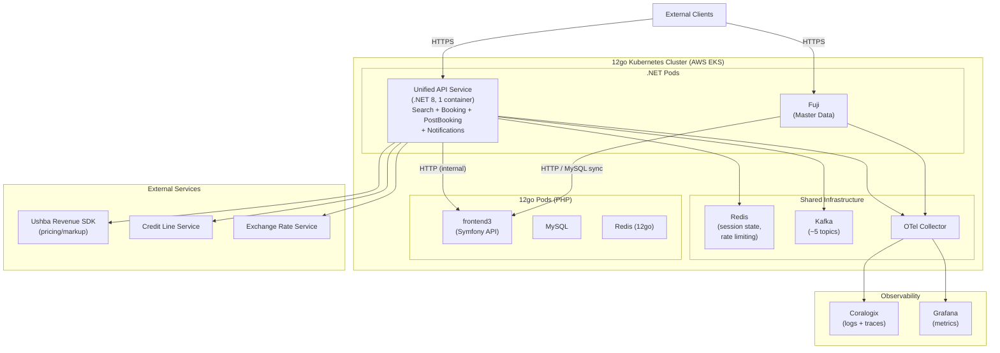
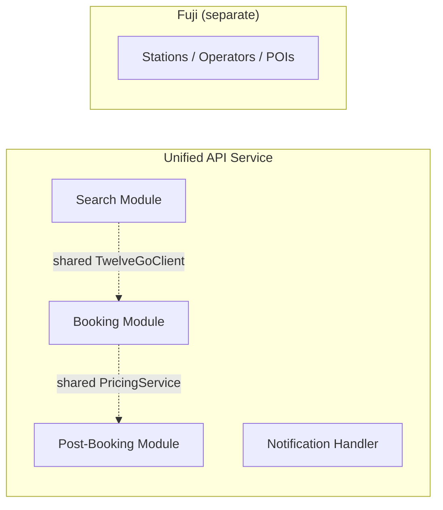
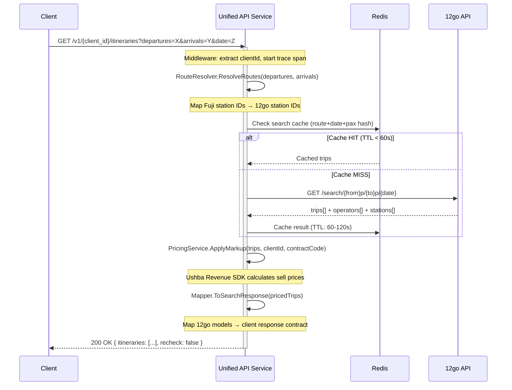
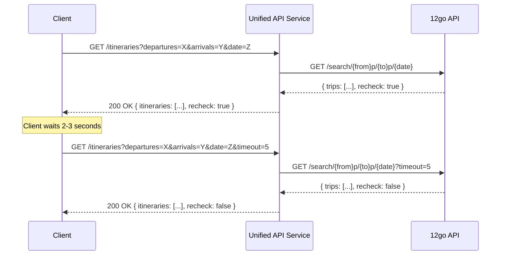
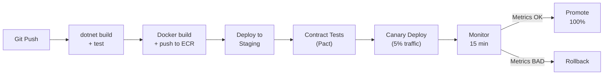
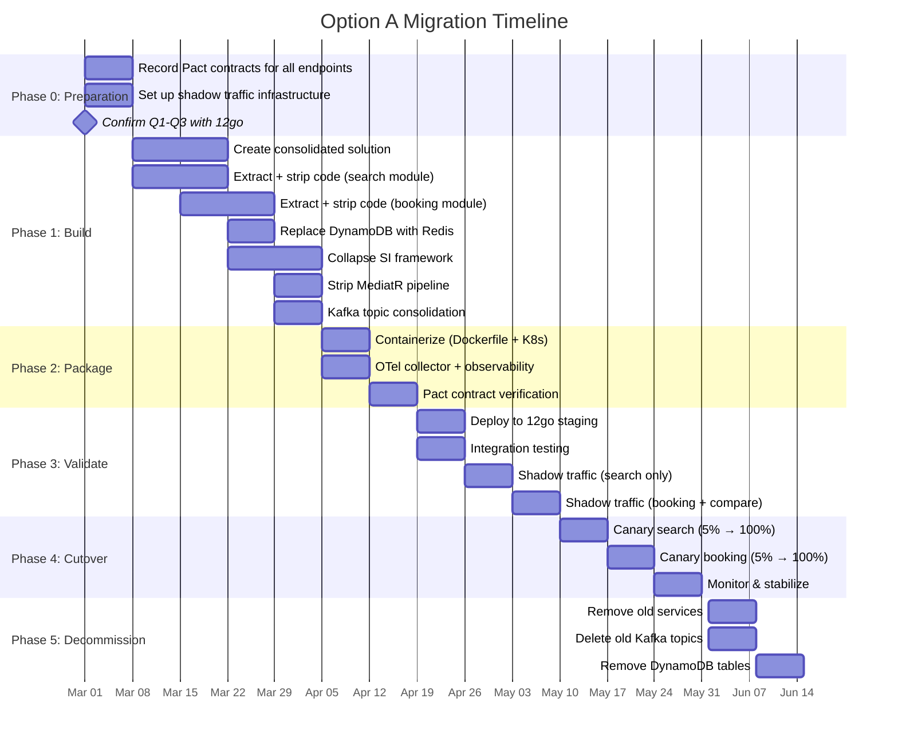

# Option A: Trimmed .NET on 12go Infrastructure

## 1. Assumptions

The following assumptions are made against unanswered questions (Q1-Q20). Where an alternative answer would materially change this design, it is noted.

| Question | Assumption | Impact if Wrong |
|----------|-----------|-----------------|
| **Q1** Integration method | **HTTP REST** remains the integration method. We call 12go's existing REST endpoints. | If direct code reference (Symfony bundle) is preferred, Option B (PHP native) becomes more attractive. If direct DB access is offered, this design's HTTP client layer would be replaced with a DB access layer. |
| **Q2** Programming language | 12go **tolerates .NET containers** but prefers PHP long-term. This option treats .NET as a medium-term (12-18 month) bridge. | If 12go mandates PHP-only, this option is not viable. |
| **Q3** Infrastructure | 12go runs **AWS EKS (Kubernetes)** and can deploy .NET Docker containers as first-class pods in the same cluster. Shared VPC, internal DNS resolution between .NET and PHP pods. | If 12go uses ECS/Fargate or a PHP-specific hosting platform (e.g., Laravel Forge), deployment complexity increases significantly. |
| **Q4** Multi-client access | Client identity and per-client config (markup, contracts) remain **our responsibility**. 12go does not have a native per-client concept matching ours. | If 12go already supports per-partner pricing/markup, we can remove our pricing layer entirely — the adapter becomes even thinner. |
| **Q5** Booking storage | `GET /booking/{bookingId}` returns **all fields** our clients need (net price, cancellation policies, passenger details, segments). We can proxy rather than store. | If 12go's response is incomplete, we need PostgreSQL/Redis to supplement booking data. Adds a data store to this design. |
| **Q7** Seat locking | 12go **does not** support seat locking. We continue to fake it locally. | If 12go adds seat locking, our fake-lock code can be removed. |
| **Q8** Webhooks | 12go continues to send booking status webhooks. We receive them via HTTP. Internal Kafka subscription is not available. | If we can subscribe to 12go's internal Kafka events, the notification webhook endpoint can be eliminated. |
| **Q10** Recheck | `recheck=true` means "results are still loading from upstream suppliers." With a single supplier path, we assume recheck is **rare but possible** — 12go may still aggregate across its own internal operators. | If recheck never fires for our queries, the recheck loop can be removed entirely. |
| **Q14** Monitoring | 12go uses **OpenTelemetry** and can receive W3C Trace Context headers. We share observability backends (Coralogix/Grafana) or export to 12go's OTEL collector. | If 12go has no OTel support, cross-service tracing is limited to log correlation via booking/trace IDs. |
| **Q16** Kafka topics | 12go does **not** consume any of our current Kafka topics. All current consumers are internal to our .NET services. | If 12go consumes `BookSucceeded` or `ReservationChanged`, those topics must be preserved or migrated carefully. |
| **Q17** Credit line | Credit line checking remains **our responsibility**. 12go does not enforce per-partner credit limits. | If 12go handles credit, `CreditLineProvider` can be removed. |
| **Q18** Rate limiting | 12go search API handles **~500 RPS** without rate limiting. Booking endpoints are unlimited within reasonable bounds. | If 12go has strict rate limits (e.g., 50 RPS), we need Redis-based rate limiting and potentially a search cache. |
| **Q19** Cart expiration | Carts expire after **~30 minutes**. | If carts expire faster (e.g., 5 min), the time budget between GetItinerary and CreateBooking shrinks, and we may need to re-create carts on demand. |

---

## 2. Architecture Overview

### 2.1 Target State

Two services replace the current seven: a **unified API service** (search + booking + post-booking + notifications) and **Fuji** (master data, unchanged lifecycle).



### 2.2 What Changed

| Current | Target | Rationale |
|---------|--------|-----------|
| 7 services (Etna Search, Etna SI Host, Denali booking-service, Denali post-booking-service, Denali notification-service, SI Framework, Fuji) | 2 services (Unified API + Fuji) | Thin proxy doesn't justify 5 separate deployments. ~100 files of surviving code fits in one service. |
| MediatR pipeline (11 behaviors) | Direct method calls (3 steps) | Only route resolution, 12go call, and markup survive. |
| DynamoDB (4 tables) | Redis (minimal session state) | 12go is source of truth for bookings. Redis holds only ephemeral tokens. |
| SI Framework abstraction | Direct `TwelveGoClient` | Only one supplier; the abstraction layer is pure overhead. |
| 30+ Kafka topics | ~5 Kafka topics | Analytics events replaced by OTel traces/metrics. |

---

## 3. Service Design

### 3.1 Unified API Service

**Responsibility**: Client-facing API that preserves all existing endpoint contracts. Translates between client data model and 12go API, applies pricing/markup, manages session state for two-phase booking.

**Endpoints**:

| Group | Endpoint | HTTP Method |
|-------|----------|-------------|
| Search | `/v1/{client_id}/itineraries` | GET |
| Checkout | `/{client_id}/itineraries/{id}` | GET |
| Booking | `/{client_id}/bookings` | POST |
| Booking | `/{client_id}/bookings/lock_seats` | POST |
| Booking | `/{client_id}/bookings/{id}/confirm` | POST |
| Post-Booking | `/{client_id}/bookings/{id}` | GET |
| Post-Booking | `/{client_id}/bookings/{id}/ticket` | GET |
| Post-Booking | `/{client_id}/bookings/{id}/cancel` | POST |
| Notifications | `/v1/integrations/{integration}/webhook/{path?}` | POST |
| Async | `/{client_id}/incomplete_results/{id}` | GET |
| Health | `/health`, `/ready` | GET |

**Internal Architecture** (simple three-layer):

```
┌──────────────────────────────────────────────────┐
│                   API Layer                       │
│  Controllers (5), Request/Response Models (~25),  │
│  Middleware (auth, context, error handling)        │
├──────────────────────────────────────────────────┤
│                 Service Layer                     │
│  SearchService, BookingService,                   │
│  PostBookingService, NotificationService,         │
│  PricingService, RecheckService, SeatLockService  │
├──────────────────────────────────────────────────┤
│              Infrastructure Layer                 │
│  TwelveGoClient (~30 files), RedisStateStore,     │
│  KafkaPublisher, CreditLineClient,                │
│  ExchangeRateClient, Observability                │
└──────────────────────────────────────────────────┘
```

**Dependencies**:
- `Ushba.Revenue.Search.Sdk` + `Ushba.Revenue.Booking.Sdk` (pricing/markup)
- `FujiContentManagement.ExchangeRates.SDK` (currency conversion)
- `Connect.Infra.Cyphering` (ID encryption — CaesarCypher)
- `Connect.Infra.Observability` (OTel tracing/metrics)
- `Polly` (HTTP resilience — retry, circuit breaker, timeout)
- `Confluent.Kafka` (event publishing)
- `StackExchange.Redis` (session state)
- `Riok.Mapperly` (source-generated object mapping)

**Scaling**: Horizontal. Stateless except for Redis-backed session tokens. Scale on CPU/request rate. Min 2, max 15 pods.

### 3.2 Fuji (Master Data) — Unchanged

**Responsibility**: Stations, operators, POIs, exchange rates, localization. Periodic sync from 12go's MySQL.

**Endpoints**: `GET /v1/{client_id}/stations`, `GET /v1/{client_id}/operators`, `GET /v1/{client_id}/pois`

Fuji remains a separate service because:
- Different lifecycle (data sync jobs run on schedules, not per-request)
- Different scaling profile (low traffic, high data volume)
- Independent deployment (station data changes don't affect booking)
- Already well-isolated with its own data pipeline

---

## 4. Microservice Boundaries

### 4.1 Decision: One Unified API Service + Fuji



### 4.2 Justification

| Factor | Single Service | Two Services (Search + Booking) | Three Services |
|--------|:-:|:-:|:-:|
| Code volume | ~100 files total | ~40 + ~60 files | ~30 + ~40 + ~30 files |
| Shared components | Internal method calls | Shared NuGet package | 2+ shared packages |
| Inter-service calls | Zero | GetItinerary bridges search→booking | Multiple |
| CI/CD pipelines | 1 | 2 | 3+ |
| Operational overhead | Minimal | Moderate | High |
| Scaling flexibility | Adequate (search traffic dominates, booking is light) | Independent scaling | Over-provisioned |
| GetItinerary placement | Natural — same process | Awkward — conceptually search but lives in booking | Same problem |

**Key insight**: GetItinerary is the bridge between search and booking. It calls search-related 12go endpoints (trip, cart, checkout) but produces a booking token. In a single service, this is just a method call. In split services, it requires shared state or inter-service HTTP.

**Recommendation**: **Single service** is optimal. The ~100-file adapter doesn't justify microservice boundaries. If search volume becomes extreme (>1,000 RPS sustained), split search into a separate service as a future evolution. The code is structured as internal modules to make this split straightforward.

### 4.3 Evolution Path

```
Phase 1 (now):     [Unified API]  +  [Fuji]
Phase 2 (if needed): [Search API]  +  [Booking API]  +  [Fuji]
```

The modular internal structure (SearchService, BookingService, PostBookingService) means splitting later requires only:
1. Extract module into separate project
2. Share TwelveGoClient and PricingService via NuGet package
3. Add Redis for cross-service state (booking tokens)

---

## 5. Architectural Patterns

### 5.1 Pattern Selection

| Pattern | Decision | Rationale |
|---------|----------|-----------|
| **Simple Layered** | **Use** | Three layers (API, Service, Infrastructure) is the natural fit for a thin proxy. No domain complexity warrants more. |
| **Anti-Corruption Layer** | **Use** | The entire service is an ACL — isolating client contracts from 12go's data model. This is the canonical pattern for our scenario. |
| **MediatR** | **Do not use** | 11 behaviors reduced to 3 steps. Direct method calls are clearer, faster, and debuggable. No pipeline abstraction needed. |
| **CQRS** | **Do not use** | Search (query) and booking (command) both proxy to the same 12go API. No separate read/write stores. CQRS adds ceremony without value. |
| **DDD** | **Do not use** | No rich domain. No aggregates, invariants, or domain events. The "domain" is price translation and ID mapping. |
| **Vertical Slice** | **Partial** | Each endpoint is self-contained, which is a vertical-slice characteristic. But formal vertical-slice architecture (feature folders, per-slice DI) is overkill for ~100 files. |

### 5.2 Search Flow (Direct Method Calls)

```csharp
// SearchService.cs — replaces MediatR pipeline with 3 method calls
public async Task<SearchResponse> SearchAsync(SearchQuery query, CancellationToken ct)
{
    var routes = await _routeResolver.ResolveRoutes(query.Departures, query.Arrivals);
    var trips = await _twelveGoClient.SearchAsync(routes, query.Date, query.Passengers, ct);
    var itineraries = _pricingService.ApplyMarkup(trips, query.ClientId, query.ContractCode);
    return _mapper.ToSearchResponse(itineraries);
}
```

### 5.3 Error Handling

| Error Type | Strategy |
|-----------|----------|
| 12go returns HTTP 4xx | Map to client-facing error (400 Bad Request, 404 Not Found). Preserve error message. |
| 12go returns HTTP 5xx | Retry with Polly (3 attempts, exponential backoff). If all fail, return 502 Bad Gateway. |
| 12go timeout | Polly timeout policy (configurable per endpoint). Return 504 Gateway Timeout. |
| 12go circuit breaker open | Return 503 Service Unavailable with `Retry-After` header. |
| Validation error | Return 400 with structured error body matching current contract. |
| Pricing/markup failure | Log error, return itinerary without markup (fail-open for search, fail-closed for booking). |

---

## 6. Data Flow

### 6.1 Search Flow



### 6.2 Booking Flow (GetItinerary → Reserve → Confirm)

```mermaid
sequenceDiagram
    participant Client
    participant API as Unified API Service
    participant Redis
    participant TGo as 12go API

    rect rgb(40, 60, 40)
    Note over Client, TGo: Phase 1: GetItinerary (checkout)
    Client->>API: GET /{client_id}/itineraries/{itinerary_id}
    API->>API: Decrypt itineraryId → tripId + datetime
    API->>TGo: GET /trip/{tripId}/{datetime}
    TGo-->>API: Trip details
    API->>TGo: POST /cart/{tripId}/{datetime}
    TGo-->>API: cartId
    API->>TGo: GET /checkout/{cartId}
    TGo-->>API: Booking schema (form fields)
    API->>API: PricingService.ApplyMarkup(trip)
    API->>API: Build BookingToken(cartId, tripId, schema, prices)
    API->>Redis: Store BookingToken (TTL: 25min, key: tokenId)
    API-->>Client: { preBookingSchema, bookingToken, totalPrice }
    end

    rect rgb(50, 50, 40)
    Note over Client, TGo: Phase 2: SeatLock (optional, no 12go call)
    Client->>API: POST /{client_id}/bookings/lock_seats
    API->>Redis: Get BookingToken
    API->>API: Validate seat availability against schema
    API->>Redis: Update BookingToken with locked seats
    API-->>Client: { lockedSeats, updatedSchema }
    end

    rect rgb(60, 40, 40)
    Note over Client, TGo: Phase 3: CreateBooking (reserve)
    Client->>API: POST /{client_id}/bookings { bookingToken, passengers }
    API->>Redis: Get BookingToken (cartId, prices, schema)
    API->>API: Validate passenger data against schema
    API->>API: CreditLineProvider.CheckBalance(clientId, price)
    API->>TGo: POST /reserve/{bookingId}
    TGo-->>API: Reservation result
    API->>TGo: GET /booking/{bookingId}
    TGo-->>API: Booking status + price
    API->>API: Verify price matches (detect price mismatch)
    API->>Kafka: Publish booking.lifecycle (reserved)
    API-->>Client: { bookingId, status: "reserved", totalPrice }
    end

    rect rgb(40, 40, 60)
    Note over Client, TGo: Phase 4: Confirm
    Client->>API: POST /{client_id}/bookings/{id}/confirm
    API->>TGo: POST /confirm/{bookingId}
    TGo-->>API: Confirmation result
    API->>TGo: GET /booking/{bookingId}
    TGo-->>API: Final status + ticket info
    API->>Kafka: Publish booking.lifecycle (confirmed)
    API-->>Client: { bookingId, status: "confirmed" }
    end
```



### 6.3 Post-Booking Flows

```mermaid
sequenceDiagram
    participant Client
    participant API as Unified API Service
    participant TGo as 12go API

    rect rgb(40, 50, 50)
    Note over Client, TGo: GetBookingDetails
    Client->>API: GET /{client_id}/bookings/{id}
    API->>TGo: GET /booking/{bookingId}
    TGo-->>API: Full booking details
    API->>API: Map to client response format
    API-->>Client: { booking details }
    end

    rect rgb(50, 40, 50)
    Note over Client, TGo: GetTicket
    Client->>API: GET /{client_id}/bookings/{id}/ticket
    API->>TGo: GET /booking/{bookingId}
    TGo-->>API: ticketUrl
    API-->>Client: { ticketUrl } or redirect
    Note over API: If we need PDF generation,<br/>keep ITicketPdfService + S3
    end

    rect rgb(50, 50, 40)
    Note over Client, TGo: CancelBooking
    Client->>API: POST /{client_id}/bookings/{id}/cancel
    API->>TGo: GET /booking/{bookingId}/refund-options
    TGo-->>API: Refund options
    API->>TGo: POST /booking/{bookingId}/refund
    TGo-->>API: Refund result
    API->>Kafka: Publish booking.status_change (cancelled)
    API-->>Client: { cancellation details }
    end
```



### 6.4 Recheck Loop



The recheck loop is pass-through: we forward 12go's `recheck` flag directly. If 12go returns `recheck: true`, we return it to the client. The client is responsible for polling. Our service adds no recheck state — this is a stateless relay.

---

## 7. State Management

### 7.1 What State Do We Keep?

| State | Storage | TTL | Purpose |
|-------|---------|-----|---------|
| **Booking tokens** | Redis | 25 min | Bridge between GetItinerary and CreateBooking. Contains cartId, schema, prices, locked seats. |
| **Seat lock state** | Redis (inside booking token) | 25 min | Faked seat locking — stored as part of booking token. |
| **Incomplete results** | Redis | 15 min | Async booking results when confirm exceeds 15s. Client polls for completion. |
| **Search cache** | Redis | 60-120s | Optional. Cache popular route+date searches to reduce 12go load. |
| **Rate limit counters** | Redis | Rolling window | Per-client rate limiting. |
| **Station mappings** | In-process memory | 5 min | Fuji station ID → 12go station ID mapping. Refreshed from Fuji. |
| **Markup/pricing rules** | In-process memory | 5 min | Per-client pricing config from Ushba SDK. |

### 7.2 Can We Be Stateless?

**Almost.** The only hard state requirement is the booking token between GetItinerary and CreateBooking. This is a session token that must survive across two HTTP requests (potentially minutes apart). Options:

1. **Redis (recommended)**: Store booking token server-side, return opaque token ID to client. Simple, works across instances, survives pod restarts.
2. **Client-side token**: Encrypt the entire booking state into the token and pass it back to the client. Eliminates server state but produces large tokens (~5-10 KB) and requires careful encryption.
3. **Truly stateless**: Re-fetch from 12go on CreateBooking (call trip + cart + checkout again). Adds 3 extra 12go calls and ~2s latency to every booking. Not recommended.

**Decision**: Redis for booking tokens. All other state is either optional caching or can be recomputed.

### 7.3 Redis Topology

```
Redis instance: 1 (shared with 12go or dedicated)
Max memory: 512 MB (booking tokens are small, ~2KB each)
Eviction: volatile-lru (evict keys with TTL when memory pressure)
Persistence: None (all data is ephemeral/reproducible)
```

---

## 8. Kafka Strategy

### 8.1 Topic Reduction: 30+ → 5

| Surviving Topic | Partitions | Retention | Key | Producer | Consumer |
|----------------|-----------|-----------|-----|----------|----------|
| `booking.lifecycle` | 6 | 7 days | bookingId | Unified API | Analytics, reconciliation |
| `booking.status_change` | 6 | 7 days | bookingId | Unified API | Analytics, external systems |
| `booking.notification` | 3 | 3 days | integrationBookingId | Unified API (webhook handler) | Unified API (post-booking module) |
| `content.entity_sync` | 3 | 3 days | entityType:entityId | Fuji | Content processing |
| `integration.config` | 1 | 7 days | integrationId | Settings (if kept) | Unified API |

### 8.2 Eliminated Topics

All analytics/telemetry Kafka events (~20 topics) are replaced by OpenTelemetry:

- `CheckoutRequested/Responded/Failed` → OTel span with status
- `BookingSchemaRequested/Responded/Failed` → OTel span
- `BookRequested/Failed` → OTel span
- `Etna.Messages.Search*` (8 topics) → OTel spans + metrics
- `BookingEntityToPersist` → Direct write (no DynamoDB)
- `RestoreReservationConfirmationSucceeded` → Unnecessary without DynamoDB

### 8.3 `booking.lifecycle` Event Schema

```json
{
  "eventType": "reserved | confirmed | cancelled | failed",
  "bookingId": "BK-12345",
  "clientId": "acme",
  "integrationId": "OneTwoGo",
  "contractCode": "OTG-001",
  "timestamp": "2026-02-17T10:30:00Z",
  "payload": {
    "netPrice": { "amount": 150.00, "currency": "THB" },
    "sellPrice": { "amount": 175.00, "currency": "USD" },
    "passengerCount": 2,
    "route": { "from": "BKK", "to": "CNX" }
  }
}
```

---

## 9. Observability

### 9.1 Strategy

| Signal | Tool | Library |
|--------|------|---------|
| Distributed traces | Coralogix | `System.Diagnostics.Activity` + OTel SDK |
| Metrics | Grafana (Prometheus) | `System.Diagnostics.Metrics` + OTel SDK |
| Structured logs | Coralogix | `ILogger` + NLog → OTel Logs |

### 9.2 Business Context Enrichment

Every request gets enriched via middleware with these dimensions:

```csharp
// BusinessContextMiddleware — runs on every request
public async Task InvokeAsync(HttpContext context, RequestDelegate next)
{
    var clientId = context.GetRouteValue("client_id")?.ToString();
    var activity = Activity.Current;
    activity?.SetTag("connect.client.id", clientId);

    using (logger.BeginScope(new Dictionary<string, object>
    {
        ["client_id"] = clientId,
        ["correlation_id"] = activity?.TraceId.ToString()
    }))
    {
        await next(context);
    }
}
```

Booking endpoints additionally enrich with `booking_id`, `itinerary_id`, and `contract_code` as they become available during the request lifecycle.

### 9.3 Key Metrics (RED + Business)

| Metric | Type | Tags |
|--------|------|------|
| `api.request.duration` | Histogram | endpoint, method, client_id, status_code |
| `api.request.errors` | Counter | endpoint, client_id, error_type |
| `search.results.count` | Histogram | client_id, integration_id |
| `search.cache.hit_rate` | Counter | client_id, cache_level |
| `booking.conversion.completed` | Counter | client_id, integration_id |
| `booking.conversion.failed` | Counter | client_id, failure_reason |
| `booking.price_mismatch` | Counter | client_id, integration_id |
| `upstream.12go.request.duration` | Histogram | endpoint |
| `upstream.12go.circuit_breaker.state` | Gauge | - |

### 9.4 Trace Sampling

- **100%** of error traces and booking traces (any request touching booking flow)
- **10%** of search traces (high volume)
- Configured via OTel Collector tail-based sampling

### 9.5 Filtering Requirement

The logging architecture supports the stated filtering requirement:

| Filter By | How |
|-----------|-----|
| clientId | `client_id` in log scope + trace attribute |
| operator | `integration_id` / `operator_id` in trace attribute |
| bookingId | `booking_id` in log scope + trace attribute |
| itinerary | `itinerary_id` in trace attribute |

Query example in Coralogix: `client_id:"acme" AND booking_id:"BK-12345"` returns all logs for that specific booking for that client.

---

## 10. Deployment Model

### 10.1 Container Images

```dockerfile
# Unified API Service
FROM mcr.microsoft.com/dotnet/aspnet:8.0-alpine AS base
WORKDIR /app
EXPOSE 8080
COPY publish/ .
ENTRYPOINT ["dotnet", "TravelApi.dll"]
```

| Image | Base | Size (est.) | Target |
|-------|------|------------|--------|
| `travel-api` | `mcr.microsoft.com/dotnet/aspnet:8.0-alpine` | ~90 MB | Unified API Service |
| `fuji` | `mcr.microsoft.com/dotnet/aspnet:8.0-alpine` | ~85 MB | Fuji Master Data |

### 10.2 Kubernetes Resources

```yaml
# Unified API Service deployment (conceptual)
apiVersion: apps/v1
kind: Deployment
metadata:
  name: travel-api
spec:
  replicas: 3
  template:
    spec:
      containers:
      - name: travel-api
        image: travel-api:latest
        resources:
          requests:
            cpu: "250m"
            memory: "256Mi"
          limits:
            cpu: "1000m"
            memory: "512Mi"
        ports:
        - containerPort: 8080
        livenessProbe:
          httpGet:
            path: /health
            port: 8080
          initialDelaySeconds: 10
          periodSeconds: 15
        readinessProbe:
          httpGet:
            path: /ready
            port: 8080
          initialDelaySeconds: 5
          periodSeconds: 5
        env:
        - name: TWELVEGOAPI__BASEURL
          valueFrom:
            configMapKeyRef:
              name: travel-api-config
              key: twelveGoBaseUrl
        - name: REDIS__CONNECTIONSTRING
          valueFrom:
            secretKeyRef:
              name: travel-api-secrets
              key: redisConnectionString
```

### 10.3 Auto-Scaling

```yaml
apiVersion: autoscaling/v2
kind: HorizontalPodAutoscaler
metadata:
  name: travel-api-hpa
spec:
  scaleTargetRef:
    apiVersion: apps/v1
    kind: Deployment
    name: travel-api
  minReplicas: 2
  maxReplicas: 15
  metrics:
  - type: Resource
    resource:
      name: cpu
      target:
        type: Utilization
        averageUtilization: 60
```

### 10.4 Networking

- **Ingress**: 12go's existing ingress controller (nginx/ALB). Route `/v1/{client_id}/itineraries` and `/{client_id}/bookings/*` to `travel-api` service.
- **Internal communication**: Kubernetes service DNS. `travel-api` calls `frontend3.12go-namespace.svc.cluster.local`.
- **Service mesh**: Not required initially. Add Istio/Linkerd if mTLS between .NET and PHP pods is mandated by 12go's security policy.

### 10.5 Configuration

| Config Type | Mechanism | Examples |
|------------|-----------|---------|
| App settings | ConfigMap | 12go base URL, cache TTLs, feature flags |
| Secrets | K8s Secrets (or AWS Secrets Manager) | Redis connection string, Kafka credentials, API keys |
| Per-client config | Loaded at startup from config service or JSON file | Markup rules, contract codes, credit limits |

### 10.6 CI/CD Pipeline



---

## 11. Pros and Cons

### Pros

| # | Advantage | Detail |
|---|-----------|--------|
| 1 | **Lowest migration effort** | Reuses existing .NET code, models, and patterns. No rewrite needed — just deletion and consolidation. |
| 2 | **Zero client-side changes** | All API contracts preserved byte-for-byte. ID formats, error shapes, response structures unchanged. |
| 3 | **Existing observability preserved** | All Grafana dashboards, Coralogix queries, and alert rules continue to work with same meter names and tag keys. |
| 4 | **Proven code for critical paths** | Pricing/markup, ID encryption, recheck logic, and 12go HTTP client are battle-tested in production. No rewrite risk for revenue-critical code. |
| 5 | **Type safety** | .NET's strong typing catches contract drift at compile time. Mapperly generates zero-allocation mappers. |
| 6 | **Performance headroom** | .NET is ~15x faster than PHP for HTTP handling. For a proxy layer, this means lower resource consumption per request. |
| 7 | **Rapid delivery** | Estimated 8-10 weeks to production. Fastest path to the target state. |

### Cons

| # | Disadvantage | Detail |
|---|-------------|--------|
| 1 | **Permanent polyglot tax** | 12go must maintain .NET container images, .NET CI/CD pipeline, .NET debugging expertise alongside their PHP stack. Two base image sets to patch. |
| 2 | **Team expertise gap** | 12go's team is PHP-native. Maintaining .NET services requires hiring or training. Knowledge transfer is non-trivial. |
| 3 | **Operational isolation** | .NET pods have separate health characteristics, GC tuning, memory profiles from PHP. Ops team needs two mental models. |
| 4 | **Dependency drift** | Ushba Revenue SDK, Connect.Infra packages, Fuji SDKs are all .NET-specific internal packages. If the parent organization shifts to PHP, these packages may stop receiving updates. |
| 5 | **"Temporary" risk** | A .NET adapter intended as a bridge may become permanent. The polyglot tax is paid indefinitely with no timeline for resolution (Anti-Pattern #5 from research). |
| 6 | **Container image size** | .NET Alpine images (~90 MB) are larger than PHP-FPM images (~30 MB). Minor cost impact at scale. |

---

## 12. Effort Estimate

| Component | Effort | Description |
|-----------|--------|-------------|
| **Extract & consolidate codebase** | 3 weeks | Create new solution, extract surviving code from 4 repos, wire up DI, remove dead code. |
| **Replace DynamoDB with Redis** | 1 week | Swap BookingToken storage to Redis. Remove DynamoDB dependencies. |
| **Collapse SI framework to direct calls** | 2 weeks | Remove ISiServiceProvider abstraction. Wire TwelveGoClient directly into services. |
| **Strip MediatR pipeline** | 1 week | Replace SearchEngine pipeline with direct SearchService method calls. |
| **Kafka topic consolidation** | 1 week | Create new topics, update publishers, dual-write period. |
| **Containerize & K8s manifests** | 1 week | Dockerfile, Helm chart or K8s manifests, ConfigMaps, Secrets. |
| **Observability migration** | 1 week | OTel Collector config, verify traces/metrics flow, update dashboards if needed. |
| **Contract tests (Pact)** | 1 week | Record current contracts, set up verification pipeline. |
| **Staging deployment & testing** | 2 weeks | Deploy to 12go staging, integration testing, shadow traffic. |
| **Canary rollout & monitoring** | 2 weeks | Gradual traffic shift 5% → 25% → 50% → 100% with monitoring. |
| **Buffer & fixes** | 1 week | Unexpected issues, edge cases, performance tuning. |
| **Total** | **~16 person-weeks** | ~4 months with 1 engineer, ~2 months with 2 engineers |

---

## 13. Risk Assessment

| # | Risk | Probability | Impact | Mitigation |
|---|------|:-----------:|:------:|-----------|
| 1 | **Client API contract breakage** | Medium | Critical | Pact contract tests recorded before migration. Golden-file comparison of responses. Shadow traffic validation. |
| 2 | **Pricing/markup regression** | Low | Critical | Extract pricing test suite with known inputs/outputs. Run against new service before cutover. Price comparison logging during canary (old price vs new price for same request). |
| 3 | **12go refuses .NET containers** | Medium | Critical | This risk kills Option A entirely. Confirm Q2/Q3 before starting. Fallback: Option B (PHP rewrite) or Option C (thin gateway). |
| 4 | **In-flight bookings during cutover** | Medium | High | Gradual canary rollout. Both old and new services active simultaneously. Old service handles requests started before cutover. New service handles new requests. No bookings are lost because 12go is the source of truth. |
| 5 | **Redis single point of failure** | Low | High | Use Redis Cluster or AWS ElastiCache with replicas. Booking tokens can be re-created (client calls GetItinerary again). Search cache miss just means a slower request. |

---

## 14. Migration Path

### 14.1 Phased Approach



### 14.2 Rollback Points

| Phase | Rollback Strategy | Data Safety |
|-------|------------------|-------------|
| Phase 1-2 (Build/Package) | No production impact. Abort and discard. | No data at risk. |
| Phase 3 (Validate) | Shadow traffic uses old path for real responses. Stop mirroring. | No data at risk (shadow is read-only). |
| Phase 4 (Canary) | Shift traffic back to old services (0% new, 100% old). | Bookings made on new path are in 12go (source of truth). Both old and new services can read them. |
| Phase 5 (Decommission) | Cannot roll back after old services are deleted. Phase 5 starts only after 2 weeks of stable 100% traffic on new path. | All data in 12go + Redis. Old DynamoDB data is no longer needed. |

### 14.3 Migration Sequence (Endpoint Priority)

| Priority | Endpoints | Risk | Rationale |
|:--------:|-----------|------|-----------|
| 1 | Health, Ready | None | Verify deployment works. |
| 2 | GetStations, GetOperators (Fuji) | Low | Read-only, cached, low traffic. Fuji stays separate but validates K8s networking. |
| 3 | Search | Medium | High volume but read-only. Shadow traffic comparison catches issues. |
| 4 | GetBookingDetails, GetTicket | Medium | Read-only post-booking. Low risk. |
| 5 | GetItinerary, SeatLock | Medium | Checkout flow. Bridges search and booking. |
| 6 | CreateBooking, ConfirmBooking | High | Write operations with financial impact. Last to migrate. |
| 7 | CancelBooking | High | Refund operations. Requires careful validation. |
| 8 | Webhook notifications | Low | Internal events. Can run in parallel with old notification service. |

---

## Appendix A: Project Structure

```
TravelApi/
├── src/
│   ├── TravelApi/                          # Main host project
│   │   ├── Program.cs                      # DI, middleware, pipeline setup
│   │   ├── appsettings.json
│   │   ├── Dockerfile
│   │   └── Controllers/
│   │       ├── SearchController.cs
│   │       ├── BookingController.cs
│   │       ├── PostBookingController.cs
│   │       ├── NotificationController.cs
│   │       └── HealthController.cs
│   ├── TravelApi.Services/                 # Service layer
│   │   ├── Search/
│   │   │   ├── SearchService.cs
│   │   │   ├── RouteResolver.cs
│   │   │   └── RecheckService.cs
│   │   ├── Booking/
│   │   │   ├── BookingService.cs
│   │   │   ├── SeatLockService.cs
│   │   │   └── BookingTokenStore.cs        # Redis-backed
│   │   ├── PostBooking/
│   │   │   ├── PostBookingService.cs
│   │   │   └── TicketService.cs
│   │   ├── Pricing/
│   │   │   ├── PricingService.cs
│   │   │   ├── MarkupService.cs
│   │   │   └── CreditLineProvider.cs
│   │   └── Notification/
│   │       └── NotificationService.cs
│   ├── TravelApi.TwelveGoClient/           # 12go HTTP client (extracted from SI)
│   │   ├── OneTwoGoApi.cs
│   │   ├── OneTwoGoHttpConnector.cs
│   │   ├── OneTwoGoUriBuilder.cs
│   │   ├── Search/
│   │   │   ├── OneTwoGoSearchClient.cs
│   │   │   └── Mappers/                    # 8 mappers from SI
│   │   ├── Booking/
│   │   │   ├── OneTwoGoBookingClient.cs
│   │   │   └── OneTwoGoBookingSchema.cs
│   │   ├── PostBooking/
│   │   │   └── OneTwoGoPostBookingClient.cs
│   │   └── Models/                         # 12go request/response models
│   └── TravelApi.Contracts/               # Client-facing models (from Etna/Denali ApiModels)
│       ├── Search/
│       ├── Booking/
│       ├── PostBooking/
│       └── IdTypes/                        # BookingId, ItineraryId, BookingToken, CaesarCypher
├── tests/
│   ├── TravelApi.Tests/
│   ├── TravelApi.ContractTests/            # Pact provider verification
│   └── TravelApi.IntegrationTests/
├── k8s/
│   ├── deployment.yaml
│   ├── service.yaml
│   ├── hpa.yaml
│   ├── configmap.yaml
│   └── ingress.yaml
└── TravelApi.sln
```

**Estimated total**: ~100-120 source files, down from ~3,500.

## Appendix B: Dependency Inventory (Final)

| Package | Purpose | Status |
|---------|---------|--------|
| `Microsoft.AspNetCore` | Web framework | Keep |
| `Polly` | HTTP resilience | Keep |
| `StackExchange.Redis` | Session state | New |
| `Confluent.Kafka` | Event publishing | Keep (trimmed) |
| `Ushba.Revenue.Search.Sdk` | Search markup | Keep |
| `Ushba.Revenue.Booking.Sdk` | Booking markup | Keep |
| `FujiContentManagement.ExchangeRates.SDK` | Currency conversion | Keep |
| `Connect.Infra.Cyphering` | ID encryption | Keep |
| `Connect.Infra.Observability` | OTel tracing/metrics | Keep |
| `Connect.Infra.Context` | Request context | Keep (trimmed) |
| `Riok.Mapperly` | Source-generated mappers | Keep |
| `NLog.Extensions.Logging` | Logging | Keep |
| `Swashbuckle.AspNetCore` | Swagger/OpenAPI | Keep |
| `Microsoft.AspNetCore.Mvc.NewtonsoftJson` | JSON serialization | Keep |
| MediatR, Autofac, AWSSDK.DynamoDBv2, AutoMapper, Google.Protobuf, Grpc.*, OneOf, carmel.distribution.*, Connect.Infra.Experimentation, ApplicationConfig.Wrapper | Various | **Removed** |
