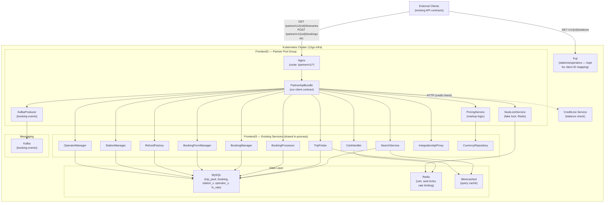
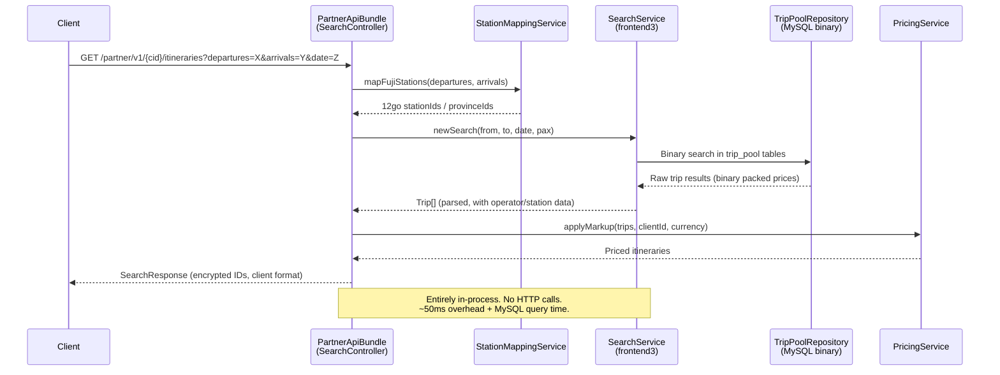
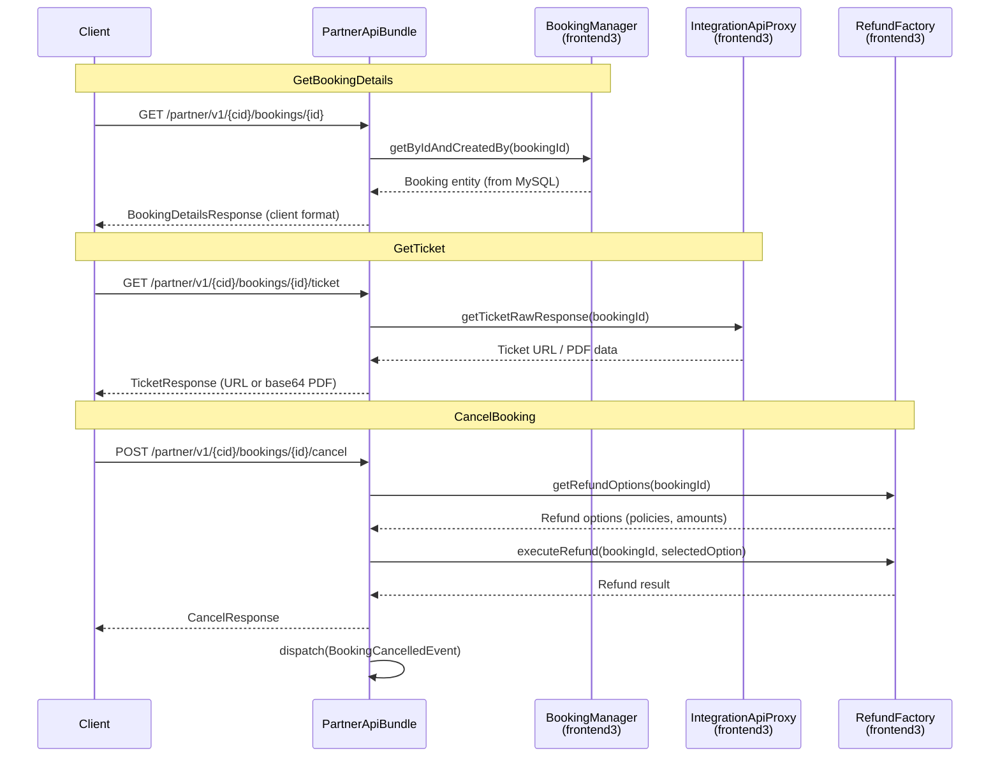
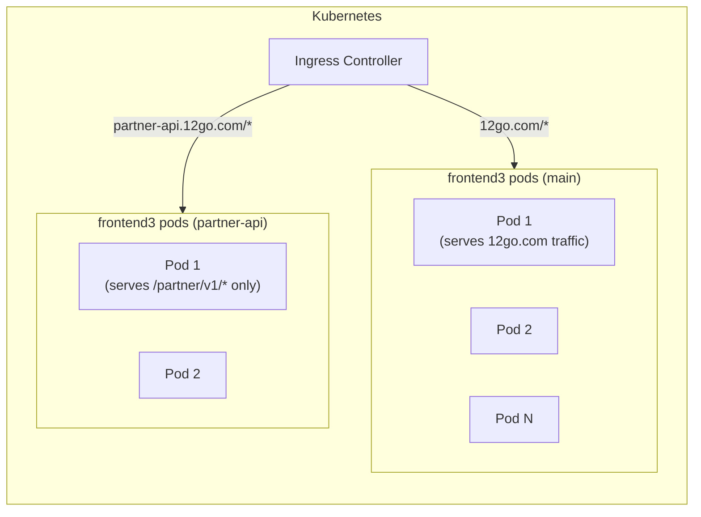
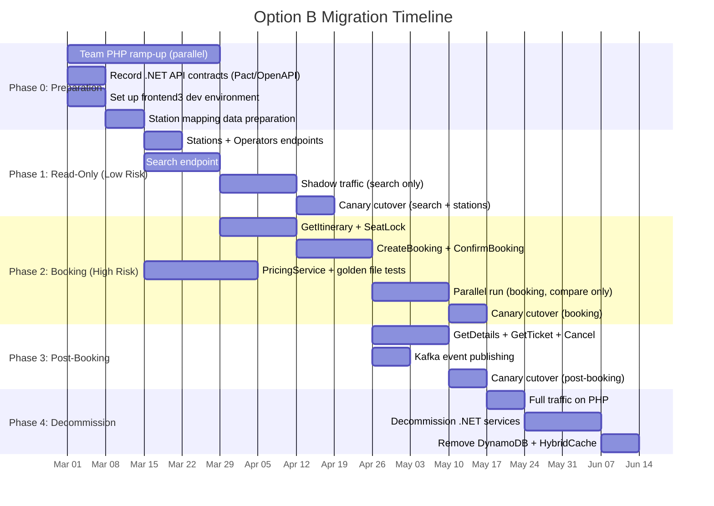

# Option B: PHP Native Integration — Architecture

## 1. Assumptions

Since Q1–Q20 are unanswered at time of writing, we assume the following. Each assumption is tagged with the question it depends on and a note on how a different answer would change the design.

| # | Assumption | Question | Impact if Wrong |
|---|-----------|----------|-----------------|
| A1 | 12go prefers or accepts the internal bundle approach (option b) — i.e., they will allow a new Symfony bundle inside frontend3 | Q1 | If rejected → fall back to option (a) PHP Thin Proxy; architecture changes from in-process to HTTP |
| A2 | PHP is acceptable or preferred for new adapter code | Q2 | If .NET preferred → this entire document is superseded by Option A |
| A3 | 12go runs Kubernetes; we can deploy modified frontend3 images to a dedicated pod group | Q3 | If no K8s → deployment section needs rewrite for ECS/bare-metal |
| A4 | 12go has no native per-client/partner config system; we must manage client markup, auth, and feature flags ourselves | Q4 | If 12go has partner management → pricing/auth sections simplify dramatically |
| A5 | `GET /booking/{bookingId}` returns sufficient data to replace our local DynamoDB cache | Q5 | If insufficient → we need a local booking store (PostgreSQL or Redis) |
| A6 | 12go does NOT support native seat locking; our fake lock approach continues | Q7 | If 12go adds seat lock → SeatLock section simplifies to a proxy call |
| A7 | Webhooks remain the mechanism for booking status push; no internal Kafka subscription available initially | Q8, Q16 | If internal Kafka available → notification architecture changes significantly |
| A8 | 12go supports W3C Trace Context propagation or can be configured to | Q14 | If no trace propagation → we lose end-to-end distributed tracing |
| A9 | Cart TTL is ~30 minutes; schema is operator-specific but stable | Q19, Q20 | If shorter TTL → we need aggressive cart refresh or pre-reserve caching |
| A10 | Station mapping must be maintained by us; 12go does not accept Fuji station IDs natively | Q11 | If 12go accepts Fuji IDs → Fuji dependency reduces to exchange rates only |
| A11 | Credit line check is an external HTTP call (existing service) we can call from PHP | Q17 | If 12go handles credit → we drop CreditLine integration entirely |
| A12 | 12go's search is effectively synchronous from our perspective for a single call; `recheck=true` means "results still loading, retry" | Q10 | If recheck is fundamentally async → we need a polling/session-token layer |

---

## 2. Sub-Variant Comparison

| Dimension | (a) PHP Thin Proxy | **(b) Frontend3 Internal Bundle** | (c) Direct Database Access |
|---|---|---|---|
| **Architecture** | New Symfony app → HTTP → frontend3 API | Symfony bundle inside frontend3 → in-process service calls | New PHP app → raw SQL to MySQL/Redis |
| **Performance** | +2–10ms per HTTP hop (same as .NET) | **Best**: zero network overhead, shared connection pools | Good reads, dangerous writes |
| **Coupling** | Low (HTTP contract) | Medium (frontend3 service API) | Very High (DB schema + binary formats) |
| **Reuse of frontend3** | Minimal | **Maximum** (~90% of logic reused) | Minimal (must replicate business logic) |
| **Effort** | 8–10 weeks | **7–9 weeks** | 15–22 weeks |
| **Risk** | Low | Medium | Very High |
| **Maintenance** | Medium (separate app) | **Low** (ships with frontend3) | Very High (schema drift) |
| **Write operations** | Via HTTP (safe) | **Direct service calls (safe)** | Replicating multi-table transactions (dangerous) |
| **12go team dependency** | Low | Medium (PR reviews, release coordination) | Low (but fragile) |
| **Simplification gain** | Marginal over .NET | **Significant** (eliminates 5 .NET services) | Negative |
| **Deployment** | Separate container | Same image, separate pod group | Separate container |

**Recommendation: Option (b) — Frontend3 Internal Bundle.** It offers the best performance, maximum code reuse, and the greatest simplification. The rest of this document details this option.

**Fallback**: If 12go rejects code contributions to frontend3 → use option (a). It is architecturally equivalent to the current .NET approach, just in PHP.

**Not recommended**: Option (c) under any circumstances. Replicating `PriceBinaryParser`, Cart serialization, and booking state machine logic is prohibitively risky.

---

## 3. Architecture Overview



**Key design decisions:**
- The `PartnerApiBundle` lives **inside** the frontend3 application but runs on a **dedicated pod group** (same Docker image, different Nginx config routing only `/partner/v1/*` traffic)
- Frontend3's existing services are called **in-process** — no HTTP, no serialization overhead
- Fuji remains separate for station ID mapping (clients use Fuji station IDs)
- Kafka events produced via `symfony/messenger` + `php-rdkafka`

---

## 4. Bundle / Module Design

### 4.1 Directory Structure

```
src/PartnerApiBundle/
├── PartnerApiBundle.php              # Bundle registration
├── DependencyInjection/
│   └── PartnerApiExtension.php       # Service wiring
├── Controller/                        # 7 controllers mapping to client endpoints
│   ├── SearchController.php           #   GET  /partner/v1/{cid}/itineraries
│   ├── ItineraryController.php        #   GET  /partner/v1/{cid}/itineraries/{id}
│   ├── BookingController.php          #   POST bookings, POST confirm
│   ├── SeatLockController.php         #   POST lock_seats
│   ├── PostBookingController.php      #   GET details, GET ticket, POST cancel
│   ├── StationController.php          #   GET stations
│   └── OperatorController.php         #   GET operators
├── Service/                           # Adapters wrapping frontend3 services
│   ├── SearchAdapter.php              #   SearchService + markup
│   ├── ItineraryAdapter.php           #   TripFinder + CartHandler + BookingFormManager
│   ├── BookingAdapter.php             #   BookingProcessor (reserve + confirm)
│   ├── PostBookingAdapter.php         #   BookingManager + RefundFactory
│   ├── SeatLockManager.php            #   Fake seat lock (Redis-backed)
│   ├── PricingService.php             #   Ushba Revenue SDK port
│   ├── CreditLineClient.php           #   HTTP call to credit line service
│   ├── StationMappingService.php      #   Fuji ID ↔ 12go ID translation
│   └── ClientConfigProvider.php       #   Per-client auth, markup, features
├── Contract/
│   ├── Request/                       # Incoming DTOs (match .NET models exactly)
│   ├── Response/                      # Outgoing DTOs (match .NET models exactly)
│   └── Transformer/                   # Frontend3 ↔ Client DTO mappers
├── Security/                          # ApiKeyAuthenticator, ClientResolver
├── EventListener/                     # BusinessContext, Exception, RateLimit listeners
├── Event/                             # BookingReserved, Confirmed, Cancelled events
└── Config/
    ├── routes.yaml
    └── services.yaml
```

### 4.2 Endpoint Mapping

| Client Endpoint | Controller Method | Frontend3 Service Call |
|---|---|---|
| `GET /partner/v1/{cid}/itineraries?departures=X&arrivals=Y&date=Z` | `SearchController::search` | `SearchService::newSearch()` → results from `TripPoolRepository` |
| `GET /partner/v1/{cid}/itineraries/{id}` | `ItineraryController::getItinerary` | `TripFinder::findFullResult()` → `CartHandler::handleAddTrip()` → `BookingFormManager::getProductsDetailsFromCart()` |
| `POST /partner/v1/{cid}/bookings/lock_seats` | `SeatLockController::lockSeats` | `SeatLockManager::lock()` (Redis, no frontend3 call) |
| `POST /partner/v1/{cid}/bookings` | `BookingController::createBooking` | `BookingProcessor::createBookingsAndSetIds()` → `BookingProcessor::reserveBookings()` |
| `POST /partner/v1/{cid}/bookings/{id}/confirm` | `BookingController::confirmBooking` | `BookingProcessor::confirmBooking()` |
| `GET /partner/v1/{cid}/bookings/{id}` | `PostBookingController::getDetails` | `BookingManager::getByIdAndCreatedBy()` |
| `GET /partner/v1/{cid}/bookings/{id}/ticket` | `PostBookingController::getTicket` | `IntegrationApiProxy::getTicketRawResponse()` |
| `POST /partner/v1/{cid}/bookings/{id}/cancel` | `PostBookingController::cancel` | `RefundFactory` → `RefundHelper` |
| `GET /partner/v1/{cid}/stations` | `StationController::list` | `StationManager::getAllWithLimit()` + ID mapping |
| `GET /partner/v1/{cid}/operators` | `OperatorController::list` | `OperatorManager::getDictionaryList()` |

### 4.3 Request / Response Transformation

The `Contract/Transformer/` classes form the Anti-Corruption Layer. Each transformer maps bidirectionally: Fuji station IDs → 12go IDs, client pax format → frontend3 format, frontend3 Trip objects → client Itinerary DTOs, and applies per-client markup. Encrypted itinerary IDs are generated in the same format as the .NET system.

### 4.4 Error Handling

`ExceptionListener` maps frontend3 exceptions to client-expected HTTP error responses: `BookingNotFoundException` → 404, `CartExpiredException` → 410, `InsufficientCreditException` → 402, `RateLimitExceededException` → 429, and a generic 500 fallback. Error response bodies match the .NET contract format exactly.

### 4.5 Middleware Stack (Symfony Event Listeners)

| Priority | Listener | Event | Purpose |
|----------|----------|-------|---------|
| 100 | `RateLimitListener` | `kernel.request` | Per-client rate limiting via Redis |
| 90 | `ApiKeyAuthenticator` | `kernel.request` | Validate `x-api-key`, resolve client config |
| 80 | `BusinessContextListener` | `kernel.request` | Set `clientId`, `correlationId` on trace span + Monolog scope |
| 0 | Controller | — | Business logic |
| -10 | `ExceptionListener` | `kernel.exception` | Map exceptions to client error format |

---

## 5. Data Flow — Sequence Diagrams

### 5.1 Search Flow



### 5.2 Booking Funnel: GetItinerary → SeatLock → Reserve → Confirm

```mermaid
sequenceDiagram
    participant Client
    participant PAB as PartnerApiBundle
    participant TF as TripFinder<br/>(frontend3)
    participant CH as CartHandler<br/>(frontend3)
    participant BFM as BookingFormManager<br/>(frontend3)
    participant SLM as SeatLockManager
    participant BP as BookingProcessor<br/>(frontend3)
    participant CL as CreditLineClient
    participant PS as PricingService
    participant Redis as Redis

    rect rgb(40, 60, 40)
    Note over Client,BFM: Phase 1: GetItinerary
    Client->>PAB: GET /partner/v1/{cid}/itineraries/{encrypted_id}
    PAB->>PAB: decrypt itineraryId → tripId + date
    PAB->>TF: findFullResult(tripId, date)
    TF-->>PAB: TripDetails (seat map, segments, prices)
    PAB->>CH: handleAddTrip(tripId, date, pax)
    CH->>Redis: Store cart (hash → serialized Cart)
    CH-->>PAB: cartId
    PAB->>BFM: getProductsDetailsFromCart(cartId)
    BFM-->>PAB: BookingForm (dynamic fields, validation rules)
    PAB->>PS: applyMarkup(tripPrice, clientId)
    PAB-->>Client: PreBookingSchema + BookingToken(cartId + tripId)
    end

    rect rgb(50, 50, 70)
    Note over Client,Redis: Phase 2: SeatLock (optional)
    Client->>PAB: POST /partner/v1/{cid}/bookings/lock_seats
    PAB->>SLM: lock(bookingToken, selectedSeats)
    SLM->>Redis: SET seat_lock:{token} = seats (TTL 10min)
    SLM-->>PAB: Locked confirmation
    PAB-->>Client: Updated schema with locked seats
    end

    rect rgb(60, 40, 40)
    Note over Client,PS: Phase 3: CreateBooking (Reserve)
    Client->>PAB: POST /partner/v1/{cid}/bookings (token + passengers)
    PAB->>CL: checkBalance(clientId, amount)
    CL-->>PAB: OK / insufficient
    PAB->>BP: createBookingsAndSetIds(cartId, passengerData)
    BP->>BP: reserveBookings()
    BP-->>PAB: Reservation result (bookingId, status)
    PAB->>PS: applyMarkup(costPrice, clientId)
    PAB-->>Client: BookingResponse (bookingId, sell price, status)
    end

    rect rgb(60, 50, 30)
    Note over Client,PS: Phase 4: ConfirmBooking
    Client->>PAB: POST /partner/v1/{cid}/bookings/{id}/confirm
    PAB->>CL: confirmDeduction(clientId, bookingId, amount)
    PAB->>BP: confirmBooking(bookingId)
    BP-->>PAB: Confirmation result
    PAB-->>Client: Confirmed BookingResponse
    PAB->>PAB: dispatch(BookingConfirmedEvent)
    end
```



### 5.3 Post-Booking: GetDetails, GetTicket, Cancel



### 5.4 Recheck Implementation

Since we have a single supplier, recheck simplifies to: call `SearchService`, if `recheck=true`, return partial results with a token. Client polls (matching current contract), we retry the search. Maximum 3 retries with 2-second intervals. After max attempts, return best available results with `recheck: false`.

---

## 6. Pricing / Markup Migration

### 6.1 Current .NET Pricing Stack

| Component | Purpose | Location |
|-----------|---------|----------|
| Ushba Revenue Search SDK | Per-client search markup (%, fixed, formula) | Etna Search `MarkupBehavior` |
| Ushba Revenue Booking SDK | Per-client booking markup | Denali `PriceService` |
| Fuji Exchange Rate SDK | Currency conversion (rates from 12go MySQL) | Denali `ExchangeRateService` |

### 6.2 Migration Plan: Hybrid Approach

**Exchange rates**: Use `CurrencyRepository::getRates()` directly — it reads from the `fx_rate` MySQL table. This eliminates the Fuji Exchange Rate SDK entirely.

**Markup logic**: Port to PHP as `PricingService` within the bundle. The service loads per-client `MarkupRules` from `ClientConfigProvider`, converts cost prices using `CurrencyRepository`, then applies the markup chain: percentage → fixed fee → minimum margin floor → currency rounding. This is a direct port of the Ushba Revenue SDK logic.

### 6.3 Markup Rules Storage

| Option | Description | Recommendation |
|--------|-------------|----------------|
| YAML config file | `partner_clients.yaml` with markup rules per client | **Phase 1** — simple, version-controlled, sufficient for <20 clients |
| MySQL table | `partner_markup_rules` with client_id, operator, percentage, fixed_fee | **Phase 2** — when admin UI or frequent changes needed |
| 12go's `PricingRuleManager` | Use native pricing infrastructure | **Long-term** — converge with 12go's pricing if their model supports our use cases |

### 6.4 Testing Strategy for Price Accuracy

1. **Golden file tests**: Extract 500+ real price calculations from current .NET system (input trip + client → expected sell price). Run them through PHP `PricingService`. Zero tolerance for drift.
2. **Parallel comparison**: During shadow testing, compare sell prices from .NET and PHP paths. Log any discrepancy > $0.01.
3. **Edge cases**: Test currency conversions with rounding (JPY has no decimals, BHD has 3), zero-markup clients, percentage + fixed combos.

---

## 7. State Management

### 7.1 What State Exists

| State | Lifetime | Current Store | PHP Approach |
|-------|----------|---------------|--------------|
| **Booking token** (cartId + tripId between GetItinerary and CreateBooking) | ~30 min | DynamoDB | **Encrypted token passed to client** — stateless. Token contains `cartId`, `tripId`, `timestamp`. Validated + decrypted on CreateBooking. Cart already lives in frontend3's Redis. |
| **Seat lock** (between LockSeats and CreateBooking) | ~10 min | DynamoDB | **Redis** with TTL. Key: `seat_lock:{bookingToken}`, Value: serialized seat selection. |
| **Booking cache** (after Create/Confirm for GetDetails) | Hours–days | DynamoDB | **Not needed** — frontend3 stores bookings in MySQL. `BookingManager::getByIdAndCreatedBy()` reads directly. |
| **Search results** (for recheck polling) | ~60 sec | In-memory | **Redis** with short TTL. Key: `search:{searchToken}`, Value: serialized partial results. |
| **Client config** (markup rules, auth keys) | Long-lived | Various | **YAML config** (phase 1) → **MySQL table** (phase 2). Cached in-memory with 5-min TTL. |

### 7.2 Booking Token Design (Stateless)

The `BookingTokenService` encodes `{cartId, tripId, pax, expiry}` into an AES-256-GCM encrypted, base64url-encoded opaque token. On `CreateBooking`, it decrypts and validates expiry. This eliminates server-side token storage entirely — the cart state already lives in frontend3's Redis via `CartHandler`.

### 7.3 Redis vs MySQL for Temporary State

| Use Case | Recommendation | Rationale |
|----------|---------------|-----------|
| Seat locks | **Redis** (TTL 10 min) | Auto-expires, fast read/write, no schema needed |
| Search recheck cache | **Redis** (TTL 60s) | Short-lived, high throughput |
| Client config cache | **In-memory** (TTL 5 min) | Read-heavy, rarely changes, small dataset |
| Booking records | **MySQL** (frontend3's existing tables) | Already the source of truth, no migration needed |

---

## 8. Kafka Integration from PHP

### 8.1 Technology Choice

**Stack**: `symfony/messenger` + `koco/messenger-kafka` (wraps `php-rdkafka`)

| Why | Detail |
|-----|--------|
| `php-rdkafka` | C extension wrapping librdkafka — production-proven, best performance |
| `symfony/messenger` | Clean dispatch API, testable, supports sync mode for tests |
| `koco/messenger-kafka` | Bridges Messenger to rdkafka transport |

### 8.2 Events to Produce

Per the Kafka consolidation analysis, most current topics are analytics telemetry that should move to OpenTelemetry. The following events **must** continue as Kafka messages:

| Event | Topic | Key | When Produced |
|-------|-------|-----|---------------|
| `BookingReserved` | `booking.lifecycle` | bookingId | After successful `reserveBookings()` |
| `BookingConfirmed` | `booking.lifecycle` | bookingId | After successful `confirmBooking()` |
| `BookingCancelled` | `booking.status_change` | bookingId | After successful refund |
| `BookingFailed` | `booking.status_change` | bookingId | On reserve/confirm failure |

### 8.3 Implementation

Configure `symfony/messenger` with a Kafka transport (`koco/messenger-kafka`). Route `BookingReservedEvent`, `BookingConfirmedEvent`, and `BookingCancelledEvent` to the `kafka_booking` transport. Use SASL_SSL security and `acks=-1` for durability.

### 8.4 Performance Notes

- **FPM lifecycle**: rdkafka producer initializes once per FPM worker. Messages are flushed on `kernel.terminate` (after response sent) — zero impact on response latency.
- **Failure handling**: If Kafka is unreachable, log and continue. Events are important but not transaction-critical (booking is in MySQL).
- **Consumer workers**: Run `bin/console messenger:consume` as a long-lived K8s Deployment if we need to consume events.

---

## 9. Observability

### 9.1 Structured Logging (Monolog)

`BusinessContextListener` (on `kernel.request`) pushes a Monolog processor that enriches every log entry with `client_id` and `trace_id`. It also sets `connect.client.id` on the current OTel span. Booking-specific dimensions (`booking_id`, `itinerary_id`) are added in the respective service methods via additional Monolog scope pushes.

### 9.2 OpenTelemetry Tracing

**Stack**: `ext-opentelemetry` + `open-telemetry/sdk` + `open-telemetry/contrib-auto-symfony`

Auto-instrumentation covers: HTTP requests (Symfony HttpKernel), outgoing HTTP (PSR-18), MySQL (PDO), Redis (phpredis). Custom spans are created for business operations (`partner.booking.reserve`, etc.) with attributes: `connect.client.id`, `connect.booking.id`, `connect.integration.id`.

### 9.3 Metrics (Prometheus via OTel)

| Metric | Type | Tags |
|--------|------|------|
| `partner_api.request.duration` | Histogram | `endpoint`, `client_id`, `method`, `status_code` |
| `partner_api.request.total` | Counter | `endpoint`, `client_id`, `method`, `status_code` |
| `partner_api.booking.conversion` | Counter | `client_id`, `stage` (search/checkout/reserve/confirm), `result` (success/failure) |
| `partner_api.pricing.markup_applied` | Histogram | `client_id`, `currency` |
| `partner_api.seatlock.active` | Gauge | `client_id` |
| `partner_api.search.cache_hit` | Counter | `client_id`, `cache_level` |

### 9.4 Filtering by Business Dimensions

All log entries, trace spans, and metrics carry `client_id`. Booking flows additionally carry `booking_id` and `itinerary_id`. This enables:

- **Coralogix**: `client_id:"acme" AND booking_id:"BK-123"` → all logs for that booking
- **Grafana**: Filter dashboards by `$client_id` variable
- **Trace view**: Click a trace span → see all related business context

---

## 10. Testing Strategy

### 10.1 Contract Tests

PHPUnit `WebTestCase` tests validate every endpoint's response against recorded JSON schemas from the .NET system. OpenAPI spec or `pact-php` can be used for consumer-driven contract testing. Every response field, status code, and error format is asserted.

### 10.2 Integration Tests

`KernelTestCase` tests boot the Symfony kernel and call adapter services directly, asserting that `BookingAdapter::reserve()` returns valid booking IDs with correct status, that `SearchAdapter::search()` returns properly structured itineraries, etc.

### 10.3 Comparison Testing (.NET vs PHP Parallel)

During shadow phase: mirror search traffic to both paths, compare response bodies field-by-field, log discrepancies. Track: `comparison.match_rate`, `comparison.price_diff`, `comparison.missing_results`.

### 10.4 Golden File Tests for Pricing

Extract ~500 real price calculations from .NET production logs as JSON fixtures. Run through PHP `PricingService`. Assert exact match (tolerance: $0.01).

---

## 11. Deployment Model

### 11.1 Same Image, Separate Pod Group



**Key**: Same Docker image, different Nginx config at runtime. The partner pods have:
- Nginx routes only `/partner/v1/*` (rejects all other paths)
- Separate HPA (Horizontal Pod Autoscaler) tuned for partner API traffic
- Separate resource limits (partner traffic is lower volume)
- Environment variable `PARTNER_API_ENABLED=true` to conditionally load the bundle

### 11.2 Routing & CI/CD

Partner pods serve only `/partner/v1/*` via Nginx fastcgi_pass; all other paths return 404.

| Concern | Approach |
|---------|----------|
| **Code review** | PRs to frontend3 repo reviewed by both teams |
| **Testing** | Bundle PHPUnit tests run in frontend3's CI pipeline |
| **Build** | Single Docker image; no separate pipeline |
| **Deploy** | Same release cycle as frontend3 |
| **Rollback** | Standard K8s rollback to previous image tag |
| **Config** | Per-client config via K8s ConfigMap (`partner_clients.yaml` with API key hashes, markup rules, rate limits per client) |

---

## 12. Team Transition Plan

### 12.1 Key Concepts & Tooling

Key mappings: ASP.NET Middleware → Symfony Event Listeners, `IServiceCollection` → `services.yaml` + autowiring, xUnit/Moq → PHPUnit/Mockery, Entity Framework → Doctrine DBAL (raw SQL in frontend3). No MediatR equivalent needed.

**Tooling**: PhpStorm (primary IDE, Symfony plugin, Xdebug), Cursor (AI-assisted), PHP CS Fixer + PHPStan + Paratest (all already configured in frontend3).

### 12.2 Ramp-Up Timeline

| Week | Focus | Deliverable |
|------|-------|-------------|
| 1 | PHP syntax, Symfony basics, frontend3 codebase tour | Complete Symfony tutorial; read 5 key frontend3 services |
| 2 | Pair programming with 12go devs; implement SearchController | Working search endpoint (with stubbed data) |
| 3 | Implement BookingController; understand BookingProcessor internals | Working booking flow |
| 4 | Independent feature work; pricing service, testing | Full contributor autonomy |

**Estimated total ramp-up: 2–4 weeks** depending on developer experience.

### 12.3 Pair Programming with 12go

- **Week 1–2**: 12go developer leads, our dev follows. Focus: Symfony conventions, frontend3 service architecture, testing patterns.
- **Week 3–4**: Our dev leads, 12go developer reviews. Focus: PartnerApiBundle implementation, integration testing.
- **Ongoing**: Code review on all PRs; shared Slack channel for questions.

---

## 13. Pros and Cons

### Pros

| # | Advantage | Impact |
|---|-----------|--------|
| 1 | **Maximum code reuse** — 90%+ of business logic already exists in frontend3 | Lowest implementation effort |
| 2 | **Best performance** — in-process calls, no HTTP serialization, shared DB connection pool | Sub-100ms overhead for cached searches |
| 3 | **Eliminates 5 .NET services** — Etna Search, Etna SI Host, Denali booking-service, Denali post-booking-service, Denali notification-service + SI Framework | Massive operational simplification |
| 4 | **Eliminates DynamoDB** — bookings live in MySQL, carts in Redis (all frontend3 native) | Lower infra cost, fewer stores to manage |
| 5 | **Single tech stack** — PHP everywhere, one CI/CD pipeline, one team can own it all | No polyglot operational tax |
| 6 | **Exchange rates for free** — `CurrencyRepository` is in-process | Eliminates Fuji Exchange Rate SDK |
| 7 | **12go team can maintain** — PHP is their primary language | Long-term ownership transition is natural |
| 8 | **Battle-tested infrastructure** — frontend3's caching, connection pooling, error handling are production-hardened | Lower risk than building from scratch |

### Cons

| # | Disadvantage | Mitigation |
|---|-------------|------------|
| 1 | **Coupling to frontend3 internals** — service API changes can break our bundle | Define clear interfaces; integration tests; 12go team coordination |
| 2 | **Deployment coupling** — our bundle ships with frontend3 releases | Separate pod group limits blast radius; feature flags for gradual rollout |
| 3 | **12go team buy-in required** — they must accept PRs, review code, coordinate releases | Early stakeholder alignment (Q1 answer critical) |
| 4 | **Team skill transition** — .NET developers learning PHP/Symfony | 2–4 week ramp-up; pair programming with 12go; Cursor/PhpStorm AI assist |
| 5 | **Internal API not versioned** — frontend3 services may change without notice | Integration test suite catches breakages; communication protocols |
| 6 | **Codebase complexity** — adds to frontend3's ~968 PHP files | Bundle is self-contained; clean namespace separation |
| 7 | **Cart/booking flow complexity** — BookingProcessor has complex internal state machine | Extensive integration testing; shadowing before cutover |

---

## 14. Effort Estimate

| Component | Effort (Person-Weeks) | Dependencies |
|---|---|---|
| **Phase 1: Foundation** | | |
| Bundle scaffolding, routing, Nginx config | 0.5 | 12go repo access |
| Client auth (API key validation, client config) | 0.5 | — |
| Contract DTO definitions (all request/response models) | 1.0 | .NET API model reference |
| Search endpoint (SearchAdapter + Transformer + tests) | 1.0 | Station mapping service |
| Station mapping service (Fuji ID ↔ 12go ID) | 0.5 | Fuji data access |
| **Phase 2: Core Booking** | | |
| GetItinerary (TripFinder + Cart + BookingForm + token) | 1.5 | Cart + BookingForm understanding |
| SeatLock (Redis-backed fake lock) | 0.5 | — |
| CreateBooking / Reserve (BookingProcessor wrapper) | 1.5 | CreditLine integration |
| ConfirmBooking | 0.5 | — |
| **Phase 3: Post-Booking + Static Data** | | |
| GetBookingDetails | 0.5 | — |
| GetTicket | 0.5 | IntegrationApiProxy understanding |
| CancelBooking (Refund flow) | 1.0 | RefundFactory understanding |
| Stations + Operators endpoints | 0.5 | — |
| **Phase 4: Cross-Cutting** | | |
| PricingService (Ushba logic port + golden file tests) | 2.0 | .NET pricing test cases |
| Kafka event publishing | 0.5 | Kafka cluster access |
| Observability (OTel, Monolog, metrics) | 1.0 | OTel Collector config |
| **Phase 5: Validation** | | |
| Contract tests (schema validation, Pact) | 1.0 | .NET API schema export |
| Integration tests | 1.0 | Staging environment |
| Shadow traffic comparison | 1.0 | Traffic mirroring setup |
| **Phase 6: Team Ramp-Up** (parallel) | | |
| PHP/Symfony training | 2.0 | 12go pair programming |
| | | |
| **Total development** | **~15 person-weeks** | |
| **Total with ramp-up** | **~17 person-weeks** | |
| **Calendar time** (2 developers) | **~9–10 weeks** | |

---

## 15. Risk Assessment

| # | Risk | Probability | Impact | Mitigation |
|---|------|-------------|--------|------------|
| 1 | **12go rejects internal bundle approach** (Q1 answer is "no") | Medium | Critical — entire design changes | Fallback to option (a) PHP Thin Proxy. Design the bundle with clean interfaces so the adapter layer can be extracted to a standalone app. |
| 2 | **Frontend3 internal API changes break our bundle** | High | Medium — broken endpoints until fixed | Comprehensive integration tests in CI; run on every frontend3 PR. Establish communication channel for breaking changes. Pin to specific service interfaces. |
| 3 | **Pricing regression** (PHP calculation differs from .NET) | Medium | High — revenue impact | Golden file tests (500+ known calculations). Parallel comparison during shadow phase. Zero-tolerance threshold: any price diff > $0.01 blocks cutover. |
| 4 | **Performance degradation on shared frontend3 pods** | Low | High — impacts 12go.com traffic | Separate pod group (same image, isolated scaling). Rate limiting on partner API. Load testing before production. |
| 5 | **Team PHP ramp-up takes longer than expected** | Medium | Medium — delays schedule | Start ramp-up in parallel with design phase. Pair programming with 12go. Use Cursor AI for faster learning. Budget 4 weeks worst-case. |

---

## 16. Migration Path

### Phased Approach



### Cutover Strategy Per Endpoint

| Order | Endpoint | Risk | Cutover Method |
|-------|----------|------|----------------|
| 1 | GetStations, GetOperators | Low | Direct cutover (read-only, cacheable) |
| 2 | Search | Medium | Shadow → Canary (5% → 25% → 50% → 100%) |
| 3 | GetItinerary | Medium | Shadow → Canary |
| 4 | SeatLock | Low | Direct cutover (no downstream side effects) |
| 5 | CreateBooking | High | Parallel comparison → Canary (5% → 10% → 25% → 50% → 100%) |
| 6 | ConfirmBooking | Critical | Same as CreateBooking; longest canary period |
| 7 | GetBookingDetails, GetTicket | Low | Direct cutover after booking endpoints are live |
| 8 | CancelBooking | High | Canary with financial reconciliation |

### Rollback Plan

- **Per-endpoint rollback**: Ingress routing can switch individual endpoints back to .NET within minutes.
- **.NET services remain deployed** (but idle) during the entire canary phase.
- **Data compatibility**: Booking IDs created by PHP are stored in 12go's MySQL (same as .NET path), so .NET can serve GetDetails for PHP-created bookings and vice versa.
- **Full rollback**: Revert Ingress config to route all traffic to .NET. Maximum 5-minute RTO.
