# Option C: Thin Stateless API Gateway

## Executive Summary

Option C proposes the most radical simplification: a **single, minimal translation service** whose only responsibilities are contract translation, pricing/markup, and observability. No local database. No Kafka (or absolute minimum). No complex business logic. The service acts as a pure Anti-Corruption Layer (ACL) between client API contracts and 12go's REST API.

The fundamental insight: with 12go as the sole backend, most of our .NET services are unnecessary middleware. This option strips them down to the bare minimum — a "translator with a price calculator."

The core tension: truly stateless is impossible. Seat lock faking, booking tokens, and pricing cache all need *some* state. The design below minimizes state to a single Redis instance with short-lived TTLs.

---

## 1. Assumptions

Since Q1–Q20 are unanswered at time of writing, this architecture assumes:

| Question | Assumption | Impact if Wrong |
|---|---|---|
| **Q1** (Integration method) | 12go prefers HTTP API calls (Option A). Gateway calls existing REST endpoints. | If B (direct code), Option C becomes irrelevant — go with Option B (PHP bundle). |
| **Q2** (Language) | No strong preference from 12go. We choose the best tool. | If PHP mandated, this design still works — just implemented in PHP. |
| **Q3** (Infrastructure) | Kubernetes on AWS. We can deploy containers alongside 12go. | If no K8s, adjust to ECS/Lambda. Core design unchanged. |
| **Q5** (Booking details) | 12go's `GET /booking/{id}` returns all fields clients need (net price, passengers, segments, cancellation policy). | If incomplete, we need a thin persistence layer — breaks "no DB" premise. |
| **Q7** (Seat lock) | 12go does NOT support seat locking natively. We must fake it. | If 12go adds seat lock, we can remove Redis entirely for this concern. |
| **Q14** (Monitoring) | 12go supports W3C Trace Context propagation. We share observability backends. | If no trace propagation, we lose end-to-end visibility into 12go. |
| **Q17** (Credit line) | Credit line check can be an HTTP call to an existing service (Ushba or 12go internal). | If credit line requires local state, adds complexity. |
| **Q18** (Rate limits) | 12go can handle our direct traffic (no caching buffer). Rate limits are reasonable (>1000 req/min). | If strict limits, we MUST add search caching — gateway becomes thicker. |
| **Q19** (Cart TTL) | Cart lives for at least 15-30 minutes. Enough time for the booking funnel. | If very short TTL (<5min), we need a keep-alive mechanism or fast-path booking. |
| **Q20** (Schema stability) | Booking schema is stable per operator. Field mappings change infrequently. | If volatile, we need dynamic schema translation — adds complexity. |

**Critical dependency**: If Q1 answer is B (direct code reference), this option should be abandoned in favor of Option B (PHP bundle inside frontend3). Option C only makes sense when calling 12go over HTTP.

---

## 2. Architecture Overview

```mermaid
flowchart TD
    Client["External Clients\n(preserved API contracts)"]

    subgraph Gateway["Thin Gateway Service"]
        Router["HTTP Router\n+ Auth Middleware"]
        Translator["Contract Translator\n(request/response mapping)"]
        Pricer["Pricing Engine\n(markup + FX)"]
        Observability["OTel Instrumentation\n(traces, metrics, logs)"]
    end

    subgraph MinimalState["Minimal State (Redis)"]
        SeatLockCache["Seat Lock Cache\n(TTL: 15 min)"]
        PricingCache["Pricing Config Cache\n(TTL: 5 min)"]
        SearchCache["Search Result Cache\n(TTL: 60-120s, optional)"]
        IdempotencyStore["Idempotency Keys\n(TTL: 24h)"]
    end

    subgraph TwelveGo["12go Platform"]
        SearchAPI["GET /search/{from}p/{to}p/{date}"]
        TripAPI["GET /trip/{tripId}/{datetime}"]
        CartAPI["POST /cart/{tripId}/{datetime}"]
        CheckoutAPI["GET /checkout/{cartId}"]
        ReserveAPI["POST /reserve/{bookingId}"]
        ConfirmAPI["POST /confirm/{bookingId}"]
        BookingAPI["GET /booking/{bookingId}"]
        RefundAPI["GET+POST /booking/{id}/refund*"]
    end

    ExternalSvc["External Services"]
    CreditLine["Credit Line Service"]
    FujiStations["Fuji Stations API\n(or 12go direct)"]

    Client -->|"Client contract\n(preserved exactly)"| Router
    Router --> Translator
    Translator --> Pricer
    Translator --> Observability

    Translator -->|"12go contract"| SearchAPI & TripAPI & CartAPI & CheckoutAPI
    Translator -->|"12go contract"| ReserveAPI & ConfirmAPI & BookingAPI & RefundAPI

    Translator -.->|"Seat lock state"| SeatLockCache
    Pricer -.->|"Markup rules"| PricingCache
    Translator -.->|"Optional"| SearchCache
    Translator -.->|"Booking dedup"| IdempotencyStore

    Translator -->|"Credit check"| CreditLine
    Client -->|"Stations/Operators"| FujiStations

    style Gateway fill:#2d5a27,stroke:#4a9,color:#fff
    style MinimalState fill:#5a3d27,stroke:#c84,color:#fff
    style TwelveGo fill:#27445a,stroke:#48c,color:#fff
```

### What is NOT in this architecture

| Eliminated | Reason |
|---|---|
| **DynamoDB** | No local booking storage. 12go is source of truth. |
| **Kafka** (30+ topics) | No async event pipeline. Observability via OTel instead. |
| **SI Framework** (1,200+ files) | No multi-supplier abstraction. Direct HTTP to 12go. |
| **Etna Search Engine** (MediatR pipeline) | No index cache, operator health, distribution rules. |
| **Etna SI Host** | No internal proxy layer. |
| **PostgreSQL / any RDBMS** | No persistent data store. Redis TTL-only. |
| **Background workers** | No async processing. All request-response. |
| **Multiple microservices** | Single deployment unit. |

---

## 3. Technology Evaluation

| Technology | Pros | Cons | Fit Score |
|---|---|---|---|
| **.NET Minimal API** | Already have 12go client code (~80 files), type safety, excellent async, YARP available, OTel first-class, Polly for resilience | "Why keep .NET" narrative, polyglot ops cost, 12go team can't maintain | 7/10 |
| **Go** | Fastest cold start, tiny binary, excellent for proxies/translators, low memory footprint, great concurrency | Team has zero Go experience, rewrite all 12go client logic, no existing code reuse | 5/10 |
| **Node.js / TypeScript** | Fast I/O, easy JSON manipulation, good ecosystem, many devs know it, decent OTel support | Runtime overhead vs Go/.NET, less type safety than .NET, another language to maintain | 6/10 |
| **AWS API Gateway + Lambda** | Serverless, auto-scaling, zero ops, pay-per-request | Cold starts (100-500ms), vendor lock-in, complex for multi-step flows (GetItinerary = 3 calls), hard to debug, 15min Lambda timeout | 4/10 |
| **Kong/Tyk + Plugins** | Rate limiting built-in, auth built-in, infra-level concerns handled | Contract translation too complex for plugin DSL, pricing logic doesn't fit, Lua/Go plugin complexity | 3/10 |

### Recommendation: .NET Minimal API

**Justification:**

1. **Code reuse**: The entire `OneTwoGo.Common` package (~80 files) — HTTP client, URI builder, auth connector, request/response models, search mappers — can be extracted and reused directly. This is 3-4 weeks of work avoided.

2. **Type safety for contract translation**: The gateway's #1 job is contract translation. Strongly-typed request/response models catch mapping errors at compile time. JSON manipulation in Node.js is error-prone for complex nested objects with enum mappings.

3. **Operational pragmatism**: The gateway is intentionally small and temporary (bridge until 12go can serve clients directly or we move to PHP bundle). Rewriting 80+ files of proven 12go client code in Go or Node.js introduces risk with no long-term payoff.

4. **Performance**: .NET Minimal API adds ~1-5ms overhead per request. For an I/O-bound proxy where 12go takes 200-2000ms, this is negligible.

5. **Escape hatch**: If 12go later mandates PHP, the gateway is small enough (~100 files) to rewrite in 4-6 weeks. The contract translation logic documented here is language-agnostic.

**Alternative if .NET is politically unacceptable**: Node.js/TypeScript. It has the best JSON ergonomics and moderate type safety. Go is the best raw performance but requires complete rewrite.

---

## 4. Contract Translation Design

The gateway's core job. Each endpoint follows the pattern:

```
Client Request → Validate → Transform → Call 12go → Transform Response → Apply Pricing → Return
```

### 4.1 Search

```
Client: GET /v1/{client_id}/itineraries?departures=X&arrivals=Y&date=Z&pax=1

Transform Request:
  - Map Fuji station IDs (departures/arrivals) → 12go station/province IDs
  - Format date to 12go expected format
  - Build: GET /search/{from}p/{to}p/{date}

12go Response → Transform:
  - Map 12go trip objects → client Itinerary model
  - Map 12go operator IDs → client operator codes
  - Map 12go station IDs → Fuji station IDs
  - Generate encrypted itinerary IDs (CaesarCypher)
  - Apply markup to all prices (Pricing Engine)
  - Map 12go "recheck" flag → client recheck field
  - Set currency per client contract

Error Mapping:
  - 12go 404 → empty results (200 OK with [])
  - 12go 429 → 503 Service Unavailable + Retry-After
  - 12go 500 → 502 Bad Gateway
  - 12go timeout → 504 Gateway Timeout (or partial results with recheck=true)
```

### 4.2 GetItinerary (3 sequential 12go calls)

```
Client: GET /{client_id}/itineraries/{itinerary_id}

Step 1 - Decrypt itinerary ID → extract tripId + datetime
Step 2 - GET /trip/{tripId}/{datetime}         → trip details
Step 3 - POST /cart/{tripId}/{datetime}         → cartId
Step 4 - GET /checkout/{cartId}?people={pax}    → booking schema

Transform Response:
  - Combine trip details + booking schema
  - Map to PreBookingSchema (seat map, passenger fields, payment options)
  - Apply markup to displayed prices
  - Generate BookingToken = encrypt({cartId, tripId, datetime, prices, schemaHash})
    ^^^ This is the key stateless trick: the token IS the state

Error Mapping:
  - 12go trip not found → 404
  - 12go cart creation fails → 409 Conflict ("trip no longer available")
  - Schema unavailable → 503
```

### 4.3 Seat Lock

```
Client: POST /{client_id}/bookings/lock_seats
Body: { bookingToken, seats: [...] }

NO 12go call. Entirely local.

Steps:
  1. Decrypt BookingToken → extract trip details
  2. Validate seats against trip's seat map (from token or re-fetch trip)
  3. Store lock in Redis: key="{tripId}:{seatId}" value="{clientId}" TTL=15min
  4. Return updated booking state with locked seats

This is the ONE endpoint that requires Redis state.
```

### 4.4 CreateBooking (Reserve)

```
Client: POST /{client_id}/bookings
Body: { bookingToken, passengers: [...], seats: [...] }

Steps:
  1. Decrypt BookingToken → extract cartId, tripId, prices
  2. Check credit line balance (HTTP call to credit line service)
  3. Validate passenger data against schema (from token's schemaHash)
  4. Build 12go reserve request: POST /reserve/{bookingId}
     - Serialize passenger data per 12go's format (SerializeAsString)
  5. Fetch status: GET /booking/{bookingId}
  6. Apply markup to confirmed prices
  7. Check for price mismatch (search price vs reserve price)
  8. Return Booking with booking ID

Error Mapping:
  - Reserve fails (sold out) → 409 Conflict
  - Price mismatch > threshold → 409 with price_changed details
  - Credit line insufficient → 402 Payment Required
  - 12go timeout → 202 Accepted (async flow, poll via incomplete_results)
```

### 4.5 ConfirmBooking

```
Client: POST /{client_id}/bookings/{booking_id}/confirm

Steps:
  1. POST /confirm/{bookingId} to 12go
  2. GET /booking/{bookingId} for final status
  3. Apply markup to final prices
  4. Return confirmed booking

Error Mapping:
  - Confirm fails → 409 Conflict with reason
  - 12go timeout (>15s) → 202 Accepted (async pattern)
```

### 4.6 Post-Booking (mostly stateless pass-through)

```
GetBookingDetails:  GET /booking/{bookingId} → transform → return
GetTicket:          GET /booking/{bookingId} → extract ticket_url → return
CancelBooking:      GET /booking/{id}/refund-options → transform options
                    POST /booking/{id}/refund → execute → transform result
```

### 4.7 Stations & Operators

```
GetStations:   Proxy to Fuji API (or 12go bulk endpoint if available per Q12)
GetOperators:  Proxy to Fuji API (or 12go bulk endpoint if available per Q12)

These are cached at CDN/edge level (TTL: 1 hour). Pure pass-through.
```

### Pricing Injection Points

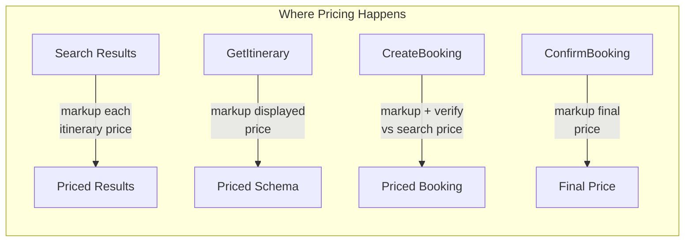

Every response that contains a price passes through the Pricing Engine. The gateway adds the client-specific markup on top of 12go's net price.

---

## 5. The State Problem

Honest assessment: the gateway cannot be 100% stateless. Here's what needs state and the minimal solution for each.

### 5.1 Booking Tokens — Self-Contained Encrypted Blobs

**Problem**: `GetItinerary` creates a cartId in 12go. `CreateBooking` needs that cartId. Time gap: seconds to minutes.

**Solution: Stateless encrypted token**

```
BookingToken = AES-256-GCM-Encrypt({
  cartId:       "abc123",
  tripId:       "trip_456",
  datetime:     "2026-03-15T08:00",
  netPrices:    { adult: 45.00, child: 30.00 },
  currency:     "THB",
  schemaHash:   "sha256:...",
  createdAt:    "2026-02-17T10:30:00Z",
  clientId:     "acme",
  contractCode: "ACME-TH"
})
```

The token IS the state. No database needed. It's opaque to the client, self-expiring (check `createdAt` + TTL), and tamper-proof (AES-GCM authenticated encryption).

**Risk**: If the cart expires in 12go before the client uses the token, the reserve call will fail. Mitigation: set token TTL slightly shorter than cart TTL (Q19 answer determines exact value).

### 5.2 Seat Lock — Redis with TTL

**Problem**: Client calls `LockSeats`, then calls `CreateBooking` later. 12go has no seat lock API.

**Solution: Redis with 15-minute TTL**

```
Key:    seatlock:{tripId}:{date}:{seatNumber}
Value:  {clientId}:{sessionId}
TTL:    15 minutes (auto-expire)
```

This is the unavoidable state in Option C. But it's minimal:
- No schema migration. No backup. No replication concern for durability.
- Seat locks are "best effort" — if Redis goes down, seat lock fails gracefully (clients can still book without locking).
- Data is ephemeral by design.

**Alternative considered**: Encode locked seats into the BookingToken and validate at `CreateBooking` time. Problem: this doesn't prevent two clients from "locking" the same seat, which is the whole point of seat locking.

### 5.3 Recheck State — Stateless (Delegated to Client)

**Problem**: Search may return `recheck=true`, meaning results are incomplete.

**Solution**: Pass `recheck` flag through to the client. The client re-sends the search request. The gateway re-calls 12go. No server-side session state needed.

```
Client → Gateway: GET /itineraries?from=X&to=Y&date=Z
Gateway → 12go: GET /search/Xp/Yp/Z
12go → Gateway: { trips: [...], recheck: true }
Gateway → Client: { itineraries: [...], recheck: true }

Client → Gateway: GET /itineraries?from=X&to=Y&date=Z&timeout=3
Gateway → 12go: GET /search/Xp/Yp/Z  (possibly with longer timeout)
12go → Gateway: { trips: [...], recheck: false }
Gateway → Client: { itineraries: [...], recheck: false }
```

No server state. The client drives the polling loop. The gateway is a pass-through.

### 5.4 Pricing Cache — Redis or In-Memory

**Problem**: Markup rules (per-client percentage, fixed fees) and exchange rates change, but not per-request. Fetching them on every request adds latency.

**Solution**: In-memory cache with short TTL

```
Markup rules:    In-memory, refresh every 5 minutes (or on config change webhook)
Exchange rates:  In-memory, refresh every 5 minutes (from Fuji/12go FX endpoint)
```

In-memory is fine because:
- Rules change infrequently (daily at most)
- All gateway instances will converge within 5 minutes
- Slight inconsistency between instances during refresh window is acceptable for pricing

### 5.5 Idempotency Keys — Redis with 24h TTL

**Problem**: `CreateBooking` and `ConfirmBooking` must not be duplicated on retries.

**Solution**: Redis with idempotency key

```
Key:    idempotency:{clientId}:{idempotencyKey}
Value:  {response JSON}
TTL:    24 hours
```

Client sends `X-Idempotency-Key` header. If key exists, return cached response. If not, process and store.

### State Summary

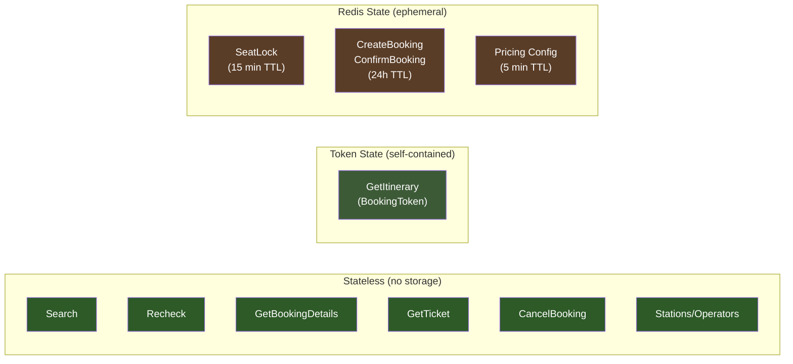

**Total Redis memory**: Negligible. Seat locks are tiny key-value pairs. Idempotency stores compressed responses. Pricing config is a single JSON blob per client. Estimated <100MB total.

---

## 6. Data Flow

### 6.1 Search Flow (Stateless)

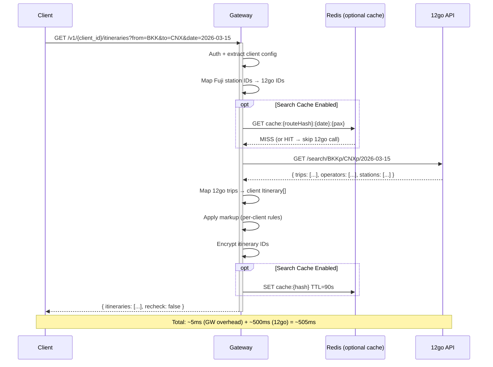

### 6.2 Booking Funnel (Where State Enters)

```mermaid
sequenceDiagram
    participant Client
    participant GW as Gateway
    participant Redis
    participant TGo as 12go API
    participant CL as Credit Line

    rect rgb(40, 60, 40)
    Note over Client,TGo: GetItinerary — creates self-contained BookingToken
    Client->>GW: GET /{client_id}/itineraries/{encrypted_id}
    GW->>GW: Decrypt itinerary ID → tripId + datetime
    GW->>TGo: GET /trip/{tripId}/{datetime}
    TGo-->>GW: Trip details + seat map
    GW->>TGo: POST /cart/{tripId}/{datetime}
    TGo-->>GW: cartId
    GW->>TGo: GET /checkout/{cartId}?people=1
    TGo-->>GW: Booking schema (form fields)
    GW->>GW: Apply markup to prices
    GW->>GW: Build BookingToken = encrypt({cartId, prices, schema...})
    GW-->>Client: PreBookingSchema + BookingToken (TOKEN IS THE STATE)
    end

    rect rgb(60, 50, 30)
    Note over Client,Redis: SeatLock — the one truly stateful operation
    Client->>GW: POST /{client_id}/bookings/lock_seats {token, seats}
    GW->>GW: Decrypt BookingToken
    GW->>Redis: SETNX seatlock:{trip}:{seat} → clientId (TTL 15m)
    Redis-->>GW: OK (or FAIL if already locked)
    GW-->>Client: Locked seats confirmation
    end

    rect rgb(60, 40, 40)
    Note over Client,TGo: CreateBooking — consumes token, checks credit
    Client->>GW: POST /{client_id}/bookings {token, passengers}
    GW->>GW: Decrypt BookingToken → cartId, prices, schema
    GW->>Redis: Check idempotency key
    Redis-->>GW: MISS (new request)
    GW->>CL: Check credit line balance
    CL-->>GW: OK (sufficient)
    GW->>GW: Build reserve request (serialize passengers)
    GW->>TGo: POST /reserve/{bookingId}
    TGo-->>GW: Reservation result
    GW->>TGo: GET /booking/{bookingId}
    TGo-->>GW: Full booking status + price
    GW->>GW: Apply markup, check price mismatch
    GW->>Redis: Store idempotency key (TTL 24h)
    GW-->>Client: Booking {id, status, price}
    end

    rect rgb(40, 40, 60)
    Note over Client,TGo: ConfirmBooking — straightforward pass-through
    Client->>GW: POST /{client_id}/bookings/{id}/confirm
    GW->>TGo: POST /confirm/{bookingId}
    TGo-->>GW: Confirmation result
    GW->>TGo: GET /booking/{bookingId}
    TGo-->>GW: Final status + ticket info
    GW->>GW: Apply markup to final price
    GW-->>Client: Confirmed booking
    end
```

### 6.3 Post-Booking (Stateless Pass-Through)

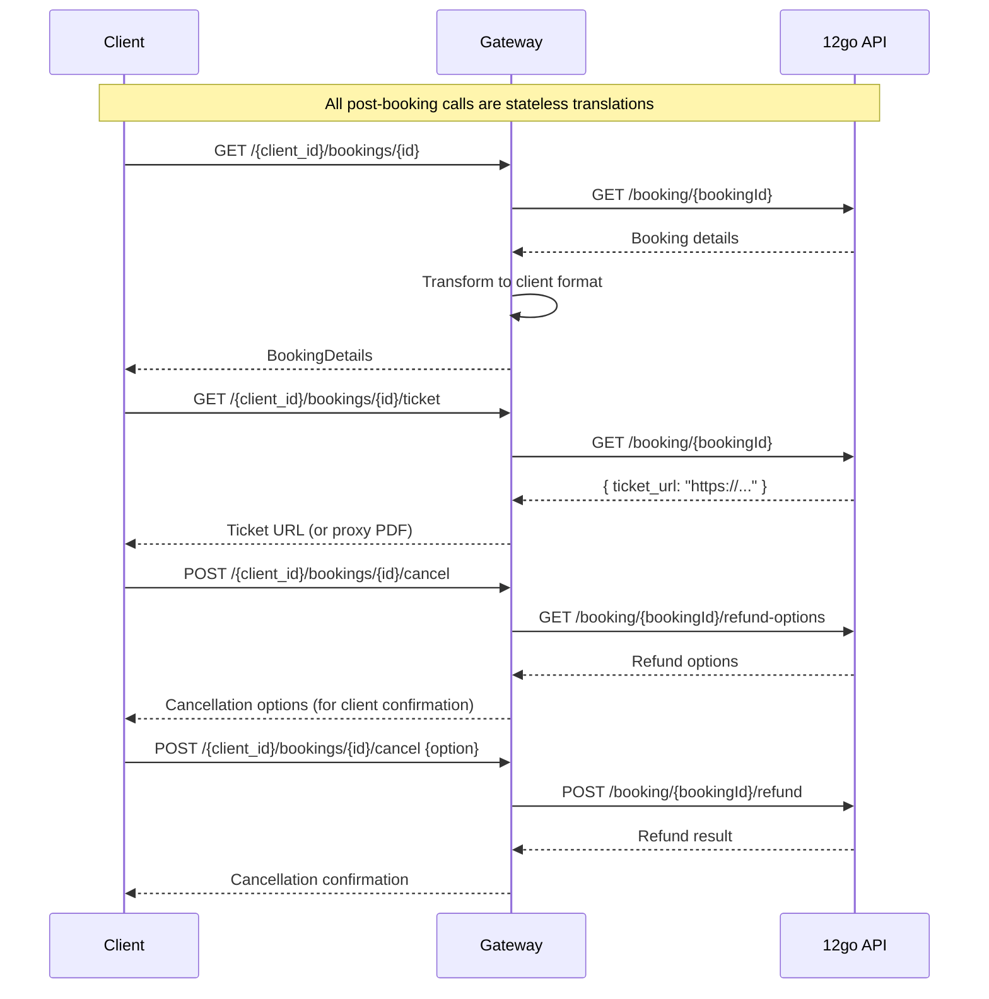

### 6.4 Async Incomplete Results Pattern

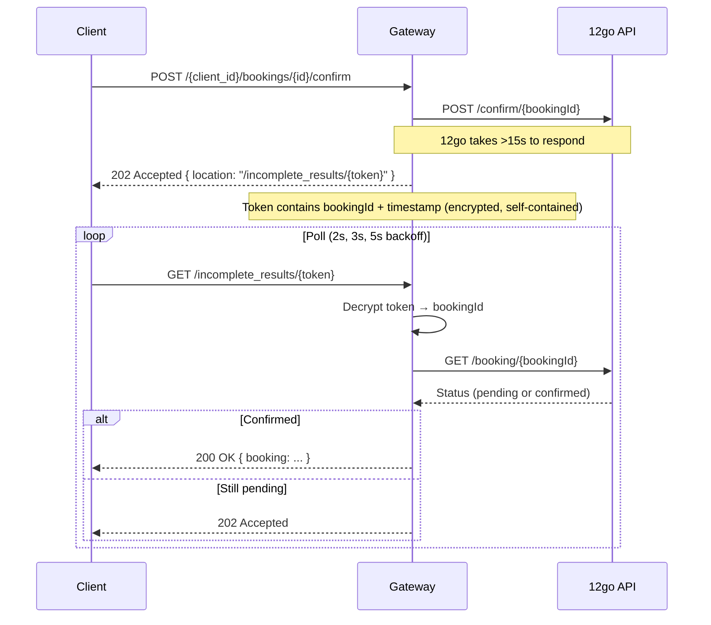

Note: The incomplete results token is self-contained (encrypted bookingId). No server-side state needed for the async pattern.

---

## 7. Pricing/Markup in the Gateway

This is the hardest part of the "thin" approach. The gateway must calculate sell prices for every response containing money.

### Option Evaluation

| Approach | Pros | Cons | Latency Impact |
|---|---|---|---|
| **A: Inline pricing** (gateway does math) | Simplest. No extra service. Co-located with response transformation. | Makes gateway "thicker." Pricing logic lives in the translator. | +1-2ms |
| **B: Sidecar pricing service** | Clean separation. Pricing team owns it independently. | Extra network hop. Extra service to deploy. Over-engineering for math. | +5-15ms |
| **C: Pre-computed price tables in Redis** | Fastest lookup. No computation at request time. | Stale prices. Complex cache invalidation. Combinatorial explosion (client x operator x currency). | +1ms |

### Recommendation: Option A — Inline Pricing

**Justification:**

1. Pricing is simple math: `sellPrice = netPrice * (1 + markupPercentage) + fixedFee`. This is not complex business logic — it's a formula applied to a number.

2. Markup rules are per-client configuration, fetched once and cached in-memory (refresh every 5 min). No database query per request.

3. Exchange rates are fetched from Fuji/12go FX endpoint, cached in-memory (refresh every 5 min).

4. The alternative (sidecar or Redis tables) adds latency and operational complexity for what amounts to a multiplication operation.

**Implementation sketch:**

```
PricingEngine:
  - loadMarkupRules(clientId, contractCode) → { percentage: 15%, fixedFee: 0 }
  - loadExchangeRates() → { THB→USD: 0.029, THB→EUR: 0.026, ... }
  - applyMarkup(netPrice, currency, clientRules) → sellPrice
  - convertCurrency(amount, fromCurrency, toCurrency) → convertedAmount

Called at:
  - Search: markup each itinerary's price
  - GetItinerary: markup displayed price, embed net price in token
  - CreateBooking: verify price hasn't changed beyond threshold, markup final price
  - ConfirmBooking: markup confirmed price
```

**What about credit line?** Credit line is a separate concern — it's a balance check, not pricing. The gateway calls the credit line service (Ushba or 12go internal) via HTTP before reserve. This stays as an external call.

---

## 8. Observability

A thin gateway has a natural observability advantage: one service to instrument, one hop to trace.

### Request/Response Logging with Business Context

Every request gets enriched with business dimensions via middleware:

```
{
  "timestamp": "2026-02-17T10:30:00Z",
  "level": "info",
  "message": "Search completed",
  "trace_id": "abc-123-def",
  "span_id": "ghi-456",
  "client_id": "acme",
  "endpoint": "search",
  "12go_endpoint": "/search/BKKp/CNXp/2026-03-15",
  "12go_latency_ms": 487,
  "our_overhead_ms": 12,
  "result_count": 15,
  "recheck": false,
  "status_code": 200
}
```

For booking flows, add `booking_id`, `itinerary_id`, `integration_id`.

### OpenTelemetry Integration

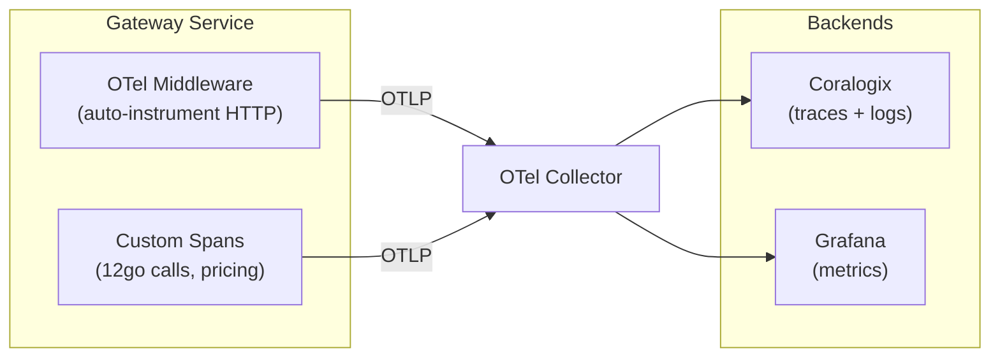

**Trace structure per request:**

```
[Gateway] receive_request (root span)
  ├── [Gateway] auth_middleware
  ├── [Gateway] transform_request
  ├── [Gateway] call_12go_search          ← HTTP client span (auto-instrumented)
  │     └── [12go] /search/BKKp/CNXp/... ← continued if 12go propagates W3C trace
  ├── [Gateway] apply_pricing
  ├── [Gateway] transform_response
  └── [Gateway] send_response
```

### Metrics (RED + Business)

| Metric | Type | Tags |
|---|---|---|
| `gateway.request.duration` | Histogram | `endpoint`, `client_id`, `status_code` |
| `gateway.request.errors` | Counter | `endpoint`, `client_id`, `error_type` |
| `gateway.12go.duration` | Histogram | `12go_endpoint`, `client_id` |
| `gateway.12go.errors` | Counter | `12go_endpoint`, `status_code` |
| `gateway.pricing.markup_applied` | Counter | `client_id`, `contract_code` |
| `gateway.search.result_count` | Histogram | `client_id` |
| `gateway.search.cache_hit` | Counter | `client_id`, `cache_level` |
| `gateway.booking.price_mismatch` | Counter | `client_id` |
| `gateway.seatlock.active` | Gauge | — |
| `gateway.seatlock.expired` | Counter | — |

### Dashboard Requirements

1. **API Health** — Request rate, error rate, p50/p95/p99 latency per endpoint
2. **12go Upstream** — 12go response time, error rate, circuit breaker state
3. **Booking Funnel** — Conversion rates: search → getItinerary → reserve → confirm
4. **Pricing** — Markup applied, price mismatch rate, FX rate staleness

---

## 9. Scaling

### Horizontal Scaling (the easy part)

The gateway is nearly stateless — horizontal scaling is trivial:

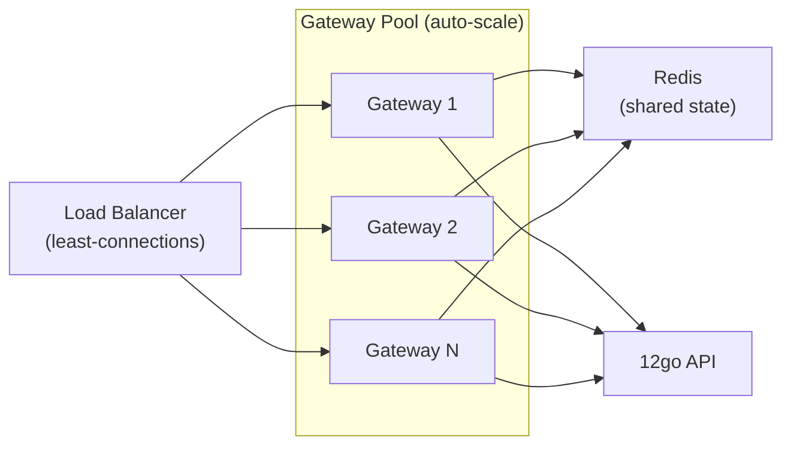

**Auto-scaling triggers:**
- Scale out: CPU > 60% for 2 min, or p95 latency > 3s, or request queue > 50
- Scale in: CPU < 30% for 5 min
- Min: 2 instances (availability), Max: 10 instances (cost cap)

### Connection Pooling to 12go

- `HttpClient` with `SocketsHttpHandler`: max 50-100 connections per instance
- Total pool across N instances: N * 50 = max concurrent 12go connections
- **Critical**: Coordinate with 12go team (Q18) to ensure they can handle the connection load

### Rate Limiting (protect 12go)

```
Per-client:  100-500 search/min, 50 booking/min (configurable)
Global:      Token bucket in Redis, shared across instances
             Max 1000 12go calls/min (adjustable per Q18 answer)
```

Rate limiting is a **gateway-level concern** — use middleware, not custom code. If using Kong/NGINX in front, delegate rate limiting there.

### CDN/Edge Caching

| Endpoint | CDN Cacheable? | TTL |
|---|---|---|
| Stations/Operators | Yes | 1 hour |
| Search results | Risky (real-time availability) | Only with stale-while-revalidate (60s) |
| Booking endpoints | No | Never |

**Recommendation**: CDN for stations/operators only. Search caching stays in Redis (application-level) if needed.

---

## 10. Gateway vs Custom Code

| Concern | Off-the-Shelf Gateway | Custom Code | Recommendation |
|---|---|---|---|
| **TLS termination** | Gateway (NGINX/Kong/ALB) | — | Gateway |
| **Authentication** | Gateway (API key validation) | — | Gateway |
| **Rate limiting** | Gateway (per-client) | — | Gateway |
| **Request logging** | Gateway (access logs) | Custom enrichment (business context) | Both |
| **Health checks** | Gateway (/health, /ready) | — | Gateway |
| **CORS** | Gateway | — | Gateway |
| **Contract translation** | Too complex for gateway rules | Custom (deeply structural transforms, enum mapping, ID encryption) | Custom |
| **Pricing/markup** | Not a gateway concern | Custom (business math) | Custom |
| **Seat lock** | Not a gateway concern | Custom (Redis state) | Custom |
| **Error mapping** | Basic (status codes) | Custom (12go error → client error format) | Custom |
| **Observability enrichment** | Basic (HTTP metrics) | Custom (business dimensions: clientId, bookingId) | Custom |

**Architecture**: NGINX/ALB (infra) → Gateway service (custom translation + pricing) → 12go

The custom code handles the ~20% that can't be declarative. The infrastructure gateway handles the ~80% that can.

---

## 11. Pros and Cons

### Pros

| Pro | Weight |
|---|---|
| **Simplest architecture** — one service, one Redis, no DB, no Kafka, no queues | Critical |
| **Easiest to understand** — any developer can trace a request end-to-end in minutes | High |
| **Language-agnostic** — the translation logic is pure data mapping. Can be rewritten in any language in weeks | High |
| **Fastest to build** — reuse existing 12go client code, strip everything else | High |
| **Lowest operational cost** — one deployment, one CI pipeline, one set of alerts | High |
| **Best observability** — single service means simple traces, no inter-service debugging | Medium |
| **Natural migration path** — start with search (stateless), add booking later | Medium |
| **Easy to abandon** — if this approach fails, pivot to Option A or B with minimal sunk cost | Medium |

### Cons

| Con | Weight | Mitigation |
|---|---|---|
| **Pricing logic makes it not truly "thin"** — markup math is business logic in the gateway | High | Accept it. Pricing is unavoidable unless 12go does it (Q17). Keep it isolated in a PricingEngine class. |
| **Seat lock faking requires state** — breaks pure statelessness | Medium | Minimal Redis with TTL. Graceful degradation if Redis is down. |
| **Less control over resilience** — no local booking persistence means if 12go is down, we can't serve GetBookingDetails | High | Accept this trade-off. If 12go is down, bookings are unavailable anyway. Add circuit breaker. |
| **No async processing** — can't do background jobs, scheduled tasks, data reconciliation | Medium | Push these concerns to 12go or a separate utility service if needed. |
| **Station mapping still needs Fuji** — or a translation table somewhere | Medium | Keep Fuji as-is for stations/operators, or negotiate 12go bulk endpoint (Q12). |
| **Single point of failure** — all client traffic through one service | Medium | Horizontal scaling + health checks + automated rollback. |
| **BookingToken complexity** — encrypted self-contained tokens are powerful but tricky (expiration, schema changes, key rotation) | Medium | Use standard JWT-like patterns. Test token expiration thoroughly. |
| **No data for analytics** — without local DB/Kafka, no historical booking data for our side | Low | Use OTel metrics and Coralogix logs for analytics. Or add optional Kafka producer for analytics events. |

---

## 12. Effort Estimate

| Phase | Task | Person-Weeks | Notes |
|---|---|---|---|
| **Phase 0: Foundation** | Project setup, CI/CD, Docker, health checks | 1 | .NET Minimal API scaffold |
| | Extract 12go client from SI framework | 1.5 | ~80 files, remove abstractions |
| | Pricing engine (extract from Etna/Denali) | 1 | Markup rules + FX rates |
| | Redis integration (seat lock, idempotency) | 0.5 | |
| | Contract test setup (Pact or golden files) | 1 | Record all current client contracts |
| **Phase 1: Search** | Search endpoint + contract translation | 1.5 | Station ID mapping, response transform |
| | Search caching (optional) | 0.5 | Redis cache layer |
| | Recheck handling | 0.5 | Pass-through to client |
| **Phase 2: Booking** | GetItinerary + BookingToken | 1.5 | 3 sequential 12go calls, token encryption |
| | SeatLock (Redis) | 0.5 | |
| | CreateBooking (reserve) | 1.5 | Credit line check, price verification |
| | ConfirmBooking | 0.5 | |
| | Incomplete results (async pattern) | 1 | 202 Accepted + polling |
| **Phase 3: Post-Booking** | GetBookingDetails | 0.5 | Stateless pass-through |
| | GetTicket | 0.5 | |
| | CancelBooking | 1 | 2-step refund flow |
| | Webhook receiver | 0.5 | If still needed (Q8) |
| **Phase 4: Validation** | Shadow traffic testing | 1.5 | Mirror search traffic, compare results |
| | Parallel run (booking) | 1 | Both paths, compare, old wins |
| | Performance testing | 0.5 | Latency budget verification |
| | Contract test verification | 0.5 | All contracts pass |
| **Phase 5: Cutover** | Gradual traffic shift (search) | 1 | 5% → 25% → 50% → 100% |
| | Gradual traffic shift (booking) | 1.5 | Slower, more careful |
| | Decommission old services | 1 | Remove Etna, Denali, SI framework |
| | | | |
| **Total** | | **~20 person-weeks** | ~5 months with 1 engineer |

**With 2 engineers**: ~12 weeks (3 months). Search and booking phases can partially overlap.

---

## 13. Risk Assessment

| # | Risk | Probability | Impact | Mitigation |
|---|---|---|---|---|
| 1 | **12go API can't handle direct traffic volume** (no caching buffer) | Medium | High — search degrades for all clients | Add search caching in Redis (60-120s TTL). Start with cache enabled and tune. Agree on rate limits with 12go (Q18). |
| 2 | **BookingToken approach fails** (cart expires, token too large, encryption key rotation issues) | Low | High — breaks entire booking funnel | Fallback: use Redis to store booking context (TTL 30 min) instead of self-contained tokens. Small state addition. |
| 3 | **Pricing regression** (sell prices differ from current system) | Medium | High — revenue impact | Extract pricing test suite with known inputs/outputs from current system. Run against new pricing engine. Golden file comparison. |
| 4 | **12go GetBookingDetails missing fields** (Q5 unanswered) | Medium | High — forces local DB, breaks "no DB" premise | If critical fields missing, add thin PostgreSQL layer for booking persistence. This shifts design closer to Option A. |
| 5 | **Client contract mismatch discovered late** (edge cases in response shapes, enum values, null handling) | Medium | Medium — client integration breaks | Pact contract tests from day 1. Shadow traffic with response comparison. Extended parallel run before cutover. |

---

## 14. Migration Path

### Endpoint-by-Endpoint Migration

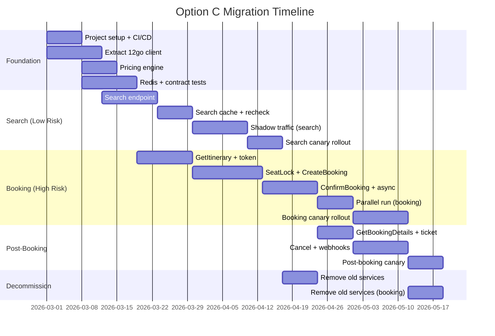

### Parallel Running Strategy

During migration, both old and new paths coexist:

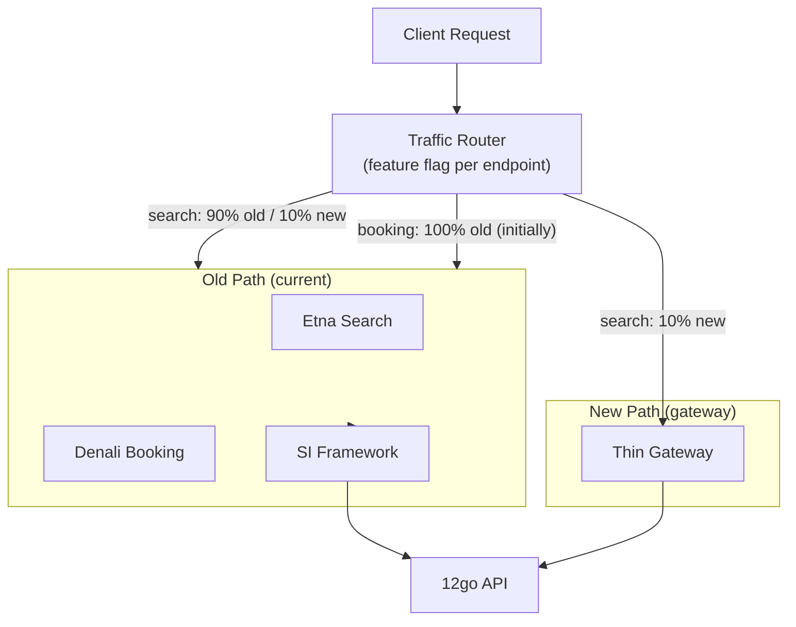

**Cutover sequence:**
1. **Stations/Operators** (read-only, lowest risk) — canary, validate, cutover
2. **Search** (read-only, high volume) — shadow traffic, compare results, gradual shift
3. **GetItinerary** (creates state via BookingToken) — careful testing of token flow
4. **Booking funnel** (write operations, financial risk) — parallel run with reconciliation
5. **Post-booking** (reads from 12go) — straightforward cutover after booking works
6. **Decommission** — remove old services one by one

---

## 15. When This Option Breaks Down

Be honest. Option C has limits.

### Scenarios Where Option C Is Insufficient

| Scenario | Why It Breaks | What to Do Instead |
|---|---|---|
| **12go wants us to own business logic** (e.g., custom routing, multi-supplier fallback, inventory management) | A "thin translator" can't own logic. It becomes a thick service wearing a thin disguise. | Switch to Option A (trimmed .NET) with proper service layer. |
| **12go GetBookingDetails is incomplete** (Q5 = no) | Need local booking persistence → need a database → no longer "no DB" | Add PostgreSQL. Design converges toward Option A. |
| **Client requirements grow** (new endpoints, custom workflows, client-specific logic beyond pricing) | Gateway accumulates logic. Each custom feature makes it thicker. Classic "Smart Gateway" anti-pattern. | Establish a strict scope boundary. If >5 custom features requested, upgrade to Option A. |
| **12go rate limits are very strict** (Q18 answer: <100 req/min) | Must add heavy caching → search cache, result cache, booking cache → gateway becomes a caching layer with state | Add aggressive caching. Design converges toward Option A with local state. |
| **Multiple suppliers needed again** | The entire premise of Option C is single-supplier simplicity. Multi-supplier requires orchestration, aggregation, fallback — none of which a thin gateway provides. | Revert to SI framework pattern or Option A. |
| **Analytics/reporting requirements** | No local data store means no historical queries, no booking reports, no revenue dashboards from our side | Add Kafka producer for analytics events (minimal) or accept that analytics lives in 12go's systems. |
| **Ticket PDF generation** | Current system generates custom PDFs. Option C proxies 12go's ticket_url. If clients need custom-branded PDFs, the gateway needs a rendering pipeline. | Keep ticket generation as a small sidecar service, or negotiate custom ticket branding with 12go (Q6). |
| **Webhook processing with complex logic** | If webhooks require multi-step processing (update local state, notify clients, retry), the gateway needs background workers — breaking the stateless model. | If webhooks are simple (forward to client), keep in gateway. If complex, add a small worker service. |

### The "Creep" Warning

The biggest risk of Option C is **gradual scope creep** that transforms a thin gateway into a thick one:

```
Week 1:  "Just translate contracts"
Week 4:  "Also do pricing"
Week 8:  "Also fake seat locks"
Week 12: "Also cache search results"
Week 16: "Also store bookings for analytics"
Week 20: "Also generate PDF tickets"
Week 24: Congratulations, you've built Option A.
```

**Guardrail**: If the gateway exceeds ~150 source files or ~3 Redis data types, reassess whether Option A would be more honest.

---

## Appendix A: BookingToken Specification

```
Format:  Base64URL(AES-256-GCM(JSON payload))
Max size: ~500 bytes (well within URL-safe limits if passed as body field)

Payload:
{
  "v": 1,                              // Token version
  "cid": "cart_abc123",                // 12go cart ID
  "tid": "trip_456",                   // 12go trip ID
  "dt": "2026-03-15T08:00",           // Trip datetime
  "np": { "adult": 4500, "child": 3000 }, // Net prices (cents, integer)
  "cur": "THB",                        // Currency
  "sh": "a1b2c3",                      // Schema hash (first 6 chars of SHA256)
  "cli": "acme",                       // Client ID
  "cc": "ACME-TH",                     // Contract code
  "exp": 1708175400,                   // Expiration (Unix timestamp)
  "pax": 2                             // Passenger count
}

Key rotation: Use key ID prefix. Token format: "{keyId}.{ciphertext}"
Expiration: Token valid for 20 minutes (or Q19 cart TTL minus 5-minute buffer)
```

## Appendix B: Redis Key Schema

```
# Seat locks
seatlock:{tripId}:{date}:{seatNumber}  →  {clientId}:{sessionId}
  TTL: 15 minutes

# Idempotency
idempotency:{clientId}:{idempotencyKey}  →  {compressed response JSON}
  TTL: 24 hours

# Search cache (optional)
search:{sha256(route+date+pax+currency)}  →  {search response JSON}
  TTL: 60-120 seconds

# Pricing config
pricing:rules:{clientId}  →  {markup rules JSON}
  TTL: 5 minutes (or until config change webhook)

pricing:fxrates  →  {exchange rates JSON}
  TTL: 5 minutes
```

Total Redis memory estimate: <100 MB for typical traffic patterns.

## Appendix C: Technology Decision Record

| Decision | Chosen | Alternatives Considered | Rationale |
|---|---|---|---|
| Service language | .NET Minimal API | Go, Node.js, PHP, Lambda | Reuse 80+ files of 12go client code; type safety for complex contract translation |
| State store | Redis (TTL-only) | DynamoDB, PostgreSQL, in-memory only | Minimal ops overhead; TTL handles all expiration; no schema migration needed |
| Booking state | Self-contained encrypted token | Redis session, DynamoDB | Truly stateless for the happy path; token carries all context |
| Pricing approach | Inline in gateway | Sidecar service, pre-computed tables | Simplest; pricing is simple math; no extra service needed |
| Observability | OTel SDK → Collector → Coralogix/Grafana | Datadog, custom logging | Aligned with existing infrastructure and research recommendations |
| Deployment | Single container, K8s | Multiple services, Lambda | Simplest ops model; all endpoints in one binary |
| Migration strategy | Endpoint-by-endpoint reverse strangler | Big bang, service-by-service | Industry best practice; validated by research; allows rollback per endpoint |
