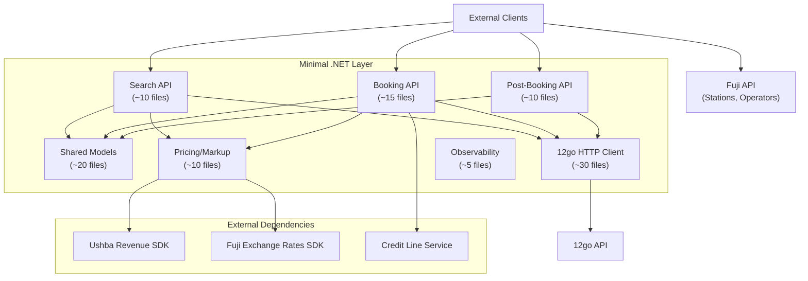
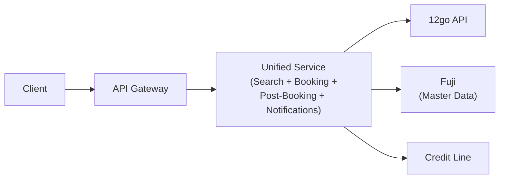
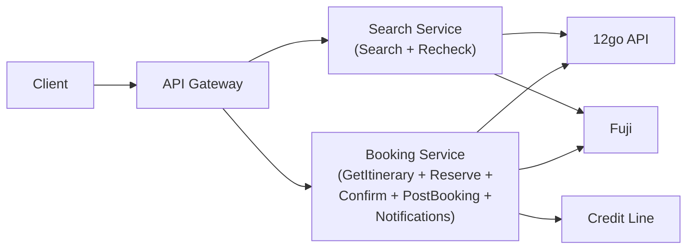
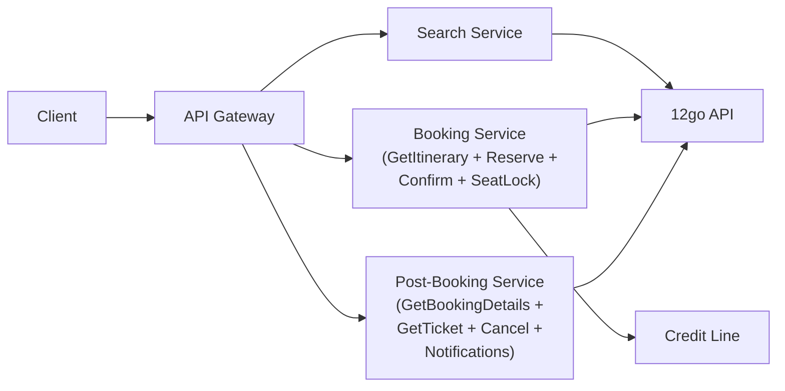
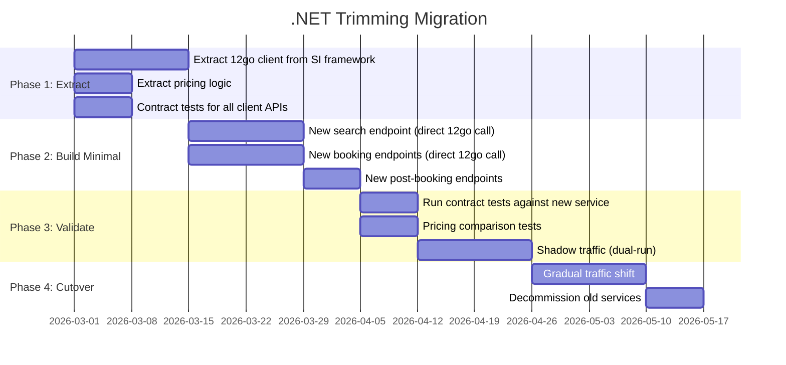

# .NET Trimming Analysis

## Executive Summary

The current .NET ecosystem spans **4 repositories** with **~3,500 source files** serving as a multi-supplier integration layer. With the transition to 12go as the sole backend, the vast majority of this code becomes unnecessary. The minimal surviving .NET footprint is a **thin adapter/proxy** that preserves client API contracts, applies pricing/markup, and forwards calls to 12go.

**Bottom line:** ~85-90% of .NET code can be discarded. What remains is the client-facing API shell, 12go HTTP call logic, pricing/markup, and observability.

---

## 1. Per-Service Keep/Trim/Discard Tables

### 1.1 Etna Search (~1,001 source files)

| Component | Classification | Rationale |
|---|---|---|
| **ItinerariesController** | KEEP | Client API contract — endpoint shape, validation, response format |
| **SearchRequest/SearchQuery models** | KEEP | Client request contract |
| **SearchResponse, Itinerary, Segment, Vehicle models** | KEEP | Client response contract |
| **EtnaSearchProcessorService** (retry logic) | TRIM | Retry/recheck for 12go partial results is valuable; strip everything else |
| **MarkupBehavior** | KEEP | Revenue/sell price calculation (Ushba Revenue SDK) |
| **RoutesDiscoveryBehavior** | TRIM | POI→station resolution still needed; simplify to direct lookup |
| **DirectAdapter** (SI Host path) | TRIM | Collapse into direct 12go call; remove SI Host indirection |
| **SearchEngine (MediatR orchestrator)** | DISCARD | Replace with direct method calls or 2-3 step pipeline |
| **CacheAdapter + entire cache pipeline** (8 behaviors) | DISCARD | No trip lake, no index cache, no online scoring |
| **IndexSearchBehaviour** | DISCARD | No index cache |
| **CacheOnlineScoringBehaviour + gRPC client** | DISCARD | ML scoring irrelevant for single supplier |
| **OperatorHealthBehaviour** | DISCARD | Single supplier — no health filtering |
| **DistributionRulesBehavior** | DISCARD | Multi-supplier distribution rules |
| **SourceAvailabilityBehavior** | DISCARD | Multi-source availability |
| **ExecutionPlanBuilderBehavior** | DISCARD | Multi-contract execution plans |
| **CacheDirectSupportBehaviour** | DISCARD | Cache/direct split |
| **ManualProductBehavior** | DISCARD | Manual/avia product splitting |
| **PlanOverrideBehaviour** | DISCARD | Plan override config |
| **ContractResolutionBehavior** | DISCARD | Multi-contract resolution (only one contract) |
| **SearchEventsBehavior** | TRIM | Keep minimal event tracking if analytics needed; otherwise discard |
| **ExperimentExecutor + shadow executions** | DISCARD | A/B experiments across suppliers |
| **In-process EventBus** | DISCARD | Search event bus |
| **Etna SI Host** (entire service) | DISCARD | Internal proxy that routes to SI framework — collapse into direct call |
| **Etna.Search.SupplierIntegration** project | DISCARD | SI framework registration for search |
| **FlowPipeline (legacy path)** | DISCARD | Legacy `ProcessWithOneTwoGoAsync` |
| **availability_data_writer** | DISCARD | Trip lake writer |
| **itinerary_data_writer** | DISCARD | Itinerary data writer |
| **prediction_cache_writer/reader** | DISCARD | ML prediction cache |
| **operator_health job** | DISCARD | Operator health monitoring |
| **routes_writer/routes_reader** | TRIM | Station/route data may need simplified form |
| **google-metasearch** | DISCARD | Separate concern, not part of core flow |
| **onetogo-suppliers** | DISCARD | Supplier sync jobs |
| **Etna.Mapper** projects | DISCARD | Entity mapping (move to Fuji or 12go) |
| **Etna.DataTransformation.Service** | DISCARD | Data transformation |
| **Etna.TestConductor** | DISCARD | Test infrastructure |
| **SearchItineraryIdUrlEncoderConverter** | KEEP | Client-facing ID format compatibility |
| **OneTwoGoRecheckCacheHandler** | TRIM | Recheck logic valuable but can simplify |

### 1.2 Denali booking-service (~500+ source files across sub-projects)

| Component | Classification | Rationale |
|---|---|---|
| **BookingController** | KEEP | Client API contract — GetItinerary, CreateBooking, ConfirmBooking, LockSeats |
| **API request/response models** (Booking, PreBookingSchema, TotalPrice) | KEEP | Client contract |
| **SiFacade** | TRIM | Core orchestrator — simplify by removing DynamoDB caching, old-method paths, simplify error handling |
| **BookingSiHost** | TRIM | Collapse SI framework indirection; call 12go directly |
| **PriceService / MarkupService** | KEEP | Pricing/markup logic is business-critical |
| **BookingSchemaPriceService** | KEEP | Schema price conversion with markup |
| **CreditLineProvider** | KEEP | Credit line balance checks |
| **ExchangeRateService** (Fuji SDK) | KEEP | Currency conversion |
| **KafkaMessagePublisher** | TRIM | Keep essential booking events only; discard internal analytics events |
| **ItineraryCacheService** (DynamoDB) | DISCARD | Re-fetch from 12go or use lightweight in-memory/Redis cache |
| **PreBookingCacheService** (DynamoDB) | TRIM | Still need to store schema between GetItinerary and CreateBooking; replace DynamoDB with simpler store |
| **BookingCacheService** (DynamoDB) | DISCARD | 12go stores bookings |
| **SupplierAdapterFactory + old-method path** | DISCARD | Legacy supplier adapter factory |
| **OneTwoGo supplier adapters** (in booking-service) | DISCARD | Duplicated in SI; call 12go directly |
| **Phantip/Songserm adapters** | DISCARD | Non-12go suppliers |
| **CaesarCypher** (ID encryption) | KEEP | Client-facing ID obfuscation |
| **BookingToken / ItineraryId / BookingId types** | KEEP | ID format compatibility |
| **BookingEntityBuilder** | TRIM | Simplify booking event construction |
| **IncompleteResultsService** (async flow) | TRIM | May keep for async confirm; evaluate need |
| **SchemaModel builders** (SeatSelection, Passenger, etc.) | KEEP | Booking schema construction for client response |
| **ReserveDataValidator** | KEEP | Input validation |
| **ExceptionHandlingMiddleware** | KEEP | Error response formatting |
| **Feature flag infrastructure** | TRIM | Resolve flags to constants; remove toggle machinery |
| **IntegrationResolverService** | DISCARD | Multi-integration resolution |
| **ContractService** | TRIM | Simplify to single-contract lookup |
| **SiObjectMapper / AutoMapper** | TRIM | Reduce mapping layers |

### 1.3 Denali post-booking-service

| Component | Classification | Rationale |
|---|---|---|
| **PostBooking API controllers** | KEEP | Client API contract — GetBookingDetails, GetTicket, Cancel |
| **PostBookingSiFacade** | TRIM | Simplify to direct 12go calls |
| **PostBookingSiHost** | DISCARD | SI framework indirection |
| **BookingPersistence** (DynamoDB) | TRIM | May keep minimal booking record; 12go is source of truth |
| **Ticket PDF generation** (ITicketPdfService, QR codes, templates) | KEEP | Value-add feature |
| **S3 storage for tickets** | KEEP | Ticket artifact storage |
| **CloudFront URL signing** | KEEP | Secure ticket URL delivery |
| **Kafka consumers** (SupplierReservationChanged, BookingEntityForPersist) | TRIM | Keep essential state sync; discard internal analytics |
| **Internal Booking API (generated)** | TRIM | Internal API between services — may not be needed if consolidated |

### 1.4 Denali booking-notification-service

| Component | Classification | Rationale |
|---|---|---|
| **WebhookController** | KEEP | Receives 12go booking status webhooks |
| **NotificationServiceExtension** | KEEP | Webhook processing pipeline |
| **Kafka publisher** (status change events) | TRIM | Keep if post-booking-service needs notifications; simplify |
| **SI framework notification handler** | DISCARD | Multi-supplier notification routing |

### 1.5 Fuji (~392 source files)

| Component | Classification | Rationale |
|---|---|---|
| **Exposure API** (stations, operators, POIs) | KEEP | Client-facing master data API |
| **Station/Operator/Vehicle repositories** | KEEP | Data access for master data |
| **S3 data contracts** | KEEP | Master data storage |
| **Content Management API** | TRIM | Evaluate if still needed; may be handled by 12go |
| **Content Management Job** (sync pipeline) | TRIM | Simplify sync from 12go |
| **ExchangeRates SDK** | KEEP | Used by Etna and Denali for currency conversion |
| **Code Mapping** | TRIM | Station/operator code mapping between systems |
| **Domain Enrichment** | TRIM | May simplify if 12go provides enriched data |
| **Entity Mapping (FujiDomainInternalAPI)** | TRIM | Internal mapping APIs |
| **Localization** | KEEP | Multi-language support |
| **Synchronizer** | TRIM | Data sync from 12go — simplify |
| **Domain Mapping Jobs** (Lambda functions) | TRIM | Simplify sync logic |
| **MasterData.Mapping.Sdk** | KEEP | Used by SI framework and other services |
| **delete_stale_stations.job** | TRIM | Simplify station lifecycle |

### 1.6 Supply-Integration Framework (~1,216 source files)

| Component | Classification | Rationale |
|---|---|---|
| **OneTwoGo.Common** (OneTwoGoApi, models, serialization) | KEEP | Core 12go HTTP call logic |
| **OneTwoGoUriBuilder** | KEEP | URL construction for 12go endpoints |
| **OneTwoGoHttpConnector** | KEEP | Auth injection and response validation |
| **OneTwoGoSearchSupplier** | KEEP | Search logic and response mapping |
| **OneTwoGoBookingFunnel** | KEEP | Reserve/Confirm logic |
| **OneTwoGoBookingSchema** | KEEP | Schema extraction and request transformation |
| **OneTwoGoPostBookingOperations** | KEEP | Cancel, GetReservation, GetTicketUrl |
| **OneTwoGoPostBookingNotifications** | KEEP | Notification handling logic |
| **OneTwoGo.Search mappers** (8 mappers) | KEEP | Trip→Itinerary data mapping |
| **OneTwoGo.Search tools** (RecheckManager, TripManager, TravelOptionManager) | KEEP | Search result processing |
| **OneTwoGoCache** | TRIM | Simplify caching between search and checkout |
| **OneTwoGoItineraryId / InternalItineraryId** | KEEP | ID format logic |
| **ErrorResponse parsing** | KEEP | 12go error handling |
| **SharedConstants** (date formats) | KEEP | Date/time formatting |
| **ReserveDataRequest.SerializeAsString()** | KEEP | Custom serialization for reserve API |
| **All non-12go integrations** (Bookaway, DeOniBus, Distribusion, FlixBus, Plataforma10, SeatOS, Sisorg, Songserm, Phantip, TcTour) | DISCARD | Not needed |
| **OneTwoGoInternal integration** | DISCARD | Separate internal integration |
| **Abstractions library** (ISiServiceProvider, ISiServiceScope, SupplierIntegrationBuilder) | DISCARD | Multi-supplier abstraction layer |
| **Autofac scoping infrastructure** | DISCARD | Per-integration DI scoping |
| **IntegrationHttpMiddleware** | DISCARD | Per-integration HTTP middleware routing |
| **ConnectorFactory** | DISCARD | HTTP connector factory |
| **SiMemoryCache / SiHybridCache** | DISCARD | Integration-scoped caching wrappers |
| **SiMetricsPublisher** | DISCARD | Integration-scoped metrics wrappers |
| **S3PersistenceProvider** | TRIM | Simplify to fixed paths |
| **CompositeSiConfigurationSource** | DISCARD | Legacy/Postgres config switching |
| **InboundAuthentication** | DISCARD | Authentication is at API gateway |
| **Configuration SDK** | DISCARD | Configuration management for multi-integration |
| **Integration Settings API/Host** | DISCARD | Settings management service |
| **Dummy integration** | DISCARD | Test integration |
| **CertificationTests** | DISCARD | Multi-supplier certification |

---

## 2. Minimal .NET Footprint

The absolute minimum .NET code needed to preserve client contracts while calling 12go directly:



### Minimal File Count Estimate

| Layer | Files | Description |
|---|---|---|
| Client API Controllers | ~5 | Search, Booking, PostBooking, Notification, Health |
| Request/Response Models | ~25 | API contract models (SearchResponse, Booking, PreBookingSchema, etc.) |
| 12go HTTP Client | ~30 | OneTwoGoApi, UriBuilder, HttpConnector, all request/response models, mappers |
| Pricing/Markup | ~10 | PriceService, MarkupService, ExchangeRateService integration |
| ID Types | ~5 | ItineraryId, BookingId, BookingToken, SearchItineraryId |
| Observability | ~5 | Metrics, structured logging |
| Configuration | ~3 | App settings, feature flags (resolved to constants) |
| Error Handling | ~5 | Exception types, middleware |
| Recheck Logic | ~3 | Retry for partial search results |
| Schema Builders | ~8 | Booking schema construction |
| **Total** | **~100 files** | Down from ~3,500 |

This represents roughly **3%** of the current codebase.

---

## 3. Microservice Boundary Options

### Option 1: Single Monolith



| Aspect | Assessment |
|---|---|
| **Pros** | Simplest deployment. No inter-service communication. Shared in-memory state (e.g., search→booking token without external cache). Easiest to develop and debug. Single CI/CD pipeline. |
| **Cons** | Single scaling unit. Search traffic patterns (bursty, read-heavy) differ from booking (lower volume, write-heavy). Larger blast radius on failures. Team ownership boundaries blurred. |
| **Scaling** | Horizontal pod scaling handles both search and booking. Search is ~10-50x more volume than booking, so you over-provision booking capacity. |
| **Team ownership** | Single team or very tight collaboration required. |
| **Recommendation** | **Best fit for this use case.** The .NET layer is a thin proxy — there's not enough business logic to justify separate services. Internal method calls replace all inter-service HTTP. |

### Option 2: Two Services (Search + Booking)



| Aspect | Assessment |
|---|---|
| **Pros** | Independent scaling of search (high volume) vs booking (lower volume). Clear boundary: search is stateless read, booking is stateful write. Can deploy search changes without affecting booking. |
| **Cons** | GetItinerary call lives in booking but conceptually bridges search→booking. Shared 12go client library needed. Pricing logic duplicated or shared via package. Two CI/CD pipelines. |
| **Scaling** | Search scales to handle traffic spikes independently. Booking scales for booking volume. Good resource efficiency. |
| **Team ownership** | Natural split if two teams exist. |
| **Recommendation** | **Viable if team structure demands separation.** The boundary is clean: search returns itinerary IDs, booking consumes them. |

### Option 3: Three Services (Search + Booking + Post-Booking)



| Aspect | Assessment |
|---|---|
| **Pros** | Mirrors current architecture (easier migration path). Post-booking has different availability requirements (must survive even if booking is down). Notifications isolated. |
| **Cons** | Over-engineering for a thin proxy layer. Three deployment units for ~100 files of code. Inter-service communication needed (booking must notify post-booking). More operational overhead. Notification service adds a 4th if kept separate. |
| **Scaling** | Each service scales independently, but the volume differences don't justify the operational cost. |
| **Team ownership** | Only justified with 3+ teams. |
| **Recommendation** | **Not recommended.** The post-booking surface is too small to warrant its own service when the .NET layer is just a proxy. |

### Recommendation Summary

| Factor | Monolith | Two Services | Three Services |
|---|---|---|---|
| Complexity | Low | Medium | High |
| Operational overhead | Low | Medium | High |
| Scaling efficiency | Adequate | Good | Over-provisioned |
| Development velocity | Highest | Good | Slower |
| Fault isolation | Lower | Good | Best |
| **Fit for thin proxy** | **Best** | Acceptable | Over-engineered |

**Recommended: Option 1 (Monolith)** with Fuji remaining separate (it has a different lifecycle and data sync concerns). If the team grows or search volume becomes extreme, evolve to Option 2.

---

## 4. MediatR Evaluation

### Current State

Etna Search uses MediatR with **11 pipeline behaviors** in a streaming pipeline (`IStreamRequestHandler`):

1. SearchEventsBehavior
2. DistributionRulesBehavior
3. SourceAvailabilityBehavior
4. MarkupBehavior
5. ExecutionPlanBuilderBehavior
6. CacheDirectSupportBehaviour
7. ManualProductBehavior
8. PlanOverrideBehaviour
9. ContractResolutionBehavior
10. OperatorHealthBehaviour
11. RoutesDiscoveryBehavior

Plus a terminal handler (Executor) that fans out to DirectAdapter and CacheAdapter.

### After Trimming

Only **2-3 concerns** survive:
1. **Route resolution** (POI→station mapping)
2. **12go API call** (direct search)
3. **Markup/pricing** (apply revenue rules to results)

### Option A: Keep MediatR (Simplified)

```csharp
// 2-3 behaviors instead of 11
services.AddMediatR(cfg => {
    cfg.AddBehavior<RouteResolutionBehavior>();
    cfg.AddBehavior<MarkupBehavior>();
    // Terminal handler: direct 12go call
});
```

**Pros:**
- Cross-cutting concerns cleanly separated
- Easy to add new behaviors later (logging, rate limiting)
- Familiar pattern for current team

**Cons:**
- Heavy dependency (MediatR + DI registration) for 2-3 steps
- Streaming pipeline (`IAsyncEnumerable`) adds complexity
- Indirection makes debugging harder for a simple flow
- New team members must learn MediatR

### Option B: Simple Method Calls

```csharp
public class SearchService
{
    public async Task<SearchResponse> Search(SearchQuery query)
    {
        var routes = await _routeResolver.ResolveRoutes(query);
        var itineraries = await _twelveGoClient.Search(routes, query);
        var pricedItineraries = await _markupService.ApplyMarkup(itineraries, query.ContractCode);
        return BuildResponse(pricedItineraries);
    }
}
```

**Pros:**
- Dead simple — 3 method calls, easy to read and debug
- No framework dependency
- Easy for any developer to understand
- Perfect fit for a thin proxy layer
- Fastest execution (no pipeline overhead)

**Cons:**
- Cross-cutting concerns (logging, metrics) mixed into the method
- Adding new steps requires modifying the method
- Less "architectural" (but the flow IS simple)

### Recommendation

**Option B: Simple method calls.** The surviving pipeline is too simple to justify MediatR's abstraction overhead. Three sequential steps (resolve routes → call 12go → apply markup) are clearest as direct method calls. Cross-cutting concerns (logging, metrics, error handling) can be added with middleware or decorators if needed.

MediatR adds value when you have 5+ behaviors, complex ordering, or need to decouple handlers from callers. With 2-3 steps in a thin proxy, it's unnecessary abstraction.

---

## 5. Architectural Pattern Assessment

### Context

The surviving .NET layer is a **thin adapter/proxy** over 12go. It:
- Accepts client requests in one format
- Translates to 12go API format
- Calls 12go
- Applies pricing/markup
- Returns response in client format

This is fundamentally an **anti-corruption layer** / **adapter** — not a rich domain.

### Pattern Evaluation

| Pattern | Fit | Assessment |
|---|---|---|
| **DDD** | Poor | No rich domain. No aggregates, no domain events, no invariants. The "domain" is price markup and ID translation. DDD would add entity/value-object ceremony for no benefit. |
| **CQRS** | Poor | Search (query) and booking (command) have different shapes, but both are thin proxies to the same 12go API. No separate read/write stores. CQRS adds complexity without value here. |
| **Clean Architecture** (Ports & Adapters) | Moderate | The port (client API contract) and adapter (12go client) concept fits conceptually. But with only one adapter (12go), the abstraction layer between "use cases" and "infrastructure" is unnecessary indirection. |
| **Vertical Slice** | Good | Each endpoint is a self-contained slice: controller → service → 12go call. Minimal shared code (just the 12go client and pricing). Slices don't need to know about each other. |
| **Simple Layered** | Best | Three layers — API (controllers), Services (orchestration + pricing), Infrastructure (12go client) — is the natural fit for a thin proxy. No need for more sophisticated patterns. |

### Recommended Architecture

```
┌─────────────────────────────────────┐
│           API Layer                  │
│  (Controllers, Models, Validation)   │
├─────────────────────────────────────┤
│         Service Layer                │
│  (SearchService, BookingService,     │
│   PricingService, RecheckService)    │
├─────────────────────────────────────┤
│       Infrastructure Layer           │
│  (TwelveGoClient, CreditLineClient,  │
│   ExchangeRateClient, Observability) │
└─────────────────────────────────────┘
```

**Simple three-layer architecture** with these principles:
- **No abstractions for single implementations.** Don't create `ISearchService` if there's only one `SearchService`. Use interfaces only where you need testability or have multiple implementations.
- **Thin services.** Each service method is a short orchestration: validate → call 12go → transform → apply pricing → return.
- **Shared 12go client.** A single `TwelveGoClient` class wraps all 12go API calls with retry, timeout, auth, and error handling.
- **No DynamoDB.** Replace caching with in-memory or Redis for the minimal state needed (booking schema between GetItinerary and CreateBooking).

---

## 6. Code Survival Estimate

### By Repository

| Repository | Total .cs Files | Surviving Files (est.) | Survival % | Notes |
|---|---|---|---|---|
| **Etna** | ~1,001 | ~30 | ~3% | Only controller, models, recheck, markup. Everything else (search engine, cache pipeline, data writers, mapper, google metasearch, SI host, operator health, predictions) discarded. |
| **Denali** | ~916 | ~60 | ~7% | Controller, SiFacade (heavily trimmed), pricing, schema builders, ID types, error handling. DynamoDB caching, old-method paths, Kafka analytics events discarded. |
| **Supply-Integration** | ~1,216 | ~80 | ~7% | Only OneTwoGo integration (~80 files) survives. All other integrations (~70+ projects), abstractions, Autofac infrastructure, config service, SDK discarded. |
| **Fuji** | ~392 | ~200 | ~51% | Exposure API, exchange rates, localization, and sync jobs mostly survive. Content management and some mapping may simplify. |
| **Total** | **~3,525** | **~370** | **~10%** | |

### By Concern

| Concern | Current Size | After Trimming | Notes |
|---|---|---|---|
| Multi-supplier abstraction | ~500 files | 0 | Entirely discarded |
| Non-12go integrations | ~800 files | 0 | 10 integrations discarded |
| Cache pipeline | ~200 files | 0 | Trip lake, index, prediction, online scoring |
| DynamoDB caching | ~50 files | 0 | All 4 DynamoDB cache services |
| Kafka events (analytics) | ~80 files | ~10 | Keep essential booking events only |
| Client API contracts | ~50 files | ~50 | Fully preserved |
| 12go HTTP logic | ~80 files | ~80 | Fully preserved |
| Pricing/markup | ~30 files | ~30 | Fully preserved |
| Observability | ~30 files | ~15 | Simplified (no per-integration scoping) |
| Master data (Fuji) | ~200 files | ~150 | Simplified sync |
| ID types and encryption | ~15 files | ~15 | Fully preserved |

---

## 7. Dependencies to Keep/Replace

### NuGet Packages

| Package | Used By | Verdict | Rationale |
|---|---|---|---|
| **MediatR** | Etna SearchEngine | DISCARD | Replace with direct method calls (see Section 4) |
| **Autofac** | Supply-Integration | DISCARD | Standard .NET DI replaces Autofac keyed services |
| **AWSSDK.DynamoDBv2** | Denali | DISCARD | No more DynamoDB caching |
| **Confluent.Kafka** | Denali | TRIM | Keep if essential booking events are needed; otherwise replace with simpler messaging |
| **Ushba.Revenue.Search.Sdk** | Etna | KEEP | Search markup calculation |
| **Ushba.Revenue.Booking.Sdk** | Denali | KEEP | Booking markup calculation |
| **FujiContentManagement.ExchangeRates.SDK** | Denali, Etna | KEEP | Currency conversion |
| **Connect.Infra.Cyphering** | Denali | KEEP | CaesarCypher for ID encryption |
| **Connect.Infra.Context** | Denali, Etna | TRIM | Keep context propagation; simplify |
| **Connect.Infra.Observability** | All | KEEP | OpenTelemetry integration |
| **Connect.Infra.ExternalApi.AspNetCore** | Denali, Etna | TRIM | HTTP client infrastructure; may simplify |
| **Microsoft.FeatureManagement** | All | TRIM | Resolve feature flags to constants; keep if ongoing experimentation planned |
| **Polly** | All | KEEP | HTTP retry/circuit breaker for 12go calls |
| **Swashbuckle.AspNetCore** | All APIs | KEEP | Swagger documentation |
| **Microsoft.AspNetCore.Mvc.NewtonsoftJson** | Denali, Etna | KEEP | JSON serialization compatibility |
| **AutoMapper** | Denali | DISCARD | Replace with manual mapping or Mapperly |
| **Riok.Mapperly** | Etna | KEEP | Source-generated mapping (zero-allocation) |
| **ApplicationConfig.Wrapper** | Denali, Etna | DISCARD | AWS AppConfig wrapper — use appsettings |
| **Connect.Infra.Experimentation** | Etna | DISCARD | A/B testing framework |
| **carmel.distribution.contract.sdk** | Etna, Denali | DISCARD | Distribution rules for multi-supplier |
| **carmel.distribution.sdk** | Etna | DISCARD | Distribution rules implementation |
| **Google.Protobuf / Grpc.** | Etna | DISCARD | Online scoring gRPC client |
| **Etna.Messages** | Denali, Etna | TRIM | Keep essential message types; discard search analytics events |
| **Denali.Booking.Messages** | Denali | TRIM | Keep booking lifecycle events only |
| **boost.MessageBus / boostMessages** | Denali | DISCARD | Internal messaging — replace with direct method calls |
| **connect.platform.client-identity-middleware** | Denali, Etna | TRIM | Keep if API gateway doesn't fully handle auth; otherwise discard |
| **Boost.Infra.Observability.Metrics** | Denali | KEEP | Metrics collection |
| **Microsoft.Extensions.Caching.Hybrid** | Etna | TRIM | Keep if lightweight caching needed |
| **Infra.BoostHost** | Denali | TRIM | Host bootstrap — evaluate if standard .NET hosting suffices |
| **OneOf** | Etna | DISCARD | Used in cache pipeline discriminated unions |
| **NLog.Extensions.Logging** | All | KEEP | Logging infrastructure |
| **MasterData.Mapping.Sdk** (Fuji) | SI Framework | KEEP | Station/operator mapping |
| **SupplyIntegration NuGet** (abstractions) | Etna, Denali | DISCARD | Replace with direct 12go client |
| **SupplyIntegration.Configuration.Sdk** | Etna, Denali | DISCARD | Configuration management for multi-integration |

### Internal Libraries

| Library | Verdict | Rationale |
|---|---|---|
| **Connect.Infra.*** packages | TRIM | Keep Cyphering, Context, Observability. Discard Experimentation, ProductId (simplify). |
| **Denali.BookingIdType** | KEEP | BookingId format compatibility |
| **Denali.Common** | TRIM | Keep error messages, utilities; discard feature flag enums for removed flags |
| **Etna.Common.Types** | TRIM | Keep shared types; discard search-specific types |
| **Etna.IdGenerator** | KEEP | ID generation |
| **Denali.Booking.ApiModels** | KEEP | Client API models |
| **Etna.Search.ApiModels** | KEEP | Client API models |
| **Denali.Booking.Api.Generated** | KEEP | OpenAPI-generated controllers and models |

---

## 8. Transition Risks and Mitigation

| Risk | Impact | Mitigation |
|---|---|---|
| **Breaking client API contracts** | High — external clients depend on exact shapes | Contract tests (Pact or similar) before and after; golden file comparison |
| **Pricing regression** | High — revenue impact | Extract pricing tests with known inputs/outputs; run against new implementation |
| **12go API error handling gaps** | Medium — uncaught errors from 12go | Keep entire `ErrorResponse` parsing and exception hierarchy |
| **ID format incompatibility** | High — active bookings use current ID formats | Keep all ID types (BookingId, ItineraryId, BookingToken); maintain backward compatibility |
| **Missing observability** | Medium — blind spots in production | Preserve metric tag schemas (clientId, integrationId, contractCode, bookingId) |
| **Recheck logic regression** | Medium — partial search results returned as complete | Keep recheck/retry logic intact from EtnaSearchProcessorService |
| **Lost booking state** | High — bookings in DynamoDB during transition | Migration plan for in-flight bookings; dual-write period |

---

## 9. Recommended Migration Sequence



---

## Appendix A: File Counts by Project

| Repository | Project | .cs Files (non-obj) |
|---|---|---|
| **Etna** | api/ (Search.Api, ApiModels, ApiService, ApiReporting) | ~60 |
| | search-engine/ (etna.searchengine) | ~80 |
| | supplier-integration/ (SI Host + Prefetch) | ~40 |
| | FlowPipeline/ | ~20 |
| | availability_data_writer/ | ~15 |
| | itinerary_data_writer/ | ~15 |
| | prediction_cache_writer/reader/ | ~20 |
| | operator_health/ | ~15 |
| | google-metasearch/ | ~30 |
| | Mapper projects | ~40 |
| | Other (routes, OnDemand, TestConductor, etc.) | ~60 |
| | Tests | ~100 |
| **Denali** | booking-service/ (host, providers, contracts) | ~200 |
| | post-booking-service/ | ~100 |
| | booking-notification-service/ | ~30 |
| | api/ (ApiModels, ApiService) | ~80 |
| | shared/ (Denali.Common) | ~40 |
| | mapper/ | ~30 |
| | Tests | ~200 |
| **Supply-Integration** | abstractions/ (core framework) | ~150 |
| | integrations/onetwogo/ | ~80 |
| | integrations/ (all others, 10 suppliers) | ~700 |
| | integration_service/ (settings API + SDK) | ~60 |
| | Tests | ~200 |
| **Fuji** | exposure/ | ~50 |
| | content_management/ | ~100 |
| | code_mapping/ | ~30 |
| | domain_enrichment/ | ~25 |
| | entity_mapping/ | ~30 |
| | localization/ | ~25 |
| | synchronizer/ | ~15 |
| | SDKs + Jobs | ~30 |
| | Tests | ~80 |

## Appendix B: 12go API Endpoints Used

These are the 12go API endpoints that must be callable from the surviving .NET code:

| 12go Endpoint | Method | Used For |
|---|---|---|
| `/search/{from}p/{to}p/{date}` | GET | Search itineraries |
| `/trip/{tripId}/{datetime}` | GET | Get trip details (GetItinerary step 1) |
| `/cart/{tripId}/{datetime}` | POST | Add to cart (GetItinerary step 2) |
| `/checkout/{cartId}` | GET | Get booking schema (GetItinerary step 3) |
| `/reserve/{bookingId}` | POST | Create reservation |
| `/confirm/{bookingId}` | POST | Confirm booking |
| `/booking/{bookingId}` | GET | Get booking details / status / ticket URL |
| `/booking/{bookingId}/refund-options` | GET | Get cancellation options |
| `/booking/{bookingId}/refund` | POST | Execute cancellation/refund |

All calls go through `OneTwoGoApi` → `OneTwoGoUriBuilder` → `OneTwoGoHttpConnector` (auth + validation) → `HttpClient`.

## Appendix C: Preserved Observability Tags

These metric/trace tags must be preserved for dashboard and alert continuity:

| Tag | Source | Used For |
|---|---|---|
| `clientId` | Request context | Per-client monitoring |
| `integrationId` | ID types | Will be "OneTwoGo" (constant, but keep for compatibility) |
| `contractCode` | ID types | Contract-level monitoring |
| `bookingId` | Booking flow | Booking lifecycle tracking |
| `itineraryId` | Search/booking flow | Search-to-booking correlation |
| `operatorId` | Search results | Operator-level performance |
| `fromStationId` / `toStationId` | Search/booking | Route-level monitoring |
| `status` | Booking responses | Booking status distribution |
