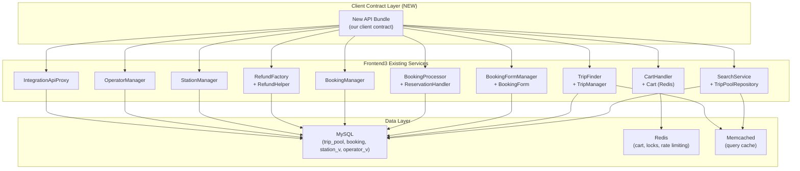
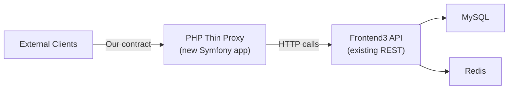
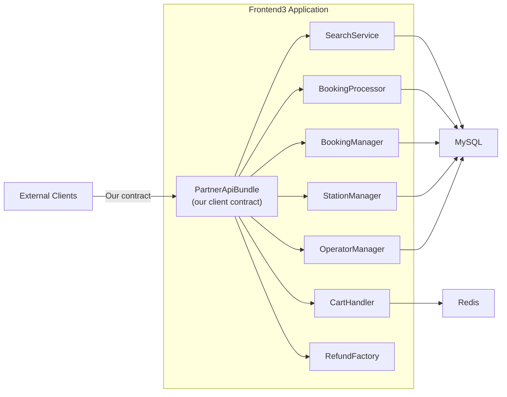
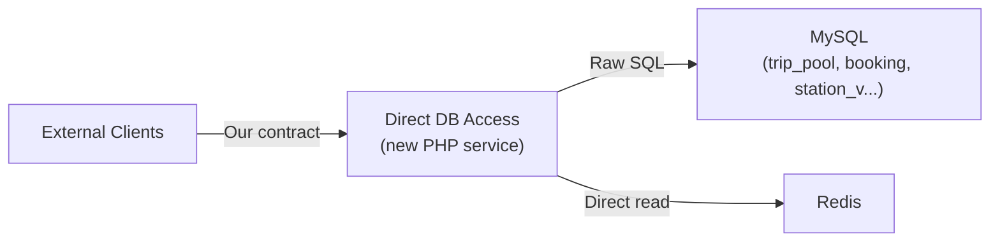
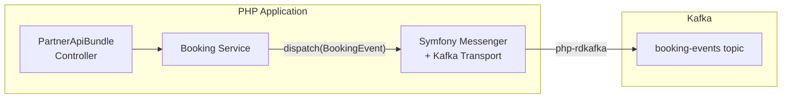
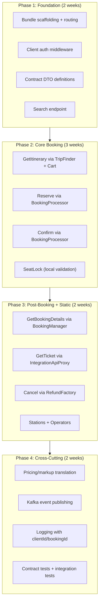

# PHP / Frontend3 Capability Analysis

## Executive Summary

Frontend3 is a mature Symfony 6.4 / PHP 8.3 application that already implements the full travel booking lifecycle: search, cart management, reservation, confirmation, payment, refund, and static data serving. Every client-facing endpoint our .NET services expose has a **direct internal counterpart** in frontend3. This makes PHP-based replacement of the .NET adapter layer not just feasible, but potentially a significant simplification.

This document analyzes three PHP sub-options for the transition, maps frontend3's internal capabilities to our client contract, and evaluates Symfony's framework features, pricing migration paths, team impact, and Kafka readiness.

---

## 1. Frontend3 Capability Mapping

### 1.1 Architecture Overview

Frontend3 follows a clean Symfony structure:

```
src/
├── Controller/ApiV1/      # REST API controllers (search, cart, booking, refund, static data)
├── Controller/ApiV2/      # V2 API controllers (search, cart)
├── TripSearch/            # Search domain (SearchService, Rechecker, TripFinder, filters)
├── Booking/               # Booking domain (BookingProcessor, ReservationHandler, Cart, etc.)
├── Integration/           # Integration proxy layer (IntegrationApiProxy → external operators)
├── Core/                  # Shared domain (managers, repositories, DTOs, validators, pricing)
├── FinanceApi/            # Finance/payment API client
├── Cache/                 # Cache utilities (TagAwareAdapter, Memcached)
├── Util/                  # Utilities (logging, analytics, DB helpers)
└── VersionedApiBundle/    # API versioning infrastructure
```

Key tech stack:
- **PHP 8.3** / **Symfony 6.4** (LTS)
- **MySQL** (Doctrine DBAL, raw queries via BaseRepository)
- **Redis** (caching, rate limiting, locking)
- **Memcached** (query cache, session, AB tests)
- **MongoDB** (analytics/logging)
- **Datadog** (APM tracing via `dd-trace`, StatsD metrics)
- **Bugsnag** (error reporting)
- **GrowthBook** (feature flags / AB testing)

### 1.2 Endpoint-to-Frontend3 Mapping

| Client Endpoint | Frontend3 Controller | Frontend3 Service Layer | Reuse Potential |
|---|---|---|---|
| **Search** `GET /v1/{client_id}/itineraries` | `SearchController::searchAction` | `SearchService::newSearch()` → `Search::searchWithRecheckUrls()` via `TripPoolRepository` (MySQL binary data) | **HIGH** — direct reuse of SearchService; reads from trip_pool binary tables |
| **GetItinerary** `GET /{client_id}/itineraries/{id}` | `TripController::tripDetailsAction` | `TripFinder::findFullResult()` → `TripManager::getPlainTrip()` + `TripManager::getDetails()` | **HIGH** — TripFinder does exactly this |
| **AddToCart** (part of GetItinerary) | `CartController::addTripAction` | `CartHandler::handleAddTrip()` → `Cart::add()` stores in Redis | **HIGH** — Cart is a Redis-backed hash-addressed object |
| **GetBookingSchema** (checkout) | `BookingProcessController` (called during reserve flow) | `BookingFormManager::getProductsDetailsFromCart()` + `BookingForm::init()` | **HIGH** — BookingForm generates all checkout fields dynamically |
| **SeatLock** | N/A (no f3 equivalent) | Would need new endpoint; seat data is in `TripDetails::seatMap` | **MEDIUM** — seat map data exists; lock logic is purely local |
| **CreateBooking** (Reserve) | `BookingProcessController::bookingCartCreateAndReserveAction` | `BookingProcessor::createBookingsAndSetIds()` + `BookingProcessor::reserveBookings()` | **HIGH** — full reserve orchestration exists |
| **ConfirmBooking** | `BookingProcessController::bookingConfirmAction` | `BookingProcessor::confirmBooking()` | **HIGH** — direct endpoint `/booking/{bid}/confirm` |
| **GetBookingDetails** | `BookingsApiController::indexAction` | `BookingManager::getByIdAndCreatedBy()` | **HIGH** — reads from booking tables |
| **GetTicket** | `BookingProcessController::bookingGetTicketAction` | `IntegrationApiProxy::getTicketRawResponse()` | **HIGH** — proxies to integration layer |
| **CancelBooking** | `RefundController::bookingRefundOptionsAction` + `bookingRefundAction` | `RefundFactory` + `RefundHelper` (in Core); currently proxies to legacy `secure` API | **MEDIUM** — refund logic exists but goes through a legacy HTTP proxy |
| **GetStations** | `StaticDataController::getStationsAction` | `StationManager::getAllWithLimit()` → MySQL `station_v` | **HIGH** — paginated station list from DB |
| **GetOperators** | `OperatorController::indexListAction` | `OperatorManager::getDictionaryList()` → MySQL `operator_v` | **HIGH** — paginated operator list from DB |
| **FxRates** | `FxRatesController::getFxRates` | `CurrencyRepository::getRates()` → MySQL | **HIGH** — exchange rates served directly |
| **Webhooks** | `WebhookController` | Webhook handling exists in frontend3 | **MEDIUM** — need to map to our notification contract |

### 1.3 Capability Diagram



---

## 2. Three PHP Sub-Options Analysis

### Option (a): PHP Thin Proxy — New Symfony App Calling 12go HTTP APIs

**Description**: Build a standalone Symfony application that calls frontend3's REST API endpoints (the same ones our .NET SI framework calls today: `/search/{from}p/{to}p/{date}`, `/cart/{tripId}/{date}`, `/checkout/{cartId}`, `/reserve/{bookingId}`, `/confirm/{bookingId}`, etc.).

#### Architecture



#### Pros
- **Lowest coupling** to frontend3 internals — treats it as a black box
- **Simplest architecture** — easy to understand, deploy, and monitor separately
- **No frontend3 code changes** required
- **Independent deployment** — can iterate without touching frontend3
- **Clear contract boundary** — if 12go HTTP API changes, only proxy changes

#### Cons
- **Network overhead** — HTTP round-trips add 2-10ms per call (same issue as .NET)
- **No real improvement** over current .NET approach — same pattern, different language
- **Redundant serialization** — serialize/deserialize at proxy boundary
- **Still requires separate infrastructure** — its own Docker container, CI/CD
- **Recheck polling** must be implemented in the proxy (same complexity as .NET)
- **Limited access** to internal pricing logic, booking state, etc.

#### Effort Estimate
| Component | Effort |
|---|---|
| Project setup, CI/CD, Docker | 1 week |
| Search endpoint + contract mapping | 1 week |
| GetItinerary (trip + cart + checkout) | 1.5 weeks |
| Booking funnel (reserve + confirm) | 1.5 weeks |
| Post-booking (details, ticket, cancel) | 1 week |
| Stations + Operators + webhooks | 0.5 weeks |
| Pricing/markup integration | 1-2 weeks |
| Testing + hardening | 1-2 weeks |
| **Total** | **8-10 weeks** |

#### Risks
- Adds another service to operate (partially defeats the simplification goal)
- PHP team still needs to understand 12go API quirks
- HTTP API may have undocumented behaviors that internal services handle implicitly

---

### Option (b): Frontend3 Internal Integration — New Bundle Within Frontend3

**Description**: Create a new Symfony Bundle (e.g., `PartnerApiBundle`) inside the frontend3 codebase that exposes our client contract endpoints and calls frontend3's internal service layer directly (`SearchService`, `BookingProcessor`, `BookingManager`, `CartHandler`, etc.).

#### Architecture



#### Pros
- **Maximum reuse** — calls internal services directly, no HTTP overhead
- **Best performance** — in-process calls, shared memory/cache, single DB connection pool
- **Richest data access** — can access any manager/repository/DTO in the codebase
- **No redundant serialization** — works with PHP objects directly
- **Single deployment** — ships with frontend3, no additional infrastructure
- **Leverages existing test suite** — frontend3 already has Unit + Web tests
- **12go team can help** — their developers know the internals
- **Cart/booking state is local** — no need to replicate DynamoDB; bookings are in MySQL

#### Cons
- **Coupling risk** — our code depends on frontend3's internal API which can change
- **Deployment coupling** — changes to our bundle ship with frontend3 releases
- **Version management** — must coordinate with 12go's release cycle
- **Codebase complexity** — adds to frontend3's already large codebase (~968 PHP files)
- **Risk of breaking existing functionality** — if not careful with DI/service registration
- **Frontend3 team buy-in required** — they must accept and review our PRs

#### Effort Estimate
| Component | Effort |
|---|---|
| Bundle scaffolding + routing + auth | 0.5 weeks |
| Search endpoint (wrapping SearchService) | 0.5-1 week |
| GetItinerary (TripFinder + Cart + BookingForm) | 1 week |
| Booking funnel (BookingProcessor wrappers) | 1 week |
| Post-booking (BookingManager + IntegrationApiProxy) | 0.5-1 week |
| Stations + Operators (StationManager, OperatorManager) | 0.5 weeks |
| Contract translation layer (our DTOs ↔ f3 DTOs) | 1-1.5 weeks |
| Pricing/markup logic | 1 week |
| Kafka event publishing | 0.5-1 week |
| Testing (unit + integration) | 1-2 weeks |
| **Total** | **7-9 weeks** |

#### Risks
- Internal API changes without notice (mitigate: integration tests, communication)
- Bundle may conflict with existing Symfony service wiring
- Performance impact on shared frontend3 instances (mitigate: rate limiting, separate scaling group)

#### Mitigations
- Define clear interfaces between our bundle and f3 services
- Use Symfony's service decoration pattern to wrap without modifying
- Run our bundle on separate Kubernetes pods (same Docker image, different entry point / route prefix)

---

### Option (c): Direct Database Access — PHP Services Reading 12go MySQL/Redis

**Description**: Build PHP services that bypass frontend3's API and service layer entirely, reading directly from MySQL tables (`trip_pool`, `booking`, `station_v`, `operator_v`, etc.) and Redis caches.

#### Architecture



#### Pros
- **Maximum performance** for read operations — no HTTP or service layer overhead
- **Full control** over query optimization
- **Independent from frontend3 code changes** (only depends on schema)

#### Cons
- **Extreme coupling to database schema** — any schema change breaks our code
- **Must replicate business logic** — pricing calculations, seat availability checks, recheck handling, cart semantics, booking state machine — all exist in PHP service layer, not in DB
- **No write safety** — booking/reserve/confirm involve complex multi-table transactions with event dispatching, validation, duplicate detection, payment flow — duplicating this is extremely risky
- **Binary data parsing** — `TripPoolRepository` reads binary-packed price data (`PriceBinaryParser`); replicating this is complex and fragile
- **Cannot access integration proxy** — confirm/reserve still need to call operator APIs through `IntegrationApiProxy`
- **No access to Cart** — Cart is a Redis-serialized PHP object (`Cart::fromHash`), not a simple key-value store
- **Duplicates all business logic** — essentially a rewrite of the service layer with database dependencies instead of service dependencies

#### Effort Estimate
| Component | Effort |
|---|---|
| Schema analysis + documentation | 2 weeks |
| Search (binary price parsing, trip_pool) | 3-4 weeks |
| Booking funnel (state machine replication) | 4-6 weeks |
| Cart serialization compatibility | 1-2 weeks |
| Integration proxy calls | 1-2 weeks |
| Refund flow | 1-2 weeks |
| Testing (massive surface area) | 3-4 weeks |
| **Total** | **15-22 weeks** |

#### Risks
- **Highest risk option** — essentially a ground-up rewrite
- Schema changes by 12go team will break our code silently
- Binary data formats may change without notice
- Business logic drift between our implementation and frontend3's
- Cart PHP serialization format is tied to specific class versions
- **Not recommended** for write operations (booking, confirm, refund)

---

### Sub-Options Comparison Matrix

| Dimension | (a) Thin Proxy | (b) Internal Bundle | (c) Direct DB |
|---|---|---|---|
| **Effort** | 8-10 weeks | 7-9 weeks | 15-22 weeks |
| **Performance** | Same as .NET (HTTP) | Best (in-process) | Good reads, risky writes |
| **Coupling** | Low (HTTP contract) | Medium (service API) | High (schema) |
| **Reuse** | Minimal | Maximum | Minimal |
| **Risk** | Low | Medium | Very High |
| **Maintenance** | Medium (separate app) | Low (ships with f3) | Very High |
| **Write operations** | Via HTTP | Direct service calls | Dangerous |
| **Team skill needed** | PHP + HTTP | PHP + Symfony internals | PHP + MySQL + binary |
| **12go team dependency** | Low | Medium | Low (but fragile) |
| **Simplification** | Marginal over .NET | Significant | Negative |

---

## 3. Symfony Pattern Assessment

### 3.1 Middleware / Request Transformation

Frontend3 uses Symfony's **Event Listener** pattern for request/response middleware:

- `AuthenticationListener` — validates API keys on `kernel.controller` event
- `ExceptionListener` — maps exceptions to HTTP responses on `kernel.exception`
- `OptionsListener` — handles CORS preflight on `kernel.request` (priority 100)
- `KernelTerminateListener` — post-response cleanup on `kernel.terminate`

For our contract translation (our DTOs ↔ f3 DTOs), Symfony offers:

| Pattern | Use Case | Frontend3 Usage |
|---|---|---|
| **Event Listeners** | Request auth, response transformation | `AuthenticationListener`, `ExceptionListener` |
| **Argument Resolvers** | Custom parameter binding | `DateFromRouteResolver`, `DateTimeFromRouteResolver` |
| **Serializer** | DTO transformation | `symfony/serializer` (in composer.json) |
| **ParamConverters** | Route parameter conversion | Date/DateTime resolution from routes |

**Assessment**: Symfony's middleware is very capable for contract translation. We would create a `PartnerApiListener` to handle client authentication and a `ContractTransformer` service for DTO mapping.

### 3.2 Dependency Injection

Frontend3 uses Symfony's **autowiring + autoconfiguration** (see `config/services.yaml`):

```yaml
services:
    _defaults:
        autowire: true
        autoconfigure: true
    App\:
        resource: '../src/*'
        exclude: '../src/{DependencyInjection,Entity,Migrations,Tests,Kernel.php}'
```

All services in `src/` are automatically registered. Explicit configuration is used only for services needing specific constructor arguments (env vars, cache backends, etc.).

**Assessment**: Adding a new bundle's services is trivial — just register the namespace. Symfony's DI container is one of the best in any framework, with compile-time optimization, lazy loading, and service decoration.

### 3.3 Caching

Frontend3 uses a multi-layer caching strategy:

| Layer | Technology | Usage |
|---|---|---|
| **Query Cache** | Memcached (`QueryCache`, `QueryCacheNoVersioning`) | DB query results (integrations, stations, translations) |
| **Application Cache** | Redis (`app.cache.redis.simple`) | Rate limiting, locks |
| **Cart State** | Redis | Shopping cart (hash → serialized Cart object) |
| **Tag-Aware Cache** | `TagAwareAdapter` (custom) | Cache invalidation by tags |
| **AB Test State** | Memcached | GrowthBook feature flag cache |
| **OPcache** | PHP OPcache | Compiled PHP bytecode |

**Assessment**: The caching infrastructure is production-hardened. `symfony/cache` supports Redis, Memcached, APCu, and filesystem adapters. For our use case, we would share the existing Redis/Memcached connections — no additional infrastructure needed.

### 3.4 Background Jobs / Workers

Frontend3 currently does **not** use `symfony/messenger` or a formal queue system. Background work is handled via:

- **Symfony Console Commands** (`src/Command/`) — for CLI batch jobs
- **Event Listeners** on `kernel.terminate` — deferred processing after response sent
- **Rechecker** — synchronous HTTP calls to external recheck endpoints (`Rechecker::recheckBySearch`)
- **Cron scripts** (`script/` directory)

For Kafka and async work, Symfony offers:

- `symfony/messenger` with custom transport (Kafka transport available via `koco/messenger-kafka`)
- PHP `pcntl` for signal handling in long-running workers
- Supervisord / Kubernetes for process management

**Assessment**: The async infrastructure would need to be added. Symfony Messenger is mature and well-suited for this. See Section 6 (Kafka from PHP) for detailed analysis.

### 3.5 API Versioning

Frontend3 has a **custom API versioning system** (`VersionedApiBundle`):

- `ApiVersionListener` reads version from HTTP header or query parameter
- `VersionMapLocator` maps versions to route configurations
- Controllers exist in both `ApiV1/` and `ApiV2/` namespaces
- Version negotiation happens at the controller level

**Assessment**: Our client contract can be versioned independently. We would use a dedicated route prefix (e.g., `/partner/v1/`) and the existing `VersionedApiBundle` if needed. Alternatively, we can implement simpler versioning through route prefixes since we control the contract.

### 3.6 Testing Patterns

Frontend3's test structure:

```
tests/
├── Unit/           # PHPUnit unit tests
├── Web/            # Functional/integration tests (Symfony WebTestCase)
├── Fixtures/       # Test data fixtures
├── Helper/         # Test utilities
├── Example/        # Example tests
└── bootstrap.php
```

Testing stack:
- **PHPUnit 10** — test framework
- **Paratest** — parallel test execution
- **Mockery** — mocking library
- **Symfony WebTestCase** — integration tests with kernel boot
- **Symfony BrowserKit** — HTTP client for functional tests

**Assessment**: The testing infrastructure is solid. We would add:
- Unit tests for contract transformation logic
- Integration tests using `WebTestCase` for our bundle's endpoints
- Contract tests to verify our output matches the expected client schema

---

## 4. Pricing / Markup Migration

### 4.1 Current State

The .NET system uses two pricing components:
1. **Ushba Revenue SDK** — applies per-client markup rules (percentage, fixed, or formula-based) to itinerary prices
2. **Fuji Exchange Rate SDK** — currency conversion using rates synced from 12go's MySQL

### 4.2 Frontend3's Pricing Capabilities

Frontend3 has **extensive pricing infrastructure**:

| Component | Purpose |
|---|---|
| `PriceManager` | Central price management |
| `PricingRuleManager` | Per-operator/route pricing rules |
| `PricingFeatureManager` | Feature-based pricing toggles |
| `PriceBinaryParser` | Parses binary-packed price data from trip_pool |
| `PaygateCalculator` | Payment gateway fee calculation |
| `Currency` service | Currency conversion (`CurrencyRepository::getRates()` → MySQL `fx_rate` table) |
| `FxRatesController` | REST endpoint for exchange rates |
| `BookingCalculator` | Total price calculation for bookings |
| `CurrencyResolver` | Charge currency resolution |

### 4.3 Migration Options

| Option | Description | Effort | Risk |
|---|---|---|---|
| **(i) Port to PHP** | Rewrite Ushba Revenue SDK rules as a PHP service/bundle within the PartnerApiBundle | 2-3 weeks | Low — rules are typically simple math (margin %, fixed fees) |
| **(ii) Microservice** | Keep Ushba as a standalone .NET microservice, call via HTTP from PHP | 1 week setup + ops cost | Medium — adds a service dependency; good as interim |
| **(iii) Use 12go's pricing** | Leverage `PricingRuleManager` to define per-partner pricing rules natively | 1-2 weeks config | Low if 12go's pricing model supports our use cases |
| **(iv) Hybrid** | Use 12go's `Currency` service for FX, port markup logic to PHP | 2 weeks | Low — best of both worlds |

**Recommendation**: Option **(iv) Hybrid** is most pragmatic:
- Exchange rates: Use `CurrencyRepository::getRates()` directly (already exposed via `/fxrates` endpoint) — eliminates Fuji Exchange Rate SDK entirely
- Markup: Port the Ushba Revenue SDK rules to a small PHP service class. Markup rules are typically configuration-driven (client → operator → percentage/fixed) and can be stored in MySQL with a simple admin interface
- Long-term: Explore using `PricingRuleManager` to converge our pricing with 12go's native system

---

## 5. Team Skill Transition

### 5.1 Language & Framework Comparison

| Dimension | .NET 8 / C# | PHP 8.3 / Symfony 6.4 |
|---|---|---|
| **Type system** | Strong static typing, nullable refs | Typed properties, union types, enums (since 8.1) |
| **DI container** | Microsoft.Extensions.DI | Symfony DI (compile-time, more powerful) |
| **ORM** | Entity Framework Core | Doctrine ORM (frontend3 uses raw DBAL mostly) |
| **HTTP** | ASP.NET Core middleware pipeline | Symfony HttpKernel event system |
| **Async** | async/await (native) | No native async; Fibers (8.1+) for cooperative multitasking |
| **Testing** | xUnit + Moq + AutoFixture | PHPUnit + Mockery |
| **Package manager** | NuGet | Composer |
| **Build** | MSBuild / `dotnet` CLI | No build step; Composer for deps |
| **IDE** | Rider / VS / VS Code | PhpStorm / Cursor / VS Code |
| **Debugging** | Built-in VS/Rider debugger | Xdebug + PhpStorm/Cursor |
| **AI tooling** | Excellent (Cursor, Copilot) | Excellent (Cursor, Copilot — PHP is well-supported) |

### 5.2 Learning Curve Assessment

| Skill Area | Difficulty for .NET Devs | Notes |
|---|---|---|
| PHP syntax | **Low** | C-family syntax, very similar to C# |
| Symfony fundamentals | **Medium** | Different conventions (YAML config, bundles, events vs middleware) |
| Doctrine / raw SQL | **Low** | Frontend3 uses raw SQL mostly; EF devs can adapt |
| Testing | **Low** | PHPUnit is very similar to xUnit |
| Deployment | **Low** | Docker-based, same as .NET |
| Debugging | **Medium** | Xdebug setup is less seamless than .NET debugger |
| Async patterns | **Medium** | PHP doesn't have async/await; different mental model |

**Estimated ramp-up time**: 2-4 weeks for a .NET developer to become productive in PHP/Symfony, assuming they work alongside the existing codebase with good IDE support (Cursor/PhpStorm).

### 5.3 Tooling Support

- **Cursor**: Excellent PHP support (PSR-4 autocomplete, Symfony-aware, inline docs)
- **PhpStorm**: Best-in-class PHP IDE with Symfony plugin, Xdebug integration
- **PHP CS Fixer**: Already configured in frontend3 (`.php-cs-fixer.dist.php`)
- **PHPStan**: Static analysis configured (`phpstan.dist.neon`)
- **Rector**: Automated code upgrades (`rector.php`)
- **Paratest**: Parallel test execution for faster CI

---

## 6. Kafka from PHP

### 6.1 Current Kafka Usage

The .NET system publishes Kafka events at every booking step:
- `BookingCreated`, `BookingReserved`, `BookingConfirmed`, `BookingCancelled`
- Events include `clientId`, `operatorId`, `bookingId`, itinerary details
- Consumers include analytics pipelines and inter-service communication

### 6.2 PHP Kafka Libraries

| Library | Description | Maturity | Performance |
|---|---|---|---|
| **php-rdkafka** (ext-rdkafka) | PHP extension wrapping librdkafka (C library) | Production-ready, used by major companies | **Best** — native C performance |
| **longlang/phpkafka** | Pure PHP Kafka client | Good, actively maintained | Good — no C extension needed |
| **enqueue/rdkafka** | php-enqueue transport for rdkafka | Stable | Good — wraps rdkafka with queue abstraction |
| **koco/messenger-kafka** | Symfony Messenger transport for Kafka | Community maintained | Good — integrates with Symfony Messenger |
| **symfony/messenger** | Symfony's async message bus (with Kafka transport) | Official, production-ready | Depends on transport |

### 6.3 Recommended Approach



**Recommended stack**: `symfony/messenger` + `koco/messenger-kafka` (which uses `php-rdkafka` under the hood)

**Why**:
1. Symfony Messenger provides a clean async dispatch API (`$bus->dispatch(new BookingCreatedEvent(...))`)
2. Kafka transport handles serialization, partitioning, acknowledgment
3. `php-rdkafka` provides native C performance for production/consumption
4. Messenger supports sync dispatch for testing and gradual migration

### 6.4 Performance Considerations

| Concern | Mitigation |
|---|---|
| PHP is single-threaded | Use separate worker processes for consuming (Supervisor/K8s) |
| No connection pooling | `php-rdkafka` maintains persistent connections within a process |
| FPM process lifecycle | For producing: rdkafka producer is initialized once per FPM worker; flush on request end |
| Latency | Producing is async by default in rdkafka (batched); sub-ms overhead |
| Consumer lag | Run multiple consumer workers (horizontal scaling) |

### 6.5 Implementation Effort

| Task | Effort |
|---|---|
| Install php-rdkafka extension + Messenger transport | 0.5 days |
| Define event classes (matching .NET event contracts) | 1-2 days |
| Configure Messenger routing (event → Kafka topic) | 0.5 days |
| Publish events in booking flow | 2-3 days |
| Consumer workers (if needed in PHP) | 2-3 days |
| Testing | 1-2 days |
| **Total** | **1-1.5 weeks** |

---

## 7. Recommendation

### Primary Recommendation: Option (b) — Frontend3 Internal Integration

**The strongest option is to build a new Symfony bundle within frontend3 that directly calls the internal service layer.**

#### Rationale

1. **Maximum reuse, minimum effort**: Frontend3 already implements 90%+ of the business logic we need. Every client endpoint maps to an existing service. Building a thin translation layer on top is the fastest path.

2. **Performance advantage**: In-process calls eliminate the HTTP round-trip overhead that plagues both the current .NET approach and Option (a). Search can potentially be sub-100ms for cached results.

3. **Simplification**: Eliminates 5 .NET services (Etna Search, Etna SI Host, Denali booking-service, Denali post-booking-service, Fuji) plus the entire Supply-Integration framework. Replaces them with ~10-15 PHP files in a single bundle.

4. **Data locality**: Bookings, trips, stations, operators — all live in MySQL that frontend3 already connects to. No DynamoDB, no HybridCache, no cross-service HTTP calls.

5. **Exchange rates and pricing**: `CurrencyRepository::getRates()` and `PriceManager` are directly accessible. No need for Fuji Exchange Rate SDK.

6. **Operational simplicity**: One less deployment, one less Docker image, one less CI pipeline. The bundle ships with frontend3.

#### Implementation Strategy



#### Fallback Plan

If 12go team pushback prevents Option (b), fall back to **Option (a) PHP Thin Proxy**. It's only marginally more work and avoids the political/organizational challenges of modifying frontend3 directly. However, it loses the performance and simplification benefits.

**Option (c) Direct Database Access is not recommended** under any circumstances. The effort is 2-3x higher, the risk is extreme, and it provides no meaningful advantage over Option (b).

#### Key Decision Factors

| Factor | Weight | (a) Score | (b) Score | (c) Score |
|---|---|---|---|---|
| Development effort | 25% | 7/10 | 8/10 | 3/10 |
| Performance | 20% | 5/10 | 9/10 | 7/10 |
| Maintainability | 20% | 6/10 | 7/10 | 2/10 |
| Risk | 15% | 8/10 | 6/10 | 2/10 |
| Simplification | 10% | 4/10 | 9/10 | 3/10 |
| Team transition | 10% | 7/10 | 6/10 | 5/10 |
| **Weighted Total** | | **6.3** | **7.6** | **3.5** |

---

## Appendix: Frontend3 Key Service Inventory

### Controllers (ApiV1)

| Controller | Routes | Purpose |
|---|---|---|
| `SearchController` | `/search/{from}/{to}/{date}` | Trip search |
| `TripController` | `/trip/{tripKey}/{dateAndTime}` | Trip details |
| `CartController` | `/cart/{tripKey}/{dateAndTime}` | Cart management (add/remove/view) |
| `BookingProcessController` | `/reserve/{hash}`, `/confirm/{bid}`, `/booking/{bid}/reserve`, `/booking/{bid}/confirm` | Booking lifecycle |
| `BookingsApiController` | `/booking/{bid}`, `/bookings` | Booking details/list |
| `BookingDetailsController` | `/booking/{bid}/booking-details` | Extended booking details |
| `RefundController` | `/booking/{bid}/refund-options`, `/booking/{bid}/refund` | Cancellation/refund |
| `StaticDataController` | `/stations`, `/operators`, `/classes`, `/countries`, `/provinces`, etc. | Reference data |
| `OperatorController` | `/operators` | Operator dictionary |
| `FxRatesController` | `/fxrates` | Exchange rates |
| `RecheckController` | Recheck endpoints | Price/availability recheck |
| `WebhookController` | Webhook endpoints | External notifications |
| `CheckConfirmController` | `/getbootest/{bid}` | Booking confirmation check |

### Key Service Classes

| Service | Namespace | Responsibilities |
|---|---|---|
| `SearchService` | `TripSearch\Service` | Creates Search objects, manages search infrastructure |
| `Search` | `TripSearch\Component` | Executes trip pool searches (binary data queries) |
| `TripFinder` | `TripSearch` | Finds full trip results with all metadata |
| `Rechecker` | `TripSearch\Service` | Triggers price/availability rechecks |
| `CartHandler` | `Booking\Service` | Add/remove trips from cart with validation |
| `Cart` | `Booking\Component\Cart` | Redis-backed cart object |
| `BookingProcessor` | `Booking\Service` | Core booking orchestration (create, reserve, confirm, payment) |
| `ReservationHandler` | `Booking\Service` | Manages booking reservations |
| `BookingManager` | `Booking\Manager` | CRUD for bookings |
| `BookingFormManager` | `Booking\Manager` | Booking form generation and validation |
| `BookingConfirmationManager` | `Booking\Manager` | Confirmation flow management |
| `IntegrationApiProxy` | `Integration\Service` | Proxies to external operator APIs |
| `StationManager` | `Core\Manager` | Station data access |
| `OperatorManager` | `Core\Manager` | Operator data access |
| `PriceManager` | `Core\Manager` | Price calculations |
| `TripManager` | `Core\Manager` | Trip data access (plain + details) |
| `RefundFactory` | `Core\Component\Refund` | Refund option generation |
| `Currency` | `Core\Service` | Currency conversion |

### Data Access Layer

| Repository | Data Source | Notes |
|---|---|---|
| `TripPoolRepository` | MySQL (trip_pool tables) | Binary-packed trip/price data |
| `BookingRepository` | MySQL (booking tables) | Core booking records |
| `StationRepository` | MySQL (station_v) | Station view |
| `OperatorRepository` | MySQL (operator tables) | Operator data |
| `CurrencyRepository` | MySQL (fx_rate) | Exchange rates |
| `CartRepository` | Redis | Serialized Cart objects |
| `IntegrationRepository` | MySQL (integration tables) | Operator integration configs |
