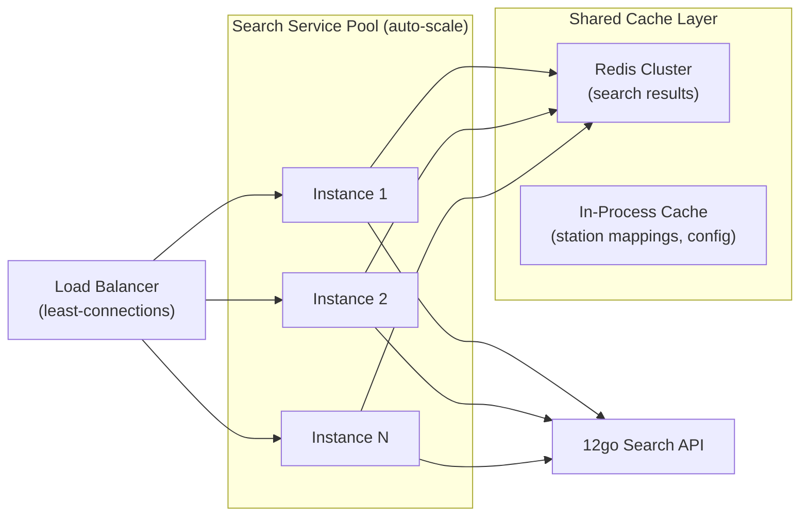
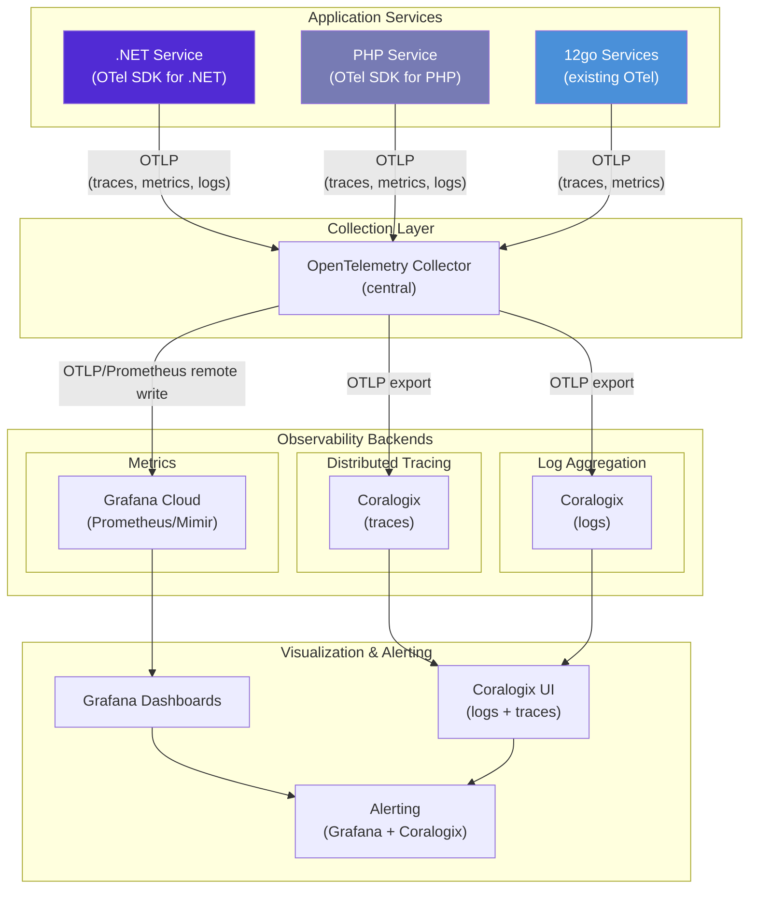
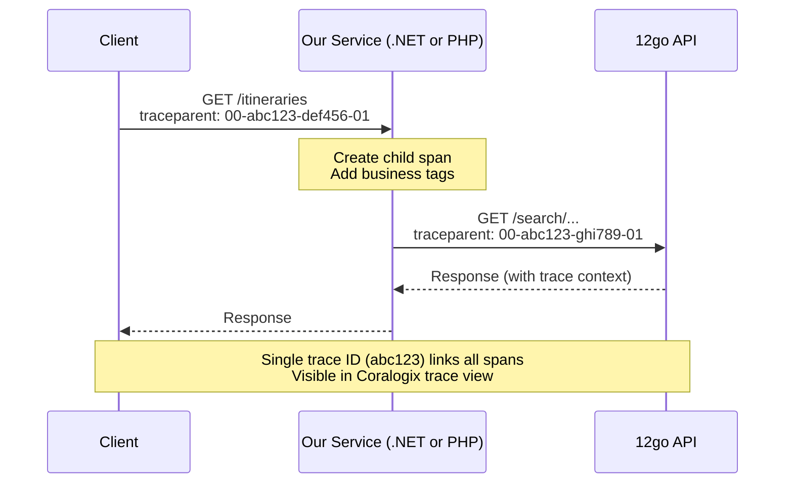
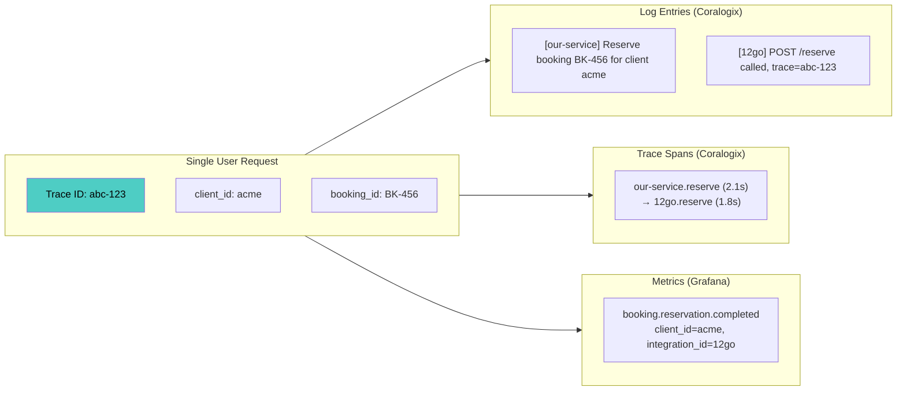
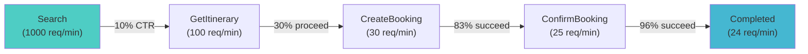
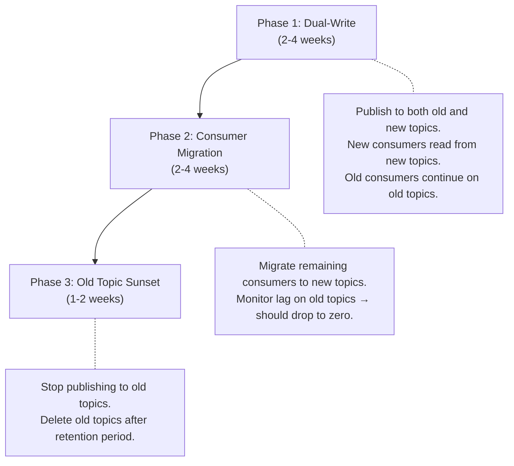
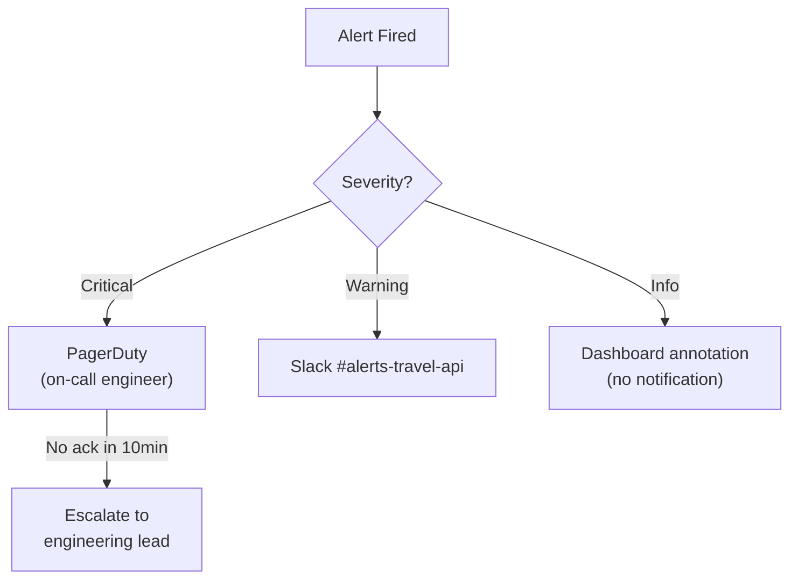

# Scale & Observability Research

Research into scaling patterns, observability architecture, and operational best practices for the transition from the current multi-service .NET architecture to 12go-centric operations.

---

## Table of Contents

1. [Latency Budget Table](#1-latency-budget-table)
2. [Scaling Strategy](#2-scaling-strategy)
3. [Recheck / Async Search Completion Pattern](#3-recheck--async-search-completion-pattern)
4. [Observability Architecture](#4-observability-architecture)
5. [Structured Logging with Business Context](#5-structured-logging-with-business-context)
6. [Metrics Architecture](#6-metrics-architecture)
7. [Kafka Consolidation Plan](#7-kafka-consolidation-plan)
8. [Per-Option Observability Assessment](#8-per-option-observability-assessment)
9. [Monitoring Dashboard Specification](#9-monitoring-dashboard-specification)

---

## 1. Latency Budget Table

### Industry Context

Travel API latency is a competitive differentiator. Skyscanner enforces a 10-second partner response deadline — partners that consistently exceed this threshold are de-prioritized in results, directly impacting their revenue. Booking.com's Demand API V3 is marketed as "the fastest API yet" with sub-second search targets. Aggregators typically set a global timeout of 3–5 seconds for parallel supplier queries.

### Recommended Targets

These targets account for the fact that our service is a **middleware adapter** — we add latency on top of 12go's own response time. The budget is split between "our overhead" and "upstream 12go time."

| Endpoint | p50 Target | p95 Target | p99 Target | Max Timeout | Our Overhead Budget | Notes |
|----------|-----------|-----------|-----------|-------------|-------------------|-------|
| **Search** (`GET /itineraries`) | < 800ms | < 2,000ms | < 4,000ms | 10s | < 200ms | Highest volume; 12go search itself is 500ms–3s |
| **GetItinerary** (checkout) | < 1,500ms | < 3,000ms | < 5,000ms | 15s | < 500ms | 3 sequential 12go calls (trip + cart + checkout) |
| **CreateBooking** (reserve) | < 2,000ms | < 4,000ms | < 8,000ms | 15s | < 300ms | Write operation; reliability > speed |
| **ConfirmBooking** | < 2,000ms | < 5,000ms | < 10,000ms | 30s | < 300ms | Most critical; async fallback at 15s |
| **SeatLock** | < 500ms | < 1,000ms | < 2,000ms | 5s | < 500ms | No 12go call; entirely local |
| **GetBookingDetails** | < 200ms | < 500ms | < 1,000ms | 5s | < 200ms | Local DB read; no upstream call |
| **GetTicket** | < 1,000ms | < 2,500ms | < 5,000ms | 10s | < 200ms | Single 12go call for ticket URL |
| **CancelBooking** | < 2,000ms | < 5,000ms | < 8,000ms | 15s | < 300ms | 2 sequential 12go calls (refund-options + refund) |
| **GetStations / GetOperators** | < 100ms | < 300ms | < 500ms | 2s | < 100ms | Cached/static data; no upstream call per request |

### Latency Budget Breakdown (Search Example)

```
Client Request ─────────────────────────────────────────────── Total: ~800ms p50
├── Network (client → our service)                              ~20ms
├── Auth / middleware / routing                                  ~10ms
├── Request transformation (our format → 12go format)           ~5ms
├── 12go API call: GET /search/{from}p/{to}p/{date}            ~550ms
├── Response transformation (12go → our format)                 ~15ms
├── Business logic (markup, filtering)                          ~30ms
├── Observability (tracing, metrics, logging)                   ~5ms
└── Network (our service → client)                              ~20ms
```

### SLO Recommendations

| SLO | Target | Window | Alert Threshold |
|-----|--------|--------|----------------|
| Search availability | 99.9% | 7-day rolling | < 99.5% over 1h |
| Search p95 latency | < 2,000ms | 7-day rolling | > 3,000ms over 15m |
| Booking success rate | 99.5% | 7-day rolling | < 98% over 1h |
| Booking p95 latency | < 5,000ms | 7-day rolling | > 8,000ms over 15m |
| Confirm success rate | 99.0% | 7-day rolling | < 97% over 1h |
| Error budget (search) | 0.1% of requests | 30-day rolling | 50% consumed in first week |

---

## 2. Scaling Strategy

### Search vs Booking: Fundamentally Different Workloads

| Characteristic | Search | Booking |
|---------------|--------|---------|
| Volume | High (100:1 ratio vs booking) | Low |
| Pattern | Read-heavy, stateless | Write-heavy, stateful |
| Latency sensitivity | Very high | Moderate |
| Failure tolerance | Graceful degradation OK | Zero tolerance — every booking matters |
| Cacheability | High (same route/date queries) | None (each booking is unique) |
| Idempotency | Naturally idempotent | Requires explicit idempotency |
| Scaling axis | Horizontal (more instances) | Vertical first, then horizontal |

### Search Scaling Strategy

#### Horizontal Scaling with Stateless Instances



**Recommendations:**

1. **Stateless service instances** — All session/state stored externally (Redis or 12go). Scale from 2 to N instances based on CPU/request rate.

2. **Multi-layer caching:**
   - **L1 — In-process cache** (5–30s TTL): Station mappings, operator data, config. ~1ms access.
   - **L2 — Redis** (30s–5min TTL): Search results by route+date+pax hash. ~2ms access. Serves identical queries without hitting 12go.
   - **L3 — CDN/Edge** (not recommended for search): Real-time availability makes CDN caching risky for search. Only applicable for static data (stations, operators).

3. **Connection pooling to 12go:**
   - .NET `HttpClient` with `SocketsHttpHandler`: Max connections per server = 50–100 (tune based on 12go's capacity).
   - PHP: Use persistent connections via `symfony/http-client` with `CurlHttpClient` for connection reuse.
   - Circuit breaker pattern: Open after 5 consecutive failures, half-open after 10s.

4. **Rate limiting / backpressure:**
   - Per-client rate limit: 100–500 search requests/minute (configurable per clientId).
   - Global rate limit toward 12go: Respect 12go's capacity. Use a token bucket with shared state in Redis.
   - Backpressure: Return `503 Service Unavailable` with `Retry-After` header when 12go is overloaded rather than queuing indefinitely.

5. **Auto-scaling triggers:**
   - Scale-out: CPU > 60% sustained for 2 minutes, OR request queue depth > 50, OR p95 latency > 3s.
   - Scale-in: CPU < 30% for 5 minutes AND request rate < 50% of peak.
   - Min instances: 2 (availability). Max instances: 10–20 (cost cap).

#### Search Caching Detail

```
Cache Key: SHA256(route_hash + date + pax + currency + locale)
TTL: 60–120 seconds (configurable per operator)

Cache Strategy:
1. Check Redis for cached result
2. If HIT and age < TTL → return immediately
3. If HIT and age > soft_TTL (30s) → return stale, trigger async refresh
4. If MISS → call 12go, cache result, return
```

**Stale-while-revalidate** is critical for search: return slightly stale results immediately while refreshing in the background. This dramatically improves p50 latency for popular routes.

### Booking Scaling Strategy

1. **Fewer instances, higher reliability:**
   - 2–4 instances (active-active), not auto-scaled aggressively.
   - Each instance handles the full booking funnel (reserve → confirm).
   - Stateful operations require distributed locking or idempotency keys.

2. **Idempotency:**
   - Every booking request must carry an idempotency key (e.g., `X-Idempotency-Key` header).
   - Store idempotency key → response mapping in Redis (TTL: 24h).
   - Prevents double-booking on network retries.

3. **Retry with exponential backoff:**
   - Retry failed 12go calls with backoff: 1s, 2s, 4s (max 3 retries).
   - Only retry on transient errors (timeout, 502, 503). Never retry on 4xx.

4. **Database writes:**
   - PostgreSQL for booking persistence (replacing DynamoDB).
   - Write-ahead pattern: Persist booking intent before calling 12go, update with result after.
   - This ensures we never lose a booking even if the service crashes mid-flow.

---

## 3. Recheck / Async Search Completion Pattern

### Current State

The current system has two distinct async patterns:

1. **Search recheck** — Etna returns `recheck=true` on search results when supplier data is incomplete. The client polls with a `timeout` parameter until results are complete or timeout expires.

2. **Incomplete results (booking)** — Denali returns `202 Accepted` with a `Location` header when booking/confirm exceeds 15s. Client polls `GET /incomplete_results/{id}` until `200 OK`.

### Industry Patterns Comparison

| Pattern | Latency to First Result | Completeness | Complexity | Best For |
|---------|------------------------|--------------|------------|----------|
| **Create-and-Poll** (Skyscanner) | Fast (partial results immediately) | Progressive | Medium | Multi-supplier search |
| **Long Polling** (Vio.com) | Moderate (waits for first batch) | Progressive | Low | Moderate supplier count |
| **Server-Sent Events (SSE)** | Fast (streaming) | Progressive | Medium-High | Real-time updates |
| **WebSocket** | Fast (bidirectional) | Progressive | High | Interactive UIs |
| **Simple Timeout + Retry** | Variable | All-or-nothing | Low | Single-supplier |

### Recommendation: Simplified Polling for Our Case

Since we have **a single upstream supplier (12go)**, the recheck pattern can be greatly simplified compared to multi-supplier aggregators:

#### For Search

**Recommendation: Remove recheck; use synchronous with timeout.**

- With only one supplier, there is no "progressive aggregation" — either 12go responds or it doesn't.
- Set a fixed timeout (e.g., 8s) on the 12go search call.
- If 12go responds within timeout → return results.
- If timeout → return empty results with appropriate status, let client retry.
- Caching mitigates the impact: popular routes served from cache while slow queries wait for 12go.

If recheck must remain for client compatibility:

```
Client                          Our Service                     12go
  │                                 │                              │
  │── GET /itineraries ──────────►  │                              │
  │                                 │── GET /search ─────────────► │
  │                                 │◄─── Results (or timeout) ──  │
  │  ◄── 200 OK ─────────────────  │                              │
  │      (recheck: false)           │                              │
  │                                 │                              │
  │  OR if timeout:                 │                              │
  │  ◄── 206 Partial ────────────  │                              │
  │      (recheck: true, token)     │                              │
  │                                 │                              │
  │── GET /itineraries?token ────►  │  (serve from cache or retry) │
  │  ◄── 200 OK ─────────────────  │                              │
```

#### For Booking (Incomplete Results)

**Recommendation: Keep async pattern, simplify implementation.**

- The async booking pattern is sound for handling slow 12go confirmations.
- Simplify by replacing DynamoDB with Redis (lower operational overhead, same TTL semantics).
- Keep the `202 Accepted` → poll → `200 OK` contract — it's a well-understood REST pattern.

**Simplified implementation:**

| Component | Current | Recommended |
|-----------|---------|------------|
| Storage | DynamoDB (with gzip) | Redis (plain JSON, TTL) |
| Background processing | In-memory Channel + BackgroundService | Same pattern, simpler serialization |
| Expiration | Dual (15min app-level + 15h DynamoDB TTL) | Single Redis TTL (15min) |
| Polling interval | Client decides | Recommend 2s with exponential backoff (2s, 3s, 5s) |

#### Client Polling Best Practice

```
Initial wait:  2 seconds
Backoff:       exponential (2s, 3s, 5s, 8s)
Max polls:     10 attempts (total ~45s)
On timeout:    Show "booking in progress" message, provide booking lookup
```

---

## 4. Observability Architecture

### Unified Stack Recommendation

The target observability architecture must work across .NET and PHP services, support the required business dimensions (clientId, operator/integrationId, bookingId, itinerary), and integrate with 12go's existing infrastructure.



### W3C Trace Context Propagation

All services — .NET, PHP, and 12go — must propagate `traceparent` and `tracestate` HTTP headers per the W3C Trace Context specification. This enables end-to-end distributed traces across the polyglot stack.

```
traceparent: 00-<trace-id>-<parent-span-id>-<trace-flags>
tracestate: <vendor-specific-data>
```

**Cross-boundary trace flow:**



### OpenTelemetry SDK Comparison

| Feature | .NET SDK | PHP SDK |
|---------|----------|---------|
| Maturity | Stable (all signals) | Stable (all signals) |
| Auto-instrumentation | Rich (ASP.NET Core, HttpClient, EF Core, gRPC) | Good (Symfony, Laravel, PSR-18, PDO, curl) |
| Custom spans | `Activity` / `ActivitySource` | `TracerProvider` / `Tracer` |
| Custom metrics | `System.Diagnostics.Metrics` (Meter, Counter, Histogram) | `MeterProvider` / `Meter` |
| Log bridge | `ILogger` → OTel Logs | Monolog → OTel Logs |
| Zero-code option | Yes (startup hooks) | Yes (PHP extension + Composer autoload) |
| Context propagation | Automatic (HttpClient, gRPC) | Automatic (PSR-18, Symfony HttpClient) |
| Baggage support | Yes | Yes |
| PHP requirement | N/A | PHP 8.0+ with ext-opentelemetry |

### OpenTelemetry Collector Configuration

Deploy a single OTel Collector per cluster (sidecar or daemonset) to:

1. **Receive** OTLP from all services.
2. **Enrich** with infrastructure tags (environment, region, service version).
3. **Sample** (tail-based): Keep 100% of error traces and booking traces, sample 10% of search traces.
4. **Export** to Coralogix (traces + logs) and Grafana (metrics).

```yaml
# Conceptual OTel Collector config
receivers:
  otlp:
    protocols:
      grpc:
        endpoint: 0.0.0.0:4317
      http:
        endpoint: 0.0.0.0:4318

processors:
  batch:
    timeout: 5s
    send_batch_size: 512
  tail_sampling:
    policies:
      - name: errors-always
        type: status_code
        status_code: { status_codes: [ERROR] }
      - name: booking-always
        type: string_attribute
        string_attribute:
          key: booking.id
          values: [".*"]
          enabled_regex_matching: true
      - name: search-sample
        type: probabilistic
        probabilistic: { sampling_percentage: 10 }
  attributes:
    actions:
      - key: environment
        value: production
        action: upsert

exporters:
  otlp/coralogix:
    endpoint: "ingress.coralogix.com:443"
    headers:
      Authorization: "Bearer ${CORALOGIX_API_KEY}"
  otlp/grafana:
    endpoint: "otlp-gateway.grafana.net:443"
    headers:
      Authorization: "Basic ${GRAFANA_OTLP_TOKEN}"

service:
  pipelines:
    traces:
      receivers: [otlp]
      processors: [batch, tail_sampling, attributes]
      exporters: [otlp/coralogix]
    metrics:
      receivers: [otlp]
      processors: [batch, attributes]
      exporters: [otlp/grafana]
    logs:
      receivers: [otlp]
      processors: [batch, attributes]
      exporters: [otlp/coralogix]
```

### Data Retention Recommendations

| Signal | Hot Retention | Warm/Archive | Sampling |
|--------|--------------|-------------|----------|
| Traces | 14 days | 90 days (Coralogix archive) | 100% errors/bookings, 10% search |
| Metrics | 90 days (full resolution) | 1 year (downsampled to 5m) | None (all metrics) |
| Logs | 14 days (hot search) | 90 days (archive) | 100% warn+error, 50% info, 10% debug |

---

## 5. Structured Logging with Business Context

### Required Business Dimensions

Every log entry, trace span, and metric data point should carry these business dimensions where available:

| Dimension | Log Key | Trace Attribute | Metric Tag | When Available |
|-----------|---------|----------------|------------|----------------|
| Client ID | `client_id` | `connect.client.id` | `client_id` | All requests (from URL path) |
| Operator / Integration | `integration_id` | `connect.integration.id` | `integration_id` | After route/itinerary resolution |
| Booking ID | `booking_id` | `connect.booking.id` | `booking_id` | Booking and post-booking flows |
| Itinerary ID | `itinerary_id` | `connect.itinerary.id` | `itinerary_id` | Search results, checkout, booking |
| Contract Code | `contract_code` | `connect.contract.code` | `contract_code` | After contract resolution |
| Correlation ID | `correlation_id` | (trace ID serves this role) | N/A | All requests |

### Implementation Patterns

#### .NET: Middleware + Scoped Logging

```csharp
// Middleware enriches Activity (trace) and ILogger scope for all downstream code
public class BusinessContextMiddleware : IMiddleware
{
    public async Task InvokeAsync(HttpContext context, RequestDelegate next)
    {
        var clientId = context.GetRouteValue("client_id")?.ToString();
        var activity = Activity.Current;

        activity?.SetTag("connect.client.id", clientId);

        using (logger.BeginScope(new Dictionary<string, object>
        {
            ["client_id"] = clientId,
            ["correlation_id"] = activity?.TraceId.ToString()
        }))
        {
            await next(context);
        }
    }
}
```

This matches the existing `BookingIdMiddleware` and `IntegrationIdMetricInricherMiddleware` patterns already in Denali.

#### PHP (Symfony): Monolog Processor

```php
// Symfony Monolog processor — auto-enriches all log entries in scope
class BusinessContextProcessor
{
    public function __invoke(LogRecord $record): LogRecord
    {
        $span = Span::getCurrent();
        $record->extra['client_id'] = RequestContext::getClientId();
        $record->extra['booking_id'] = RequestContext::getBookingId();
        $record->extra['trace_id'] = $span->getContext()->getTraceId();
        return $record;
    }
}
```

### Cross-Service Correlation



All three signals share the same trace ID, enabling one-click navigation from a Grafana metric spike → Coralogix trace → individual log entries for that booking.

### Tag Key Standardization

The current system has inconsistent tag naming (`snake_case` in `BookingSiHostMetrics` vs `camelCase` in `SiFacadeMetrics`). **Recommendation: Standardize on `snake_case`** for all new code, aligned with OpenTelemetry semantic conventions.

| Current (inconsistent) | Standardized |
|----------------------|-------------|
| `clientId` | `client_id` |
| `integrationId` | `integration_id` |
| `contractCode` | `contract_code` |
| `BookingId` (Activity tag) | `booking_id` |
| `connect.integration.id` (HTTP metrics) | `connect.integration.id` (keep as-is for OTel semantic convention) |

---

## 6. Metrics Architecture

### RED Method Application

Apply the RED method (Rate, Errors, Duration) to every API endpoint:

| Metric | Type | Tags | Purpose |
|--------|------|------|---------|
| `api.request.rate` | Counter | `endpoint`, `method`, `client_id` | Request volume |
| `api.request.errors` | Counter | `endpoint`, `method`, `client_id`, `error_type`, `status_code` | Error tracking |
| `api.request.duration` | Histogram | `endpoint`, `method`, `client_id` | Latency distribution |

**Histogram buckets for duration** (in milliseconds): `[50, 100, 250, 500, 1000, 2000, 5000, 10000, 30000]`

### Business Metrics (Beyond RED)

| Metric | Type | Tags | Purpose |
|--------|------|------|---------|
| `search.results.count` | Histogram | `client_id`, `integration_id` | Number of itineraries per search |
| `search.empty.rate` | Counter | `client_id`, `integration_id` | Searches returning zero results |
| `search.cache.hit_rate` | Counter | `client_id`, `cache_level` (L1/L2) | Cache effectiveness |
| `booking.conversion.started` | Counter | `client_id`, `integration_id` | Booking funnel entry |
| `booking.conversion.completed` | Counter | `client_id`, `integration_id` | Booking funnel completion |
| `booking.conversion.failed` | Counter | `client_id`, `integration_id`, `failure_reason` | Booking funnel drop-off |
| `booking.price_mismatch` | Counter | `client_id`, `integration_id` | Price changed between search and book |
| `booking.async.triggered` | Counter | `client_id`, `integration_id` | Incomplete results flow activated |
| `booking.async.poll_count` | Histogram | `client_id` | Number of polls before resolution |
| `upstream.12go.request.duration` | Histogram | `endpoint`, `integration_id` | 12go API latency (our measurement) |
| `upstream.12go.request.errors` | Counter | `endpoint`, `integration_id`, `status_code` | 12go API errors |
| `upstream.12go.circuit_breaker.state` | Gauge | `integration_id` | Circuit breaker state (0=closed, 1=half-open, 2=open) |

### Funnel Conversion Tracking



Track conversion at each stage to detect:
- Drop in search-to-checkout rate → possible search quality issue.
- Drop in reserve success rate → possible 12go API issue or inventory problem.
- Drop in confirm success rate → possible payment/confirmation issue.

### Alerting Strategy

| Alert | Condition | Severity | Action |
|-------|-----------|----------|--------|
| High error rate (search) | > 5% errors over 5min | Warning | Investigate 12go health |
| High error rate (search) | > 15% errors over 5min | Critical | Page on-call |
| High error rate (booking) | > 2% errors over 5min | Critical | Page on-call |
| Latency degradation (search) | p95 > 3s over 10min | Warning | Check 12go, check cache hit rate |
| Latency degradation (booking) | p95 > 8s over 10min | Critical | Check 12go, check async trigger rate |
| Zero traffic | 0 requests over 5min (during business hours) | Critical | Check networking, DNS, load balancer |
| Booking conversion drop | Confirm rate < 80% of reserve rate over 1h | Warning | Investigate failure reasons |
| 12go circuit breaker open | State = open for > 30s | Critical | 12go may be down |
| Cache hit rate drop | < 20% cache hits over 15min | Warning | Check Redis, TTL config |
| Error budget consumption | > 50% consumed in first week | Warning | Review recent changes |

---

## 7. Kafka Consolidation Plan

### Current State Summary

The current architecture has **30+ Kafka topics** across 4 service groups:

| Service Group | Topics | Primary Purpose |
|--------------|--------|----------------|
| Denali booking-service | 14 | Booking funnel lifecycle events |
| Denali post-booking-service | 5 | Post-booking status events |
| Denali notification-service | 2 | Webhook → internal event bridge |
| Etna Search | 8 | Search telemetry and analytics |
| Etna Supplier Integration | 8 | Supplier data pipeline |
| Fuji Content | 5+ | Content management pipeline |
| Supply Integration Settings | 1 | Config sync |

### Analysis: What Stays, What Goes, What Consolidates

#### Category 1: Eliminate (internal analytics only)

These topics exist purely for internal analytics and can be replaced by OpenTelemetry traces/metrics:

| Topic | Current Purpose | Replacement |
|-------|----------------|-------------|
| `CheckoutRequested` | Analytics | OTel span + metric counter |
| `CheckoutResponded` | Analytics | OTel span + metric counter |
| `CheckoutFailed` | Analytics | OTel span + error metric |
| `BookingSchemaRequested` | Analytics | OTel span |
| `BookingSchemaResponded` | Analytics | OTel span |
| `BookingSchemaFailed` | Analytics | OTel span + error metric |
| `BookRequested` | Analytics | OTel span |
| `BookFailed` | Analytics | OTel span + error metric |
| `Etna.Messages.SearchRequested` | Search telemetry | OTel span |
| `Etna.Messages.SearchItineraryResponded` | Search telemetry | OTel span |
| `Etna.Messages.SearchItinerariesBlocked` | Search telemetry | OTel span |
| `Etna.Messages.SearchItineraryBlocked` | Search telemetry | OTel span |
| `Etna.Messages.SearchOperatorHealthBlocked` | Search telemetry | OTel span |
| `Etna.Messages.SearchOnlineScoringRequested` | Search telemetry | OTel span |
| `Etna.Messages.PotentialMissingRoute` | Search telemetry | OTel span |
| `Etna.Messages.IntegrationIncompleteResultsReturned` | Search telemetry | OTel span |
| Various Etna SI events (NoResults, RequestFailed, QuotaExceeded, RouteNotMapped) | SI telemetry | OTel spans + metrics |

**Estimated savings: ~20 topics eliminated.** All observability data moves to OTel traces and metrics (queryable in Coralogix/Grafana) instead of Kafka events.

#### Category 2: Keep (cross-boundary or essential)

| Topic | Reason to Keep | Action |
|-------|---------------|--------|
| `ReservationConfirmationSucceeded` | May be consumed by 12go for reconciliation | **Verify with 12go team, then decide** |
| `ReservationChanged` | May be consumed externally | **Verify with 12go team, then decide** |
| `SupplierReservationChanged` | Webhook → internal flow (12go is the source) | Keep during transition |
| `BookSucceeded` | Booking completion event (analytics pipelines?) | **Audit consumer groups** |

#### Category 3: Consolidate

| Current Topics | Consolidated Topic | Key | Strategy |
|---------------|-------------------|-----|----------|
| `BookSucceeded` + `ReservationConfirmationSucceeded` | `booking.lifecycle` | `bookingId` | Single topic with event type in header |
| `CancelRequested` + `CancelFailed` + `ReservationChanged` | `booking.status_change` | `bookingId` | Single topic for all post-booking state changes |
| `Fuji.SI.Station` + `OperatingCarrierReceived` + `Fuji.SI.POI` + `Fuji.SI.SeatClass` | `content.entity_sync` | `entityType:entityId` | Single topic with entity type discriminator |

#### Category 4: Eliminate with DynamoDB

| Topic | Reason | Replacement |
|-------|--------|-------------|
| `BookingEntityToPersist` | DynamoDB → PostgreSQL persistence path | Direct DB write in booking flow |
| `RestoreReservationConfirmationSucceeded` | DynamoDB recovery path | Unnecessary with PostgreSQL |

### Recommended Post-Transition Topic Structure

| Topic | Partitions | Retention | Key | Producers | Consumers |
|-------|-----------|-----------|-----|-----------|-----------|
| `booking.lifecycle` | 6 | 7 days | bookingId | Booking service | Analytics, reconciliation |
| `booking.status_change` | 6 | 7 days | bookingId | Post-booking service | Analytics, 12go (if needed) |
| `booking.notification` | 3 | 3 days | integrationBookingId | Notification service | Post-booking service |
| `content.entity_sync` | 3 | 3 days | entityType:entityId | Content sync service | Content processing pipeline |
| `integration.config` | 1 | 7 days | integrationId | Settings API | Services needing config |

**Result: From 30+ topics down to ~5 topics.**

### Migration Strategy



### PHP Kafka Integration

For PHP-based services consuming/producing Kafka:

- **Library**: `php-rdkafka` (FFI-based wrapper around librdkafka) — production-proven.
- **Performance**: With PHP 8.1+ JIT and FFI preloading, throughput is comparable to native clients for moderate volumes.
- **Symfony integration**: Use `symfony/messenger` with Kafka transport, or direct `php-rdkafka` for lower-level control.
- **Consideration**: PHP's request-lifecycle model means Kafka consumers must run as long-lived CLI processes (`bin/console messenger:consume`), not per-HTTP-request.

---

## 8. Per-Option Observability Assessment

### Option 1: Trimmed .NET (Keep .NET, strip complexity, deploy on 12go infra)

| Criterion | Assessment | Score |
|-----------|-----------|-------|
| **Business dimension filtering** | Excellent — existing middleware (`BookingIdMiddleware`, `IntegrationIdMetricInricherMiddleware`) already enriches traces/metrics with `clientId`, `integrationId`, `bookingId`. Minimal changes needed. | ★★★★★ |
| **OTel integration** | Excellent — .NET OTel SDK is the most mature. `System.Diagnostics.Activity` and `System.Diagnostics.Metrics` are first-class. Existing `AddConnectTracing/Metric/Logging` infrastructure works. | ★★★★★ |
| **Cross-service tracing** | Good — W3C Trace Context propagation already implemented via `Connect.Infra.Observability`. Traces will link to 12go spans if 12go propagates headers. | ★★★★☆ |
| **Operational overhead** | Moderate — .NET services need separate deployment pipeline on 12go infra. Monitoring requires maintaining both .NET and PHP tooling. | ★★★☆☆ |
| **Existing dashboard reuse** | Excellent — all Grafana dashboards and Coralogix queries continue to work with same meter names and tag keys. | ★★★★★ |
| **Staff expertise** | Moderate — 12go team primarily PHP; maintaining .NET services requires .NET expertise. | ★★★☆☆ |

**Observability stack**: Keep existing (Coralogix + Grafana). Deploy OTel Collector as sidecar alongside .NET services on 12go infra.

**Effort**: Low. ~1–2 sprints to strip unused services and redeploy.

### Option 2: PHP Native (Rewrite adapter in PHP)

| Criterion | Assessment | Score |
|-----------|-----------|-------|
| **Business dimension filtering** | Good — needs reimplementation. Symfony Monolog processors for log enrichment, OTel span attributes for traces. Pattern is straightforward. | ★★★★☆ |
| **OTel integration** | Good — PHP OTel SDK is now Stable for all signals. Symfony auto-instrumentation available. Less ecosystem richness than .NET but production-ready. | ★★★★☆ |
| **Cross-service tracing** | Good — same W3C Trace Context standard. PHP auto-instrumentation handles incoming/outgoing header propagation for Symfony/PSR-18 clients. | ★★★★☆ |
| **Operational overhead** | Low — single language stack (PHP). 12go team can maintain. Unified deployment pipeline. | ★★★★★ |
| **Existing dashboard reuse** | Poor — all Grafana dashboards need recreation. Meter names, tag keys will differ. Migration cost is significant. | ★★☆☆☆ |
| **Staff expertise** | Excellent — 12go team is PHP-native. | ★★★★★ |

**Observability stack**: OTel PHP SDK → OTel Collector → Coralogix (traces/logs) + Grafana (metrics). Same backends, new instrumentation.

**Effort**: High. ~4–6 sprints for full reimplementation including observability. Need to recreate all custom metrics, dashboards, and alerting rules.

### Option 3: Thin Stateless Gateway (Minimal translation layer)

| Criterion | Assessment | Score |
|-----------|-----------|-------|
| **Business dimension filtering** | Good — fewer moving parts means less to instrument, but the gateway must still extract and propagate `clientId`, `bookingId`, etc. from request context. | ★★★★☆ |
| **OTel integration** | Good — whether .NET or PHP, the gateway is a single service with standard HTTP instrumentation. Minimal custom metrics needed. | ★★★★☆ |
| **Cross-service tracing** | Good — gateway propagates W3C Trace Context to 12go. Single hop means simpler traces. | ★★★★★ |
| **Operational overhead** | Very low — one service to monitor instead of 7. Fewer dashboards, fewer alerts, fewer failure modes. | ★★★★★ |
| **Existing dashboard reuse** | Poor-to-Moderate — fewer metrics to migrate but still different meter names. Can start fresh with a lean dashboard set. | ★★★☆☆ |
| **Staff expertise** | Depends on language choice. If PHP: excellent (12go team). If .NET: moderate. | ★★★★☆ |

**Observability stack**: Minimal OTel instrumentation → OTel Collector → same backends. Most observability shifts to 12go's native monitoring.

**Effort**: Low. ~2–3 sprints. The gateway has minimal business logic, so observability is straightforward.

### Comparison Summary

```mermaid
radar
    title Observability Readiness by Option
```

| Criterion | Trimmed .NET | PHP Native | Thin Gateway |
|-----------|:-----------:|:---------:|:-----------:|
| Business filtering | ★★★★★ | ★★★★☆ | ★★★★☆ |
| OTel maturity | ★★★★★ | ★★★★☆ | ★★★★☆ |
| Cross-service tracing | ★★★★☆ | ★★★★☆ | ★★★★★ |
| Operational overhead | ★★★☆☆ | ★★★★★ | ★★★★★ |
| Dashboard reuse | ★★★★★ | ★★☆☆☆ | ★★★☆☆ |
| Team expertise | ★★★☆☆ | ★★★★★ | ★★★★☆ |
| Migration effort | ★★★★★ | ★★☆☆☆ | ★★★★☆ |
| **Overall** | **Good for short-term** | **Good for long-term** | **Best balance** |

### Recommendation

**Thin Stateless Gateway (Option 3)** offers the best observability trade-off:
- Minimal surface area to instrument.
- Single service means simple, focused dashboards.
- Trace propagation to 12go provides end-to-end visibility.
- Operational overhead is lowest.
- Can be built in PHP for team alignment, or in .NET for reuse of existing patterns.

If the **short-term priority is zero downtime and maximum reuse**, Option 1 (Trimmed .NET) preserves all existing observability infrastructure and requires the least migration work.

---

## 9. Monitoring Dashboard Specification

### Dashboard 1: API Health Overview

**Purpose**: Real-time health of all API endpoints at a glance.

| Panel | Visualization | Query Concept |
|-------|--------------|---------------|
| Request rate by endpoint | Time series (stacked) | `rate(api.request.rate[5m]) by endpoint` |
| Error rate by endpoint | Time series | `rate(api.request.errors[5m]) / rate(api.request.rate[5m]) * 100` |
| p50 / p95 / p99 latency | Time series (multi-line) | `histogram_quantile(0.95, api.request.duration)` |
| Active requests | Gauge | Current in-flight requests |
| Error rate heatmap | Heatmap | Error rate by endpoint × time |
| SLO compliance | Stat panels (green/red) | Error budget remaining vs. target |

**Variables**: `$client_id`, `$endpoint`, `$environment`, `$time_range`

### Dashboard 2: Booking Funnel

**Purpose**: Track conversion through the booking pipeline.

| Panel | Visualization | Query Concept |
|-------|--------------|---------------|
| Funnel visualization | Bar chart (stages) | Count per funnel stage (search → checkout → reserve → confirm) |
| Success rate per stage | Stat panels | `completed / (completed + failed) * 100` per stage |
| Failure reasons breakdown | Pie chart | `booking.conversion.failed by failure_reason` |
| Price mismatch rate | Time series | `rate(booking.price_mismatch[5m])` |
| Async flow trigger rate | Time series | `rate(booking.async.triggered[5m])` |
| Average polls to resolution | Stat | `avg(booking.async.poll_count)` |
| Revenue at risk | Stat (highlight) | Failed bookings × average booking value |

**Variables**: `$client_id`, `$integration_id`, `$time_range`

### Dashboard 3: Upstream (12go) Health

**Purpose**: Monitor 12go API performance as seen from our services.

| Panel | Visualization | Query Concept |
|-------|--------------|---------------|
| 12go response time by endpoint | Time series | `histogram_quantile(0.95, upstream.12go.request.duration) by endpoint` |
| 12go error rate | Time series | `rate(upstream.12go.request.errors[5m]) by endpoint, status_code` |
| Circuit breaker state | State timeline | `upstream.12go.circuit_breaker.state` |
| Timeout rate | Time series | `rate(upstream.12go.request.errors{error_type="timeout"}[5m])` |
| Connection pool utilization | Gauge | Active connections / max connections |
| 12go latency vs our latency | Dual-axis time series | Overlay our p95 vs 12go p95 (shows our overhead) |

**Variables**: `$integration_id`, `$endpoint`, `$time_range`

### Dashboard 4: Search Performance

**Purpose**: Deep-dive into search quality and performance.

| Panel | Visualization | Query Concept |
|-------|--------------|---------------|
| Search volume | Time series | `rate(api.request.rate{endpoint="search"}[5m])` |
| Cache hit rate (L1 vs L2) | Stacked area | `search.cache.hit_rate by cache_level` |
| Results per search (distribution) | Histogram | `search.results.count` |
| Empty search rate | Time series | `rate(search.empty.rate[5m]) / rate(api.request.rate{endpoint="search"}[5m])` |
| Latency breakdown | Stacked bar | Our overhead vs 12go time |
| Top slow routes | Table | Routes with highest p95 latency |
| Recheck rate | Time series | Percentage of searches returning recheck=true |

**Variables**: `$client_id`, `$integration_id`, `$route`, `$time_range`

### Dashboard 5: Infrastructure & Kafka

**Purpose**: System-level health.

| Panel | Visualization | Query Concept |
|-------|--------------|---------------|
| Kafka consumer lag | Time series | Consumer lag by topic/group |
| Kafka produce rate | Time series | Messages produced per second by topic |
| Redis memory / hit rate | Gauge + time series | Redis memory usage, key count, hit ratio |
| Service CPU / memory | Time series | Container resource utilization |
| Pod count (auto-scale) | Time series | Running instances by service |
| Disk I/O (if PostgreSQL) | Time series | Read/write IOPS |

### Alert Routing



---

## Appendix A: Key Decisions and Trade-offs

| Decision | Chosen | Alternative | Rationale |
|----------|--------|-------------|-----------|
| Trace sampling | Tail-based (100% errors, 10% search) | Head-based uniform | Ensures all errors and bookings are captured; search volume makes 100% impractical |
| Log format | Structured JSON | Plain text | Required for Coralogix queries; already standard in .NET stack |
| Tag naming | `snake_case` | `camelCase` | Aligns with OTel semantic conventions; resolves existing inconsistency |
| Kafka consolidation | 30+ → ~5 topics | Keep all | Operational simplicity; analytics events better served by OTel |
| Recheck pattern | Simplified sync + cache | Keep current multi-supplier pattern | Single supplier doesn't need progressive aggregation |
| OTel Collector | Central deployment | Sidecar per service | Simpler config management; sufficient for our scale |

## Appendix B: PHP OTel Quick Start

For teams implementing PHP-based services:

```bash
# Install OTel PHP extension
pecl install opentelemetry

# Composer dependencies
composer require \
  open-telemetry/sdk \
  open-telemetry/exporter-otlp \
  open-telemetry/sem-conv \
  open-telemetry/contrib-auto-symfony
```

```php
// Symfony service configuration (services.yaml concept)
// OTel auto-instrumentation handles most Symfony HTTP/DB/cache tracing
// Custom spans for business logic:

$tracer = $tracerProvider->getTracer('travel-api');
$span = $tracer->spanBuilder('reserve-booking')
    ->setAttribute('connect.client.id', $clientId)
    ->setAttribute('connect.booking.id', $bookingId)
    ->setAttribute('connect.integration.id', $integrationId)
    ->startSpan();

try {
    $result = $this->twelveGoClient->reserve($bookingData);
    $span->setStatus(StatusCode::STATUS_OK);
} catch (\Throwable $e) {
    $span->recordException($e);
    $span->setStatus(StatusCode::STATUS_ERROR, $e->getMessage());
    throw $e;
} finally {
    $span->end();
}
```

## Appendix C: Migration Checklist

- [ ] Verify which Kafka topics 12go actually consumes (blocking for consolidation plan)
- [ ] Audit all Grafana dashboard queries for meter name / tag key references
- [ ] Confirm Coralogix alerting rules and their metric dependencies
- [ ] Test W3C Trace Context propagation end-to-end (.NET → 12go)
- [ ] Benchmark 12go search/booking API latency from new deployment location
- [ ] Determine if `EnableAsyncFlow` is active for 12go bookings
- [ ] Standardize tag keys (`snake_case`) in existing metrics before migration
- [ ] Set up OTel Collector with tail-based sampling configuration
- [ ] Create new consolidated Kafka topics with appropriate partitioning
- [ ] Build new Grafana dashboards for post-transition metrics

---

## References

- [Skyscanner Partner API — Managing Latency](https://skyscannerpartnersupport.zendesk.com/hc/en-us/articles/20697351140893)
- [Skyscanner Create and Poll Pattern](https://developers.skyscanner.net/docs/getting-started/create-and-poll)
- [OpenTelemetry PHP SDK](https://opentelemetry.io/docs/languages/php)
- [OpenTelemetry .NET SDK](https://opentelemetry.io/docs/languages/dotnet)
- [OpenTelemetry Status (all languages)](https://opentelemetry.io/status/)
- [W3C Trace Context Specification](https://w3c.github.io/trace-context/)
- [RED Metrics Monitoring](https://openobserve.ai/blog/red-metrics-monitoring/)
- [Kafka Topic Consolidation (Hootsuite)](https://medium.com/hootsuite-engineering/consolidating-kafka-or-how-to-stay-sane-and-save-money-2a9d73d21135)
- [Redis Caching at Scale](https://redis.io/resources/caching-at-scale-with-redis)
- [Grafana vs Coralogix Comparison](https://cubeapm.com/blog/grafana-vs-coralogix-vs-cubeapm/)
- [API SLO Dashboards with OpenTelemetry](https://oneuptime.com/blog/post/2026-02-06-api-slo-dashboards-opentelemetry-metrics/view)
