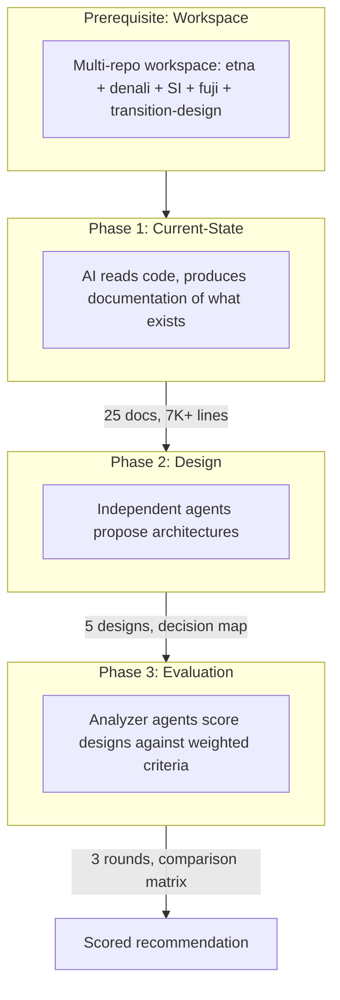
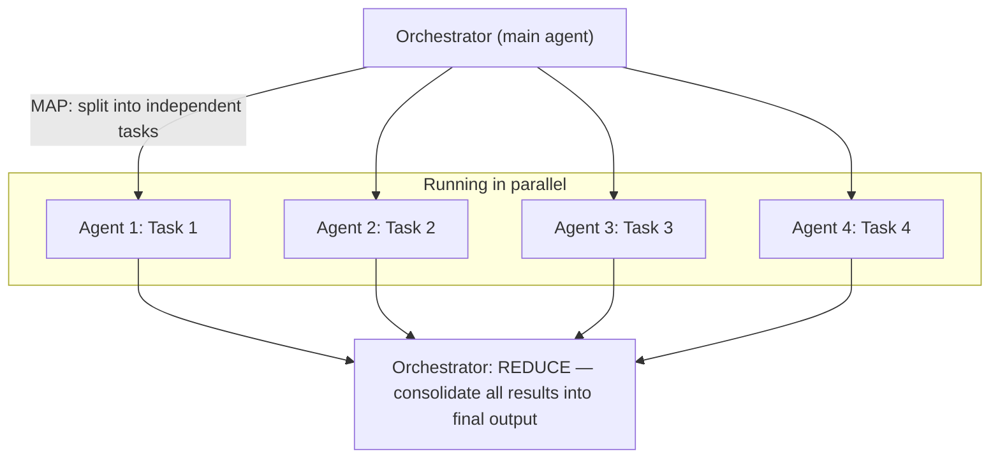
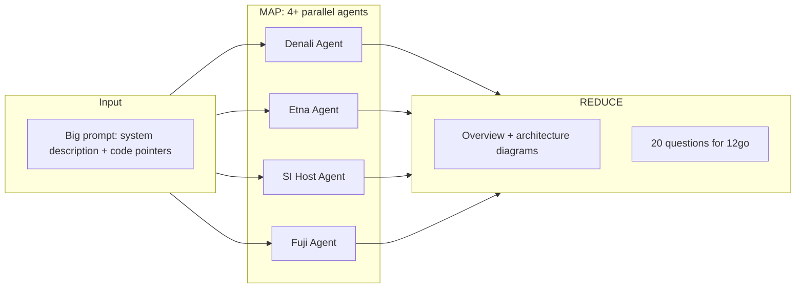
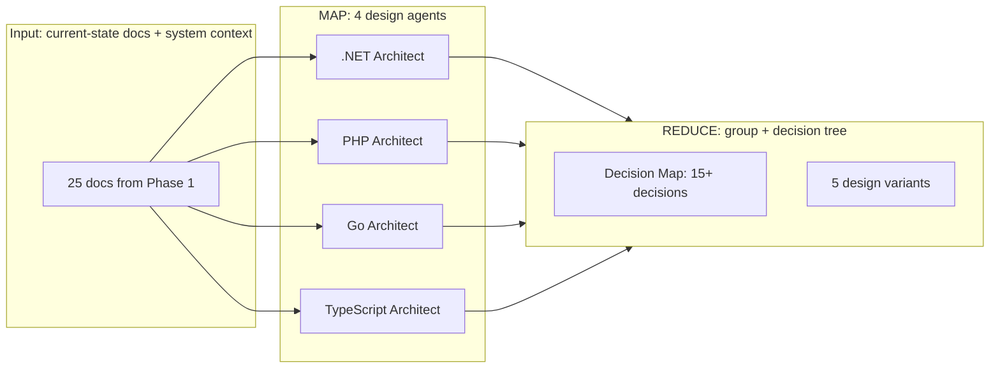
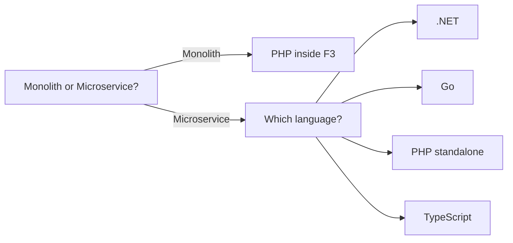
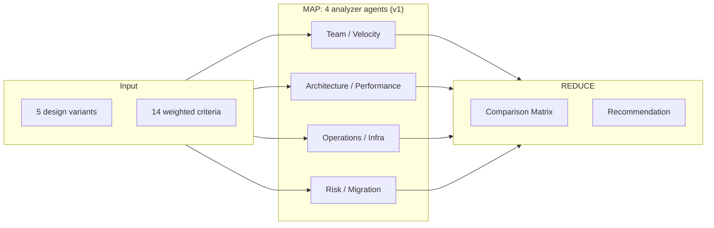
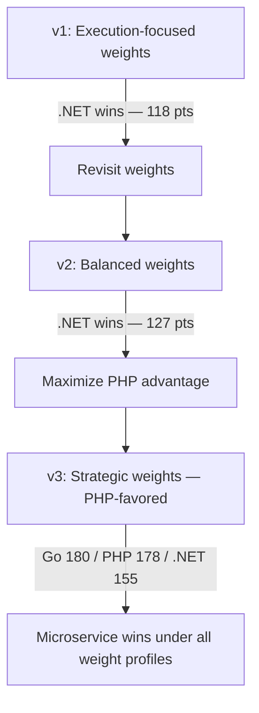
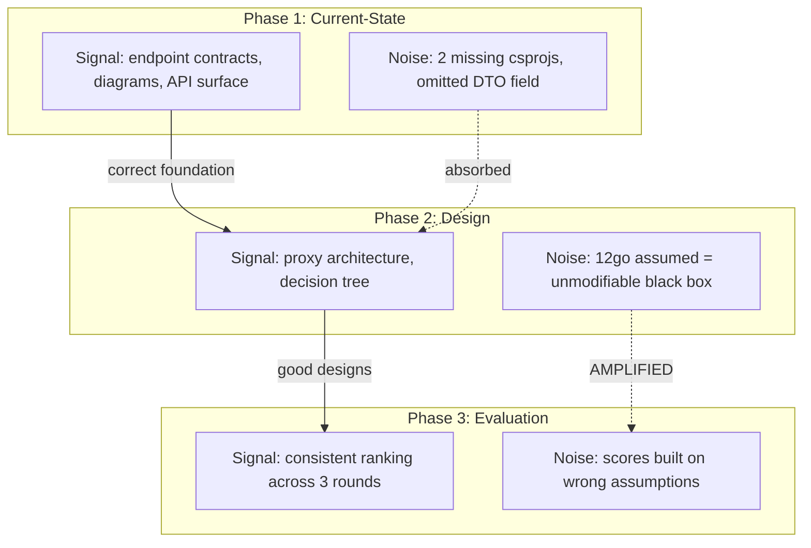
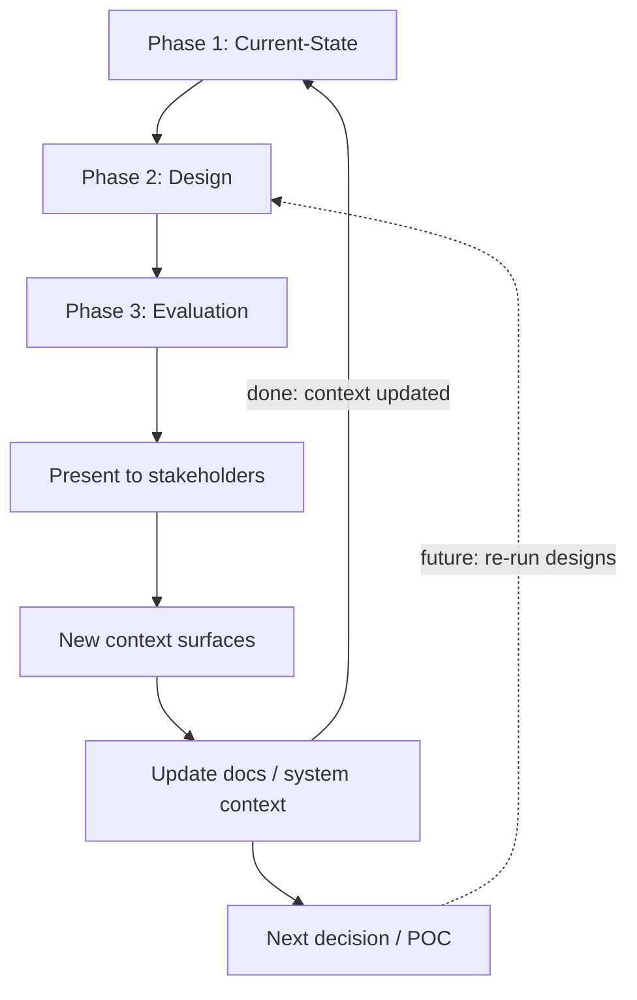

# AI-Driven Architecture Design

**Internal Presentation** | Mar 2026

---

## How I Approach Working with AI

### The Tooling Layer: Car, Engine, Driver

Think of AI coding tools in three layers:

| Layer                      | Analogy                                      | Examples                              |
| -------------------------- | -------------------------------------------- | ------------------------------------- |
| **Tool** (IDE integration) | The car -- chassis, controls, UX             | Cursor, Copilot, Claude Code          |
| **Model** (LLM)            | The engine -- capability, power              | Claude Opus, Sonnet, Gemini Flash/Pro |
| **Human**                  | The driver -- direction, judgment, decisions | You                                   |

A great engine in the wrong hands still crashes. A skilled driver with a weak engine is limited. The driver decides where to go and how to get there -- the engine provides the power.

Not every drive needs a racing engine. I use different models for different tasks:

| Mode          | Model                              | When to use                                                        |
| ------------- | ---------------------------------- | ------------------------------------------------------------------ |
| **Planning**  | Opus, Gpt, Gemini Pro, Sonnet      | Design proposals, synthesis, decisions requiring deep reasoning    |
| **Execution** | Sonnet, Gemini Flash/Pro, Composer | Writing code from a clear spec, filling templates, mechanical work |

### The Model Layer: A Room Full of Specialists

The car analogy covers the tooling, but it misses something important about *the engine itself*. A real car engine produces the same horsepower regardless of where you drive. An LLM does not. The same model produces radically different output depending on the context you give it.

Think of the model as a room full of specialists -- architects, DBAs, DevOps engineers, PHP veterans, .NET seniors, junior developers -- all sitting silently. Your prompt is a question shouted into the room. **Who stands up to answer depends on how you phrase it.**

Ask a generic beginner question, and the junior developers rush to the front -- you get Stack Overflow territory. Give it a specific role, a concrete situation, and rich domain context, and different specialists activate.

> **A domain-specific example**: We needed to propose transition designs. If you ask the model "design a replacement for our B2B proxy layer" with an AWS Solutions Architect persona, it reaches for Lambda functions, API Gateway, Step Functions -- it tries to decompose the system into stateless transformations because that's what the "AWS architect" region of its knowledge does. Ask the same question with a ".NET architect" persona, and it proposes an EC2-hosted microservice with Minimal API and Refit. The input data is identical. The system description is identical. But the persona changes which design patterns the model reaches for. This is why we used 4 separate design agents -- not because we needed 4 answers, but because each persona activates different architectural instincts.

> **A generic example**: A user reports that their endpoint times out exactly after 60 seconds after deployment, with no logs or traces to identify what went wrong. The model immediately suggests checking AWS API Gateway's timeout configuration -- because "exactly 60 seconds" is a signature of API Gateway's default integration timeout. The user never mentioned AWS. The stack description never mentioned API Gateway. The model associated the symptom with a known pattern from its training data and surfaced it as the likely cause. That association can be helpful when the guess is right -- and misleading when the user is on Azure, or bare Kubernetes, or a completely different stack.

### Multi-Agent: From Driver to Fleet Dispatcher

With sub-agents, the analogy shifts. You are no longer a single driver -- you are a **fleet dispatcher**. You define routes, assign a driver to each car, send them out in parallel, and synthesize what they bring back. The orchestrator is the dispatcher. Sub-agents are drivers on independent routes. The map-reduce pattern is: dispatch the fleet, wait for all to return, consolidate findings.

---

## The Task: What I Was Trying to Do

The approaches described here are general. The specific task I applied them to: designing the B2B API transition.

We have 4 repositories (~342 .csproj projects) that essentially proxy HTTP calls from B2B clients to 12go. The goal was to design a replacement -- something simpler that preserves the client API contract, removes local storage, and fits into 12go's infrastructure.

This requires three distinct types of work: understanding what currently exists, proposing how to replace it, and evaluating the options against each other. All three are naturally parallelizable and well-suited to AI agents.

---

## The Approach: 3 Phases

Each phase builds on the one below. The output of one phase becomes the input context for the next.

| Phase                | Input                      | Agents                               | Output                                                           |
| -------------------- | -------------------------- | ------------------------------------ | ---------------------------------------------------------------- |
| **Prerequisite**     | Raw repos                  | --                                   | Workspace, `AGENTS.md`, context prompts                          |
| **1. Current-State** | Big prompt + code pointers | 4+ documenter agents                 | 25 markdown files (13 endpoints, 4 cross-cutting, 3 integration) |
| **2. Design**        | Current-state docs         | 4 design agents (v1: 1 per language) | Monolith design + 4 microservice variants, decision map          |
| **3. Evaluation**    | Design docs + criteria     | 4 analyzer agents (v1) x 3 rounds    | 12 analysis reports, 3 comparison matrices, recommendation       |

---

## How Sub-Agents Work: Map-Reduce

The orchestrator (main AI agent in Cursor) breaks a large task into independent subtasks, spawns parallel sub-agents, waits for them to finish, and consolidates the results.

This matters because:

- **Independence** -- each agent works on a separate concern, no interference between them
- **Speed** -- 4 agents in parallel instead of 4 sequential analyses
- **Quality** -- each agent gets a focused prompt with role and constraints instead of one massive prompt trying to cover everything

---

## Phase 1: Document the Current State

**Goal**: Turn undocumented source code into structured documentation that AI (and humans) can use as foundation for design.

**Why code pointers matter**: Current repos have 50+ csprojs. Letting AI explore blindly wastes context and time. Instead, the initial prompt gave specific pointers -- which controllers matter, where the 12go integration lives, what the client flow looks like. AI then traced the actual code to produce docs with real DTOs, real sequence diagrams, real endpoint contracts.

**Verification**: Manually spot-checked a few generated documents against actual source code. If those were accurate, the rest was trusted.

**Output**: 25 markdown files, 7,386 lines

| Category                | Count | Examples                                                  |
| ----------------------- | ----- | --------------------------------------------------------- |
| Endpoint docs           | 13    | search, get-itinerary, create-booking, confirm, seat-lock |
| Cross-cutting           | 4     | authentication, monitoring, data-storage, messaging       |
| Integration analysis    | 3     | 12go API surface, service layer, caching strategy         |
| Context docs            | 2     | system-context.md, codebase-analysis.md                   |
| Overview + coordination | 3     | current-state/overview.md, questions/for-12go.md, README  |

### This Step Should Not Have Been Necessary

In a healthy environment, Phase 1 wouldn't exist as a one-time catch-up effort. Documentation of what a system does -- its contracts, flows, and trade-offs -- should accumulate continuously as the system is built. Product, QA, architects, and developers all contribute. Not just for humans to read, but so that AI agents can use it as a reliable starting point instead of having to reverse-engineer knowledge from source code.

This documentation effort was done here from scratch because the documentation was not discoverable. Not "it didn't exist" in the literal sense -- there may be pages scattered across Notion or Confluence -- but if nobody can find them, and they are not actively enforced and maintained, they are as good as non-existent in practice. Months earlier, similar AI-first documentation was built for the `supply-integration` repository -- and because that repo already had it, AI could digest its code far more easily during this transition work. The contrast is telling: when documentation exists *and is discoverable*, AI just uses it. When it doesn't, you spend a full phase creating it before any real work can begin.

**The cost of undiscoverable systems is rising.** When knowledge lives in developers' heads and decisions happen verbally, not only does onboarding new people take longer -- AI-assisted development is also degraded. An AI agent working from code alone will miss context that a well-maintained doc would have made explicit in seconds. The Phase 1 work is technical debt, accumulated from not writing down what you know as you build -- or from writing it down somewhere nobody looks.

---

## Phase 2: Propose Designs

**Goal**: Generate multiple architecture proposals independently.

Each design agent received the same input -- current-state docs, system context, constraints (preserve 13 endpoints, <10K LOC, no DynamoDB) -- but a different persona.

**These are the v1 agents that actually ran.** They were organized by language. This was a deliberate choice -- and a *flawed* one, as explained below.

| Agent                | Persona                                                                           |
| -------------------- | --------------------------------------------------------------------------------- |
| .NET Architect       | Senior .NET architect specializing in lean, high-performance API services         |
| PHP Architect        | Symfony expert focused on monolith-first pragmatism and infrastructure alignment  |
| Go Architect         | Go systems engineer focused on simplicity, performance, and minimal dependencies  |
| TypeScript Architect | Full-stack architect focused on developer experience and AI-augmented development |

**Key insight**: The 4 agents converged on similar structures. The .NET agent proposed a microservice; the PHP agent proposed a monolith. But the core proxy pattern was the same across all. This convergence made it natural to group the proposals into a decision tree after the fact -- not as a pre-planned structure, but as a way to make sense of what the agents produced.

**Decision tree (constructed after convergence)**. The agents weren't asked to answer a tree of sub-decisions. They were each asked "design the whole transition." But because their outputs overlapped so heavily, the differences could be organized as branching points: monolith or microservice? If microservice: which language? If that language: which framework?

**What this revealed about the "room full of specialists" metaphor**: Organizing agents by *language* is organizing them by the technology shelf -- the same specialists, just asked to answer in different dialects. They all reached for the same proxy architecture because they were all asked the same underlying question. The real diversity comes from asking different *questions* -- from activating different regions of the model's knowledge. The language choice should fall out of the worldview rather than being baked in. This insight drove the redesign of the agent set for the next iteration (see below).

---

## Phase 3: Evaluate Designs

**Goal**: Score each design variant against weighted criteria using independent evaluator agents.

**The 3 evaluation rounds (sensitivity analysis)**: A scored recommendation is only useful if it's stable under reasonable changes to the weights. After the first run, the weights felt wrong -- too execution-focused. Criteria were revised and the full pipeline was re-run. A third version deliberately boosted weights to favor PHP/monolith, stress-testing whether the recommendation was robust. If the winner had flipped under v3 weights, the recommendation would have been "it depends on what you value" rather than a clear pick.

**Key takeaway**: Even when weights were manipulated to favor PHP monolith, it never won outright. The microservice pattern was consistently preferred across all 3 rounds.

---

## Error Propagation Between Phases

Each phase introduces some inaccuracy -- from AI hallucination, incomplete prompting, or missing context. The question is: does the next phase absorb the error or amplify it?

| Error Type    | Example                                   | Impact                                                                                                                                                                                                                           |
| ------------- | ----------------------------------------- | -------------------------------------------------------------------------------------------------------------------------------------------------------------------------------------------------------------------------------- |
| **Absorbed**  | Reported 56 csprojs, actually 58          | Zero impact on architecture decisions                                                                                                                                                                                            |
| **Absorbed**  | Missing one field in booking DTO doc      | Design pattern is the same either way                                                                                                                                                                                            |
| **Absorbed**  | Incomplete description of caching layers  | Design eliminates all caches anyway                                                                                                                                                                                              |
| **AMPLIFIED** | Assumed 12go is an unmodifiable black box | All designs treated F3 as external-only. Meeting revealed F3 can be modified -- changed the entire option space                                                                                                                  |
| **AMPLIFIED** | Event requirements were unknown           | Sunsetting .NET services would drop events the data team may still depend on -- not surfaced until the meeting                                                                                                                   |
| **Caught**    | Arithmetic errors in comparison matrix    | AI summed weighted scores incorrectly in Phase 3. Required manual intervention to verify and correct the totals. Score rankings were right, but the exact numbers were off -- a reminder that numerical reasoning is a weak spot |

**The architect's abstraction principle**: This is the same tolerance a human architect applies. When designing at the system level, a missing DTO field doesn't change the architecture. The risk is in *structural* assumptions, not implementation details.

**Phase 3 is most sensitive**: It sits at the top of the pyramid and inherits errors from both Phase 1 and Phase 2. An incorrect structural assumption in Phase 1 that survives into Phase 2 will distort the evaluation scores in Phase 3.

---

## The Feedback Loop

The process doesn't end with evaluation. Presenting the results to stakeholders surfaces new information that feeds back into the documentation.

**What the meeting revealed**:

- F3 breakdown is planned (no timeline) -- code written inside F3 today may require a second migration
- Sunsetting .NET services would drop events that the data team may still depend on -- the meeting revealed this was an open question, not a resolved one (F3 currently publishes events for ClickHouse; it's unclear which of our events need to be preserved or recreated)
- .NET microservice was not ruled out -- decision deferred, not rejected
- 12go is not a black box -- the assumption that shaped all designs was wrong

**Where the loop stands now**: System context and current-state docs were updated after the meeting. Phase 2 has not been re-run yet -- that would happen once the POC is complete and the architecture decision is revisited.

**Result**: Decision deferred. POC requested: implement Search endpoint inside F3 to evaluate friction. The full documentation produced by this process is being used to implement that POC.

---

## Next Iteration: Perspective-Based Agents

The v1 language-based agents (Phase 2) and concern-based analyzers (Phase 3) taught us what works and what doesn't. The v4 agents are designed to address the convergence problem and the gaps surfaced by the meeting. They have not run yet -- they are queued for when the POC completes and the architecture decision is revisited.

### v4 Design Agents

The key change: agents are organized by *perspective*, not by language. Each starts from a different first question, which activates a different cluster of patterns in the model. The language/framework choice falls out of the worldview rather than being baked in.

| Agent                   | Perspective                                                     | First Question                                                          |
| ----------------------- | --------------------------------------------------------------- | ----------------------------------------------------------------------- |
| Pragmatic Minimalist    | Migration skeptic who has watched rewrites fail                 | "Does solving this actually require a rewrite?"                         |
| Platform Engineer       | DevOps engineer who operates 12go's infrastructure              | "Who debugs this at 3am when the on-call only knows PHP?"               |
| Data Flow Architect     | Event/data architect who sees services as nodes in a data graph | "When we sunset .NET services, what events disappear?"                  |
| Team-First Developer    | DX advocate who starts from the humans building the system      | "Will this team still want to work here in 6 months?"                   |
| Disposable Architecture | Architect designing explicitly for replaceability               | "When F3 is decomposed, how painless is replacing what we built?"       |
| Clean Slate Designer    | Contract-first architect with zero legacy anchoring             | "If I were building this from two API specs today, what would I build?" |

Why this should produce better results:

- **The Pragmatic Minimalist** directly addresses the meeting feedback: maybe a full rewrite isn't necessary. The v1 agents all assumed a rewrite was the answer.
- **The Data Flow Architect** addresses the event correlation gap that wasn't surfaced until the meeting. No v1 agent audited what events would be lost.
- **The Platform Engineer** grounds the design in operational reality -- something the v1 language-based agents largely ignored.
- **The Clean Slate Designer** is deliberately isolated from the existing implementation, providing a "what if we started fresh?" baseline that the other agents can be compared against.

### v4 Analyzer Agents

The v1 analyzers were organized by concern (Team/Velocity, Architecture/Performance, Operations/Infra, Risk/Migration). The v4 set adds a Red Team agent and rebalances scoring around what we learned matters most.

| Agent             | Role                                                          | Scores?                                                           |
| ----------------- | ------------------------------------------------------------- | ----------------------------------------------------------------- |
| Red Team          | Finds hidden assumptions and fatal flaws in each design       | No -- produces failure mode analysis                              |
| Execution Realist | "Can these 3-4 people actually build this?"                   | Yes -- effort, velocity, competency match, migration risk         |
| AI Friendliness   | Evaluates how well each design works with Cursor/Claude       | Yes -- AI code generation quality, testing, navigability          |
| Technical Merit   | Pure architecture quality, latency, resilience, observability | Yes -- performance, simplicity, infrastructure fit, disposability |

The Red Team agent is the most important addition. The "12go is a black box" assumption that distorted the v1 designs is exactly the kind of error a Red Team would catch: a structural assumption treated as fact that no one challenged.

AI Friendliness is elevated to a first-class criterion. Given the team's heavy use of AI coding tools, how well a codebase works with Cursor/Claude is a real productivity factor, not a novelty.

---

## Side Effects: What We Got For Free

The primary goal was a scored recommendation. The process also produced artifacts that are independently valuable.

### Artifacts

- **25 docs** (13 endpoints, 4 cross-cutting, 3 integration analyses, 2 context docs, 3 coordination) -- now used directly for F3 POC implementation
- **Technical spec generation** -- the current-state docs made it possible to generate a technical specification for [ST-2432](https://one2go.atlassian.net/browse/ST-2432) (B2B search POC) without much effort; the structured documentation fed directly into the spec
- **System context document** -- onboarding material for new developers and AI agents, capturing domain knowledge that previously lived only in people's heads
- **Decision map** -- 15+ decisions with options and trade-offs, ready for any future re-evaluation
- **Reusable prompt templates** -- design agents, analyzer agents, evaluation criteria -- can be applied to any future design task
- **Meeting-ready presentation** -- diagrams and scored comparison tables, ready to present without additional preparation

### The Discoverability Problem

Before this process, a developer asking "how does the booking flow work?" had to read source code across 3 repositories. Now there is a document with a sequence diagram. **But this only helps if the documentation is discoverable.** A repo that only the author knows about is not much better than no docs. Two options:

- **Push to where people already look** -- publish key docs to Confluence or Notion so they surface in existing searches
- **Adopt the sidecar repo as a convention** -- agree as a team that `transition-design` is the authoritative knowledge base for this module, and that developers working on it open it alongside the source repos (the way it's set up in this workspace)

Both are valid. The sidecar approach has the advantage that documentation lives close to the code and can be versioned with it. The trade-off is that it requires a team agreement to actually use it.

---

## What I'd Do Differently

1. **Validate structural assumptions with stakeholders before Phase 2, not after Phase 3.** The "12go is a black box" assumption distorted every design and every evaluation score. A 30-minute conversation before launching the design agents would have caught this. The lesson: AI can explore a codebase, but it cannot know what the organization has decided unless you tell it.
2. **Use perspective-based agents from the start.** Organizing by language felt like the obvious axis, but it produced the same proxy architecture in four dialects. The v4 perspective-based agents were designed in response to this -- the cost was one wasted iteration.
3. **Verify AI arithmetic.** The comparison matrix scores were wrong. The rankings were correct, but the exact totals were off because LLMs are unreliable at multi-step arithmetic. In the next iteration, I would either export scores to a spreadsheet for calculation or have the AI generate the formula and a human verify the output.

---

## What This Presentation Does Not Do

This presentation shows one approach to one task. It does not hand you a ready-made workflow.

- **Each developer is responsible for adapting these patterns to their own daily work.** The map-reduce pattern, the phased approach, the prompt templates -- these are tools. Whether and how you use them is up to you.
- **We still need to decide where documentation and rules live.** Right now, context docs sit in `transition-design/`, agent rules sit in `supply-integration/rules/`, and nothing is in Confluence. We need a team decision on where shared knowledge should accumulate so that both humans and AI can find it.
- **AI can bridge our existing tools.** I use MCP (Model Context Protocol) integrations with Jira, Confluence, and Notion -- meaning the AI agent can read from and write to those systems directly. For example, it can create Jira tickets from a design doc, publish documentation to Confluence, or query Notion for context. This is not set up for the team yet, but it's available.

