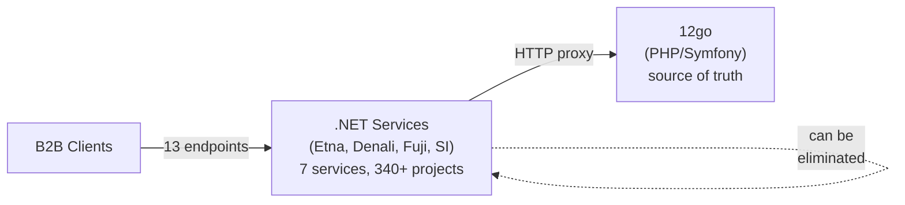
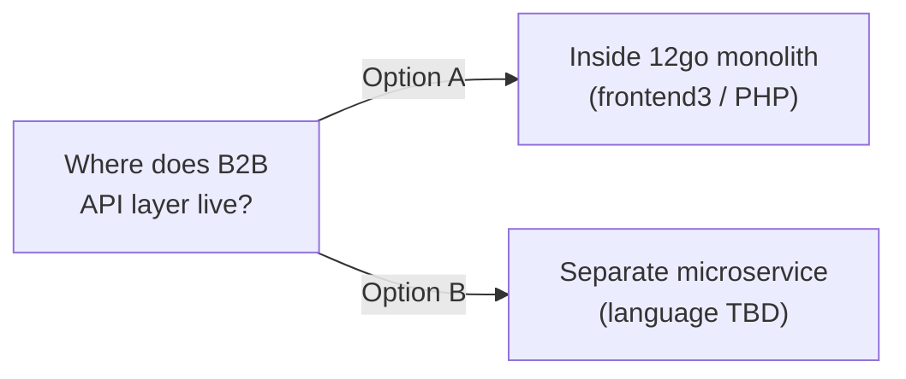
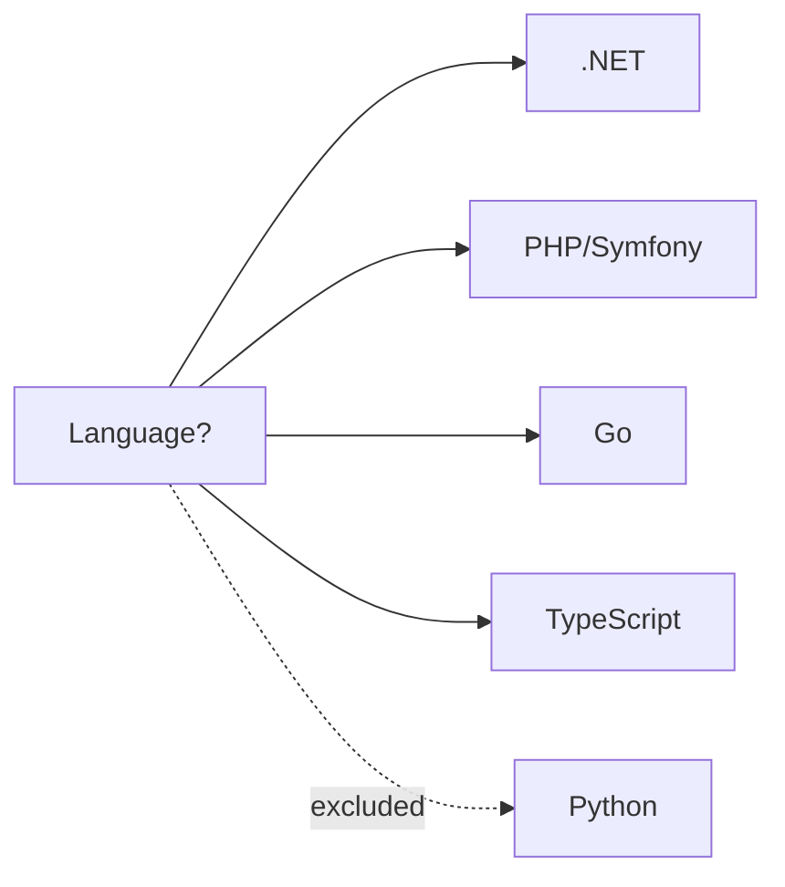
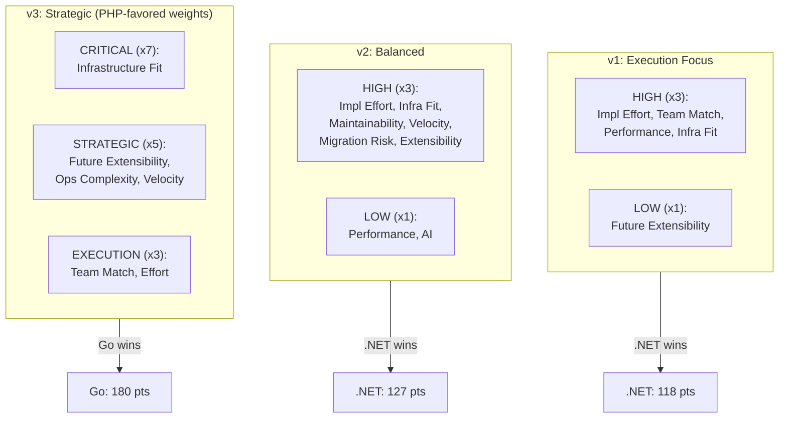
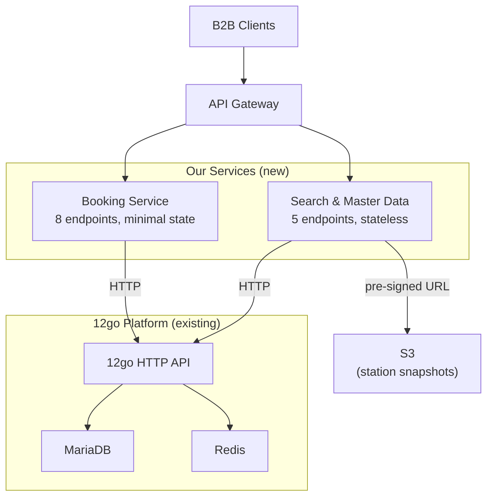

# B2B Transition: Two Decisions

**Meeting** | Feb 25, 2026 | 30 min

---

## Context

We have 7 .NET services that act as an HTTP proxy layer between B2B clients and 12go. All data originates from 12go. Every piece of local storage we maintain (DynamoDB, PostgreSQL, HybridCache) is a copy of what 12go already has.

**Goal**: Replace these services with something simple that preserves the client API contract, removes our local storage, and fits into 12go's infrastructure.

---

## Decision 1: Monolith or Microservice?

> **Where does the new B2B API layer live?**

### Side-by-Side

|                       | **A: Monolith**                                                                                                            | **B: Microservice**                                                                                                                                   |
| --------------------- | -------------------------------------------------------------------------------------------------------------------------- | ----------------------------------------------------------------------------------------------------------------------------------------------------- |
| **What it means**     | New Symfony controllers inside frontend3 calling 12go service classes in-process                                           | Standalone HTTP proxy service(s) deployed on 12go infra, calling 12go's HTTP API                                                                      |
| **Performance**       | Zero network hop -- in-process calls                                                                                       | Negligible added latency -- services are co-located in the same cloud. B2B clients already tolerate the HTTP hop latency in the current architecture. |
| **Coupling**          | Deep -- tied to 25+ internal 12go classes (`BookingProcessor`, `SearchService`, `CartHandler`). Breaks when they refactor. | Loose -- depends only on 12go's public HTTP API contract                                                                                              |
| **Deployment**        | Ships with the monolith -- same release cycle as all of 12go                                                               | Independent deploy, independent rollback                                                                                                              |
| **Team impact**       | Stuck with PHP — no language flexibility                                                                                  | Language flexibility — can choose a language the team is productive in                                                                                |
| **12go team impact**  | They own our code -- it lives in their repo, their CI, their review process                                                | They host our Docker container -- standard infra, no code ownership                                                                                   |
| **Failure isolation** | A bug in our B2B code can affect the entire monolith                                                                       | Our service fails independently -- 12go core is unaffected                                                                                            |
| **Adapting to 12go changes**  | Implement cross-cutting changes in one place — deploy with monolith                                                                                     | Must release monolith first, then modify microservice(s) to reflect the changes — two-step process                                                                                                                   |
| **Webhook transformation**    | B2B clients expect different notification shape than 12go provides. Subscribe to internal event in-process, new service lives in same process, call client webhook directly.                                             | Monolith would call our microservice via HTTP; we transform to client shape and deliver — extra network hop and service boundary                                                                                     |

**With a microservice**: 12go's HTTP API is a stable, documented contract. We already call it today. The microservice simply removes the 6 layers of abstraction (.NET framework, SI Host, MediatR pipeline, DynamoDB caching, Kafka events) between us and that API.

### We Evaluated This From 3 Angles

To avoid bias, we scored all options using three different weighting frameworks. Each one shifts priorities to stress-test whether the winner changes. ([Evaluation criteria](../design/README.md#versioned-evaluations-v1-v2-v3) — v1, v2, v3)

- **v1** -- weights favor execution speed and team productivity
- **v2** -- balanced weights across execution, infrastructure, and strategy
- **v3** -- weights heavily favor infrastructure fit and strategic alignment (deliberately designed to give the monolith/PHP the best possible chance)

All three reached the same conclusion on this decision:

| Analysis               | Monolith (A)? | Microservice (B)? |
| ---------------------- | ------------- | ----------------- |
| v1 (execution-focused) | --            | **B**             |
| v2 (balanced)          | --            | **B**             |
| v3 (strategic-focused) | --            | **B**             |

**Consensus is unanimous.** Microservice wins because the coupling cost of the monolith outweighs the in-process performance benefit, and the latency overhead is negligible when co-located.

---

## What Does the Microservice Actually Do?

Before choosing a language, it helps to understand what we're building. Most of the service is straightforward HTTP proxying. But there are a few areas with real complexity:

### Complexity Map

| Component                       | Complexity | Why                                                                                                                                                                                                                                                                                                                                                                                                                                                                                                                                     |
| ------------------------------- | ---------- | --------------------------------------------------------------------------------------------------------------------------------------------------------------------------------------------------------------------------------------------------------------------------------------------------------------------------------------------------------------------------------------------------------------------------------------------------------------------------------------------------------------------------------------- |
| **Booking schema parser**       | **High**   | 12go's checkout endpoint returns a flat JSON object with 20+ dynamic field names matched by wildcard patterns (`selected_seats_`*, `points*[pickup]`, `delivery*address`). The parser must classify each field, build the client-facing schema, and later reverse-map client passenger data back into the exact flat bracket-notation format (`passenger[0][first_name]`) for the reserve request. This is ~500 lines of battle-tested C# logic that encodes years of production edge cases. **Highest test priority in any language.** |
| **Station ID translation**      | **Medium** | Bidirectional mapping: clients send Fuji station IDs, 12go expects province IDs for search and internal IDs for other calls. Responses must reverse-map back. The mapping data itself is static-ish (loaded from a file), but it touches every search request and every booking response.                                                                                                                                                                                                                                               |
| **Cancellation policy mapping** | **Medium** | 12go returns integer policy codes + free-text message. Clients expect structured time-windowed penalty rules with ISO 8601 durations. Requires a mapping table ported from existing .NET logic.                                                                                                                                                                                                                                                                                                                                         |
| **Notification transformer**    | **Medium** | 12go sends `{bid}` with no client context. Must call 12go to get booking details, resolve which B2B client owns it, transform the payload shape, and deliver to the client's webhook URL with retry logic.                                                                                                                                                                                                                                                                                                                              |
| **Everything else**             | **Low**    | Search, GetBookingDetails, GetTicket, Confirm -- these are straightforward request translation + response mapping. The proxy pattern is the same for each: authenticate, translate IDs, call 12go, map response, enforce money format.                                                                                                                                                                                                                                                                                                  |

**Bottom line**: ~80% of the code is mechanical proxy logic. The booking schema parser is the one piece that demands careful porting and thorough testing regardless of language choice.

---

## Decision 2: Which Language?

> **If microservice, what do we build it in?**

### The Case for Each Language

**.NET** -- The team has 12+ years of .NET expertise. Zero ramp-up. The existing booking schema parser, station mapping logic, and reserve data serializer can be ported line-by-line from the current C# codebase. Ships as a standard Docker image. The risk: .NET is a foreign runtime in 12go's PHP/Go ecosystem. 12go's DevOps team would need to support new Microsoft base images, new CI/CD vulnerability scanning, and .NET-specific profiling tools (`dotnet-trace`, `dotnet-dump`) that nobody else in the organization uses.

**PHP/Symfony** -- Native alignment with 12go's core stack. Same base images, same CI/CD pipeline, same debugging tools. If 12go engineers ever need to touch the service, it's familiar territory. The downside: our team has no PHP experience. Every line of code would be a learning exercise. The booking schema parser -- the most complex piece -- would need to be rewritten in an unfamiliar language. AI tools can help, but validating AI-generated PHP when you don't know the idioms is risky.

**Go** -- Go is potentially part of 12go's future technical direction (to be confirmed). It's statically typed and compiled like C#, making it the most natural transition for .NET developers among the non-.NET options. Go's standard library handles HTTP, JSON, and concurrency natively -- no framework needed. Compiles to a single binary, ships as a minimal Docker image. The learning curve is real but bounded: Go's surface area is deliberately small. Senior engineers typically become productive in 2-3 weeks. Whether Go is actually the strategic direction at 12go is an open question for this meeting.

**TypeScript/Node.js** -- Highest synergy with AI coding tools (largest training corpus). Familiar to most developers. Strong testing ecosystem. NestJS provides .NET-like dependency injection patterns. The gap: TypeScript has no strategic alignment with 12go's PHP/Go direction. It would be another "foreign" runtime on their infrastructure, similar to .NET but with a broader hiring pool.

**Python (excluded)** -- Python was excluded from evaluation. The GIL limits true concurrency, making it a poor fit for a high-throughput HTTP proxy. Python's weak runtime type system increases the risk of subtle bugs in the complex booking schema mapping logic where type safety matters. There's no strategic alignment with 12go (they don't use Python), and there's no team familiarity advantage over Go or TypeScript.

### How the 3 Analyses Scored Languages

The same three weighting frameworks introduced above were applied to the language decision. ([Evaluation criteria](../design/README.md#versioned-evaluations-v1-v2-v3)) Here's how the weights shifted across versions:

### v3 Was Designed to Give PHP Every Advantage

In v3, we deliberately cranked up the weights that favor PHP:

- **Infrastructure Fit at x7** (PHP scores 5/5 here -- identical runtime to frontend3)
- **Future Extensibility at x5** (PHP scores 5/5 here)
- **Operational Complexity at x5** (PHP scores 4-5/5 here)
- **Team Competency Match dropped to x3** (where .NET dominates)

Even with these weights maximally favoring PHP, it came in second (178 pts). Go edged it out (180 pts) because Go matches PHP on future extensibility (if Go is indeed the strategic direction) while being more approachable for our .NET team in terms of velocity and code elegance.

### Score Comparison Across All 3 Analyses

| Language         | v1 (of 140)   | v2 (of 150)   | v3 (of 235)   | Pattern                                                                      |
| ---------------- | ------------- | ------------- | ------------- | ---------------------------------------------------------------------------- |
| **.NET**         | **118** (1st) | **127** (1st) | 155 (4th)     | Dominates when team execution is weighted highest                            |
| **TypeScript**   | 113 (2nd)     | 118 (2nd)     | 154 (5th)     | Consistent middle -- best AI synergy, no strategic fit                       |
| **Go**           | 105 (3rd)     | 112 (3rd)     | **180** (1st) | Rises when strategic alignment is weighted highest                           |
| **PHP/Symfony**  | 102 (4th)     | 108 (4th)     | 178 (2nd)     | Strong only when infra fit matters most *and* we accept the productivity hit |
| **Monolith PHP** | 98 (5th)      | 102 (5th)     | 168 (3rd)     | Best infra fit, but coupling + team impact drag it down                      |

---

## Appendix A: Target Architecture

([Monolith design](../design/alternatives/A-monolith/design.md) — Option A for comparison)

Two services, deployed as Docker containers on 12go infra:

**What gets eliminated**: Etna (2 services), Denali (3 services), Fuji (1 service), SI Framework, all DynamoDB tables, PostgreSQL, HybridCache, Kafka events, 340+ .NET projects.

**What remains**: ~5-8K lines of proxy logic, station ID mapping, booking schema parser.
